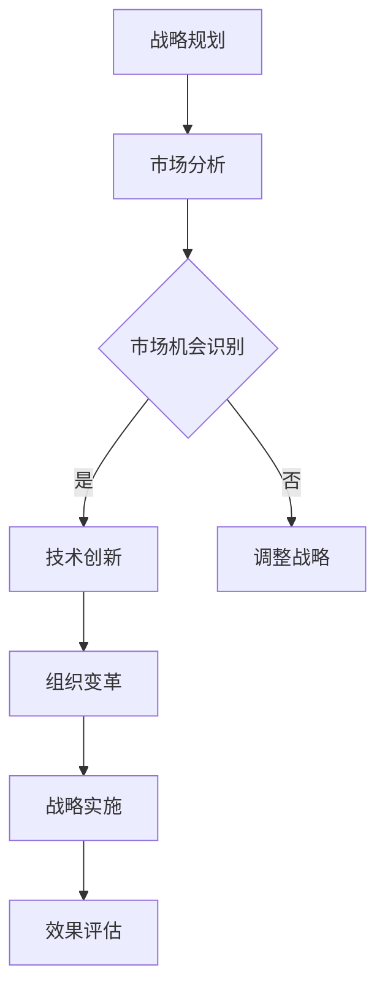
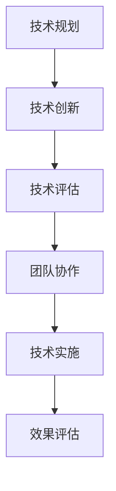
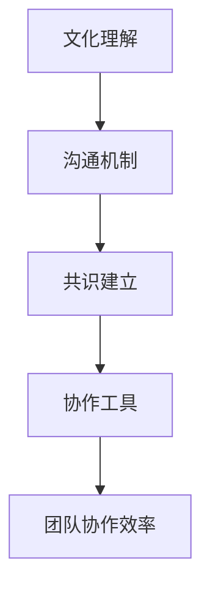

                 

### 文章标题

《技术管理者的战略思维与全局观培养》

### 关键词

战略思维、全局观、技术管理、决策制定、团队协作、人工智能、云计算、区块链

### 摘要

本文旨在探讨技术管理者的战略思维与全局观培养，通过深入分析战略思维和全局观的内涵、重要性，以及其在实际应用中的具体方法和实践案例，为技术管理者提供系统的培养路径。文章分为三个主要部分：战略思维培养、全局观培养和实践应用，通过理论与实践的结合，帮助技术管理者提升战略规划和决策能力，增强全局观念，从而在复杂的技术环境中有效管理团队和项目。

## 引言

### 战略思维与全局观的重要性

在信息技术迅猛发展的时代，技术管理者不仅需要具备扎实的技术背景，还需要具备战略思维和全局观。战略思维是指对组织未来发展的长远规划和决策能力，而全局观则是对整体技术领域和发展趋势的全面理解和把握。这两个概念对于技术管理者来说至关重要。

首先，战略思维帮助技术管理者从全局出发，制定清晰的发展目标，合理分配资源，有效应对外部环境的变化。通过战略思维，管理者能够明确组织的方向，确保团队在正确的道路上稳步前进。

其次，全局观使得技术管理者能够站在更高的视角，审视技术领域的发展趋势和竞争对手的动态。这不仅有助于管理者把握行业脉搏，还可以为团队的技术决策提供有力支持。

然而，许多技术管理者在实际工作中往往面临以下挑战：

1. **缺乏战略规划能力**：管理者可能过于关注短期目标，忽视了长远规划的重要性。
2. **全局观不足**：对行业趋势和竞争对手的了解不够深入，难以做出明智的决策。
3. **团队协作困难**：在复杂的技术环境中，缺乏有效的团队协作和沟通机制。

本文将通过深入分析和具体案例，探讨如何培养技术管理者的战略思维和全局观，以应对上述挑战，提升管理效能。

### 文章结构

本文分为三个主要部分：

1. **战略思维培养**：介绍战略思维的含义、重要性以及具体培养方法。
2. **全局观培养**：探讨全局观的概念、培养路径以及其在技术管理中的应用。
3. **实践应用**：通过具体案例，展示战略思维和全局观在技术管理中的实际应用，并提供最佳实践和总结。

## 战略思维培养

### 第1章：战略思维概述

#### 战略思维的含义与重要性

战略思维是一种系统性地思考和管理组织未来发展的能力。它不仅仅是制定一个目标或计划，而是通过分析内外部环境，制定长远的规划，以及灵活调整策略，确保组织能够持续发展。

在技术管理领域，战略思维的重要性体现在以下几个方面：

1. **明确发展目标**：战略思维帮助管理者明确组织的长远目标，确保团队在正确的方向上努力。
2. **资源合理分配**：通过战略规划，管理者能够合理分配资源，提高资源利用效率。
3. **应对变化**：技术领域变化迅速，战略思维使得管理者能够灵活应对外部环境的变化，保持组织的竞争力。
4. **决策支持**：战略思维为管理者的决策提供依据，减少盲目性，提高决策质量。

#### 战略思维的发展历程

战略思维并非一蹴而就，而是经历了长期的演变和发展。以下是一些关键阶段：

1. **早期战略管理**：20世纪50年代，战略管理开始引入到企业中，主要关注市场竞争和资源分配。
2. **竞争战略**：20世纪80年代，迈克尔·波特提出了竞争战略理论，强调企业应通过差异化、成本领先等策略获取竞争优势。
3. **战略规划**：20世纪90年代，企业开始注重长期规划，战略规划成为企业战略管理的重要组成部分。
4. **动态战略**：21世纪初，随着信息技术的发展，战略管理越来越关注快速变化的环境，动态战略应运而生。

#### 战略思维的核心要素

战略思维的核心要素包括：

1. **愿景与使命**：明确组织的长远目标和核心价值观。
2. **环境分析**：了解内外部环境，识别机会和威胁。
3. **目标设定**：明确具体的、可量化的目标。
4. **战略规划**：制定实现目标的详细计划。
5. **执行与监控**：确保战略规划的有效执行，并进行持续监控和调整。

### 第2章：战略规划

#### 战略规划的步骤与方法

战略规划是一个系统性的过程，通常包括以下步骤：

1. **明确愿景与使命**：这是战略规划的基础，需要明确组织的长远目标和核心价值观。
2. **环境分析**：通过PESTLE（政治、经济、社会、技术、法律、环境）分析等方法，了解内外部环境，识别机会和威胁。
3. **目标设定**：根据环境分析的结果，设定具体的、可量化的目标。
4. **战略选择**：根据目标和环境分析，选择合适的战略路径。
5. **战略实施**：制定详细的行动计划，确保战略规划的执行。
6. **监控与调整**：对战略执行进行监控，并根据实际情况进行调整。

#### 战略规划案例分析

**案例：某科技公司的战略转型**

某科技公司成立于2000年，最初主要从事软件开发和销售。随着市场的变化和竞争的加剧，公司意识到需要进行战略转型。

1. **愿景与使命**：公司明确了新的愿景：“成为全球领先的人工智能解决方案提供商”，使命是“通过人工智能技术，推动社会进步”。
2. **环境分析**：公司通过市场调研和竞争分析，发现人工智能是未来的趋势，且市场需求巨大。
3. **目标设定**：公司设定了具体的目标：在未来五年内，成为国内人工智能市场的领导者。
4. **战略选择**：公司决定聚焦人工智能领域，通过研发和创新，提供优质的人工智能解决方案。
5. **战略实施**：公司加大了研发投入，组建了专门的人工智能团队，并推出了多款人工智能产品。
6. **监控与调整**：公司定期评估战略执行情况，根据市场反馈进行调整。

通过这一战略转型，公司成功地抓住了人工智能的发展机遇，市场份额大幅提升，业绩稳步增长。

### 第3章：决策制定

#### 决策制定的原则与技巧

决策制定是战略思维的核心环节，以下是一些常见的决策制定原则和技巧：

1. **系统性思维**：将决策视为一个整体，综合考虑各种因素，避免片面决策。
2. **数据驱动**：基于数据和事实进行决策，减少主观判断的影响。
3. **风险意识**：识别潜在风险，制定应对策略。
4. **快速响应**：在变化迅速的环境中，快速做出决策。
5. **团队参与**：鼓励团队成员参与决策，提高决策的执行力和认可度。

#### 决策制定案例分析

**案例：某互联网公司的产品决策**

某互联网公司是一家提供在线教育服务的公司。在一次产品迭代中，公司面临是否增加新功能的选择。

1. **系统性思维**：公司首先分析了市场需求、用户反馈和技术可行性，确定增加新功能的价值。
2. **数据驱动**：公司收集了用户调研数据，发现大部分用户希望增加互动功能。
3. **风险意识**：公司分析了技术实现难度和潜在成本，制定了相应的风险应对措施。
4. **快速响应**：公司决定快速开发新功能，以应对市场变化。
5. **团队参与**：公司组织了跨部门会议，讨论了新功能的实施细节，确保决策的执行。

通过这一决策过程，公司成功增加了新功能，提升了用户满意度，市场份额进一步扩大。

### 战略思维培养小结

通过本章的介绍，我们了解了战略思维的含义、重要性以及具体培养方法。战略思维不仅是技术管理者的重要能力，也是组织持续发展的关键。通过战略思维，技术管理者能够更好地规划组织发展，做出明智的决策，提高管理效能。在实际应用中，管理者需要结合具体情况进行战略规划，并灵活调整决策，以应对快速变化的技术环境。

### 全局观培养

### 第4章：技术发展趋势

#### 当前技术发展趋势

随着信息技术的不断进步，技术发展趋势呈现出多元化、智能化和互联化的特点。以下是一些当前主要的技术发展趋势：

1. **人工智能**：人工智能技术在各个领域得到广泛应用，包括图像识别、自然语言处理、机器学习等。随着算法和计算能力的提升，人工智能正在逐渐改变传统行业，提高生产效率和决策质量。
2. **云计算**：云计算提供了灵活、高效、可扩展的计算资源，使得企业能够降低成本、提高敏捷性。云计算技术的发展，如容器化、大数据和边缘计算，正在进一步推动数字化转型的进程。
3. **区块链**：区块链技术以其去中心化、安全性和透明性等特点，被广泛应用于金融、供应链管理、物联网等领域。区块链技术的创新，如智能合约和分布式存储，有望改变传统商业模式和行业规则。

#### 技术趋势对企业管理的影响

技术发展趋势对企业管理产生了深远的影响：

1. **业务模式创新**：技术趋势推动了传统业务模式的变革，如电商、共享经济等新模式的崛起，改变了市场竞争格局。
2. **运营效率提升**：人工智能和云计算等技术提高了企业的运营效率，降低了成本，提升了服务质量。
3. **数据安全与隐私**：随着数据量的大幅增加，数据安全和隐私问题成为企业管理的重要挑战，需要采取有效的安全措施和隐私保护策略。
4. **人才培养**：技术趋势要求企业培养具备新技术能力和跨学科知识的员工，以适应快速变化的市场需求。

#### 技术发展趋势案例分析

**案例：人工智能在电商行业的应用**

某电商平台通过引入人工智能技术，实现了业务的全面提升：

1. **个性化推荐**：利用机器学习算法，分析用户行为数据，提供个性化的商品推荐，提高了用户满意度和转化率。
2. **智能客服**：通过自然语言处理技术，搭建智能客服系统，减少了人工成本，提升了客户服务水平。
3. **智能库存管理**：利用人工智能技术优化库存管理，减少了库存成本，提高了供应链效率。

通过人工智能技术的应用，该电商平台在激烈的市场竞争中脱颖而出，取得了显著的业务增长。

### 第5章：技术管理

#### 技术管理的基本概念

技术管理是指对企业的技术活动进行规划、组织、领导和控制的过程。技术管理的基本概念包括：

1. **技术规划**：制定企业技术发展战略，明确技术目标和实施路径。
2. **技术组织**：建立技术团队，明确职责和协作机制，确保技术工作的有效推进。
3. **技术创新**：通过研发和创新，推动企业技术水平的提升，保持竞争优势。
4. **技术评估**：评估企业技术竞争力，识别技术风险和机会，为决策提供依据。

#### 技术管理的实践案例

**案例：某互联网企业的技术管理实践**

某互联网企业通过有效的技术管理，实现了业务的快速扩张：

1. **技术规划**：企业制定了详细的技术发展计划，明确了技术目标和发展路径，确保技术工作有序推进。
2. **技术组织**：企业组建了专业的技术团队，设立了技术研发部门，明确了各部门的职责和协作机制，提高了工作效率。
3. **技术创新**：企业持续投入研发，推动技术创新，推出了多款具有竞争力的产品，提升了市场地位。
4. **技术评估**：企业定期进行技术评估，识别技术风险和机会，为决策提供数据支持，确保技术投资的合理性和有效性。

通过这一系列技术管理实践，该互联网企业成功地应对了市场挑战，实现了持续的业务增长。

### 第6章：团队协作

#### 团队协作的重要性

在技术管理中，团队协作至关重要。有效的团队协作能够提高工作效率，促进知识共享，增强团队凝聚力，从而提升整体绩效。以下是一些团队协作的重要性：

1. **知识共享**：团队成员之间的协作，有助于知识的传递和共享，促进技术创新。
2. **资源整合**：团队协作能够整合各类资源，提高资源利用效率，降低成本。
3. **风险分担**：通过团队协作，可以共同应对工作中的挑战和风险，提高抗风险能力。
4. **创新氛围**：团队协作能够营造创新的氛围，激发团队成员的创造力和创新能力。

#### 高效团队协作的方法与技巧

以下是一些高效团队协作的方法和技巧：

1. **明确目标**：确保团队成员对项目目标和任务有清晰的认识，明确各自的责任和角色。
2. **建立沟通机制**：定期召开会议，保持信息透明，确保团队成员之间的沟通畅通。
3. **分工合作**：根据团队成员的特长和技能，合理分配任务，实现资源的最优配置。
4. **建立反馈机制**：及时收集团队成员的意见和建议，进行反馈和调整，确保项目进展顺利。
5. **培养团队文化**：营造积极向上的团队文化，增强团队凝聚力，激发团队活力。

#### 沟通技巧

良好的沟通是团队协作的核心。以下是一些沟通技巧：

1. **主动沟通**：主动与团队成员交流，分享信息和资源，促进团队合作。
2. **倾听**：倾听是沟通的关键，要尊重团队成员的意见和想法，理解他们的需求。
3. **清晰表达**：用简洁、明确的语言表达自己的观点和意见，避免误解和冲突。
4. **积极回应**：对团队成员的反馈和意见给予积极的回应，促进双向沟通。
5. **非言语沟通**：注意非言语沟通的技巧，如肢体语言、面部表情等，增强沟通效果。

#### 协作工具

现代团队协作离不开各种工具的支持。以下是一些常用的协作工具：

1. **项目管理工具**：如Trello、JIRA等，用于任务分配、进度跟踪和团队协作。
2. **沟通工具**：如Slack、Microsoft Teams等，用于实时沟通和协作。
3. **文档共享工具**：如Google Docs、OneDrive等，用于文档共享和协作编辑。
4. **视频会议工具**：如Zoom、Microsoft Teams等，用于远程会议和团队协作。

### 第7章：战略思维与全局观实践案例

#### 案例一：某科技公司的战略转型

**背景介绍**：

某科技公司成立于2005年，最初主要从事手机软件开发。随着智能手机的普及，公司逐渐扩展到手机硬件领域。然而，随着市场竞争的加剧，公司意识到需要战略转型，以保持竞争力。

**核心概念与联系**：

公司的战略转型涉及以下核心概念：

1. **愿景与使命**：明确公司的长远目标和核心价值观。
2. **市场分析**：分析市场需求和竞争态势。
3. **技术创新**：推动技术升级，提升产品竞争力。
4. **组织变革**：调整组织结构，优化管理流程。

**Mermaid流程图**：

**核心算法原理讲解**：

公司的战略转型过程可以概括为以下步骤：

1. **市场分析**：通过市场调研和数据分析，了解市场需求和竞争态势。
2. **技术创新**：根据市场分析结果，研发具有竞争力的新产品。
3. **组织变革**：调整组织结构，建立高效的管理流程，以适应新的战略方向。
4. **战略实施**：将新的战略目标分解为具体的行动计划，确保有效执行。
5. **效果评估**：定期评估战略执行效果，根据实际情况进行调整。

**数学模型和公式**：

战略转型的效果评估可以使用以下数学模型：

$$ 效果评估 = \frac{实际效益}{预期效益} $$

**举例说明**：

假设公司在战略转型后，研发出一种具有竞争力的智能手机，并在市场上取得了良好的销售成绩。通过效果评估，公司发现实际效益是预期效益的1.5倍，说明战略转型取得了成功。

**项目实战**：

1. **开发环境搭建**：搭建一个高效的研发环境，包括硬件设备、软件开发工具和协作平台。
2. **源代码详细实现**：开发团队根据市场需求，编写高质量的源代码，实现新的智能手机功能。
3. **代码解读与分析**：对源代码进行详细解读和分析，确保代码的可靠性、可维护性和扩展性。
4. **实际案例分析和详细讲解剖析**：通过对实际案例的分析，总结成功经验和教训，为后续战略转型提供借鉴。

**项目小结**：

通过这一战略转型案例，公司成功地抓住了市场机遇，提升了产品竞争力，实现了业务的持续增长。

#### 案例二：某互联网企业的技术管理实践

**背景介绍**：

某互联网企业成立于2010年，主要提供在线教育和社交平台服务。随着用户数量的增长，企业意识到需要加强技术管理，以保障系统的稳定性和安全性。

**核心概念与联系**：

技术管理的核心概念包括：

1. **技术规划**：制定企业技术发展战略，明确技术目标和实施路径。
2. **技术创新**：推动技术升级，提升产品竞争力。
3. **技术评估**：评估企业技术竞争力，识别技术风险和机会。
4. **团队协作**：建立高效的团队协作机制，确保技术工作的有效推进。

**Mermaid流程图**：

**核心算法原理讲解**：

技术管理的过程可以概括为以下步骤：

1. **技术规划**：根据企业发展战略，制定技术规划和目标。
2. **技术创新**：持续投入研发，推动技术升级，提升产品竞争力。
3. **技术评估**：定期评估企业技术竞争力，识别技术风险和机会。
4. **团队协作**：建立高效的团队协作机制，确保技术工作的有效推进。
5. **技术实施**：将技术规划和技术创新成果应用于实际工作中。
6. **效果评估**：对技术实施效果进行评估，根据实际情况进行调整。

**数学模型和公式**：

技术评估可以使用以下数学模型：

$$ 技术评估 = \frac{技术创新效益}{技术投入} $$

**举例说明**：

假设企业在一年内投入了100万元进行技术升级，通过技术创新，提升了产品竞争力，实现了300万元的经济效益。通过效果评估，技术评估为3，说明技术管理取得了显著成效。

**项目实战**：

1. **开发环境搭建**：搭建一个稳定、高效的开发环境，包括服务器、数据库、开发工具等。
2. **源代码详细实现**：开发团队根据技术规划和市场需求，编写高质量的源代码，实现新的功能和优化。
3. **代码解读与分析**：对源代码进行详细解读和分析，确保代码的可靠性、可维护性和扩展性。
4. **实际案例分析和详细讲解剖析**：通过对实际案例的分析，总结成功经验和教训，为后续技术管理提供借鉴。

**项目小结**：

通过有效的技术管理实践，企业成功地提升了技术竞争力，保障了系统的稳定性和安全性，实现了业务的持续增长。

#### 案例三：跨国团队的全局观培养

**背景介绍**：

某跨国互联网公司在全球范围内拥有多个研发中心，由于地理位置、文化背景和语言差异，团队协作面临巨大挑战。公司决定通过全局观培养，提升跨团队协作效率。

**核心概念与联系**：

全局观培养的核心概念包括：

1. **文化理解**：理解不同文化背景下的工作方式和价值观。
2. **沟通机制**：建立高效的沟通机制，确保信息传递的准确性和及时性。
3. **共识建立**：通过共同目标和价值观的建立，增强团队凝聚力。
4. **协作工具**：使用协作工具，提高跨团队协作的效率和效果。

**Mermaid流程图**：

**核心算法原理讲解**：

全局观培养的过程可以概括为以下步骤：

1. **文化理解**：通过培训和文化交流活动，提高团队成员对不同文化的认知和理解。
2. **沟通机制**：建立多语言沟通机制，确保信息在不同文化背景下的准确传递。
3. **共识建立**：通过共同目标和价值观的讨论，建立团队成员之间的共识。
4. **协作工具**：使用协作工具，提高跨团队协作的效率和效果。

**数学模型和公式**：

团队协作效率可以使用以下数学模型：

$$ 协作效率 = \frac{实际协作成果}{理论协作成果} $$

**举例说明**：

假设通过全局观培养，跨国团队的协作效率提升了20%，说明全局观培养取得了显著成效。

**项目实战**：

1. **文化理解培训**：定期举办文化理解培训，提高团队成员对不同文化的认知。
2. **沟通机制建立**：使用多语言协作工具，如Google Translate，确保信息在不同文化背景下的准确传递。
3. **共识建立活动**：通过跨团队会议和讨论，建立共同目标和价值观。
4. **协作工具使用**：使用协作工具，如Trello和Slack，提高跨团队协作的效率和效果。

**项目小结**：

通过全局观培养，跨国团队成功提高了协作效率，克服了地理、文化和语言障碍，实现了全球范围内的高效协作。

### 战略思维与全局观实践案例小结

通过上述实践案例，我们可以看到战略思维和全局观在技术管理中的重要作用。有效的战略规划和决策，能够帮助企业抓住市场机遇，提升竞争力；全局观培养则能够提高跨团队协作效率，实现全球范围内的资源整合。在实际应用中，技术管理者需要结合具体情况进行战略规划和全局观培养，通过不断的实践和总结，不断提升管理效能。

### 最佳实践 Tips、小结、注意事项、拓展阅读

#### 最佳实践 Tips

1. **战略思维培养**：
   - 定期进行战略规划培训，提高团队的战略规划能力。
   - 利用数据分析工具，支持战略决策的制定和调整。
   - 建立跨部门协作机制，确保战略规划的执行。

2. **全局观培养**：
   - 定期举办行业趋势分析和讨论会，提升团队的全局观。
   - 引入外部专家进行培训和指导，拓展团队的知识面。
   - 使用全球协作工具，促进跨国团队的沟通和协作。

#### 小结

战略思维和全局观是技术管理者的重要能力，通过有效的战略规划和全局观培养，技术管理者能够更好地应对复杂的技术环境和市场竞争。本文通过理论讲解和实践案例，探讨了战略思维和全局观的具体培养方法，为技术管理者提供了有益的指导。

#### 注意事项

1. **战略规划**：在制定战略规划时，要充分考虑内外部环境，确保目标的可行性和可实现性。
2. **全局观培养**：在培养全局观时，要注重跨学科知识的整合，提高团队的多元化视野。

#### 拓展阅读

- 《企业战略管理》作者：迈克尔·波特
- 《人工智能：一种现代方法》作者： Stuart Russell 和 Peter Norvig
- 《区块链：从数字货币到智能合约》作者：安德鲁·肖

### 结论

战略思维和全局观是技术管理者不可或缺的能力。通过本文的探讨，我们深入分析了战略思维和全局观的内涵、培养方法以及实际应用。希望本文能为技术管理者提供有价值的参考，助力他们在技术管理的道路上不断前行。

### 作者信息

作者：AI天才研究院/AI Genius Institute & 禅与计算机程序设计艺术 /Zen And The Art of Computer Programming

