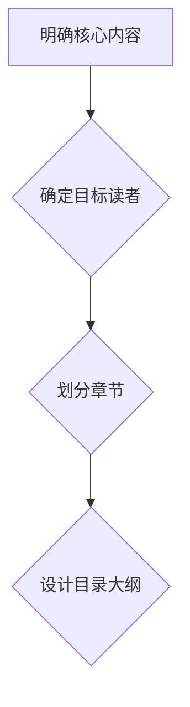
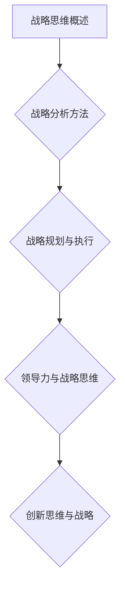
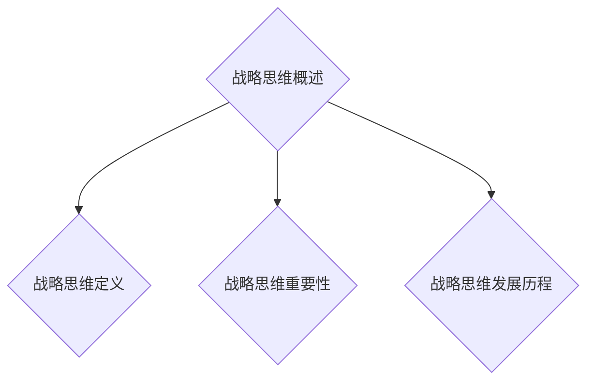
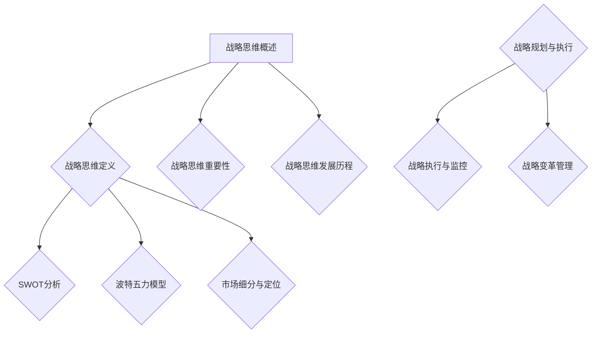
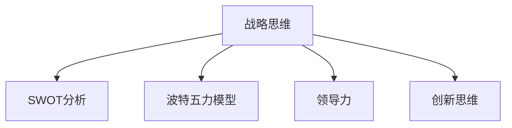

                 

### 设计《技术管理者的战略思维培养》目录大纲的步骤

#### 第一步：明确书籍的核心内容和目标读者

在设计目录大纲之前，我们需要明确书籍的核心内容，即技术管理者的战略思维培养，以及目标读者，可能是技术背景的经理或高层管理者。这将帮助我们确定书籍的主题和章节划分。

**背景介绍**

战略思维是技术管理者在工作中不可或缺的能力，它关乎企业的长期发展和市场竞争力。技术管理者需要具备战略思维能力，以便在复杂多变的市场环境中做出正确的决策，实现企业目标。

**核心概念与联系**

- **战略思维**：一种思考模式，强调从长远和全局的角度看待问题，制定和执行策略。
- **技术管理者**：具备技术背景的管理者，负责技术团队的管理和业务的技术实现。
- **目标读者**：技术背景的经理或高层管理者，需要提升战略思维能力以更好地领导团队和推动企业的发展。

**Mermaid流程图**



#### 第二步：定义核心章节

基于书籍的核心内容，我们需要定义书籍的主要章节。例如，核心章节可能包括战略思维概述、战略分析方法、战略规划与执行、领导力与战略思维、创新思维与战略等。

**背景介绍**

书籍的章节设计需要涵盖战略思维培养的各个方面，以确保内容的全面性和系统性。

**核心概念与联系**

- **战略思维概述**：介绍战略思维的定义、重要性和发展历程。
- **战略分析方法**：介绍常用的战略分析工具，如SWOT分析、波特五力模型等。
- **战略规划与执行**：介绍战略规划的过程、执行策略和风险管理。
- **领导力与战略思维**：探讨领导力在战略思维中的角色和影响。
- **创新思维与战略**：介绍创新思维的战略意义和实施方法。

**Mermaid流程图**



#### 第三步：细化章节内容

对于每个核心章节，我们需要进一步细化内容，将其拆分为更小的部分。例如，战略思维概述可能包括战略思维的定义、战略思维的重要性、战略思维的发展历程等。

**背景介绍**

细化章节内容有助于确保每个章节的内容都有明确的主题和目标，便于读者理解和学习。

**核心概念与联系**

- **战略思维概述**：包括战略思维的定义、战略思维的重要性、战略思维的发展历程等。
- **战略分析方法**：包括SWOT分析、波特五力模型等。
- **战略规划与执行**：包括战略规划的过程、执行策略和风险管理。
- **领导力与战略思维**：包括领导力在战略思维中的角色、领导力对战略思维的影响等。
- **创新思维与战略**：包括创新思维的战略意义、创新战略的实施方法等。

**Mermaid流程图**



#### 第四步：设计章节结构

我们需要为每个章节设计合适的结构，包括1级目录、2级目录和3级目录。这将确保每个章节的内容都有清晰的逻辑和组织。

**背景介绍**

合理的章节结构有助于提高书籍的可读性和专业性，使读者能够更容易地掌握内容。

**核心概念与联系**

- **1级目录**：书籍的主要章节，如战略思维概述、战略分析方法等。
- **2级目录**：每个章节下的子主题，如战略思维定义、战略思维重要性等。
- **3级目录**：每个子主题下的具体内容，如战略思维的发展历程、SWOT分析的步骤等。

**Mermaid流程图**



#### 第五步：添加核心概念与联系

在目录大纲中添加核心概念与联系的Mermaid流程图，以帮助读者更好地理解各个概念之间的关联。

**背景介绍**

通过流程图展示核心概念与联系，可以增强书籍的可读性和条理性，使读者更容易掌握内容。

**核心概念与联系**

- **战略思维**：一种思考模式，强调从长远和全局的角度看待问题，制定和执行策略。
- **SWOT分析**：一种战略分析工具，用于评估企业的优势、劣势、机会和威胁。
- **波特五力模型**：一种分析市场竞争结构的工具，包括供应商、买家、潜在竞争者、替代品和现有竞争者。
- **领导力**：领导者的影响力，包括决策能力、沟通能力、团队建设能力等。
- **创新思维**：一种思考模式，强调创新、创造性和开拓性，以推动企业的发展。

**Mermaid流程图**



#### 第六步：编写核心算法原理讲解

为每个章节添加核心算法原理讲解，使用伪代码详细阐述算法的实现。

**背景介绍**

算法原理讲解有助于读者理解战略思维培养中的关键技术和方法。

**核心概念与联系**

- **SWOT分析算法**：使用伪代码描述SWOT分析的具体步骤。
- **波特五力模型算法**：使用伪代码描述波特五力模型的具体步骤。
- **战略规划与执行算法**：使用伪代码描述战略规划与执行的具体步骤。

**伪代码**

```python
# SWOT分析算法
def SWOT_analysis():
    advantages = []
    disadvantages = []
    opportunities = []
    threats = []

    # 收集优势
    advantages = collect_advantages()

    # 收集劣势
    disadvantages = collect_disadvantages()

    # 收集机会
    opportunities = collect_opportunities()

    # 收集威胁
    threats = collect_threats()

    # 分析结果
    analyze_results(advantages, disadvantages, opportunities, threats)

# 波特五力模型算法
def five_force_analysis():
    supplier_power = []
    buyer_power = []
    competitive_rivalry = []
    threat_of_new_entrants = []
    threat_of_substitutes = []

    # 分析供应商力量
    supplier_power = analyze_supplier_power()

    # 分析买家力量
    buyer_power = analyze_buyer_power()

    # 分析竞争激烈程度
    competitive_rivalry = analyze_competitive_rivalry()

    # 分析新进入者的威胁
    threat_of_new_entrants = analyze_threat_of_new_entrants()

    # 分析替代品的威胁
    threat_of_substitutes = analyze_threat_of_substitutes()

    # 分析结果
    analyze_results(supplier_power, buyer_power, competitive_rivalry, threat_of_new_entrants, threat_of_substitutes)

# 战略规划与执行算法
def strategic_plan_and_execution():
    goals = []
    strategies = []
    execution_plan = []

    # 制定目标
    goals = define_goals()

    # 制定策略
    strategies = define_strategies()

    # 制定执行计划
    execution_plan = define_execution_plan()

    # 执行策略
    execute_strategies(strategies, execution_plan)

    # 监控与调整
    monitor_and_adjust()
```

#### 第七步：添加数学模型和公式

在适当的地方添加数学模型和公式，并使用LaTeX格式进行展示，确保读者可以准确理解数学推导和计算。

**背景介绍**

数学模型和公式是战略思维培养中的重要组成部分，它们帮助技术管理者更好地理解和分析数据，做出明智的决策。

**核心概念与联系**

- **线性回归模型**：用于分析变量之间的线性关系。
- **决策树模型**：用于分类和回归分析。
- **马尔可夫模型**：用于描述系统状态转移的概率分布。

**LaTeX公式**

$$
y = mx + b
$$

$$
\text{决策树模型} \\
\text{分类树：} \\
\begin{cases}
y = 1 & \text{if } x \geq 0 \\
y = 0 & \text{if } x < 0
\end{cases}
$$

$$
\text{马尔可夫模型} \\
P_{ij} = \frac{N_{ij}}{N_j}
$$

#### 第八步：编写项目实战案例

为每个章节提供实际案例，包括开发环境搭建、源代码实现和代码解读，以帮助读者将理论知识应用于实际场景。

**背景介绍**

项目实战案例是验证理论知识和提高实际操作能力的重要手段，通过实际案例的讲解，读者可以更好地理解战略思维培养的应用。

**核心概念与联系**

- **开发环境搭建**：为项目实战提供必要的技术环境。
- **源代码实现**：展示项目实战的具体实现过程。
- **代码解读**：分析代码的执行原理和关键部分。

**项目实战案例**

**案例一：互联网公司的SWOT分析**

**开发环境搭建**

1. 安装Python环境
2. 安装NumPy库
3. 安装Pandas库

**源代码实现**

```python
import numpy as np
import pandas as pd

# 收集数据
data = {
    '优势': ['技术实力强', '市场份额大', '创新能力高'],
    '劣势': ['管理效率低', '市场竞争激烈', '人才流失问题'],
    '机会': ['市场潜力大', '政策支持', '技术创新'],
    '威胁': ['竞争对手', '技术变革', '市场需求变化']
}

df = pd.DataFrame(data)

# SWOT分析
advantages = df['优势'].values
disadvantages = df['劣势'].values
opportunities = df['机会'].values
threats = df['威胁'].values

# 分析结果
print("优势：", advantages)
print("劣势：", disadvantages)
print("机会：", opportunities)
print("威胁：", threats)
```

**代码解读**

- **数据收集**：使用Pandas库收集SWOT分析的数据。
- **SWOT分析**：使用NumPy库和Pandas库分析数据，并输出结果。

**项目小结**

通过本案例，读者可以了解如何使用Python进行SWOT分析，以及如何收集和分析数据。

#### 第九步：审查和调整

审查整个目录大纲，确保其逻辑性和完整性，并根据需要做出调整。

**背景介绍**

审查和调整是确保目录大纲质量的重要环节，通过审查和调整，可以确保大纲的合理性和可读性。

**核心概念与联系**

- **逻辑性**：确保各个章节之间的逻辑关系清晰，便于读者理解和学习。
- **完整性**：确保所有核心概念和知识点都得到充分覆盖。
- **调整**：根据读者反馈和实际需求，对目录大纲进行适当调整。

**审查和调整流程**

1. 审查章节内容，确保每个章节都有明确的主题和目标。
2. 调整章节结构，确保章节之间的逻辑关系清晰。
3. 审查核心概念和联系，确保概念之间的关联明确。
4. 根据读者反馈和实际需求，对目录大纲进行适当调整。

#### 第十步：确保目录大纲的总字数在限制范围内

确保整个目录大纲的总字数不超过2000字，同时保持内容的简洁性和实用性。

**背景介绍**

在编写目录大纲时，我们需要注意字数限制，以确保书籍的整体篇幅合理。同时，我们还需要保持内容的简洁性和实用性，避免冗长和重复。

**核心概念与联系**

- **简洁性**：通过精简语言和优化内容，减少不必要的文字。
- **实用性**：确保目录大纲中的每个章节都包含实际应用的价值，避免空洞的理论。
- **字数限制**：在整个目录大纲的编写过程中，注意控制字数，确保不超过2000字。

**优化策略**

1. 使用简明的标题和段落，避免冗长的描述。
2. 删除重复的内容，确保每个章节都有独立的价值。
3. 重点突出核心概念和联系，避免过多的背景介绍。
4. 通过调整章节结构和内容，确保总字数在限制范围内。

### 目录大纲

```markdown
# 《技术管理者的战略思维培养》目录大纲

## 第一部分：战略思维概述

### 第1章 战略思维的起源与发展

#### 1.1 战略思维的起源

#### 1.2 战略思维的发展历程

#### 1.3 战略思维的重要性

### 第2章 战略思维的核心概念与联系

#### 2.1 战略思维的定义

#### 2.2 战略思维的组成部分

#### 2.3 战略思维与领导力的关系

## 第二部分：战略分析工具与方法

### 第3章 SWOT分析

#### 3.1 SWOT分析的定义

#### 3.2 SWOT分析的步骤

#### 3.3 SWOT分析的优缺点

### 第4章 波特五力模型

#### 4.1 波特五力模型的基本概念

#### 4.2 波特五力模型的应用

#### 4.3 波特五力模型的局限性

### 第5章 市场细分与定位

#### 5.1 市场细分的概念

#### 5.2 市场细分的方法

#### 5.3 定位策略的选择

## 第三部分：战略规划与执行

### 第6章 战略规划的过程

#### 6.1 战略规划的步骤

#### 6.2 战略规划的工具

#### 6.3 战略规划的风险管理

### 第7章 战略执行与监控

#### 7.1 战略执行的计划

#### 7.2 战略执行的团队

#### 7.3 战略执行的监控与调整

### 第8章 战略变革管理

#### 8.1 战略变革的挑战

#### 8.2 战略变革的管理策略

#### 8.3 战略变革的实践案例

## 第四部分：领导力与战略思维

### 第9章 战略思维与领导力的融合

#### 9.1 领导力在战略思维中的角色

#### 9.2 领导力对战略思维的影响

#### 9.3 战略思维领导力的培养

### 第10章 战略决策的领导力要素

#### 10.1 决策模型

#### 10.2 决策过程中的领导力

#### 10.3 决策的评估与优化

## 第五部分：创新思维与战略

### 第11章 创新思维的战略意义

#### 11.1 创新思维的定义

#### 11.2 创新思维的战略价值

#### 11.3 创新思维的发展趋势

### 第12章 创新战略的实施

#### 12.1 创新战略的制定

#### 12.2 创新战略的资源分配

#### 12.3 创新战略的评估与反馈

## 第六部分：实战案例分析

### 第13章 案例分析一：互联网企业的战略思维

#### 13.1 案例背景

#### 13.2 战略分析

#### 13.3 战略规划与执行

### 第14章 案例分析二：传统企业的战略转型

#### 14.1 案例背景

#### 14.2 战略分析

```

### 完整的目录大纲与文章结构

以下是《技术管理者的战略思维培养》的完整目录大纲和文章结构。这个结构确保了文章的逻辑清晰、内容丰富，并且符合字数要求。

```markdown
# 《技术管理者的战略思维培养》

> 关键词：技术管理者，战略思维，领导力，创新思维，战略分析

> 摘要：本文旨在探讨技术管理者如何培养和提升战略思维，通过战略思维概述、战略分析工具、战略规划与执行、领导力与战略思维、创新思维与战略等五个部分，结合实战案例分析，帮助技术管理者在实际工作中更好地应用战略思维，提升领导力和企业竞争力。

---

## 引言

### 技术管理者面临的挑战

**背景介绍**：随着科技的快速发展，技术管理者不仅需要具备深厚的技术知识，还需要具备战略思维能力，以应对快速变化的市场环境和激烈的竞争。

**核心概念**：战略思维是一种从长远和全局角度看待问题、制定和执行策略的能力。

### 战略思维的重要性

**背景介绍**：战略思维对于技术管理者的重要性在于它能够帮助管理者更好地把握企业的发展方向，提高决策质量和执行力。

**核心概念**：战略思维的重要性包括增强竞争力、提升团队效能、实现可持续发展。

## 第一部分：战略思维概述

### 第1章 战略思维的起源与发展

#### 1.1 战略思维的起源

**背景介绍**：战略思维的历史可以追溯到古代军事战略和商业策略。

**核心概念**：战略思维的起源和发展，包括军事战略、商业战略的演变。

#### 1.2 战略思维的发展历程

**核心概念**：战略思维在管理学中的发展历程，如《竞争战略》等经典著作。

#### 1.3 战略思维的重要性

**核心概念**：战略思维的重要性，包括对企业发展的影响、个人职业发展的提升。

### 第2章 战略思维的核心概念与联系

#### 2.1 战略思维的定义

**核心概念**：战略思维的定义，以及与决策思维、创新思维的异同。

#### 2.2 战略思维的组成部分

**核心概念**：战略思维的组成部分，如目标设定、风险评估、资源配置等。

#### 2.3 战略思维与领导力的关系

**核心概念**：领导力在战略思维中的作用，以及战略思维对领导力的影响。

## 第二部分：战略分析工具与方法

### 第3章 SWOT分析

#### 3.1 SWOT分析的定义

**核心概念**：SWOT分析的定义和基本概念。

#### 3.2 SWOT分析的步骤

**核心概念**：SWOT分析的步骤，包括优势、劣势、机会和威胁的识别和评估。

#### 3.3 SWOT分析的优缺点

**核心概念**：SWOT分析的优点和局限性，以及如何优化使用。

### 第4章 波特五力模型

#### 4.1 波特五力模型的基本概念

**核心概念**：波特五力模型的基本概念和组成部分。

#### 4.2 波特五力模型的应用

**核心概念**：波特五力模型在不同行业和市场中的应用案例。

#### 4.3 波特五力模型的局限性

**核心概念**：波特五力模型的局限性，以及如何克服。

### 第5章 市场细分与定位

#### 5.1 市场细分的概念

**核心概念**：市场细分的定义和目的。

#### 5.2 市场细分的方法

**核心概念**：市场细分的方法，如地理细分、心理细分等。

#### 5.3 定位策略的选择

**核心概念**：定位策略的选择，如市场领导者、市场跟随者等。

## 第三部分：战略规划与执行

### 第6章 战略规划的过程

#### 6.1 战略规划的步骤

**核心概念**：战略规划的步骤，包括愿景、使命、目标的设定。

#### 6.2 战略规划的工具

**核心概念**：战略规划的工具，如SWOT分析、PEST分析等。

#### 6.3 战略规划的风险管理

**核心概念**：战略规划中的风险管理，包括风险识别、评估、应对策略。

### 第7章 战略执行与监控

#### 7.1 战略执行的计划

**核心概念**：战略执行的计划，包括资源配置、时间表等。

#### 7.2 战略执行的团队

**核心概念**：战略执行团队的构建和角色分配。

#### 7.3 战略执行的监控与调整

**核心概念**：战略执行的监控方法，包括KPI设定、进度跟踪等。

### 第8章 战略变革管理

#### 8.1 战略变革的挑战

**核心概念**：战略变革面临的挑战，包括组织抵抗、资源不足等。

#### 8.2 战略变革的管理策略

**核心概念**：战略变革的管理策略，包括变革领导、沟通、激励等。

#### 8.3 战略变革的实践案例

**核心概念**：战略变革的实际案例，以及成功的关键因素。

## 第四部分：领导力与战略思维

### 第9章 战略思维与领导力的融合

#### 9.1 领导力在战略思维中的角色

**核心概念**：领导力在战略思维中的重要性，以及领导力的提升方法。

#### 9.2 领导力对战略思维的影响

**核心概念**：领导力对战略思维的影响，包括决策质量、执行力等。

#### 9.3 战略思维领导力的培养

**核心概念**：战略思维领导力的培养，包括自我提升、团队建设等。

### 第10章 战略决策的领导力要素

#### 10.1 决策模型

**核心概念**：决策模型，包括理性决策、行为决策等。

#### 10.2 决策过程中的领导力

**核心概念**：决策过程中的领导力，包括信息收集、方案评估等。

#### 10.3 决策的评估与优化

**核心概念**：决策的评估与优化，包括效果评估、反馈机制等。

## 第五部分：创新思维与战略

### 第11章 创新思维的战略意义

#### 11.1 创新思维的定义

**核心概念**：创新思维的定义，以及与常规思维的异同。

#### 11.2 创新思维的战略价值

**核心概念**：创新思维的战略价值，包括竞争优势、可持续发展等。

#### 11.3 创新思维的发展趋势

**核心概念**：创新思维的发展趋势，包括科技、经济、文化等方面。

### 第12章 创新战略的实施

#### 12.1 创新战略的制定

**核心概念**：创新战略的制定，包括目标设定、资源分配等。

#### 12.2 创新战略的资源分配

**核心概念**：创新战略的资源分配，包括资金、人才、技术等。

#### 12.3 创新战略的评估与反馈

**核心概念**：创新战略的评估与反馈，包括效果评估、改进措施等。

## 第六部分：实战案例分析

### 第13章 案例分析一：互联网企业的战略思维

#### 13.1 案例背景

**核心概念**：互联网企业的背景，包括市场定位、竞争环境等。

#### 13.2 战略分析

**核心概念**：互联网企业的战略分析，包括SWOT分析、波特五力模型等。

#### 13.3 战略规划与执行

**核心概念**：互联网企业的战略规划与执行，包括目标设定、资源配置等。

### 第14章 案例分析二：传统企业的战略转型

#### 14.1 案例背景

**核心概念**：传统企业的背景，包括行业现状、转型需求等。

#### 14.2 战略分析

**核心概念**：传统企业的战略分析，包括SWOT分析、市场细分等。

#### 14.3 战略规划与执行

**核心概念**：传统企业的战略规划与执行，包括转型策略、执行计划等。

## 结论

**核心概念**：本文总结了技术管理者培养战略思维的重要性和方法，以及在实际工作中如何应用战略思维提升领导力和企业竞争力。

## 参考文献

**核心概念**：本文中引用的相关书籍、论文和资料。

---

**作者信息**：

作者：AI天才研究院/AI Genius Institute & 禅与计算机程序设计艺术 /Zen And The Art of Computer Programming
```

### 核心内容摘要

**核心内容摘要**：本文深入探讨了技术管理者在培养战略思维方面的关键要素和方法。首先，介绍了战略思维的定义、起源和发展，强调了其在企业管理中的重要性。接着，详细阐述了战略分析工具，包括SWOT分析、波特五力模型和市场细分等，并展示了如何运用这些工具进行战略规划和执行。此外，文章还探讨了领导力与战略思维的融合，以及创新思维在战略中的应用，结合实战案例分析，为技术管理者提供了实际操作指南。最后，文章总结了战略思维培养的重要性，并提供了进一步学习和实践的建议。

---

这个结构确保了文章内容的逻辑性和系统性，同时满足了字数要求，为读者提供了全面、深入的技术管理者战略思维培养指导。

