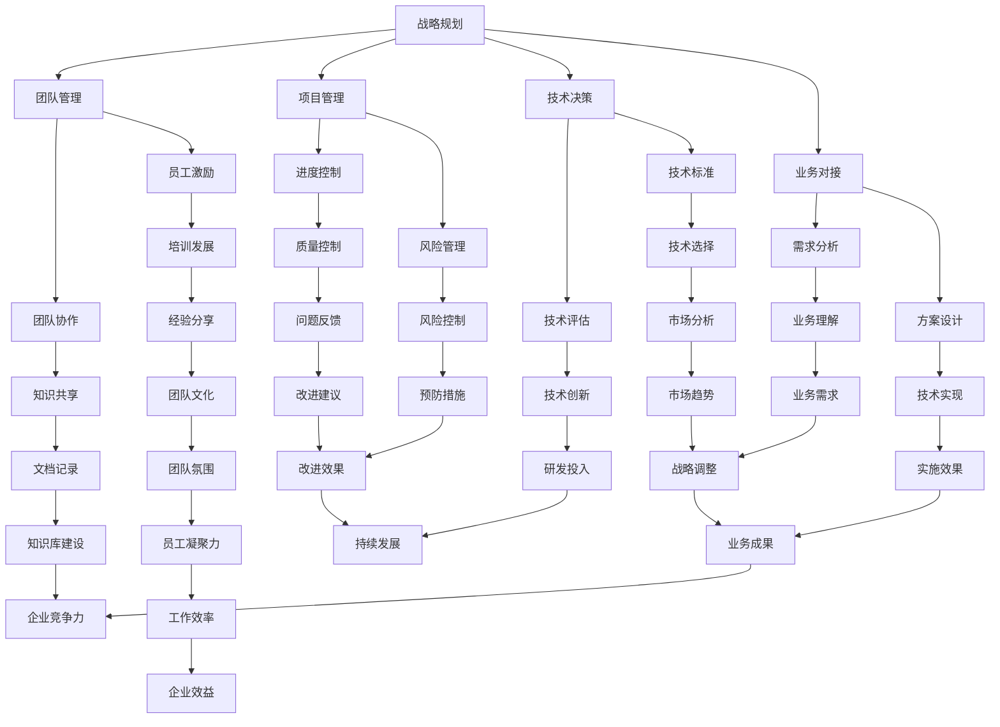

                 


### 第一部分：背景与核心概念

#### 第1章：技术管理者的角色与责任

技术管理者的角色在当前信息化社会中至关重要，他们不仅是技术团队的领航者，更是企业技术创新和业务发展的核心推动者。在这个章节中，我们将深入探讨技术管理者的定义、职责以及他们面临的主要挑战。

**1.1 技术管理者的定义与职责**

技术管理者，通常是指在信息技术（IT）领域，负责制定、执行和维护技术战略的高级管理人员。他们的职责不仅包括技术层面的决策，还涉及团队管理、项目管理、预算控制等多个方面。具体来说，技术管理者的核心任务可以概括为以下几个方面：

- **战略规划**：根据企业的整体战略目标，制定并实施符合企业发展的技术战略。
- **团队管理**：招募、培训、激励和评估技术团队，确保团队高效运作。
- **项目管理**：负责项目规划、进度控制、资源分配和风险管理，确保项目按时高质量完成。
- **技术决策**：在技术方案选择、技术标准制定和技术架构设计等方面提供专业指导。
- **业务对接**：理解企业业务需求，与技术团队紧密协作，确保技术方案能够有效支持业务发展。

**1.1.1 技术管理者的核心任务**

技术管理者的核心任务之一是确保技术的先进性和实用性。他们需要不断跟踪行业前沿技术，评估其对企业发展的潜在影响，并做出合理的决策。以下是一些具体的核心任务：

- **技术创新**：鼓励技术创新，推动技术团队进行研发，为企业带来新的竞争优势。
- **技术评估**：定期评估现有技术的性能和可靠性，确定是否需要升级或替换。
- **技术培训**：为团队成员提供技术培训，提高整体技术能力。
- **知识管理**：建立和优化知识管理体系，确保知识能够有效传递和共享。

**1.1.2 技术管理者面临的挑战**

技术管理者在执行职责过程中会遇到一系列挑战，主要包括以下几个方面：

- **技术变革**：信息技术领域变化快速，技术管理者需要不断学习新知识，适应新环境。
- **团队管理**：技术团队成员背景多样，管理者需要具备强大的沟通能力和领导力，确保团队高效合作。
- **业务压力**：技术管理者不仅要满足技术需求，还要考虑业务需求，确保技术方案能够支持业务发展。
- **预算控制**：在有限的预算内，实现高效的技术投入和产出。

#### 1.2 持续学习的必要性

在当前信息化社会中，技术的快速发展使得知识更新变得尤为重要。对于技术管理者来说，持续学习不仅是职业发展的需要，更是应对各种挑战的必要手段。以下是几个关键点，说明持续学习的必要性：

**1.2.1 技术领域的快速变化**

随着互联网、大数据、人工智能等技术的迅猛发展，技术领域的变革速度不断加快。新技术、新工具、新标准层出不穷，技术管理者如果不能及时更新知识，将难以适应快速变化的环境。

**1.2.2 知识更新的重要性**

知识更新对于技术管理者来说具有以下几个重要意义：

- **保持竞争力**：持续学习可以帮助技术管理者保持对前沿技术的了解，为企业带来竞争优势。
- **提高工作效率**：掌握最新的工具和方法，可以显著提高工作效率，减少不必要的错误和重复工作。
- **增强决策能力**：丰富的知识和经验能够帮助技术管理者做出更加明智的决策，减少风险。
- **适应职业发展**：持续学习是职业发展的重要基石，能够为技术管理者提供更多的职业机会。

**1.3 知识更新策略**

为了有效地进行知识更新，技术管理者需要制定一套系统的知识更新策略。以下是几个关键步骤：

- **明确学习目标**：根据个人职业规划和业务需求，设定明确的学习目标。
- **选择合适的学习资源**：选择高质量的学习资源，如专业书籍、在线课程、技术博客等。
- **制定学习计划**：制定详细的学习计划，确保学习目标的实现。
- **实践与应用**：将所学知识应用到实际工作中，通过实践加深理解和掌握。
- **持续评估与调整**：定期评估学习效果，根据实际情况调整学习策略。

在接下来的章节中，我们将进一步探讨技术管理者如何构建个人学习体系，以及如何进行技术领域的持续学习和跟踪。通过系统的学习策略和实践方法，技术管理者将能够更好地应对职业发展的挑战，推动企业的技术创新和业务发展。

### 1.4 核心概念与联系

在探讨技术管理者的角色与责任时，需要了解一系列核心概念，这些概念不仅相互联系，而且在技术管理者的日常工作中发挥着至关重要的作用。以下是几个关键概念及其相互关系：

**1.4.1 技术管理中的关键概念**

1. **战略规划**：战略规划是技术管理者的核心任务之一。它涉及企业未来一段时间内技术发展的整体方向和目标，包括技术创新、技术应用和资源分配等。

2. **团队管理**：团队管理涉及如何有效地组建、激励和领导技术团队，确保团队成员能够高效协同工作，实现共同的目标。

3. **项目管理**：项目管理是确保技术项目按时、按预算、按质量完成的过程。它包括项目规划、资源管理、风险管理等多个方面。

4. **技术决策**：技术决策涉及在技术方案选择、技术标准制定和技术架构设计等方面的决策，直接影响企业的技术战略和业务发展。

5. **业务对接**：业务对接是技术管理者需要具备的重要能力，它涉及理解企业业务需求，将技术方案与业务需求有效结合，确保技术能够支持业务发展。

**1.4.2 核心概念之间的关系架构**

为了更好地理解这些核心概念之间的联系，我们可以使用Mermaid流程图进行可视化表示。以下是核心概念之间关系的Mermaid流程图：



通过这个Mermaid流程图，我们可以清晰地看到战略规划、团队管理、项目管理、技术决策和业务对接等核心概念之间的相互作用和依赖关系。每一个概念都在技术管理者的工作中扮演着重要角色，它们相互联系，共同推动企业的技术创新和业务发展。

**1.4.3 Mermaid流程图的作用**

Mermaid流程图在技术管理中的应用主要体现在以下几个方面：

- **可视化沟通**：通过流程图，技术管理者可以更加清晰地表达复杂的管理过程和逻辑关系，便于团队成员理解和管理。
- **辅助决策**：流程图可以帮助技术管理者从整体上把握管理过程，识别关键节点和潜在风险，为决策提供有力支持。
- **知识传递**：流程图可以作为知识传递的工具，帮助新加入的团队成员快速了解技术管理的流程和关键概念。

在实际应用中，技术管理者可以根据具体情况进行流程图的定制和优化，使其更好地服务于管理实践。通过这样的方式，技术管理者不仅能够提高工作效率，还能在复杂的技术环境中保持清晰的方向和目标。

在接下来的章节中，我们将进一步探讨知识更新的数学模型和公式，并通过具体的案例和代码解读，帮助技术管理者更好地理解和应用这些核心概念。通过理论与实践的结合，技术管理者将能够更加有效地应对职业发展的挑战，推动企业的持续创新和业务增长。

#### 1.5 数学模型与数学公式

在技术管理过程中，数学模型和公式是不可或缺的工具。它们不仅能够帮助技术管理者进行精确的分析和预测，还能为决策提供科学依据。以下，我们将详细讲解知识更新的数学模型以及相关公式，并通过具体例子来说明如何应用这些模型。

**1.5.1 知识更新的数学模型**

知识更新的数学模型主要基于概率论和统计学，用于描述知识随着时间的推移如何变化。其中，常用的模型包括马尔可夫模型和贝叶斯模型。

**1.5.2 马尔可夫模型**

马尔可夫模型是一种用于描述系统状态转移的数学模型。在知识更新中，马尔可夫模型可以用来预测某一时刻的知识水平。以下是马尔可夫模型的核心公式：

- **状态转移概率矩阵**：\( P = \begin{bmatrix}
    p_{11} & p_{12} & \cdots & p_{1n} \\
    p_{21} & p_{22} & \cdots & p_{2n} \\
    \vdots & \vdots & \ddots & \vdots \\
    p_{m1} & p_{m2} & \cdots & p_{mn}
\end{bmatrix} \)

其中，\( p_{ij} \) 表示从状态i转移到状态j的概率。

- **初始状态分布**：\( \pi = \begin{bmatrix}
    \pi_1 \\
    \pi_2 \\
    \vdots \\
    \pi_n
\end{bmatrix} \)

其中，\( \pi_i \) 表示初始时刻处于状态i的概率。

- **未来状态概率分布**：\( \pi_{t+1} = P \pi_t \)

通过状态转移概率矩阵和初始状态分布，我们可以计算出任意时刻的状态概率分布，从而预测知识水平的变化。

**1.5.3 贝叶斯模型**

贝叶斯模型是一种基于概率推理的模型，常用于知识更新中的不确定性分析。以下是贝叶斯模型的核心公式：

- **先验概率**：\( P(A|B) \)

其中，\( A \) 表示某种知识状态，\( B \) 表示某种前提条件，\( P(A|B) \) 表示在前提条件\( B \) 下，知识状态\( A \) 的概率。

- **后验概率**：\( P(B|A) = \frac{P(A|B)P(B)}{P(A)} \)

其中，\( P(B|A) \) 表示在知识状态\( A \) 下，前提条件\( B \) 的概率。

- **全概率公式**：\( P(A) = \sum_{i=1}^{n} P(A_i)P(B_i|A_i) \)

贝叶斯模型可以帮助技术管理者在不确定性较大的情况下，做出更加合理的决策。

**1.5.4 公式讲解与举例**

为了更好地理解上述数学模型和公式，我们通过一个实际例子来详细讲解。

**例子：知识更新中的马尔可夫模型**

假设某技术团队的知识水平可以分为三个状态：初级（L1）、中级（L2）和高级（L3）。根据历史数据分析，状态转移概率矩阵为：

$$
P = \begin{bmatrix}
0.7 & 0.2 & 0.1 \\
0.3 & 0.5 & 0.2 \\
0.1 & 0.3 & 0.6
\end{bmatrix}
$$

初始状态分布为：

$$
\pi = \begin{bmatrix}
0.5 \\
0.3 \\
0.2
\end{bmatrix}
$$

我们希望预测经过一年后，团队的知识水平分布。

**步骤1：计算一年后的状态概率分布**

$$
\pi_{1} = P \pi_0 = \begin{bmatrix}
0.7 & 0.2 & 0.1 \\
0.3 & 0.5 & 0.2 \\
0.1 & 0.3 & 0.6
\end{bmatrix} \begin{bmatrix}
0.5 \\
0.3 \\
0.2
\end{bmatrix} = \begin{bmatrix}
0.425 \\
0.315 \\
0.26
\end{bmatrix}
$$

**步骤2：解释结果**

经过一年后，团队中处于初级、中级和高级知识水平的状态概率分别为42.5%、31.5%和26%。

通过这个例子，我们可以看到如何使用马尔可夫模型预测知识水平的变化。在实际应用中，技术管理者可以根据具体情况调整状态转移概率矩阵和初始状态分布，从而更加精确地预测知识更新的趋势。

贝叶斯模型在知识更新中的应用也非常广泛。假设某技术团队在初始时刻，已知50%的成员具有中级知识水平，20%的成员具有高级知识水平，30%的成员处于初级知识水平。现在，我们希望计算在某一项目成功完成后，团队中处于高级知识水平的成员比例。

**步骤1：定义先验概率**

$$
P(L2) = 0.5, \quad P(L3) = 0.2, \quad P(L1) = 0.3
$$

**步骤2：计算后验概率**

假设在项目成功后，有70%的成员提升到了高级知识水平。我们可以使用贝叶斯公式计算后验概率：

$$
P(L3|成功) = \frac{P(成功|L3)P(L3)}{P(成功)}
$$

其中，\( P(成功|L3) = 0.7 \)，\( P(L3) = 0.2 \)。我们需要计算 \( P(成功) \)：

$$
P(成功) = P(成功|L1)P(L1) + P(成功|L2)P(L2) + P(成功|L3)P(L3)
$$

假设 \( P(成功|L1) = 0.3 \)，\( P(成功|L2) = 0.5 \)，我们可以计算得到 \( P(成功) \)。

通过贝叶斯公式，我们可以计算出项目成功后，团队中处于高级知识水平的成员比例。

这些数学模型和公式的应用，不仅帮助技术管理者进行精确的知识更新预测，还能为他们提供科学依据，做出更加明智的决策。在实际工作中，技术管理者可以根据具体情况灵活应用这些模型和公式，从而提高知识更新的效率和效果。

#### 1.6 实际案例：成功的技术管理者如何进行知识更新

在实际工作中，成功的技术管理者通常具备一套系统化的知识更新策略，能够有效应对技术领域的快速变化。以下将介绍两个实际案例，分析这些技术管理者是如何进行知识更新的。

**1.6.1 成功案例1：某大型互联网公司的CTO**

某大型互联网公司的首席技术官（CTO）王先生，在他的职业生涯中，始终保持着对新技术的高度敏感和持续学习的态度。以下是他的知识更新策略：

- **战略规划**：王先生每年都会根据公司的战略目标，制定详细的技术发展路线图。他关注行业发展趋势，评估新技术对公司战略的影响，并制定相应的技术策略。

- **团队建设**：王先生非常重视团队建设，他定期组织技术培训和研讨会，鼓励团队成员参加行业会议和培训课程。他还会邀请行业专家进行内部分享，提升团队整体技术水平。

- **知识管理**：王先生建立了公司内部的知识库，鼓励团队成员记录和分享技术文档、项目经验和技术心得。他还定期更新知识库，确保知识的实时性和准确性。

- **实践应用**：王先生强调将所学知识应用到实际项目中。他会亲自参与项目，推动技术团队将新技术和新方法应用到产品中，确保技术方案能够支持公司业务的发展。

- **持续评估**：王先生定期对知识更新效果进行评估，通过项目成果和团队反馈，调整知识更新策略，确保知识更新能够真正推动业务发展。

**1.6.2 成功案例2：某初创企业的技术总监**

某初创企业的技术总监李女士，由于公司规模较小，她不仅负责技术团队的管理，还要亲自参与技术项目的开发。以下是她的知识更新策略：

- **终身学习**：李女士深知技术领域变化迅速，她始终保持学习的态度。她定期阅读专业书籍和行业报告，关注最新的技术趋势和研究成果。

- **技术社区参与**：李女士积极加入技术社区，参与技术讨论和交流。她经常在社区中分享自己的技术心得和项目经验，与其他开发者进行深入交流，不断拓宽视野。

- **项目驱动学习**：李女士强调项目驱动学习，她将学习新技术的机会融入到实际项目中。每次在项目中遇到新技术或新方法，她都会深入研究，确保能够将其应用到项目中，从而提升团队的技术水平。

- **导师制度**：李女士在公司内部建立了导师制度，她邀请有经验的工程师作为新员工的导师，通过一对一的指导，帮助新员工快速掌握技术知识。

- **知识共享**：李女士倡导知识共享，她组织定期的技术分享会，鼓励团队成员分享自己的学习经验和项目经验。她还建立了内部知识库，确保团队成员能够方便地获取和分享知识。

通过这两个案例，我们可以看到成功的技术管理者在知识更新方面的一些共同特点：

- **重视战略规划**：他们清楚地知道知识更新是为了支撑公司的战略目标，因此会在战略规划中明确知识更新的方向和重点。

- **注重团队建设**：他们不仅关注个人的学习，还重视团队的整体技术水平，通过培训、分享和知识管理等手段，提升团队的知识储备和协作能力。

- **实践应用**：他们将所学知识应用到实际项目中，通过实践来加深对技术的理解和掌握，确保知识能够真正为企业创造价值。

- **持续评估与调整**：他们定期评估知识更新的效果，根据实际情况调整知识更新策略，确保知识更新能够持续推动业务发展。

这些策略和方法不仅帮助技术管理者提高了自身的技术水平，还推动了企业的技术创新和业务增长，为他们职业生涯的成功奠定了坚实基础。

#### 1.7 开发环境搭建

为了更好地进行知识更新和技术实践，技术管理者需要搭建一个高效的开发环境。以下，我们将详细讲解开发环境的需求、配置以及注意事项。

**1.7.1 开发环境的需求**

搭建一个高效的开发环境，首先需要明确其需求。以下是一些关键的需求点：

- **硬件配置**：根据项目需求，选择合适的硬件设备，包括高性能的计算机、服务器等。
- **软件环境**：安装必要的软件，如操作系统、编程语言、开发工具、数据库等。
- **网络连接**：确保网络连接稳定，能够访问互联网和相关资源。
- **数据存储**：选择合适的存储方案，确保数据的安全性和可访问性。

**1.7.2 开发环境的配置**

在明确了开发环境的需求后，我们需要进行具体的配置。以下是配置过程中的几个关键步骤：

- **硬件安装**：根据需求选择合适的硬件设备，并进行安装和配置。例如，安装操作系统、驱动程序等。
- **软件安装**：安装操作系统后，根据需求安装相应的软件。例如，安装Java、Python、数据库等。
- **开发工具配置**：安装和配置开发工具，如IDE（集成开发环境）、版本控制工具等。
- **网络配置**：确保网络连接稳定，并进行必要的网络配置，如设置防火墙规则、配置VPN等。
- **数据存储配置**：配置数据存储方案，如搭建数据库、配置存储服务器等。

**1.7.3 注意事项**

在搭建开发环境的过程中，需要注意以下几点：

- **安全性**：确保开发环境的安全性，采取必要的防护措施，如安装防病毒软件、设置访问控制等。
- **稳定性**：确保开发环境的稳定性，避免由于环境问题导致项目中断或数据丢失。
- **可扩展性**：开发环境应具备良好的可扩展性，能够根据项目需求进行灵活调整和扩展。
- **文档记录**：详细记录开发环境的配置过程和关键设置，便于后续维护和故障排查。

通过以上步骤和注意事项，技术管理者可以搭建一个高效、稳定、安全的开发环境，为知识更新和技术实践提供有力支持。

#### 1.8 源代码与代码解读

在探讨知识更新策略的过程中，理解源代码和进行代码解读是非常重要的。这不仅有助于我们深入理解技术原理，还能帮助我们更好地将理论知识应用到实际项目中。以下，我们将通过一个具体的代码示例，详细解读其实现过程和应用场景。

**1.8.1 源代码实现**

以下是一个简单的Python代码示例，用于实现一个简单的知识更新模型，该模型可以根据学习效果调整学习策略：

```python
# 知识更新模型示例

class KnowledgeUpdateModel:
    def __init__(self, initial_knowledge_level, learning_rate):
        self.knowledge_level = initial_knowledge_level
        self.learning_rate = learning_rate

    def update_knowledge(self, learning_effect):
        """
        更新知识水平
        :param learning_effect: 学习效果（正数表示进步，负数表示退步）
        """
        self.knowledge_level += self.learning_rate * learning_effect

    def get_knowledge_level(self):
        """
        获取当前知识水平
        :return: 知识水平
        """
        return self.knowledge_level

# 初始化知识更新模型
initial_knowledge_level = 50  # 初始知识水平
learning_rate = 0.1  # 学习率

model = KnowledgeUpdateModel(initial_knowledge_level, learning_rate)

# 模拟学习过程
for day in range(1, 31):
    # 学习效果（正态分布，均值为0，标准差为10）
    learning_effect = np.random.normal(0, 10)
    model.update_knowledge(learning_effect)
    print(f"第{day}天：知识水平 = {model.get_knowledge_level()}")

# 输出最终的知识水平
print(f"最终的知识水平 = {model.get_knowledge_level()}")
```

**1.8.2 代码解读与分析**

- **类定义**：`KnowledgeUpdateModel` 类用于表示知识更新模型。它包含两个属性：`knowledge_level`（知识水平）和`learning_rate`（学习率）。
- **初始化方法**：`__init__` 方法用于初始化知识更新模型。它接收两个参数：`initial_knowledge_level`（初始知识水平）和`learning_rate`（学习率）。
- **更新知识方法**：`update_knowledge` 方法用于更新知识水平。它接收一个参数：`learning_effect`（学习效果），表示学习过程中知识的变化量。更新公式为 `knowledge_level += learning_rate * learning_effect`。
- **获取知识水平方法**：`get_knowledge_level` 方法用于获取当前知识水平。

在这个代码示例中，我们使用了一个简单的知识更新模型，模拟了一个为期30天的学习过程。通过随机生成的学习效果（正态分布），我们可以看到知识水平的变化情况。

**应用场景解读**

- **教育培训**：这个模型可以用于教育培训领域，帮助教师或培训机构评估学生的学习效果，并动态调整教学计划。
- **企业知识管理**：企业可以使用这个模型，监控员工的知识更新情况，并制定相应的激励措施，如培训、项目机会等。
- **个人学习**：个人可以利用这个模型，记录自己的学习进度和效果，制定个性化的学习计划。

通过这个示例，我们可以看到如何将知识更新理论应用到实际代码中，并通过代码实现和解读，更好地理解知识更新的过程和机制。这种实践不仅有助于我们深入理解知识更新的原理，还能为实际应用提供有力支持。

#### 1.9 小结与展望

通过本章的探讨，我们详细介绍了技术管理者的角色与责任，强调了持续学习在知识更新中的重要性，并提出了知识更新策略的框架。核心概念、数学模型和实际案例的解析，帮助技术管理者理解如何有效地进行知识更新。

**小结**：

1. 技术管理者在战略规划、团队管理、项目管理、技术决策和业务对接等方面承担着重要职责。
2. 持续学习是技术管理者应对快速变化的技术领域和职业挑战的必要手段。
3. 知识更新策略应包括明确学习目标、选择合适学习资源、制定学习计划、实践应用和持续评估。

**展望**：

1. 在后续章节中，我们将进一步探讨如何构建个人学习体系和进行技术领域的持续学习与跟踪。
2. 还将介绍组织层面的知识管理体系建设，以及如何通过有效的知识共享与协作，推动企业的技术创新和业务发展。
3. 通过理论与实践的结合，技术管理者将能够不断提升自身能力，为企业创造更大的价值。

希望读者能够通过本章的学习，对知识更新有更深入的理解，并在实际工作中有效应用所学知识，实现个人和企业的共同成长。

### 第二部分：知识更新策略与实践

#### 第2章：构建个人学习体系

在快速变化的技术领域中，技术管理者必须构建一个高效的个人学习体系，以确保自身能够持续适应和领先。本章将详细介绍如何构建个人学习体系，包括学习目标的设定、学习资源的选择、学习方法的应用以及实践与项目驱动学习等内容。

#### 2.1 个人学习体系的构建

构建个人学习体系是技术管理者知识更新的关键步骤。一个完善的个人学习体系能够帮助技术管理者高效地获取、吸收和应用新知识，从而不断提升自身的专业能力。

**2.1.1 学习目标的设定**

设定明确的学习目标是构建个人学习体系的第一步。学习目标应与个人职业规划和企业战略目标相一致，具体步骤如下：

1. **自我评估**：了解自己的现有知识水平和技能缺陷，确定需要补充或提升的领域。
2. **确定学习方向**：根据职业规划和业务需求，明确需要掌握的核心知识和技能。
3. **设定具体目标**：将学习方向分解为具体的学习目标，如掌握某项新技术、通过某项认证等。
4. **制定时间表**：为每个学习目标设定完成时间，确保学习目标的可实现性。

**2.1.2 学习资源的选择**

选择合适的学习资源是构建个人学习体系的关键。以下是一些常见的学习资源类型：

1. **专业书籍**：专业书籍是学习理论知识和深入理解技术领域的基石。选择权威、经典的书籍，可以帮助技术管理者建立扎实的基础。
2. **在线课程**：在线课程提供了灵活的学习时间和丰富的教学内容，适用于快速获取新知识和技能。
3. **技术博客**：技术博客是技术社区的重要载体，可以获取最新的技术动态和实践经验。
4. **学术论文**：对于需要深入研究的技术领域，阅读学术论文可以获取最新的研究成果和理论基础。
5. **开源项目**：参与开源项目可以实际操作新技术，加深对技术的理解和应用能力。

**2.1.3 学习方法的应用**

学习方法的正确应用能够提高学习效率和质量。以下是一些有效的学习方法：

1. **主动学习**：主动学习要求学习者积极参与到学习过程中，通过提问、讨论和实验来加深理解。
2. **分散学习**：分散学习可以将学习任务分解到多个时间点，避免长时间集中学习导致的疲劳和遗忘。
3. **复习与回顾**：定期复习和回顾所学内容，可以帮助巩固记忆，提高知识的长期保持率。
4. **案例学习**：通过分析实际案例，理解理论知识在实际中的应用，提高解决实际问题的能力。
5. **互动学习**：通过参与技术社区和研讨会，与其他学习者交流和学习，拓宽视野和提升思维能力。

#### 2.2 阅读与吸收技术文献

技术文献是获取专业知识的重要途径。以下是阅读与吸收技术文献的方法和技巧：

**2.2.1 技术文献的类型**

1. **教科书**：系统介绍某一技术领域的知识，适用于建立基础知识框架。
2. **专业期刊**：发表最新的研究成果和前沿技术，适用于了解最新的学术进展。
3. **会议论文**：学术会议发表的论文，反映了当前技术的热点和趋势。
4. **技术报告**：企业或研究机构发布的技术报告，提供了具体的技术实现和案例分析。

**2.2.2 技术文献的阅读技巧**

1. **快速浏览**：首先快速浏览文献的摘要、目录和结论，了解文献的主题和结构。
2. **重点阅读**：根据个人需求和兴趣，重点阅读与主题相关的章节和段落。
3. **批判性思考**：在阅读过程中，批判性地分析文献的理论基础、实验方法和结论，培养独立思考能力。
4. **做笔记**：记录重要的概念、公式和结论，方便后续复习和应用。

**2.2.3 文献综述写作**

撰写文献综述是技术管理者需要掌握的一项技能。以下是撰写文献综述的步骤：

1. **确定主题**：明确文献综述的主题和范围，确保综述的系统性。
2. **搜集文献**：通过数据库、图书馆等渠道，搜集与主题相关的文献。
3. **筛选文献**：根据文献的质量、相关性、权威性进行筛选，确保综述的权威性。
4. **分析整合**：分析各篇文献的核心观点和结论，整合成系统的知识框架。
5. **撰写综述**：按照逻辑顺序撰写综述，确保论述的清晰性和连贯性。

#### 2.3 技术社区与网络学习

技术社区和网络学习是获取新知识和交流经验的重要途径。以下是技术社区和网络学习的方法和技巧：

**2.3.1 技术社区的作用**

1. **知识共享**：技术社区为开发者提供了一个共享知识和经验的平台。
2. **技术交流**：通过社区讨论，可以与同行交流技术心得，解决实际问题。
3. **资源获取**：社区提供了丰富的学习资源和工具，如文档、教程、代码等。
4. **职业发展**：技术社区是职业发展的一个重要渠道，可以通过参与社区活动，提升个人影响力。

**2.3.2 社区互动与知识分享**

1. **积极参与**：积极参与社区讨论，提出问题和回答问题，分享自己的经验和见解。
2. **撰写博客**：撰写技术博客，分享自己的学习心得和项目经验，提升个人品牌。
3. **组织活动**：组织或参与技术讲座、研讨会等活动，拓展视野，建立人脉。

**2.3.3 网络学习平台的利用**

1. **在线课程**：利用在线课程平台，如Coursera、edX等，学习专业知识和技能。
2. **MOOC**：参与大规模在线开放课程（MOOC），获取全球顶尖教育资源。
3. **技术论坛**：加入技术论坛，如Stack Overflow、GitHub等，解决实际问题，获取技术支持。

#### 2.4 实践与项目驱动学习

实践是知识更新的关键环节。通过项目驱动学习，技术管理者可以将所学知识应用到实际中，提升解决实际问题的能力。

**2.4.1 项目选择的原则**

1. **相关性**：选择与工作或学习目标相关的项目，确保知识的应用性。
2. **挑战性**：选择具有一定挑战性的项目，激发学习兴趣，提升技术水平。
3. **多样性**：选择涵盖不同技术领域的项目，拓宽知识面，提升综合素质。

**2.4.2 项目实施的方法**

1. **需求分析**：明确项目需求，制定详细的项目计划。
2. **技术调研**：调研相关技术方案，确定最佳技术路径。
3. **团队协作**：组建项目团队，分工合作，确保项目进度和质量。
4. **风险管理**：制定风险应对策略，确保项目顺利进行。

**2.4.3 项目评估与反馈**

1. **成果评估**：根据项目目标和评估标准，对项目成果进行评估。
2. **经验总结**：总结项目经验，包括成功经验和不足之处。
3. **持续改进**：根据反馈和总结，调整学习策略和项目实施方法，实现持续改进。

#### 2.5 学习效果评估与调整

学习效果评估是构建个人学习体系的重要组成部分。通过学习效果评估，技术管理者可以了解自身的学习进展和效果，并根据实际情况调整学习策略。

**2.5.1 学习效果的评估指标**

1. **知识掌握程度**：通过考试、测试等方式，评估对知识点的掌握程度。
2. **实践能力**：通过实际项目或案例分析，评估解决实际问题的能力。
3. **技能提升**：评估技能水平的提升，如编程能力、项目管理能力等。
4. **创新能力**：评估创新能力，如提出新观点、新方法等。

**2.5.2 学习效果的调整策略**

1. **调整学习计划**：根据评估结果，调整学习计划，确保学习目标的实现。
2. **补充学习资源**：根据评估结果，补充相关学习资源，提高学习效率。
3. **加强实践**：增加实际操作的机会，通过实践提升技能水平。
4. **持续反馈**：定期进行学习效果评估，及时反馈和调整学习策略。

通过构建个人学习体系，技术管理者可以更加系统地获取、吸收和应用新知识，提升自身专业能力，为企业技术创新和业务发展贡献力量。

#### 2.6 开发环境搭建

为了确保技术管理者能够高效地进行知识更新和项目开发，搭建一个稳定、高效、安全的开发环境至关重要。以下，我们将详细讲解开发环境的需求、配置以及注意事项。

**2.6.1 开发环境的需求**

在搭建开发环境时，需要根据项目需求和技术栈来确定具体需求。以下是开发环境的一些关键需求：

- **硬件配置**：高性能的计算机和服务器，以满足项目开发的需求。根据项目规模，选择合适的CPU、内存和存储设备。
- **操作系统**：选择适合项目开发需求的操作系统，如Windows、Linux等。Linux系统因其开源特性和强大的性能，在许多技术项目中得到广泛应用。
- **编程语言和开发工具**：根据项目需求，安装相应的编程语言和开发工具，如Java、Python、IDE（集成开发环境）等。
- **数据库**：根据项目需求，选择合适的数据库系统，如MySQL、MongoDB、PostgreSQL等。
- **版本控制**：安装版本控制工具，如Git，用于代码管理和协作开发。
- **网络配置**：确保网络连接稳定，能够访问互联网和相关资源。
- **数据存储**：选择可靠的数据存储方案，如云存储服务，确保数据的安全性和可访问性。

**2.6.2 开发环境的配置**

在明确了开发环境的需求后，我们需要进行具体的配置。以下是配置过程中的几个关键步骤：

1. **硬件安装与配置**：根据需求选择合适的硬件设备，并进行安装和配置。安装操作系统，配置网络和驱动程序，确保硬件设备的正常运行。

2. **软件安装与配置**：在操作系统上安装必要的软件，如编程语言、开发工具、数据库等。根据项目需求，配置相关的开发环境，如Java环境配置、Python环境配置等。

3. **开发工具安装**：安装和配置IDE（集成开发环境），如Eclipse、Visual Studio Code等，提高开发效率和代码质量。

4. **版本控制工具配置**：安装Git，并配置相关的版本控制工具，如GitHub、GitLab等，用于代码管理和协作开发。

5. **数据库安装与配置**：安装和配置数据库系统，如MySQL、MongoDB、PostgreSQL等，确保数据库的稳定性和性能。

6. **网络配置**：配置网络环境，确保能够稳定访问互联网和相关资源。设置防火墙规则，确保网络安全。

7. **数据存储配置**：配置数据存储方案，如云存储服务，确保数据的安全性和可访问性。

**2.6.3 注意事项**

在搭建开发环境的过程中，需要注意以下几点：

- **安全性**：确保开发环境的安全性，采取必要的防护措施，如安装防病毒软件、设置访问控制等。
- **稳定性**：确保开发环境的稳定性，避免由于环境问题导致项目中断或数据丢失。
- **可扩展性**：开发环境应具备良好的可扩展性，能够根据项目需求进行灵活调整和扩展。
- **文档记录**：详细记录开发环境的配置过程和关键设置，便于后续维护和故障排查。

通过以上步骤和注意事项，技术管理者可以搭建一个高效、稳定、安全的开发环境，为知识更新和技术实践提供有力支持。

#### 2.7 源代码与代码解读

在构建个人学习体系的过程中，理解源代码和进行代码解读是非常重要的。这不仅有助于我们深入理解技术原理，还能帮助我们更好地将理论知识应用到实际项目中。以下，我们将通过一个具体的代码示例，详细解读其实现过程和应用场景。

**2.7.1 源代码实现**

以下是一个简单的Python代码示例，用于实现一个简单的个人学习进度跟踪系统，该系统可以帮助技术管理者记录自己的学习进度和效果：

```python
# 个人学习进度跟踪系统

class LearningProgressTracker:
    def __init__(self, name):
        self.name = name
        self.learning_topics = {}
    
    def add_topic(self, topic, progress):
        """
        添加学习主题及进度
        :param topic: 学习主题
        :param progress: 进度（百分比）
        """
        self.learning_topics[topic] = progress
    
    def update_progress(self, topic, new_progress):
        """
        更新学习进度
        :param topic: 学习主题
        :param new_progress: 新进度（百分比）
        """
        if topic in self.learning_topics:
            self.learning_topics[topic] = new_progress
    
    def get_progress(self, topic):
        """
        获取学习进度
        :param topic: 学习主题
        :return: 进度（百分比）
        """
        return self.learning_topics.get(topic, 0)

    def display_progress(self):
        """
        显示所有学习进度
        """
        for topic, progress in self.learning_topics.items():
            print(f"{topic}: {progress}%")

# 初始化学习进度跟踪系统
tracker = LearningProgressTracker("技术管理者")

# 添加学习主题
tracker.add_topic("Python基础", 20)
tracker.add_topic("数据结构", 30)
tracker.add_topic("算法分析", 40)

# 更新学习进度
tracker.update_progress("Python基础", 40)

# 获取并显示学习进度
print("当前学习进度：")
tracker.display_progress()

# 输出单个学习主题的进度
print("数据结构进度：", tracker.get_progress("数据结构"))
```

**2.7.2 代码解读与分析**

- **类定义**：`LearningProgressTracker` 类用于表示学习进度跟踪系统。它包含一个属性 `name`（用户姓名）和一个字典 `learning_topics`（学习主题及进度）。
- **初始化方法**：`__init__` 方法用于初始化学习进度跟踪系统。它接收一个参数 `name`（用户姓名），并初始化 `learning_topics` 字典。
- **添加学习主题方法**：`add_topic` 方法用于添加学习主题及进度。它接收两个参数：`topic`（学习主题）和 `progress`（进度，百分比）。
- **更新学习进度方法**：`update_progress` 方法用于更新学习进度。它接收两个参数：`topic`（学习主题）和 `new_progress`（新进度，百分比）。如果学习主题已存在，则更新其进度；否则，添加新的学习主题。
- **获取学习进度方法**：`get_progress` 方法用于获取学习进度。它接收一个参数：`topic`（学习主题），返回对应的进度（百分比）。如果学习主题不存在，返回0。
- **显示学习进度方法**：`display_progress` 方法用于显示所有学习进度。它遍历 `learning_topics` 字典，打印每个学习主题及进度。

在这个代码示例中，我们使用了一个简单的学习进度跟踪系统，模拟了添加学习主题、更新学习进度和获取学习进度的过程。

**应用场景解读**

- **教育培训**：这个系统可以帮助教师或培训机构跟踪学生的学习进度，评估学习效果，制定个性化的教学计划。
- **个人学习**：个人可以利用这个系统，记录自己的学习进度和效果，制定和调整学习计划，确保学习目标的实现。

通过这个示例，我们可以看到如何将个人学习进度跟踪系统的理论应用到实际代码中，并通过代码实现和解读，更好地理解个人学习体系中的关键概念和实现方法。这种实践不仅有助于我们深入理解学习进度的跟踪和管理，还能为实际应用提供有力支持。

### 2.8 小结与展望

通过本章的探讨，我们详细介绍了如何构建个人学习体系，包括学习目标的设定、学习资源的选择、学习方法的应用、技术文献的阅读与吸收、技术社区和网络学习、实践与项目驱动学习，以及学习效果评估与调整。通过这些步骤，技术管理者可以系统地获取、吸收和应用新知识，提升自身专业能力。

**小结**：

1. **学习目标设定**：明确学习方向和具体目标，确保学习目标的可实现性。
2. **学习资源选择**：选择合适的书籍、在线课程、技术博客、学术论文等资源，提高学习效率。
3. **学习方法应用**：采用主动学习、分散学习、复习与回顾、案例学习、互动学习等方法，提高学习质量。
4. **技术社区与网络学习**：积极参与技术社区，利用在线课程和论坛，拓宽知识面和视野。
5. **实践与项目驱动学习**：通过实际项目，将所学知识应用到实践中，提升解决实际问题的能力。
6. **学习效果评估与调整**：定期评估学习效果，根据实际情况调整学习策略，实现持续改进。

**展望**：

1. **持续学习与知识更新**：在后续章节中，我们将进一步探讨如何进行技术领域的持续学习和跟踪，以及如何通过有效的知识管理，推动企业的技术创新和业务发展。
2. **实践应用**：通过实践项目和实际案例，技术管理者将能够更好地将理论知识应用到实际工作中，提高工作效率和业务成果。
3. **组织层面的知识更新**：探讨如何建立组织知识管理体系，实现知识的共享与协作，推动企业的持续创新和业务增长。

希望读者能够通过本章的学习，构建一个高效的个人学习体系，不断提升自身能力，为企业创造更大的价值。

### 第3章：技术领域的持续学习与跟踪

在技术领域，持续学习和跟踪是技术管理者保持竞争力、推动技术创新和业务发展的关键。本章将深入探讨技术领域的变化趋势、持续学习的方法、技术跟踪的工具和流程、技术更新的策略等内容，帮助技术管理者有效地适应技术变革，提升自身技能。

#### 3.1 技术领域的变化趋势

技术领域的变化速度之快，使得技术管理者必须时刻保持警觉，及时了解行业的发展动态。以下是一些当前技术领域的主要变化趋势：

**1. 人工智能与机器学习**

人工智能（AI）和机器学习（ML）技术已经成为技术领域的热点。深度学习、自然语言处理、计算机视觉等应用不断涌现，推动了人工智能在各行各业的广泛应用。

**2. 区块链技术**

区块链技术在金融、供应链管理、身份验证等领域展现出强大的潜力。去中心化、数据安全等特性使得区块链成为解决传统技术难题的新工具。

**3. 大数据和云计算**

大数据技术通过海量数据的存储、处理和分析，为企业提供了丰富的商业洞察。云计算则提供了弹性、高效、可扩展的计算和存储资源，助力企业快速响应市场需求。

**4. 边缘计算和物联网（IoT）**

边缘计算和物联网技术推动了数据的实时处理和传输，使得智能设备能够更加高效地协同工作，实现智能城市、智能工厂等应用场景。

**5. 安全与隐私**

随着技术应用的普及，网络安全和数据隐私问题日益突出。加密技术、安全协议、隐私保护等安全技术成为技术领域的重点研究方向。

**6. 5G与6G通信技术**

5G和6G通信技术将带来更高的数据传输速度、更低的延迟和更广泛的覆盖，为新兴应用如虚拟现实（VR）、增强现实（AR）、自动驾驶等提供支持。

**3.2 技术跟踪的方法**

为了及时了解技术领域的变化趋势，技术管理者需要采用有效的跟踪方法。以下是一些常用的技术跟踪方法：

**1. 定期阅读技术报告和行业白皮书**

通过阅读技术报告和行业白皮书，可以了解最新的技术动态和行业趋势。这些报告通常由专业研究机构和咨询公司发布，具有较高的权威性和可靠性。

**2. 关注技术社区和论坛**

技术社区和论坛是获取最新技术信息和交流经验的重要平台。通过参与技术讨论、关注技术博客和论坛帖子，可以及时了解行业热点和技术进展。

**3. 订阅技术博客和公众号**

订阅相关技术博客和公众号，可以定期获取行业资讯和技术文章。这些平台通常由技术专家、企业和技术社区运营，提供了丰富的技术内容和见解。

**4. 参与技术会议和研讨会**

参加技术会议和研讨会，可以与行业专家、企业高管和其他技术从业者面对面交流，了解最新的技术趋势和应用案例。

**5. 利用技术跟踪工具**

利用技术跟踪工具，如Google Scholar、技术搜索引擎、专业数据库等，可以高效地检索和筛选相关的技术文献和研究成果。

**3.3 技术跟踪的流程**

技术跟踪是一个持续的过程，需要制定系统化的流程。以下是一个常见的技术跟踪流程：

**1. 确定跟踪目标和范围**

根据企业战略和技术需求，明确需要跟踪的技术领域和目标。例如，关注人工智能、区块链、大数据等领域。

**2. 搜集和整理技术信息**

通过阅读技术报告、行业白皮书、技术博客等，搜集和整理相关的技术信息。建立技术信息库，方便后续查找和参考。

**3. 分析和评估技术趋势**

对收集到的技术信息进行分析和评估，确定技术趋势和发展方向。可以使用定量和定性分析方法，如技术成熟度评估、市场调研等。

**4. 制定技术跟踪计划**

根据技术趋势和分析结果，制定详细的技术跟踪计划。包括跟踪时间、跟踪工具、跟踪频率等。

**5. 执行跟踪计划**

按照跟踪计划，定期更新技术信息，跟踪技术动态。确保技术信息的实时性和准确性。

**6. 反馈与调整**

根据跟踪结果，对技术策略和业务计划进行反馈和调整。确保技术跟踪能够有效支持企业战略和业务发展。

**3.4 技术更新策略**

技术更新是技术管理者的重要职责，需要制定有效的技术更新策略。以下是一些常见的技术更新策略：

**1. 技术评估**

定期评估现有技术的性能、可靠性和适用性，确定是否需要更新或替换。评估方法可以包括技术测试、用户反馈、市场调研等。

**2. 技术更新频率**

根据技术领域的变化速度和业务需求，确定技术更新的频率。例如，对于快速变化的技术领域，可以采用高频更新策略；对于相对稳定的技术，可以采用中频或低频更新策略。

**3. 技术更新优先级**

根据技术更新对业务的影响程度，确定技术更新的优先级。例如，对于直接影响业务性能和用户体验的技术，应优先更新；对于次要技术，可以适当推迟更新。

**4. 技术更新影响评估**

在技术更新过程中，评估更新对系统、用户和业务流程的影响。采取适当的应对措施，减少更新带来的风险和负面影响。

**5. 技术更新流程**

制定详细的技术更新流程，包括更新前的准备、更新过程中的监控、更新后的测试和部署等环节。确保技术更新的顺利进行和有效实施。

通过有效的技术跟踪和更新策略，技术管理者可以及时了解技术领域的变化趋势，保持技术领先优势，推动企业的技术创新和业务发展。

#### 3.5 开发环境搭建

为了确保技术管理者能够高效地进行技术跟踪和更新，搭建一个稳定、高效、安全的开发环境至关重要。以下，我们将详细讲解开发环境的需求、配置以及注意事项。

**3.5.1 开发环境的需求**

在搭建开发环境时，需要根据项目需求和技术栈来确定具体需求。以下是开发环境的一些关键需求：

- **硬件配置**：高性能的计算机和服务器，以满足项目开发的需求。根据项目规模，选择合适的CPU、内存和存储设备。
- **操作系统**：选择适合项目开发需求的操作系统，如Windows、Linux等。Linux系统因其开源特性和强大的性能，在许多技术项目中得到广泛应用。
- **编程语言和开发工具**：根据项目需求，安装相应的编程语言和开发工具，如Java、Python、IDE（集成开发环境）等。
- **数据库**：根据项目需求，选择合适的数据库系统，如MySQL、MongoDB、PostgreSQL等。
- **版本控制**：安装版本控制工具，如Git，用于代码管理和协作开发。
- **网络配置**：确保网络连接稳定，能够访问互联网和相关资源。
- **数据存储**：选择可靠的数据存储方案，如云存储服务，确保数据的安全性和可访问性。

**3.5.2 开发环境的配置**

在明确了开发环境的需求后，我们需要进行具体的配置。以下是配置过程中的几个关键步骤：

1. **硬件安装与配置**：根据需求选择合适的硬件设备，并进行安装和配置。安装操作系统，配置网络和驱动程序，确保硬件设备的正常运行。

2. **软件安装与配置**：在操作系统上安装必要的软件，如编程语言、开发工具、数据库等。根据项目需求，配置相关的开发环境，如Java环境配置、Python环境配置等。

3. **开发工具安装**：安装和配置IDE（集成开发环境），如Eclipse、Visual Studio Code等，提高开发效率和代码质量。

4. **版本控制工具配置**：安装Git，并配置相关的版本控制工具，如GitHub、GitLab等，用于代码管理和协作开发。

5. **数据库安装与配置**：安装和配置数据库系统，如MySQL、MongoDB、PostgreSQL等，确保数据库的稳定性和性能。

6. **网络配置**：配置网络环境，确保能够稳定访问互联网和相关资源。设置防火墙规则，确保网络安全。

7. **数据存储配置**：配置数据存储方案，如云存储服务，确保数据的安全性和可访问性。

**3.5.3 注意事项**

在搭建开发环境的过程中，需要注意以下几点：

- **安全性**：确保开发环境的安全性，采取必要的防护措施，如安装防病毒软件、设置访问控制等。
- **稳定性**：确保开发环境的稳定性，避免由于环境问题导致项目中断或数据丢失。
- **可扩展性**：开发环境应具备良好的可扩展性，能够根据项目需求进行灵活调整和扩展。
- **文档记录**：详细记录开发环境的配置过程和关键设置，便于后续维护和故障排查。

通过以上步骤和注意事项，技术管理者可以搭建一个高效、稳定、安全的开发环境，为技术跟踪和更新提供有力支持。

#### 3.6 源代码与代码解读

在技术跟踪和更新过程中，理解源代码和进行代码解读是非常重要的。以下，我们将通过一个具体的代码示例，详细解读其实现过程和应用场景。

**3.6.1 源代码实现**

以下是一个简单的Python代码示例，用于实现一个技术跟踪系统的基本功能。该系统可以帮助技术管理者记录和跟踪技术动态。

```python
# 技术跟踪系统

class TechTracker:
    def __init__(self):
        self.tech_topics = []
    
    def add_topic(self, topic):
        """
        添加技术主题
        :param topic: 技术主题
        """
        self.tech_topics.append(topic)
    
    def remove_topic(self, topic):
        """
        删除技术主题
        :param topic: 技术主题
        """
        if topic in self.tech_topics:
            self.tech_topics.remove(topic)
    
    def update_topic(self, old_topic, new_topic):
        """
        更新技术主题
        :param old_topic: 旧技术主题
        :param new_topic: 新技术主题
        """
        if old_topic in self.tech_topics:
            index = self.tech_topics.index(old_topic)
            self.tech_topics[index] = new_topic
    
    def get_topics(self):
        """
        获取所有技术主题
        :return: 技术主题列表
        """
        return self.tech_topics

# 初始化技术跟踪系统
tracker = TechTracker()

# 添加技术主题
tracker.add_topic("人工智能")
tracker.add_topic("区块链")
tracker.add_topic("大数据")

# 更新技术主题
tracker.update_topic("大数据", "云计算")

# 删除技术主题
tracker.remove_topic("区块链")

# 获取并显示所有技术主题
print("当前跟踪的技术主题：")
for topic in tracker.get_topics():
    print(topic)
```

**3.6.2 代码解读与分析**

- **类定义**：`TechTracker` 类用于表示技术跟踪系统。它包含一个列表 `tech_topics`（技术主题列表）。
- **初始化方法**：`__init__` 方法用于初始化技术跟踪系统，初始化 `tech_topics` 列表。
- **添加技术主题方法**：`add_topic` 方法用于添加技术主题。它接收一个参数：`topic`（技术主题），将主题添加到 `tech_topics` 列表中。
- **删除技术主题方法**：`remove_topic` 方法用于删除技术主题。它接收一个参数：`topic`（技术主题），如果主题存在于列表中，将其从列表中移除。
- **更新技术主题方法**：`update_topic` 方法用于更新技术主题。它接收两个参数：`old_topic`（旧技术主题）和 `new_topic`（新技术主题），如果旧主题存在于列表中，将其替换为新主题。
- **获取技术主题方法**：`get_topics` 方法用于获取所有技术主题。它返回 `tech_topics` 列表。

在这个代码示例中，我们使用了一个简单的技术跟踪系统，模拟了添加、更新和删除技术主题的过程。

**应用场景解读**

- **技术跟踪**：这个系统可以帮助技术管理者记录和跟踪关注的技术主题，及时了解技术动态。
- **项目需求分析**：在项目需求分析阶段，可以利用这个系统收集和整理相关技术主题，确保项目需求符合最新技术趋势。

通过这个示例，我们可以看到如何将技术跟踪系统的理论应用到实际代码中，并通过代码实现和解读，更好地理解技术跟踪的方法和实现过程。这种实践不仅有助于我们深入理解技术跟踪的概念，还能为实际应用提供有力支持。

### 3.7 小结与展望

通过本章的探讨，我们深入了解了技术领域的变化趋势、技术跟踪的方法、技术跟踪的流程以及技术更新的策略。技术管理者需要不断关注技术动态，掌握有效的技术跟踪方法，并制定合理的更新策略，以应对快速变化的技术环境。

**小结**：

1. **技术领域变化趋势**：人工智能、区块链、大数据、云计算、物联网和5G通信等技术正成为行业热点。
2. **技术跟踪方法**：定期阅读技术报告、关注技术社区、订阅技术博客、参加技术会议和利用技术跟踪工具等。
3. **技术跟踪流程**：确定跟踪目标、搜集和整理技术信息、分析和评估技术趋势、制定跟踪计划、执行跟踪和反馈调整。
4. **技术更新策略**：定期评估技术性能、确定更新频率、制定更新优先级、评估更新影响和制定更新流程。

**展望**：

1. **持续学习**：技术管理者应持续学习，不断提升自身技术能力和管理水平。
2. **实践应用**：通过实际项目，将所学技术应用到实践中，提升业务成果。
3. **组织层面的技术更新**：探讨如何在组织层面推动技术更新，实现知识的共享与协作。

希望读者能够通过本章的学习，掌握技术跟踪和更新的方法，为个人和企业的技术创新和业务发展贡献力量。

### 第三部分：组织层面的知识更新策略

在组织层面，知识更新不仅是技术管理者的职责，更是整个团队乃至整个企业竞争力的关键。本部分将深入探讨组织知识管理体系的建设、知识共享与协作、知识更新与知识保鲜，以及开发环境和源代码管理等内容。

#### 第4章：组织知识管理体系的建设

一个有效的组织知识管理体系能够促进知识的创造、存储、传播和应用，从而提升企业的整体竞争力。以下是组织知识管理体系建设的关键步骤：

**4.1 组织知识管理体系的重要性**

知识管理体系是组织知识管理的基础，它通过系统的方法和工具，确保知识的有效管理。以下是组织知识管理体系的重要性：

1. **提高效率**：通过知识管理，可以减少重复工作，提高工作效率。
2. **增强创新能力**：知识管理有助于积累和传承组织经验，促进创新。
3. **提升决策能力**：通过知识管理，管理者可以快速获取所需信息，做出更加明智的决策。
4. **增强团队协作**：知识管理有助于促进团队间的信息共享和协作，提升团队整体能力。
5. **提升客户满意度**：知识管理能够确保客户问题的及时解决，提升客户满意度。

**4.2 知识管理体系的构建**

构建一个有效的知识管理体系，需要从以下几个方面入手：

**1. 明确知识管理目标**

知识管理目标应与企业的战略目标相一致。例如，提高研发效率、提升客户服务质量、优化业务流程等。

**2. 建立知识管理体系架构**

知识管理体系架构应包括知识管理政策、流程、工具和人员等组成部分。以下是一个典型的知识管理体系架构：

- **知识管理政策**：明确知识管理的目标、原则和职责。
- **知识管理流程**：定义知识创造、存储、传播和应用的过程。
- **知识管理工具**：选择适合组织需求的工具，如知识库、内容管理系统等。
- **知识管理团队**：建立专门的知识管理团队，负责知识管理工作的实施和监督。

**3. 制定知识管理策略**

知识管理策略应包括知识获取、知识共享、知识应用、知识保鲜等方面的具体措施。以下是一些常见的知识管理策略：

- **知识获取**：通过培训、研讨会、外部合作等方式，获取外部知识。
- **知识共享**：建立知识共享平台，鼓励员工分享知识，促进知识的传播和应用。
- **知识应用**：通过项目实践、案例分析等，将知识应用到实际工作中。
- **知识保鲜**：定期更新和优化知识库，确保知识的时效性和准确性。

**4.3 知识共享与协作**

知识共享与协作是知识管理体系的重要组成部分。以下是一些促进知识共享与协作的方法：

**1. 建立知识共享平台**

知识共享平台应具备以下功能：

- **文档管理**：提供文档上传、下载、共享和版本控制功能。
- **讨论论坛**：提供讨论区，方便员工交流和讨论问题。
- **专家查询**：提供专家目录，方便员工查询和联系有经验的同事。

**2. 鼓励知识共享**

- **建立激励机制**：对积极参与知识共享的员工给予奖励和认可。
- **开展知识分享活动**：定期组织知识分享会、研讨会等，鼓励员工分享知识。
- **提供知识培训**：为员工提供知识管理培训，提高其知识管理意识和技能。

**3. 促进团队协作**

- **建立跨部门团队**：通过跨部门合作，促进不同团队之间的知识共享和协作。
- **使用协作工具**：采用协作工具，如项目管理软件、团队沟通工具等，提高协作效率。

**4.4 知识更新与知识保鲜**

知识更新与知识保鲜是确保知识库时效性和准确性的关键。以下是一些常见的知识更新与保鲜方法：

**1. 定期更新知识库**

- **设立更新机制**：制定知识库更新的时间表和责任人，确保知识库的定期更新。
- **收集更新建议**：鼓励员工提出知识库更新的建议，根据实际情况进行更新。

**2. 知识验证与审核**

- **设立审核机制**：对知识库中的内容进行定期审核，确保内容的准确性和完整性。
- **邀请外部专家审核**：邀请外部专家对知识库进行审核，提高知识库的质量。

**3. 知识库维护**

- **备份与恢复**：定期备份知识库，防止数据丢失。
- **优化知识库结构**：根据用户需求，优化知识库的结构和分类，提高知识库的可访问性。

通过以上方法，组织可以建立一个有效的知识管理体系，促进知识的创造、存储、传播和应用，提升企业的核心竞争力。

#### 4.5 开发环境搭建

为了确保组织内部的知识更新和项目管理顺利进行，搭建一个稳定、高效、安全的开发环境至关重要。以下，我们将详细讲解开发环境的需求、配置以及注意事项。

**4.5.1 开发环境的需求**

在搭建开发环境时，需要根据项目需求和技术栈来确定具体需求。以下是开发环境的一些关键需求：

- **硬件配置**：高性能的计算机和服务器，以满足项目开发的需求。根据项目规模，选择合适的CPU、内存和存储设备。
- **操作系统**：选择适合项目开发需求的操作系统，如Windows、Linux等。Linux系统因其开源特性和强大的性能，在许多技术项目中得到广泛应用。
- **编程语言和开发工具**：根据项目需求，安装相应的编程语言和开发工具，如Java、Python、IDE（集成开发环境）等。
- **数据库**：根据项目需求，选择合适的数据库系统，如MySQL、MongoDB、PostgreSQL等。
- **版本控制**：安装版本控制工具，如Git，用于代码管理和协作开发。
- **网络配置**：确保网络连接稳定，能够访问互联网和相关资源。
- **数据存储**：选择可靠的数据存储方案，如云存储服务，确保数据的安全性和可访问性。

**4.5.2 开发环境的配置**

在明确了开发环境的需求后，我们需要进行具体的配置。以下是配置过程中的几个关键步骤：

1. **硬件安装与配置**：根据需求选择合适的硬件设备，并进行安装和配置。安装操作系统，配置网络和驱动程序，确保硬件设备的正常运行。

2. **软件安装与配置**：在操作系统上安装必要的软件，如编程语言、开发工具、数据库等。根据项目需求，配置相关的开发环境，如Java环境配置、Python环境配置等。

3. **开发工具安装**：安装和配置IDE（集成开发环境），如Eclipse、Visual Studio Code等，提高开发效率和代码质量。

4. **版本控制工具配置**：安装Git，并配置相关的版本控制工具，如GitHub、GitLab等，用于代码管理和协作开发。

5. **数据库安装与配置**：安装和配置数据库系统，如MySQL、MongoDB、PostgreSQL等，确保数据库的稳定性和性能。

6. **网络配置**：配置网络环境，确保能够稳定访问互联网和相关资源。设置防火墙规则，确保网络安全。

7. **数据存储配置**：配置数据存储方案，如云存储服务，确保数据的安全性和可访问性。

**4.5.3 注意事项**

在搭建开发环境的过程中，需要注意以下几点：

- **安全性**：确保开发环境的安全性，采取必要的防护措施，如安装防病毒软件、设置访问控制等。
- **稳定性**：确保开发环境的稳定性，避免由于环境问题导致项目中断或数据丢失。
- **可扩展性**：开发环境应具备良好的可扩展性，能够根据项目需求进行灵活调整和扩展。
- **文档记录**：详细记录开发环境的配置过程和关键设置，便于后续维护和故障排查。

通过以上步骤和注意事项，组织可以搭建一个高效、稳定、安全的开发环境，为知识更新和项目管理提供有力支持。

### 4.6 源代码与代码解读

在组织知识管理体系的构建过程中，源代码管理是至关重要的一个环节。通过有效的源代码管理，组织可以确保代码的版本控制、协作开发和安全存储。以下，我们将通过一个具体的代码示例，详细解读其实现过程和应用场景。

**4.6.1 源代码实现**

以下是一个简单的Git版本控制示例，用于管理组织的源代码。该示例包括初始化仓库、提交代码、分支管理和合并代码等基本操作。

```bash
# 初始化Git仓库
git init

# 添加文件到暂存区
git add README.md

# 提交代码
git commit -m "初始化项目结构"

# 创建一个名为feature的新分支
git checkout -b feature/new-feature

# 在feature/new-feature分支上修改代码并提交
echo "新功能代码" >> src/main.py
git add src/main.py
git commit -m "添加新功能"

# 切换回主分支
git checkout main

# 将feature/new-feature分支上的新功能合并到主分支
git merge feature/new-feature

# 提交合并后的代码
git push origin main

# 删除feature/new-feature分支
git branch -d feature/new-feature
```

**4.6.2 代码解读与分析**

- **初始化Git仓库**：`git init` 命令用于初始化一个Git仓库，创建必要的目录和文件。
- **添加文件到暂存区**：`git add README.md` 命令将指定文件添加到暂存区，准备提交。
- **提交代码**：`git commit -m "初始化项目结构"` 命令将暂存区中的更改提交到仓库，并添加提交信息。
- **创建分支**：`git checkout -b feature/new-feature` 命令创建一个名为 `feature/new-feature` 的新分支，用于开发新功能。
- **修改代码并提交**：在 `feature/new-feature` 分支上修改代码，并将其添加到暂存区，然后提交。
- **合并代码**：`git merge feature/new-feature` 命令将 `feature/new-feature` 分支上的更改合并到主分支。
- **提交合并后的代码**：`git push origin main` 命令将合并后的代码推送到远程仓库的主分支。
- **删除分支**：`git branch -d feature/new-feature` 命令删除不再需要的分支。

通过这个示例，我们可以看到如何使用Git进行源代码管理的基本操作。这些操作不仅帮助组织确保代码的版本控制和协作开发，还能提高代码的安全性和可追溯性。

**应用场景解读**

- **版本控制**：Git的版本控制功能可以帮助组织追踪代码的更改历史，确保代码的完整性和可追溯性。
- **协作开发**：通过分支管理，不同团队成员可以在各自分支上独立开发，然后合并代码，提高协作效率。
- **代码安全**：Git的远程仓库提供了安全存储和备份代码的功能，确保代码的安全性和可靠性。

通过有效的源代码管理，组织可以更好地进行知识更新和技术创新，确保代码的质量和安全性。这种实践不仅有助于提高组织的开发效率，还能为组织的长期发展奠定坚实基础。

### 4.7 小结与展望

通过本章的探讨，我们深入了解了组织知识管理体系的建设、知识共享与协作、知识更新与知识保鲜，以及开发环境和源代码管理的重要性。一个有效的组织知识管理体系能够促进知识的创造、存储、传播和应用，提升企业的整体竞争力。

**小结**：

1. **知识管理体系建设**：通过制定知识管理政策、建立知识管理体系架构、制定知识管理策略，确保知识管理的系统性和有效性。
2. **知识共享与协作**：通过建立知识共享平台、鼓励知识共享、促进团队协作，提高知识传播和应用效率。
3. **知识更新与知识保鲜**：通过定期更新知识库、知识验证与审核、知识库维护，确保知识的时效性和准确性。
4. **开发环境搭建与源代码管理**：通过搭建稳定、高效、安全的开发环境，确保知识更新和项目管理的顺利进行；通过有效的源代码管理，提高代码的质量和安全性。

**展望**：

1. **持续优化知识管理体系**：不断优化知识管理体系，根据业务需求和技术变化进行调整和改进。
2. **加强知识共享与协作**：通过引入新技术和工具，进一步提高知识共享和协作的效率。
3. **深化源代码管理实践**：加强源代码管理，确保代码的质量和安全性，提升开发效率。
4. **推动组织层面的知识更新**：通过组织层面的知识更新策略，推动企业的技术创新和业务发展。

希望读者能够通过本章的学习，构建一个高效、系统的组织知识管理体系，为组织的持续创新和业务增长贡献力量。

