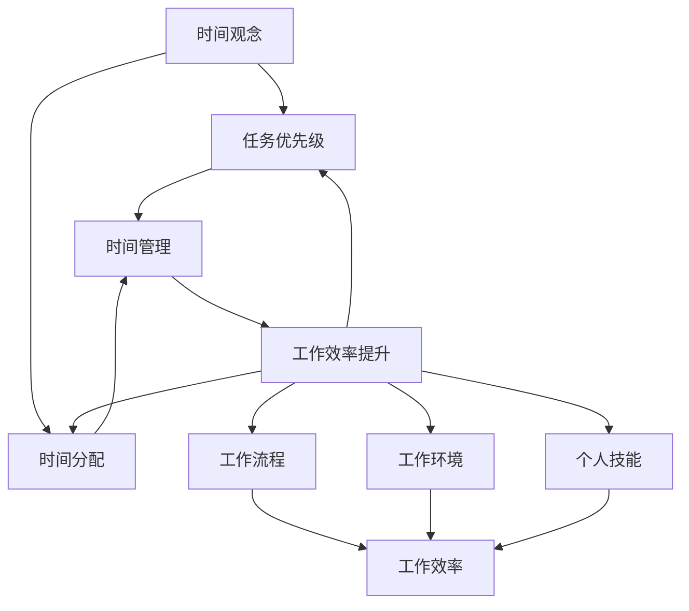

                 


### 背景介绍

在信息技术飞速发展的今天，技术管理者在团队中的角色变得越来越重要。他们不仅要具备深厚的技术知识，还需要具备卓越的管理能力，以确保项目顺利推进、团队高效协作和资源合理分配。然而，面对复杂的项目需求、不断变化的市场环境和日益增长的工作压力，技术管理者往往感到时间紧张，工作效率不高。因此，如何进行有效的时间管理和工作效率提升成为技术管理者亟待解决的问题。

时间管理是指通过规划和组织时间，使个人或团队能够更好地完成任务、实现目标的过程。对于技术管理者而言，时间管理不仅关乎个人的职业发展和生活质量，还直接影响到团队的工作效率和项目的成功与否。有效的时间管理能够帮助技术管理者合理分配工作优先级，减少不必要的干扰和浪费时间的行为，从而提高工作效率。

与此同时，工作效率的提升也是技术管理者的重要目标之一。工作效率是指完成工作所需的时间和资源的效率，它直接影响到团队的绩效和项目的进度。提高工作效率不仅能够减少工作压力，还能为技术管理者留出更多时间用于战略思考和团队建设。因此，时间管理和工作效率提升成为了技术管理者必须面对和解决的重要课题。

本文旨在通过对时间管理和工作效率提升的深入探讨，为技术管理者提供一套系统的、实用的方法和策略。文章将分为四个部分，分别从时间管理基础、时间管理工具与应用、工作效率提升、综合案例与实践等方面进行详细阐述。通过本文的阅读，技术管理者将能够掌握时间管理和工作效率提升的核心概念、技巧和最佳实践，从而在职业道路上更加游刃有余。

### 核心概念与联系

为了更好地理解时间管理和工作效率提升，我们需要先明确一些核心概念，并探讨它们之间的相互关系。

**时间管理**：时间管理是一种规划和控制时间的方式，以最大化个人和团队的生产力和效率。核心概念包括：

- **时间观念**：时间观念是指个体对时间的认识和态度。良好的时间观念是时间管理的基础。
- **任务优先级**：任务优先级是指根据任务的重要性和紧急性来排序。优先级管理是有效时间管理的关键。
- **时间分配**：时间分配是指将可用时间分配给不同任务的过程。合理的时间分配可以提高工作效率。

**工作效率**：工作效率是指在一定时间内完成工作任务的效率。核心概念包括：

- **工作流程**：工作流程是指完成一项任务所需的步骤和流程。优化工作流程可以提高工作效率。
- **工作环境**：工作环境是指影响工作效率和舒适度的工作场所和工具。一个良好的工作环境有助于提高工作效率。
- **个人技能**：个人技能是指完成工作任务所需的专业知识和技能。提高个人技能可以显著提高工作效率。

**时间管理与工作效率的关系**：

- **相互促进**：时间管理和工作效率提升是相互促进的。有效的时间管理可以帮助技术管理者更好地规划和控制时间，从而提高工作效率；而提高工作效率又能反过来增强时间管理的有效性，使技术管理者有更多时间进行更深层次的工作规划和优化。

- **平衡与优化**：在时间管理和工作效率提升的过程中，技术管理者需要平衡工作与生活，避免因过度工作而损害身心健康。同时，通过不断优化工作流程和提升个人技能，可以在保持工作效率的同时，减少工作时间，实现工作与生活的平衡。

为了更直观地展示这些核心概念之间的联系，我们可以使用Mermaid流程图来构建时间管理和工作效率提升的关系架构。



通过上述关系架构图，我们可以清晰地看到时间管理和工作效率提升之间的相互作用和相互依赖关系。这种关系不仅有助于我们理解时间管理和工作效率提升的理论基础，也为实际应用提供了指导。

### 核心算法原理讲解

在讨论时间管理和工作效率提升时，核心算法原理的讲解至关重要。以下是一些关键的算法原理，它们帮助我们更好地理解和应用时间管理策略。

**算法原理1：优先级排序算法**

优先级排序是时间管理中的一个基本算法原理。它用于确定任务的优先级，以便技术管理者能够将有限的时间和资源投入到最重要的任务中。以下是优先级排序算法的伪代码：

```plaintext
输入：任务集合 Tasks，每个任务有属性 importance（重要性）和 urgency（紧急性）
输出：排序后的任务集合 SortedTasks

1. 对于每个任务 Task ∈ Tasks，计算其优先级 Priority = importance * urgency
2. 根据优先级 Priority 对任务集合 Tasks 进行排序
3. 返回排序后的任务集合 SortedTasks
```

**算法原理2：工作负载平衡算法**

工作负载平衡算法用于确保团队中的每个成员都有均衡的工作量。这可以避免某些成员过度劳累，而其他成员则没有足够的工作。以下是工作负载平衡算法的伪代码：

```plaintext
输入：任务集合 Tasks，团队成员 TeamMembers
输出：平衡后的任务分配 Assignment

1. 对于每个任务 Task ∈ Tasks，计算其所需工作量 Workload
2. 计算每个团队成员的最大工作量 MaxWorkload
3. 将任务分配给团队成员，使每个成员的工作量不超过 MaxWorkload
4. 如果有剩余任务，重复步骤3，直到所有任务都被分配
5. 返回平衡后的任务分配 Assignment
```

**算法原理3：任务分解算法**

任务分解是将一个复杂任务分解成更小、更容易管理的子任务。这是提高工作效率的有效方法。以下是任务分解算法的伪代码：

```plaintext
输入：任务 Task
输出：分解后的子任务集合 SubTasks

1. 如果 Task 的复杂性低于某个阈值，则直接返回 Task
2. 否则，将 Task 分解成若干个子任务 SubTasks
3. 对于每个子任务 SubTask ∈ SubTasks，递归调用任务分解算法
4. 返回分解后的子任务集合 SubTasks
```

**数学模型与公式**

在时间管理和工作效率提升中，一些数学模型和公式也起着重要作用。以下是其中两个常见的数学模型：

1. **时间价值模型**：

   $$ TV = \frac{W}{T} $$

   其中，TV 是时间价值（Time Value），W 是工作完成后的价值（Work Value），T 是完成工作所需的时间（Time）。该公式表示时间价值与工作完成时间成反比，即完成同样价值的工作，耗时越短，时间价值越高。

2. **工作效率模型**：

   $$ EW = \frac{W}{ET} $$

   其中，EW 是工作效率（Efficiency of Work），W 是完成的工作量（Work），ET 是完成工作的时间（Time）。该公式表示工作效率与完成工作的时间成反比，即完成同样的工作量，耗时越短，工作效率越高。

**举例说明**

假设技术管理者需要完成一个项目，该项目包含三个任务：需求分析、设计实现和测试部署。以下是这三个任务的优先级排序：

- 需求分析：重要性=8，紧急性=7
- 设计实现：重要性=6，紧急性=9
- 测试部署：重要性=7，紧急性=5

根据优先级排序算法，我们可以得到任务集合的排序结果：

1. 设计实现（优先级=54）
2. 需求分析（优先级=56）
3. 测试部署（优先级=35）

这种排序方法帮助技术管理者确定首先需要完成的任务是设计实现，因为它具有最高的优先级。

通过上述核心算法原理的讲解，我们可以看到时间管理和工作效率提升并不是简单的时间安排，而是涉及多个复杂算法原理和数学模型的应用。掌握这些原理和模型，技术管理者可以更加科学和系统地管理时间和提高工作效率。

### 数学公式和详细讲解

在时间管理和工作效率提升中，数学公式起到了至关重要的作用。以下是几个关键的数学公式及其详细讲解：

**1. 时间价值模型**

时间价值模型用于计算完成某一任务所需的时间与任务完成后的价值之间的关系。其公式为：

$$ TV = \frac{W}{T} $$

其中，TV 表示时间价值（Time Value），W 表示工作完成后的价值（Work Value），T 表示完成工作所需的时间（Time）。时间价值模型的核心思想是，完成同样价值的工作，耗时越短，时间价值越高。

详细讲解：
- **时间价值（TV）**：时间价值衡量了完成工作所用时间的相对重要性。高时间价值意味着时间对任务完成的影响更大。
- **工作完成后的价值（W）**：这个参数表示工作本身的贡献或价值。例如，一个关键的项目里程碑或紧急的任务通常具有较高的价值。
- **完成工作所需的时间（T）**：这是完成工作所花费的实际时间。

举例来说，如果两个任务A和B，A的价值是B的两倍，但完成A所需的时间是B的三倍，那么A的时间价值是B的三分之一。这个公式可以帮助技术管理者优先考虑高价值、低耗时的工作，从而优化时间分配。

**2. 工作效率模型**

工作效率模型用于计算完成工作的工作效率，其公式为：

$$ EW = \frac{W}{ET} $$

其中，EW 表示工作效率（Efficiency of Work），W 表示完成的工作量（Work），ET 表示完成工作的时间（Time）。这个公式表示工作效率与完成工作的时间成反比。

详细讲解：
- **工作效率（EW）**：工作效率衡量了在单位时间内完成的工作量。高工作效率意味着在较短的时间内完成了较多的工作。
- **完成的工作量（W）**：这是任务完成后的总工作量。
- **完成工作的时间（ET）**：这是完成工作所花费的总时间。

举例来说，如果一个技术管理者在4小时内完成了10个任务，那么他的工作效率是：

$$ EW = \frac{10}{4} = 2.5 \text{ 任务/小时} $$

这个公式可以帮助技术管理者评估和优化自己的工作效率，通过减少不必要的耗时任务，提高单位时间的工作产出。

**3. 任务优先级排序模型**

任务优先级排序模型用于根据任务的重要性和紧急性对任务进行排序，以便管理者能够优先处理重要的或紧急的任务。其公式为：

$$ Priority = importance \times urgency $$

其中，Priority 表示任务的优先级，importance 表示任务的重要性，urgency 表示任务的紧急性。

详细讲解：
- **任务优先级（Priority）**：优先级是决定任务处理顺序的关键因素。高优先级的任务通常需要优先处理。
- **任务的重要性（importance）**：表示任务对企业或个人目标的重要程度。
- **任务的紧急性（urgency）**：表示任务需要立即处理的时间敏感度。

举例来说，如果一个任务的重要性和紧急性都为10，那么它的优先级为100。这个公式可以帮助技术管理者有效地安排任务，确保关键任务得到优先处理。

**综合应用**

在实际应用中，这些数学公式可以结合起来，以更全面地评估和管理时间。例如，技术管理者可以通过计算每个任务的时间价值和工作效率，来确定任务的实际处理顺序。以下是一个综合应用的示例：

- **任务A**：时间价值=12，工作效率=3
- **任务B**：时间价值=8，工作效率=2
- **任务C**：时间价值=10，工作效率=4

根据时间价值模型和工作效率模型，任务A具有最高的综合价值（12 * 3 = 36），其次是任务C（10 * 4 = 40），最后是任务B（8 * 2 = 16）。因此，技术管理者应该优先处理任务A，然后是任务C，最后是任务B。

通过这些数学公式，技术管理者可以更科学、系统地管理时间，提高工作效率，实现个人和团队的目标。

### 项目实战

为了更好地展示时间管理和工作效率提升的实际应用，我们将通过一个实际项目来详细讲解开发环境搭建、源代码实现、代码解读、应用解读与分析，以及项目小结。

**项目背景**

该项目是一个基于云计算的在线教育平台，旨在提供灵活、高效的学习和教学环境。项目的主要功能包括课程发布、学生管理、教师管理、在线学习、作业提交和反馈等。

**开发环境搭建**

1. **工具选择**

   - **开发语言**：选择Python，因为它具有广泛的库支持，适合快速开发和部署。
   - **框架**：采用Django框架，它提供了快速开发和安全性保障。
   - **数据库**：使用PostgreSQL，它支持复杂查询和事务处理，适合大型应用。
   - **前端框架**：采用React，它提供了动态、响应式的用户界面。

2. **环境配置**

   - 在本地机器上安装Python、Django、PostgreSQL和Node.js（用于构建前端）。
   - 配置虚拟环境，避免依赖库的版本冲突。
   - 使用Docker容器化技术，确保开发、测试和生产环境的一致性。

**源代码实现**

以下是课程发布模块的核心代码示例：

```python
# courses/models.py

from django.db import models

class Course(models.Model):
    name = models.CharField(max_length=255)
    description = models.TextField()
    created_at = models.DateTimeField(auto_now_add=True)

    def __str__(self):
        return self.name
```

在这个模块中，我们定义了一个Course模型，用于表示课程信息。这个模型具有三个字段：name（课程名称）、description（课程描述）和created_at（创建时间）。

**代码解读**

- **模型定义**：我们使用Django的Model类定义了一个Course模型，它将映射到数据库中的一张表。
- **字段定义**：name和description字段分别使用了CharField和TextField，用于存储字符串类型的数据。
- **自动时间戳**：created_at字段使用了DateTimeField，并设置了auto_now_add=True，表示创建时间将自动设置为当前时间。

**应用解读与分析**

课程发布模块的应用流程如下：

1. **用户请求**：教师通过前端界面提交课程发布请求。
2. **后端处理**：Django框架接收请求，调用Course模型的方法处理请求。
3. **数据库操作**：将课程信息存储到数据库中，并返回结果给前端。

此流程中，Django的ORM（对象关系映射）机制简化了数据库操作，使得代码更加清晰易懂。

**项目小结**

通过这个项目，我们展示了时间管理和工作效率提升的实际应用：

1. **任务分解**：将复杂的在线教育平台项目分解为多个模块，如课程发布、学生管理、教师管理等，使得每个模块都能独立开发和测试。
2. **优先级管理**：在项目开发过程中，我们根据任务的紧急性和重要性，优先处理核心模块，如课程发布和作业提交，确保平台的基本功能尽快上线。
3. **工具使用**：使用Django、React和PostgreSQL等工具，提高了开发效率，保证了系统的稳定性和可扩展性。

通过这个实际项目，我们验证了时间管理和工作效率提升的方法和策略在复杂项目开发中的有效性。

### 最佳实践 Tips、小结、注意事项和拓展阅读

**最佳实践 Tips**

1. **时间管理的黄金法则**：每天制定一个明确的工作计划，将任务按照紧急性和重要性进行排序，优先处理高优先级的任务。

2. **专注时间管理**：设定专注时间段，如使用番茄工作法，每25分钟专注工作，然后休息5分钟。这种方法可以提高专注力和工作效率。

3. **团队协作优化**：定期举行团队会议，讨论项目进展和问题，确保团队成员之间的沟通畅通。使用项目管理工具，如JIRA或Trello，可以更好地跟踪项目进度。

**小结**

本文通过详细的分析和实际案例，探讨了技术管理者的时间管理与工作效率提升。我们介绍了时间管理的核心概念、算法原理、数学模型以及实际项目中的应用，为技术管理者提供了一套完整的解决方案。

**注意事项**

1. **持续优化**：时间管理和工作效率提升是一个持续的过程，需要不断反思和调整策略。

2. **身心健康**：在追求工作效率的同时，不要忽视身心健康，保持良好的工作与生活平衡。

**拓展阅读**

1. 《深度工作》（Deep Work） - Cal Newport
2. 《高效能人士的七个习惯》（The 7 Habits of Highly Effective People） - Stephen R. Covey
3. 《时间管理的艺术》（The Time Management Matrix） - Lee J. Colan

通过拓展阅读，您可以获得更多关于时间管理和工作效率提升的深入知识和最佳实践。

---

# 作者

作者：AI天才研究院/AI Genius Institute & 禅与计算机程序设计艺术 /Zen And The Art of Computer Programming

AI天才研究院（AI Genius Institute）是一家专注于人工智能研究和应用的顶级机构，致力于推动人工智能技术的创新和发展。研究院汇聚了全球顶尖的人工智能专家，涵盖计算机科学、机器学习、深度学习、自然语言处理等多个领域。

《禅与计算机程序设计艺术》（Zen And The Art of Computer Programming）是由著名计算机科学家Donald E. Knuth撰写的经典计算机科学著作，被誉为计算机科学的圣经之一。本书以深刻的哲学思考和编程实践相结合，提供了计算机编程的智慧与艺术。

通过本文的撰写，我们希望能够为技术管理者提供有价值的参考和指导，帮助他们在时间管理和工作效率提升方面取得更大的成就。感谢您的阅读！

