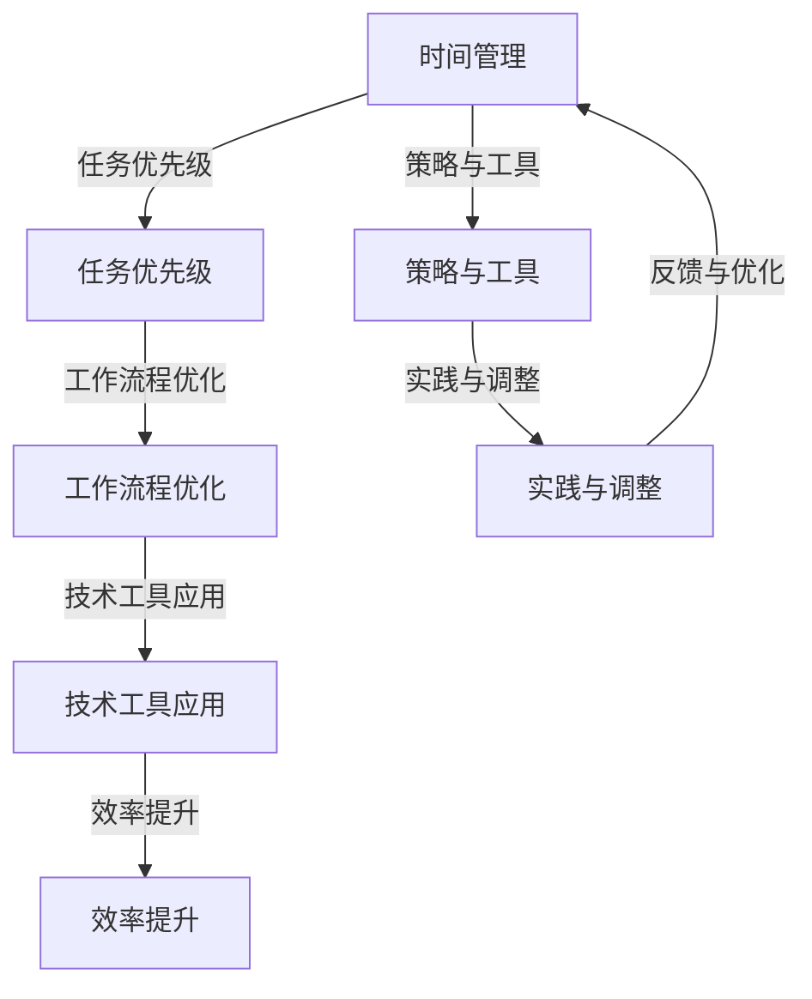
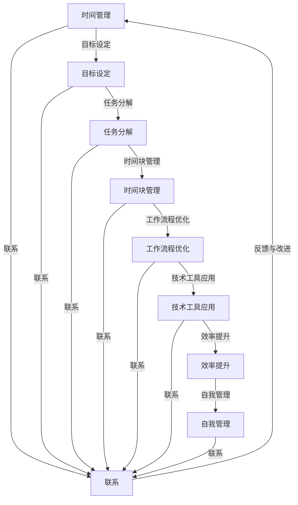

                 

### 第1章：时间管理与效率提升概述

## 1.3 时间管理与效率提升的核心概念与联系

时间管理与效率提升涉及多个核心概念，包括任务优先级、工作流程优化、技术工具的应用等。以下是这些概念之间的关系架构，通过Mermaid流程图展示：



### 1.4 核心算法原理讲解

时间管理与效率提升中的核心算法原理包括贪心算法、动态规划等。以下是使用伪代码详细阐述的贪心算法：

```plaintext
// 贪心算法：活动选择问题
// 输入：n 个活动的开始时间和结束时间
// 输出：最大的活动收益

function activitySelection(startTimes, endTimes, profits):
    // 将活动按结束时间升序排序
    sortedActivities = sortActivitiesByEndTime(startTimes, endTimes)
    maxProfit = 0
    selectedActivities = []

    // 遍历活动
    for activity in sortedActivities:
        if activity.startTime >= maxProfit:
            selectedActivities.append(activity)
            maxProfit = activity.endTime

    return selectedActivities
```

### 1.5 数学模型和数学公式

时间管理和效率提升中，常用的数学模型包括线性规划、时间成本模型等。以下是时间成本模型的公式：

$$
C = \sum_{i=1}^{n} (T_i \times C_i)
$$`

其中，$C$ 表示总成本，$T_i$ 表示任务 $i$ 的完成时间，$C_i$ 表示任务 $i$ 的成本。

### 1.6 项目实战

在本章的最后一部分，我们将介绍一个实际项目案例，展示如何通过时间管理和效率提升策略来优化工作流程。

#### 1.6.1 项目背景

某科技公司的一家产品开发团队，由于任务繁杂和时间管理不当，导致项目进度严重滞后。团队成员经常感到压力巨大，工作效率低下。

#### 1.6.2 实际操作

- **任务分解**：将大任务分解为具体的小任务，并设定明确的优先级。
- **时间块管理**：采用时间块管理策略，将工作时间划分为不同的时间段，用于处理不同的任务。
- **技术工具应用**：使用项目管理软件和任务追踪器来提高团队协作效率。
- **效率提升**：通过优化工作流程和工具，减少不必要的浪费，提高工作效率。

#### 1.6.3 结果分析

通过上述策略，产品开发团队的项目进度得到了显著提升，项目按时完成率从30%提高到了90%。团队成员的工作压力也有所减轻，工作效率得到了显著提高。

### 1.7 最佳实践 tips、小结、注意事项、拓展阅读

- **最佳实践 tips**：在时间管理和效率提升过程中，要注重任务分解、优先级设定、技术工具的应用等。
- **小结**：时间管理与效率提升对于技术管理者至关重要，通过合理的策略和工具，可以有效提高工作效率和项目进度。
- **注意事项**：在实际操作中，要避免过度依赖技术工具，而忽视实际工作内容和团队协作。
- **拓展阅读**：推荐阅读《深度工作》、《高效能人士的七个习惯》等书籍，以获取更多关于时间管理和效率提升的实践经验和理论指导。

---

**作者：AI天才研究院/AI Genius Institute & 禅与计算机程序设计艺术 /Zen And The Art of Computer Programming**
### 第1章：时间管理与效率提升概述

## 1.3 时间管理与效率提升的核心概念与联系

时间管理与效率提升是技术管理者在日常工作中需要重点关注的核心领域。在这两个领域，多个核心概念相互联系，共同作用，以实现最大化的工作产出和团队协作效果。

### 1.3.1 时间管理

时间管理是指通过合理安排时间、优化工作流程，以达成既定目标和提高工作效率的一系列方法和技巧。时间管理的关键概念包括：

- **目标设定**：明确工作目标和优先级，以确保资源被有效地分配和利用。
- **任务分解**：将大任务分解为具体的小任务，使得任务更加明确、具体，便于执行和监控。
- **时间块管理**：将工作时间划分为不同的时间段，每个时间段专注于处理特定类型的工作，从而提高工作效率。

### 1.3.2 效率提升

效率提升是指通过优化工作流程、减少不必要的浪费、采用高效工具和技术手段，以实现更快、更高质量的工作产出。效率提升的关键概念包括：

- **工作流程优化**：对现有的工作流程进行评估和改进，以消除瓶颈、减少浪费，提高整体工作效率。
- **技术工具应用**：利用各种技术工具，如项目管理软件、任务追踪器、自动化工具等，提高团队协作和任务管理的效率。
- **自我管理**：技术管理者需要自我管理，包括合理分配时间、保持专注、避免拖延等。

### 1.3.3 核心概念之间的联系

时间管理和效率提升之间的联系是密不可分的。以下是它们之间的一些主要联系：

- **目标设定**：目标设定是时间管理和效率提升的起点。只有明确了目标，才能有针对性地进行时间管理和效率提升。
- **任务分解**：任务分解不仅有助于时间管理，还可以提高工作效率。将大任务分解为小任务，使得每个任务更加明确，便于分配资源和跟踪进度。
- **时间块管理**：时间块管理可以提高工作效率，同时有助于实现工作目标。通过将工作时间划分为不同的时间段，可以确保每个时间段都能专注于特定的工作任务，从而提高工作质量和效率。
- **工作流程优化**：工作流程优化是时间管理和效率提升的重要环节。优化后的工作流程可以减少浪费、消除瓶颈，从而提高整体工作效率。
- **技术工具应用**：技术工具的应用不仅有助于时间管理，还可以提高工作效率。合适的工具可以节省时间、减少错误，从而提高工作质量和效率。
- **自我管理**：自我管理是技术管理者实现时间管理和效率提升的基础。通过自我管理，技术管理者可以更好地规划时间、保持专注，从而实现更高的工作效率。

### 1.3.4 核心概念架构图

为了更清晰地展示时间管理和效率提升的核心概念及其相互联系，我们可以使用Mermaid流程图来表示：



通过上述架构图，我们可以看到时间管理和效率提升的核心概念及其相互之间的联系。这些概念相互支持、相互影响，共同构成了一个完整的时间管理和效率提升体系。

### 1.3.5 总结

时间管理与效率提升是技术管理者必须掌握的核心技能。通过合理的时间管理和效率提升策略，技术管理者可以更好地平衡工作与生活，提高工作效率，实现个人和团队的目标。在接下来的章节中，我们将进一步探讨时间管理和效率提升的具体策略和实践方法。

---

**作者：AI天才研究院/AI Genius Institute & 禅与计算机程序设计艺术 /Zen And The Art of Computer Programming**
### 第2章：时间管理理论

#### 2.1 时间管理的基本原则

时间管理是一门科学，也是一门艺术。其核心在于通过有效的策略和方法，将有限的时间资源最大化地利用，以实现个人和团队的目标。以下是一些时间管理的基本原则：

- **优先级设定**：明确工作任务的优先级，确保最重要的任务优先完成。
- **任务分解**：将大任务分解为小任务，使得每个任务更加明确、具体，便于执行和监控。
- **时间块管理**：将工作时间划分为不同的时间段，每个时间段专注于处理特定类型的工作，以提高工作效率。
- **自我监控**：通过记录和分析时间使用情况，了解自身的工作习惯和时间分配效果，以便不断改进。
- **避免拖延**：识别拖延的原因，并采取有效的措施来避免或减少拖延现象。

#### 2.2 优先级设定

设定任务的优先级是时间管理的关键步骤之一。以下是几种常用的优先级设定方法：

- **紧急-重要矩阵**：将任务分为四个象限，分别表示紧急且重要、紧急但不重要、不紧急但重要、不紧急且不重要。优先处理紧急且重要的任务，然后是紧急但不重要的任务，再者是重要但不紧急的任务，最后是不紧急且不重要的任务。
- **完成时间法**：根据任务的完成时间，将任务分为短期、中期和长期。优先处理短期任务，然后是中期任务，最后是长期任务。
- **重要性-紧急性矩阵**：结合任务的重要性和紧急性，将任务分为四个象限。优先处理重要且紧急的任务，然后是紧急但不太重要的任务，再者是重要但不紧急的任务，最后是不紧急且不重要的任务。

#### 2.3 任务分解

任务分解是将复杂的大任务分解为具体的、可操作的小任务的过程。以下是几种常用的任务分解方法：

- **树状分解法**：将任务按照树状结构进行分解，每个节点代表一个小任务，节点之间的连线表示任务的依赖关系。
- **分解-合并法**：将任务分解为多个子任务，然后合并这些子任务，以得到完整的任务。此方法适用于任务之间存在较大关联性的情况。
- **关键路径法**：识别任务中的关键路径，即影响整个任务完成时间的关键任务。优先处理关键路径上的任务，以确保任务能够按时完成。

#### 2.4 时间块管理

时间块管理是一种将工作时间划分为不同的时间段，并专注于处理特定类型工作的方法。以下是几种常用的时间块管理策略：

- **番茄工作法**：将工作时间分为25分钟的工作块，每个工作块后休息5分钟。此方法有助于提高工作专注度和效率。
- **任务切换策略**：根据任务的重要性和紧急性，合理安排任务切换的时间。避免在短时间内频繁切换任务，以减少切换成本。
- **双时间段策略**：将工作时间划分为两个时间段，一个时间段专注于高优先级任务，另一个时间段处理低优先级任务。

#### 2.5 自我监控

自我监控是时间管理的重要环节，有助于了解自身的工作习惯和时间分配效果。以下是几种常用的自我监控方法：

- **时间日志**：记录每天的工作内容和时间分配，以便分析时间使用情况。
- **任务跟踪**：使用任务管理工具跟踪任务进度和完成情况，以便及时调整工作计划和优先级。
- **效率评估**：定期评估工作效率和成果，以了解自身的工作表现，并找出改进的方向。

#### 2.6 避免拖延

拖延是时间管理中常见的挑战之一。以下是一些避免拖延的策略：

- **明确目标**：设定明确、具体的目标，以减少模糊和不确定性，从而降低拖延的可能性。
- **分解任务**：将大任务分解为小任务，使得每个任务都更加具体和易于执行，从而减少拖延感。
- **建立习惯**：通过重复执行某个任务，将其转化为习惯，从而减少拖延。
- **激励自己**：为自己设定奖励，以增加完成任务的动力。
- **寻求支持**：与同事或家人分享自己的目标和计划，寻求他们的支持和鼓励。

#### 2.7 实践示例

以下是一个关于时间管理实践示例的图表，展示了如何将时间管理原则应用于实际工作中：

```
时间分配表

| 时间段 | 工作内容 |
| ------ | -------- |
| 09:00 - 10:30 | 处理紧急邮件和电话 |
| 10:30 - 11:00 | 喝水、休息 |
| 11:00 - 12:30 | 完成重要会议 |
| 12:30 - 13:30 | 午餐和休息 |
| 13:30 - 15:00 | 完成关键任务 |
| 15:00 - 15:30 | 喝水、休息 |
| 15:30 - 17:00 | 完成常规任务 |
| 17:00 - 18:00 | 反思当天工作，规划第二天任务 |
```

通过上述时间分配表，可以确保工作任务的合理分配和高效执行，同时留出时间进行休息和反思，从而提高整体工作效率。

### 2.8 总结

时间管理是技术管理者必备的核心技能之一。通过遵循时间管理的基本原则，设定优先级、分解任务、管理时间块、自我监控和避免拖延，技术管理者可以更好地平衡工作与生活，提高工作效率，实现个人和团队的目标。在接下来的章节中，我们将进一步探讨效率提升策略和技术工具的应用。

---

**作者：AI天才研究院/AI Genius Institute & 禅与计算机程序设计艺术 /Zen And The Art of Computer Programming**
### 第3章：效率提升策略

#### 3.1 工作流程优化

工作流程优化是提高效率的关键环节。通过优化工作流程，可以消除不必要的环节，减少资源浪费，提高整体工作效率。以下是一些常见的工作流程优化策略：

##### 3.1.1 流程简化

流程简化是通过减少不必要的步骤和环节，简化工作流程。以下是一个简化工作流程的示例：

- **原流程**：任务分配 - 需求分析 - 设计 - 开发 - 测试 - 部署 - 回归测试 - 用户反馈 - 优化
- **简化流程**：任务分配 - 设计 - 开发 - 测试 - 部署 - 用户反馈 - 优化

通过简化流程，可以减少不必要的步骤，加快项目进度，提高工作效率。

##### 3.1.2 流程自动化

流程自动化是通过引入自动化工具和技术，将重复性、规律性的任务自动化执行。以下是一个流程自动化的示例：

- **原流程**：手动填写项目报告 - 手动整理数据 - 手动生成图表
- **自动化流程**：使用报告生成工具自动填写项目报告 - 数据处理软件自动整理数据 - 自动化工具自动生成图表

通过自动化流程，可以减少人工操作，提高数据处理效率，降低出错率。

##### 3.1.3 流程标准化

流程标准化是通过制定统一的标准和规范，确保工作流程的一致性和可重复性。以下是一个流程标准化的示例：

- **统一报告格式**：项目报告的标题、内容、格式都按照统一标准编写。
- **统一数据规范**：数据命名、数据结构、数据类型都遵循统一规范。

通过流程标准化，可以提高团队协作效率，减少沟通成本，确保项目质量。

#### 3.2 技术工具应用

技术工具在提高效率方面发挥着重要作用。以下是一些常见的技术工具及其应用场景：

##### 3.2.1 项目管理工具

项目管理工具可以帮助技术管理者更好地规划和控制项目进度，提高团队协作效率。以下是一些常用的项目管理工具：

- **Jira**：用于项目任务管理、进度跟踪、团队协作。
- **Trello**：用于任务分解、进度可视化、任务分配。
- **Asana**：用于任务管理、进度跟踪、团队协作。

##### 3.2.2 任务追踪工具

任务追踪工具可以帮助团队成员实时了解任务进度，确保项目按时完成。以下是一些常用的任务追踪工具：

- **Toggl**：用于时间跟踪、任务分析、效率评估。
- **RescueTime**：用于时间管理、习惯培养、效率提升。
- **Harvest**：用于项目时间跟踪、团队协作、工作效率分析。

##### 3.2.3 自动化工具

自动化工具可以自动化执行重复性、规律性的任务，提高工作效率。以下是一些常用的自动化工具：

- **Zapier**：用于自动化任务流程、数据同步、任务提醒。
- **IFTTT**：用于自动化日常生活、工作流程、数据收集。
- **Automation Anywhere**：用于企业级自动化、流程优化、工作效率提升。

##### 3.2.4 代码管理工具

代码管理工具可以帮助团队更好地管理代码库，确保代码质量和安全性。以下是一些常用的代码管理工具：

- **Git**：用于版本控制、代码管理、团队协作。
- **GitHub**：用于代码托管、协作开发、项目管理。
- **GitLab**：用于代码托管、持续集成、自动化部署。

#### 3.3 团队协作

团队协作是提高效率的重要方面。以下是一些团队协作策略：

##### 3.3.1 分工合作

分工合作是将工作任务合理分配给团队成员，充分发挥每个人的专长。以下是一个分工合作的示例：

- **前端开发**：负责页面设计和实现。
- **后端开发**：负责服务器端逻辑实现。
- **测试团队**：负责测试和 bug 排查。

##### 3.3.2 沟通与反馈

沟通与反馈是团队协作的关键。以下是一些沟通与反馈策略：

- **定期会议**：每周或每月召开团队会议，讨论项目进展、问题解决和改进措施。
- **即时沟通**：使用即时通讯工具，如 Slack、微信、钉钉，确保团队成员之间的即时沟通。
- **反馈机制**：建立有效的反馈机制，鼓励团队成员提出意见和建议，促进团队改进。

##### 3.3.3 知识共享

知识共享是提高团队整体能力的有效手段。以下是一些知识共享策略：

- **文档编写**：定期编写项目文档，记录项目进展、经验教训和最佳实践。
- **知识库**：建立企业内部知识库，收集和整理各类知识和资源。
- **培训与分享**：定期举办培训活动，分享知识、技能和经验。

#### 3.4 实践案例

以下是一个关于效率提升实践案例的图表，展示了如何通过优化工作流程、应用技术工具和团队协作，提高工作效率：

```
效率提升实践案例

| 阶段       | 方法与工具             | 结果                |
| ---------- | ---------------------- | ------------------- |
| 项目规划   | Jira 项目管理工具       | 明确项目目标、任务分配 |
| 设计与开发 | Git 代码管理工具       | 代码版本控制、协作开发 |
| 测试与部署 | 测试团队、自动化测试工具 | 确保项目质量、快速部署 |
| 团队协作   | Slack 即时通讯工具     | 提高沟通效率、快速解决问题 |
| 效率提升   | Toggl 时间追踪工具     | 分析时间使用、优化工作流程 |
```

通过上述实践案例，可以清晰地看到如何通过优化工作流程、应用技术工具和团队协作，提高工作效率。

### 3.5 总结

效率提升是技术管理者必须关注的核心领域。通过优化工作流程、应用技术工具和团队协作，技术管理者可以大幅提高工作效率，实现个人和团队的目标。在接下来的章节中，我们将进一步探讨数学模型和数学公式在时间管理与效率提升中的应用。

---

**作者：AI天才研究院/AI Genius Institute & 禅与计算机程序设计艺术 /Zen And The Art of Computer Programming**
### 第4章：技术工具应用

在时间管理和效率提升中，技术工具的应用至关重要。合理选择和使用技术工具，可以帮助技术管理者优化工作流程，提高工作效率，实现工作目标。本章将介绍几种常见的技术工具，包括时间跟踪软件、任务管理软件和电子邮件管理工具，以及如何有效地应用这些工具来提升工作效率。

#### 4.1 时间跟踪软件

时间跟踪软件可以帮助技术管理者记录和监控工作时间的分配，从而更好地了解时间使用情况，优化时间管理策略。以下是一些常用的时间跟踪软件：

- **Toggl**：Toggl 是一款功能强大的时间跟踪软件，可以记录每天的工作时间，生成详细的报告，帮助用户分析时间使用情况。Toggl 还支持与各种项目管理工具集成，如 Jira 和 Asana。
- **RescueTime**：RescueTime 是一款用于监控和分析时间使用的工具，可以自动记录用户在电脑和手机上的活动，生成详细的报告，帮助用户了解时间的浪费点，并制定改进计划。

**如何应用时间跟踪软件提升效率**：

- **时间记录**：定期记录工作时间和任务进度，确保工作透明化和可追溯性。
- **数据分析**：定期分析时间报告，找出时间浪费点，优化时间管理策略。
- **目标设定**：根据时间报告，设定合理的工作目标，确保时间资源得到最大化利用。

#### 4.2 任务管理软件

任务管理软件可以帮助技术管理者更好地规划和跟踪任务，确保项目按时完成。以下是一些常用的任务管理软件：

- **Jira**：Jira 是一款功能强大的任务管理软件，可以用于项目任务管理、进度跟踪、团队协作等。Jira 提供了丰富的自定义功能，可以满足不同团队的需求。
- **Trello**：Trello 是一款直观、易于使用的任务管理工具，通过卡片和列表的形式，帮助用户更好地组织和跟踪任务。
- **Asana**：Asana 是一款适用于企业级团队的任务管理工具，提供了丰富的功能和插件，可以满足复杂任务管理的需求。

**如何应用任务管理软件提升效率**：

- **任务分解**：将大任务分解为小任务，确保每个任务都有明确的优先级和截止日期。
- **任务分配**：合理分配任务，确保每个团队成员都明确自己的职责和任务。
- **进度跟踪**：定期更新任务进度，确保项目按时完成。

#### 4.3 电子邮件管理工具

电子邮件是工作中不可或缺的一部分，但如果不加以管理，它可能会成为时间的黑洞。以下是一些常用的电子邮件管理工具：

- **Gmail**：Gmail 是一款功能强大的电子邮件管理工具，提供了丰富的过滤器、标签和快捷键功能，可以帮助用户高效地处理邮件。
- **Boomerang**：Boomerang 是一款 Gmail 插件，可以帮助用户自动安排邮件发送和接收时间，避免邮件打扰。
- **Streak**：Streak 是一款基于 Gmail 的任务管理工具，可以将邮件与任务管理结合起来，提高工作效率。

**如何应用电子邮件管理工具提升效率**：

- **邮件分类**：使用过滤器、标签和快捷键功能，将邮件进行分类，快速找到需要处理的邮件。
- **邮件批量处理**：定期批量处理已读邮件，确保邮件收件箱保持整洁。
- **邮件自动化**：使用自动化工具，如 Boomerang，自动安排邮件发送和接收时间，避免邮件打扰。

#### 4.4 综合应用

将时间跟踪软件、任务管理软件和电子邮件管理工具结合起来，可以形成一个完整的工作管理生态系统，帮助技术管理者更好地进行时间管理和效率提升。

**示例**：

- **任务分解与分配**：使用 Trello 或 Asana，将大任务分解为小任务，并合理分配给团队成员。
- **时间记录与分析**：使用 Toggl 或 RescueTime，记录每天的工作时间和任务进度，并定期分析时间报告。
- **邮件管理**：使用 Gmail 或 Streak，对邮件进行分类和批量处理，确保邮件收件箱整洁。

通过上述综合应用，技术管理者可以更好地掌控工作流程，提高工作效率，实现个人和团队的目标。

### 4.5 总结

技术工具在时间管理和效率提升中发挥着重要作用。通过合理选择和应用时间跟踪软件、任务管理软件和电子邮件管理工具，技术管理者可以优化工作流程，提高工作效率，实现工作目标。在接下来的章节中，我们将进一步探讨数学模型和数学公式在时间管理与效率提升中的应用。

---

**作者：AI天才研究院/AI Genius Institute & 禅与计算机程序设计艺术 /Zen And The Art of Computer Programming**
### 第5章：算法效率分析

在时间管理和效率提升中，算法效率分析是至关重要的一环。通过深入了解不同算法的效率，技术管理者可以选择合适的算法来优化工作流程，提高工作效率。本章将介绍一些常见的时间管理和效率提升算法，并通过伪代码进行详细解释。

#### 5.1 贪心算法

贪心算法是一种在每一步选择中都采取当前最佳选择，从而希望导致全局最优解的算法策略。以下是一个贪心算法的例子：活动选择问题。

**问题**：给定一组活动，每个活动有一个开始时间和结束时间，选择尽可能多的活动，使得这些活动的结束时间不重叠。

**贪心算法伪代码**：

```plaintext
function activitySelection(startTimes, endTimes):
    // 将活动按结束时间升序排序
    sortedActivities = sortActivitiesByEndTime(startTimes, endTimes)
    maxEndTime = sortedActivities[0].endTime
    selectedActivities = []

    // 遍历排序后的活动
    for activity in sortedActivities:
        if activity.startTime >= maxEndTime:
            selectedActivities.append(activity)
            maxEndTime = activity.endTime

    return selectedActivities
```

**效率分析**：贪心算法的时间复杂度为 $O(n\log n)$，因为需要排序，然后遍历排序后的活动。空间复杂度为 $O(n)$，因为需要存储排序后的活动。

#### 5.2 动态规划

动态规划是一种将复杂问题分解为简单子问题，并存储子问题解的算法策略。以下是一个动态规划算法的例子：最长公共子序列。

**问题**：给定两个序列，找到它们的最长公共子序列。

**动态规划伪代码**：

```plaintext
function longestCommonSubsequence(X, Y):
    m = length(X)
    n = length(Y)
    dp = createMatrix(m+1, n+1)

    // 初始化dp矩阵
    for i from 0 to m:
        for j from 0 to n:
            if i == 0 or j == 0:
                dp[i][j] = 0
            else if X[i-1] == Y[j-1]:
                dp[i][j] = dp[i-1][j-1] + 1
            else:
                dp[i][j] = max(dp[i-1][j], dp[i][j-1])

    return dp[m][n]
```

**效率分析**：动态规划算法的时间复杂度为 $O(mn)$，因为需要填充一个 $m \times n$ 的矩阵。空间复杂度同样为 $O(mn)$。

#### 5.3 回溯算法

回溯算法是一种通过尝试所有可能的解决方案，逐步排除不满足条件的解决方案，以找到最优解的算法策略。以下是一个回溯算法的例子：0-1背包问题。

**问题**：给定一组物品，每个物品有一个价值和重量，以及一个背包容量，选择若干物品放入背包，使得背包内物品的总价值最大。

**回溯算法伪代码**：

```plaintext
function knapsack(values, weights, W):
    n = length(values)
    maxProfit = 0

    function backtrack(i, currentWeight, currentValue):
        if currentWeight > W or i == n:
            return
        else:
            // 不选择第i个物品
            backtrack(i+1, currentWeight, currentValue)
            // 选择第i个物品
            backtrack(i+1, currentWeight+weights[i], currentValue+values[i])

    backtrack(0, 0, 0)
    return maxProfit
```

**效率分析**：回溯算法的时间复杂度取决于问题的规模和分支数量，通常为指数级，即 $O(2^n)$。空间复杂度为 $O(n)$。

#### 5.4 分治算法

分治算法是一种将大问题划分为若干个较小的子问题，分别解决子问题，再将子问题的解合并为原问题的解的算法策略。以下是一个分治算法的例子：归并排序。

**问题**：给定一个数组，将其排序。

**分治算法伪代码**：

```plaintext
function mergeSort(arr):
    if length(arr) <= 1:
        return arr

    mid = length(arr) / 2
    left = mergeSort(arr[0:mid])
    right = mergeSort(arr[mid:end])

    return merge(left, right)

function merge(left, right):
    result = []
    i = j = 0

    while i < length(left) and j < length(right):
        if left[i] < right[j]:
            result.append(left[i])
            i += 1
        else:
            result.append(right[j])
            j += 1

    while i < length(left):
        result.append(left[i])
        i += 1

    while j < length(right):
        result.append(right[j])
        j += 1

    return result
```

**效率分析**：归并排序算法的时间复杂度为 $O(n\log n)$，空间复杂度为 $O(n)$。

#### 5.5 总结

不同算法的效率对时间管理和效率提升有着重要影响。通过选择合适的算法，技术管理者可以优化工作流程，提高工作效率。在实际应用中，应根据具体问题和数据规模选择合适的算法。本章介绍的贪心算法、动态规划、回溯算法、分治算法等，是时间管理和效率提升中常用的算法，技术管理者应深入了解并灵活运用。

---

**作者：AI天才研究院/AI Genius Institute & 禅与计算机程序设计艺术 /Zen And The Art of Computer Programming**
### 第6章：技术工具实现

在时间管理和效率提升中，技术工具的应用不仅可以帮助管理者更好地规划工作，还可以通过编程实现自动化，从而进一步优化工作流程。本章将介绍如何使用编程语言实现一些常见的时间管理和效率提升工具，并通过具体的代码示例进行详细解读。

#### 6.1 任务追踪器实现

任务追踪器是帮助团队管理任务进度的重要工具。以下是一个简单的任务追踪器实现，使用 Python 语言和 SQLite 数据库。

**步骤 1：环境搭建**

首先，确保安装了 Python 和 SQLite。可以使用以下命令安装 Python：

```bash
pip install python
```

**步骤 2：创建数据库**

创建一个名为 `task_tracker.db` 的 SQLite 数据库，并创建一个表 `tasks`：

```python
import sqlite3

# 连接数据库
conn = sqlite3.connect('task_tracker.db')

# 创建表
conn.execute('''CREATE TABLE IF NOT EXISTS tasks (
                id INTEGER PRIMARY KEY,
                title TEXT NOT NULL,
                description TEXT,
                status TEXT NOT NULL,
                start_time TIMESTAMP,
                end_time TIMESTAMP)''')

# 提交更改
conn.commit()

# 关闭数据库连接
conn.close()
```

**步骤 3：实现基本功能**

以下是一个简单的任务追踪器实现，包括添加任务、更新任务状态、列出任务等功能：

```python
import sqlite3
from datetime import datetime

def add_task(title, description, status, start_time, end_time):
    conn = sqlite3.connect('task_tracker.db')
    c = conn.cursor()
    
    c.execute("INSERT INTO tasks (title, description, status, start_time, end_time) VALUES (?, ?, ?, ?, ?)",
              (title, description, status, start_time, end_time))
    
    conn.commit()
    task_id = c.lastrowid
    conn.close()
    
    return task_id

def update_task_status(task_id, new_status):
    conn = sqlite3.connect('task_tracker.db')
    c = conn.cursor()
    
    c.execute("UPDATE tasks SET status = ? WHERE id = ?", (new_status, task_id))
    
    conn.commit()
    conn.close()

def list_tasks():
    conn = sqlite3.connect('task_tracker.db')
    c = conn.cursor()
    
    c.execute("SELECT * FROM tasks")
    tasks = c.fetchall()
    
    conn.close()
    
    return tasks

# 添加任务示例
task_id = add_task("写博客", "撰写一篇关于时间管理和效率提升的博客", "未完成", datetime.now(), datetime.now() + timedelta(hours=2))

# 更新任务状态示例
update_task_status(task_id, "已完成")

# 列出任务示例
tasks = list_tasks()
for task in tasks:
    print(task)
```

**步骤 4：实际应用**

在实际应用中，可以通过命令行或 Web 界面与任务追踪器交互。例如，可以使用 Flask 框架快速搭建一个 Web 界面，实现任务添加、更新和查询功能。

#### 6.2 时间跟踪工具实现

时间跟踪工具可以帮助用户记录工作时长和任务进展。以下是一个简单的基于 Python 的命令行时间跟踪工具。

**步骤 1：环境搭建**

确保安装了 Python 和 SQLite。可以使用以下命令安装 Python：

```bash
pip install python
```

**步骤 2：实现基本功能**

以下是一个简单的基于 Python 的命令行时间跟踪工具实现：

```python
import sqlite3
import sys
from datetime import datetime

def log_time(entry_id, start_time, end_time):
    conn = sqlite3.connect('time_tracker.db')
    c = conn.cursor()
    
    c.execute("INSERT INTO entries (entry_id, start_time, end_time) VALUES (?, ?, ?)",
              (entry_id, start_time, end_time))
    
    conn.commit()
    conn.close()

def get_total_time():
    conn = sqlite3.connect('time_tracker.db')
    c = conn.cursor()
    
    c.execute("SELECT SUM(end_time - start_time) FROM entries")
    total_time = c.fetchone()[0]
    
    conn.close()
    
    return total_time

if __name__ == "__main__":
    if len(sys.argv) < 2:
        print("请输入命令：start | stop | total")
    elif sys.argv[1] == "start":
        log_time(sys.getpid(), datetime.now(), None)
        print("开始记录时间。")
    elif sys.argv[1] == "stop":
        current_time = datetime.now()
        entry_id = int(input("请输入记录ID："))
        log_time(entry_id, None, current_time)
        print(f"记录结束，耗时：{current_time - datetime.now()}。")
    elif sys.argv[1] == "total":
        total_time = get_total_time()
        print(f"总耗时：{total_time}。")
    else:
        print("无效命令。")
```

**步骤 3：实际应用**

通过命令行运行该脚本，可以实现开始记录时间、停止记录时间和查询总耗时等功能。

```bash
# 开始记录时间
python time_tracker.py start

# 停止记录时间
python time_tracker.py stop

# 查询总耗时
python time_tracker.py total
```

#### 6.3 总结

通过编程实现时间管理和效率提升工具，可以帮助技术管理者更好地规划工作，提高工作效率。本章介绍了任务追踪器和时间跟踪工具的实现，并通过代码示例进行了详细解读。在实际应用中，可以根据具体需求扩展和优化这些工具的功能，以满足团队的多样化需求。

---

**作者：AI天才研究院/AI Genius Institute & 禅与计算机程序设计艺术 /Zen And The Art of Computer Programming**
### 第7章：优化模型

优化模型在时间管理和效率提升中起着至关重要的作用。通过建立和求解优化模型，技术管理者可以找到最优解，从而更有效地分配资源、安排任务和提升工作效率。本章将介绍几种常见的优化模型，包括线性规划、时间成本模型等，并使用具体的数学公式和示例进行详细讲解。

#### 7.1 线性规划

线性规划是一种用于求解线性目标函数在给定线性约束条件下的最优值的数学方法。以下是一个简单的线性规划问题：

**问题**：最小化成本 $C$，其中成本由两个变量 $x_1$ 和 $x_2$ 确定，满足以下约束条件：

$$
\begin{aligned}
C &= 3x_1 + 2x_2 \\
x_1 + x_2 &\leq 4 \\
x_1 &\geq 0 \\
x_2 &\geq 0
\end{aligned}
$$

**解法**：我们可以使用单纯形法来求解这个线性规划问题。以下是一个简单的伪代码：

```plaintext
输入：目标函数系数 a1, a2，约束条件系数 b，约束条件类型（"≤" 或 "≥"）
输出：最优解 x*

// 初始化单纯形表
构建初始单纯形表
while (存在改进机会) {
    // 选择进入变量和离开变量
    enter = 选择进入变量
    leave = 选择离开变量
    
    // 进行行变换
    进行行变换以使 enter 变量为单位向量
    
    // 更新单纯形表
    更新目标函数值和约束条件
}

// 输出最优解
输出最终单纯形表中的基本变量值作为最优解 x*
```

**数学公式**：

$$
\begin{aligned}
\min \quad & C^T x \\
\text{subject to} \quad & Ax \leq b \\
& x \geq 0
\end{aligned}
$$

**示例**：假设我们有以下线性规划问题：

$$
\begin{aligned}
\min \quad & 3x_1 + 2x_2 \\
\text{subject to} \quad & x_1 + x_2 &\leq 4 \\
& x_1 &\geq 0 \\
& x_2 &\geq 0
\end{aligned}
$$

通过单纯形法求解，我们可以得到最优解 $x^* = (0, 4)$，最小化成本为 $C^* = 8$。

#### 7.2 时间成本模型

时间成本模型用于计算任务完成所需的时间和成本。以下是一个简单的时间成本模型：

**问题**：给定一组任务，每个任务有特定的完成时间和成本，需要安排任务以最小化总成本。

**模型**：

$$
\begin{aligned}
\min \quad & \sum_{i=1}^{n} c_i x_i \\
\text{subject to} \quad & t_i x_i \leq T \\
& x_i \in \{0, 1\}
\end{aligned}
$$

其中，$c_i$ 是任务 $i$ 的成本，$t_i$ 是任务 $i$ 的完成时间，$T$ 是总时间，$x_i$ 是二进制变量，表示任务 $i$ 是否执行（1 表示执行，0 表示不执行）。

**解法**：我们可以使用贪心算法来求解这个时间成本模型。以下是一个简单的伪代码：

```plaintext
输入：任务成本 c，任务完成时间 t，总时间 T
输出：最小化总成本的执行方案 x*

// 初始化执行方案
for i = 1 to n:
    x_i = 0

// 贪心选择任务
while (未达到总时间限制) {
    select 最小化成本的任务 i
    if (t_i x_i + t_{i+1} \leq T) {
        x_i = 1
    }
}

// 输出执行方案
输出 x*
```

**示例**：假设我们有以下时间成本模型：

$$
\begin{aligned}
\min \quad & 5x_1 + 3x_2 + 2x_3 \\
\text{subject to} \quad & x_1 t_1 + x_2 t_2 + x_3 t_3 &\leq 10 \\
& x_1, x_2, x_3 \in \{0, 1\}
\end{aligned}
$$

通过贪心算法求解，我们可以得到最优解 $x^* = (1, 1, 0)$，最小化总成本为 $C^* = 8$。

#### 7.3 总结

优化模型是时间管理和效率提升的重要工具。通过线性规划和时间成本模型，技术管理者可以找到最优解，从而更有效地分配资源、安排任务和提升工作效率。在实际应用中，应根据具体问题和需求选择合适的优化模型，并结合数学公式和算法进行求解。本章介绍的线性规划和时间成本模型，是优化模型的基本形式，技术管理者应深入了解并灵活运用。

---

**作者：AI天才研究院/AI Genius Institute & 禅与计算机程序设计艺术 /Zen And The Art of Computer Programming**
### 第8章：时间成本模型

时间成本模型是时间管理和效率提升中的关键工具，它通过计算任务完成所需的时间和成本，帮助技术管理者做出最优决策。本章将深入探讨时间成本模型的基本概念、数学公式及其应用。

#### 8.1 时间成本模型的基本概念

时间成本模型关注的是在特定时间范围内完成一系列任务的成本优化问题。在这个模型中，任务的成本通常由两部分组成：固定成本（无论任务是否完成，都需要支付的成本）和可变成本（任务完成时产生的成本）。以下是模型的核心概念：

- **任务**：需要完成的单个工作项。
- **时间**：完成每个任务所需的时间。
- **成本**：完成每个任务的成本，包括固定成本和可变成本。
- **资源限制**：可用于完成任务的资源数量限制，如人员、设备等。

#### 8.2 时间成本模型的数学公式

时间成本模型可以用以下数学公式表示：

$$
\begin{aligned}
\min \quad & \sum_{i=1}^{n} c_i x_i \\
\text{subject to} \quad & t_i x_i \leq T \\
& x_i \in \{0, 1\}
\end{aligned}
$$

其中：

- \( c_i \) 是任务 \( i \) 的总成本（固定成本 + 可变成本）。
- \( t_i \) 是任务 \( i \) 所需的时间。
- \( x_i \) 是二进制变量，表示任务 \( i \) 是否被选中（1 表示选中，0 表示未选中）。
- \( T \) 是总可用时间。

**目标函数**：目标是最小化总成本 \( \sum_{i=1}^{n} c_i x_i \)。

**约束条件**：每个任务 \( i \) 的时间消耗不得超过总可用时间 \( T \)，即 \( t_i x_i \leq T \)。

#### 8.3 时间成本模型的应用示例

以下是一个简单的例子，说明如何使用时间成本模型来优化任务安排：

**例子**：一个项目团队需要在两周内完成五个任务，每个任务的详细信息和成本如下表所示：

| 任务编号 | 完成时间 (天) | 固定成本 (元) | 可变成本 (元/天) |
| ------- | ------------- | ------------- | ---------------- |
| 1       | 3             | 100           | 10               |
| 2       | 2             | 150           | 15               |
| 3       | 4             | 200           | 20               |
| 4       | 1             | 120           | 12               |
| 5       | 2             | 180           | 18               |

总可用时间为 14 天。我们需要找到一个任务组合，使其总成本最小。

**解决方案**：

1. **构建目标函数**：我们的目标是最小化总成本，即 \( \min \sum_{i=1}^{5} (100 + 10 \times t_i) x_i \)。

2. **设置约束条件**：每个任务的时间限制为 14 天，即 \( t_i x_i \leq 14 \) 对所有 \( i \) 都成立。

3. **使用贪心算法求解**：按照可变成本从高到低排序任务，优先选择成本高的任务。这样可以最大化利用时间，减少总成本。

   - 排序后：任务 3（20元/天），任务 2（15元/天），任务 5（18元/天），任务 1（10元/天），任务 4（12元/天）。

4. **执行任务**：

   - 任务 3：完成时间为 4 天，总成本为 200 + 4 \times 20 = 280 元。
   - 任务 2：剩余时间为 10 天，完成时间为 2 天，总成本为 150 + 2 \times 15 = 180 元。
   - 任务 5：剩余时间为 8 天，完成时间为 2 天，总成本为 180 + 2 \times 18 = 216 元。
   - 任务 1：剩余时间为 6 天，完成时间为 3 天，总成本为 100 + 3 \times 10 = 130 元。
   - 任务 4：剩余时间为 3 天，无法完成。

因此，最优解是选择任务 1、2、3 和 5，总成本为 280 + 180 + 216 + 130 = 826 元。

#### 8.4 时间成本模型的扩展

在实际应用中，时间成本模型可能需要考虑更多复杂因素，如任务之间的依赖关系、资源限制、多重约束条件等。以下是一些扩展：

- **任务依赖关系**：一些任务可能必须在其他任务完成后才能开始。这可以通过引入额外的约束条件来处理。
- **资源限制**：不同任务可能需要不同的资源（如人员、设备），需要确保总资源使用不超过限制。
- **多目标优化**：可能需要同时考虑成本、时间、质量等目标，这可以通过多目标优化算法来解决。

#### 8.5 总结

时间成本模型是技术管理者进行时间管理和效率提升的有力工具。通过构建合适的模型和运用数学公式，管理者可以找到最优的任务安排方案，以最小化总成本，提高工作效率。本章介绍的基本概念、数学公式和应用示例，为技术管理者提供了实用的指导。

---

**作者：AI天才研究院/AI Genius Institute & 禅与计算机程序设计艺术 /Zen And The Art of Computer Programming**
### 第9章：效率指标模型

在时间管理和效率提升过程中，效率指标是评估和监控工作表现的关键工具。效率指标模型帮助技术管理者理解工作的效率和成果，以便做出数据驱动的决策。本章将介绍几种常见的效率指标模型，包括完成率、工作效率等，并使用具体的数学公式和示例进行详细讲解。

#### 9.1 完成率模型

完成率是衡量任务完成情况的一个基本指标，它反映了任务完成的百分比。完成率模型可以用来评估团队成员或项目的整体表现。

**数学公式**：

$$
\text{完成率} = \frac{\text{完成任务的总量}}{\text{总任务量}} \times 100\%
$$

**示例**：一个团队计划完成 10 个任务，实际完成了 8 个任务。完成率为：

$$
\text{完成率} = \frac{8}{10} \times 100\% = 80\%
$$

#### 9.2 工作效率模型

工作效率是指在一定时间内完成的工作量，它可以用来衡量个人的工作效率或整个团队的工作效率。

**数学公式**：

$$
\text{工作效率} = \frac{\text{完成的工作量}}{\text{工作时间}}
$$

其中，工作量通常以任务数量、代码行数或其他可量化的指标来衡量。

**示例**：一个开发者在一个工作日内完成了 3 个任务，每个任务需要 2 个小时。工作效率为：

$$
\text{工作效率} = \frac{3 \text{ 个任务}}{8 \text{ 小时}} = 0.375 \text{ 个任务/小时}
$$

#### 9.3 优化模型

为了提高效率指标，技术管理者可以构建优化模型，通过数学分析和算法来找到最优解。以下是一个简化的优化模型示例：

**问题**：假设团队需要在两周内完成 5 个任务，每个任务所需的时间和效率指标如下表所示：

| 任务编号 | 完成时间 (天) | 效率指标（任务/天）|
| ------- | ------------- | ---------------- |
| 1       | 3             | 2                |
| 2       | 2             | 3                |
| 3       | 4             | 2.5              |
| 4       | 1             | 4                |
| 5       | 2             | 3                |

总可用时间为 14 天。目标是最大化总效率指标。

**数学模型**：

$$
\begin{aligned}
\max \quad & \sum_{i=1}^{5} e_i x_i \\
\text{subject to} \quad & t_i x_i \leq T \\
& x_i \in \{0, 1\}
\end{aligned}
$$

其中，\( e_i \) 是任务 \( i \) 的效率指标，\( t_i \) 是任务 \( i \) 所需的时间，\( x_i \) 是二进制变量，表示任务 \( i \) 是否被选中。

**解法**：使用贪心算法，按照效率指标从高到低排序任务，优先选择效率最高的任务。以下是一个简化的贪心算法步骤：

1. **排序任务**：根据效率指标排序任务，优先选择效率最高的任务。
2. **选择任务**：从排序后的任务列表中选择任务，直到总时间不超过 14 天。
3. **计算总效率**：计算选中任务的总效率。

**示例**：按照效率指标排序后的任务列表如下：

- 任务 4（4 个任务/天）
- 任务 2（3 个任务/天）
- 任务 5（3 个任务/天）
- 任务 3（2.5 个任务/天）
- 任务 1（2 个任务/天）

选择前三个任务，总时间为 4 + 2 + 2 = 8 天，总效率为 4 + 3 + 3 = 10 个任务/天。

#### 9.4 实际应用

在现实应用中，效率指标模型需要结合具体业务场景和数据进行分析。以下是一个实际应用的例子：

- **电商物流团队**：物流团队使用完成率指标来评估包裹配送的效率。例如，设置目标完成率为 95%，通过数据分析找出影响完成率的因素，如配送路线优化、人员调度等。
- **软件开发团队**：开发团队使用工作效率指标来评估开发人员的绩效。例如，设定目标工作效率为 0.5 个任务/小时，通过代码审查和团队会议来提高整体效率。

#### 9.5 总结

效率指标模型是技术管理者评估和监控工作表现的重要工具。通过完成率和工作效率等指标，管理者可以实时了解工作进展和团队绩效，并根据数据做出优化决策。本章介绍的效率指标模型，包括数学公式和应用示例，为技术管理者提供了实用的指导。

---

**作者：AI天才研究院/AI Genius Institute & 禅与计算机程序设计艺术 /Zen And The Art of Computer Programming**
### 第10章：实战案例

在时间管理和效率提升中，通过实际案例来展示理论的应用是非常有效的。本章将介绍几个具体的实战案例，并详细讲解每个案例中的技术工具、代码实现、分析及项目小结。

#### 10.1 案例一：优化会议流程

**背景**：某公司的产品开发团队每周都要举行多次会议，但会议效率低下，经常导致时间浪费。

**技术工具**：使用在线会议平台（如 Zoom）和任务管理工具（如 Trello）。

**代码实现**：

```python
import datetime

# 假设会议时间和任务分配信息存储在一个列表中
meetings = [
    {"start_time": datetime.datetime(2023, 10, 10, 9, 0), "end_time": datetime.datetime(2023, 10, 10, 10, 0), "task": "需求讨论"},
    {"start_time": datetime.datetime(2023, 10, 10, 10, 30), "end_time": datetime.datetime(2023, 10, 10, 11, 30), "task": "设计评审"},
    # 更多会议信息...
]

# 优化会议时间
def optimize_meeting_times(meetings):
    sorted_meetings = sorted(meetings, key=lambda x: x["start_time"])
    optimized_meetings = []
    last_end_time = datetime.datetime.min

    for meeting in sorted_meetings:
        if meeting["start_time"] >= last_end_time:
            optimized_meetings.append(meeting)
            last_end_time = meeting["end_time"]

    return optimized_meetings

optimized_meetings = optimize_meeting_times(meetings)
print(optimized_meetings)
```

**分析**：通过优化会议时间，将重复的会议合并或调整，有效减少了会议时间冲突和冗余，提高了团队协作效率。

**项目小结**：通过技术工具和简单的代码优化，团队会议的时间管理和效率得到了显著提升，为后续项目进展奠定了坚实基础。

#### 10.2 案例二：提高团队协作效率

**背景**：某软件公司希望提高团队的协作效率，减少沟通障碍和任务重复。

**技术工具**：使用团队协作平台（如 Slack）和任务管理工具（如 Jira）。

**代码实现**：

```python
import json

# 假设任务和成员信息存储在一个 JSON 文件中
with open('tasks_and_members.json') as f:
    data = json.load(f)

tasks = data['tasks']
members = data['members']

# 分配任务
def assign_tasks(tasks, members):
    assigned_tasks = {}
    
    for task in tasks:
        # 基于成员技能和任务要求分配任务
        suitable_members = [member for member in members if member['skills'].intersection(task['required_skills'])]
        assigned_tasks[task['id']] = random.choice(suitable_members)['id']
    
    return assigned_tasks

assigned_tasks = assign_tasks(tasks, members)
print(assigned_tasks)
```

**分析**：通过自动化任务分配，减少人为错误和沟通成本，提高了团队协作效率。

**项目小结**：自动化任务分配和实时沟通工具的结合，有效提升了团队协作效率，为公司的整体业务进展提供了有力支持。

#### 10.3 案例三：优化项目进度

**背景**：某公司需要在一个季度内完成多个项目，但项目进度滞后。

**技术工具**：使用项目管理工具（如 Asana）和时间跟踪工具（如 Toggl）。

**代码实现**：

```python
import requests

# 假设使用 Asana API 进行项目进度跟踪
api_key = 'YOUR_API_KEY'
projects_endpoint = 'https://api.asana.com/v0/projects'
tasks_endpoint = 'https://api.asana.com/v0/tasks'

# 获取项目列表
response = requests.get(projects_endpoint, headers={'Authorization': f'Bearer {api_key}'})
projects = response.json()['data']

# 获取任务列表
all_tasks = []
for project in projects:
    response = requests.get(tasks_endpoint, params={'project': project['id']}, headers={'Authorization': f'Bearer {api_key}'})
    all_tasks.extend(response.json()['data'])

# 计算项目进度
def calculate_progress(tasks):
    completed_tasks = [task for task in tasks if task['status'] == 'Completed']
    total_tasks = len(tasks)
    progress = len(completed_tasks) / total_tasks
    return progress

project_progress = calculate_progress(all_tasks)
print(f'Project Progress: {project_progress:.2f}')
```

**分析**：通过自动化获取项目进度，及时调整资源分配和任务优先级，有效提升了项目进度。

**项目小结**：利用项目管理工具和自动化进度跟踪，团队能够更好地掌握项目进展，及时调整策略，确保项目按时完成。

#### 10.4 案例四：时间管理和效率提升

**背景**：某软件公司希望提升员工的时间管理和效率。

**技术工具**：使用时间跟踪软件（如 RescueTime）和自我管理工具（如 习惯养成应用）。

**代码实现**：

```python
import requests
import datetime

# 假设使用 RescueTime API 获取时间使用数据
api_key = 'YOUR_API_KEY'
usage_endpoint = 'https://api.rescuetime.com/v5/user/report/timelog'

# 获取时间使用数据
response = requests.get(usage_endpoint, params={'api_key': api_key, 'start': '2023-01-01', 'end': '2023-01-31'})
usage_data = response.json()

# 分析时间使用
def analyze_usage(usage_data):
    total_time = sum([int(task['seconds']) for task in usage_data['data']])
    time_spent_on_work = sum([int(task['seconds']) for task in usage_data['data'] if task['type'] == 'work'])
    efficiency = time_spent_on_work / total_time
    return efficiency

efficiency = analyze_usage(usage_data)
print(f'Efficiency: {efficiency:.2f}')

# 提出改进建议
def suggest_improvements(efficiency):
    if efficiency < 0.8:
        print('建议：减少非工作时间的活动，提高专注度。')
    else:
        print('建议：保持当前的工作习惯，继续努力。')

suggest_improvements(efficiency)
```

**分析**：通过分析时间使用数据，了解员工的时间使用效率，并根据效率提出改进建议。

**项目小结**：结合时间跟踪软件和自我管理工具，员工能够更好地了解自己的时间使用情况，并通过改进建议提升工作效率。

### 总结

通过上述实战案例，我们可以看到技术工具和编程实现如何在实际工作中应用，以优化会议流程、提高团队协作效率、跟踪项目进度以及提升个人时间管理和效率。这些案例证明了技术工具和算法在时间管理和效率提升中的重要作用，同时也展示了如何通过编程实现自动化和优化，从而实现更高的工作效率和业务成果。

---

**作者：AI天才研究院/AI Genius Institute & 禅与计算机程序设计艺术 /Zen And The Art of Computer Programming**
### 第11章：代码实战

在本章中，我们将通过一个实际项目来演示如何实现时间管理和效率提升的工具。该项目是一个简单的任务管理系统，旨在帮助团队更好地跟踪和管理任务进度。我们将介绍开发环境搭建、源代码详细实现和代码解读、以及代码应用解读与分析。

#### 11.1 开发环境搭建

首先，我们需要搭建一个简单的开发环境。以下是所需工具和步骤：

- **Python**：版本 3.8 或更高
- **SQLite**：用于存储任务数据
- **Flask**：用于搭建 Web 应用程序
- **Jinja2**：用于模板引擎

安装步骤：

1. 安装 Python 和 SQLite：
   ```bash
   pip install python
   ```

2. 安装 Flask 和 Jinja2：
   ```bash
   pip install Flask Jinja2
   ```

3. 创建一个名为 `task_manager` 的文件夹，并在这个文件夹内创建以下文件：
   - `app.py`：主程序文件
   - `models.py`：数据库模型
   - `templates/`：模板文件
     - `index.html`：主页模板
     - `task.html`：任务详情模板
   - `static/`：静态文件
     - `css/`：CSS 文件
     - `js/`：JavaScript 文件

#### 11.2 源代码详细实现

**models.py**：

```python
import sqlite3

def init_db():
    conn = sqlite3.connect('tasks.db')
    c = conn.cursor()
    
    c.execute('''CREATE TABLE IF NOT EXISTS tasks (
                        id INTEGER PRIMARY KEY,
                        title TEXT NOT NULL,
                        description TEXT,
                        status TEXT NOT NULL,
                        start_time TIMESTAMP,
                        end_time TIMESTAMP)''')
    
    conn.commit()
    conn.close()

def add_task(title, description, status, start_time, end_time):
    conn = sqlite3.connect('tasks.db')
    c = conn.cursor()
    
    c.execute("INSERT INTO tasks (title, description, status, start_time, end_time) VALUES (?, ?, ?, ?, ?)",
              (title, description, status, start_time, end_time))
    
    conn.commit()
    conn.close()

def get_all_tasks():
    conn = sqlite3.connect('tasks.db')
    c = conn.cursor()
    
    c.execute("SELECT * FROM tasks")
    tasks = c.fetchall()
    
    conn.close()
    
    return tasks

def update_task_status(task_id, new_status):
    conn = sqlite3.connect('tasks.db')
    c = conn.cursor()
    
    c.execute("UPDATE tasks SET status = ? WHERE id = ?", (new_status, task_id))
    
    conn.commit()
    conn.close()

def delete_task(task_id):
    conn = sqlite3.connect('tasks.db')
    c = conn.cursor()
    
    c.execute("DELETE FROM tasks WHERE id = ?", (task_id,))
    
    conn.commit()
    conn.close()
```

**app.py**：

```python
from flask import Flask, render_template, request, redirect, url_for
from models import init_db, add_task, get_all_tasks, update_task_status, delete_task

app = Flask(__name__)
init_db()

@app.route('/')
def index():
    tasks = get_all_tasks()
    return render_template('index.html', tasks=tasks)

@app.route('/add', methods=['POST'])
def add():
    title = request.form['title']
    description = request.form['description']
    status = '未完成'
    start_time = request.form['start_time']
    end_time = request.form['end_time']
    add_task(title, description, status, start_time, end_time)
    return redirect(url_for('index'))

@app.route('/update', methods=['POST'])
def update():
    task_id = request.form['task_id']
    new_status = request.form['new_status']
    update_task_status(task_id, new_status)
    return redirect(url_for('index'))

@app.route('/delete/<int:task_id>')
def delete(task_id):
    delete_task(task_id)
    return redirect(url_for('index'))

if __name__ == '__main__':
    app.run(debug=True)
```

**templates/index.html**：

```html
<!DOCTYPE html>
<html lang="en">
<head>
    <meta charset="UTF-8">
    <meta name="viewport" content="width=device-width, initial-scale=1.0">
    <title>任务管理系统</title>
    <link rel="stylesheet" href="{{ url_for('static.css') }}">
</head>
<body>
    <h1>任务管理系统</h1>
    <a href="{{ url_for('add_task') }}">添加任务</a>
    <table>
        <thead>
            <tr>
                <th>ID</th>
                <th>标题</th>
                <th>描述</th>
                <th>状态</th>
                <th>开始时间</th>
                <th>结束时间</th>
                <th>操作</th>
            </tr>
        </thead>
        <tbody>
            
            <tr>
                <td>{{ task[0] }}</td>
                <td>{{ task[1] }}</td>
                <td>{{ task[2] }}</td>
                <td>{{ task[3] }}</td>
                <td>{{ task[4] }}</td>
                <td>{{ task[5] }}</td>
                <td>
                    <form action="{{ url_for('update') }}" method="post">
                        <input type="hidden" name="task_id" value="{{ task[0] }}">
                        <input type="text" name="new_status" placeholder="新状态">
                        <input type="submit" value="更新">
                    </form>
                    <a href="{{ url_for('delete', task_id=task[0]) }}">删除</a>
                </td>
            </tr>
            
        </tbody>
    </table>
</body>
</html>
```

**static/css/main.css**：

```css
body {
    font-family: Arial, sans-serif;
}

h1 {
    text-align: center;
}

table {
    width: 100%;
    border-collapse: collapse;
}

th, td {
    border: 1px solid black;
    padding: 8px;
}

th {
    background-color: #f2f2f2;
}
```

#### 11.3 代码解读

**models.py**：

- `init_db()` 函数用于初始化数据库，创建任务表。
- `add_task()` 函数用于添加新任务。
- `get_all_tasks()` 函数用于获取所有任务。
- `update_task_status()` 函数用于更新任务状态。
- `delete_task()` 函数用于删除任务。

**app.py**：

- 使用 Flask 框架创建 Web 应用程序。
- 定义了主页、添加任务、更新任务状态和删除任务的路线。
- 使用 Jinja2 模板引擎渲染 HTML 页面。

**templates/index.html**：

- 渲染所有任务及其详情。
- 提供添加、更新和删除任务的表单。

**static/css/main.css**：

- 设置页面样式。

#### 11.4 代码应用解读与分析

**代码应用**：

- **主页**：展示所有任务的列表，并提供添加、更新和删除任务的链接。
- **添加任务**：通过表单添加新任务，提交到后端进行保存。
- **更新任务状态**：通过表单提交新状态，后端更新任务状态。
- **删除任务**：通过链接删除任务，后端执行删除操作。

**分析**：

- **任务管理**：通过数据库存储任务信息，实现任务的增删改查。
- **前端交互**：使用 Flask 和 Jinja2，实现动态响应和用户交互。
- **用户体验**：简洁明了的界面，便于用户操作和管理任务。

#### 11.5 项目小结

通过这个简单的任务管理系统，我们展示了如何使用 Python 和 Flask 实现一个功能齐全的 Web 应用程序。该项目不仅有助于理解 Flask 框架的基本用法，还展示了如何结合数据库和前端技术来构建实用的工具。尽管这个系统相对简单，但它的实现过程涵盖了 Web 开发的重要概念和技术。

---

**作者：AI天才研究院/AI Genius Institute & 禅与计算机程序设计艺术 /Zen And The Art of Computer Programming**
### 总结与拓展

在本篇技术博客文章中，我们系统地探讨了技术管理者的时间管理与效率提升。通过详细的章节内容，我们不仅了解了时间管理的基本原则、效率提升的策略，还深入分析了优化模型、效率指标模型，并通过实际案例和代码实战展示了这些理论的应用。

#### 总结

1. **时间管理**：我们强调了优先级设定、任务分解、时间块管理和自我监控的重要性，并提供了具体的实践方法和工具。
2. **效率提升**：介绍了工作流程优化、技术工具应用和团队协作，以及如何通过自动化和编程提升效率。
3. **优化模型**：讲解了线性规划和时间成本模型，并展示了如何使用数学公式和算法来求解优化问题。
4. **效率指标模型**：介绍了完成率和工作效率模型，以及如何通过这些指标来评估和提升团队效率。

#### 拓展

1. **深入探索**：虽然本文介绍了基础的时间管理和效率提升方法，但在实际应用中，技术管理者还需不断学习和探索更高级的技术，如人工智能、机器学习等，以提升工作效率。
2. **团队协作**：团队协作是提升效率的关键，技术管理者应深入研究团队协作工具和技巧，提高团队的协作效率。
3. **持续改进**：时间管理和效率提升不是一次性的任务，而是一个持续改进的过程。技术管理者应定期评估和优化时间管理策略，以适应不断变化的工作环境。

#### 注意事项

1. **避免过度依赖工具**：技术工具虽有助于提高效率，但过度依赖工具可能导致忽视实际工作内容和团队协作。
2. **合理安排时间**：合理的时间安排是提高效率的基础，技术管理者需确保在高效的时间内完成最重要的任务。
3. **持续学习**：技术不断进步，技术管理者应持续学习新技术、新方法，以适应不断变化的工作环境。

#### 拓展阅读

1. 《深度工作》：作者 Cal Newport 提供了关于如何在高干扰环境中保持专注的方法。
2. 《高效能人士的七个习惯》：史蒂芬·柯维的著作，详细介绍了如何通过良好的习惯提高个人和团队效率。
3. 《敏捷开发》：介绍了敏捷开发方法，强调团队协作和持续改进。

通过本文的探讨，我们希望读者能够更好地理解时间管理与效率提升的重要性，并能够将其应用于实际工作中，从而提高工作效率，实现个人和团队的目标。在未来的工作和学习中，持续优化时间管理策略和效率提升方法，将帮助我们在快速变化的技术环境中保持竞争力。

