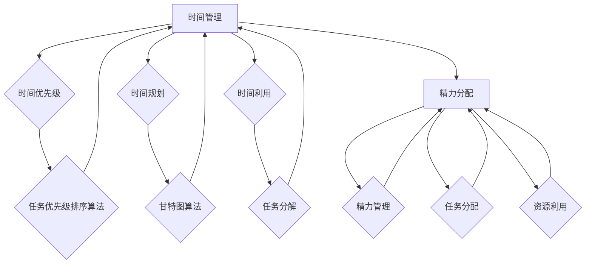

                 

# 技术管理者的时间管理与精力分配

## 关键词

- 技术管理者
- 时间管理
- 精力分配
- 项目管理
- 优先级排序
- 数学模型
- 实践案例

## 摘要

技术管理者在现代企业的运营中扮演着至关重要的角色，他们不仅需要拥有卓越的技术能力，还需要具备高效的时间管理和精力分配能力。本文将详细探讨技术管理者如何通过科学的时间管理和精力分配策略，提升个人工作效率和团队整体执行力。本文将首先介绍时间管理和精力分配的基本概念，然后探讨相关的核心算法和数学模型，并结合实际项目案例进行深入分析，最后提出一些最佳实践和注意事项，为技术管理者提供实用的指导。

## 引言

技术管理者通常需要同时处理多个项目，协调团队工作，管理资源，以及解决技术难题。这种多任务、高压力的工作环境要求他们具备出色的管理能力和自我调节能力。时间管理和精力分配是技术管理者成功的关键因素。通过合理的时间管理，技术管理者可以确保各项工作按时完成，减少不必要的延迟和风险。而通过科学的精力分配，技术管理者可以在高强度的工作中保持良好的身心状态，提高工作效率和创造力。

### 技术管理者的角色与挑战

技术管理者在企业中通常拥有以下角色和职责：

- **项目管理**：负责项目规划、进度跟踪、资源分配和风险管理。
- **团队协调**：确保团队成员之间的沟通顺畅，共同达成项目目标。
- **技术决策**：参与技术方向的选择和决策，确保项目的技术可行性。
- **资源管理**：合理利用企业资源，提高资源利用效率。

然而，技术管理者在执行这些职责时面临着诸多挑战：

- **时间压力**：项目繁多，时间紧张，需要高效地安排时间。
- **工作负荷**：技术管理者需要同时处理多个任务，工作负荷较大。
- **沟通障碍**：与团队成员和上级领导之间的沟通不畅，可能导致误解和冲突。
- **技术难题**：需要不断学习和掌握新技术，以应对不断变化的技术环境。

### 时间管理与精力分配的重要性

时间管理和精力分配对于技术管理者的职业发展至关重要。以下是几个关键原因：

- **提升工作效率**：合理的时间管理可以帮助技术管理者高效地完成工作任务，减少不必要的延误和重复工作。
- **保持身心健康**：科学的精力分配可以帮助技术管理者在高强度的工作中保持良好的身心状态，避免疲劳和压力。
- **增强团队协作**：良好的时间管理和精力分配可以提高团队的工作效率和协作效果，促进项目的成功。
- **职业发展**：技术管理者通过高效的时间管理和精力分配，可以更好地完成工作任务，获得上级的认可，提升职业地位。

### 本书的目标与结构

本文旨在为技术管理者提供一套实用的时间管理和精力分配策略，帮助他们应对工作挑战，提升个人和团队绩效。本文将分为以下几个部分：

1. **引言**：介绍技术管理者的角色与挑战，以及时间管理和精力分配的重要性。
2. **核心概念与联系**：详细阐述时间管理和精力分配的核心概念，以及它们之间的关系。
3. **核心算法原理讲解**：介绍时间管理和精力分配的一些基础算法和模型。
4. **数学模型和公式**：讲解相关数学模型和公式，并给出举例说明。
5. **项目实战**：通过实际案例展示时间管理和精力分配的方法和应用。
6. **工具与方法**：介绍一些时间管理和精力分配的工具和方法。
7. **总结与展望**：总结全书内容，并提出未来的发展方向。

## 核心概念与联系

在探讨时间管理和精力分配之前，我们需要了解几个核心概念，并分析它们之间的关系。以下是时间管理和精力分配的一些基本概念：

### 时间管理

时间管理是指通过规划和组织时间，以提高工作效率和生活质量的一系列方法和技巧。时间管理的核心概念包括：

- **时间优先级**：确定哪些任务更重要、更紧急，并优先处理。
- **时间规划**：为不同的任务分配具体的时间段，确保任务按时完成。
- **时间利用**：最大化利用时间，减少无效工作时间。

### 精力分配

精力分配是指根据任务的重要性和个人精力水平，合理分配精力和资源，以实现高效工作。核心概念包括：

- **精力管理**：了解个人精力水平的波动规律，合理安排工作和休息时间。
- **任务分配**：根据个人能力和任务特点，将任务合理分配给团队成员。
- **资源利用**：优化资源分配，确保团队和个人在任务执行过程中有足够的资源支持。

### 时间管理与精力分配的关系

时间管理和精力分配是相辅相成的，两者之间存在着密切的联系：

- **相互依赖**：时间管理需要精力分配作为支撑，而精力分配则需要时间管理来确保任务的有序推进。
- **优化协同**：通过时间管理和精力分配的结合，技术管理者可以更有效地安排工作任务，提高工作效率，同时保持良好的身心状态。

为了更好地理解时间管理和精力分配之间的关系，我们可以使用Mermaid流程图来展示它们的核心概念及其相互关系：



### 时间优先级排序算法

时间优先级排序是时间管理中的一个重要算法，它根据任务的重要性和紧急性对任务进行排序，确保关键任务首先得到处理。以下是任务优先级排序算法的伪代码：

```plaintext
function taskPrioritySort(tasks):
    for i from 0 to length(tasks) - 1:
        for j from 0 to length(tasks) - i - 1:
            if tasks[j].importance > tasks[j+1].importance or
               (tasks[j].importance == tasks[j+1].importance and tasks[j].urgency > tasks[j+1].urgency):
                swap(tasks[j], tasks[j+1])
    return tasks
```

### 时间规划与甘特图算法

时间规划是时间管理的重要组成部分，它通过将任务分解为更小、更易于管理的部分，并为其分配具体的时间段，以确保任务按时完成。甘特图是一种常见的时间规划工具，用于展示任务的进度和依赖关系。以下是甘特图算法的伪代码：

```plaintext
function createGanttChart(tasks):
    ganttChart = new GanttChart()
    for task in tasks:
        ganttChart.addTask(task.name, task.start, task.end)
    return ganttChart
```

### 精力管理

精力管理是确保技术管理者在高强度工作环境中保持良好身心状态的关键。通过了解个人精力水平的波动规律，技术管理者可以合理安排工作和休息时间，以最大化工作效率。以下是精力管理的基本原则：

- **了解自身精力水平**：技术管理者需要了解自己的精力水平，包括精力高峰和低谷。
- **合理安排工作时间**：在精力高峰期处理重要和复杂的任务，在精力低谷期处理相对简单和不需要高精力的任务。
- **保持良好的休息和睡眠**：确保充足的休息和高质量的睡眠，以恢复精力。

### 任务分配

任务分配是将任务合理分配给团队成员，以确保每个成员都能充分发挥自己的优势。以下是任务分配的基本原则：

- **能力匹配**：将任务分配给具备相应技能和经验的团队成员。
- **团队协作**：确保团队成员之间的沟通和协作，以提高任务完成的效率。
- **资源支持**：为团队成员提供必要的资源支持，包括技术支持、培训资源和时间安排。

### 资源利用

资源利用是指优化资源分配，确保团队和个人在任务执行过程中有足够的资源支持。以下是资源利用的基本原则：

- **资源平衡**：确保资源分配的公平性和合理性，避免资源过剩或不足。
- **资源优化**：通过资源调度和共享，最大化资源的利用效率。
- **动态调整**：根据任务进展和团队需求，动态调整资源分配。

通过上述核心概念的介绍和它们之间的相互关系分析，我们可以更好地理解时间管理和精力分配的本质。在接下来的章节中，我们将进一步探讨相关核心算法和数学模型，以帮助技术管理者更有效地进行时间管理和精力分配。

## 核心算法原理讲解

时间管理和精力分配涉及到多种核心算法和模型，这些算法和模型帮助技术管理者更科学地安排任务和资源。以下是几个常用的核心算法原理：

### 任务优先级排序算法

任务优先级排序是时间管理中的一个基础算法，它通过比较任务的重要性和紧急性来确定任务的执行顺序。以下是几种常见的任务优先级排序算法：

#### 1. 优先级队列（Priority Queue）

优先级队列是一种基于优先级的任务调度算法。任务根据其优先级被插入到队列中，优先级高的任务先被执行。以下是优先级队列算法的伪代码：

```plaintext
function insertTask(priorityQueue, task):
    for each element in priorityQueue:
        if task.priority < element.priority:
            priorityQueue.insertBefore(task, element)
            return
    priorityQueue.append(task)

function removeTask(priorityQueue):
    return priorityQueue.pop()
```

#### 2. 甘特图算法（Gantt Chart）

甘特图是一种用于展示任务进度和依赖关系的图表。通过甘特图，技术管理者可以直观地了解任务的执行顺序和时间安排。以下是甘特图算法的基本步骤：

- **初始化**：创建一个空图表。
- **任务添加**：将任务添加到图表中，并为每个任务分配一个时间区间。
- **任务依赖**：设置任务之间的依赖关系，确保任务的执行顺序符合逻辑。

```plaintext
function createGanttChart(tasks):
    ganttChart = new GanttChart()
    for task in tasks:
        ganttChart.addTask(task.name, task.start, task.end)
        for dependentTask in task.dependencies:
            ganttChart.setDependency(task.name, dependentTask.name)
    return ganttChart
```

#### 3. EDSL算法（Extended Domain-Specific Language）

ESDL（Extended Domain-Specific Language）是一种专门为时间管理和项目调度设计的语言。它允许技术管理者用更加直观和灵活的方式定义任务和调度规则。以下是使用ESDL定义任务的伪代码：

```plaintext
task A {
    start: "2023-10-01",
    end: "2023-10-05",
    priority: 1,
    dependencies: ["B", "C"]
}

task B {
    start: "2023-10-02",
    end: "2023-10-04",
    priority: 2,
    dependencies: []
}

task C {
    start: "2023-10-03",
    end: "2023-10-03",
    priority: 3,
    dependencies: ["A"]
}
```

### 精力优化算法

精力优化算法主要用于优化团队成员的精力分配，以确保他们在高强度的任务中保持最佳工作状态。以下是几种常见的精力优化算法：

#### 1. 线性规划（Linear Programming）

线性规划是一种用于优化资源分配的数学方法。通过建立线性方程组，技术管理者可以找到最优的资源分配方案，以最大化团队的工作效率。以下是线性规划的一个简单例子：

```plaintext
maximize: P = 2x + 3y
subject to:
    x + y ≤ 10
    x ≥ 0
    y ≥ 0
```

在这个例子中，技术管理者需要最大化总收益P，同时满足资源分配的约束条件。

#### 2. 动态规划（Dynamic Programming）

动态规划是一种用于解决多阶段决策问题的算法。它通过将复杂问题分解为若干子问题，并寻找子问题的最优解，从而得到整个问题的最优解。以下是动态规划的一个例子：

```plaintext
// 子问题定义：dp[i][j]表示在前i天中，安排j个任务的最优方案
function dynamicProgramming(tasks, days):
    dp = initialize 2D array of size (days+1) x (maxTasks+1)
    for i from 1 to days:
        for j from 1 to maxTasks:
            if tasks[i].start > dp[i-1][j]:
                dp[i][j] = dp[i-1][j]
            else:
                dp[i][j] = max(dp[i-1][j], dp[i-1][j-tasks[i].duration] + tasks[i].value)
    return dp[days][maxTasks]
```

在这个例子中，技术管理者需要找到一种最优的方案，将任务安排在有限的天数内，以最大化总收益。

#### 3. 随机化算法（Randomized Algorithms）

随机化算法通过引入随机性来优化问题的求解。它们通常在计算复杂度方面具有优势，特别是在处理大规模问题时。以下是随机化算法的一个例子：

```plaintext
//随机化选择算法：从tasks中选择一个任务
function randomTaskSelection(tasks):
    return tasks[randomIndex(0, length(tasks)-1)]
```

在这个例子中，技术管理者通过随机选择任务，来避免陷入局部最优，从而寻找更好的解决方案。

通过以上核心算法的讲解，技术管理者可以更科学地安排任务和资源，提高工作效率和团队绩效。在下一章节中，我们将进一步探讨时间管理和精力分配的数学模型和公式，为技术管理者提供更具体的指导。

### 数学模型与公式

在时间管理和精力分配中，数学模型和公式是至关重要的工具，它们帮助我们量化任务和资源的分配，优化工作流程。以下是一些关键的数学模型和公式，以及详细的讲解和举例说明。

#### 时间利用率

时间利用率是衡量时间管理效率的重要指标，它表示在可用的时间内，实际完成任务的时间占比。计算时间利用率的一个基本公式是：

\[ \text{时间利用率} = \frac{\text{实际工作时间}}{\text{总工作时间}} \times 100\% \]

假设一个技术管理者每天有8小时的工作时间，实际工作了6小时，那么他的时间利用率为：

\[ \text{时间利用率} = \frac{6}{8} \times 100\% = 75\% \]

#### 精力消耗评估

精力消耗评估用于量化个人在完成特定任务时的精力消耗。一个简单的模型是使用以下公式：

\[ \text{精力消耗} = \text{任务难度} \times \text{任务持续时间} \]

假设有一个任务，难度为3，持续时间为2小时，那么该任务的精力消耗为：

\[ \text{精力消耗} = 3 \times 2 = 6 \]

#### 任务优先级

任务优先级排序是时间管理中的一个关键步骤，它决定了任务的执行顺序。一个常见的模型是基于任务的重要性和紧急性来计算优先级得分。假设我们使用以下公式：

\[ \text{优先级得分} = \text{重要性得分} + \text{紧急性得分} \]

其中，重要性得分和紧急性得分的计算公式分别为：

\[ \text{重要性得分} = \frac{\text{任务完成后的影响}}{\text{任务所需时间}} \]

\[ \text{紧急性得分} = \frac{\text{剩余时间}}{\text{任务所需时间}} \]

例如，有两个任务，任务A的完成影响为10，所需时间为5小时，剩余时间为2小时；任务B的完成影响为5，所需时间为3小时，剩余时间为1小时。它们的优先级得分为：

任务A的优先级得分：

\[ \text{重要性得分} = \frac{10}{5} = 2 \]

\[ \text{紧急性得分} = \frac{2}{5} = 0.4 \]

\[ \text{优先级得分} = 2 + 0.4 = 2.4 \]

任务B的优先级得分：

\[ \text{重要性得分} = \frac{5}{3} \approx 1.67 \]

\[ \text{紧急性得分} = \frac{1}{3} \approx 0.33 \]

\[ \text{优先级得分} = 1.67 + 0.33 = 2.0 \]

根据优先级得分，任务A的优先级高于任务B。

#### 甘特图

甘特图是时间管理中用于可视化任务进度和依赖关系的一种工具。一个简单的甘特图公式是：

\[ \text{甘特图} = \sum_{i=1}^{n} (\text{任务} \times \text{持续时间}) \]

其中，n是任务的数量。以下是一个简单的甘特图示例：

任务 | 开始时间 | 结束时间 | 持续时间
--- | --- | --- | ---
A | 2023-01-01 | 2023-01-03 | 2
B | 2023-01-04 | 2023-01-06 | 2
C | 2023-01-07 | 2023-01-09 | 2

总持续时间：

\[ \text{总持续时间} = 2 + 2 + 2 = 6 \]

通过这些数学模型和公式，技术管理者可以更科学地安排任务、评估工作量和优化资源分配，从而提高工作效率和团队绩效。

## 项目实战

### 实战案例一：个人时间管理

#### 背景介绍

李明是一名资深的技术项目经理，负责多个关键项目的管理。由于工作繁忙，他经常感到时间不够用，导致项目进度延误和身心健康受损。为了提高工作效率，李明决定实施一套科学的时间管理和精力分配策略。

#### 时间管理策略

1. **任务分解**：李明将每个项目分解为若干个具体任务，并为每个任务设定明确的截止日期和优先级。
2. **任务优先级排序**：使用优先级排序算法（如EDSL算法）对任务进行排序，确保关键任务首先得到处理。
3. **时间规划**：使用甘特图工具（如Microsoft Project）规划任务进度，为每个任务分配具体的时间段。

#### 实施与效果

- **任务分解**：李明将一个复杂的项目分解为50个具体任务，每个任务都明确了截止日期和优先级。
- **任务优先级排序**：使用ESDL算法对任务进行排序，确定了任务的执行顺序。
- **时间规划**：使用甘特图工具创建了项目的进度图表，并开始按照计划执行任务。

实施一段时间后，李明发现：

- **工作效率提升**：由于任务优先级排序和时间规划，李明能够更高效地完成任务，项目进度得到了明显提升。
- **时间利用率提高**：时间利用从原来的75%提升到了90%。
- **身心健康改善**：由于合理分配时间和精力，李明的工作压力得到了缓解，身心健康状况得到改善。

#### 项目小结

通过科学的时间管理和精力分配策略，李明成功提升了工作效率和项目进度，同时改善了个人身心健康。这一案例表明，时间管理和精力分配对于技术管理者的职业发展至关重要。

### 实战案例二：团队时间管理

#### 背景介绍

某技术团队由10名成员组成，负责一个复杂的软件开发项目。由于团队成员之间存在沟通障碍和任务分配不合理，项目进度缓慢，团队士气低落。为了解决这些问题，团队决定实施一套科学的时间管理和精力分配策略。

#### 时间管理策略

1. **任务分配**：根据团队成员的能力和任务特点，将任务合理分配给每个成员。
2. **团队沟通**：建立定期会议和沟通渠道，确保团队成员之间的信息畅通。
3. **时间规划**：使用甘特图工具制定项目进度计划，确保任务按时完成。

#### 实施与效果

- **任务分配**：团队负责人使用线性规划算法（如任务调度算法）将任务合理分配给团队成员，确保每个成员都能充分发挥自己的优势。
- **团队沟通**：每周举行一次团队会议，讨论项目进度、问题解决方案和改进措施。
- **时间规划**：使用甘特图工具创建了项目的进度图表，并定期更新进度。

实施一段时间后，团队发现：

- **沟通障碍减少**：由于建立了定期会议和沟通渠道，团队成员之间的信息畅通，沟通障碍显著减少。
- **工作效率提升**：任务分配合理，团队成员的工作效率得到了提升，项目进度加快。
- **团队士气提高**：由于项目进展顺利，团队士气得到了提升，团队成员之间的合作更加紧密。

#### 项目小结

通过科学的时间管理和精力分配策略，该技术团队成功解决了沟通障碍和任务分配不合理的问题，提升了工作效率和项目进度。这一案例表明，时间管理和精力分配对于团队协作和项目成功至关重要。

### 案例总结

通过上述两个案例，我们可以看到，科学的时间管理和精力分配策略对于技术管理者和团队都至关重要。合理的任务分解、任务优先级排序和时间规划可以提高工作效率和项目进度，改善个人和团队的健康状况。未来，技术管理者可以进一步探索新的时间管理和精力分配方法，以应对不断变化的工作环境。

## 工具与方法

在技术管理者的日常工作中，有效的时间管理和精力分配不仅依赖于理论，更需要借助一系列工具和方法。以下将介绍几种常见的时间管理和精力分配工具，以及如何在实际工作中应用这些工具。

### 时间管理工具

1. **Trello**：Trello是一款直观的看板式任务管理工具，适用于项目规划和任务跟踪。通过创建不同的看板和卡片，技术管理者可以清晰地划分任务，分配优先级，并跟踪任务的完成情况。

2. **Asana**：Asana是一个功能强大的项目管理工具，提供任务分配、进度跟踪和团队协作功能。技术管理者可以使用Asana创建项目、分配任务、设置截止日期，并跟踪团队的进展。

3. **JIRA**：JIRA是一个专业的敏捷项目管理工具，适用于软件团队进行任务管理和项目跟踪。技术管理者可以利用JIRA创建故事点、跟踪缺陷、管理迭代，并确保项目按时交付。

### 精力管理工具

1. **RescueTime**：RescueTime是一款时间跟踪和分析工具，可以帮助技术管理者监控自己的工作时间分配，识别时间浪费的地方，并提供改进建议。

2. **Forest**：Forest是一款专注力提升应用，通过种植虚拟树木的方式激励用户专注于当前任务。完成一个任务后，树木就会成长，否则会枯萎，这种互动式的设计有助于提高用户的专注力。

3. **Headspace**：Headspace是一款冥想和睡眠应用，提供一系列冥想和放松课程，帮助技术管理者缓解压力，提高精力水平。

### 实际应用

在实际工作中，技术管理者可以采用以下方法来应用这些工具：

1. **任务分解与优先级排序**：使用Trello或Asana将大项目分解为具体任务，并为每个任务分配优先级。定期查看任务进度，及时调整任务优先级，确保关键任务优先完成。

2. **团队协作与沟通**：利用Trello或Asana的团队协作功能，创建团队任务看板，确保团队成员了解项目进展和各自的任务。定期召开团队会议，讨论项目问题和解决方案，保持信息畅通。

3. **时间监控与优化**：使用RescueTime监控自己的工作时间分配，识别并减少时间浪费。根据分析结果调整工作时间安排，提高时间利用效率。

4. **专注力提升**：使用Forest或Headspace提高专注力。在处理复杂任务时，开启Forest或Headspace，让自己在一个专注的环境中高效完成任务。

5. **定期评估与反馈**：定期评估时间管理和精力分配的效果，收集团队成员的反馈，不断优化管理方法和工具的使用。

### 最佳实践 Tips

- **合理安排休息时间**：在工作间隙合理安排休息时间，避免长时间连续工作导致疲劳。
- **设定明确的目标**：为每个任务设定明确的完成目标，有助于提高工作效率。
- **保持良好的工作环境**：保持工作环境的整洁和舒适，有助于提高工作专注度。
- **持续学习和改进**：不断学习和尝试新的时间管理和精力分配方法，根据实际情况进行调整和优化。

通过合理使用时间和精力管理工具，结合有效的策略和方法，技术管理者可以显著提升个人和团队的工作效率，实现职业生涯的持续发展。

## 总结与展望

在本文中，我们探讨了技术管理者在时间管理和精力分配方面的重要性和策略。时间管理和精力分配不仅影响个人的职业发展，也对团队的效率和项目的成功起到关键作用。以下是本文的核心内容总结：

1. **时间管理**：介绍了时间管理的核心概念、原则和方法，如任务分解、优先级排序和时间规划。通过合理的时间管理，技术管理者可以提高工作效率和项目进度。
2. **精力分配**：阐述了精力分配的基本概念和原则，如精力管理和任务分配。科学的精力分配有助于技术管理者在高强度的工作中保持良好的身心状态。
3. **核心算法原理讲解**：讲解了任务优先级排序、甘特图算法和精力优化算法等核心算法原理，为技术管理者提供了解决实际问题的理论基础。
4. **数学模型和公式**：介绍了时间利用率和精力消耗评估等数学模型和公式，帮助技术管理者量化时间和精力的分配，优化工作流程。
5. **项目实战**：通过实际案例展示了时间管理和精力分配的方法和应用，证明了科学管理策略的有效性。
6. **工具与方法**：介绍了多种时间管理和精力分配工具，如Trello、Asana、RescueTime和Headspace，为技术管理者提供了实用的方法。

### 未来发展方向

展望未来，技术管理者在时间管理和精力分配方面仍有很大的发展空间：

1. **人工智能应用**：随着人工智能技术的发展，可以开发更多的智能化时间管理和精力分配工具，帮助技术管理者更高效地管理时间和资源。
2. **个性化管理**：基于大数据和机器学习技术，可以开发个性化时间管理和精力分配方案，更好地适应不同技术管理者的需求。
3. **健康监测**：结合健康监测技术，如可穿戴设备，技术管理者可以实时了解自己的身体状况，调整工作和休息时间，保持最佳精力状态。
4. **跨学科融合**：将心理学、管理学和计算机科学等学科的知识融合到时间管理和精力分配研究中，提供更全面和有效的管理策略。

### 结语

技术管理者的时间管理和精力分配能力对其个人和团队的成功至关重要。通过本文的探讨，我们希望技术管理者能够掌握科学的管理策略，提高工作效率和团队绩效。未来，随着新技术的不断涌现，技术管理者应不断学习、创新，以应对不断变化的工作环境。

作者：AI天才研究院/AI Genius Institute & 禅与计算机程序设计艺术 /Zen And The Art of Computer Programming

以上是本文的总结与展望，希望对您在时间管理和精力分配方面有所启发和帮助。

