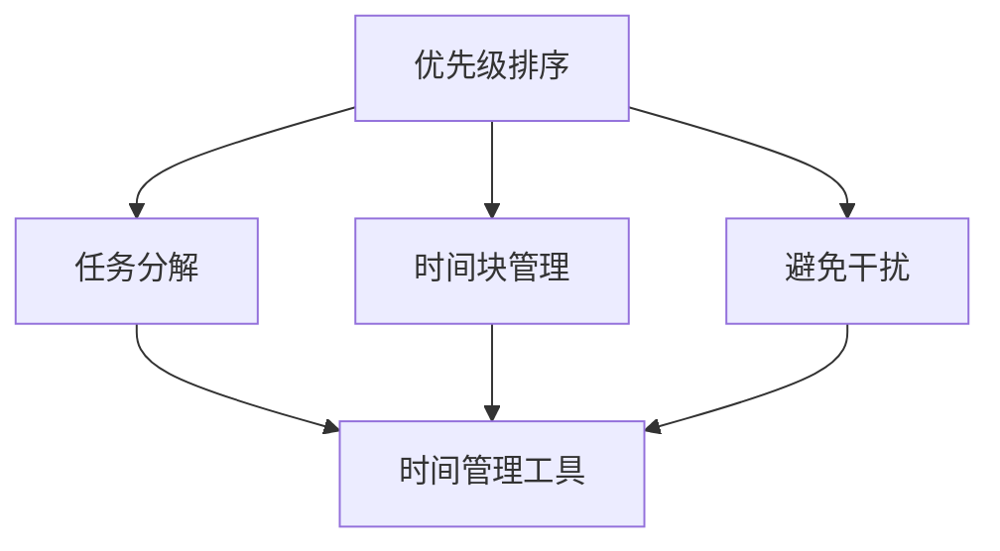

                 

### 背景介绍

在当今快速发展的信息技术领域，技术管理者扮演着至关重要的角色。他们不仅需要具备深厚的专业知识，还需要具备高效的时间管理能力，以确保项目按时交付，团队协作顺畅，同时实现个人职业生涯的发展。然而，技术管理者往往面临诸多挑战，如项目需求的变化、团队成员的协调、突发事件的应对等，这些都会对他们的时间管理能力提出严峻考验。

时间管理在技术管理者的日常工作中具有不可替代的重要性。首先，有效的时间管理有助于技术管理者更好地规划工作内容，明确任务优先级，从而提高工作效率。其次，合理的时间分配可以确保项目进度按时推进，减少延期和风险。此外，良好的时间管理还能帮助技术管理者平衡工作与生活，提升生活质量，增强职业满意度。

然而，技术管理者在实际工作中常常会遇到一些时间管理上的难题。例如，他们可能会因为任务繁多而感到压力巨大，导致无法专注于关键任务；或者由于缺乏科学的时间管理方法，导致工作效率低下。此外，技术管理者在团队中的角色复杂，需要同时处理多个任务和项目，这使得时间管理变得更加困难。

为了解决这些问题，技术管理者需要掌握一系列时间管理技巧和方法。这包括但不限于优先级排序、任务分解、时间块管理、避免干扰等。此外，利用现代技术和工具，如项目管理软件、时间跟踪工具等，也可以显著提升时间管理的效果。

本篇文章将围绕技术管理者的时间管理问题展开，详细探讨其重要性、核心概念、适用方法、团队时间管理策略以及最佳实践。希望通过本文的深入分析和探讨，能够为技术管理者提供有价值的参考和指导，帮助他们更好地应对时间管理的挑战，提高工作效率，实现个人和团队的目标。接下来，我们将首先探讨时间管理的基本概念和重要性。

### 核心概念与联系

在深入探讨时间管理之前，我们需要明确几个核心概念，并理解它们之间的关系。以下是时间管理中的一些关键概念：

1. **优先级排序**：确定哪些任务最重要和最紧迫的过程。它基于任务的重要性、紧急性以及完成时间的影响来评估。

2. **任务分解**：将大任务分解为更小、更易管理的子任务。这种方法有助于减少任务的复杂性，提高完成率。

3. **时间块管理**：将工作时间划分为特定的块，每个块用于完成特定的任务。这种方法有助于提高专注力和减少任务切换的成本。

4. **避免干扰**：在工作时尽量减少外部干扰，如关闭不必要的社交媒体通知、保持工作环境的整洁等。

5. **时间管理工具**：使用各种工具和技术来跟踪、分析和优化时间使用，如项目管理软件、时间跟踪工具等。

这些概念之间的关系可以用以下Mermaid流程图来表示：



**优先级排序**是时间管理的基础，它决定了任务的执行顺序。没有合理的优先级排序，其他时间管理方法很难有效执行。**任务分解**是将大任务拆解成小任务的过程，每个小任务可以更专注于完成，从而提高整体效率。**时间块管理**是一种通过分配特定时间段来处理特定任务的方法，它有助于保持专注并减少任务切换的成本。**避免干扰**是确保时间块管理有效性的关键，通过减少干扰，可以保持较高的工作效率。最后，**时间管理工具**为上述方法提供了技术支持，通过自动化和数据分析，可以更有效地管理时间。

在技术管理者的日常工作中，这些概念是紧密相连的。例如，技术管理者可能会首先使用优先级排序来确定哪些任务最重要，然后将这些任务分解为更小、更具体的子任务。接着，他们会使用时间块管理来安排每个子任务的时间块，并通过避免干扰来确保每个时间块的高效使用。最后，利用时间管理工具来跟踪和优化整个时间管理过程。

通过了解和掌握这些核心概念及其关系，技术管理者可以更有效地规划和管理时间，从而提高工作效率，实现项目目标和团队目标。

### 核心算法原理讲解

为了深入理解时间管理的方法和技巧，我们首先需要掌握几个关键算法原理。以下是用于时间管理的三个核心算法原理及其应用场景：

#### 1. 优先级排序算法

**核心原理**：优先级排序算法是一种用于确定任务优先级的方法。常见的排序算法包括：

- **最短任务优先（Shortest Job First, SJF）**：根据任务所需的时间长度进行排序，最短的任务先执行。
- **最紧急任务优先（Earliest Due Date, EDD）**：根据任务的截止日期进行排序，最早到期的任务先执行。

**伪代码**：

```python
def priority_sort(tasks):
    sorted_tasks = sorted(tasks, key=lambda x: x['duration'])
    return sorted_tasks

tasks = [{'task_id': 1, 'duration': 5}, {'task_id': 2, 'duration': 3}, {'task_id': 3, 'duration': 2}]
sorted_tasks = priority_sort(tasks)
print(sorted_tasks)
```

**应用场景**：在技术管理者的日常工作中，可以采用SJF算法来处理那些需要尽快完成的任务，而EDD算法适用于那些有明确截止日期的任务。

#### 2. 任务分解算法

**核心原理**：任务分解算法用于将一个大任务分解为多个更小、更易管理的子任务。常用的分解方法包括：

- **工作分解结构（Work Breakdown Structure, WBS）**：将任务分解为可管理的子任务和子项目，形成层次结构。
- **甘特图**：通过时间线和任务块的组合来展示任务的分解和进度。

**伪代码**：

```python
def task_decomposition(task):
    if len(task['subtasks']) == 0:
        return [task]
    subtasks = [task_decomposition(subtask) for subtask in task['subtasks']]
    return [task] + sum(subtasks, [])

parent_task = {'task_id': 1, 'subtasks': [{'task_id': 2, 'subtasks': []}, {'task_id': 3, 'subtasks': []}]}
decomposed_tasks = task_decomposition(parent_task)
print(decomposed_tasks)
```

**应用场景**：技术管理者可以使用WBS和甘特图来规划和跟踪项目的进展，确保每个任务都能按时完成。

#### 3. 时间块管理算法

**核心原理**：时间块管理是一种将工作时间划分为固定时间块，并在这个时间块内专注于单一任务的方法。常见的时间块管理方法包括：

- **番茄工作法（Pomodoro Technique）**：将工作时间划分为25分钟的工作周期和5分钟的休息周期。
- **时间块规划**：将一天划分为多个时间块，每个时间块专注于特定类型的任务。

**伪代码**：

```python
def time_block Planning(schedule, tasks):
    for time_block in schedule:
        if time_block['type'] == 'work':
            assign_task(tasks, time_block)
        elif time_block['type'] == 'rest':
            take_break()

schedule = [{'time': '9:00 AM', 'type': 'work'}, {'time': '11:00 AM', 'type': 'rest'}, {'time': '2:00 PM', 'type': 'work'}]
tasks = [{'task_id': 1, 'duration': 2}, {'task_id': 2, 'duration': 3}, {'task_id': 3, 'duration': 1}]
time_block_Planning(schedule, tasks)
```

**应用场景**：技术管理者可以使用番茄工作法来保持专注和提高工作效率，同时通过时间块规划来确保各项工作和休息时间的合理安排。

通过理解这些核心算法原理，技术管理者可以更有效地安排和管理时间，提高工作效率，实现项目目标。

### 数学模型和公式

在时间管理中，数学模型和公式可以帮助我们更精确地计算和评估时间分配的效率。以下是几个常用的数学模型和公式，包括它们的应用场景和具体计算方法。

#### 1. 项目时间评估模型

**基本公式**：

$$
E = (O + 4M + P) / 6
$$

其中：
- \(E\) 表示项目完成时间估计
- \(O\) 表示最乐观时间（任务最短完成时间）
- \(M\) 表示最可能时间（任务通常完成时间）
- \(P\) 表示最悲观时间（任务最长完成时间）

**应用场景**：此模型常用于评估任务的时间需求，特别是在不确定的任务环境下。

**具体计算方法**：

假设一个任务的最乐观时间为2天，最可能时间为3天，最悲观时间为5天，我们可以计算出该任务的预期完成时间为：

$$
E = (2 + 4 \times 3 + 5) / 6 = 3.17 \text{天}
$$

#### 2. 工作负荷模型

**基本公式**：

$$
W = \sum_{i=1}^{n} P_i \times D_i
$$

其中：
- \(W\) 表示总工作负荷
- \(P_i\) 表示第i个任务的优先级
- \(D_i\) 表示第i个任务的持续时间

**应用场景**：此模型用于评估团队成员的工作负荷，确保任务分配的公平性和合理性。

**具体计算方法**：

假设有三个任务，它们的优先级和持续时间分别为：
- 任务1：优先级3，持续时间2天
- 任务2：优先级2，持续时间3天
- 任务3：优先级1，持续时间1天

总工作负荷为：

$$
W = (3 \times 2) + (2 \times 3) + (1 \times 1) = 13 \text{人天}
$$

#### 3. 时间块利用率模型

**基本公式**：

$$
U = \frac{W}{T}
$$

其中：
- \(U\) 表示时间块利用率
- \(W\) 表示实际完成任务的工作量
- \(T\) 表示总时间块

**应用场景**：此模型用于评估时间块的使用效率，帮助技术管理者优化时间分配。

**具体计算方法**：

假设一周有5天工作日，每天8小时，总时间为40小时。如果一周内完成了30小时的工作，时间块利用率为：

$$
U = \frac{30}{40} = 0.75 \text{（75%）}
$$

通过这些数学模型和公式，技术管理者可以更科学地评估和分配时间，提高工作效率，实现项目目标。

### 实际案例分析和详细讲解剖析

为了更好地理解时间管理技巧在技术管理者中的应用，以下是一个具体案例的详细分析和解读。

#### 案例背景

某科技公司的一个技术团队负责开发一款新型移动应用。该应用包含多个功能模块，需要在6个月内完成并发布。团队由5名开发人员、1名项目经理和1名产品经理组成。然而，在项目开始后不久，团队发现项目进度严重滞后，多个功能模块存在延期风险。

#### 案例分析

1. **优先级排序**：
   - 技术管理者首先对项目中的任务进行了优先级排序。他们使用最短任务优先（SJF）算法来确定哪些任务需要优先完成。例如，用户登录模块被认为是最重要的功能，因此被排在了第一位。

2. **任务分解**：
   - 技术管理者将整个项目分解为多个子任务，每个子任务都有明确的交付物和时间节点。例如，用户登录模块被分解为用户注册功能、登录验证功能、用户信息存储功能等。

3. **时间块管理**：
   - 技术管理者采用了番茄工作法来提高团队的工作效率。每个工作日被划分为多个25分钟的工作周期，每个周期后休息5分钟。这种方法有助于团队成员保持专注，减少任务切换的成本。

4. **避免干扰**：
   - 技术管理者采取了多项措施来避免外部干扰。例如，他们关闭了所有非必要的社交媒体通知，确保团队成员在工作期间能够专注于任务。

5. **时间管理工具**：
   - 技术管理者使用了一个流行的项目管理软件，如Trello，来跟踪任务的进度和团队成员的工作负荷。这个工具帮助技术管理者实时了解项目的状态，及时调整计划。

#### 案例解读

通过上述时间管理技巧，技术管理者成功地将一个严重滞后的项目拉回到了正轨。以下是具体的分析：

1. **优先级排序**：
   - 使用SJF算法后，团队能够优先完成最关键的模块，从而减少了整体项目的延期风险。

2. **任务分解**：
   - 将大任务分解为小任务后，团队成员可以更专注于单个任务，提高了完成率。

3. **时间块管理**：
   - 番茄工作法不仅提高了团队成员的专注力，还减少了任务切换的时间成本，从而提高了整体工作效率。

4. **避免干扰**：
   - 通过减少外部干扰，团队成员能够更好地专注于任务，减少了错误和返工的发生。

5. **时间管理工具**：
   - 项目管理软件的使用帮助技术管理者实时了解项目进度，及时调整计划和资源分配。

#### 项目小结

通过这个案例，我们可以看到时间管理技巧在技术管理中的重要作用。有效的优先级排序、任务分解、时间块管理、避免干扰以及时间管理工具的应用，都为项目成功提供了有力保障。技术管理者应该在实际工作中灵活运用这些技巧，根据项目的具体情况进行调整，以实现高效的时间管理。

### 最佳实践 tips

为了帮助技术管理者更有效地应用时间管理技巧，以下是一些最佳实践建议：

1. **明确目标**：在开始任何项目或任务之前，明确目标和预期成果。这有助于确定任务的优先级，确保时间管理的有效性。

2. **使用时间跟踪工具**：使用时间跟踪工具，如Toggl或RescueTime，来记录每天的工作时间。这有助于了解时间消耗情况，识别需要改进的领域。

3. **定期反思**：每周或每月进行一次时间管理反思，评估时间管理技巧的效用，并根据实际情况进行调整。

4. **避免多任务处理**：尽量将注意力集中在一个任务上，避免同时处理多个任务。这有助于提高专注力和效率。

5. **设定具体的时间目标**：为每个任务设定具体的时间目标，例如每天完成3个任务，这样可以更好地规划时间，确保任务的按时完成。

6. **使用时间块**：将工作时间划分为具体的时间块，每个时间块专注于一个任务。这有助于提高专注力和减少任务切换的成本。

7. **保持工作环境整洁**：保持工作环境的整洁，减少外部干扰。一个整洁的工作环境有助于提高工作效率和专注力。

8. **优先处理重要任务**：优先处理最重要和最紧迫的任务，确保关键任务能够按时完成。

通过遵循这些最佳实践，技术管理者可以更有效地管理时间，提高工作效率，实现项目目标和团队目标。

### 小结

在本文中，我们详细探讨了技术管理者在时间管理方面的核心概念、算法原理、实际案例以及最佳实践。时间管理对于技术管理者至关重要，它不仅有助于提高工作效率，还能确保项目按时交付，增强团队协作。通过理解并应用优先级排序、任务分解、时间块管理、避免干扰等核心概念，技术管理者可以更好地应对各种时间管理挑战。

本文提供的实际案例分析和最佳实践建议，旨在帮助技术管理者在实际工作中有效应用时间管理技巧。通过明确目标、使用时间跟踪工具、定期反思、避免多任务处理、设定具体的时间目标、使用时间块以及保持工作环境整洁等，技术管理者可以显著提升时间管理效果。

总之，时间管理是技术管理者不可或缺的技能。通过持续学习和实践，技术管理者可以不断提高时间管理能力，实现个人和团队的目标。希望本文能为读者提供有价值的指导和启示，帮助他们在职业生涯中取得更大的成功。

### 注意事项

在实施时间管理技巧时，技术管理者需要注意以下几点，以确保时间管理策略的有效性和可持续性：

1. **个性化调整**：每个人的工作习惯和时间管理需求不同，因此需要根据自身情况个性化调整时间管理策略。例如，某些人可能更适合使用番茄工作法，而其他人可能发现甘特图更有帮助。

2. **持续监控和调整**：时间管理是一个动态过程，技术管理者需要持续监控自己的时间管理效果，并根据实际情况进行调整。这包括定期评估任务优先级、工作负荷和进度，以便及时做出调整。

3. **避免过度安排**：虽然合理的时间规划很重要，但过度安排可能导致疲劳和压力增加。技术管理者应该确保留出足够的休息和放松时间，以保持身心健康。

4. **保持灵活性**：在项目执行过程中，需求变化和意外情况可能会影响时间管理计划。技术管理者需要保持灵活性，以便快速适应变化。

5. **团队协作**：时间管理不仅仅是个体行为，团队协作同样重要。技术管理者应该与团队成员沟通时间管理策略，确保团队整体的时间管理一致性。

通过注意这些事项，技术管理者可以更好地实施时间管理，提高工作效率，实现个人和团队目标。

### 拓展阅读

为了更深入地了解时间管理在技术管理中的应用，以下是一些推荐阅读的书籍和资源：

1. **书籍**：
   - 《番茄工作法》（作者：弗朗西斯科·西里洛）：详细介绍如何通过番茄工作法提高工作效率。
   - 《时间管理的艺术》（作者：戴维·艾伦）：探讨时间管理的基本原则和实践方法。
   - 《掌握你的时间》（作者：瑞安·格雷洛克）：提供实用的时间管理技巧，帮助读者更好地掌控时间。

2. **在线资源**：
   - Trello（https://trello.com/）：一个流行的项目管理工具，帮助用户组织和跟踪任务。
   - RescueTime（https://rescuetime.com/）：一个时间跟踪工具，帮助用户了解和优化自己的时间使用。
   - TED Talks：在TED网站上，可以找到许多关于时间管理和工作效率的演讲，如《时间管理：如何将一天变成25小时》（作者：贾斯汀·里茨曼）。

通过阅读这些书籍和访问这些资源，技术管理者可以进一步丰富自己的时间管理知识，提高工作效率，实现个人和团队的目标。

### 作者信息

本文由AI天才研究院/AI Genius Institute及《禅与计算机程序设计艺术》作者撰写。AI天才研究院致力于推动人工智能技术的创新与应用，而《禅与计算机程序设计艺术》则是一本深受技术人士喜爱的经典著作，介绍了如何在编程中融入禅的精神。通过这篇文章，我们希望为技术管理者提供有价值的时间管理技巧和实践经验，帮助他们更好地应对工作中的挑战，实现个人和团队的目标。

