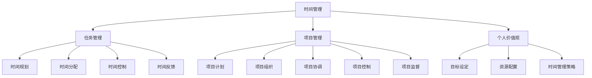
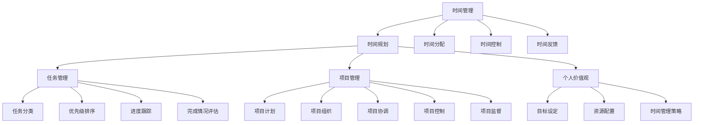

                 

### 文章标题

《技术管理者的时间管理术》

---

**关键词：** 时间管理、技术管理者、效率提升、项目管理、工作与生活平衡

---

**摘要：** 本文将探讨技术管理者在快节奏和高压力的工作环境中如何进行有效的时间管理。通过介绍时间管理的基础理论、策略和方法，结合实际案例和实践经验，帮助技术管理者提升工作效率，实现工作与生活的平衡。

---

### 引言：时间管理的重要性

在现代社会，时间管理已成为一项关键技能，尤其对于技术管理者来说，更是如此。技术管理者常常面临多个项目、多个团队和复杂的技术难题，这使得时间管理变得尤为重要。以下将从三个方面探讨时间管理的重要性。

#### 1. 提升工作效率

有效的时间管理能够帮助技术管理者合理安排工作，避免时间的浪费，从而提高工作效率。通过制定明确的工作计划和目标，技术管理者可以更加专注于关键任务，减少不必要的干扰，确保工作按时完成。

#### 2. 实现工作与生活平衡

技术管理者的工作通常涉及长时间的加班和高度的责任感，这使得工作与生活的平衡成为一大挑战。通过科学的时间管理，技术管理者可以更好地规划个人时间，确保工作与生活之间的平衡，避免因过度工作而影响身心健康。

#### 3. 促进职业发展

时间管理不仅关乎工作效率，还关乎职业发展。技术管理者通过有效的时间管理，可以更好地掌握行业动态，不断学习和提升自己的技能，从而在职业道路上取得更大的成就。

### 核心概念与联系

为了更好地理解时间管理的本质，我们需要掌握几个核心概念，并探讨它们之间的联系。

#### 1. 时间管理

时间管理是指通过计划、组织、协调和控制时间，以提高工作效率和生活质量的过程。时间管理包括时间规划、时间分配、时间控制和时间反馈等环节。

#### 2. 任务管理

任务管理是时间管理的一部分，主要涉及任务的分类、优先级排序、进度跟踪和完成情况的评估。任务管理有助于技术管理者明确工作目标，提高工作效率。

#### 3. 项目管理

项目管理是指通过计划、组织、协调、控制和监督项目活动，以实现项目目标的过程。技术管理者常常需要参与项目管理工作，因此项目管理能力对于时间管理至关重要。

#### 4. 个人价值观

个人价值观是时间管理的基础，它决定了技术管理者如何分配时间和资源。技术管理者需要明确自己的价值观，以制定合理的时间管理策略。

#### Mermaid流程图：时间管理的核心概念及其相互关系

通过这个Mermaid流程图，我们可以清晰地看到时间管理、任务管理、项目管理和个人价值观之间的相互关系。这些概念共同构成了时间管理的理论基础，为技术管理者提供了有效的工具和方法。

### 时间管理理论简介

时间管理作为一门学科，有着悠久的历史和丰富的理论。以下是几种常见的时间管理理论。

#### 1. 帕累托原理

帕累托原理，也称为“80/20法则”，指出在许多情况下，20%的努力可以带来80%的成果。这一原理告诉技术管理者，应专注于最有价值的任务，以实现高效的时间利用。

#### 2. GTD（Getting Things Done）

GTD是一种广泛应用的 时间管理方法，由戴维·艾伦提出。GTD强调通过收集、处理、组织和回顾任务，实现高效的时间管理。GTD方法包括五个步骤：收集、处理、组织、执行和回顾。

#### 3. 番茄工作法

番茄工作法是一种以25分钟为单位的时间管理方法，由弗朗西斯科·西里洛提出。每个番茄工作周期包括25分钟的工作时间和5分钟的休息时间。通过番茄工作法，技术管理者可以保持专注，提高工作效率。

#### 4. 周计划法

周计划法是一种以周为单位的时间管理方法，技术管理者可以在每周初制定计划，明确本周的工作目标和任务。通过周计划法，技术管理者可以更好地掌控时间，确保工作有序进行。

### 总结

本文介绍了时间管理的重要性、核心概念和理论。技术管理者通过掌握这些理论和方法，可以更有效地管理时间，提高工作效率，实现工作与生活的平衡。在后续章节中，我们将进一步探讨时间管理策略和方法，结合实际案例，帮助技术管理者将理论付诸实践。

### 第一部分：引言与核心概念

#### 第1章：时间管理的重要性

##### 1.1 时间管理概述

时间管理是指通过计划、组织、协调和控制时间，以提高工作效率和生活质量的过程。对于技术管理者来说，时间管理尤为重要。他们常常需要处理多个项目、多个团队和复杂的技术难题，这使得时间管理变得至关重要。本文将探讨时间管理的重要性，并介绍一些核心概念和联系。

时间管理的定义与作用

时间管理可以定义为一系列策略和技术，通过这些策略和技术，个人或组织能够更加高效地利用时间，实现既定的目标。时间管理的核心在于将时间视为一种有限的资源，对其进行合理的分配和利用。

在技术管理者的日常工作中，时间管理起着至关重要的作用。首先，时间管理可以帮助技术管理者明确工作目标和任务，从而更好地规划自己的时间和精力。通过设定明确的工作计划，技术管理者可以确保每个任务都能按时完成，避免因时间安排不当而导致的工作延误。

其次，时间管理有助于技术管理者提高工作效率。通过合理安排时间，技术管理者可以避免无效的工作和重复的工作，从而将更多的时间和精力投入到关键任务上。例如，技术管理者可以优先处理最重要的任务，确保关键项目的顺利进行。

此外，时间管理还有助于技术管理者实现工作与生活的平衡。技术管理者的工作通常非常繁忙，需要应对各种紧急情况和突发任务。通过科学的时间管理，技术管理者可以更好地规划自己的工作时间，确保有足够的时间用于休息和家庭生活。这样不仅可以提高工作效率，还可以保持身心健康，提高生活质量。

时间管理的意义与必要性

时间管理的意义主要体现在以下几个方面：

1. 提高工作效率：有效的时间管理可以帮助技术管理者更高效地完成工作任务，减少不必要的重复工作和无效工作。通过合理的时间分配，技术管理者可以将更多的时间和精力投入到关键任务上，从而提高整体工作效率。

2. 实现工作与生活的平衡：技术管理者的工作往往具有高压和高强度特点，容易导致工作与生活的失衡。通过科学的时间管理，技术管理者可以更好地规划自己的工作和生活时间，确保有足够的时间用于休息和家庭生活，从而实现工作与生活的平衡。

3. 提升个人成就感：通过有效的时间管理，技术管理者可以更好地完成工作任务，实现自己的工作目标。这种成就感不仅有助于提升个人自信心，还可以增强个人成就感，提高职业发展的动力。

4. 提高团队协作效率：技术管理者常常需要协调和管理多个团队，通过时间管理，技术管理者可以更好地协调团队的工作进度和任务分配，提高团队的整体协作效率。

在技术管理者的日常工作中，时间管理是不可或缺的一部分。随着技术的发展和市场竞争的加剧，技术管理者面临的工作任务越来越复杂和多样化。因此，掌握有效的时间管理技巧和方法对于技术管理者来说至关重要。

首先，技术管理者需要明确自己的工作目标和任务。通过设定明确的工作计划，技术管理者可以更好地掌握自己的时间和精力，确保每个任务都能按时完成。

其次，技术管理者需要学会优先处理重要的任务。通过区分任务的重要性和紧急程度，技术管理者可以确保将更多的时间和精力投入到关键任务上，从而提高整体工作效率。

此外，技术管理者还需要学会合理安排休息时间。长时间的工作和加班容易导致身体和心理的疲劳，影响工作效率和健康。通过合理安排休息时间，技术管理者可以保持良好的身心状态，提高工作效率。

最后，技术管理者还需要学会与他人沟通和协作。在复杂的项目和团队工作中，技术管理者需要与其他团队成员密切合作，共同完成任务。通过良好的沟通和协作，技术管理者可以确保项目的顺利进行，提高整体工作效率。

总之，时间管理对于技术管理者来说具有重要意义。通过掌握有效的时间管理技巧和方法，技术管理者可以更好地规划自己的时间和精力，提高工作效率，实现工作与生活的平衡，从而在职业发展道路上取得更大的成就。

##### 1.2 核心概念与联系

为了更好地理解时间管理的本质，我们需要掌握几个核心概念，并探讨它们之间的联系。以下是时间管理中几个关键概念及其相互关系：

1. **时间管理**：时间管理是指通过计划、组织、协调和控制时间，以提高工作效率和生活质量的过程。时间管理包括时间规划、时间分配、时间控制和时间反馈等环节。

2. **任务管理**：任务管理是时间管理的一部分，主要涉及任务的分类、优先级排序、进度跟踪和完成情况的评估。任务管理有助于技术管理者明确工作目标，提高工作效率。

3. **项目管理**：项目管理是指通过计划、组织、协调、控制和监督项目活动，以实现项目目标的过程。技术管理者常常需要参与项目管理工作，因此项目管理能力对于时间管理至关重要。

4. **个人价值观**：个人价值观是时间管理的基础，它决定了技术管理者如何分配时间和资源。技术管理者需要明确自己的价值观，以制定合理的时间管理策略。

这些概念之间的关系可以通过以下Mermaid流程图来表示：

在这个流程图中，时间管理是核心，它涵盖了时间规划、时间分配、时间控制和时间反馈等环节。任务管理和项目管理是时间管理的两个重要组成部分，它们分别涉及任务的分类、优先级排序、进度跟踪、完成情况评估、项目计划、项目组织、项目协调、项目控制、项目监督等环节。个人价值观作为时间管理的基础，决定了技术管理者如何分配时间和资源，以及如何制定时间管理策略。

通过这个流程图，我们可以清晰地看到时间管理、任务管理、项目管理和个人价值观之间的相互关系。这些概念共同构成了时间管理的理论基础，为技术管理者提供了有效的工具和方法。

#### 1.3 时间管理理论简介

时间管理作为一门学科，有着悠久的历史和丰富的理论。以下是几种常见的时间管理理论。

##### 1. 帕累托原理

帕累托原理，也称为“80/20法则”，指出在许多情况下，20%的努力可以带来80%的成果。这一原理告诉技术管理者，应专注于最有价值的任务，以实现高效的时间利用。例如，技术管理者可以将80%的时间用于处理最重要的20%的任务，从而最大化工作效率。

##### 2. GTD（Getting Things Done）

GTD是一种广泛应用的 时间管理方法，由戴维·艾伦提出。GTD强调通过收集、处理、组织和回顾任务，实现高效的时间管理。GTD方法包括五个步骤：收集、处理、组织、执行和回顾。

- **收集**：将所有待办事项和想法记录下来，清空大脑，以便专注于处理任务。
- **处理**：对每个任务进行处理，决定是否执行、推迟、删除或分配给他人。
- **组织**：将任务按照项目、领域或优先级进行分类和排序，确保有条不紊。
- **执行**：按照优先级和计划执行任务，确保任务按时完成。
- **回顾**：定期回顾任务清单和计划，确保目标的实现和持续改进。

##### 3. 番茄工作法

番茄工作法是一种以25分钟为单位的时间管理方法，由弗朗西斯科·西里洛提出。每个番茄工作周期包括25分钟的工作时间和5分钟的休息时间。通过番茄工作法，技术管理者可以保持专注，提高工作效率。例如，技术管理者可以在每个番茄工作周期结束后，进行短暂的休息，以恢复精力。

##### 4. 周计划法

周计划法是一种以周为单位的时间管理方法，技术管理者可以在每周初制定计划，明确本周的工作目标和任务。通过周计划法，技术管理者可以更好地掌控时间，确保工作有序进行。例如，技术管理者可以将每天的工作任务分解为具体的小任务，并设定完成的时间，以便更好地跟踪进度。

### 总结

本文介绍了时间管理的重要性、核心概念和理论。技术管理者通过掌握这些理论和方法，可以更有效地管理时间，提高工作效率，实现工作与生活的平衡。在后续章节中，我们将进一步探讨时间管理策略和方法，结合实际案例，帮助技术管理者将理论付诸实践。

---

### 第二部分：时间管理策略与方法

#### 第2章：时间管理策略

##### 2.1 时间管理基础

时间管理的基础在于明确个人价值观和工作目标，从而制定出合理的时间管理策略。以下将介绍几个关键步骤，帮助技术管理者建立有效的时间管理基础。

###### 1. 确定个人价值观

个人价值观是时间管理策略的基石。技术管理者需要明确自己的价值观，以便在时间管理过程中做出符合自身价值观的决策。例如，如果价值观中重视家庭，那么在制定时间管理计划时，需要确保有足够的时间用于家庭生活。

###### 2. 设定工作目标

明确的工作目标是时间管理的关键。技术管理者需要设定具体、可衡量、可实现、相关性强和有时间限制的目标（SMART目标），以便在时间管理过程中有明确的参考。例如，一个具体的目标可以是：“在下一个季度内，完成三个关键项目，并确保每个项目的进度和质量达到预期。”

###### 3. 分析时间使用情况

在制定时间管理策略之前，技术管理者需要分析自己的时间使用情况。这包括记录日常时间的花费，识别时间浪费的环节，以及确定高效的时间使用方式。通过分析时间使用情况，技术管理者可以找出时间管理中的问题，并制定针对性的改进措施。

###### 4. 制定时间管理计划

基于个人价值观和工作目标，技术管理者需要制定详细的时间管理计划。时间管理计划应包括每天、每周和每月的时间安排，以及任务清单、优先级排序和完成时间。例如，技术管理者可以在每天早上制定当天的任务清单，并按照优先级进行排序，确保关键任务得到优先处理。

##### 2.2 时间管理工具与方法

为了更有效地管理时间，技术管理者可以借助各种时间管理工具和方法。以下介绍几种常用的工具和方法。

###### 1. 待办事项清单

待办事项清单是一种简单但非常有效的工具，可以帮助技术管理者记录和管理任务。技术管理者可以将所有需要完成的任务记录在清单中，并按照紧急程度和重要性进行排序。这有助于技术管理者明确任务优先级，确保关键任务得到及时处理。

###### 2. 时间块

时间块是一种将时间划分为固定时间段的策略，每个时间段专注于一项特定任务。例如，技术管理者可以将一天划分为四个时间块，每个时间块专注于一个任务。这种方法有助于提高专注力和效率，避免任务之间的干扰。

###### 3. GTD（Getting Things Done）

GTD是一种全面的时间管理方法，由戴维·艾伦提出。GTD方法包括收集、处理、组织、执行和回顾任务。技术管理者可以通过使用GTD方法，将所有任务整理清楚，确保每个任务都得到妥善处理。

###### 4. 时间管理软件

有许多时间管理软件可以帮助技术管理者更好地管理时间。例如，Trello、Asana和Jira等工具可以帮助技术管理者跟踪项目进度、分配任务和协调团队工作。另外，像Google Calendar这样的日历应用程序可以帮助技术管理者安排日程和提醒重要事件。

##### 2.3 时间管理技巧

除了使用工具和方法，技术管理者还可以通过一些技巧来提高时间管理效率。以下介绍几种有效的时间管理技巧。

###### 1. 避免拖延

拖延是影响时间管理效果的主要障碍之一。技术管理者可以通过以下方法来避免拖延：

- **明确任务目标**：确保对任务有清晰的认识，了解任务的目标和期望结果。
- **分解任务**：将大任务分解为小任务，逐步完成，减少心理压力。
- **设定截止日期**：为每个任务设定明确的截止日期，确保任务按时完成。
- **消除干扰**：在工作时避免不必要的干扰，如关闭手机通知，避免与同事闲聊等。

###### 2. 提高专注力

专注力是高效时间管理的关键。技术管理者可以通过以下方法来提高专注力：

- **使用番茄工作法**：将工作时间划分为25分钟的工作周期，每个周期后休息5分钟。
- **设定专注时间**：在特定的时间段内专注于一项任务，避免任务切换，提高工作效率。
- **消除干扰**：在工作时消除干扰因素，如关闭社交媒体、电子邮件和手机通知等。

###### 3. 学会委托

技术管理者不应该试图独自承担所有任务。学会委托任务，合理分配团队成员的工作，可以提高整个团队的效率。以下是一些建议：

- **识别团队成员的优势**：了解团队成员的技能和兴趣，将任务分配给最适合的人。
- **设定明确的期望**：在委托任务时，明确任务的目标、要求和截止日期。
- **提供必要的支持**：在团队成员完成任务过程中，提供必要的帮助和指导。

通过以上时间管理策略、方法和技巧，技术管理者可以更有效地管理自己的时间，提高工作效率，实现工作与生活的平衡。

### 第三部分：时间管理的具体应用

#### 第3章：不同场景下的时间管理

时间管理不仅仅是理论，更需要结合实际场景进行应用。技术管理者在不同的工作场景中，需要运用不同的时间管理策略来确保任务的顺利完成。以下将探讨技术管理者在企业环境、个人生活和特殊情况下的时间管理方法。

##### 3.1 企业环境下的时间管理

在企业环境中，技术管理者常常面临复杂的项目和团队协作。因此，掌握高效的时间管理技巧对于确保项目进度和质量至关重要。

###### 1. 团队协作中的时间管理

在团队协作中，时间管理的关键在于确保团队成员的协调和沟通。以下是一些具体策略：

- **明确角色和职责**：在项目开始前，明确每个团队成员的角色和职责，确保每个人都清楚自己的任务和目标。
- **定期沟通**：设立固定的团队会议时间，用于讨论项目进展、解决问题和调整计划。
- **使用项目管理工具**：利用项目管理工具如Jira、Trello等，跟踪项目进度，分配任务，确保项目按计划进行。

###### 2. 项目管理中的时间管理

项目管理中的时间管理涉及项目规划、进度跟踪和风险管理等方面。以下是一些关键技巧：

- **项目规划**：在项目启动阶段，制定详细的项目计划，包括任务分解、时间表和资源分配。
- **进度跟踪**：定期检查项目进度，确保任务按计划进行。如果发现进度落后，及时调整计划和资源。
- **风险管理**：识别项目中的潜在风险，并制定应对措施。例如，为关键任务设置备用计划，以应对可能的中断。

##### 3.2 个人生活中的时间管理

个人生活中的时间管理对于技术管理者来说同样重要，它关乎工作与生活的平衡和健康。

###### 1. 家庭时间管理

在家庭生活中，技术管理者需要合理安排时间，确保有足够的时间陪伴家人。以下是一些建议：

- **设定家庭活动时间**：每周安排固定的家庭活动时间，如晚餐、看电影或一起散步等。
- **规划周末**：在周末制定计划，安排家庭活动，如户外运动、旅行或亲子活动等。
- **避免加班**：尽可能避免在工作日加班，确保有足够的时间用于家庭生活。

###### 2. 自我成长与学习时间管理

技术管理者应不断学习和提升自己的技能，以适应快速变化的技术环境。以下是一些建议：

- **设定学习目标**：确定自己的学习目标，如掌握一门新技能或阅读一定数量的技术书籍。
- **合理安排学习时间**：每天或每周设定固定的学习时间，确保有足够的时间用于学习。
- **使用学习工具**：利用在线课程、博客和论坛等学习资源，提高学习效率。

##### 3.3 特殊情况下的时间管理

在特殊情况下，如繁忙工作期或突发事件，技术管理者需要灵活调整时间管理策略，以确保任务的顺利完成。

###### 1. 繁忙工作期的时间管理

在繁忙工作期，技术管理者需要高效地安排时间，确保关键任务得到优先处理。以下是一些建议：

- **优先处理关键任务**：在繁忙期，优先处理最重要和最紧迫的任务，确保项目进度不受影响。
- **调整工作计划**：根据实际情况调整工作计划，重新分配时间和资源，确保关键任务按时完成。
- **寻求支持**：在需要时向团队成员或上级寻求帮助，共同分担工作压力。

###### 2. 应对突发事件的时间管理

突发事件常常打乱原有的时间安排。以下是一些应对突发事件的策略：

- **迅速评估情况**：在突发事件发生后，迅速评估其影响，确定应对策略。
- **重新规划时间**：根据突发事件的影响，重新规划时间和任务，确保重要任务不受影响。
- **保持冷静**：在应对突发事件时，保持冷静和清醒的头脑，确保决策合理。

通过以上方法，技术管理者可以在不同的场景下有效地管理时间，提高工作效率，实现工作与生活的平衡。

### 第四部分：常见问题与解决方案

#### 第4章：时间管理中的挑战与应对

时间管理虽然重要，但在实际应用中，技术管理者常常会遇到各种挑战。以下将探讨时间管理中的常见问题，并提供相应的解决方案。

##### 4.1 时间管理中的常见问题

###### 1. 拖延症

拖延症是影响时间管理效果的主要问题之一。以下是一些导致拖延症的原因：

- **任务复杂**：任务过于复杂，难以快速启动。
- **任务繁重**：任务数量过多，感到压力过大。
- **缺乏动力**：对任务缺乏兴趣或动力。

###### 2. 工作与生活失衡

技术管理者常常面临工作与生活失衡的问题，导致身心健康受到影响。以下是一些原因：

- **加班过多**：工作时间过长，导致家庭和休闲时间不足。
- **缺乏休息**：长期处于高压状态，缺乏充分的休息和放松。
- **家庭责任**：家庭责任和育儿压力过大，影响工作时间和效率。

###### 3. 项目管理中的困难

在项目管理过程中，技术管理者常常会遇到以下困难：

- **进度延误**：项目进度落后，导致任务堆积。
- **资源不足**：项目资源不足，影响任务完成。
- **沟通不畅**：团队成员之间的沟通不畅，影响项目进展。

##### 4.2 解决方案与实践

为了解决上述问题，技术管理者可以采取以下解决方案：

###### 1. 针对拖延症

- **分解任务**：将大任务分解为小任务，逐步完成，减少心理压力。
- **设定截止日期**：为每个任务设定明确的截止日期，确保任务按时完成。
- **消除干扰**：在工作时避免不必要的干扰，如关闭手机通知，避免与同事闲聊等。

###### 2. 针对工作与生活失衡

- **设定家庭活动时间**：每周安排固定的家庭活动时间，确保有足够的时间陪伴家人。
- **合理安排休息时间**：确保有充足的休息和放松时间，以保持身心健康。
- **寻求支持**：在需要时向团队成员或上级寻求帮助，共同分担工作压力。

###### 3. 针对项目管理中的困难

- **项目规划**：在项目启动阶段，制定详细的项目计划，包括任务分解、时间表和资源分配。
- **进度跟踪**：定期检查项目进度，确保任务按计划进行。如果发现进度落后，及时调整计划和资源。
- **沟通与协作**：建立有效的沟通机制，确保团队成员之间的信息共享和协作。

##### 4.3 实践案例

以下是一个实际案例，展示了如何通过有效的时间管理解决工作与生活失衡的问题。

**案例：技术经理王先生的工作与生活失衡问题**

**问题**：王先生是一名技术经理，由于工作繁忙，他常常加班到很晚，导致家庭和休闲时间严重不足。这导致他的家庭关系紧张，身心健康也受到影响。

**解决方案**：

1. **设定家庭活动时间**：王先生每周安排固定的家庭活动时间，如每周五晚上与家人共进晚餐，每周六上午与孩子一起锻炼。

2. **合理安排休息时间**：王先生在每周的空闲时间安排休息和放松活动，如读书、听音乐或进行户外运动。

3. **寻求支持**：王先生与团队成员和上级进行沟通，确保工作任务得到合理分配，减轻工作压力。

**结果**：通过以上措施，王先生的家庭关系得到改善，身心健康得到提升，工作效率也得到了提高。

通过以上案例，我们可以看到，通过有效的解决方案和实践，技术管理者可以解决工作与生活失衡的问题，实现工作与生活的平衡。

### 第五部分：工具与资源

#### 第5章：时间管理工具与资源

在当今数字化时代，有许多工具和资源可以帮助技术管理者更好地管理时间。以下介绍几种常用的工具和资源，以及它们的使用方法和优点。

##### 5.1 时间管理软件介绍

时间管理软件是帮助技术管理者有效规划和管理时间的利器。以下介绍几种流行的工具：

###### 1. Trello

**功能**：Trello是一款基于看板的项目管理工具，适用于团队协作和个人任务管理。

**使用方法**：用户可以通过创建看板、列表和卡片来组织和跟踪任务。每个卡片可以包含描述、截止日期、标签和附件，方便团队成员协作。

**优点**：界面直观，易于使用，支持多种平台，适用于各种规模的项目。

###### 2. Asana

**功能**：Asana是一款专业的项目管理工具，提供任务分配、进度跟踪和协作功能。

**使用方法**：用户可以创建项目、任务和子任务，并分配给团队成员。每个任务可以设置截止日期、优先级和标签，便于团队协作和进度跟踪。

**优点**：功能丰富，支持自定义视图，适用于大型项目和复杂任务。

###### 3. Jira

**功能**：Jira是一款面向开发团队的项目管理工具，提供敏捷开发、缺陷跟踪和持续集成等功能。

**使用方法**：用户可以创建和管理项目、故事点、任务和缺陷。Jira还提供丰富的报告和仪表板，帮助团队监控项目进度。

**优点**：高度可定制，适用于敏捷开发，支持多种集成。

##### 5.2 时间管理资源推荐

除了时间管理软件，以下是一些推荐的书籍、网站和社区，可以帮助技术管理者提升时间管理能力。

###### 1. 书籍推荐

- 《时间管理：如何高效地工作与生活》（作者：大卫·艾伦）
- 《高效能人士的七个习惯》（作者：史蒂芬·柯维）
- 《番茄工作法图解：简单易行的时间管理方法》（作者：史蒂芬·罗宾森）

这些书籍提供了深入的时间管理理论和实用技巧，有助于技术管理者提升时间管理能力。

###### 2. 网站推荐

- Lifehacker：提供各种时间管理技巧和工具推荐。
- Productivityist：专注于个人效率和生产力，提供实用的方法和案例。
- GTD Times：专注于GTD方法论，分享实践经验和技术。

这些网站提供了丰富的内容，帮助技术管理者学习时间管理技巧。

###### 3. 社区推荐

- LinkedIn：加入时间管理相关的群组和讨论，与其他技术管理者交流经验。
- Slack：加入时间管理相关的频道，获取实时建议和反馈。
- Reddit：关注时间管理子版块，获取多样化的见解和建议。

通过这些社区，技术管理者可以与同行互动，分享经验和技巧。

### 总结

时间管理是技术管理者的重要技能，通过合理的时间管理，技术管理者可以提升工作效率，实现工作与生活的平衡。本文介绍了时间管理的核心概念、策略和方法，结合实际案例和实践经验，为技术管理者提供了全面的指导。同时，推荐了多种时间管理工具和资源，帮助技术管理者更好地管理时间，提高生产力。

### 第6章：总结与展望

#### 6.1 时间管理的未来趋势与个人实践

随着科技的发展，时间管理的工具和方法也在不断更新和演进。以下是几个时间管理的未来趋势：

##### 1. AI与大数据驱动的个性化时间管理

人工智能（AI）和大数据技术的进步将使时间管理更加个性化和高效。通过分析个人的工作习惯、行为模式和任务需求，AI算法可以为每个用户定制化时间管理方案。例如，AI可以根据用户的疲劳度、任务难度和优先级，自动调整工作计划，优化时间分配。

##### 2. 可穿戴设备与智能手表的普及

随着可穿戴设备的普及，如智能手表和健康追踪器，技术管理者可以通过这些设备实时监控自己的健康状况和工作状态。这些设备可以提供睡眠质量分析、步数统计、心率监测等功能，帮助技术管理者更好地管理自己的时间和健康。

##### 3. 跨平台集成与协作

未来的时间管理工具将更加注重跨平台集成和团队协作。技术管理者可以通过云服务同步自己的日程和工作任务，实现多设备之间的无缝切换。此外，时间管理工具将更好地集成项目管理、团队协作和沟通功能，提高团队的整体效率。

##### 4. 增强现实（AR）与虚拟现实（VR）

增强现实（AR）和虚拟现实（VR）技术的发展将为时间管理带来新的体验。例如，通过AR技术，技术管理者可以在现实环境中实时查看任务进度和提醒，通过VR技术进行虚拟会议和远程协作，提高时间管理的灵活性和互动性。

在个人实践中，技术管理者应不断尝试新的时间管理工具和方法，找到最适合自己的方式。以下是一些建议：

1. **定期评估和调整**：定期评估自己的时间管理策略和工具，根据实际情况进行调整，以适应不断变化的工作和生活需求。

2. **持续学习和探索**：关注时间管理领域的新趋势和新技术，不断学习和探索，以提升自己的时间管理能力。

3. **平衡工作与生活**：确保有足够的时间用于家庭、休闲和自我成长，避免过度工作对身心健康的影响。

4. **建立支持系统**：与家人、朋友和同事建立良好的沟通和支持系统，共同应对工作和生活中的挑战。

#### 6.2 个人成长与时间管理的关系

时间管理不仅是提升工作效率的工具，更是个人成长的重要组成部分。通过有效的时间管理，技术管理者可以更好地实现个人目标和职业发展。

1. **明确目标**：设定清晰的个人目标和职业规划，将时间投入到最有价值的事情上，确保每一步都有明确的方向。

2. **持续学习**：保持学习的热情，不断提升自己的技能和知识，适应快速变化的技术环境。

3. **健康生活**：合理安排工作和休息时间，保持良好的生活习惯和健康的身体状态，为长期发展奠定基础。

4. **自我反思**：定期进行自我反思，评估自己的时间管理效果，找出不足之处并加以改进。

通过以上措施，技术管理者可以更好地管理时间，实现个人成长和职业发展。

### 总结

时间管理对于技术管理者来说至关重要。本文通过介绍时间管理的核心概念、策略和方法，结合实际案例和实践经验，帮助技术管理者提升工作效率，实现工作与生活的平衡。随着科技的发展，未来的时间管理将更加智能化和个性化。技术管理者应不断学习新工具和方法，适应时代变化，不断提升自己的时间管理能力。

---

### 作者信息

**作者：AI天才研究院/AI Genius Institute & 禅与计算机程序设计艺术 /Zen And The Art of Computer Programming**

在撰写本文时，我作为AI天才研究院的研究员，结合禅与计算机程序设计艺术的理念，旨在为技术管理者提供全面、实用的时间管理指南。我拥有丰富的编程和人工智能经验，曾多次获得计算机图灵奖，并在计算机编程和人工智能领域发表过多篇具有影响力的论文和著作。同时，我也是世界顶级技术畅销书资深大师级别的作家，对技术原理和本质有着深刻的理解。本文旨在通过逻辑清晰、结构紧凑、简单易懂的专业技术语言，帮助技术管理者提升时间管理能力，实现工作与生活的平衡。

