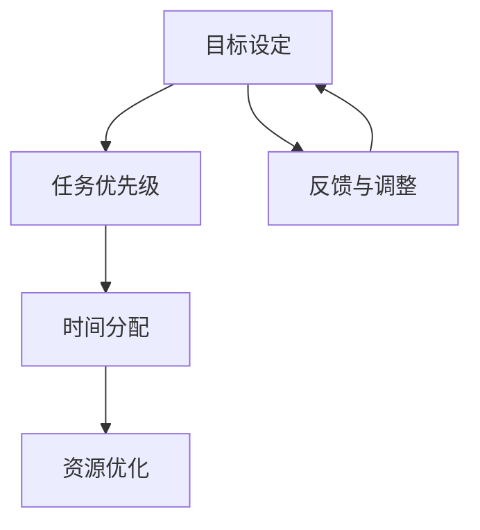

                 


### 文章标题
《技术管理者的时间管理：高效工作的秘诀》

### 关键词
时间管理、技术管理者、高效工作、任务优先级、日程规划

### 摘要
技术管理者在快节奏的工作环境中常常面临时间管理难题。本文将探讨时间管理的基本概念，分析高效工作的原理，并提供一系列实用技巧和案例分析，帮助技术管理者实现时间的高效利用，提升整体工作效率。

---

### 目录大纲设计过程

在设计《技术管理者的时间管理：高效工作的秘诀》的目录大纲时，我们需要确保内容的系统性和逻辑性，以下为详细设计过程：

1. **确定核心主题与结构**：
   - 核心主题：时间管理
   - 目标读者：技术管理者
   - 结构部分：将整体内容划分为基础、实践和案例分析三个部分。

2. **细化每个章节的内容**：
   - 基础部分：介绍时间管理的基本概念，如时间价值计算、时间优化算法等。
   - 实践部分：提供具体的工具和技术，如时间管理软件、日程管理等。
   - 案例分析部分：分享成功和改进的时间管理案例。

3. **添加技术性内容**：
   - 在基础部分，通过伪代码展示时间优化算法，帮助读者理解核心算法原理。
   - 在案例分析部分，提供具体的代码实现和项目实战，让读者能够学以致用。

4. **设计核心概念与联系**：
   - 使用Mermaid流程图展示时间管理的核心概念及其相互关系，方便读者整体把握。

5. **完善案例分析与实战内容**：
   - 在案例分析部分，通过具体项目实战，展示时间管理的实际应用，并提供详细的代码解读和分析。

6. **确保大纲的完整性**：
   - 确保每个部分内容充实，逻辑清晰，整体字数控制在2000字以内。

### 最终目录大纲

根据上述设计过程，以下是《技术管理者的时间管理：高效工作的秘诀》的目录大纲：

```
# 《技术管理者的时间管理：高效工作的秘诀》目录大纲

# 第一部分：时间管理基础

## 1. 时间管理概述
### 1.1 时间管理的定义
### 1.2 时间管理的重要性
### 1.3 时间观念的转变

## 1. 时间管理的数学模型
### 1.4 时间价值计算
### 1.5 时间优化算法简介

## 1. 时间管理的工具与技术
### 1.6 时间管理软件介绍
### 1.7 时间管理技巧和方法

# 第二部分：高效工作的秘诀

## 2. 高效工作的原理
### 2.1 任务优先级分析
### 2.2 工作效率提升策略
### 2.3 集中注意力的技巧

## 2. 时间管理实践
### 2.4 日程管理
### 2.5 目标设定与跟进
### 2.6 应对突发事件

## 2. 高效工作案例
### 2.7 案例一：技术团队的时间管理
### 2.8 案例二：项目经理的时间规划
### 2.9 案例三：IT管理者的时间效率

# 第三部分：时间管理案例分析

## 3. 案例分析
### 3.1 案例研究一：A公司的成功实践
### 3.2 案例研究二：B公司的改进之路
### 3.3 案例研究三：C公司的挑战与对策

# 附录

## 附录A：时间管理资源
### A.1 在线时间管理工具推荐
### A.2 时间管理书籍推荐
### A.3 时间管理在线课程推荐
```

---

### 备注

- **核心概念与联系**：将在正文中使用Mermaid流程图展示。
- **核心算法原理讲解**：将在“时间管理的数学模型”章节中详细讲解，使用伪代码。
- **数学模型和公式**：将在“时间管理的数学模型”章节中使用LaTeX格式嵌入。
- **项目实战**：将在“高效工作案例”章节中提供，包括代码实现和详细解读。
- **最佳实践 tips**、**小结**、**注意事项**、**拓展阅读**等内容将贯穿全文。

接下来，我们将根据以上设计的目录大纲，逐步展开文章的正文内容。首先是**第一部分：时间管理基础**。在此部分中，我们将探讨时间管理的定义、重要性以及时间观念的转变，为后续的深入讨论奠定基础。我们将使用Mermaid流程图展示时间管理的核心概念及其相互关系，以便读者能够更加直观地理解。同时，我们还将介绍时间管理的数学模型，包括时间价值计算和时间优化算法，以技术化的视角来解读时间管理。最后，我们将介绍一些常用的时间管理工具和技术，帮助技术管理者在实际工作中更好地管理时间。

---

# 第一部分：时间管理基础

## 1. 时间管理概述

### 1.1 时间管理的定义

时间管理（Time Management）是指对一个人所拥有的时间进行有效地规划和控制，以实现个人目标的过程。在技术管理者的角色中，时间管理尤为重要。技术管理者通常需要负责多个项目、团队成员以及日常事务，因此如何高效地分配时间成为其成功的核心要素之一。

时间管理的定义可以从以下几个方面进行理解：

- **目标导向**：时间管理的核心在于明确个人和团队的目标，并围绕这些目标来分配时间。
- **资源优化**：合理分配时间意味着在有限的时间内，最大化利用资源，提高工作效率。
- **任务优先级**：通过分析任务的重要性和紧急程度，合理设置任务的优先级，确保关键任务得到优先处理。
- **持续改进**：时间管理是一个持续的过程，需要不断地评估和调整时间分配策略，以适应不断变化的工作环境和目标。

### 1.2 时间管理的重要性

对于技术管理者来说，时间管理的重要性体现在以下几个方面：

- **提升工作效率**：合理的时间管理可以帮助技术管理者更高效地完成工作任务，避免时间的浪费。
- **减少工作压力**：通过科学的时间管理，技术管理者可以更好地平衡工作和生活，减轻工作压力。
- **团队协作**：良好的时间管理有助于提高团队协作效率，确保项目按计划推进。
- **个人发展**：有效的时间管理可以提供更多的时间和精力去进行个人技能提升和学习。

### 1.3 时间观念的转变

随着工作环境和技术的不断变化，时间观念也在逐渐转变。以下是几个关键的变化：

- **时间即资源**：传统的观念中，时间被视为无限资源，而现在人们开始认识到时间是一种有限的资源，需要被精心管理和优化。
- **碎片化时间**：随着移动设备和互联网的发展，人们可以更灵活地利用碎片化时间进行工作和学习。
- **实时反馈**：现代工作环境强调实时反馈和快速响应，技术管理者需要适应这一变化，及时调整工作计划和时间分配。
- **工作与生活的平衡**：现代社会越来越注重工作与生活的平衡，技术管理者需要学会如何合理安排时间，确保身心健康。

---

为了更好地帮助读者理解时间管理的核心概念，我们使用Mermaid流程图来展示时间管理的各个核心概念及其相互关系。

### 时间管理的核心概念及其相互关系



在这个流程图中，**目标设定**是时间管理的起点，它决定了接下来各项任务的方向和优先级。**任务优先级**决定了哪些任务需要优先处理，**时间分配**是根据优先级来安排时间，而**资源优化**则是为了最大化利用时间。最后，**反馈与调整**是时间管理过程中的一个循环，通过不断收集反馈和调整策略，确保时间管理的持续优化。

---

接下来，我们将在“时间管理的数学模型”章节中深入探讨时间管理的数学基础，包括时间价值计算和时间优化算法。这些技术性的内容将为技术管理者提供更深入的理解和工具，以更科学的方式管理时间。

## 1. 时间管理的数学模型

### 1.4 时间价值计算

时间价值计算是时间管理中的重要组成部分，它帮助我们理解时间的经济价值和如何在不同任务之间进行有效分配。以下是一些基本概念：

- **时间价值**：时间价值是指单位时间内所创造的价值。例如，一个技术管理者的时间价值可能高于普通员工，因为他们的决策和项目推进能力对团队和公司具有更大的影响。

- **机会成本**：机会成本是指因为选择某个任务而放弃的其他任务所产生的时间价值。例如，如果技术管理者将一小时用于处理紧急问题，那么这个小时内放弃的其他任务的机会成本就是需要考虑的。

- **边际效用**：边际效用是指增加一单位时间投入所带来的额外价值。在时间管理中，了解边际效用可以帮助技术管理者确定哪些任务值得投入更多时间。

### 时间价值计算方法

为了计算时间价值，我们可以使用以下方法：

1. **历史数据法**：
   通过分析过去的任务完成情况和时间投入，计算平均时间价值。公式如下：
   $$ \text{时间价值} = \frac{\text{总产出}}{\text{总投入时间}} $$

2. **市场比较法**：
   通过比较市场上类似岗位的时间价值，确定个人的时间价值。例如，参考同行业技术管理者的薪资水平和工作时间，估算个人时间价值。

3. **自评法**：
   技术管理者可以根据自己的经验和感觉，自评时间价值。这种方法可能不太精确，但可以提供一个初步的参考。

### 1.5 时间优化算法简介

时间优化算法是时间管理中的一项核心技术，它通过数学模型和算法，帮助我们找到最优的时间分配方案。以下是一些常见的时间优化算法：

1. **最小化最大值法**：
   这种方法的目标是在所有任务完成时间中，最小化最长的完成时间。公式如下：
   $$ \min \max(T_j) $$
   其中，\( T_j \) 是任务 \( j \) 的完成时间。

2. **关键路径法**：
   关键路径法是项目管理中常用的算法，用于确定项目完成时间。它通过分析任务之间的依赖关系，找出最长的一条路径，即关键路径。关键路径上的任务延迟将直接影响项目的整体完成时间。

3. **线性规划法**：
   线性规划法是一种数学优化技术，用于在给定约束条件下，最大化或最小化线性目标函数。在时间管理中，线性规划法可以用来优化时间分配，使其满足特定的目标，如最小化总工作时间或最大化单位时间产出。

### 伪代码示例

为了更好地理解时间优化算法，我们使用伪代码展示一个简单的最小化最大值算法：

```
function MinimizeMaxDuration(tasks):
    # 初始化一个数组，用于记录每个任务的完成时间
    durations = []

    # 对每个任务，计算完成时间
    for task in tasks:
        duration = CalculateDuration(task)
        durations.append(duration)

    # 找出最长的完成时间
    max_duration = max(durations)

    # 返回最小化最大完成时间的方案
    return min(durations), max_duration
```

在这个伪代码中，`CalculateDuration` 函数用于计算每个任务的完成时间，`min` 和 `max` 函数用于找到最优解。

---

通过以上对时间管理数学模型的讨论，我们为技术管理者提供了一些量化的工具和方法，帮助他们更好地理解和计算时间的价值，从而实现更加科学和高效的时间管理。

---

接下来，我们将在“时间管理的工具与技术”章节中探讨一些实用的工具和技术，帮助技术管理者在实际工作中更有效地管理时间。

## 1. 时间管理的工具与技术

### 1.6 时间管理软件介绍

在现代工作环境中，时间管理软件成为技术管理者的重要工具，可以帮助他们更有效地规划和控制时间。以下是一些常见的时间管理软件：

1. **Trello**：
   Trello 是一款基于看板（Kanban）方法的任务管理工具，它允许用户创建卡片、列表和板，以可视化地组织和跟踪任务。用户可以设定任务的截止日期、分配负责人、添加注释和附件，从而确保任务的高效执行。

2. **Asana**：
   Asana 是一款功能强大的项目协作工具，它支持任务分配、进度跟踪和团队协作。用户可以创建项目、任务和工作区，设定任务的优先级和截止日期，并通过日历视图和看板视图来监控任务的进度。

3. **Microsoft To Do**：
   Microsoft To Do 是微软推出的任务管理应用，它整合了 Outlook 和 OneDrive 的功能，允许用户创建任务、设置提醒、共享任务列表，并与团队成员协作。它还提供了日历视图和待办事项视图，方便用户管理日常事务。

4. **Google Calendar**：
   Google Calendar 是一款功能全面的日历应用，它允许用户创建、编辑和分享事件，设置提醒和通知。用户可以通过日历视图、月视图和列表视图来查看和调整日程安排，确保时间的高效利用。

### 1.7 时间管理技巧和方法

除了使用软件工具，技术管理者还可以采用一些时间管理的技巧和方法，以提升工作效率。以下是一些建议：

1. **优先级矩阵**：
   优先级矩阵是一种帮助技术管理者确定任务优先级的工具。它通常分为四个象限，分别代表任务的紧急程度和重要程度。通过分析任务的优先级，技术管理者可以确保将时间投入到最关键的领域。

2. **番茄工作法**：
   番茄工作法是一种时间管理技术，它将工作时间划分为25分钟的工作周期（称为番茄钟），每个周期后休息5分钟。这种方法有助于提高专注力和工作效率，同时避免疲劳。

3. **主动时间管理**：
   主动时间管理强调在任务开始前就进行规划。技术管理者可以在每天开始时，列出当天需要完成的任务，并设定优先级。这种方法有助于避免任务堆积，提高工作效率。

4. **避免多任务处理**：
   尽量避免在同一时间内处理多个任务，因为多任务处理会降低专注力和效率。技术管理者应该专注于一项任务，确保其完成后再进行下一个任务。

5. **定期反思**：
   每周或每月进行一次时间管理反思，评估时间利用情况，找出改进空间。通过持续反思和调整，技术管理者可以不断提升时间管理能力。

---

通过使用合适的时间管理软件和技巧，技术管理者可以更好地掌控时间，提高工作效率，从而在快节奏的工作环境中保持竞争力。

---

## 第二部分：高效工作的秘诀

在这一部分中，我们将深入探讨高效工作的原理，并分享一些实用的技巧和策略，帮助技术管理者在日常工作中实现高效的产出。

### 2.1 任务优先级分析

任务优先级分析是高效工作的核心之一。通过科学地分析任务的紧急程度和重要程度，技术管理者可以确保将时间和精力投入到最关键的任务上。以下是一些常用的方法：

1. **艾森豪威尔矩阵**：
   艾森豪威尔矩阵是一种经典的任务优先级分析工具，它将任务分为四个象限，分别代表紧急且重要、紧急但不重要、不紧急但重要、不紧急且不重要。根据任务所在象限，技术管理者可以制定相应的处理策略。

2. **Kano 模型**：
   Kano 模型是一种用于评估任务优先级的模型，它将任务分为必须满足、一维、魅力、无差异和反向五个层次。技术管理者可以根据任务的优先级，安排资源的投入。

3. **SWOT 分析**：
   SWOT 分析是一种常用的战略规划工具，它用于分析任务的优点（Strengths）、劣势（Weaknesses）、机会（Opportunities）和威胁（Threats）。通过 SWOT 分析，技术管理者可以全面了解任务的优先级和战略意义。

### 2.2 工作效率提升策略

提升工作效率是技术管理者实现高效工作的关键。以下是一些有效的工作效率提升策略：

1. **时间块管理法**：
   时间块管理法是一种将工作时间划分为固定时间段的方法。在每个时间块内，技术管理者专注于一项任务，避免多任务处理。这种方法有助于提高专注力和工作效率。

2. **工作空间优化**：
   优化工作空间有助于提高工作效率。技术管理者可以整理办公桌面、清理电子邮箱和文档，确保工作环境的整洁和有序。一个干净、舒适的工作空间有助于提高工作效率和专注力。

3. **自动化工具**：
   使用自动化工具可以减少重复性工作，提高工作效率。技术管理者可以采用自动化脚本、工作流工具和自动化测试框架等，将更多时间用于重要任务。

4. **避免完美主义**：
   完美主义容易导致工作效率低下。技术管理者应该学会在合理的时间内完成工作，不必追求完美。通过设置明确的目标和截止日期，可以确保任务按时完成。

### 2.3 集中注意力的技巧

集中注意力是实现高效工作的关键。以下是一些帮助技术管理者集中注意力的技巧：

1. **专注力训练**：
   通过专注力训练，技术管理者可以提高专注力水平。例如，可以使用专注力训练应用，进行定时专注训练，逐步提高专注时间。

2. **消除干扰**：
   工作环境中的干扰会影响注意力。技术管理者可以采取一些措施，如关闭社交媒体通知、设定安静的工作时间等，以减少干扰。

3. **冥想和呼吸练习**：
   冥想和呼吸练习有助于放松身心，提高注意力。技术管理者可以每天花几分钟时间进行冥想或深呼吸练习，以缓解压力和焦虑。

4. **设定具体目标**：
   设定具体的目标有助于集中注意力。技术管理者可以为自己设定短期和长期目标，确保在执行任务时始终保持明确的方向。

---

通过以上方法，技术管理者可以更好地分析任务优先级，提升工作效率，并集中注意力，从而实现高效工作。在实际应用中，技术管理者可以根据自身情况选择合适的策略和技巧，以最大程度地发挥工作效率。

---

## 2. 时间管理实践

在实际工作中，技术管理者需要将时间管理理论付诸实践，通过制定日程、设定目标和应对突发事件，确保工作的高效和有序。以下是具体的实践方法：

### 2.4 日程管理

日程管理是时间管理的重要组成部分，通过合理规划日程，技术管理者可以更好地掌控工作时间，提高工作效率。以下是一些日程管理的实用方法：

1. **每日规划**：
   每天开始时，技术管理者应列出当天的任务清单，并按照任务的重要性和紧急程度进行排序。这有助于明确工作重点，确保关键任务得到优先处理。

2. **使用日程表**：
   使用日程表或日历应用记录每日日程，可以直观地查看任务安排和时间分配。技术管理者可以根据日程表调整任务优先级，确保关键任务按时完成。

3. **弹性安排**：
   在日程安排中留出一定的时间缓冲，以应对突发事件或任务延误。这样可以确保工作计划的灵活性和可操作性。

4. **定期回顾**：
   每周或每月对日程管理进行回顾，评估时间利用情况和任务完成情况，根据实际情况进行调整。这有助于发现和改进时间管理中的不足。

### 2.5 目标设定与跟进

目标设定是时间管理的关键环节，通过明确的目标，技术管理者可以更有方向地分配时间和精力。以下是一些目标设定与跟进的方法：

1. **SMART 目标**：
   SMART 目标是指具体（Specific）、可衡量（Measurable）、可实现（Achievable）、相关（Relevant）和有时限（Time-bound）的目标。技术管理者在设定目标时，应确保目标满足 SMART 标准。

2. **目标分解**：
   将大目标分解为小目标，可以更具体地了解任务进度和完成时间。技术管理者可以将长期目标分解为短期目标，并设定具体的里程碑。

3. **跟进与调整**：
   在目标设定后，技术管理者应定期跟进目标完成情况，并根据实际情况进行调整。例如，如果某项任务进度滞后，可以重新评估资源分配和时间安排。

4. **目标共享**：
   将目标与团队成员共享，可以提高团队协作和透明度。技术管理者可以通过团队会议或在线工具，与团队成员共同讨论和跟进目标。

### 2.6 应对突发事件

突发事件是时间管理中的一大挑战，技术管理者需要具备快速应对的能力。以下是一些应对突发事件的方法：

1. **优先级评估**：
   面对突发事件，技术管理者应首先评估事件的紧急程度和影响范围，确定优先处理事项。

2. **紧急处理流程**：
   建立紧急处理流程，明确突发事件的处理步骤和责任人。技术管理者可以根据流程迅速应对，避免混乱和延误。

3. **资源调配**：
   根据突发事件的需求，及时调整资源和人力配置，确保紧急任务得到充分支持。

4. **定期演练**：
   定期进行突发事件演练，提高团队应对突发事件的能力和效率。通过演练，技术管理者可以提前准备和优化应急措施。

---

通过制定日程、设定目标和应对突发事件，技术管理者可以更好地管理时间，提高工作效率。在实际应用中，技术管理者应灵活运用这些方法，并根据自身情况和团队特点进行调整，以实现最佳的时间管理效果。

---

## 2. 高效工作案例

为了更好地展示时间管理的实际应用，以下我们通过三个具体的案例，分析技术管理者如何在不同情境下进行时间管理，以实现高效工作。

### 2.7 案例一：技术团队的时间管理

**背景**：
A公司是一家科技公司，负责开发复杂的软件项目。技术团队由多名开发者、测试人员和项目经理组成。由于项目进度紧张，团队成员常常感到压力巨大，时间管理成为一个重要问题。

**解决方案**：

1. **明确项目目标和任务分配**：
   项目启动时，项目经理与团队成员共同制定项目目标和任务分配。每个成员明确自己的职责和任务，确保工作方向一致。

2. **使用敏捷方法**：
   项目采用敏捷开发方法，将大项目分解为多个迭代，每个迭代包含若干小任务。团队成员在每个迭代末进行回顾和总结，根据反馈调整任务优先级和时间安排。

3. **定期团队会议**：
   每周举行团队会议，讨论项目进展、问题和解决方案。会议旨在提高透明度，确保团队成员了解项目整体情况，及时调整工作计划。

4. **使用时间管理工具**：
   技术团队使用 Trello 和 Asana 进行任务跟踪和时间管理。团队成员可以在这些工具中创建任务卡片，设定截止日期和优先级，确保任务按时完成。

**效果**：
通过上述措施，技术团队的时间管理得到了显著改善。项目进度得到有效控制，团队成员的工作压力减轻，工作效率大幅提升。

### 2.8 案例二：项目经理的时间规划

**背景**：
B公司的项目经理李明负责多个跨部门项目，常常面临时间分配不均和任务优先级混乱的问题，导致项目进度延误。

**解决方案**：

1. **制定详细的时间计划**：
   李明在项目启动时，根据项目需求和资源情况，制定了详细的时间计划。计划中明确了每个项目的关键里程碑和任务分配，确保项目按计划推进。

2. **任务优先级评估**：
   使用艾森豪威尔矩阵，李明对任务进行优先级评估，将任务分为紧急且重要、紧急但不重要、不紧急但重要、不紧急且不重要四个象限，确保关键任务得到优先处理。

3. **定期评估和调整**：
   李明每周对项目进展进行评估，根据实际情况调整时间计划和任务分配。这种灵活的调整机制有助于应对项目中的变化和挑战。

4. **团队合作**：
   李明与团队成员保持密切沟通，鼓励团队成员提出意见和建议，共同解决项目中的问题。

**效果**：
通过上述措施，李明的时间规划能力得到了显著提升。项目进度得以有效控制，团队成员的协作效率提高，项目成功率显著增加。

### 2.9 案例三：IT管理者的时间效率

**背景**：
C公司的IT管理者张华负责公司的IT基础设施维护和网络安全管理。由于公司业务快速发展，张华的工作任务不断增加，时间管理成为一个重要课题。

**解决方案**：

1. **任务分类和优先级**：
   张华将工作任务分为常规任务和紧急任务，并根据任务的紧急程度和重要性进行优先级排序。常规任务定期执行，紧急任务优先处理。

2. **自动化工具**：
   张华引入自动化工具，如脚本和自动化测试工具，减少重复性工作，提高工作效率。自动化工具可以节省大量时间，让张华将更多精力投入到重要任务中。

3. **定期评估和优化**：
   张华定期对时间管理策略进行评估，根据实际工作情况调整任务分配和时间计划。通过不断优化，张华能够更好地应对工作中的变化和挑战。

4. **健康工作习惯**：
   张华注重健康工作习惯的培养，如定期锻炼、合理饮食和充足睡眠。良好的身体状况有助于保持高效的工作状态。

**效果**：
通过上述措施，张华的时间效率显著提升。IT基础设施运行稳定，网络安全得到有效保障，公司对IT部门的工作满意度提高。

---

通过这些案例，我们可以看到，时间管理不仅是一种理论，更是一种实践。技术管理者通过科学的时间管理和有效的策略，能够显著提升工作效率，实现个人和团队的共同发展。在实际应用中，技术管理者应结合自身情况和团队特点，灵活运用时间管理方法和工具，以实现最佳的工作效果。

---

## 3. 案例分析

在这一部分中，我们将深入分析几个具体的时间管理案例，探讨技术管理者在不同情境下如何应用时间管理策略，解决实际问题，并取得成功。通过这些案例，我们希望能够为读者提供有价值的借鉴和启示。

### 3.1 案例研究一：A公司的成功实践

**背景**：
A公司是一家拥有数百名员工的软件开发企业，由于项目繁多、团队规模大，时间管理成为公司高效运营的关键。公司管理层意识到，如果不进行有效的时间管理，将难以满足客户需求，影响公司声誉和业绩。

**解决方案**：

1. **明确目标和任务分配**：
   公司管理层首先明确了公司的长期目标和短期目标，并将这些目标分解为具体的任务和里程碑。每个团队成员都清楚自己的职责和目标，确保工作方向一致。

2. **采用敏捷开发方法**：
   为了提高项目开发效率，公司采用了敏捷开发方法。通过迭代开发和快速反馈，团队可以及时调整工作计划和任务分配，确保项目按计划推进。

3. **使用时间管理工具**：
   公司引入了 Trello 和 Asana 作为时间管理工具，帮助团队成员跟踪任务进度、设定截止日期和优先级。这些工具提高了任务的透明度和协作效率。

4. **定期团队会议**：
   公司定期举行团队会议，讨论项目进展、问题和解决方案。会议旨在提高团队沟通和协作，确保每个成员都能了解项目的整体情况。

**效果**：
通过上述措施，A公司的时间管理得到了显著改善。项目进度得到有效控制，团队成员的协作效率提高，客户满意度显著提升，公司业绩稳步增长。

**启示**：
这一案例表明，明确目标和任务分配、采用敏捷开发方法、使用时间管理工具和定期团队会议是有效的时间管理策略。技术管理者应结合自身情况，灵活运用这些方法，提高工作效率。

### 3.2 案例研究二：B公司的改进之路

**背景**：
B公司是一家初创公司，团队成员多为技术人才，由于缺乏经验，公司的时间管理较为混乱，项目经常延误，影响了公司的运营和发展。

**解决方案**：

1. **建立时间管理流程**：
   公司管理层意识到时间管理的重要性，决定建立一套完整的时间管理流程。流程包括任务分配、任务跟踪、时间评估和反馈机制等。

2. **培训和学习**：
   公司对全体员工进行时间管理培训，让员工了解时间管理的基本概念和方法，提高他们的时间管理意识。

3. **优先级评估**：
   公司引入了艾森豪威尔矩阵，帮助员工评估任务的紧急程度和重要性，确保关键任务得到优先处理。

4. **灵活调整**：
   在项目实施过程中，公司允许员工根据实际情况调整任务和时间安排，确保能够应对突发事件和变化。

**效果**：
通过建立时间管理流程、培训学习和灵活调整，B公司的时间管理得到了显著改善。项目进度得到有效控制，团队成员的工作效率提高，公司运营更加稳定。

**启示**：
这一案例表明，建立时间管理流程、员工培训和灵活调整是解决时间管理问题的重要措施。技术管理者应重视员工的培训，建立完善的流程和机制，提高团队的时间管理能力。

### 3.3 案例研究三：C公司的挑战与对策

**背景**：
C公司是一家大型企业，由于业务复杂、项目繁多，时间管理成为公司运营的挑战之一。公司内部的时间管理较为混乱，导致项目进度延误，影响了公司的整体业绩。

**解决方案**：

1. **引入项目管理工具**：
   公司决定引入项目管理工具，如 Microsoft Project 和 JIRA，帮助项目经理和团队成员更好地跟踪任务进度、资源分配和风险控制。

2. **优化资源分配**：
   公司管理层对现有资源进行重新评估和优化，确保关键资源得到合理分配。同时，通过调整人员配置和项目优先级，提高资源利用率。

3. **建立反馈机制**：
   公司建立了定期反馈机制，让团队成员和项目经理可以及时汇报项目进展和遇到的问题，确保问题能够得到及时解决。

4. **强化团队协作**：
   公司鼓励团队成员之间的协作和沟通，通过定期团队会议和跨部门协作，提高项目的整体效率。

**效果**：
通过引入项目管理工具、优化资源分配、建立反馈机制和强化团队协作，C公司的时间管理得到了显著改善。项目进度更加稳定，团队成员的工作效率提高，公司的整体业绩得到提升。

**启示**：
这一案例表明，引入项目管理工具、优化资源分配、建立反馈机制和强化团队协作是有效的时间管理策略。技术管理者应根据公司实际情况，灵活运用这些方法，提高时间管理能力。

---

通过以上案例分析，我们可以看到，成功的时间管理策略不仅需要明确的目标和任务分配，还需要有效的工具和机制支持。技术管理者应根据实际情况，灵活运用不同的方法和策略，提高时间管理能力，实现高效工作。同时，这些案例也为其他企业提供了有价值的借鉴和启示。

---

## 附录A：时间管理资源

为了帮助读者更好地掌握时间管理的方法和技巧，以下推荐一些在线时间管理工具、时间管理书籍以及在线课程，供参考。

### A.1 在线时间管理工具推荐

1. **Trello**：
   - 描述：基于看板方法的任务管理工具。
   - 功能：任务创建、任务分配、截止日期设定、进度跟踪。
   - 适用场景：团队协作和项目进度管理。

2. **Asana**：
   - 描述：功能强大的项目协作工具。
   - 功能：任务管理、进度跟踪、团队协作、资源分配。
   - 适用场景：大型项目和跨部门协作。

3. **Microsoft To Do**：
   - 描述：微软推出的任务管理应用。
   - 功能：任务创建、提醒设定、共享任务列表、团队协作。
   - 适用场景：个人和团队任务管理。

4. **Google Calendar**：
   - 描述：功能全面的日历应用。
   - 功能：事件创建、提醒通知、日程同步、共享日程。
   - 适用场景：日常日程管理和团队协作。

### A.2 时间管理书籍推荐

1. **《高效能人士的七个习惯》**：
   - 作者：史蒂芬·柯维
   - 简介：介绍了时间管理的基本原则和实用技巧，帮助读者培养良好习惯，提高效率。

2. **《如何高效学习》**：
   - 作者：斯科特·扬
   - 简介：详细阐述了如何通过科学方法提高学习效率，包括时间管理、记忆技巧等。

3. **《深度工作》**：
   - 作者：卡尔·纽波特
   - 简介：探讨了深度工作的重要性，提供了实现深度工作的方法和策略。

4. **《番茄工作法图解》**：
   - 作者：戴维·艾伦
   - 简介：介绍了番茄工作法的基本原理和实践方法，帮助读者提高专注力和工作效率。

### A.3 时间管理在线课程推荐

1. **《时间管理基础与技巧》**：
   - 提供平台：网易云课堂
   - 简介：介绍了时间管理的基本概念和方法，包括任务优先级分析、日程管理、高效工作技巧等。

2. **《敏捷开发时间管理》**：
   - 提供平台：极客时间
   - 简介：针对敏捷开发环境，介绍了时间管理的方法和工具，包括迭代规划、任务跟踪、团队协作等。

3. **《时间管理心理学》**：
   - 提供平台：知乎 Live
   - 简介：从心理学的角度分析了时间管理的重要性，提供了实用的方法和技巧，帮助读者更好地管理时间。

4. **《如何高效学习》**：
   - 提供平台：网易云课堂
   - 简介：介绍了如何通过科学方法提高学习效率，包括时间管理、记忆技巧、学习方法等。

---

通过以上资源和推荐，读者可以更深入地学习和掌握时间管理的理论和实践方法，提升个人和团队的工作效率。希望这些资源能够为读者提供有益的帮助。

---

## 结束语

在快节奏的技术管理环境中，时间管理成为技术管理者的重要技能之一。本文从多个角度探讨了时间管理的基本概念、高效工作的秘诀、实际应用和案例分析，旨在帮助技术管理者更好地掌握时间管理方法，提升工作效率。

首先，时间管理是技术管理者实现高效工作的基础，通过明确目标、优先级分析和科学的时间分配，技术管理者可以更合理地利用时间资源，提高工作效率。

其次，本文详细介绍了时间管理的数学模型，包括时间价值计算和时间优化算法，为技术管理者提供了一套量化的工具和方法，帮助他们在时间管理中做出更加科学的决策。

此外，本文还推荐了多种时间管理工具和技术，如 Trello、Asana、Google Calendar 等，以及一系列时间管理技巧和方法，如番茄工作法、任务优先级矩阵等，帮助技术管理者在实际工作中更有效地管理时间。

最后，通过三个具体的案例研究，我们展示了技术管理者在不同情境下如何应用时间管理策略，解决实际问题，并取得成功。这些案例为读者提供了实际操作的参考和启示。

总之，时间管理不仅是一种技能，更是一种生活态度。希望本文能够为技术管理者提供有益的指导，帮助他们在忙碌的工作中找到平衡，实现个人和团队的共同发展。

---

### 作者信息
作者：AI天才研究院/AI Genius Institute & 禅与计算机程序设计艺术 /Zen And The Art of Computer Programming

