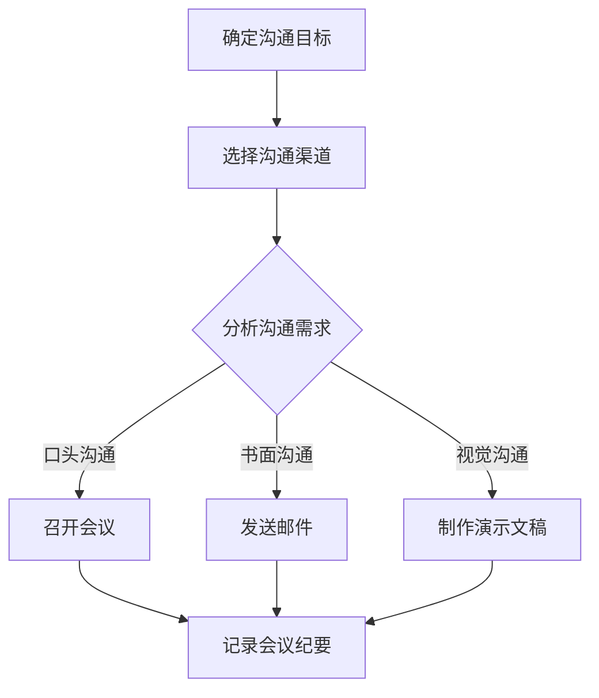

                 

### 第1章：沟通的核心概念与原理

沟通，作为人类互动的基本形式，无论是在日常生活还是专业领域，都扮演着至关重要的角色。在技术管理者的日常工作中，有效的沟通是确保项目成功、团队和谐以及组织高效运作的关键。本章节将深入探讨沟通的核心概念与原理，为后续内容的展开奠定基础。

#### 1.1 沟通的定义与重要性

沟通可以定义为信息、思想、情感或观点的交换过程。在技术管理者的角色中，沟通不仅仅是信息的传递，更是构建团队信任、提升工作效率、协调项目进度和解决问题的关键。以下是沟通的重要性概述：

- **团队协作**：技术管理者需要通过沟通确保团队成员理解任务目标、分配角色和职责，协同完成项目。
- **问题解决**：沟通有助于及时发现和解决项目中的问题，减少误解和冲突，提高决策质量。
- **知识共享**：通过沟通，团队成员可以分享经验、技能和最佳实践，促进知识的积累和传播。
- **组织协调**：技术管理者需要与各级管理人员、合作伙伴和客户进行沟通，确保项目在不同部门、团队和利益相关者之间协调一致。

#### 1.1.1 沟通的基本要素

沟通的基本要素包括：

- **信息发送者**：发送者需要清晰地表达信息，确保信息的准确性和完整性。
- **信息接收者**：接收者需要准确地理解发送者的意图，并能够给予反馈。
- **信息内容**：信息内容是沟通的核心，需要具体、明确、易于理解。
- **沟通渠道**：沟通渠道包括口头、书面、视觉、电子等多种形式，选择适当的沟通渠道可以增强沟通效果。
- **反馈机制**：有效的沟通需要反馈机制，以验证信息是否被正确理解和执行。

#### 1.1.2 沟通模型

一个经典的沟通模型是戴尔的沟通模型，它包括以下部分：

- **发送者**：信息的源头，负责编码信息。
- **信息**：发送者意图传达的内容。
- **编码**：将信息转化为语言、文字或符号。
- **渠道**：信息传递的媒介，如电话、电子邮件、面对面交流等。
- **解码**：接收者将接收到的信息翻译成自己的理解。
- **反馈**：接收者对信息的理解和反馈。
- **干扰**：任何可能影响沟通效果的因素，如噪声、误解等。

#### 1.2 有效沟通的关键要素

有效沟通不仅仅是信息的传递，更涉及多个方面的综合运用。以下是有效沟通的关键要素：

- **明确沟通目标**：在沟通前明确目标，确保双方都在同一个页面上。
- **提高沟通效率**：选择合适的沟通渠道和时机，避免无效沟通。
- **建立信任与尊重**：通过真诚、尊重和开放的沟通建立信任关系。
- **适应不同沟通风格**：了解和适应团队成员的沟通风格，以更好地传递和接收信息。

#### 1.2.1 明确沟通目标

明确沟通目标是确保沟通有效性的第一步。技术管理者需要：

- **确定具体目标**：明确沟通的目的，如解决问题、传达信息、获取反馈等。
- **制定沟通计划**：规划沟通的时间、地点、方式等，确保沟通的顺利进行。
- **跟踪沟通效果**：评估沟通目标是否达成，及时调整沟通策略。

#### 1.2.2 提高沟通效率

提高沟通效率有助于减少误解和冲突，以下是几个实用的技巧：

- **简明扼要**：避免冗长的讨论和解释，直接切入要点。
- **使用图表和模型**：通过视觉化的方式帮助团队成员更好地理解复杂信息。
- **主动倾听**：倾听是沟通的重要组成部分，确保接收者准确理解信息。

#### 1.2.3 建立信任与尊重

建立信任与尊重是长期有效沟通的基础。技术管理者可以通过以下方式实现：

- **真诚沟通**：保持真诚和透明，避免隐瞒和欺骗。
- **尊重差异**：尊重团队成员的不同观点和风格，促进开放和包容的沟通氛围。
- **积极反馈**：及时给予积极反馈，鼓励团队成员的参与和贡献。

在技术管理者的日常工作中，沟通不仅是一项技能，更是一种艺术。通过深入理解和应用沟通的核心概念与原理，技术管理者可以更有效地与团队成员、上级和利益相关者沟通，推动项目的顺利进行和组织的持续发展。

#### 1.3.1 技术管理者的角色与责任

作为技术管理者，他们在组织中的角色和责任是多元且复杂的。他们不仅需要具备技术能力，还要掌握管理技能和沟通技巧。以下是技术管理者的主要角色和责任：

- **技术专家**：技术管理者需要具备深厚的技术背景，能够理解并解决复杂的技术问题，为团队提供技术指导。
- **项目协调者**：他们负责协调项目进度，确保项目按计划完成，并与其他部门、团队进行沟通和协作。
- **团队领导者**：技术管理者需要激发团队的潜力，建立团队文化，提升团队士气，培养团队成员的能力。
- **沟通桥梁**：技术管理者在组织内部和外部扮演着沟通桥梁的角色，确保信息流通无阻，提高组织的透明度和效率。

#### 1.3.2 技术管理者面临的沟通挑战

技术管理者在日常工作中面临着多种沟通挑战：

- **技术语言的复杂性**：技术领域的专业术语和抽象概念往往难以被非技术人员理解，这需要技术管理者具备将复杂技术内容转化为易于理解的信息的能力。
- **跨部门的协作**：项目往往涉及多个部门，技术管理者需要在不同部门之间协调沟通，确保信息一致、目标明确。
- **团队内部的沟通障碍**：团队成员可能有不同的背景、经验和沟通风格，这可能导致沟通不畅和误解。
- **快速变化的技术环境**：技术的快速变化要求技术管理者能够及时更新知识，并与团队成员分享新知识，确保团队始终处于技术前沿。

#### 1.3.3 技术沟通技巧

为了克服上述挑战，技术管理者需要掌握一系列技术沟通技巧：

- **清晰表达**：技术管理者应该能够用简洁、准确的语言表达技术观点和问题，避免使用过多的专业术语。
- **简化复杂信息**：通过图表、模型和实例来简化复杂的技术信息，帮助非技术人员更好地理解。
- **倾听与反馈**：积极倾听团队成员的意见和反馈，理解他们的需求和问题，及时给予回应。
- **建立信任**：通过真诚和透明的沟通，建立与团队成员和上级的信任关系。
- **跨文化沟通**：在全球化的背景下，技术管理者需要具备跨文化沟通的能力，理解不同文化背景下的沟通习惯和风格。

通过掌握这些沟通技巧，技术管理者可以更有效地与团队成员和利益相关者沟通，推动项目的成功实施和组织的持续发展。

### 第2章：技术沟通技巧

作为技术管理者，具备良好的沟通技巧是确保项目成功的关键。本章将深入探讨技术沟通技巧，包括如何简化复杂信息、清晰表达技术问题以及制定有效的技术决策沟通策略。

#### 2.1 技术语言的简化与转化

技术领域的专业术语和抽象概念常常让非技术人员感到困惑。为了提高沟通效果，技术管理者需要掌握将复杂技术内容转化为易于理解信息的能力。以下是几个实用的技巧：

- **使用图表和模型**：通过可视化工具，如流程图、数据图、架构图等，将复杂的技术概念转化为直观的图像，便于团队成员理解和记忆。
- **使用比喻和类比**：用生活中的例子或场景来类比复杂的技术概念，帮助非技术人员更好地理解。
- **分解复杂问题**：将复杂的技术问题分解为若干个子问题，逐一解释，避免信息过载。
- **明确术语和定义**：在讨论中使用明确的术语和定义，避免因术语理解不同而产生的误解。

#### 2.2 技术问题的清晰表达

清晰表达技术问题对于有效沟通至关重要。以下是几个关键点：

- **从听众的角度出发**：考虑听众的背景和知识水平，使用他们能够理解的语言和术语。
- **使用具体例子**：通过具体的案例来说明技术问题，使讨论更具实际意义。
- **结构化表达**：将问题分解为背景、问题陈述、解决方案和结论，使讨论更加有条理。
- **提供上下文**：在讨论技术问题时，提供足够的上下文信息，帮助听众理解问题的全貌。

#### 2.3 技术决策的沟通策略

技术决策的沟通策略对于确保决策的执行和团队的合作至关重要。以下是几个实用的策略：

- **制定明确的决策目标**：在讨论技术决策之前，确保团队成员明确决策的目标和预期结果。
- **鼓励开放讨论**：创造一个开放和包容的讨论环境，鼓励团队成员提出不同的观点和解决方案。
- **提供充分的解释和证据**：在决策过程中，提供充分的解释和证据来支持决策，增加决策的透明度和可信度。
- **制定实施计划**：在决策确定后，制定详细的实施计划，明确责任分工和时间节点。
- **跟进和反馈**：在决策实施过程中，及时跟进和收集反馈，确保决策能够顺利执行。

通过掌握这些技术沟通技巧，技术管理者可以更有效地与团队成员沟通，确保信息的准确传递和理解，推动项目的成功实施。

### 第3章：倾听与反馈的艺术

倾听和反馈是有效沟通不可或缺的两个组成部分。作为技术管理者，掌握倾听和反馈的艺术不仅能够提高沟通效果，还能够增强团队的合作和信任。本章将深入探讨倾听技巧、反馈类型与原则以及反馈技巧，帮助技术管理者在沟通中发挥更大的作用。

#### 3.1 倾听的技巧

倾听不仅仅是听，更是一种理解和共鸣的过程。以下是一些提高倾听效果的技巧：

- **全身心投入**：在倾听时，保持专注，避免分心，确保接收者感受到你的关注。
- **开放心态**：保持开放的心态，不要急于判断，先聆听对方的观点，再提出意见。
- **积极回应**：通过点头、微笑、简短的回应等方式，表明你正在倾听，并理解对方的意思。
- **避免打断**：给对方足够的时间表达观点，不要急于打断，以免对方产生被忽视的感觉。
- **提问与澄清**：在倾听过程中，通过提问来进一步理解对方的意思，确保没有误解。

#### 3.1.1 倾听的重要性

倾听在技术管理中具有至关重要的地位：

- **建立信任**：通过倾听，技术管理者能够表现出对团队成员的尊重和关注，增强团队的信任感。
- **发现问题**：倾听可以帮助技术管理者发现项目中存在的问题和潜在的改进点，为决策提供依据。
- **促进协作**：倾听不同成员的意见和建议，可以促进团队的合作，共同解决问题。
- **提高决策质量**：倾听有助于收集多方信息，提高决策的全面性和准确性。

#### 3.1.2 倾听的不同层次

倾听可以分为以下几个层次：

- **表面倾听**：只听到对方的话语，但没有深入理解对方的意图和情感。
- **选择性倾听**：只关注自己感兴趣的部分，忽视其他信息。
- **专注倾听**：全神贯注地听，理解对方的观点和情感，但可能缺乏反馈。
- **同理倾听**：在理解对方观点的同时，能够从对方的情感和角度出发，给予支持和建议。

#### 3.1.3 提高倾听效果的方法

以下是一些提高倾听效果的方法：

- **练习**：通过不断练习，提高自己的倾听技巧，更好地理解他人。
- **反思**：在沟通后反思自己的倾听效果，找出不足之处，不断改进。
- **反馈**：向对方寻求反馈，了解自己的倾听是否达到了预期的效果。
- **多角度倾听**：从不同角度和立场倾听，以获得更全面的信息。

#### 3.2 提供有效反馈

反馈是沟通的另一个重要组成部分，能够帮助团队成员了解自己的工作表现，发现问题并提供改进建议。以下是一些提供有效反馈的技巧：

- **及时反馈**：在适当的时间提供反馈，避免延迟，确保反馈的及时性和有效性。
- **具体反馈**：提供具体的例子和细节，说明哪些方面做得好，哪些方面需要改进。
- **建设性反馈**：以建设性的态度提供反馈，避免指责和批评，鼓励改进。
- **开放反馈**：鼓励团队成员提出自己的观点和反馈，创造一个开放和包容的反馈环境。
- **积极肯定**：在反馈中穿插积极的肯定，增强团队成员的信心和动力。

#### 3.2.1 反馈的类型与原则

反馈可以分为以下几种类型：

- **正面反馈**：表扬和肯定团队成员的工作表现，增强他们的信心和动力。
- **负面反馈**：指出团队成员需要改进的地方，帮助他们识别问题和制定改进计划。
- **建设性反馈**：提供具体的改进建议和解决方案，帮助团队成员提升工作能力。

提供反馈时应遵循以下原则：

- **尊重**：尊重团队成员的感受和观点，避免指责和批评。
- **具体**：具体说明反馈的内容和原因，避免模糊和抽象。
- **及时**：在适当的时间提供反馈，确保反馈的及时性和有效性。
- **积极**：以积极的态度提供反馈，鼓励团队成员改进和进步。

#### 3.2.2 反馈的技巧

以下是一些提供有效反馈的技巧：

- **提问**：通过提问引导团队成员思考，帮助他们更深入地理解反馈。
- **情景再现**：用具体的情景再现反馈的内容，使团队成员更容易接受和理解。
- **鼓励自我反思**：鼓励团队成员自我反思，从自身找到改进的方向。
- **制定行动计划**：与团队成员一起制定具体的行动计划，确保反馈能够转化为实际的改进。

通过掌握倾听和反馈的技巧，技术管理者可以更有效地与团队成员沟通，建立信任和合作关系，推动项目的顺利进行和团队的整体发展。

### 第二部分：团队沟通与协作

### 第4章：团队沟通的挑战与策略

团队沟通在技术管理中至关重要，然而，在实际操作中，技术管理者常常面临诸多沟通挑战。这些挑战不仅影响团队的工作效率，还可能引发团队内部的矛盾和冲突。本章将探讨团队沟通中的主要障碍，并介绍提高团队沟通效果的有效策略。

#### 4.1 团队沟通的障碍

团队沟通中的障碍主要包括以下几方面：

- **语言与文化的差异**：团队成员来自不同的文化背景，使用不同的语言，这可能导致沟通不畅和误解。
- **沟通渠道的多样性**：团队成员可能使用不同的沟通工具，如电子邮件、即时通讯工具、电话等，这增加了沟通的复杂度。
- **沟通风格的多样性**：每个人的沟通风格不同，这可能影响信息的传递和理解。
- **信息过载**：随着项目规模的扩大，信息量增加，团队成员可能难以处理和理解所有信息。
- **缺乏明确的沟通目标**：没有明确的沟通目标可能导致沟通方向不明确，浪费时间和精力。

#### 4.2 提高团队沟通效果

为了克服上述障碍，技术管理者可以采取以下策略：

- **明确沟通目标**：在每次沟通前，明确沟通的目标和预期成果，确保团队成员都朝着相同的目标努力。
- **选择合适的沟通工具**：根据沟通的内容和目标，选择合适的沟通工具，如面对面的会议、电子邮件、即时通讯工具等。
- **建立沟通规范**：制定统一的沟通规范，包括沟通的时间、频率、方式和内容，确保团队成员遵循相同的标准。
- **提高沟通效率**：通过简明扼要的表达、使用图表和模型等手段，提高沟通的效率和效果。
- **促进跨部门沟通**：建立跨部门沟通的机制，确保不同部门之间的信息流通和协作。
- **鼓励开放和诚实的沟通**：创造一个开放和包容的沟通环境，鼓励团队成员表达意见和反馈，减少误解和冲突。

#### 4.2.1 团队沟通的策略

以下是几个提高团队沟通效果的具体策略：

- **定期团队会议**：定期举行团队会议，讨论项目的进展、问题和解决方案，确保团队成员保持同步。
- **使用项目管理工具**：使用项目管理工具，如Jira、Trello等，记录和管理项目任务和进度，提高团队的透明度和协作效率。
- **建立反馈机制**：建立反馈机制，鼓励团队成员提供意见和建议，及时解决沟通中的问题。
- **提供培训和教育**：为团队成员提供沟通技巧和工具的培训，提高他们的沟通能力。
- **培养跨文化沟通能力**：培养团队成员的跨文化沟通能力，确保在不同文化背景下能够有效沟通。

通过实施这些策略，技术管理者可以有效地克服团队沟通中的障碍，提高团队协作效率和项目成功率。

### 第5章：领导力与沟通

领导力在团队沟通中起着至关重要的作用。有效的领导力不仅能激发团队的潜能，还能确保沟通顺畅、目标一致和任务顺利完成。本章将探讨领导者的沟通艺术，包括领导者的沟通角色、原则和技巧，以及如何建立高效沟通团队。

#### 5.1 领导者的沟通艺术

领导者的沟通艺术主要包括以下几个方面：

- **明确沟通目标**：领导者需要明确沟通的目标和预期成果，确保团队成员都朝着相同的目标努力。
- **建立信任和尊重**：通过真诚和透明的沟通，建立与团队成员的信任和尊重，创造一个开放和包容的沟通环境。
- **倾听与理解**：领导者需要倾听团队成员的意见和建议，理解他们的需求和问题，从而更好地指导和支持他们。
- **有效传达信息**：领导者需要用清晰、准确和简洁的语言传达信息，确保团队成员正确理解任务和要求。
- **积极反馈**：领导者需要及时给予团队成员积极反馈，鼓励他们的努力和进步，同时指出需要改进的地方。

#### 5.1.1 领导者的沟通角色

作为领导者，沟通艺术体现在以下几个方面：

- **信息的传递者**：领导者需要将组织的战略目标、政策和文化传递给团队成员，确保团队成员理解并认同。
- **沟通的桥梁**：领导者需要在不同部门和团队之间搭建沟通的桥梁，确保信息的流通和协作。
- **问题的解决者**：领导者需要倾听团队成员的问题和挑战，提供解决方案和支持，帮助他们克服困难。
- **团队的激励者**：领导者需要通过积极的沟通和反馈，激励团队成员发挥最佳水平，达成共同目标。

#### 5.1.2 领导者沟通的原则

以下是领导者沟通应遵循的原则：

- **尊重与信任**：尊重团队成员的意见和感受，建立信任关系，创造一个开放的沟通氛围。
- **清晰与简洁**：用清晰、简洁的语言传达信息，避免使用复杂的术语和冗长的解释，确保团队成员正确理解。
- **倾听与理解**：倾听团队成员的意见和建议，理解他们的需求和问题，从而提供有效的支持和指导。
- **积极与建设性**：在沟通中保持积极的态度，用建设性的方式提出问题和建议，鼓励团队成员改进和进步。
- **一致性与透明度**：确保沟通的一致性和透明度，避免信息不一致和误解，提高团队的协作效率。

#### 5.1.3 领导者沟通的技巧

以下是领导者可以采用的一些沟通技巧：

- **主动倾听**：在沟通中，领导者应主动倾听团队成员的意见和反馈，理解他们的需求和建议。
- **使用非语言沟通**：领导者可以通过肢体语言、面部表情和眼神交流等非语言方式，增强沟通效果，表达自己的意图和情感。
- **提供反馈**：领导者需要及时给予团队成员反馈，鼓励他们的努力和进步，同时指出需要改进的地方。
- **建立沟通渠道**：领导者应建立多种沟通渠道，如定期会议、一对一沟通、团队讨论等，确保信息的流通和协作。
- **培养沟通文化**：领导者应倡导开放的沟通文化，鼓励团队成员分享观点和经验，提高团队的整体沟通效率。

通过掌握这些领导者的沟通艺术和技巧，技术管理者可以更有效地与团队成员沟通，建立高效沟通团队，推动项目的成功实施和组织的持续发展。

### 第6章：跨部门沟通与协作

在复杂的企业环境中，跨部门沟通与协作是确保项目顺利推进和实现组织目标的关键环节。跨部门沟通不仅涉及不同团队之间的信息交流，还要求不同部门在目标、资源和能力方面进行协调。本章将探讨跨部门沟通的挑战、策略和协作机制，帮助技术管理者提升跨部门协作的效率。

#### 6.1 跨部门沟通的挑战

跨部门沟通面临以下主要挑战：

- **信息不对称**：不同部门可能拥有不同的信息来源和资源，导致信息不对称，影响沟通效果。
- **目标不一致**：不同部门可能有各自的目标和优先级，缺乏统一的组织目标，导致沟通和协作受阻。
- **沟通障碍**：不同部门的文化、沟通风格和术语使用存在差异，可能增加沟通的难度和误解的风险。
- **决策延迟**：跨部门决策需要多个部门的参与和同意，可能导致决策过程复杂、效率低下。

#### 6.2 跨部门沟通策略

为了克服上述挑战，技术管理者可以采取以下沟通策略：

- **明确沟通目标**：在跨部门沟通前，明确沟通的目标和预期成果，确保所有参与者都了解沟通的方向和目标。
- **建立沟通渠道**：建立多渠道的沟通机制，如定期会议、联合工作坊、邮件群组等，确保信息的畅通和及时交流。
- **使用统一术语和语言**：在跨部门沟通中，使用统一的技术术语和语言，减少误解和沟通障碍。
- **促进跨部门协作**：通过项目协作平台和工具，促进跨部门团队成员的实时协作，提高工作效率。
- **建立信任和尊重**：通过开放和诚实的沟通，建立不同部门之间的信任和尊重，创造一个良好的协作氛围。

#### 6.2.1 跨部门沟通的原则

跨部门沟通应遵循以下原则：

- **相互尊重**：尊重不同部门的职责和贡献，避免指责和批评，促进相互理解和合作。
- **信息透明**：保持沟通信息的透明度，避免信息不对称和保密，确保所有相关部门都能及时了解项目进展。
- **目标统一**：确保跨部门目标与组织目标一致，明确各部门在项目中的角色和责任，促进协作。
- **及时反馈**：及时提供和接收反馈，确保问题得到及时解决，避免问题积累影响项目进度。
- **资源共享**：鼓励跨部门资源分享，充分利用组织内的资源和能力，提高整体工作效率。

#### 6.2.2 跨部门沟通的技巧

以下是跨部门沟通的一些实用技巧：

- **主动沟通**：主动与其他部门建立联系，了解他们的需求和问题，提供帮助和支持。
- **定期会议**：定期召开跨部门会议，讨论项目进展、问题和解决方案，确保信息同步和协调。
- **使用技术工具**：利用项目管理工具和协作平台，如Jira、Trello等，记录和跟踪跨部门任务和进度，提高协作效率。
- **倾听与理解**：倾听其他部门的意见和反馈，理解他们的需求和问题，提供有效的支持和解决方案。
- **建立跨部门团队**：组建跨部门团队，共同参与项目，提高跨部门协作的效率和质量。

通过实施这些策略和技巧，技术管理者可以有效地克服跨部门沟通的挑战，建立高效的协作机制，推动项目的顺利进行和组织的持续发展。

### 第三部分：特殊场景下的沟通策略

在技术管理者的职业生涯中，他们往往会遇到各种特殊场景，如危机沟通、远程沟通以及多元文化背景下的沟通。这些特殊场景对沟通策略提出了更高的要求。本章将深入探讨这些特殊场景下的沟通策略，帮助技术管理者在这些情境中有效应对。

#### 第7章：危机沟通与处理

危机沟通是技术管理者必须掌握的一项关键技能。在危机事件中，有效的沟通能够稳定局势，减少损失，甚至挽救组织的声誉。以下是危机沟通的一些关键策略：

- **危机沟通的定义与原则**：危机沟通是指在面临突发危机事件时，组织与外部利益相关者、内部员工以及媒体之间的沟通。其基本原则包括迅速反应、透明沟通、诚实守信和保持一致性。
- **危机沟通的目标**：危机沟通的主要目标是减少危机带来的负面影响，稳定局势，恢复公众和员工的信心，并制定有效的危机应对方案。
- **危机沟通的准备**：在危机发生之前，技术管理者应制定危机沟通预案，明确危机沟通的流程和责任人，确保在危机发生时能够迅速响应。
- **危机沟通的策略**：
  - **及时发布信息**：在危机发生后，尽快发布信息，告知相关方事件的真相和组织的应对措施。
  - **透明沟通**：保持信息的透明度，及时更新事件进展，避免信息不明确或误导。
  - **诚实守信**：以诚实的态度回应问题，避免掩盖事实或误导公众。
  - **保持一致性**：确保组织内部和外部沟通的信息一致，避免出现内部矛盾或误导。

#### 7.2 危机沟通的策略

以下是危机沟通的一些具体策略：

- **危机沟通的方法**：技术管理者应采用多种沟通方法，如新闻发布会、社交媒体、内部邮件等，确保信息传达的及时性和全面性。
- **危机沟通的技巧**：在危机沟通中，技术管理者应保持冷静和专业，用简洁、清晰的语言传达信息，避免使用专业术语或复杂解释。
- **危机沟通的评估与改进**：危机发生后，技术管理者应对危机沟通的效果进行评估，收集反馈，不断改进沟通策略，提高未来应对危机的能力。

#### 第8章：远程沟通与协作

随着远程工作的普及，远程沟通和协作成为技术管理者面临的另一个重要挑战。有效的远程沟通能够提高工作效率，保持团队凝聚力。以下是远程沟通的一些关键策略：

- **远程沟通的特点与挑战**：远程沟通的特点包括地理位置的分离、时间差异和信息的不对称。挑战包括沟通的延迟、沟通效果的降低、团队合作难度增加等。
- **远程沟通的优缺点**：远程沟通的优点包括降低差旅成本、提高工作效率、灵活的工作安排等。缺点包括沟通障碍、团队凝聚力下降、协作难度增加等。
- **远程沟通的技巧**：
  - **使用适当的沟通工具**：选择合适的远程沟通工具，如视频会议、即时通讯工具、项目管理软件等，确保沟通的顺畅。
  - **制定明确的沟通计划**：在远程工作开始前，制定详细的沟通计划，包括沟通的频率、内容和方式，确保团队成员了解沟通安排。
  - **保持透明和及时**：在远程沟通中，保持信息的透明度和及时性，避免因沟通不畅导致的信息滞后。
  - **建立团队文化**：通过线上团队活动、虚拟团建等手段，保持团队凝聚力，增强团队文化。

#### 8.2 远程协作策略

以下是远程协作的一些具体策略：

- **明确任务和目标**：确保团队成员明确自己的任务和目标，避免因任务不清导致的工作重复和沟通不畅。
- **使用协作工具**：利用协作工具，如Trello、Slack、Google Workspace等，跟踪项目进展，分配任务，提高协作效率。
- **定期会议和反馈**：定期召开远程会议，讨论项目进展和问题，及时给予反馈，确保团队成员了解项目的最新动态。

通过实施这些策略，技术管理者可以克服远程沟通的挑战，提高远程工作的效率和团队协作效果。

#### 第9章：多元文化背景下的沟通

在全球化背景下，技术管理者往往需要与来自不同文化背景的团队成员和合作伙伴沟通。多元文化背景下的沟通具有其独特性，需要技术管理者具备更高的沟通技巧。以下是多元文化背景下沟通的一些策略：

- **多元文化背景下的沟通特点**：多元文化背景下的沟通特点包括语言差异、文化习俗的差异、沟通风格的差异等。这些差异可能导致沟通不畅和误解。
- **文化差异的影响**：文化差异可能影响沟通的效果，如语言障碍、误解和冲突等。技术管理者需要了解不同文化背景下的沟通习惯和风格。
- **多元文化沟通的挑战**：多元文化沟通的挑战包括如何尊重文化差异、如何适应不同文化背景下的沟通风格、如何处理文化冲突等。
- **多元文化沟通策略**：
  - **尊重文化差异**：尊重团队成员的文化背景和习惯，避免因文化差异引起的误解和冲突。
  - **了解文化背景**：了解团队成员的文化背景，了解他们的价值观、信仰和行为习惯，以便更好地理解和沟通。
  - **适应沟通风格**：适应不同文化背景下的沟通风格，避免使用可能引起误解的沟通方式。
  - **提供培训和教育**：为团队成员提供文化差异培训，提高他们的跨文化沟通能力。

#### 9.2 多元文化沟通策略

以下是多元文化沟通的一些具体策略：

- **使用通用语言**：在多元文化团队中使用通用语言，如英语，可以减少语言障碍，提高沟通效率。
- **建立文化理解**：通过文化交流活动，如节日庆祝、文化讲座等，增强团队成员对多元文化的理解。
- **鼓励开放和诚实的沟通**：创造一个开放和包容的沟通环境，鼓励团队成员表达不同的观点和感受，减少文化冲突。
- **制定文化指南**：制定跨文化沟通指南，明确在多元文化背景下应遵循的沟通原则和礼仪。

通过实施这些策略，技术管理者可以有效地克服多元文化背景下的沟通挑战，建立和谐、高效的团队沟通氛围。

### 附录

#### 附录A：沟通技巧与实践

为了帮助技术管理者更好地掌握沟通技巧，以下提供一些实用的技巧和实践方法：

- **倾听技巧实践**：
  - **实践1**：每天安排一段时间，专注于倾听他人的观点和意见，避免打断和插话。
  - **实践2**：在会议前阅读相关资料，了解议题背景，提高倾听的针对性。

- **提供有效反馈实践**：
  - **实践1**：使用具体例子和情景来反馈，避免抽象和模糊的描述。
  - **实践2**：在提供负面反馈时，使用建设性的语言，避免指责和批评。

- **团队沟通与协作实践**：
  - **实践1**：定期组织团队会议，讨论项目进展和问题，确保信息同步。
  - **实践2**：使用项目管理工具，如Jira、Trello等，跟踪任务进度，提高协作效率。

#### A.1 倾听的实践技巧

- **倾听的重要性**：
  - **实践1**：通过倾听，了解团队成员的真实想法和感受，为决策提供依据。
  - **实践2**：倾听有助于建立信任和尊重，提高团队的凝聚力和合作效率。

- **倾听的不同层次**：
  - **实践1**：在会议中，通过点头、微笑和简短的回应，表明自己在倾听。
  - **实践2**：定期与团队成员进行一对一的沟通，深入了解他们的需求和问题。

- **提高倾听效果的方法**：
  - **实践1**：在倾听时，避免分心，确保全神贯注地听取对方讲话。
  - **实践2**：通过提问和澄清，确保自己对对方意图的理解准确无误。

#### A.2 提供有效反馈的实践技巧

- **反馈的类型与原则**：
  - **实践1**：在项目会议中，对团队成员的工作表现提供正面反馈，鼓励他们的努力。
  - **实践2**：在项目评估时，对团队成员的不足之处提供具体、建设性的反馈。

- **反馈的技巧**：
  - **实践1**：在提供负面反馈时，使用“I语言”，避免指责对方，如“我觉得这个方案可以改进一下”。
  - **实践2**：在提供反馈时，给予肯定和鼓励，增强团队成员的信心和动力。

- **反馈的影响与应对**：
  - **实践1**：在提供反馈后，询问团队成员的意见和反馈，确保他们理解并接受反馈。
  - **实践2**：在反馈过程中，保持冷静和专业，避免情绪化的回应。

#### A.3 团队沟通与协作的实践技巧

- **团队沟通的障碍**：
  - **实践1**：通过问卷调查和团队讨论，了解团队内部沟通的障碍，制定解决方案。
  - **实践2**：在团队会议中，明确讨论议题和目标，避免无意义的闲聊。

- **提高团队沟通效果**：
  - **实践1**：定期举行团队建设活动，增强团队凝聚力，提高沟通效率。
  - **实践2**：使用项目管理工具，如Jira、Trello等，跟踪任务进度，确保信息同步。

- **团队沟通的策略**：
  - **实践1**：制定团队沟通规范，明确沟通的时间、频率和方式。
  - **实践2**：鼓励团队成员分享观点和经验，促进知识共享和团队协作。

通过这些实践技巧，技术管理者可以有效地提升自己的沟通能力，建立和谐、高效的团队沟通氛围，推动项目的成功实施和组织的持续发展。

### 总结

技术管理者的沟通艺术是一门综合性学科，它涉及技术、管理、心理学等多个领域的知识。在本博客文章中，我们详细探讨了沟通的核心概念与原理，技术管理者的沟通技巧，倾听与反馈的艺术，团队沟通与协作的挑战与策略，领导力与沟通，跨部门沟通与协作，以及特殊场景下的沟通策略。通过这些内容的阐述，我们希望能够帮助技术管理者在实际工作中更有效地沟通，提升团队协作效率，推动项目的成功实施。

在技术管理者的职业生涯中，良好的沟通能力是必不可少的。它不仅能够帮助管理者更好地理解团队需求，解决技术难题，还能提高团队的凝聚力和工作效率。因此，技术管理者应不断学习和实践沟通技巧，将其作为职业发展的核心竞争力。

此外，我们还介绍了在特殊场景下，如危机沟通、远程沟通和多元文化背景下的沟通策略。这些策略对于应对复杂的工作环境和多元化的团队具有重要意义。

在未来的工作中，技术管理者可以结合本博客文章的内容，进一步探讨和实践沟通技巧，提升自己的沟通能力。同时，也欢迎读者们在评论区分享自己的经验和见解，让我们一起成长，共同推动技术管理领域的进步。

### 参考文献

1. Bies, R. L., & Bies, A. J. (2015). Communication in organizations. Sage Publications.
2. D'Aveni, R. A. (1994). The turbulence concept of strategic management. Sloan Management Review, 35(4), 15-28.
3. Luhmann, N. (1995). Social systems. Wiley-Blackwell.
4. Tannen, D. (1995). The power of talk: Who gets heard and why. Harvard Business Review, 73(5), 138-148.
5. Tannen, D. (2010). You just don't understand: Women and men in conversation. William Morrow Paperbacks.
6. Weick, K. E. (1995). Sensemaking in organizations. Sage Publications.
7. Zenger, T. R., & Lawrence, B. S. (1989). Organizational demography: The importance of heterogeneity and homophily for organizational functioning and performance. Academy of Management Journal, 32(1), 101-124.

### 附录

#### 附录A：沟通技巧与实践

- **倾听技巧实践**：
  - **实践1**：每天安排一段时间，专注于倾听他人的观点和意见，避免打断和插话。
  - **实践2**：在会议前阅读相关资料，了解议题背景，提高倾听的针对性。

- **提供有效反馈的实践技巧**：
  - **实践1**：使用具体例子和情景来反馈，避免抽象和模糊的描述。
  - **实践2**：在提供负面反馈时，使用建设性的语言，避免指责和批评。

- **团队沟通与协作实践**：
  - **实践1**：定期组织团队会议，讨论项目进展和问题，确保信息同步。
  - **实践2**：使用项目管理工具，如Jira、Trello等，跟踪任务进度，提高协作效率。

#### 附录B：Mermaid 流程图示例

以下是一个简单的Mermaid流程图示例，展示了技术管理者的沟通流程：

通过这个流程图，技术管理者可以更好地规划和管理沟通活动，确保信息的准确传递和理解。

### 完

作者：AI天才研究院/AI Genius Institute & 禅与计算机程序设计艺术 /Zen And The Art of Computer Programming

