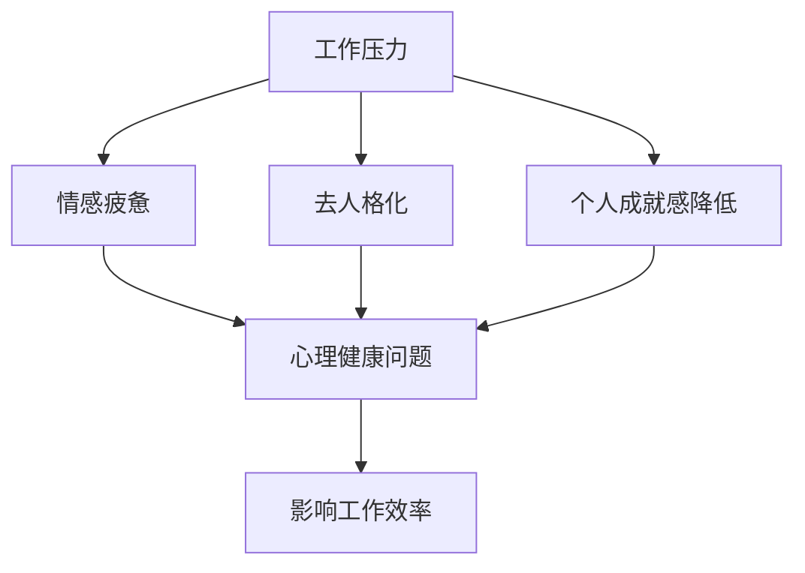
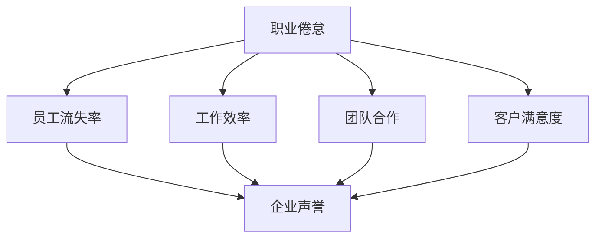

                 


### 1.1 职业倦怠的定义与症状

职业倦怠是一种在职业环境中常见的工作压力反应，它不仅仅局限于某一特定行业或职位。根据国际劳工组织（ILO）的定义，职业倦怠是一种心理状态，通常表现为情感疲惫、去人格化和个人成就感降低。

**核心概念与联系**

职业倦怠与心理健康紧密相关。心理健康问题如焦虑、抑郁和压力可能会导致职业倦怠，而职业倦怠又会进一步加重心理健康问题。这种相互影响的关系可以用以下Mermaid流程图来表示：



在这个图中，工作压力是职业倦怠的触发因素，它导致了情感疲惫、去人格化和个人成就感降低这三个主要症状。这些症状进一步加剧了心理健康问题，从而影响工作效率。

### 1.2 技术管理者职业倦怠的成因

技术管理者的职业倦怠并非单一原因所致，而是多种因素共同作用的结果。以下是一个简单的伪代码模型，用于分析技术管理者职业倦怠的成因：

```python
def causal_factor_analysis(employee, work_environment):
    stress_level = employee.work_environment.stress_factor
    workload = employee.workload
    support_system = employee.support_system
    return (stress_level * workload) / support_system
```

**变量解释：**

- `stress_level`：工作环境中的压力水平，包括工作量、紧急任务、工作期限等。
- `workload`：员工的工作负担，包括工作量和工作难度。
- `support_system`：员工所获得的组织支持和资源，如培训、团队协作、工作条件等。

**算法原理：**

该算法通过计算压力水平和工作负担的乘积，再除以支持系统的值，来评估职业倦怠的程度。如果结果较大，则表明员工可能面临较高的职业倦怠风险。

### 1.3 心理学理论与职业倦怠的关系

心理学理论为理解职业倦怠提供了重要的框架。常见的心理学理论包括情感耗竭理论（Emotional Exhaustion Theory）、去人格化理论（Depersonalization Theory）和个人成就感降低理论（Reduced Personal Accomplishment Theory）。

**情感耗竭理论**

情感耗竭理论认为，职业倦怠是由于长时间的情感压力和过度情绪劳动导致的。以下是一个简化的数学模型，用于描述情感耗竭：

$$
情感耗竭指数 = f(\text{工作压力}, \text{情感劳动}, \text{休息时间})
$$

**去人格化理论**

去人格化理论强调，职业倦怠会导致员工对他人的冷漠和疏离。以下是一个简化的数学模型，用于描述去人格化：

$$
去人格化指数 = f(\text{工作压力}, \text{负面情绪}, \text{人际互动})
$$

**个人成就感降低理论**

个人成就感降低理论认为，职业倦怠会导致员工对自己的工作和能力产生负面看法。以下是一个简化的数学模型，用于描述个人成就感降低：

$$
个人成就感指数 = f(\text{工作挑战}, \text{工作成果}, \text{自我效能感})
$$

**综合模型**

为了全面理解职业倦怠，我们可以将这三个理论整合为一个综合模型：

$$
职业倦怠指数 = f(\text{情感耗竭指数}, \text{去人格化指数}, \text{个人成就感指数})
$$

### 1.4 职业倦怠对企业的影响

职业倦怠不仅对员工个人的心理健康和工作满意度产生影响，也对企业的整体运营和绩效产生负面影响。以下是一些具体的例子：

1. **员工流失率增加**：职业倦怠可能导致员工离职，特别是那些具有高技能和经验的员工。
2. **工作效率下降**：职业倦怠会影响员工的工作效率和质量，导致项目延误和错误率增加。
3. **团队合作受损**：情感疲惫和去人格化可能导致员工之间的合作和沟通受损，影响团队的凝聚力和工作效率。
4. **客户满意度下降**：由于员工工作积极性降低，客户服务质量和响应速度可能受到影响，导致客户满意度下降。

为了更直观地展示职业倦怠对企业的影响，我们可以使用以下Mermaid流程图：



在这个流程图中，职业倦怠通过多个途径影响企业的各个方面，最终可能导致企业成本增加、工作效率下降、团队合作受损和客户满意度下降，从而影响企业的整体绩效和声誉。

---

**小结**

通过以上分析，我们可以看出，职业倦怠是一个复杂的现象，涉及到多个层面的因素。理解职业倦怠的定义、成因和影响，有助于企业和管理者制定有效的预防和调适策略，以维护员工的健康和工作满意度，提高企业的整体绩效。

在接下来的章节中，我们将进一步探讨职业倦怠的预防策略，包括个体层面的措施和组织层面的干预，以及如何通过跨部门合作和支持系统来降低职业倦怠的风险。我们还将介绍一些实用的方法和技巧，帮助技术管理者更好地应对职业压力，提高自我调适能力。

---

**注意事项**

在撰写技术博客时，以下几点需要注意：

- **结构清晰**：确保文章结构清晰，逻辑连贯，便于读者理解。
- **举例说明**：使用具体的例子和实例来解释复杂的概念和理论。
- **图表辅助**：适当使用图表和流程图来帮助解释和说明。
- **代码示例**：对于算法和模型，提供伪代码或实际代码示例，以便读者更好地理解和应用。

**拓展阅读**

- 《工作倦怠：概念、测量与干预》（Work Burnout: Concepts, Measures, and Interventions）
- 《心理学与工作倦怠》（Psychology and Work Burnout）
- 《职业倦怠与工作满意度：理论与实践》（Job Burnout and Job Satisfaction: Theory and Practice）

---

通过以上详细的步骤和解析，我们已经构建了一个关于技术管理者职业倦怠预防与调适的技术博客大纲。在接下来的章节中，我们将继续深入探讨个体和组织层面的预防措施，以及如何通过实践和案例来理解和应用这些措施。让我们继续展开探讨，为技术管理者提供实用的建议和策略，帮助他们更好地应对职业倦怠的挑战。

