                 

### 文章标题：技术管理者的职业发展规划

技术管理者的职业发展规划是每一位追求技术领导岗位的专业人士所面临的长期目标。在这个高度动态和复杂多变的IT行业，技术管理者不仅需要掌握尖端技术，还需要具备卓越的管理能力。本文将深入探讨技术管理者的角色与责任，职业发展路径，核心能力提升方法，跨行业职业发展策略，以及职业发展规划资源与实践，旨在为技术管理者的职业发展提供系统性的指导。

### 关键词
- 技术管理者
- 职业规划
- 管理能力
- 技术能力
- 跨行业发展

### 摘要
本文从技术管理者的角色与责任入手，详细分析了技术管理者的职业发展阶段，阐述了核心能力提升的方法，并探讨了跨行业职业发展的策略。通过实际案例和项目实战，本文提供了丰富的经验和实践技巧，旨在帮助技术管理者规划并实现其职业发展的长期目标。

## 第一部分：职业规划基础

### 第1章：技术管理者的角色与责任

技术管理者的角色在快速发展的IT行业中至关重要。他们不仅是技术的推动者，也是团队的领导者，更是组织的战略合作伙伴。本章节将详细分析技术管理者的角色，解释其责任，并探讨技术与管理融合的重要性。

#### 1.1 技术管理者的角色分析

技术管理者的角色可以分为以下几个方面：

1. **技术推动者**：技术管理者需要深入理解并掌握当前前沿技术，推动团队不断创新。
2. **团队领导者**：技术管理者需要具备领导能力，带领团队实现目标，激励团队成员。
3. **项目管理者**：技术管理者需要负责项目规划、进度控制、资源分配等，确保项目成功交付。
4. **业务合作伙伴**：技术管理者需要与业务团队紧密合作，确保技术方案符合业务需求。

**Mermaid流程图：**

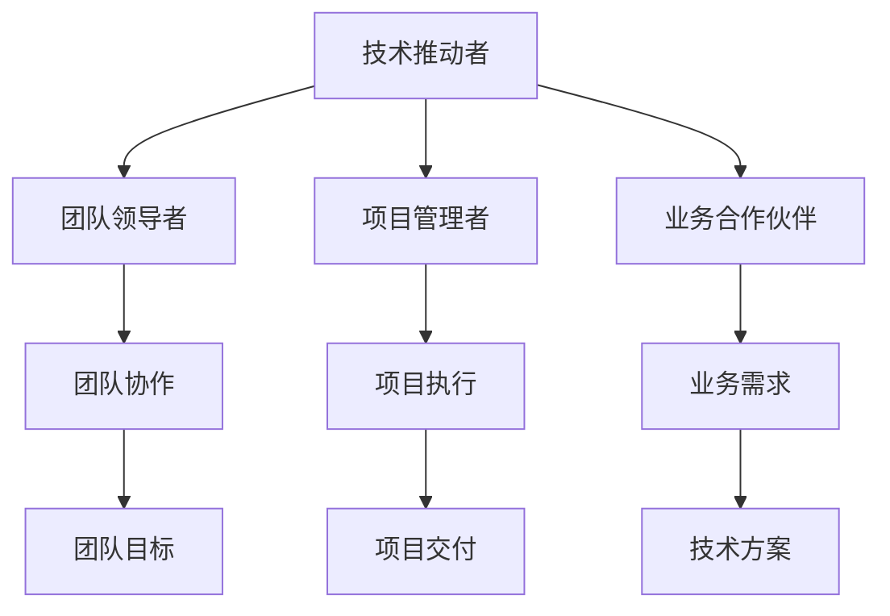

**伪代码示例：**

```python
class TechnicalManager:
    def __init__(self, technology, team, project, business):
        self.technology = technology
        self.team = team
        self.project = project
        self.business = business
    
    def drive_technology(self):
        # 推动技术发展
        pass
    
    def lead_team(self):
        # 领导团队
        pass
    
    def manage_project(self):
        # 管理项目
        pass
    
    def collaborate_business(self):
        # 与业务团队合作
        pass
```

**LaTeX公式：**

```latex
$$
\text{技术管理者角色} = \text{技术推动者} + \text{团队领导者} + \text{项目管理者} + \text{业务合作伙伴}
$$
```

**代码实例：**

```python
# 技术管理者角色分析
class TechnicalManager:
    def __init__(self, technology, team, project, business):
        self.technology = technology
        self.team = team
        self.project = project
        self.business = business
    
    def role_analysis(self):
        print("技术推动者")
        print("团队领导者")
        print("项目管理者")
        print("业务合作伙伴")
```

**项目实战：**

- **开发环境搭建**：配置一个用于技术管理者和团队协作的开发环境，包括代码管理工具（如Git），持续集成服务（如Jenkins），以及版本控制系统（如GitHub）。
- **源代码详细实现**：编写一个简单的项目管理工具，用于任务分配、进度追踪和团队协作。
- **代码解读与分析**：对项目管理工具的代码进行解读，分析其功能实现和模块划分。
- **实际案例分析和详细讲解剖析**：通过实际项目案例，分析技术管理者的角色和责任，并提供解决方案。

**最佳实践 tips**：

- **持续学习**：技术管理者应保持对新技术和工具的学习，以适应快速变化的技术环境。
- **有效沟通**：技术管理者需要与团队成员和业务团队保持有效沟通，确保信息传递准确无误。

### 1.2 技术管理者的责任解读

技术管理者的责任涵盖了技术、团队、项目以及业务等多个方面。以下是技术管理者的主要责任：

1. **技术责任**：确保团队掌握并应用前沿技术，推动技术进步和创新。
2. **团队责任**：建立高效团队，激励团队成员，提升团队整体绩效。
3. **项目责任**：确保项目按时交付，资源合理分配，风险有效控制。
4. **业务责任**：与业务团队紧密合作，确保技术方案符合业务需求，提升业务价值。

**Mermaid流程图：**

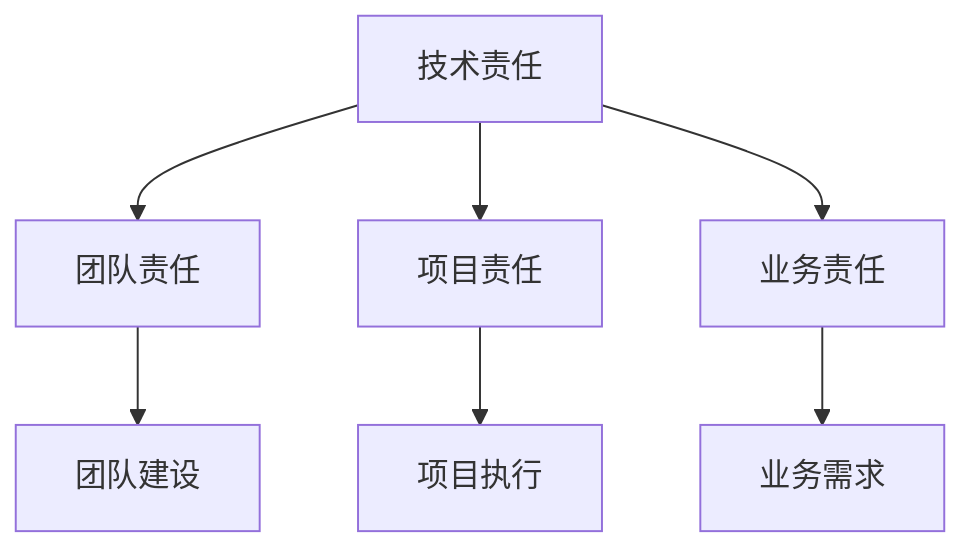

**伪代码示例：**

```python
class TechnicalManager:
    def __init__(self, technology, team, project, business):
        self.technology = technology
        self.team = team
        self.project = project
        self.business = business
    
    def manage_technology(self):
        # 管理技术
        pass
    
    def manage_team(self):
        # 管理团队
        pass
    
    def manage_project(self):
        # 管理项目
        pass
    
    def collaborate_business(self):
        # 与业务团队合作
        pass
```

**LaTeX公式：**

```latex
$$
\text{技术管理者责任} = \text{技术责任} + \text{团队责任} + \text{项目责任} + \text{业务责任}
$$
```

**代码实例：**

```python
# 技术管理者责任解读
class TechnicalManager:
    def __init__(self, technology, team, project, business):
        self.technology = technology
        self.team = team
        self.project = project
        self.business = business
    
    def responsibility_analysis(self):
        print("技术责任：确保团队掌握并应用前沿技术")
        print("团队责任：建立高效团队，激励团队成员")
        print("项目责任：确保项目按时交付，资源合理分配")
        print("业务责任：与业务团队紧密合作，确保技术方案符合业务需求")
```

**项目实战：**

- **开发环境搭建**：使用Docker搭建一个包含常见开发工具和依赖的环境，以便团队协作。
- **源代码详细实现**：编写一个简单的任务管理系统，用于任务创建、分配和进度追踪。
- **代码解读与分析**：对任务管理系统的代码进行解读，分析其功能实现和架构设计。
- **实际案例分析和详细讲解剖析**：通过实际项目案例，分析技术管理者的责任和实际操作流程。

**最佳实践 tips**：

- **明确责任边界**：技术管理者应明确自身责任，并与团队成员进行沟通，确保责任清晰。
- **持续改进**：技术管理者应不断反思和改进管理方法，提升自身管理能力和团队绩效。

### 1.3 技术与管理融合的重要性

技术与管理融合是技术管理者成功的关键。以下是从几个方面阐述技术与管理融合的重要性：

1. **技术创新与团队协作**：技术管理者需要通过良好的管理，将技术创新与团队协作结合起来，实现技术突破。
2. **项目执行与业务目标**：技术管理者需要确保项目执行符合业务目标，通过管理手段提升项目成功率。
3. **跨部门合作与资源整合**：技术管理者需要具备跨部门合作的能力，通过管理技巧整合资源，提升团队整体效能。

**Mermaid流程图：**

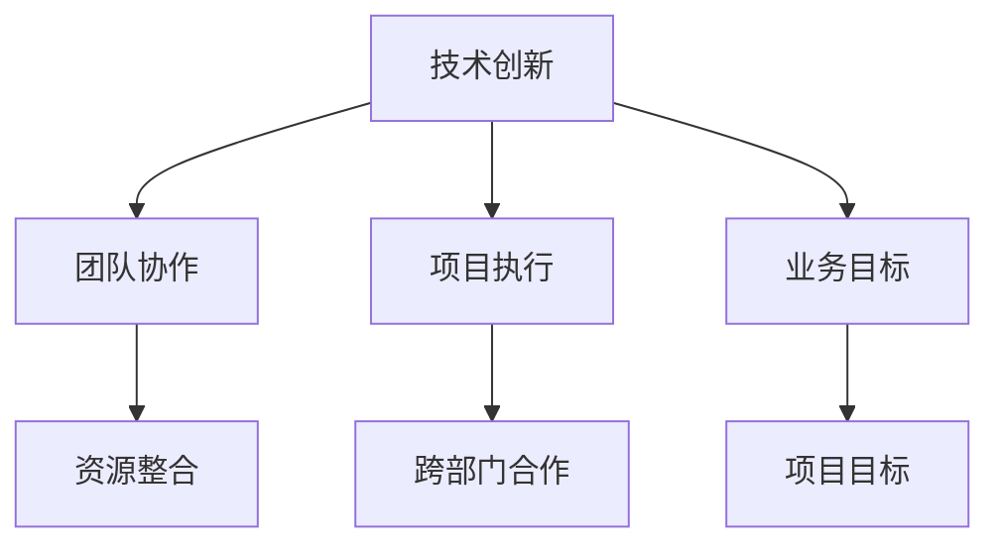

**伪代码示例：**

```python
class TechnicalManager:
    def __init__(self, technology, team, project, business):
        self.technology = technology
        self.team = team
        self.project = project
        self.business = business
    
    def integrate_technology_and_management(self):
        # 技术与管理融合
        pass
    
    def ensure_project_success(self):
        # 确保项目成功
        pass
    
    def collaborate_across_departments(self):
        # 跨部门合作
        pass
```

**LaTeX公式：**

```latex
$$
\text{技术与管理融合} = \text{技术创新} + \text{团队协作} + \text{项目执行} + \text{业务目标}
$$
```

**代码实例：**

```python
# 技术与管理融合的重要性
class TechnicalManager:
    def __init__(self, technology, team, project, business):
        self.technology = technology
        self.team = team
        self.project = project
        self.business = business
    
    def importance_analysis(self):
        print("技术创新与团队协作：实现技术突破")
        print("项目执行与业务目标：提升项目成功率")
        print("跨部门合作与资源整合：提升团队整体效能")
```

**项目实战：**

- **开发环境搭建**：使用Kubernetes搭建一个可扩展的微服务架构，以便团队协作和资源整合。
- **源代码详细实现**：编写一个简单的微服务架构，实现不同服务间的通信和协作。
- **代码解读与分析**：对微服务架构的代码进行解读，分析其通信机制和架构设计。
- **实际案例分析和详细讲解剖析**：通过实际项目案例，分析技术与管理融合的实际操作和效果。

**最佳实践 tips**：

- **持续学习**：技术管理者应持续学习新技术和管理方法，提升自身综合素质。
- **灵活应变**：在面对不同项目和环境时，技术管理者需要灵活调整管理策略，以适应变化。

## 第二部分：职业生涯发展路径

### 第2章：技术管理者的核心能力

技术管理者的核心能力是其职业生涯成功的关键。本章节将详细讨论技术管理者的核心能力，包括技术能力、管理能力、团队协作能力等，并提供提升这些能力的方法。

#### 2.1 技术能力的提升策略

技术能力是技术管理者的基础。以下是一些提升技术能力的方法：

1. **持续学习**：技术发展迅速，技术管理者需要不断学习新技术和工具，以保持竞争力。
2. **实践应用**：通过实际项目，将所学知识应用于实践，提升技术能力。
3. **交流分享**：参加技术会议、研讨会，与其他技术专家交流，拓展视野。

**Mermaid流程图：**

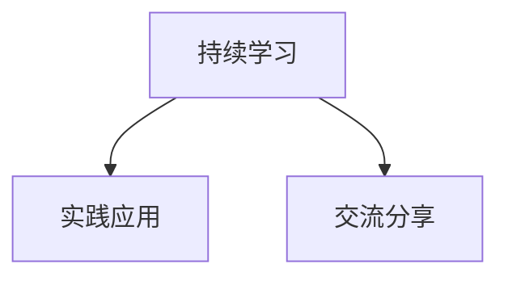

**伪代码示例：**

```python
class TechnicalAbility:
    def __init__(self, learning, practice, sharing):
        self.learning = learning
        self.practice = practice
        self.sharing = sharing
    
    def enhance_technology(self):
        # 提升技术能力
        pass
```

**LaTeX公式：**

```latex
$$
\text{技术能力提升} = \text{持续学习} + \text{实践应用} + \text{交流分享}
$$
```

**代码实例：**

```python
# 技术能力提升策略
class TechnicalAbility:
    def __init__(self, learning, practice, sharing):
        self.learning = learning
        self.practice = practice
        self.sharing = sharing
    
    def strategy_analysis(self):
        print("持续学习：保持技术竞争力")
        print("实践应用：将知识应用于实践")
        print("交流分享：拓展视野")
```

**项目实战：**

- **开发环境搭建**：使用容器化技术（如Docker）搭建一个可复制的开发环境，便于团队成员实践应用。
- **源代码详细实现**：编写一个简单的技术框架，用于展示新技术应用和团队协作。
- **代码解读与分析**：对技术框架的代码进行解读，分析其架构设计和模块功能。
- **实际案例分析和详细讲解剖析**：通过实际项目案例，分析技术管理者的技术能力和应用效果。

**最佳实践 tips**：

- **定期评估**：技术管理者应定期评估自身技术能力，明确提升方向。
- **项目实战**：通过实际项目锻炼技术能力，积累实践经验。

#### 2.2 管理能力的培养方法

管理能力是技术管理者的核心。以下是一些提升管理能力的方法：

1. **领导力培养**：通过领导力培训、实践经验，提升领导力。
2. **团队管理**：学习团队管理理论，实践团队管理技巧，提升团队绩效。
3. **项目管理**：掌握项目管理方法，提升项目管理和执行能力。

**Mermaid流程图：**

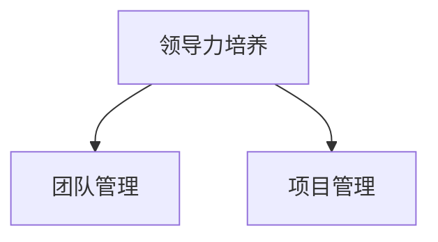

**伪代码示例：**

```python
class ManagementAbility:
    def __init__(self, leadership, team_management, project_management):
        self.leadership = leadership
        self.team_management = team_management
        self.project_management = project_management
    
    def enhance_management(self):
        # 提升管理能力
        pass
```

**LaTeX公式：**

```latex
$$
\text{管理能力提升} = \text{领导力培养} + \text{团队管理} + \text{项目管理}
$$
```

**代码实例：**

```python
# 管理能力培养方法
class ManagementAbility:
    def __init__(self, leadership, team_management, project_management):
        self.leadership = leadership
        self.team_management = team_management
        self.project_management = project_management
    
    def strategy_analysis(self):
        print("领导力培养：提升领导能力")
        print("团队管理：提升团队绩效")
        print("项目管理：提升项目管理和执行能力")
```

**项目实战：**

- **开发环境搭建**：使用项目管理工具（如JIRA）搭建一个团队协作和项目管理的环境。
- **源代码详细实现**：编写一个简单的项目管理工具，用于任务分配、进度追踪和团队协作。
- **代码解读与分析**：对项目管理工具的代码进行解读，分析其功能实现和架构设计。
- **实际案例分析和详细讲解剖析**：通过实际项目案例，分析技术管理者的管理能力和实际操作流程。

**最佳实践 tips**：

- **定期培训**：技术管理者应定期参加管理培训，提升管理理论水平。
- **实践应用**：通过实际项目，将管理理论应用于实践，提升管理能力。

#### 2.3 跨部门协作与沟通技巧

跨部门协作与沟通技巧是技术管理者的重要能力。以下是一些提升跨部门协作与沟通技巧的方法：

1. **沟通技巧**：学习有效沟通方法，提升沟通效率。
2. **跨部门合作**：培养跨部门合作意识，建立良好合作关系。
3. **冲突解决**：掌握冲突解决技巧，确保团队和谐。

**Mermaid流程图：**

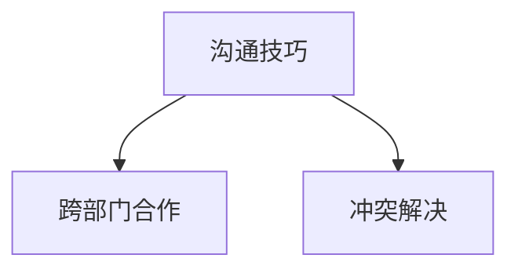

**伪代码示例：**

```python
class CollaborationAndCommunication:
    def __init__(self, communication, cross_department, conflict_resolution):
        self.communication = communication
        self.cross_department = cross_department
        self.conflict_resolution = conflict_resolution
    
    def enhance_collaboration(self):
        # 提升跨部门协作与沟通技巧
        pass
```

**LaTeX公式：**

```latex
$$
\text{跨部门协作与沟通技巧提升} = \text{沟通技巧} + \text{跨部门合作} + \text{冲突解决}
$$
```

**代码实例：**

```python
# 跨部门协作与沟通技巧
class CollaborationAndCommunication:
    def __init__(self, communication, cross_department, conflict_resolution):
        self.communication = communication
        self.cross_department = cross_department
        self.conflict_resolution = conflict_resolution
    
    def strategy_analysis(self):
        print("沟通技巧：提升沟通效率")
        print("跨部门合作：建立良好合作关系")
        print("冲突解决：确保团队和谐")
```

**项目实战：**

- **开发环境搭建**：使用敏捷开发工具（如JIRA）搭建一个跨部门协作和项目管理的平台。
- **源代码详细实现**：编写一个简单的协作工具，用于跨部门任务分配和进度追踪。
- **代码解读与分析**：对协作工具的代码进行解读，分析其功能实现和协作机制。
- **实际案例分析和详细讲解剖析**：通过实际项目案例，分析技术管理者的跨部门协作与沟通技巧。

**最佳实践 tips**：

- **主动沟通**：技术管理者应主动与其他部门沟通，确保信息透明和协作顺畅。
- **建立关系**：通过参与其他部门的会议和活动，建立良好的人际关系。

### 第3章：职业发展阶段分析

技术管理者的职业生涯可以分为初级阶段、中级阶段和高级阶段。每个阶段都有不同的职责和挑战。本章节将详细分析技术管理者的职业发展阶段，提供具体的职业发展策略。

#### 3.1 初级阶段：技术积累与团队管理

初级阶段是技术管理者职业生涯的起点，主要任务是技术积累和团队管理。

1. **技术积累**：在这个阶段，技术管理者需要掌握基础技术，熟悉业务流程，提升自身技术能力。
2. **团队管理**：技术管理者需要学会如何管理团队，包括任务分配、进度追踪和团队协作。

**Mermaid流程图：**

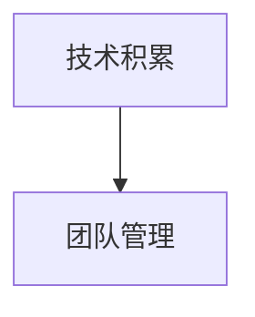

**伪代码示例：**

```python
class JuniorStage:
    def __init__(self, technology, team):
        self.technology = technology
        self.team = team
    
    def accumulate_technology(self):
        # 技术积累
        pass
    
    def manage_team(self):
        # 管理团队
        pass
```

**LaTeX公式：**

```latex
$$
\text{初级阶段职责} = \text{技术积累} + \text{团队管理}
$$
```

**代码实例：**

```python
# 初级阶段职业发展策略
class JuniorStage:
    def __init__(self, technology, team):
        self.technology = technology
        self.team = team
    
    def strategy_analysis(self):
        print("技术积累：提升技术能力")
        print("团队管理：学会管理团队")
```

**项目实战：**

- **开发环境搭建**：使用基础开发工具（如Python、Java）搭建一个用于技术学习和团队协作的开发环境。
- **源代码详细实现**：编写一个简单的业务系统，用于技术积累和实践应用。
- **代码解读与分析**：对业务系统的代码进行解读，分析其架构设计和模块功能。
- **实际案例分析和详细讲解剖析**：通过实际项目案例，分析初级阶段的技术积累和团队管理。

**最佳实践 tips**：

- **持续学习**：初级阶段的技术管理者应不断学习新技术和工具，提升自身技术能力。
- **积极参与项目**：通过参与不同项目，积累实践经验，提升团队管理能力。

#### 3.2 中级阶段：项目管理与业务拓展

中级阶段是技术管理者职业生涯的转型期，主要任务是项目管理与业务拓展。

1. **项目管理**：在这个阶段，技术管理者需要掌握项目管理方法，提升项目管理和执行能力。
2. **业务拓展**：技术管理者需要了解业务需求，推动技术解决方案的业务化，提升业务价值。

**Mermaid流程图：**

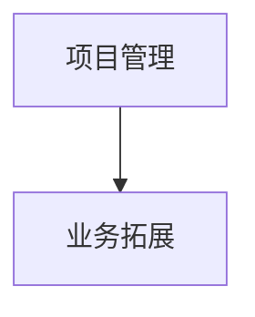

**伪代码示例：**

```python
class MiddleStage:
    def __init__(self, project, business):
        self.project = project
        self.business = business
    
    def manage_project(self):
        # 项目管理
        pass
    
    def expand_business(self):
        # 业务拓展
        pass
```

**LaTeX公式：**

```latex
$$
\text{中级阶段职责} = \text{项目管理} + \text{业务拓展}
$$
```

**代码实例：**

```python
# 中级阶段职业发展策略
class MiddleStage:
    def __init__(self, project, business):
        self.project = project
        self.business = business
    
    def strategy_analysis(self):
        print("项目管理：提升项目管理和执行能力")
        print("业务拓展：推动技术解决方案的业务化")
```

**项目实战：**

- **开发环境搭建**：使用中间件技术（如Docker、Kubernetes）搭建一个用于项目管理与业务拓展的微服务架构。
- **源代码详细实现**：编写一个简单的业务系统，用于项目管理与业务拓展的实践应用。
- **代码解读与分析**：对业务系统的代码进行解读，分析其架构设计和模块功能。
- **实际案例分析和详细讲解剖析**：通过实际项目案例，分析中级阶段的项目管理和业务拓展。

**最佳实践 tips**：

- **系统学习**：中级阶段的技术管理者应系统学习项目管理理论和方法，提升项目管理能力。
- **业务洞察**：通过深入了解业务，提升业务洞察力，推动技术解决方案的业务化。

#### 3.3 高级阶段：技术战略与领导力

高级阶段是技术管理者职业生涯的巅峰期，主要任务是技术战略制定和领导力提升。

1. **技术战略**：在这个阶段，技术管理者需要具备制定技术战略的能力，推动技术革新和业务增长。
2. **领导力提升**：技术管理者需要具备卓越的领导力，带领团队实现组织目标。

**Mermaid流程图：**

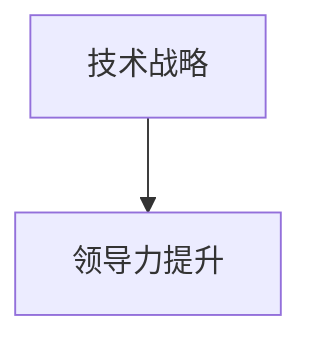

**伪代码示例：**

```python
class SeniorStage:
    def __init__(self, strategy, leadership):
        self.strategy = strategy
        self.leadership = leadership
    
    def develop_strategy(self):
        # 制定技术战略
        pass
    
    def enhance_leadership(self):
        # 提升领导力
        pass
```

**LaTeX公式：**

```latex
$$
\text{高级阶段职责} = \text{技术战略} + \text{领导力提升}
$$
```

**代码实例：**

```python
# 高级阶段职业发展策略
class SeniorStage:
    def __init__(self, strategy, leadership):
        self.strategy = strategy
        self.leadership = leadership
    
    def strategy_analysis(self):
        print("技术战略：推动技术革新和业务增长")
        print("领导力提升：带领团队实现组织目标")
```

**项目实战：**

- **开发环境搭建**：使用云计算技术（如AWS、Azure）搭建一个用于技术战略和领导力提升的云计算平台。
- **源代码详细实现**：编写一个简单的云计算应用，用于技术战略和领导力提升的实践应用。
- **代码解读与分析**：对云计算应用的代码进行解读，分析其架构设计和模块功能。
- **实际案例分析和详细讲解剖析**：通过实际项目案例，分析高级阶段的技术战略和领导力。

**最佳实践 tips**：

- **战略思考**：高级阶段的技术管理者应具备战略思考能力，从全局角度推动技术革新和业务增长。
- **领导力培养**：通过学习领导力理论和实践，提升自身领导力，带领团队实现组织目标。

### 第4章：职业规划案例分析

技术管理者的职业规划并非一帆风顺，既有成功的案例，也有失败的教训。本章节将通过成功和失败的案例，分析技术管理者的职业发展策略，提供宝贵的经验教训。

#### 4.1 成功案例分享

以下是一个成功的技术管理者职业规划案例：

- **案例背景**：张华是一名有多年软件开发经验的技术专家，他在一家互联网公司担任技术经理。张华通过持续学习和实践，成功带领团队完成了多个高难度项目。
- **职业发展策略**：
  1. **技术提升**：张华积极参与技术培训和自学，掌握了多个前沿技术，如云计算、大数据等。
  2. **团队建设**：张华注重团队建设，通过有效的沟通和激励，提升了团队的整体绩效。
  3. **项目管理**：张华系统学习了项目管理知识，通过科学的项目管理方法，确保项目按时交付。
  4. **业务拓展**：张华深入了解业务需求，推动技术解决方案的业务化，提升了公司的业务价值。

**案例分析**：

张华的成功在于他平衡了技术、团队和业务，通过持续学习、团队建设和项目管理，实现了职业发展的跃升。他的经验教训是：技术管理者的职业规划需要综合考虑技术、团队和业务，不断学习和实践，以适应快速变化的环境。

#### 4.2 失败案例反思

以下是一个失败的技术管理者职业规划案例：

- **案例背景**：李明是一名有多年项目管理经验的技术经理，他在一家传统行业公司担任技术总监。然而，由于缺乏对新技术和新业务的了解，李明在推动公司数字化转型时遭遇了失败。
- **职业发展策略**：
  1. **技术局限**：李明对新技术缺乏了解，导致在技术决策上犹豫不决。
  2. **团队冲突**：李明在团队管理上存在冲突，导致团队士气低落。
  3. **业务忽视**：李明忽视了业务需求，导致技术方案与业务目标脱节。

**案例分析**：

李明的失败在于他对技术和业务的认识不足，导致在职业规划上存在明显的短板。他的经验教训是：技术管理者需要不断学习和适应新技术，重视团队建设和业务需求，以实现职业发展的持续提升。

### 第5章：技术能力提升路径

技术能力是技术管理者的核心能力之一。本章节将详细讨论技术能力提升的路径，包括熟悉新技术趋势、深入研究关键技术、技术文档编写与分享等。

#### 5.1 熟悉新技术趋势

熟悉新技术趋势是技术管理者提升技术能力的重要步骤。以下是一些方法：

1. **关注技术社区**：通过关注技术社区（如GitHub、Stack Overflow），了解最新的技术动态和趋势。
2. **阅读技术博客**：阅读知名技术博客（如Medium、TechCrunch），了解前沿技术和应用场景。
3. **参加技术会议**：参加技术会议（如Google I/O、AWS re:Invent），与行业专家交流，拓展视野。

**Mermaid流程图：**

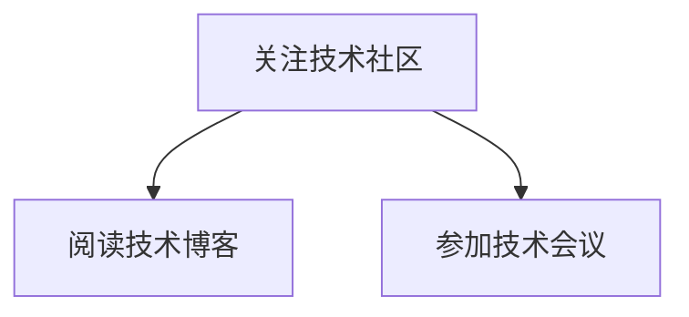

**伪代码示例：**

```python
class TechnologyTrend:
    def __init__(self, community, blog, conference):
        self.community = community
        self.blog = blog
        self.conference = conference
    
    def explore_trends(self):
        # 探索新技术趋势
        pass
```

**LaTeX公式：**

```latex
$$
\text{熟悉新技术趋势} = \text{关注技术社区} + \text{阅读技术博客} + \text{参加技术会议}
$$
```

**代码实例：**

```python
# 熟悉新技术趋势方法
class TechnologyTrend:
    def __init__(self, community, blog, conference):
        self.community = community
        self.blog = blog
        self.conference = conference
    
    def trend_analysis(self):
        print("关注技术社区：了解技术动态")
        print("阅读技术博客：学习前沿技术")
        print("参加技术会议：拓展视野")
```

**项目实战：**

- **开发环境搭建**：使用虚拟环境（如Vagrant）搭建一个用于新技术探索和学习的开发环境。
- **源代码详细实现**：编写一个简单的技术趋势分析工具，用于收集和整理技术社区和博客的内容。
- **代码解读与分析**：对技术趋势分析工具的代码进行解读，分析其功能实现和架构设计。
- **实际案例分析和详细讲解剖析**：通过实际项目案例，分析技术管理者如何熟悉新技术趋势。

**最佳实践 tips**：

- **定期总结**：技术管理者应定期总结所学的新技术和趋势，形成知识体系。
- **实践应用**：通过实际项目，将所学的新技术应用于实践，提升技术能力。

#### 5.2 深入研究关键技术

深入研究关键技术是技术管理者提升技术能力的核心步骤。以下是一些方法：

1. **专业培训**：参加专业的技术培训课程，深入学习关键技术。
2. **实践应用**：通过实际项目，将关键技术应用于实践，积累实践经验。
3. **阅读经典**：阅读关键技术领域的经典书籍，掌握核心技术原理。
4. **交流讨论**：与同行交流，讨论关键技术问题，拓展视野。

**Mermaid流程图：**

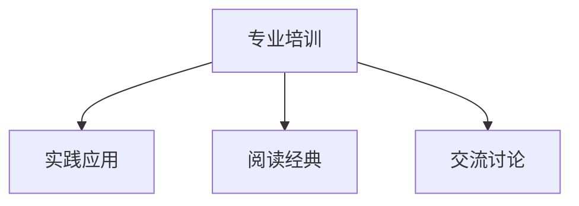

**伪代码示例：**

```python
class KeyTechnology:
    def __init__(self, training, practice, books, discussion):
        self.training = training
        self.practice = practice
        self.books = books
        self.discussion = discussion
    
    def research_technology(self):
        # 深入研究关键技术
        pass
```

**LaTeX公式：**

```latex
$$
\text{深入研究关键技术} = \text{专业培训} + \text{实践应用} + \text{阅读经典} + \text{交流讨论}
$$
```

**代码实例：**

```python
# 深入研究关键技术方法
class KeyTechnology:
    def __init__(self, training, practice, books, discussion):
        self.training = training
        self.practice = practice
        self.books = books
        self.discussion = discussion
    
    def strategy_analysis(self):
        print("专业培训：深入学习关键技术")
        print("实践应用：积累实践经验")
        print("阅读经典：掌握核心技术原理")
        print("交流讨论：拓展视野")
```

**项目实战：**

- **开发环境搭建**：使用云平台（如AWS、Azure）搭建一个用于关键技术研究的实验环境。
- **源代码详细实现**：编写一个简单的关键技术应用，用于展示核心技术原理和应用场景。
- **代码解读与分析**：对关键技术应用的代码进行解读，分析其实现原理和性能优化。
- **实际案例分析和详细讲解剖析**：通过实际项目案例，分析技术管理者如何深入研究关键技术。

**最佳实践 tips**：

- **持续学习**：技术管理者应保持对关键技术的持续学习，紧跟技术发展趋势。
- **实践验证**：通过实际项目验证关键技术，提升技术能力。

#### 5.3 技术文档编写与分享

技术文档编写与分享是技术管理者提升技术能力和团队协作的重要环节。以下是一些方法：

1. **编写高质量文档**：编写清晰、结构化的技术文档，确保团队成员易于理解和使用。
2. **知识分享**：定期组织技术分享会，分享技术心得和经验，促进团队知识积累。
3. **文档自动化**：使用文档生成工具（如Markdown、Jinja2），自动化生成技术文档。
4. **版本控制**：使用版本控制系统（如Git），确保技术文档的版本管理和更新。

**Mermaid流程图：**

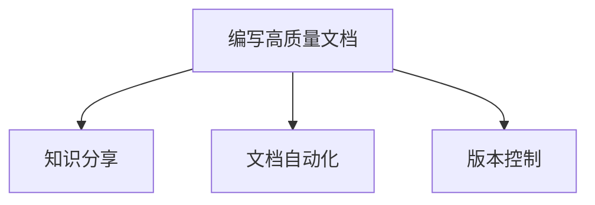

**伪代码示例：**

```python
class TechnicalDocumentation:
    def __init__(self, quality, share, automation, version_control):
        self.quality = quality
        self.share = share
        self.automation = automation
        self.version_control = version_control
    
    def write_documentation(self):
        # 编写技术文档
        pass
    
    def share_knowledge(self):
        # 分享技术知识
        pass
    
    def automate_documentation(self):
        # 自动化文档生成
        pass
    
    def manage_version(self):
        # 版本控制
        pass
```

**LaTeX公式：**

```latex
$$
\text{技术文档编写与分享} = \text{编写高质量文档} + \text{知识分享} + \text{文档自动化} + \text{版本控制}
$$
```

**代码实例：**

```python
# 技术文档编写与分享方法
class TechnicalDocumentation:
    def __init__(self, quality, share, automation, version_control):
        self.quality = quality
        self.share = share
        self.automation = automation
        self.version_control = version_control
    
    def strategy_analysis(self):
        print("编写高质量文档：确保团队成员理解和使用")
        print("知识分享：促进团队知识积累")
        print("文档自动化：提高文档生成效率")
        print("版本控制：确保文档版本更新和管理")
```

**项目实战：**

- **开发环境搭建**：使用文档生成工具（如Sphinx）搭建一个用于技术文档编写和分享的开发环境。
- **源代码详细实现**：编写一个简单的技术文档，用于展示技术原理和应用场景。
- **代码解读与分析**：对技术文档的代码进行解读，分析其编写方法和优化技巧。
- **实际案例分析和详细讲解剖析**：通过实际项目案例，分析技术管理者如何编写和分享技术文档。

**最佳实践 tips**：

- **规范文档格式**：确保技术文档的格式规范，提高可读性和易用性。
- **及时更新文档**：及时更新技术文档，确保文档内容的准确性和时效性。

### 第6章：管理技能提升方法

管理技能是技术管理者实现职业发展的关键。本章节将详细讨论管理技能提升的方法，包括项目管理方法论、团队管理与激励、领导力培养等。

#### 6.1 项目管理方法论

项目管理方法论是技术管理者提升管理技能的重要途径。以下是一些常用的项目管理方法论：

1. **敏捷开发**：通过迭代和增量方式，快速响应变化，提升项目交付效率。
2. **瀑布模型**：按照固定顺序进行项目开发，确保项目进度和质量。
3. **六西格玛**：通过统计方法，减少项目过程中的缺陷和错误。

**Mermaid流程图：**

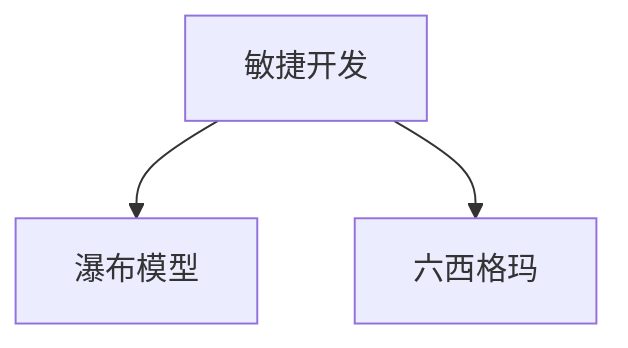

**伪代码示例：**

```python
class ProjectManagementMethodology:
    def __init__(self, agile, waterfall, six_sigma):
        self.agile = agile
        self.waterfall = waterfall
        self.six_sigma = six_sigma
    
    def manage_project(self):
        # 管理项目
        pass
```

**LaTeX公式：**

```latex
$$
\text{项目管理方法论} = \text{敏捷开发} + \text{瀑布模型} + \text{六西格玛}
$$
```

**代码实例：**

```python
# 项目管理方法论
class ProjectManagementMethodology:
    def __init__(self, agile, waterfall, six_sigma):
        self.agile = agile
        self.waterfall = waterfall
        self.six_sigma = six_sigma
    
    def methodology_analysis(self):
        print("敏捷开发：快速响应变化")
        print("瀑布模型：确保项目进度和质量")
        print("六西格玛：减少项目过程中的缺陷和错误")
```

**项目实战：**

- **开发环境搭建**：使用项目管理工具（如JIRA、Trello）搭建一个用于项目管理的方法论实践平台。
- **源代码详细实现**：编写一个简单的项目管理工具，用于展示不同项目管理方法的应用场景。
- **代码解读与分析**：对项目管理工具的代码进行解读，分析其实现原理和功能模块。
- **实际案例分析和详细讲解剖析**：通过实际项目案例，分析技术管理者如何应用项目管理方法论。

**最佳实践 tips**：

- **方法选择**：根据项目特点和需求，选择合适的项目管理方法论。
- **持续优化**：通过不断优化项目管理方法，提升项目管理和执行能力。

#### 6.2 团队管理与激励

团队管理与激励是技术管理者提升管理技能的关键。以下是一些团队管理与激励的方法：

1. **目标设定**：明确团队目标，确保团队成员明确工作方向。
2. **绩效评估**：定期进行绩效评估，激励团队成员提升绩效。
3. **团队建设**：通过团队活动，增强团队凝聚力，提升团队协作效率。

**Mermaid流程图：**

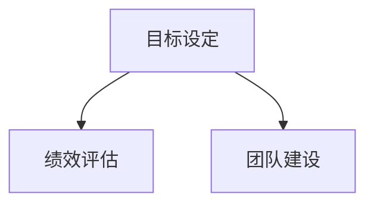

**伪代码示例：**

```python
class TeamManagement:
    def __init__(self, goal_setting, performance_evaluation, team_building):
        self.goal_setting = goal_setting
        self.performance_evaluation = performance_evaluation
        self.team_building = team_building
    
    def manage_team(self):
        # 管理团队
        pass
    
    def motivate_team(self):
        # 激励团队
        pass
```

**LaTeX公式：**

```latex
$$
\text{团队管理与激励} = \text{目标设定} + \text{绩效评估} + \text{团队建设}
$$
```

**代码实例：**

```python
# 团队管理与激励方法
class TeamManagement:
    def __init__(self, goal_setting, performance_evaluation, team_building):
        self.goal_setting = goal_setting
        self.performance_evaluation = performance_evaluation
        self.team_building = team_building
    
    def strategy_analysis(self):
        print("目标设定：明确工作方向")
        print("绩效评估：激励团队成员提升绩效")
        print("团队建设：增强团队凝聚力")
```

**项目实战：**

- **开发环境搭建**：使用团队协作工具（如Slack、Trello）搭建一个用于团队管理和激励的平台。
- **源代码详细实现**：编写一个简单的团队管理工具，用于目标设定、绩效评估和团队建设。
- **代码解读与分析**：对团队管理工具的代码进行解读，分析其功能实现和协作机制。
- **实际案例分析和详细讲解剖析**：通过实际项目案例，分析技术管理者如何进行团队管理和激励。

**最佳实践 tips**：

- **明确目标**：技术管理者应明确团队目标，确保团队成员明确工作方向。
- **激励创新**：通过激励措施，鼓励团队成员创新和进步。

#### 6.3 领导力培养

领导力是技术管理者实现职业发展的关键能力。以下是一些领导力培养的方法：

1. **自我反思**：通过自我反思，了解自身优势和不足，提升自我认知。
2. **领导力培训**：参加领导力培训，学习领导力理论和实践方法。
3. **榜样学习**：学习优秀领导者的领导风格和成功经验，借鉴并应用到实际工作中。
4. **实践锻炼**：通过实际项目和管理实践，锻炼领导力。

**Mermaid流程图：**

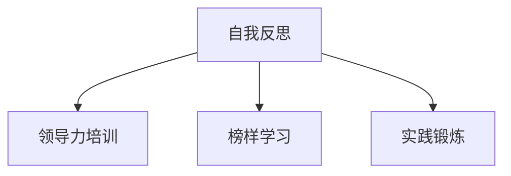

**伪代码示例：**

```python
class LeadershipDevelopment:
    def __init__(self, self_reflection, training, role_model, practice):
        self.self_reflection = self_reflection
        self.training = training
        self.role_model = role_model
        self.practice = practice
    
    def develop_leadership(self):
        # 培养领导力
        pass
```

**LaTeX公式：**

```latex
$$
\text{领导力培养} = \text{自我反思} + \text{领导力培训} + \text{榜样学习} + \text{实践锻炼}
$$
```

**代码实例：**

```python
# 领导力培养方法
class LeadershipDevelopment:
    def __init__(self, self_reflection, training, role_model, practice):
        self.self_reflection = self_reflection
        self.training = training
        self.role_model = role_model
        self.practice = practice
    
    def strategy_analysis(self):
        print("自我反思：提升自我认知")
        print("领导力培训：学习领导力理论和实践方法")
        print("榜样学习：借鉴成功经验")
        print("实践锻炼：锻炼领导力")
```

**项目实战：**

- **开发环境搭建**：使用领导力发展工具（如Leadership Circle）搭建一个用于领导力培养和反思的实践平台。
- **源代码详细实现**：编写一个简单的领导力发展工具，用于自我反思和领导力训练。
- **代码解读与分析**：对领导力发展工具的代码进行解读，分析其功能实现和模块设计。
- **实际案例分析和详细讲解剖析**：通过实际项目案例，分析技术管理者如何培养领导力。

**最佳实践 tips**：

- **持续反思**：技术管理者应定期进行自我反思，了解自身领导力水平和成长空间。
- **理论与实践结合**：将领导力学习与实践相结合，提升领导力。

### 第7章：跨行业职业发展

跨行业职业发展是技术管理者提升自身竞争力的有效途径。本章节将探讨跨行业职业发展的机会、挑战和策略。

#### 7.1 从技术到业务转型的路径

从技术到业务转型的路径是技术管理者跨行业发展的常见选择。以下是一些转型路径：

1. **技术顾问**：担任技术顾问，为业务团队提供技术支持和解决方案。
2. **业务分析师**：通过技术背景，深入业务，担任业务分析师，推动业务发展。
3. **产品经理**：结合技术和管理经验，转型成为产品经理，负责产品规划和设计。

**Mermaid流程图：**

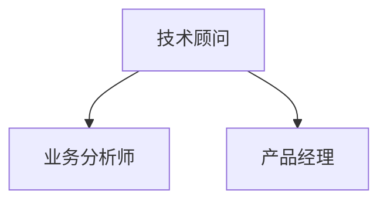

**伪代码示例：**

```python
class TechnologyToBusiness:
    def __init__(self, advisor, analyst, product_manager):
        self.advisor = advisor
        self.analyst = analyst
        self.product_manager = product_manager
    
    def transform_role(self):
        # 技术到业务转型
        pass
```

**LaTeX公式：**

```latex
$$
\text{技术到业务转型路径} = \text{技术顾问} + \text{业务分析师} + \text{产品经理}
$$
```

**代码实例：**

```python
# 技术到业务转型路径
class TechnologyToBusiness:
    def __init__(self, advisor, analyst, product_manager):
        self.advisor = advisor
        self.analyst = analyst
        self.product_manager = product_manager
    
    def strategy_analysis(self):
        print("技术顾问：为业务团队提供技术支持")
        print("业务分析师：深入业务，推动业务发展")
        print("产品经理：结合技术和管理经验，负责产品规划和设计")
```

**项目实战：**

- **开发环境搭建**：使用业务分析工具（如Balsamiq、Axure）搭建一个用于技术到业务转型的实践平台。
- **源代码详细实现**：编写一个简单的业务分析工具，用于展示技术到业务转型的实际应用。
- **代码解读与分析**：对业务分析工具的代码进行解读，分析其功能实现和业务流程。
- **实际案例分析和详细讲解剖析**：通过实际项目案例，分析技术管理者如何从技术到业务转型。

**最佳实践 tips**：

- **深化业务理解**：技术管理者应不断深化对业务的了解，提升业务洞察力。
- **跨学科学习**：通过跨学科学习，拓宽知识面，提升跨行业职业发展能力。

#### 7.2 跨行业就业机会与挑战

跨行业就业为技术管理者提供了丰富的机会，同时也带来了挑战。以下是一些跨行业就业机会和挑战：

**跨行业就业机会**：

1. **金融科技**：技术管理者在金融科技领域有广泛的应用，如区块链、人工智能等。
2. **医疗健康**：随着医疗信息化的发展，技术管理者在医疗健康领域有巨大的就业机会。
3. **零售电商**：零售电商行业对技术人才的需求持续增长，技术管理者有机会参与电商平台建设和优化。

**跨行业就业挑战**：

1. **行业门槛**：不同行业的技术标准和应用场景不同，技术管理者需要适应不同行业的专业要求。
2. **职业转换**：从技术岗位转向业务岗位，技术管理者需要适应新的工作内容和角色。

**Mermaid流程图：**

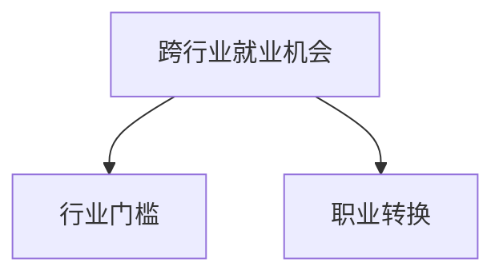

**伪代码示例：**

```python
class CrossIndustryOpportunities:
    def __init__(self, opportunities, barriers, transition):
        self.opportunities = opportunities
        self.barriers = barriers
        self.transition = transition
    
    def explore_opportunities(self):
        # 探索跨行业就业机会
        pass
    
    def address_challenges(self):
        # 应对跨行业就业挑战
        pass
```

**LaTeX公式：**

```latex
$$
\text{跨行业就业机会与挑战} = \text{跨行业就业机会} + \text{行业门槛} + \text{职业转换}
$$
```

**代码实例：**

```python
# 跨行业就业机会与挑战
class CrossIndustryOpportunities:
    def __init__(self, opportunities, barriers, transition):
        self.opportunities = opportunities
        self.barriers = barriers
        self.transition = transition
    
    def analysis(self):
        print("跨行业就业机会：金融科技、医疗健康、零售电商")
        print("行业门槛：适应不同行业的专业要求")
        print("职业转换：适应新的工作内容和角色")
```

**项目实战：**

- **开发环境搭建**：使用跨行业工具（如Tableau、Power BI）搭建一个用于跨行业就业机会和挑战分析的实践平台。
- **源代码详细实现**：编写一个简单的数据分析工具，用于展示跨行业就业机会和挑战的实际应用。
- **代码解读与分析**：对数据分析工具的代码进行解读，分析其功能实现和数据可视化。
- **实际案例分析和详细讲解剖析**：通过实际项目案例，分析技术管理者如何应对跨行业就业的挑战。

**最佳实践 tips**：

- **深化行业知识**：技术管理者应不断深化对目标行业的了解，提升行业洞察力。
- **跨学科学习**：通过跨学科学习，提升自身的综合素质，增强跨行业竞争力。

#### 7.3 跨行业职业发展的策略

跨行业职业发展需要明确的策略和持续的努力。以下是一些跨行业职业发展的策略：

1. **行业调研**：深入了解目标行业的技术发展趋势、市场需求和就业机会。
2. **技能提升**：根据目标行业的专业要求，提升相关技能，增强竞争力。
3. **人脉拓展**：通过参加行业活动、加入专业社群，拓展人脉，获取职业发展机会。
4. **实践经验**：通过实际项目，积累跨行业的实践经验，提升职业素质。

**Mermaid流程图：**

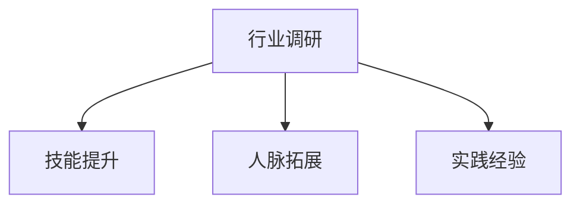

**伪代码示例：**

```python
class CrossIndustryCareerDevelopment:
    def __init__(self, research, skill Enhancement, network_expansion, practice):
        self.research = research
        self.skill_enhancement = skill_enhancement
        self.network_expansion = network_expansion
        self.practice = practice
    
    def develop_career(self):
        # 跨行业职业发展
        pass
```

**LaTeX公式：**

```latex
$$
\text{跨行业职业发展策略} = \text{行业调研} + \text{技能提升} + \text{人脉拓展} + \text{实践经验}
$$
```

**代码实例：**

```python
# 跨行业职业发展策略
class CrossIndustryCareerDevelopment:
    def __init__(self, research, skill_enhancement, network_expansion, practice):
        self.research = research
        self.skill_enhancement = skill_enhancement
        self.network_expansion = network_expansion
        self.practice = practice
    
    def strategy_analysis(self):
        print("行业调研：深入了解目标行业")
        print("技能提升：提升相关技能")
        print("人脉拓展：拓展人脉")
        print("实践经验：积累跨行业经验")
```

**项目实战：**

- **开发环境搭建**：使用跨行业工具（如AI工具、数据分析工具）搭建一个用于跨行业职业发展实践的实验环境。
- **源代码详细实现**：编写一个简单的跨行业应用，用于展示跨行业职业发展的实际应用。
- **代码解读与分析**：对跨行业应用的代码进行解读，分析其实现原理和模块功能。
- **实际案例分析和详细讲解剖析**：通过实际项目案例，分析技术管理者如何规划跨行业职业发展。

**最佳实践 tips**：

- **系统学习**：技术管理者应系统学习跨行业知识，提升综合素质。
- **实践经验**：通过实际项目，积累跨行业的实践经验，提升职业素质。

### 第8章：职业发展资源与规划

职业发展资源与规划是技术管理者实现职业发展的关键。本章节将讨论职业发展资源，包括在线学习平台、专业社群与论坛，以及职业发展工具，并提供个人职业规划实践的方法。

#### 8.1 职业发展资源介绍

**在线学习平台**：在线学习平台提供了丰富的课程资源，技术管理者可以通过这些平台学习新技术、新工具，提升自身技能。例如，Coursera、Udemy、edX等平台提供了各种专业课程，涵盖计算机科学、数据科学、人工智能等领域。

**专业社群与论坛**：专业社群和论坛是技术管理者交流经验、分享知识的场所。例如，GitHub、Stack Overflow、Reddit等平台，技术管理者可以参与讨论，解决技术问题，获取行业动态。

**职业发展工具**：职业发展工具帮助技术管理者规划职业发展，包括简历编写工具、面试准备工具等。例如，LinkedIn、Indeed等平台，提供了职位搜索和简历管理功能，帮助技术管理者找到合适的职位。

**Mermaid流程图：**

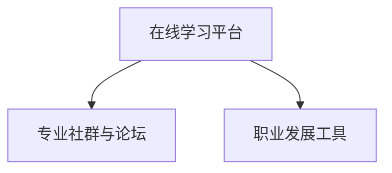

**伪代码示例：**

```python
class CareerDevelopmentResources:
    def __init__(self, learning_platform, professional_community, career_tools):
        self.learning_platform = learning_platform
        self.professional_community = professional_community
        self.career_tools = career_tools
    
    def access_resources(self):
        # 访问职业发展资源
        pass
```

**LaTeX公式：**

```latex
$$
\text{职业发展资源} = \text{在线学习平台} + \text{专业社群与论坛} + \text{职业发展工具}
$$
```

**代码实例：**

```python
# 职业发展资源介绍
class CareerDevelopmentResources:
    def __init__(self, learning_platform, professional_community, career_tools):
        self.learning_platform = learning_platform
        self.professional_community = professional_community
        self.career_tools = career_tools
    
    def resource_analysis(self):
        print("在线学习平台：学习新技术、新工具")
        print("专业社群与论坛：交流经验、分享知识")
        print("职业发展工具：规划职业发展，简历管理")
```

#### 8.2 个人职业规划实践

个人职业规划实践是技术管理者实现职业发展的关键步骤。以下是一些个人职业规划实践的方法：

1. **目标设定**：明确个人职业目标，包括短期和长期目标，制定实现目标的具体计划。
2. **技能评估**：评估自身技能和知识，了解自己的优势和不足，制定提升计划。
3. **学习计划**：根据目标和技能评估结果，制定学习计划，包括学习内容和学习时间。
4. **实践机会**：通过实际项目和工作实践，提升自身技能和经验。
5. **反思与调整**：定期反思职业发展过程，根据实际情况调整职业规划。

**Mermaid流程图：**

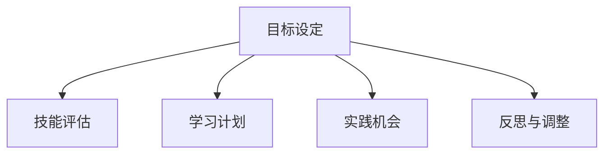

**伪代码示例：**

```python
class PersonalCareerPlanning:
    def __init__(self, goal_setting, skill_evaluation, learning_plan, practice_opportunity, reflection_adjustment):
        self.goal_setting = goal_setting
        self.skill_evaluation = skill_evaluation
        self.learning_plan = learning_plan
        self.practice_opportunity = practice_opportunity
        self.reflection_adjustment = reflection_adjustment
    
    def plan_career(self):
        # 制定个人职业规划
        pass
    
    def execute_plan(self):
        # 实施职业规划
        pass
    
    def reflect_and_adjust(self):
        # 反思并调整职业规划
        pass
```

**LaTeX公式：**

```latex
$$
\text{个人职业规划实践} = \text{目标设定} + \text{技能评估} + \text{学习计划} + \text{实践机会} + \text{反思与调整}
$$
```

**代码实例：**

```python
# 个人职业规划实践
class PersonalCareerPlanning:
    def __init__(self, goal_setting, skill_evaluation, learning_plan, practice_opportunity, reflection_adjustment):
        self.goal_setting = goal_setting
        self.skill_evaluation = skill_evaluation
        self.learning_plan = learning_plan
        self.practice_opportunity = practice_opportunity
        self.reflection_adjustment = reflection_adjustment
    
    def practice_analysis(self):
        print("目标设定：明确职业目标")
        print("技能评估：了解自身优势和不足")
        print("学习计划：制定学习内容和时间")
        print("实践机会：提升技能和经验")
        print("反思与调整：根据实际情况调整规划")
```

**项目实战：**

- **开发环境搭建**：使用项目管理工具（如JIRA、Trello）搭建一个用于个人职业规划实践的平台。
- **源代码详细实现**：编写一个简单的职业规划工具，用于设定目标、评估技能、制定学习计划和反思调整。
- **代码解读与分析**：对职业规划工具的代码进行解读，分析其功能实现和模块设计。
- **实际案例分析和详细讲解剖析**：通过实际项目案例，分析技术管理者如何实践个人职业规划。

**最佳实践 tips**：

- **目标明确**：技术管理者应明确个人职业目标，制定具体可行的计划。
- **持续学习**：通过不断学习和实践，提升自身技能和知识。
- **反思调整**：定期反思职业发展过程，根据实际情况调整职业规划。

### 第9章：职业规划调整策略

在技术管理者的职业生涯中，市场环境、技术趋势和个人发展需求都可能发生变化，这就需要技术管理者能够灵活调整职业规划。本章节将讨论职业规划调整的策略，包括职业目标的重新设定、技能更新的方法以及适应环境变化的能力。

#### 9.1 职业目标设定

职业目标的设定是职业规划的核心。技术管理者应根据市场环境、个人兴趣和发展潜力，设定明确的职业目标。以下是一些职业目标设定的策略：

1. **短期目标**：设定短期目标，如提升某一技术技能、完成特定项目等，以确保职业规划的阶段性实现。
2. **长期目标**：设定长期目标，如成为技术团队领导、担任高级技术职位等，以指导职业发展的长远方向。
3. **动态调整**：根据市场变化和个人发展情况，定期调整职业目标，确保目标的实时性和可实现性。

**Mermaid流程图：**

```mermaid
graph TD
    A[短期目标] --> B[长期目标]
    A --> C[动态调整]
```

**伪代码示例：**

```python
class CareerGoalSetting:
    def __init__(self, short_term_goals, long_term_goals, dynamic_adjustment):
        self.short_term_goals = short_term_goals
        self.long_term_goals = long_term_goals
        self.dynamic_adjustment = dynamic_adjustment
    
    def set_goals(self):
        # 设定职业目标
        pass
    
    def adjust_goals(self):
        # 调整职业目标
        pass
```

**LaTeX公式：**

```latex
$$
\text{职业目标设定} = \text{短期目标} + \text{长期目标} + \text{动态调整}
$$
```

**代码实例：**

```python
# 职业目标设定策略
class CareerGoalSetting:
    def __init__(self, short_term_goals, long_term_goals, dynamic_adjustment):
        self.short_term_goals = short_term_goals
        self.long_term_goals = long_term_goals
        self.dynamic_adjustment = dynamic_adjustment
    
    def goal_setting_analysis(self):
        print("短期目标：提升阶段性实现")
        print("长期目标：指导长远发展")
        print("动态调整：确保目标实时性和可实现性")
```

#### 9.2 技能更新策略

随着技术的不断进步，技术管理者需要不断更新自己的技能，以保持竞争力。以下是一些技能更新的策略：

1. **学习新技术**：关注行业动态，学习新的技术和工具，如云计算、人工智能、区块链等。
2. **参加培训**：参加专业培训课程，系统学习新技术和最佳实践，提升自身能力。
3. **实践应用**：通过实际项目，将所学新技术应用于实践，积累经验，提升技能。
4. **专业认证**：获得专业认证，如PMP、CISSP、AWS Certified等，提升职业资质。

**Mermaid流程图：**

```mermaid
graph TD
    A[学习新技术] --> B[参加培训]
    A --> C[实践应用]
    A --> D[专业认证]
```

**伪代码示例：**

```python
class SkillUpdate:
    def __init__(self, learn_new_technology, attend_training, practice, professional_certification):
        self.learn_new_technology = learn_new_technology
        self.attend_training = attend_training
        self.practice = practice
        self.professional_certification = professional_certification
    
    def update_skills(self):
        # 更新技能
        pass
```

**LaTeX公式：**

```latex
$$
\text{技能更新策略} = \text{学习新技术} + \text{参加培训} + \text{实践应用} + \text{专业认证}
$$
```

**代码实例：**

```python
# 技能更新策略
class SkillUpdate:
    def __init__(self, learn_new_technology, attend_training, practice, professional_certification):
        self.learn_new_technology = learn_new_technology
        self.attend_training = attend_training
        self.practice = practice
        self.professional_certification = professional_certification
    
    def strategy_analysis(self):
        print("学习新技术：保持技术竞争力")
        print("参加培训：系统学习新技术和最佳实践")
        print("实践应用：积累实践经验")
        print("专业认证：提升职业资质")
```

#### 9.3 适应环境变化的能力

在快速变化的市场和技术环境中，技术管理者需要具备适应环境变化的能力。以下是一些适应环境变化的策略：

1. **灵活应变**：在面对市场和技术变化时，能够快速调整策略，适应新环境。
2. **持续学习**：保持对新技术、新工具的学习，不断提升自身素质，适应环境变化。
3. **团队协作**：与团队成员紧密合作，共同应对环境变化，提升团队整体适应能力。
4. **风险管理**：了解风险管理方法，提前识别和应对潜在风险，降低环境变化带来的影响。

**Mermaid流程图：**

```mermaid
graph TD
    A[灵活应变] --> B[持续学习]
    A --> C[团队协作]
    A --> D[风险管理]
```

**伪代码示例：**

```python
class AdaptToChange:
    def __init__(self, adaptability, continuous_learning, team Collaboration, risk_management):
        self.adaptability = adaptability
        self.continuous_learning = continuous_learning
        self.team_Collaboration = team_Collaboration
        self.risk_management = risk_management
    
    def adapt_environment(self):
        # 适应环境变化
        pass
```

**LaTeX公式：**

```latex
$$
\text{适应环境变化的能力} = \text{灵活应变} + \text{持续学习} + \text{团队协作} + \text{风险管理}
$$
```

**代码实例：**

```python
# 适应环境变化的能力
class AdaptToChange:
    def __init__(self, adaptability, continuous_learning, team_Collaboration, risk_management):
        self.adaptability = adaptability
        self.continuous_learning = continuous_learning
        self.team_Collaboration = team_Collaboration
        self.risk_management = risk_management
    
    def strategy_analysis(self):
        print("灵活应变：快速调整策略")
        print("持续学习：提升自身素质")
        print("团队协作：共同应对环境变化")
        print("风险管理：降低风险影响")
```

**项目实战：**

- **开发环境搭建**：使用敏捷开发工具（如JIRA、Trello）搭建一个用于适应环境变化的实践平台。
- **源代码详细实现**：编写一个简单的环境适应工具，用于展示适应环境变化的方法和实践。
- **代码解读与分析**：对环境适应工具的代码进行解读，分析其实现原理和功能模块。
- **实际案例分析和详细讲解剖析**：通过实际项目案例，分析技术管理者如何适应环境变化。

**最佳实践 tips**：

- **保持灵活**：技术管理者应保持灵活，快速适应市场和技术变化。
- **持续学习**：通过持续学习，不断提升自身素质，增强适应能力。

### 结论

技术管理者的职业发展规划是一项复杂而系统的工程。本文从角色与责任、职业发展路径、核心能力提升、跨行业职业发展、职业发展资源与规划等方面，提供了全面的指导和建议。通过本文的探讨，技术管理者可以更好地规划自己的职业生涯，不断提升自身素质，实现职业发展的长期目标。

### 作者信息

作者：AI天才研究院/AI Genius Institute & 禅与计算机程序设计艺术 /Zen And The Art of Computer Programming

---

### 附录

**附录A：技术管理者的角色与责任**

- **角色分析**：技术推动者、团队领导者、项目管理者、业务合作伙伴。
- **责任解读**：技术责任、团队责任、项目责任、业务责任。
- **融合重要性**：技术创新与团队协作、项目执行与业务目标、跨部门合作与资源整合。

**附录B：技术管理者的核心能力**

- **技术能力提升策略**：持续学习、实践应用、交流分享。
- **管理能力培养方法**：领导力培养、团队管理、项目管理。
- **跨部门协作与沟通技巧**：沟通技巧、跨部门合作、冲突解决。

**附录C：职业发展阶段分析**

- **初级阶段**：技术积累与团队管理。
- **中级阶段**：项目管理与业务拓展。
- **高级阶段**：技术战略与领导力提升。

**附录D：职业规划案例分析**

- **成功案例**：通过持续学习、团队建设和项目管理，实现职业发展的跃升。
- **失败案例**：由于对新技术和新业务的认识不足，导致职业规划失败。

**附录E：技术能力提升路径**

- **熟悉新技术趋势**：关注技术社区、阅读技术博客、参加技术会议。
- **深入研究关键技术**：专业培训、实践应用、阅读经典、交流讨论。
- **技术文档编写与分享**：编写高质量文档、知识分享、文档自动化、版本控制。

**附录F：管理技能提升方法**

- **项目管理方法论**：敏捷开发、瀑布模型、六西格玛。
- **团队管理与激励**：目标设定、绩效评估、团队建设。
- **领导力培养**：自我反思、领导力培训、榜样学习、实践锻炼。

**附录G：跨行业职业发展**

- **从技术到业务转型的路径**：技术顾问、业务分析师、产品经理。
- **跨行业就业机会与挑战**：金融科技、医疗健康、零售电商。
- **跨行业职业发展的策略**：行业调研、技能提升、人脉拓展、实践经验。

**附录H：职业发展资源与规划**

- **职业发展资源**：在线学习平台、专业社群与论坛、职业发展工具。
- **个人职业规划实践**：目标设定、技能评估、学习计划、实践机会、反思与调整。

**附录I：职业规划调整策略**

- **职业目标设定**：短期目标、长期目标、动态调整。
- **技能更新策略**：学习新技术、参加培训、实践应用、专业认证。
- **适应环境变化的能力**：灵活应变、持续学习、团队协作、风险管理。

---

### 结语

技术管理者的职业发展规划需要持续的努力和不断的反思。通过本文的探讨，希望技术管理者能够更好地规划自己的职业生涯，不断提升自身素质，实现职业发展的长期目标。让我们共同努力，迈向技术管理的辉煌未来。

