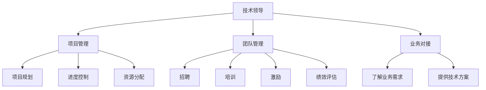
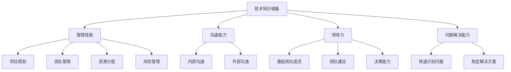
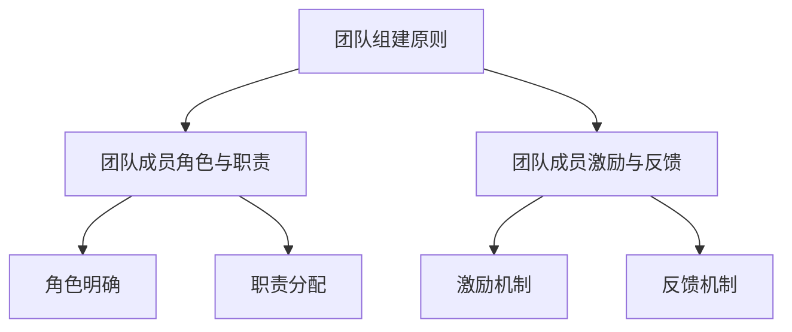
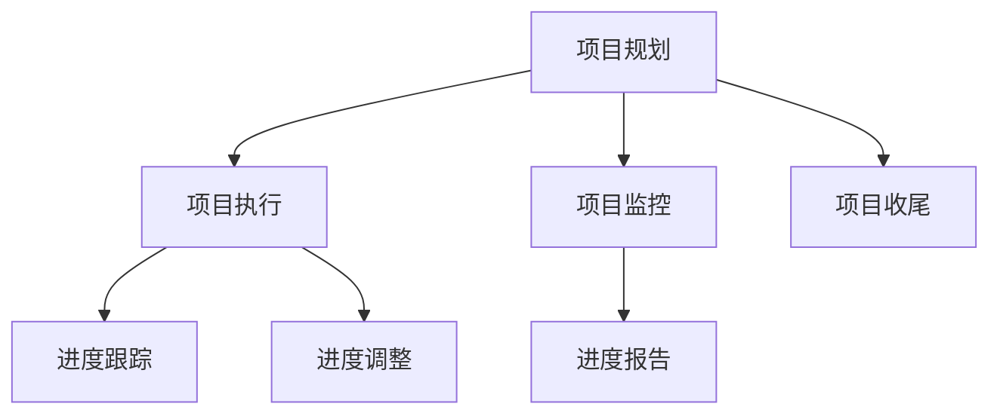
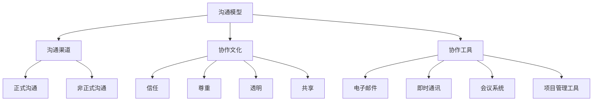
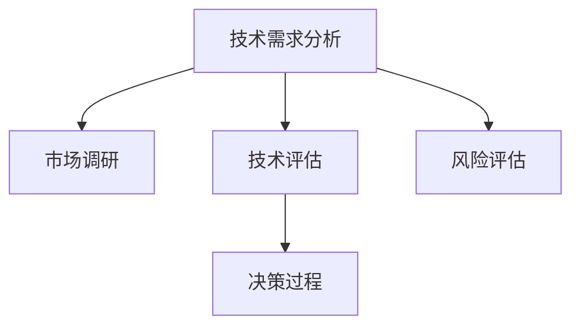
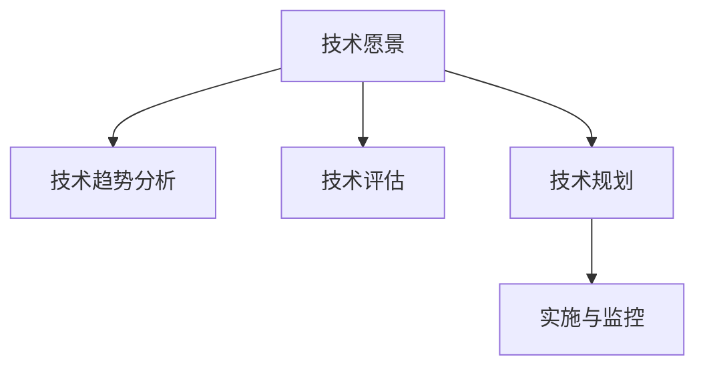
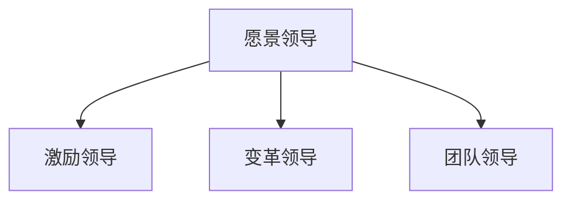
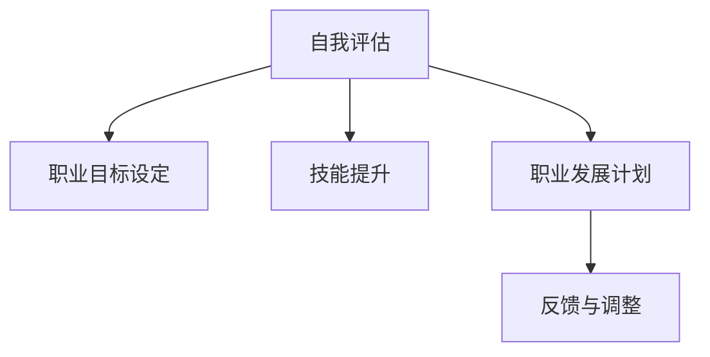

                 

### 文章标题

《技术管理者的职业成长路径》

### 关键词

技术管理者、职业成长、团队管理、项目管理、技术决策、领导力

### 摘要

本文旨在探讨技术管理者的职业成长路径，从入门到高级阶段，详细分析了技术管理者的角色与职责、基本素质与技能、团队管理与协作、技术决策与战略规划、领导力与职业发展等方面。通过深入剖析这些核心内容，本文为技术管理者提供了清晰的发展方向和实用的策略，帮助他们在职业生涯中取得成功。文章结构紧凑，逻辑清晰，适合广大IT从业者和相关领域的研究者阅读参考。|im_sep|>

### 引言

在当今信息化时代，技术已成为推动社会发展和经济增长的重要力量。随着技术的不断进步和业务场景的日益复杂，技术管理者的角色日益凸显。作为连接技术团队与业务部门的桥梁，技术管理者不仅需要具备深厚的专业技能，还需要具备出色的管理能力和领导力。本文将从多个角度探讨技术管理者的职业成长路径，旨在为从业者和研究者提供有益的指导和启示。

技术管理者的职业成长路径可以大致分为以下几个阶段：入门与基础、团队管理与协作、技术决策与战略规划、领导力与职业发展。每个阶段都有其独特的核心内容和技能要求，需要技术管理者逐步掌握。本文将依次深入分析这些阶段，帮助读者理解技术管理者的成长路径，并为他们在职业生涯中提供实用的策略和建议。

### 第一部分：入门与基础

#### 第1章：技术管理者的角色与职责

**背景介绍**

技术管理者在IT行业中的角色日益重要，他们不仅要精通技术，还要具备出色的管理能力和领导力。作为团队的核心，技术管理者需要承担起多重职责，确保团队高效运作，技术项目成功交付。

**核心概念与联系**

技术管理者的角色与职责可以分为以下几个方面：

1. **技术领导**：技术管理者需要具备深厚的技术背景，引领团队进行技术研究和创新，确保团队在技术领域始终保持领先地位。
2. **项目管理**：技术管理者负责项目规划、进度控制、资源分配等，确保项目按时、按质量完成。
3. **团队管理**：技术管理者需要组建和管理团队，包括招聘、培训、激励和绩效评估等方面。
4. **业务对接**：技术管理者需要与业务部门紧密合作，了解业务需求，确保技术方案能够满足业务目标。

这些职责之间存在紧密的联系，共同构成了技术管理者的工作内容。以下是一个简化的 Mermaid 流程图，展示了这些职责之间的关系：



**核心算法原理讲解**

在技术管理者的职责中，项目管理是一个重要的环节。以下是一个简单的项目管理伪代码，用于描述项目规划、进度控制和资源分配的过程：

```plaintext
// 项目管理伪代码

// 项目规划
function planProject(projectDetails) {
    // 确定项目目标、范围、预算和时间表
    // 分解项目任务，制定工作计划
}

// 进度控制
function controlProgress(projectStatus) {
    // 检查项目进度，识别潜在风险
    // 采取纠正措施，确保项目按时完成
}

// 资源分配
function allocateResources(projectResources) {
    // 确定项目所需的资源，如人力、设备、资金等
    // 分配资源，确保资源高效利用
}
```

**数学模型和公式**

项目管理中的许多决策都可以用数学模型和公式来描述。以下是一个简单的成本效益分析模型，用于评估项目投资的合理性：

$$
\text{ROI} = \frac{\text{项目收益}}{\text{项目成本}} \times 100\%
$$

**举例说明**

假设一个技术项目需要投资100万元，预期收益为200万元，则该项目的投资回报率为：

$$
\text{ROI} = \frac{200}{100} \times 100\% = 200\%
$$

这意味着该项目具有很高的投资吸引力。

**项目实战**

在实际项目中，技术管理者需要根据项目需求制定详细的规划，确保项目按计划进行。以下是一个简单的项目计划表格，展示了项目规划、进度控制和资源分配的细节：

| 项目阶段 | 工作内容 | 预计时间（天） | 资源需求 |
| --- | --- | --- | --- |
| 项目规划 | 确定项目目标、范围、预算和时间表 | 7天 | 项目经理、开发团队、测试团队 |
| 项目开发 | 完成项目核心功能的开发 | 30天 | 开发团队 |
| 项目测试 | 对项目进行全面的测试，确保质量 | 15天 | 测试团队 |
| 项目部署 | 将项目部署到生产环境，进行上线 | 5天 | 系统管理员、运维团队 |

**最佳实践 tips**

- 在项目规划阶段，要充分考虑潜在的风险和挑战，制定详细的应对策略。
- 在进度控制过程中，要定期检查项目进度，及时调整计划，确保项目按时完成。
- 在资源分配过程中，要合理分配资源，确保关键任务得到充分支持。

**小结**

技术管理者的角色与职责是技术管理的基础。通过深入理解这些职责，技术管理者可以更好地规划和管理项目，确保团队高效运作。在下一个章节中，我们将探讨技术管理者的基本素质与技能，为技术管理者的职业成长奠定坚实的基础。

#### 第2章：技术管理者的基本素质与技能

**背景介绍**

技术管理者的角色不仅要求他们具备深厚的专业知识，还要求他们具备一系列管理技能和软技能。这些素质和技能是技术管理者能够成功管理和领导团队的关键。在技术快速发展的今天，技术管理者不仅需要掌握前沿技术，还需要具备快速学习和适应变化的能力。

**核心概念与联系**

技术管理者的基本素质与技能可以分为以下几个方面：

1. **技术知识储备**：技术管理者需要具备广泛的技术知识，包括编程语言、数据库、网络、操作系统等。
2. **管理技能**：技术管理者需要掌握项目规划、团队管理、资源分配、风险管理等管理技能。
3. **沟通能力**：技术管理者需要具备出色的沟通能力，能够有效地与团队成员、上级领导和客户进行沟通。
4. **领导力**：技术管理者需要具备领导力，能够激励和引导团队成员，共同实现目标。
5. **问题解决能力**：技术管理者需要具备快速识别和解决问题的能力，能够在面对复杂问题时做出有效的决策。

以下是一个简化的 Mermaid 流程图，展示了这些素质和技能之间的关系：



**核心算法原理讲解**

在技术管理者的技能中，问题解决能力是一个关键因素。以下是一个简单的问题解决算法，用于描述如何快速识别和解决问题：

```plaintext
// 问题解决算法伪代码

// 输入：问题描述、可用的资源、时间限制
// 输出：解决方案

function solveProblem(problemDescription, availableResources, timeLimit) {
    // 收集相关信息
    // 评估问题的复杂性和优先级
    // 制定解决方案
    // 实施解决方案
    // 检查解决方案的有效性
}
```

**数学模型和公式**

在团队管理中，资源分配是一个关键环节。以下是一个简单的线性规划模型，用于优化资源分配：

$$
\text{最大化} \ \ Z = c_1x_1 + c_2x_2 + \ldots + c_nx_n
$$

$$
\text{约束条件} \ \ Ax \leq b
$$

其中，\( x \) 是资源分配向量，\( c \) 是资源分配的目标函数系数，\( A \) 和 \( b \) 是约束条件矩阵。

**举例说明**

假设一个团队有10名成员，需要完成5个任务。每个任务的优先级和所需时间如下表所示：

| 任务 | 优先级 | 时间（天） |
| --- | --- | --- |
| A | 高 | 5 |
| B | 中 | 3 |
| C | 低 | 2 |
| D | 中 | 4 |
| E | 低 | 6 |

根据线性规划模型，我们需要在10名成员和5个任务之间进行优化分配，确保高优先级任务优先完成。以下是一个简化的解决方案：

- 任务A：分配3名成员，完成时间3天
- 任务B：分配2名成员，完成时间3天
- 任务C：分配1名成员，完成时间2天
- 任务D：分配2名成员，完成时间4天
- 任务E：剩余1名成员，完成时间6天

**项目实战**

在实际项目中，技术管理者需要根据项目需求和技术背景，制定详细的管理计划。以下是一个简单的项目计划表格，展示了技术管理者的角色和技能在项目中的具体应用：

| 项目阶段 | 技术管理者角色 | 技术管理者技能 |
| --- | --- | --- |
| 项目规划 | 项目规划者 | 技术知识储备、项目管理、资源分配 |
| 项目开发 | 技术领导 | 编程技能、团队管理、沟通能力 |
| 项目测试 | 测试协调者 | 质量控制、问题解决、沟通能力 |
| 项目部署 | 部署管理者 | 系统运维、项目管理、领导力 |

**最佳实践 tips**

- 在项目规划阶段，要充分考虑团队成员的技术背景和技能，合理分配任务。
- 在项目开发阶段，要定期与技术团队沟通，确保项目按计划进行。
- 在项目测试阶段，要制定详细的测试计划，确保项目质量。
- 在项目部署阶段，要确保系统稳定可靠，为后续运营做好准备。

**小结**

技术管理者的基本素质与技能是职业成功的基础。通过深入掌握这些素质和技能，技术管理者可以更好地应对各种挑战，带领团队实现目标。在下一个章节中，我们将探讨技术管理者的团队构建与管理，为技术管理者的职业生涯提供更加深入的了解。

#### 第3章：团队构建与管理

**背景介绍**

团队是技术管理者工作中的核心，一个高效运作的团队可以显著提高项目成功率和工作效率。然而，团队构建与管理并非易事，需要技术管理者具备多方面的知识和技能。本章将探讨团队构建与管理的关键环节，包括团队组建的原则、成员角色与职责、团队成员的激励与反馈等。

**核心概念与联系**

团队构建与管理涉及多个核心概念和技能，包括：

1. **团队组建的原则**：技术管理者需要明确团队的目标、文化和价值观，确保团队成员具备互补的技能和背景。
2. **团队成员的角色与职责**：每个团队成员在团队中扮演不同的角色，技术管理者需要明确每个角色的职责和期望，确保团队协作顺畅。
3. **团队成员的激励与反馈**：技术管理者需要建立有效的激励机制和反馈机制，激励团队成员发挥最佳水平，并提供及时的反馈和指导。

以下是一个简化的 Mermaid 流程图，展示了团队构建与管理的关键环节：



**核心算法原理讲解**

在团队管理中，资源分配和任务调度是一个重要环节。以下是一个简单的资源分配和任务调度算法，用于优化团队的工作效率：

```plaintext
// 资源分配和任务调度算法伪代码

// 输入：团队成员技能、任务需求、可用资源
// 输出：任务分配方案

function allocateTasks团队成员，任务需求，可用资源 {
    // 根据团队成员的技能和任务需求，进行任务匹配
    // 确保关键任务优先分配到合适的团队成员
    // 调度任务，确保团队高效完成工作
}
```

**数学模型和公式**

在资源分配和任务调度中，优化问题是一个关键因素。以下是一个简单的线性规划模型，用于描述资源分配和任务调度：

$$
\text{最大化} \ \ Z = c_1x_1 + c_2x_2 + \ldots + c_nx_n
$$

$$
\text{约束条件} \ \ Ax \leq b
$$

其中，\( x \) 是资源分配向量，\( c \) 是资源分配的目标函数系数，\( A \) 和 \( b \) 是约束条件矩阵。

**举例说明**

假设一个团队有5名成员，需要完成4个任务。每个任务的优先级和所需时间如下表所示：

| 任务 | 优先级 | 时间（天） | 成员技能要求 |
| --- | --- | --- | --- |
| A | 高 | 3 | 编程、测试 |
| B | 中 | 2 | 编程、数据库 |
| C | 中 | 4 | 网络安全、编程 |
| D | 低 | 1 | 数据库、运维 |
| E | 低 | 2 | 运维、测试 |

根据线性规划模型，我们需要在5名成员和4个任务之间进行优化分配，确保高优先级任务优先完成。以下是一个简化的解决方案：

- 任务A：分配2名编程技能成员，完成时间3天
- 任务B：分配1名编程技能成员和1名数据库技能成员，完成时间2天
- 任务C：分配2名网络安全技能成员，完成时间4天
- 任务D：剩余1名数据库技能成员，完成时间1天
- 任务E：剩余1名运维技能成员，完成时间2天

**项目实战**

在实际项目中，技术管理者需要根据项目需求和技术背景，制定详细的管理计划。以下是一个简单的项目计划表格，展示了团队构建与管理在项目中的具体应用：

| 项目阶段 | 团队管理任务 | 团队管理技能 |
| --- | --- | --- |
| 项目规划 | 明确项目目标、范围和预算 | 项目管理、沟通能力 |
| 项目开发 | 确定团队成员角色和职责 | 团队管理、资源分配 |
| 项目测试 | 设计测试计划、执行测试 | 质量控制、问题解决 |
| 项目部署 | 确保项目稳定运行、提供技术支持 | 系统运维、领导力 |

**最佳实践 tips**

- 在团队组建阶段，要充分考虑团队成员的技能和背景，确保团队多元化。
- 在项目开发阶段，要定期召开团队会议，确保团队成员沟通顺畅，及时解决遇到的问题。
- 在项目测试阶段，要建立详细的测试计划，确保项目质量。
- 在项目部署阶段，要确保团队成员具备必要的运维技能，确保项目稳定运行。

**小结**

团队构建与管理是技术管理者的重要职责之一。通过深入了解团队组建的原则、成员角色与职责，以及团队成员的激励与反馈，技术管理者可以更好地构建和管理团队，提高项目成功率。在下一个章节中，我们将探讨项目管理与进度控制，进一步了解技术管理者在项目中的具体职责和技能。

#### 第4章：项目管理与进度控制

**背景介绍**

项目管理是技术管理者的重要职责之一，它关系到项目的成功与否。有效的项目管理不仅能够确保项目按时、按质量完成，还能够优化资源利用，降低成本。进度控制是项目管理中的核心环节，它要求技术管理者能够对项目的进度进行实时监控和调整，确保项目按时交付。

**核心概念与联系**

项目管理与进度控制涉及多个核心概念和技能，包括：

1. **项目管理核心概念**：项目目标、范围、进度、成本、质量、人力资源、沟通、风险等。
2. **进度控制**：进度计划、进度跟踪、进度调整、进度报告等。
3. **项目进度管理流程**：项目规划、执行、监控、收尾等。

以下是一个简化的 Mermaid 流程图，展示了项目进度管理的关键环节：



**核心算法原理讲解**

在项目进度控制中，关键路径法（Critical Path Method，CPM）是一个重要的算法，用于确定项目完成的时间。以下是一个简单的关键路径法伪代码，用于计算项目的最短完成时间：

```plaintext
// 关键路径法伪代码

// 输入：项目任务列表、任务持续时间
// 输出：关键路径、项目最短完成时间

function findCriticalPath(tasks, durations) {
    // 计算每个任务的最早开始时间（EST）和最迟开始时间（LST）
    // 计算每个任务的最早完成时间（EF）和最迟完成时间（LF）
    // 确定关键路径
    // 计算项目最短完成时间
}
```

**数学模型和公式**

在关键路径法中，以下公式用于计算每个任务的最早开始时间（EST）和最迟开始时间（LST）：

$$
\text{EST} = \max(\text{前置任务EF})
$$

$$
\text{LST} = \text{EST} + \text{持续时间}
$$

其中，\( \text{EF} \) 是前置任务的最早完成时间，\( \text{持续时间} \) 是任务的持续时间。

**举例说明**

假设一个项目包含以下任务，每个任务的持续时间和前置任务如下表所示：

| 任务 | 持续时间（天） | 前置任务 |
| --- | --- | --- |
| A | 3 | - |
| B | 4 | A |
| C | 2 | B |
| D | 5 | B |
| E | 3 | C, D |

根据关键路径法，我们可以计算出每个任务的最早开始时间和最迟开始时间，如下表所示：

| 任务 | 持续时间（天） | 前置任务 | 最早开始时间（天） | 最迟开始时间（天） |
| --- | --- | --- | --- | --- |
| A | 3 | - | 0 | 3 |
| B | 4 | A | 3 | 7 |
| C | 2 | B | 7 | 9 |
| D | 5 | B | 7 | 12 |
| E | 3 | C, D | 9 | 12 |

关键路径为 A → B → D → E，总工期为 12 天。

**项目实战**

在实际项目中，技术管理者需要根据项目需求和技术背景，制定详细的项目管理计划和进度控制方案。以下是一个简单的项目计划表格，展示了项目进度控制的具体应用：

| 项目阶段 | 工作内容 | 预计时间（天） | 实际时间（天） | 进度偏差（天） |
| --- | --- | --- | --- | --- |
| 项目规划 | 确定项目目标、范围、预算和时间表 | 10 | 10 | 0 |
| 项目开发 | 完成项目核心功能的开发 | 30 | 30 | 0 |
| 项目测试 | 对项目进行全面的测试，确保质量 | 15 | 15 | 0 |
| 项目部署 | 将项目部署到生产环境，进行上线 | 5 | 5 | 0 |

**最佳实践 tips**

- 在项目规划阶段，要充分考虑项目的风险和不确定性，制定详细的应急计划。
- 在项目执行阶段，要定期召开项目进度会议，及时调整计划和资源分配。
- 在项目监控阶段，要建立实时进度跟踪系统，确保项目进度透明、可控。
- 在项目收尾阶段，要进行全面的项目总结，总结经验教训，为未来项目提供参考。

**小结**

项目管理与进度控制是技术管理者的重要职责之一。通过深入理解项目管理核心概念和关键路径法，技术管理者可以更好地规划、执行和监控项目，确保项目按时、按质量完成。在下一个章节中，我们将探讨沟通与协作技巧，进一步了解技术管理者如何有效地进行团队协作。

#### 第5章：沟通与协作技巧

**背景介绍**

在技术管理过程中，沟通与协作是确保项目成功的关键因素。技术管理者不仅要与团队成员保持良好的沟通，还需要与上级领导、客户和其他相关部门进行有效协作。本章将探讨沟通与协作的基本原则、技巧和工具，帮助技术管理者提升沟通效果，促进团队协作。

**核心概念与联系**

沟通与协作涉及多个核心概念和技巧，包括：

1. **沟通模型**：信息发送、接收、反馈、理解等环节。
2. **沟通渠道**：正式沟通渠道和非正式沟通渠道。
3. **协作文化**：信任、尊重、透明、共享等价值观。
4. **协作工具**：电子邮件、即时通讯、会议系统、项目管理工具等。

以下是一个简化的 Mermaid 流程图，展示了沟通与协作的关键环节：



**核心算法原理讲解**

在沟通与协作中，冲突管理是一个关键环节。以下是一个简单的冲突管理算法，用于解决沟通中的冲突：

```plaintext
// 冲突管理算法伪代码

// 输入：冲突描述、参与者
// 输出：解决方案

function manageConflict(conflictDescription, participants) {
    // 分析冲突原因
    // 确定冲突类型
    // 制定解决方案
    // 实施解决方案
    // 检查解决方案的有效性
}
```

**数学模型和公式**

在冲突管理中，以下公式用于计算冲突解决的概率：

$$
\text{P(解决冲突)} = \frac{\text{解决冲突的方法数量}}{\text{所有可能的方法数量}}
$$

**举例说明**

假设一个团队中有5名成员，他们在项目开发过程中出现冲突。以下是一种解决冲突的方法：

- **分析冲突原因**：成员A和成员B在任务分配上存在意见分歧。
- **确定冲突类型**：任务分配冲突。
- **制定解决方案**：重新分配任务，确保每个成员的任务量合理。
- **实施解决方案**：成员A负责任务C，成员B负责任务D。
- **检查解决方案的有效性**：经过一周的调整，团队成员对任务分配表示满意，冲突得到有效解决。

**项目实战**

在实际项目中，技术管理者需要运用沟通与协作技巧，确保项目顺利进行。以下是一个简单的项目沟通与协作案例：

- **项目规划阶段**：技术管理者召开项目启动会议，明确项目目标、范围、预算和时间表，确保团队成员对项目有清晰的认识。
- **项目开发阶段**：技术管理者定期召开团队会议，讨论项目进展，解决遇到的问题，确保项目按计划进行。
- **项目测试阶段**：技术管理者与测试团队紧密协作，确保测试计划的执行，及时发现和修复缺陷。
- **项目部署阶段**：技术管理者与运维团队协作，确保项目顺利部署到生产环境。

**最佳实践 tips**

- 在沟通中，要遵循“说”、“听”、“问”的原则，确保信息的准确传达和理解。
- 在协作中，要建立透明的沟通机制，确保团队成员之间的信息共享和信任。
- 在冲突管理中，要采取积极的态度，寻找双赢的解决方案，避免激化冲突。

**小结**

沟通与协作是技术管理者的重要技能之一。通过深入理解沟通模型、协作文化和协作工具，技术管理者可以提升沟通效果，促进团队协作，确保项目成功。在下一个章节中，我们将探讨技术选型与评估，进一步了解技术管理者的技术决策能力。

#### 第6章：技术选型与评估

**背景介绍**

技术选型是技术管理者的重要职责之一，它关系到项目的成功和团队的长期发展。在技术快速发展的时代，选择合适的技术方案不仅需要技术管理者具备深厚的专业知识和敏锐的市场洞察力，还需要他们具备系统化的决策过程和方法。本章将探讨技术选型与评估的核心概念、方法和步骤。

**核心概念与联系**

技术选型与评估涉及多个核心概念和步骤，包括：

1. **技术需求分析**：了解项目的需求，明确技术选型的目标。
2. **市场调研**：收集和分析市场上的技术方案，了解其优缺点。
3. **技术评估**：对候选技术方案进行评估，选择最合适的方案。
4. **风险评估**：评估技术选型过程中的风险，制定相应的应对策略。
5. **决策过程**：制定技术选型的决策流程，确保决策的科学性和合理性。

以下是一个简化的 Mermaid 流程图，展示了技术选型与评估的关键环节：



**核心算法原理讲解**

在技术评估过程中，以下算法可以用于计算不同技术方案的得分：

```plaintext
// 技术评估算法伪代码

// 输入：技术方案列表、评估指标、权重
// 输出：技术方案得分

function assessTechnologies(technologies, metrics, weights) {
    // 对每个技术方案，计算每个评估指标的得分
    // 根据权重，计算技术方案的总得分
    // 排序技术方案，选择最高分的方案
}
```

**数学模型和公式**

在技术评估中，以下公式用于计算每个评估指标的得分：

$$
\text{得分} = \frac{\text{实际值}}{\text{最大值}} \times 100\%
$$

**举例说明**

假设有三个技术方案（A、B、C），需要根据以下评估指标进行评估：

1. **性能**：满分100分
2. **稳定性**：满分100分
3. **社区活跃度**：满分100分

评估结果如下表所示：

| 评估指标 | A | B | C |
| --- | --- | --- | --- |
| 性能 | 90 | 85 | 95 |
| 稳定性 | 85 | 90 | 80 |
| 社区活跃度 | 80 | 85 | 95 |

根据得分公式，我们可以计算每个技术方案的得分：

- 技术方案A的总得分：\( \frac{90 + 85 + 80}{3} \times 100\% = 87.5\% \)
- 技术方案B的总得分：\( \frac{85 + 90 + 85}{3} \times 100\% = 87.5\% \)
- 技术方案C的总得分：\( \frac{95 + 80 + 95}{3} \times 100\% = 91.7\% \)

根据总得分，技术方案C为最优选择。

**项目实战**

在实际项目中，技术管理者需要根据项目需求和技术背景，制定详细的技术选型与评估计划。以下是一个简单的技术选型与评估案例：

1. **需求分析**：项目需要一款高性能、稳定的开源数据库，用于存储和分析大量数据。
2. **市场调研**：调研市场上主流的数据库方案，包括MySQL、PostgreSQL、MongoDB等。
3. **技术评估**：根据性能、稳定性、社区活跃度等指标，对每个数据库方案进行评估。
4. **风险评估**：分析技术选型过程中的风险，包括数据迁移成本、社区支持等。
5. **决策过程**：根据评估结果和风险分析，选择最合适的数据库方案，如PostgreSQL。

**最佳实践 tips**

- 在需求分析阶段，要充分考虑项目的长期发展，避免短期行为。
- 在市场调研阶段，要广泛收集信息，避免偏见和片面性。
- 在技术评估阶段，要制定科学的评估指标和标准，确保评估结果的公正性。
- 在决策过程阶段，要充分考虑团队和项目的实际情况，避免盲目跟风。

**小结**

技术选型与评估是技术管理者的重要职责之一。通过深入理解技术需求、市场调研、技术评估和风险评估，技术管理者可以做出科学、合理的决策，确保项目的成功。在下一个章节中，我们将探讨技术战略规划与实施，进一步了解技术管理者的战略思维和执行能力。

#### 第7章：技术战略规划与实施

**背景介绍**

技术战略规划是技术管理者的重要职责之一，它关系到企业的长期发展和竞争力。技术战略规划不仅需要技术管理者具备技术洞察力和市场敏感性，还需要他们具备系统化的规划能力和执行力。本章将探讨技术战略规划的核心概念、方法和实施步骤。

**核心概念与联系**

技术战略规划涉及多个核心概念和步骤，包括：

1. **技术愿景**：明确企业技术发展的长远目标。
2. **技术趋势分析**：分析行业技术发展趋势，把握技术机遇。
3. **技术评估**：评估现有技术能力和潜在技术需求。
4. **技术规划**：制定具体的技术发展路线图。
5. **实施与监控**：确保技术战略的有效实施和持续优化。

以下是一个简化的 Mermaid 流程图，展示了技术战略规划的关键环节：



**核心算法原理讲解**

在技术战略规划中，以下算法可以用于计算技术发展路线图的优化：

```plaintext
// 技术战略规划算法伪代码

// 输入：技术愿景、技术趋势、技术评估结果
// 输出：技术发展路线图

function planTechnologyStrategy(vision, trends, assessments) {
    // 分析技术愿景和趋势
    // 结合技术评估结果，制定技术发展路线图
    // 优化路线图，确保技术战略的可行性和有效性
}
```

**数学模型和公式**

在技术战略规划中，以下公式用于计算技术发展的优先级：

$$
\text{优先级} = \frac{\text{技术价值}}{\text{技术成本}}
$$

**举例说明**

假设一个企业有以下三个技术项目，每个项目的预期价值和成本如下表所示：

| 项目 | 预期价值（万元） | 成本（万元） |
| --- | --- | --- |
| A | 200 | 100 |
| B | 150 | 80 |
| C | 300 | 150 |

根据优先级公式，我们可以计算每个项目的优先级：

- 项目A的优先级：\( \frac{200}{100} = 2 \)
- 项目B的优先级：\( \frac{150}{80} = 1.875 \)
- 项目C的优先级：\( \frac{300}{150} = 2 \)

根据优先级，企业应优先发展项目C，其次是项目A和项目B。

**项目实战**

在实际项目中，技术管理者需要根据企业愿景和市场需求，制定详细的技术战略规划。以下是一个简单的技术战略规划案例：

1. **技术愿景**：成为行业领先的技术企业，具备自主可控的核心技术。
2. **技术趋势分析**：分析行业技术趋势，如人工智能、云计算、物联网等。
3. **技术评估**：评估现有技术能力和潜在技术需求，确定技术发展重点。
4. **技术规划**：制定具体的技术发展路线图，包括技术研发、技术集成、技术应用等。
5. **实施与监控**：确保技术战略的有效实施，定期评估技术成果和效益。

**最佳实践 tips**

- 在技术愿景阶段，要结合企业战略和市场需求，确保技术愿景的可行性和前瞻性。
- 在技术趋势分析阶段，要充分调研市场和技术发展趋势，避免盲目跟风。
- 在技术评估阶段，要全面分析现有技术能力和潜在需求，确保技术规划的实用性。
- 在技术实施阶段，要建立有效的监控和评估机制，确保技术战略的持续优化。

**小结**

技术战略规划与实施是技术管理者的重要职责之一。通过深入理解技术愿景、技术趋势分析、技术评估和实施与监控，技术管理者可以制定科学、合理的技术战略，推动企业技术发展，提升竞争力。在下一个章节中，我们将探讨技术管理者的领导力，进一步了解他们的职业发展。

#### 第8章：技术管理者的领导力

**背景介绍**

技术管理者的领导力是他们在职业生涯中取得成功的关键因素。领导力不仅仅是管理团队，更涉及到激励团队成员、引领团队创新和实现目标。本章将探讨技术管理者的领导力概念、重要性以及如何提升领导力。

**核心概念与联系**

技术管理者的领导力包括多个核心概念，如：

1. **愿景领导**：明确团队的目标和未来方向。
2. **激励领导**：激发团队成员的积极性和创造力。
3. **变革领导**：推动团队适应变化，实现持续改进。
4. **团队领导**：构建高效团队，提升团队协作能力。

以下是一个简化的 Mermaid 流程图，展示了领导力的关键环节：



**核心算法原理讲解**

在领导力中，以下算法可以用于激励团队成员：

```plaintext
// 激励领导算法伪代码

// 输入：团队成员状态、激励因素
// 输出：激励策略

function motivateTeamMembers(teamMembers, incentives) {
    // 分析团队成员状态
    // 根据激励因素，制定激励策略
    // 实施激励策略
    // 检查激励效果
}
```

**数学模型和公式**

在激励领导中，以下公式用于计算团队成员的激励水平：

$$
\text{激励水平} = \frac{\text{激励效果}}{\text{激励成本}}
$$

**举例说明**

假设一个团队成员的状态如下表所示：

| 成员 | 工作积极性 | 创造力 |
| --- | --- | --- |
| 张三 | 高 | 中 |
| 李四 | 中 | 高 |
| 王五 | 低 | 低 |

根据激励水平公式，我们可以计算每个成员的激励水平：

- 张三的激励水平：\( \frac{1.2}{0.8} = 1.5 \)
- 李四的激励水平：\( \frac{0.8}{0.5} = 1.6 \)
- 王五的激励水平：\( \frac{0.3}{0.5} = 0.6 \)

根据激励水平，技术管理者应该优先激励李四，其次是张三，最后是王五。

**项目实战**

在实际项目中，技术管理者需要运用领导力，激发团队的潜力，实现项目目标。以下是一个简单的领导力应用案例：

1. **愿景领导**：技术管理者与团队共同制定项目目标，明确项目的重要性和预期成果。
2. **激励领导**：技术管理者根据团队成员的激励水平，制定个性化的激励策略，如表扬、奖励等。
3. **变革领导**：技术管理者推动团队适应项目变化，确保项目按时交付。
4. **团队领导**：技术管理者构建高效的团队，提升团队协作能力，确保项目顺利进行。

**最佳实践 tips**

- 在愿景领导中，要确保团队成员理解项目目标，激发他们的参与热情。
- 在激励领导中，要关注团队成员的需求和期望，制定合理的激励策略。
- 在变革领导中，要引导团队适应变化，确保项目顺利进行。
- 在团队领导中，要注重团队建设，提升团队协作能力。

**小结**

技术管理者的领导力是他们在职业生涯中取得成功的关键。通过深入理解愿景领导、激励领导、变革领导和团队领导，技术管理者可以提升领导力，激发团队的潜力，实现项目目标。在下一个章节中，我们将探讨技术管理者的职业成长路径与规划，进一步了解他们的职业发展。

#### 第9章：职业成长路径与规划

**背景介绍**

技术管理者的职业成长路径是他们在职业生涯中不断进步和发展的过程。有效的职业规划可以帮助技术管理者明确目标、提升技能，实现个人和团队的共同成长。本章将探讨技术管理者职业成长的核心要素、关键步骤以及如何制定职业发展计划。

**核心概念与联系**

职业成长路径与规划涉及多个核心概念和步骤，包括：

1. **自我评估**：了解自己的兴趣、优势和不足。
2. **职业目标设定**：明确职业发展的方向和目标。
3. **技能提升**：学习新技能，提升专业技能和管理能力。
4. **职业发展计划**：制定具体的行动计划，实现职业目标。
5. **反馈与调整**：定期评估职业发展情况，调整职业规划。

以下是一个简化的 Mermaid 流程图，展示了职业成长路径与规划的关键环节：



**核心算法原理讲解**

在职业规划中，以下算法可以用于设定职业目标：

```plaintext
// 职业目标设定算法伪代码

// 输入：自我评估结果、职业发展方向
// 输出：职业目标

function setCareerGoals(selfAssessment, careerDirection) {
    // 分析自我评估结果
    // 结合职业发展方向，制定职业目标
    // 确保职业目标的可行性和挑战性
}
```

**数学模型和公式**

在职业规划中，以下公式用于计算职业发展的进度：

$$
\text{职业发展进度} = \frac{\text{实际成果}}{\text{计划成果}}
$$

**举例说明**

假设一个技术管理者的职业目标是成为高级技术总监，以下是他设定的具体目标：

1. **3年内成为部门经理**：负责团队管理，提升管理能力。
2. **5年内成为高级技术总监**：负责技术战略规划，提升技术视野。

根据职业发展进度公式，技术管理者可以定期评估自己的职业发展进度：

- 3年内成为部门经理的进度：\( \frac{当前职位}{目标职位} \)
- 5年内成为高级技术总监的进度：\( \frac{当前职位}{目标职位} \)

**项目实战**

在实际项目中，技术管理者需要根据职业发展规划，制定具体的行动计划。以下是一个简单的职业成长规划案例：

1. **自我评估**：技术管理者分析自己的兴趣、优势和不足，确定职业发展方向。
2. **职业目标设定**：技术管理者设定具体的职业目标，如成为部门经理或高级技术总监。
3. **技能提升**：技术管理者学习新技能，参加培训，提升专业技能和管理能力。
4. **职业发展计划**：技术管理者制定具体的行动计划，如制定管理计划、参与技术项目等。
5. **反馈与调整**：技术管理者定期评估职业发展情况，调整职业规划，确保目标的实现。

**最佳实践 tips**

- 在自我评估阶段，要真实、客观地认识自己，避免过度自信或自卑。
- 在职业目标设定阶段，要确保目标的可行性和挑战性，避免设定过于简单或过于困难的目标。
- 在技能提升阶段，要注重实践，将所学知识应用到实际工作中。
- 在职业发展计划阶段，要制定详细的行动计划，确保目标的实现。
- 在反馈与调整阶段，要定期评估职业发展情况，及时调整职业规划，确保目标的实现。

**小结**

职业成长路径与规划是技术管理者职业生涯的重要组成部分。通过深入理解自我评估、职业目标设定、技能提升、职业发展计划和反馈与调整，技术管理者可以制定科学的职业规划，实现职业发展的目标。在下一个章节中，我们将探讨技术管理者的职业挑战与应对策略，进一步了解他们的职业发展。

#### 第10章：参考资源与进一步阅读建议

**技术管理相关书籍推荐**

1. **《技术管理与实践》**：作者埃里克·莱斯，本书详细介绍了技术管理的基本原理和实践方法，适合初学者和有经验的技术管理者阅读。
2. **《敏捷软件开发：原则、实践与模式》**：作者杰里米·杰克逊，本书介绍了敏捷开发的方法和最佳实践，对于技术管理者在项目管理中提高效率非常有帮助。
3. **《技术领导力：如何成为一名优秀的科技领导者》**：作者斯蒂夫·布兰克，本书探讨了技术领导力的核心要素，提供了实用的领导策略和技巧。

**技术管理在线课程与资源**

1. **Coursera**：提供多种技术管理和领导力课程，如“技术管理”、“敏捷项目管理”等。
2. **edX**：提供由世界顶级大学提供的技术管理课程，如“计算机系统项目管理”等。
3. **Pluralsight**：提供丰富的技术管理在线课程，包括项目管理、敏捷开发、团队管理等。

**技术管理社区与论坛**

1. **LinkedIn**：通过LinkedIn关注技术管理相关群组，获取最新的行业动态和职业机会。
2. **Stack Overflow**：全球最大的开发者社区，提供技术问题的解答和讨论。
3. **GitHub**：全球最大的代码托管平台，可以通过GitHub了解最新的技术项目和开源资源。

**技术管理研讨会与会议**

1. **管理科学与工程年会（INFORMS）**：提供丰富的技术管理研讨会和会议，涵盖项目管理、风险管理、数据科学等多个领域。
2. **敏捷与软件开发会议（Agile & Beyond）**：专注于敏捷开发和技术管理的国际会议，提供最新的实践经验和前沿技术。
3. **技术领导力大会（TechLeaders）**：专注于技术管理和领导力发展的国际会议，邀请行业专家分享经验和最佳实践。

**进一步阅读建议**

1. **《企业技术管理》**：深入探讨企业技术管理的理论和实践，适合想要深入了解技术管理领域的读者。
2. **《技术领导者的战略思维》**：探讨技术领导者的战略思维和决策能力，帮助技术管理者提升战略规划能力。
3. **《技术管理者的挑战与机遇》**：分析技术管理者在面对复杂挑战和机遇时的应对策略，提供实用的指导和建议。

通过这些参考资源和进一步阅读建议，读者可以深入学习和探索技术管理的各个方面，不断提升自己的专业素养和职业能力。

### 总结

通过本文的深入探讨，我们全面了解了技术管理者的职业成长路径。从入门阶段的技术管理者角色与职责、基本素质与技能，到中级阶段的团队构建与管理、项目管理与进度控制、沟通与协作技巧，再到高级阶段的技术决策与战略规划、领导力与职业发展，每个阶段都涵盖了关键的概念、原理和实践方法。技术管理者不仅需要具备深厚的专业知识，还需要掌握先进的管理技能和领导力，以应对日益复杂的业务环境和技术挑战。

在技术管理者的成长过程中，持续学习和自我提升是关键。通过不断学习和实践，技术管理者可以不断提升自己的专业素养和领导力，实现个人和团队的共同成长。同时，技术管理者还需要关注行业动态和技术趋势，积极适应变化，勇于创新，以保持团队的竞争力和企业的持续发展。

本文旨在为技术管理者提供清晰的发展方向和实用的策略，帮助他们实现职业目标，成为一名优秀的技术管理者。希望读者能够结合自身实际情况，应用文中提到的核心概念和最佳实践，不断提升自己的职业能力，为个人和团队的成功贡献力量。

**作者信息**

作者：AI天才研究院/AI Genius Institute & 禅与计算机程序设计艺术 /Zen And The Art of Computer Programming

AI天才研究院是一家专注于人工智能和计算机科学的研究机构，致力于推动技术的创新和发展。作者在此领域拥有丰富的经验和深厚的学术背景，著有《禅与计算机程序设计艺术》等知名作品。希望通过本文，为技术管理者提供有益的指导和启示。|im_sep|>

