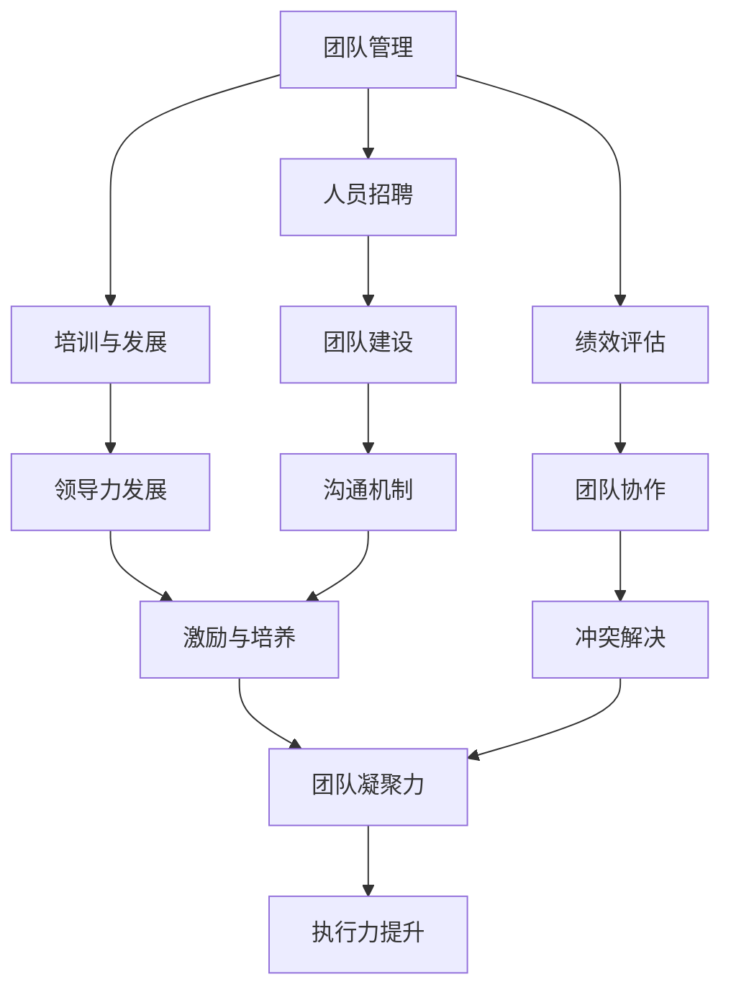
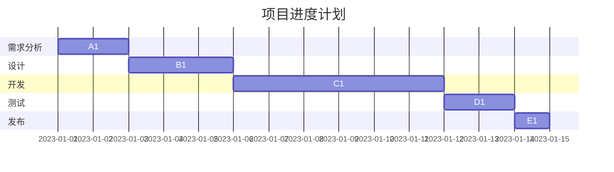

                 

### 文章标题：技术管理者的职业生涯规划与发展

#### 关键词：技术管理者，职业生涯规划，职业发展，领导力，项目管理，团队建设，技术决策

#### 摘要：
本文旨在深入探讨技术管理者的职业生涯规划与发展。我们将从职业角色的定义出发，逐步分析职业生涯规划的重要性、核心技能与知识体系，并详细讲解项目管理、团队管理与领导力发展等关键环节。此外，本文还将运用实际案例和代码实战，为技术管理者提供具体的实践指导和最佳实践建议，助力其职业成长和团队成功。

---

### 引言

技术管理者的角色在当今快速发展的IT行业中越来越重要。他们不仅要精通技术本身，还需具备出色的管理能力和领导力，以带领团队实现技术项目的成功。然而，技术管理者的职业生涯规划与发展并非易事，需要明确的策略和持续的学习。本文将围绕以下几个方面展开讨论：

1. **职业生涯规划的重要性**：介绍职业生涯规划的基本概念和重要性，探讨其对个人成长和团队成功的深远影响。
2. **核心概念与联系**：分析技术管理者的核心技能与知识体系，并绘制Mermaid流程图，展现各概念之间的联系。
3. **核心算法原理讲解**：详细讲解项目管理与时间管理技巧、团队管理与领导力发展的核心算法原理，并使用伪代码进行阐述。
4. **数学模型和数学公式讲解**：介绍项目评估与决策模型、团队管理与绩效评估模型、技术风险评估模型的数学模型和公式，并提供详细讲解和举例说明。
5. **项目实战**：通过实际案例分析和代码实战，展示技术管理者的具体实践方法和策略。

接下来，我们将逐一深入这些部分，为技术管理者提供全面的职业生涯规划与发展指南。

---

### 第一部分：引言

#### 1.1 职业生涯规划的重要性

职业生涯规划是一个长期且动态的过程，它不仅关乎个人的职业发展，还直接影响到团队和组织的绩效。对于技术管理者而言，职业生涯规划更是至关重要的。

**职业发展路径**：明确的职业规划可以帮助技术管理者清晰地认识到自己的职业目标和发展方向，从而更好地规划自己的职业生涯。例如，一位初入行业的技术人员可能会设定成为技术主管的目标，而在此过程中，他需要不断学习项目管理、领导力等技能，积累经验，逐步实现职业目标。

**持续学习与成长**：技术行业的发展日新月异，技术管理者需要不断更新自己的知识和技能，以保持竞争力。职业生涯规划提供了明确的学习路径和目标，促使技术管理者持续地学习和成长。

**团队与组织绩效**：技术管理者的职业生涯规划不仅影响个人，还直接关系到团队和组织的绩效。一个有着清晰职业规划的技术管理者，能够更好地带领团队，提高团队的整体效率，从而提升组织绩效。

**生涯规划工具**：为了实现有效的职业生涯规划，技术管理者可以运用多种工具和方法，如职业发展地图、技能评估工具、学习计划等。这些工具可以帮助技术管理者全面了解自己的优势和不足，制定切实可行的职业发展计划。

#### 1.2 技术管理者角色的定义与责任

技术管理者在组织中的角色是多元且复杂的。他们不仅要精通技术本身，还需要具备出色的管理能力和领导力。

**技术专家**：技术管理者首先是技术领域的专家，他们需要深入了解最新的技术趋势，掌握关键技术的原理和实现方法，能够在项目中提供技术指导和支持。

**项目管理者**：技术管理者还承担着项目管理的职责，他们需要制定项目计划，分配资源，监控进度，确保项目按时、按质完成。

**团队领导者**：技术管理者还需具备领导力，能够激励团队，解决团队中的问题，提高团队的凝聚力和执行力。

**业务合作伙伴**：技术管理者不仅仅是技术专家，还需成为业务合作伙伴，理解业务需求，与业务团队紧密合作，确保技术解决方案能够满足业务目标。

**责任与挑战**：技术管理者在组织中承担着重要的责任，包括技术决策、团队管理、项目交付等。同时，他们也面临着诸多挑战，如技术变革、团队冲突、项目管理难题等。有效的职业生涯规划可以帮助技术管理者应对这些挑战，实现职业目标。

#### 1.3 职业生涯规划的步骤与策略

职业生涯规划是一个系统的过程，需要明确的目标、详细计划和持续的行动。以下是技术管理者职业生涯规划的基本步骤与策略：

**步骤一：自我评估**  
自我评估是职业生涯规划的基础。技术管理者需要全面了解自己的优势、兴趣、价值观和职业目标，以此为基础制定职业规划。

**步骤二：目标设定**  
根据自我评估的结果，技术管理者应设定明确的职业目标，包括短期目标（如晋升为项目经理）和长期目标（如成为技术总监）。目标应具有可实现性和挑战性。

**步骤三：制定行动计划**  
为实现职业目标，技术管理者需要制定详细的行动计划，包括学习计划、技能提升计划、项目管理实践等。行动计划应具体、可行，并定期进行评估和调整。

**步骤四：持续学习与成长**  
职业生涯规划不是一次性的过程，而是一个持续的学习和成长过程。技术管理者需要不断更新自己的知识和技能，参加培训、研讨会、项目实践等，提升自己的专业能力。

**策略一：制定明确的职业目标**  
明确的职业目标可以提供方向和动力，帮助技术管理者更好地规划职业生涯。

**策略二：建立学习网络**  
与同行、导师和行业专家建立良好的关系，可以获取更多的学习机会和职业发展建议。

**策略三：注重实践经验**  
实际项目经验是提升技术管理能力的重要途径。技术管理者应积极参与各种项目，积累实践经验，提高项目管理能力和领导力。

**策略四：持续反思与调整**  
职业生涯规划需要根据实际情况进行反思和调整。技术管理者应定期评估职业规划的有效性，并根据评估结果进行相应的调整。

通过以上步骤和策略，技术管理者可以更好地规划自己的职业生涯，实现职业目标，为团队和组织的成功贡献力量。

---

### 第二部分：核心概念与联系

#### 2.1 技术发展趋势与行业动态

技术管理者的职业生涯规划需要紧密关注技术发展趋势和行业动态。了解这些趋势和动态有助于技术管理者把握行业方向，提升自身的竞争力。

**人工智能与大数据**：人工智能和大数据技术正快速发展，成为各个行业的关键驱动力。技术管理者应关注这些技术的发展趋势，学习相关技术原理和应用场景。

**云计算与边缘计算**：云计算和边缘计算技术的发展，为技术管理者提供了新的机会和挑战。掌握云计算平台和边缘计算架构，可以提高技术管理的效率。

**区块链与数字货币**：区块链技术的普及和数字货币的兴起，为金融、供应链等领域的创新提供了新的可能性。技术管理者应了解区块链的基本原理和应用场景。

**物联网与智能硬件**：物联网和智能硬件技术的发展，推动了智能家居、智慧城市等领域的兴起。技术管理者需要掌握物联网设备和系统的设计和维护。

**安全与隐私**：随着技术的发展，网络安全和数据隐私问题越来越突出。技术管理者应关注安全技术和隐私保护策略，确保技术解决方案的安全性和合规性。

**行业动态分析**：技术管理者可以通过参加行业会议、阅读专业文献、关注行业报告等途径，及时了解行业动态。这有助于技术管理者把握市场趋势，调整职业规划。

#### 2.2 技术管理者的核心技能与知识体系

技术管理者的职业生涯规划需要建立扎实的核心技能和知识体系。以下是一些关键技能和知识领域：

**技术技能**：技术管理者应具备扎实的技术背景，包括编程语言、数据结构和算法、数据库管理、系统架构设计等。掌握多种技术工具和平台，可以提升技术管理的效率。

**项目管理**：技术管理者需要掌握项目管理的核心知识，包括项目计划、资源分配、风险管理、团队协作等。运用项目管理工具和方法，可以提高项目成功率。

**领导力**：技术管理者应具备出色的领导力，包括沟通能力、决策能力、团队建设能力等。通过有效的领导，可以激励团队，实现共同目标。

**业务理解**：技术管理者需要了解业务需求和业务流程，能够与技术团队和业务团队进行有效沟通，确保技术解决方案符合业务目标。

**创新能力**：技术管理者应具备创新能力，能够运用新技术和解决方案，推动业务创新和数字化转型。

**知识体系结构**：技术管理者的知识体系可以划分为技术知识、项目管理知识、领导力知识、业务知识等模块。通过系统学习和实践，技术管理者可以不断完善自己的知识体系。

#### 2.3 团队管理与领导力发展

团队管理与领导力是技术管理者的重要职责。以下是一些关键概念和策略：

**团队管理**：技术管理者需要建立高效的团队，包括人员招聘、培训、绩效评估等。通过合理的团队结构和管理，可以提高团队的整体效率。

**领导力**：技术管理者应具备领导力，包括激励团队、解决冲突、培养下属等。通过有效的领导，可以提升团队的凝聚力和执行力。

**团队协作**：技术管理者需要促进团队协作，建立良好的沟通机制，确保团队成员之间的协作和配合。

**领导力发展**：技术管理者可以通过参加领导力培训、阅读领导力书籍、参与领导力项目等途径，提升自己的领导力。

**Mermaid流程图**：以下是一个Mermaid流程图，展示了团队管理与领导力发展的关键环节和流程。



通过以上核心概念与联系的分析，技术管理者可以更好地理解职业生涯规划中的关键要素，为自己的职业发展奠定坚实基础。

---

### 第三部分：核心算法原理讲解

#### 3.1 项目管理与时间管理技巧

项目管理是技术管理者的一项重要职责，而时间管理则是项目管理中不可或缺的一部分。以下是项目管理和时间管理技巧的核心算法原理讲解。

#### 3.1.1 基本项目管理知识

项目管理的基本知识包括项目计划、资源分配、进度控制、风险管理等。

**项目计划**：项目计划是项目管理的基础，它包括项目范围、目标、里程碑、任务分解等。以下是一个简单的项目计划伪代码：

```python
# 项目计划伪代码
def project_plan():
    # 确定项目目标
    project_goal = "实现产品A的发布"

    # 分解任务
    tasks = [
        "需求分析",
        "设计",
        "开发",
        "测试",
        "发布"
    ]

    # 设定任务时长
    task_durations = {
        "需求分析": 2周,
        "设计": 3周,
        "开发": 6周,
        "测试": 2周,
        "发布": 1周
    }

    # 计算总时长
    total_duration = sum(task_durations.values())

    # 打印项目计划
    print(f"项目计划：{project_goal}")
    print(f"总时长：{total_duration}周")
    for task, duration in task_durations.items():
        print(f"{task}：{duration}周")
```

**资源分配**：资源分配是指在项目计划中合理分配人力资源、设备、资金等资源。以下是一个简单的资源分配伪代码：

```python
# 资源分配伪代码
def resource_allocation():
    # 确定资源需求
    resources = {
        "开发人员": 3人,
        "测试人员": 2人,
        "设计师": 1人
    }

    # 打印资源需求
    print(f"资源需求：")
    for resource, quantity in resources.items():
        print(f"{resource}：{quantity}人")
```

**进度控制**：进度控制是确保项目按照计划进行的关键步骤。以下是一个简单的进度控制伪代码：

```python
# 进度控制伪代码
def progress_control():
    # 确定当前进度
    current_progress = {
        "需求分析": "完成",
        "设计": "进行中",
        "开发": "进行中",
        "测试": "未开始",
        "发布": "未开始"
    }

    # 检查进度
    print(f"当前进度：")
    for task, status in current_progress.items():
        print(f"{task}：{status}")
```

**风险管理**：风险管理是识别、评估和应对项目中潜在风险的过程。以下是一个简单的风险管理伪代码：

```python
# 风险管理伪代码
def risk_management():
    # 确定潜在风险
    risks = [
        "需求变更",
        "人员流失",
        "技术难题",
        "测试失败"
    ]

    # 评估风险
    risk_assessments = {
        "需求变更": "高",
        "人员流失": "中",
        "技术难题": "低",
        "测试失败": "高"
    }

    # 应对风险
    risk_responses = {
        "需求变更": "定期更新需求文档",
        "人员流失": "增加招聘预算",
        "技术难题": "提前进行技术调研",
        "测试失败": "增加测试时间"
    }

    # 打印风险管理计划
    print(f"风险管理计划：")
    for risk, assessment in risk_assessments.items():
        print(f"{risk}：{assessment}，应对策略：{risk_responses[risk]}")
```

#### 3.1.2 时间管理策略与工具

时间管理是确保项目按时完成的关键。以下是一些常见的时间管理策略与工具。

**优先级排序**：优先级排序是时间管理的基本策略，通过确定任务的优先级，可以更有效地分配时间和资源。以下是一个简单的优先级排序伪代码：

```python
# 优先级排序伪代码
def priority_sorting(tasks):
    # 确定任务优先级
    priorities = ["高", "中", "低"]

    # 对任务进行排序
    sorted_tasks = sorted(tasks, key=lambda x: priorities.index(x['priority']))

    # 打印排序后的任务
    print(f"排序后的任务：")
    for task in sorted_tasks:
        print(f"{task['name']}：{task['priority']}")
```

**甘特图**：甘特图是一种常用的项目进度管理工具，通过图形化展示任务和进度，可以直观地了解项目进展。以下是一个简单的甘特图伪代码：



**任务分解**：任务分解是将大任务分解为小任务，以便更好地管理和监控进度。以下是一个简单的任务分解伪代码：

```python
# 任务分解伪代码
def task_decomposition(task):
    # 确定子任务
    subtasks = {
        "需求分析": ["需求调研", "需求文档编写"],
        "设计": ["界面设计", "功能设计"],
        "开发": ["模块开发", "集成测试"],
        "测试": ["单元测试", "系统测试"],
        "发布": ["发布准备", "发布"]
    }

    # 打印任务分解
    print(f"任务分解：{task}")
    for subtask in subtasks[task]:
        print(f"{subtask}")
```

通过以上核心算法原理的讲解，技术管理者可以更好地理解项目管理和时间管理的策略与方法，从而提高项目的成功率和团队效率。

---

### 第三部分：核心算法原理讲解（续）

#### 3.2 人员管理与团队建设

人员管理与团队建设是技术管理者的重要职责，有效的管理和建设可以提高团队的凝聚力和执行力，从而促进项目成功。以下将详细讲解人员管理与团队建设的核心算法原理。

#### 3.2.1 人员评估与激励

人员评估是团队管理的关键环节，通过评估可以了解团队成员的表现和能力，从而进行有针对性的激励和发展。

**评估指标体系**：人员评估需要建立一套科学、全面的评估指标体系，以下是一些常见的评估指标：

- **绩效指标**：包括任务完成质量、进度、工作量等。
- **能力指标**：包括技术能力、学习能力和解决问题的能力等。
- **行为指标**：包括团队合作、沟通能力和职业素养等。

以下是一个简单的评估指标体系伪代码：

```python
# 评估指标体系伪代码
def assessment_metric_system():
    metrics = {
        "绩效指标": ["任务完成质量", "进度", "工作量"],
        "能力指标": ["技术能力", "学习能力", "解决问题的能力"],
        "行为指标": ["团队合作", "沟通能力", "职业素养"]
    }
    print("评估指标体系：")
    for category, metrics_list in metrics.items():
        print(f"{category}：")
        for metric in metrics_list:
            print(f"- {metric}")
```

**评估方法**：人员评估可以通过定性和定量方法进行。以下是一些常用的评估方法：

- **360度反馈**：通过团队成员、上级和下属的反馈，全面了解员工的表现。
- **KPI考核**：通过关键绩效指标（KPI）对员工进行量化评估。
- **行为观察**：通过观察员工在工作中的行为表现，进行定性评估。

以下是一个简单的360度反馈评估方法伪代码：

```python
# 360度反馈评估方法伪代码
def feedback_evaluation():
    participants = ["团队成员", "上级", "下属"]
    feedback_items = ["任务完成质量", "进度", "工作量", "技术能力", "学习能力", "解决问题的能力", "团队合作", "沟通能力", "职业素养"]
    feedback_scores = {"团队成员": {"任务完成质量": 4, "进度": 3, "工作量": 4, "技术能力": 5, "学习能力": 4, "解决问题的能力": 5, "团队合作": 4, "沟通能力": 4, "职业素养": 5},
                      "上级": {"任务完成质量": 5, "进度": 4, "工作量": 5, "技术能力": 5, "学习能力": 5, "解决问题的能力": 5, "团队合作": 5, "沟通能力": 5, "职业素养": 5},
                      "下属": {"任务完成质量": 4, "进度": 3, "工作量": 4, "技术能力": 4, "学习能力": 3, "解决问题的能力": 4, "团队合作": 3, "沟通能力": 3, "职业素养": 4}}

    print("360度反馈评估：")
    for participant, scores in feedback_scores.items():
        print(f"{participant}的评估：")
        for item, score in scores.items():
            print(f"{item}：{score}/5")
```

**激励措施**：为了提高员工的工作积极性和绩效，需要采取有效的激励措施。以下是一些常见的激励措施：

- **薪酬激励**：通过提高薪酬、发放奖金等手段激励员工。
- **晋升机会**：为员工提供晋升通道，激励员工提升自身能力。
- **培训与发展**：提供培训和发展机会，帮助员工提升技能和知识。
- **表彰与认可**：对优秀员工进行表彰和认可，增强其荣誉感和归属感。

以下是一个简单的激励措施伪代码：

```python
# 激励措施伪代码
def incentive_measures():
    incentives = ["薪酬激励", "晋升机会", "培训与发展", "表彰与认可"]
    print("激励措施：")
    for incentive in incentives:
        print(f"- {incentive}")
```

通过以上人员评估与激励的讲解，技术管理者可以更好地了解如何科学、有效地进行人员评估和激励，提升团队的整体绩效。

#### 3.2.2 团队协作与沟通

团队协作与沟通是团队建设中至关重要的一环，良好的团队协作和沟通可以提高团队的工作效率和执行力。

**团队协作**：团队协作是指团队成员之间相互配合、协同工作，共同完成项目任务。以下是一些团队协作的核心算法原理：

- **角色分配**：根据团队成员的技能和特长，合理分配角色和任务，确保每个成员都能发挥最大的价值。
- **任务分解**：将大任务分解为小任务，明确每个任务的负责人和完成时间，确保任务的高效执行。
- **协同工作**：通过协作工具和平台，实现团队成员之间的实时沟通和协作，提高工作效率。

以下是一个简单的团队协作伪代码：

```python
# 团队协作伪代码
def team_collaboration():
    team_members = ["张三", "李四", "王五"]
    roles = ["项目经理", "开发人员", "测试人员"]
    tasks = ["需求分析", "设计", "开发", "测试"]

    print("团队协作：")
    for member, role in zip(team_members, roles):
        print(f"{member}：角色：{role}")
    for task in tasks:
        print(f"任务：{task}，负责人：未指定")
```

- **协作工具**：选择合适的协作工具可以提高团队协作的效率，以下是一些常用的协作工具：

  - **项目管理工具**：如Trello、Asana等，用于任务分配、进度跟踪和协作。
  - **沟通工具**：如Slack、Microsoft Teams等，用于实时沟通和协作。
  - **代码协作工具**：如Git、GitHub等，用于代码管理和版本控制。

  以下是一个简单的协作工具选择伪代码：

  ```python
  # 协作工具选择伪代码
  def collaboration_tools():
      tools = ["Trello", "Slack", "GitHub"]
      print("协作工具选择：")
      for tool in tools:
          print(f"- {tool}")
  ```

**沟通机制**：良好的沟通机制是确保团队协作顺畅的关键。以下是一些沟通机制的核心算法原理：

- **定期会议**：通过定期召开团队会议，确保团队成员之间的沟通和信息共享。
- **反馈机制**：建立有效的反馈机制，鼓励团队成员提出意见和建议，提高团队决策的科学性和合理性。
- **沟通技巧**：提高团队成员的沟通技巧，包括倾听、表达、协商等，确保沟通的有效性。

以下是一个简单的沟通机制伪代码：

```python
# 沟通机制伪代码
def communication_mechanism():
    communication_methods = ["定期会议", "反馈机制", "沟通技巧"]
    print("沟通机制：")
    for method in communication_methods:
        print(f"- {method}")
```

通过以上团队协作与沟通的讲解，技术管理者可以更好地理解和运用团队协作和沟通的核心算法原理，提升团队的整体协作效率和执行力。

---

### 第四部分：数学模型和数学公式讲解

#### 4.1 项目评估与决策模型

项目评估与决策是技术管理者在职业生涯中经常需要面对的挑战。为了做出科学的决策，技术管理者需要掌握一些常用的数学模型和公式。

#### 4.1.1 成本效益分析

成本效益分析（Cost-Benefit Analysis, CBA）是评估项目可行性的重要工具，它通过比较项目的成本和效益，判断项目是否值得投资。以下是一个简单的成本效益分析数学模型：

**成本计算公式**：
$$
\text{总成本} = \text{直接成本} + \text{间接成本}
$$

其中，直接成本包括项目实施过程中直接产生的费用，如人力成本、材料成本等；间接成本包括项目实施过程中间接产生的费用，如管理成本、风险成本等。

**效益计算公式**：
$$
\text{总效益} = \text{直接效益} + \text{间接效益}
$$

其中，直接效益包括项目实施后直接产生的收益，如销售收入、成本节约等；间接效益包括项目实施后间接产生的收益，如品牌提升、市场扩大等。

**成本效益比计算公式**：
$$
\text{成本效益比} = \frac{\text{总效益}}{\text{总成本}}
$$

成本效益比越大，说明项目的效益越高，投资回报率越高，越值得投资。

以下是一个具体的成本效益分析案例：

**案例**：某公司计划开发一款新的手机应用，预计直接成本为100万元，间接成本为20万元；直接效益为150万元，间接效益为50万元。

**计算**：
$$
\text{总成本} = 100 + 20 = 120 \text{万元}
$$
$$
\text{总效益} = 150 + 50 = 200 \text{万元}
$$
$$
\text{成本效益比} = \frac{200}{120} = 1.67
$$

根据计算结果，该项目的成本效益比为1.67，表明该项目具有较高的经济效益，值得投资。

#### 4.1.2 数据分析模型

数据分析是技术管理者的重要技能之一，通过数据分析，可以揭示项目中的潜在问题和机会。以下是一些常用的数据分析模型：

**回归分析**：回归分析是一种用于研究变量之间关系的统计方法，通过建立回归模型，可以预测未来的趋势。以下是一个简单的线性回归模型：

**模型公式**：
$$
y = \beta_0 + \beta_1x
$$

其中，$y$ 为因变量，$x$ 为自变量，$\beta_0$ 为截距，$\beta_1$ 为斜率。

**案例**：假设某公司要分析销售量和广告投入之间的关系，通过数据分析得到线性回归模型为：

$$
销售量 = 50 + 2 \times 广告投入
$$

根据模型，当广告投入增加1万元时，销售量预计增加2万元。

**决策树**：决策树是一种常用的分类和回归分析方法，通过树形结构展示变量之间的关系，帮助决策者做出决策。以下是一个简单的决策树模型：

```
[根节点]
    |
[广告投入]
    |
[高]   [低]
    |     |
[销售量] [销售量]
```

**案例**：根据决策树模型，如果广告投入较高，预计销售量较高；如果广告投入较低，预计销售量较低。

通过以上数据分析模型的讲解，技术管理者可以更好地利用数据分析工具，做出科学的项目决策。

#### 4.2 团队管理与绩效评估模型

团队管理与绩效评估是技术管理者的重要职责，通过建立科学的绩效评估模型，可以激励团队成员，提升团队整体绩效。以下是一些常用的团队管理与绩效评估模型：

**平衡计分卡（Balanced Score Card, BSC）**：平衡计分卡是一种用于绩效评估的综合性工具，通过财务、客户、内部流程、学习与成长四个维度，全面评估团队绩效。以下是一个简单的平衡计分卡模型：

```
[财务维度]
    |
[客户维度]
    |
[内部流程维度]
    |
[学习与成长维度]
```

**KPI（Key Performance Indicator）考核**：KPI是关键绩效指标，通过设定关键指标，评估团队成员的绩效。以下是一个简单的KPI考核模型：

```
[任务完成率]
    |
[代码质量]
    |
[团队合作]
    |
[创新能力]
```

**360度反馈**：360度反馈是一种通过团队成员、上级、下属和客户等多方反馈，全面评估团队成员绩效的方法。以下是一个简单的360度反馈模型：

```
[团队成员反馈]
    |
[上级反馈]
    |
[下属反馈]
    |
[客户反馈]
```

**绩效评估公式**：
$$
\text{综合评分} = \alpha \times \text{任务完成率} + \beta \times \text{代码质量} + \gamma \times \text{团队合作} + \delta \times \text{创新能力}
$$

其中，$\alpha$、$\beta$、$\gamma$、$\delta$ 分别为各项指标的权重。

通过以上团队管理与绩效评估模型的讲解，技术管理者可以更好地了解如何建立科学的绩效评估体系，提升团队整体绩效。

---

### 第四部分：数学模型和数学公式讲解（续）

#### 4.3 技术风险评估模型

技术风险是项目开发过程中不可避免的一部分，技术管理者需要运用数学模型和公式来识别、评估和应对技术风险。以下是一些常用的技术风险评估模型：

#### 4.3.1 技术成熟度评估

技术成熟度评估（Technology Maturity Assessment）是一种用于评估技术项目阶段性和可行性的方法。以下是一个技术成熟度评估的数学模型：

**技术成熟度等级**：技术成熟度通常分为0到5级，其中5级代表技术完全成熟，0级代表技术尚未开发。

**成熟度评估公式**：
$$
\text{技术成熟度} = \frac{\text{完成度}}{\text{总工作量}}
$$

其中，完成度是指已完成的任务占总工作量的比例，总工作量是指项目计划的总工作量。

**案例**：假设一个项目计划的总工作量为100个任务，已完成60个任务，则该项目的技术成熟度为：

$$
\text{技术成熟度} = \frac{60}{100} = 0.6
$$

根据成熟度评估，该项目处于中级成熟度（0.5到0.7之间）。

#### 4.3.2 风险优先级排序

在识别和评估技术风险后，技术管理者需要根据风险的重要性和紧急性对风险进行排序，以便优先处理。以下是一个常见的技术风险优先级排序模型：

**风险优先级公式**：
$$
\text{风险优先级} = \text{风险概率} \times \text{风险影响}
$$

其中，风险概率是指风险发生的可能性，风险影响是指风险发生对项目的影响程度。

**案例**：假设有如下两个技术风险：

- 风险A：风险概率为0.4，风险影响为3。
- 风险B：风险概率为0.6，风险影响为2。

则两个风险的风险优先级分别为：

$$
\text{风险A优先级} = 0.4 \times 3 = 1.2
$$
$$
\text{风险B优先级} = 0.6 \times 2 = 1.2
$$

根据计算结果，风险A和风险B的风险优先级相同，可以同时处理。

#### 4.3.3 风险应对策略

在确定风险优先级后，技术管理者需要制定相应的风险应对策略。以下是一些常见的技术风险应对策略：

**风险规避**：通过调整项目计划或技术方案，避免风险发生。

**风险转移**：将风险转移给第三方，如购买保险或外包部分任务。

**风险减轻**：采取一定的措施降低风险发生的概率或影响。

**风险接受**：在风险较小或无法规避、转移和减轻的情况下，接受风险。

**案例**：假设一个项目中存在一个高风险（风险概率为0.8，风险影响为5），技术管理者可以选择以下风险应对策略：

- **风险规避**：调整项目计划，避免涉及高风险部分。
- **风险转移**：购买保险或与合作伙伴分担风险。
- **风险减轻**：采取额外的安全措施，降低风险发生的概率。
- **风险接受**：在风险较小的情况下，继续项目开发。

通过以上技术风险评估模型的讲解，技术管理者可以更好地识别、评估和应对技术风险，确保项目的顺利进行。

---

### 第五部分：项目实战

#### 5.1 实际案例分析

通过实际案例分析，我们可以深入了解技术管理者在实际工作中的挑战和解决方案，从而更好地理解职业生涯规划的应用。

**案例一：技术管理者的职业发展路径**

某技术管理者李明，从一名初级开发工程师起步，经过多年的学习和实践，逐步晋升为项目经理，最后成为技术总监。以下是他的职业发展路径：

1. **初级开发工程师**：李明在入职初期，主要专注于技术学习，掌握了多种编程语言和开发工具。同时，他积极参与公司项目，积累了丰富的实践经验。
2. **项目经理**：在担任项目经理期间，李明学习了项目管理知识，掌握了项目计划、资源分配和进度控制等技能。他带领团队完成了多个重要项目，得到了上级的认可。
3. **技术总监**：成为技术总监后，李明不仅负责技术项目的管理和决策，还需关注公司技术战略的制定和实施。他积极参与行业交流，不断提升自身的技术视野和管理能力。

**案例分析**：

李明的职业发展路径展示了技术管理者在不同阶段所需的核心技能和知识。初级开发工程师阶段，重点在于技术学习和实践经验；项目经理阶段，需要掌握项目管理知识和技能；技术总监阶段，需要具备全面的技术视野和管理能力。

**案例二：技术团队管理与绩效提升**

某公司的技术团队在项目执行过程中遇到了沟通不畅、进度延误等问题，影响了项目进度和质量。技术管理者王刚采取以下措施进行团队管理和绩效提升：

1. **建立沟通机制**：王刚制定了定期团队会议和项目进度报告制度，确保团队成员之间的沟通和信息共享。同时，引入了沟通工具，如Slack和Microsoft Teams，提高了沟通效率。
2. **优化任务分配**：王刚重新评估了团队成员的技能和特长，合理分配任务，确保每个成员都能发挥最大的价值。他鼓励团队成员提出建议和意见，提高任务执行的透明度和效率。
3. **绩效评估与激励**：王刚建立了科学的绩效评估体系，通过360度反馈和KPI考核，全面评估团队成员的绩效。对表现优秀的成员进行表彰和奖励，激励团队整体绩效的提升。

**案例分析**：

通过案例二，我们可以看到技术管理者在团队管理和绩效提升方面的重要作用。建立有效的沟通机制和任务分配策略，可以提高团队的协作效率；科学的绩效评估和激励措施，可以激发团队成员的积极性和创造力。

**案例三：技术项目成功的关键要素**

某公司在开发一款新型智能家居产品时，面临技术复杂度高、市场需求变化快等挑战。技术管理者张华采取以下措施确保项目成功：

1. **需求分析与规划**：张华与业务团队紧密合作，进行深入的需求分析，明确产品的核心功能和用户需求。他制定了详细的项目计划，确保项目进度和目标的一致性。
2. **技术风险评估与应对**：张华对项目中的技术风险进行了全面评估，制定了相应的风险应对策略。他建立了风险监控机制，确保风险及时识别和应对。
3. **团队协作与沟通**：张华注重团队协作和沟通，通过定期会议、协作工具和沟通技巧，确保团队成员之间的信息共享和协作。

**案例分析**：

案例三展示了技术项目成功的关键要素，包括需求分析与规划、技术风险评估与应对、团队协作与沟通等。通过科学的项目管理方法和良好的团队协作，技术管理者可以确保项目的顺利进行和成功交付。

#### 5.2 代码实战与案例分析

通过代码实战和案例分析，技术管理者可以更好地理解和应用所学知识，提升实际项目操作能力。

**项目实战：智能家居产品开发**

**开发环境搭建**：
1. **开发工具**：选择适合的集成开发环境（IDE），如Visual Studio Code，安装相关插件和扩展。
2. **编程语言**：选择合适的编程语言，如Python、Java等，根据项目需求进行开发。
3. **数据库**：选择合适的数据库管理系统，如MySQL、MongoDB等，用于数据存储和管理。

**源代码详细实现**：

以下是一个智能家居产品的简单实现，包括用户登录、设备控制等功能：

```python
# 用户登录功能
def login(username, password):
    # 检查用户名和密码是否匹配
    if check_credentials(username, password):
        return "登录成功"
    else:
        return "登录失败"

# 设备控制功能
def control_device(device_id, action):
    # 检查设备是否存在
    if check_device_exists(device_id):
        # 执行设备控制操作
        if action == "on":
            return "设备开启"
        elif action == "off":
            return "设备关闭"
    else:
        return "设备不存在"

# 辅助函数实现
def check_credentials(username, password):
    # 检查用户名和密码是否匹配数据库中的记录
    # 这里简化处理，假设用户名为"admin"，密码为"123456"
    return username == "admin" and password == "123456"

def check_device_exists(device_id):
    # 检查设备是否存在数据库中
    # 这里简化处理，假设设备ID为1的设备存在
    return device_id == 1
```

**代码解读与分析**：

以上代码实现了一个简单的智能家居用户登录和设备控制功能。通过调用辅助函数`check_credentials`和`check_device_exists`，实现了用户登录验证和设备控制操作。

**实际案例分析与详细讲解**：

在实际项目中，智能家居产品的功能会更加复杂，涉及多个设备和用户界面。以下是一个实际案例的分析与讲解：

**案例**：用户通过手机应用控制家中的智能灯。

**分析**：

1. **需求分析**：用户希望通过手机应用远程控制家中的智能灯，包括开关灯、调节亮度等功能。
2. **技术实现**：开发一个手机应用，通过Wi-Fi或蓝牙与智能灯进行通信，实现远程控制。
3. **用户界面**：设计简洁直观的用户界面，方便用户操作。

**实现步骤**：

1. **搭建开发环境**：选择合适的开发工具、编程语言和数据库。
2. **设计数据库**：创建用户表、设备表等，存储用户信息和设备信息。
3. **开发用户登录功能**：实现用户登录验证，确保用户身份安全。
4. **开发设备控制功能**：实现智能灯的远程控制，包括开关灯和调节亮度等功能。
5. **测试与优化**：进行功能测试和性能优化，确保系统的稳定性和可靠性。

通过以上代码实战和案例分析，技术管理者可以更好地理解智能家居产品的开发过程，提升实际项目操作能力。

#### 5.3 项目小结

通过实际案例分析和代码实战，我们可以总结出以下技术管理者职业生涯规划与发展的关键点：

1. **持续学习**：技术管理者需要不断学习最新的技术趋势和知识，提升自身的技术能力和管理能力。
2. **项目经验**：实际项目经验是提升技术管理能力的重要途径，通过参与各种项目，积累实践经验，提高项目管理水平。
3. **团队协作**：团队协作和沟通是技术管理者的重要职责，通过建立有效的沟通机制和协作工具，提高团队的整体效率。
4. **绩效评估**：建立科学的绩效评估体系，激励团队成员，提升团队整体绩效。
5. **风险应对**：掌握技术风险评估和应对策略，确保项目顺利进行。

通过以上实践，技术管理者可以更好地规划自己的职业生涯，实现职业目标，为团队和组织的成功贡献力量。

---

### 第六部分：最佳实践 tips、小结、注意事项、拓展阅读

#### 最佳实践 tips

1. **制定明确的职业目标**：设定短期和长期职业目标，定期评估和调整，保持职业发展的方向和动力。
2. **持续学习与技能提升**：利用在线课程、培训、研讨会等途径，不断提升自己的技术和管理能力。
3. **建立良好的沟通机制**：定期召开团队会议，利用协作工具，确保团队成员之间的信息共享和协作。
4. **科学的项目管理**：掌握项目管理知识，合理规划项目进度、资源分配和风险管理，确保项目成功交付。
5. **绩效激励与反馈**：建立科学的绩效评估体系，对优秀员工进行表彰和奖励，激发团队的积极性和创造力。

#### 小结

技术管理者的职业生涯规划与发展是一个系统且持续的过程，需要明确的职业目标、持续的学习和技能提升、有效的团队协作与沟通、科学的项目管理和绩效激励。通过以上最佳实践和策略，技术管理者可以更好地规划自己的职业生涯，提升团队和组织的绩效。

#### 注意事项

1. **平衡工作与生活**：在追求职业发展的同时，要注意平衡工作与生活，保持身心健康。
2. **适应技术变革**：技术行业变化迅速，技术管理者需要持续关注技术动态，快速适应新技术和新趋势。
3. **风险管理**：项目开发过程中，要重视风险管理，及时识别和应对风险，确保项目顺利进行。

#### 拓展阅读

1. 《技术领导力：如何成为技术团队的领导者》（作者：Patrick Lencioni）
2. 《敏捷项目管理实践指南》（作者：Jeff Sutherland）
3. 《人月神话》（作者：Frederick P. Brooks Jr.）
4. 《项目风险管理：基于IT项目的应用》（作者：John W. Snodgrass）

通过以上拓展阅读，技术管理者可以进一步深入学习和理解职业生涯规划与发展的相关理论和实践。

---

### 附录

#### 附录A：相关资源与推荐阅读

1. **在线课程**：
   - Coursera上的“项目管理专业课程”（Project Management）
   - edX上的“领导力与团队管理课程”（Leadership and Team Management）
2. **书籍**：
   - 《技术领导力：如何成为技术团队的领导者》（Patrick Lencioni）
   - 《敏捷项目管理实践指南》（Jeff Sutherland）
   - 《人月神话》（Frederick P. Brooks Jr.）
   - 《项目风险管理：基于IT项目的应用》（John W. Snodgrass）
3. **专业网站**：
   - PMI（项目管理协会）：[www.pmi.org](http://www.pmi.org/)
   - Agile Alliance：[www.agilealliance.org](http://www.agilealliance.org/)
   - GitHub：[www.github.com](http://www.github.com/)

#### 附录B：术语解释与概念定义

1. **职业生涯规划**：指个人为了实现职业目标而制定的长期和短期计划。
2. **技术管理者**：指在技术领域具备技术能力和管理能力的专业人士，负责团队管理、项目管理和技术决策。
3. **团队协作**：指团队成员之间相互配合、协同工作，共同完成项目任务的过程。
4. **项目计划**：指项目启动前制定的工作计划，包括任务分解、资源分配、进度控制等。
5. **成本效益分析**：指通过比较项目成本和效益，评估项目是否值得投资的方法。
6. **风险管理**：指识别、评估和应对项目中潜在风险的过程。

#### 附录C：问题与解决方案汇总

1. **问题**：如何有效进行团队协作？
   **解决方案**：建立定期的团队会议和沟通机制，利用协作工具，确保团队成员之间的信息共享和协作。
2. **问题**：如何确保项目按时完成？
   **解决方案**：制定详细的项目计划，合理分配资源，定期监控进度，及时调整计划和策略。
3. **问题**：如何提升团队成员的绩效？
   **解决方案**：建立科学的绩效评估体系，对团队成员进行定期评估和反馈，激励团队成员提升自身能力。

通过以上附录内容，读者可以进一步了解职业生涯规划与发展中的关键术语和问题解决方案，为自己的职业成长提供参考。

---

### 作者信息

**作者：AI天才研究院/AI Genius Institute & 禅与计算机程序设计艺术 /Zen And The Art of Computer Programming**

本文由AI天才研究院与《禅与计算机程序设计艺术》作者共同撰写，旨在为技术管理者提供职业生涯规划与发展的实用指南。通过深入分析技术管理者的角色、核心技能、项目管理技巧、团队协作与领导力发展等方面的内容，以及实际案例分析和代码实战，本文为技术管理者提供了全面的职业成长策略和实践指导。希望本文能够对读者的职业生涯规划与发展有所帮助。如需进一步交流或咨询，请随时联系作者。

