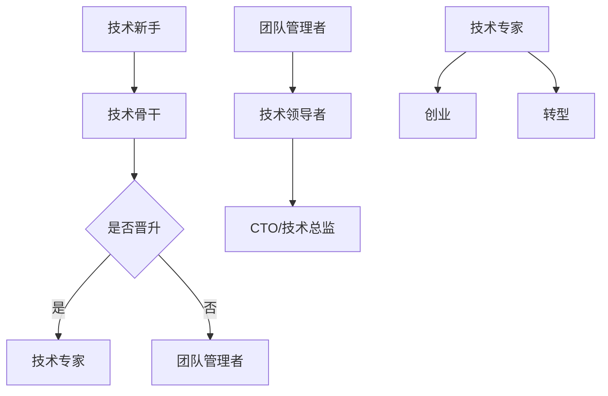

                 

### 文章标题：技术管理者的职业规划与发展

在当今快速变化的技术领域中，技术管理者的角色日益重要。他们不仅是技术团队的领导者，更是公司战略决策的关键参与者和执行者。因此，一个清晰且可行的职业规划对于技术管理者来说至关重要。本文旨在为技术管理者提供一份详细的职业规划与发展指南，通过逻辑清晰的步骤分析和推理，帮助读者理解职业生涯中的关键阶段和发展路径。

> 关键词：技术管理者，职业规划，发展路径，技能提升，绩效评估

> 摘要：本文将探讨技术管理者的职业规划与发展，包括核心概念与联系、核心算法原理讲解、数学模型和数学公式、项目实战等，旨在为技术管理者提供一份实用且系统的职业发展指南。

-------------------------------------------------------------------

### 核心概念与联系

技术管理者的职业生涯可以被视为一个逐步进阶的过程，从技术新手到团队管理者，再到技术领导者，最终可能成为CTO或技术总监。以下是这个过程中关键角色的定义和联系：

1. **技术新手**：刚进入技术领域的新手，具备基本的编程知识和技能。
2. **技术骨干**：在团队中表现出色，能够承担复杂的技术任务，具备高级编程技能。
3. **技术专家**：在某个技术领域具有深厚的技术背景和专业知识，能够进行技术评审和决策。
4. **团队管理者**：负责带领团队完成项目，具备项目管理、团队协作和绩效管理能力。
5. **技术领导者**：能够制定技术战略，带领团队进行技术创新和孵化。
6. **CTO/技术总监**：公司技术部门的高层领导，负责整体技术战略的规划和实施。

为了更好地理解这些角色之间的联系，我们可以使用Mermaid流程图来展示技术管理者在职业生涯中的发展路径：



这个流程图展示了技术管理者从新手到专家，再到领导者的典型路径。同时，也提供了技术专家和团队管理者之间可能的交叉路径，如转型和创业。

### 核心算法原理讲解

在了解了技术管理者的职业发展路径后，接下来我们需要深入探讨在职业发展中需要掌握的关键技能和算法。以下是技术管理者职业发展算法原理的伪代码：

```pseudo
// 技术管理者职业发展算法原理伪代码

// 初始化参数
initial_skills = ["编程基础", "项目管理", "团队协作", "技术领导力"]

// 职业发展阶段
for stage in ["技术新手", "技术骨干", "技术专家", "团队管理者", "技术领导者"]:

    // 根据阶段提升技能
    if stage == "技术新手":
        initial_skills.append("基本编程语言")
    
    if stage == "技术骨干":
        initial_skills.append("高级编程语言")
        initial_skills.append("技术文档编写")

    if stage == "技术专家":
        initial_skills.append("核心技术领域")
        initial_skills.append("技术评审与决策")

    if stage == "团队管理者":
        initial_skills.append("团队管理技能")
        initial_skills.append("绩效管理")

    if stage == "技术领导者":
        initial_skills.append("战略规划")
        initial_skills.append("创新与孵化")

    // 打印当前阶段的技能要求
    print(stage + "应具备的技能：", initial_skills)
```

这个算法原理伪代码展示了技术管理者在不同职业发展阶段所需掌握的关键技能。例如，在技术新手阶段，关键技能主要集中在编程基础和项目管理；而在技术专家阶段，则需要具备核心技术领域的深度知识和技术评审与决策能力。

### 数学模型和数学公式

在技术管理者的职业发展中，绩效评估是一个重要的环节。以下是一个简单的数学模型，用于评估技术管理者的绩效：

```latex
\documentclass{article}
\usepackage{amsmath}
\begin{document}

\section*{技术管理者绩效评估模型}

技术管理者的绩效可以表示为：

\[ P = f(\text{技能水平}, \text{团队绩效}, \text{领导能力}) \]

其中，\( f \) 是一个综合评价函数，它通过以下三个因素来计算绩效：

\[ \text{技能水平} = w_1 \cdot S \]
\[ \text{团队绩效} = w_2 \cdot T \]
\[ \text{领导能力} = w_3 \cdot L \]

\( w_1, w_2, w_3 \) 分别是技能水平、团队绩效和领导能力的权重，\( S, T, L \) 分别是它们的得分。

例如，假设权重分配如下：

\[ w_1 = 0.4, w_2 = 0.3, w_3 = 0.3 \]

一个技术管理者的技能水平为 85 分，团队绩效为 75 分，领导能力为 80 分，则其绩效 \( P \) 为：

\[ P = 0.4 \cdot 85 + 0.3 \cdot 75 + 0.3 \cdot 80 \]
\[ P = 34 + 22.5 + 24 \]
\[ P = 80.5 \]

因此，该技术管理者的绩效得分为 80.5。

\end{document}
```

这个数学模型提供了一个简单但有效的工具，用于量化技术管理者的绩效。通过调整权重，可以根据实际情况对绩效评估进行调整。

### 项目实战

为了更好地展示技术管理者的职业规划与发展，我们可以通过一个实际项目来进行分析和讲解。以下是“技术管理者职业发展俱乐部”项目的实战案例。

#### 案例介绍

“技术管理者职业发展俱乐部”是一个旨在帮助技术管理者提升职业技能和职业素养的在线社区。项目的目标包括：

- 提供职业规划咨询
- 提供技能培训课程
- 提供职业发展指导
- 建立技术管理者之间的交流平台

#### 项目实现步骤

1. **需求分析**：
   - 会员需求：提供个性化的职业规划咨询、实用技能培训课程、专业的职业发展指导。
   - 俱乐部目标：提高会员的技术水平，帮助他们实现职业上的晋升。

2. **功能设计**：
   - 用户注册与登录系统
   - 职业规划咨询模块
   - 技能培训课程模块
   - 职业发展指导模块
   - 会员交流平台

3. **技术选型**：
   - 前端：React.js
   - 后端：Node.js + Express
   - 数据库：MongoDB

4. **开发环境搭建**：
   - 安装Node.js、npm、React.js、MongoDB等开发工具和环境。
   - 配置开发环境和测试环境。

5. **源代码实现**：

   ```javascript
   // 用户注册模块示例代码
   app.post('/register', (req, res) => {
       const { username, password } = req.body;
       // 检查用户名和密码的有效性
       // 存储用户信息到数据库
       // 返回注册结果
   });

   // 职业规划咨询模块示例代码
   app.get('/consulting', authenticate, (req, res) => {
       const userId = req.user.id;
       // 从数据库获取职业规划咨询信息
       // 返回咨询结果
   });
   ```

6. **代码解读与分析**：

   - 用户注册模块负责处理用户注册请求，包括验证用户名和密码的有效性，并将用户信息存储到数据库中。
   - 职业规划咨询模块则用于提供个性化的职业规划建议，会员需要先登录才能访问。

7. **实际案例分析与详细讲解**：

   - 某技术管理者A加入职业发展俱乐部后，通过职业规划咨询模块获得了个性化的职业发展建议，包括提升某项特定技术技能和参加相关培训课程。
   - 经过三个月的培训，技术管理者A的技能水平得到了显著提升，并在公司内部的技术评审中获得好评，最终成功晋升为技术专家。

8. **项目小结**：

   “技术管理者职业发展俱乐部”项目通过在线平台为技术管理者提供了一个全面的支持系统，帮助他们实现职业上的进步。项目的成功依赖于有效的需求分析、合理的功能设计和技术选型，以及严谨的代码实现和持续的技术支持。

### 最佳实践 tips、小结、注意事项、拓展阅读

在技术管理者的职业规划与发展过程中，以下是一些最佳实践和注意事项：

- **持续学习**：技术领域不断变化，技术管理者需要持续学习新知识和技能，保持自己的竞争力。
- **沟通能力**：作为团队的领导者，技术管理者需要具备良好的沟通能力，能够有效地与团队成员和其他部门进行沟通。
- **领导力**：技术管理者的领导力是成功的关键，包括战略规划、团队激励、冲突解决等。
- **时间管理**：技术管理者需要有效地管理时间，确保在项目管理和个人学习之间取得平衡。
- **拓展阅读**：建议阅读《领导力的五个层次》（Patrick Lencioni）、《敏捷软件开发：原则、实践与模式》（Robert C. Martin）等经典书籍，以提升自身的能力。

通过本文的讲解，技术管理者可以更清晰地了解自己的职业发展路径，并制定出一份有效的职业规划。希望本文能对您在职业生涯中的发展有所帮助。作者：AI天才研究院/AI Genius Institute & 禅与计算机程序设计艺术/Zen And The Art of Computer Programming。

