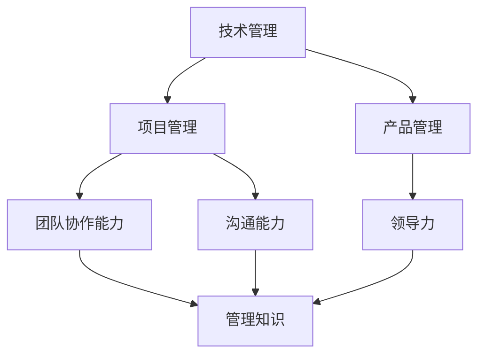

                 


## 文章标题
### 《技术管理者的职业规划指南》

## 关键词
- 技术管理者
- 职业规划
- 技术管理技能
- 编程技能提升
- 项目管理技能
- 产品管理技能

## 摘要
本文将深入探讨技术管理者的职业规划，从核心概念、技能提升到职业发展路径，为读者提供一份全面的职业规划指南。通过分析技术管理的定义与演变，技术管理者所需的领导力、团队协作能力和沟通能力，以及技术管理者的核心知识体系，本文旨在帮助技术管理者在职业生涯中不断成长和提升。同时，本文还结合了编程技能、项目管理技能和产品管理技能的提升方法，为技术管理者提供了实践指导。通过本篇文章，读者将能够更好地理解技术管理者的角色定位，明确职业规划的重要性，并掌握提升自身技能的有效途径。

## 第一部分：引言与职业规划概述
### 1.1 书籍背景与目标读者
#### 1.1.1 技术管理者的职业挑战
在当今快速发展的技术行业，技术管理者的角色变得尤为重要。他们不仅要具备扎实的技术背景，还需要掌握项目管理、团队协作和沟通等综合能力。随着企业对技术产品的需求日益增长，技术管理者面临着不断变化的挑战。如何有效地管理团队、提升项目质量和推动产品创新成为他们面临的关键问题。

#### 1.1.2 本书的目标与内容架构
本书旨在为技术管理者提供一份实用的职业规划指南，帮助他们更好地理解技术管理者的角色定位，提升自身技能，并在职业生涯中取得成功。本书内容分为四个主要部分：

1. **引言与职业规划概述**：介绍技术管理者的职业挑战和本书的目标。
2. **核心概念与联系**：详细阐述技术管理的定义、演变以及与项目管理、产品管理的联系。
3. **技能提升与实践**：讲解技术管理者的核心技能，包括编程技能、项目管理技能和产品管理技能的提升方法。
4. **职业发展路径**：分析技术管理者的职业发展路径，提供职业发展的建议和策略。

### 1.2 技术管理者角色定位
技术管理者在企业中扮演着至关重要的角色。他们不仅是技术的专家，还需要具备管理能力，能够协调团队工作，推动项目进展。具体来说，技术管理者的角色定位包括以下几个方面：

1. **团队领导**：技术管理者需要具备领导力，能够激励和引导团队成员，确保项目目标的实现。
2. **技术决策**：技术管理者需要做出关于技术选型、架构设计等方面的决策，确保项目的技术方向正确。
3. **项目管理**：技术管理者需要掌握项目管理方法，确保项目按时、按质、按预算完成。
4. **沟通协调**：技术管理者需要具备良好的沟通能力，能够与团队成员、客户和其他部门有效沟通，协调各方利益。

### 1.3 职业规划的重要性
职业规划对于技术管理者来说至关重要。通过明确的职业规划，技术管理者能够更好地了解自己的职业发展方向，制定具体的目标和计划，并采取相应的行动。职业规划的重要性体现在以下几个方面：

1. **明确目标**：职业规划能够帮助技术管理者明确自己的职业目标，为自己设定清晰的发展方向。
2. **制定计划**：职业规划促使技术管理者制定具体的行动计划，将目标转化为可执行的步骤。
3. **持续成长**：职业规划鼓励技术管理者不断学习和提升自身技能，以适应不断变化的技术和管理需求。
4. **职业发展**：通过职业规划，技术管理者能够更好地把握职业发展的机会，实现职业晋升和薪酬提升。

## 第二部分：核心概念与联系
### 2.1 技术管理者的核心概念
技术管理者的核心概念包括技术管理、项目管理、产品管理等。这些概念之间相互关联，共同构成了技术管理者的知识体系。

#### 2.1.1 技术管理的定义与演变
技术管理是指对技术资源和项目过程进行有效管理和控制的过程。它起源于20世纪50年代，随着计算机技术的发展而逐渐形成。技术管理的演变可以分为以下几个阶段：

1. **初期阶段**（20世纪50年代-70年代）：技术管理主要关注硬件和软件的开发和维护。
2. **成长阶段**（20世纪80年代-90年代）：随着信息技术的发展，技术管理开始涉及更多的软件工程和项目管理方法。
3. **成熟阶段**（21世纪初至今）：技术管理逐渐融入企业战略，成为企业创新和竞争力的重要组成部分。

#### 2.1.2 技术管理与项目管理的关系
技术管理与项目管理密切相关。项目管理是技术管理的重要组成部分，它关注项目的目标、进度、质量和资源等方面。技术管理通过项目管理来实现技术目标，确保项目的成功。

1. **项目目标**：技术管理需要明确项目的目标，确保项目能够满足企业的需求。
2. **进度控制**：技术管理需要制定合理的进度计划，确保项目按时完成。
3. **质量控制**：技术管理需要确保项目质量符合标准，满足客户需求。
4. **资源管理**：技术管理需要合理分配资源，确保项目有足够的资源支持。

#### 2.1.3 技术管理与产品管理的联系
产品管理是技术管理的一个重要分支，它关注产品的规划、开发和运营。技术管理与产品管理之间存在密切的联系。

1. **产品规划**：技术管理需要参与产品规划，确定产品的技术方向和功能需求。
2. **产品开发**：技术管理负责产品的技术实现，确保产品功能和技术性能的实现。
3. **产品运营**：技术管理需要参与产品运营，确保产品的稳定性、安全性和性能。

### 2.2 技术管理者的核心能力模型
技术管理者的核心能力包括领导力、团队协作能力和沟通能力。这些能力是技术管理者成功的关键。

#### 2.2.1 领导力
领导力是技术管理者必备的能力之一。技术管理者需要具备以下领导力：

1. **愿景领导**：能够设定清晰的目标和愿景，引导团队成员共同前进。
2. **激励领导**：能够激发团队成员的积极性，提高团队绩效。
3. **变革领导**：能够推动团队适应变化，实现组织目标。

#### 2.2.2 团队协作能力
团队协作能力是技术管理者的重要能力之一。技术管理者需要能够：

1. **建立团队**：能够建立高效的团队，明确团队目标和工作流程。
2. **协调冲突**：能够解决团队内部的冲突，确保团队和谐共处。
3. **激发创新**：能够鼓励团队成员提出创新想法，推动团队创新。

#### 2.2.3 沟通能力
沟通能力是技术管理者成功的关键。技术管理者需要具备以下沟通能力：

1. **倾听**：能够倾听团队成员的意见和建议，理解他们的需求和问题。
2. **表达**：能够清晰、准确地表达自己的想法和意见，确保团队成员理解。
3. **协调**：能够协调各方利益，确保项目顺利进行。

### 2.3 技术管理者的核心知识体系
技术管理者的核心知识体系包括技术背景知识、管理知识和产品管理知识。这些知识是技术管理者成功的基础。

#### 2.3.1 技术背景知识
技术背景知识包括编程语言、数据结构与算法、网络技术、数据库技术等。这些知识是技术管理者进行技术决策和项目实现的基础。

#### 2.3.2 管理知识
管理知识包括项目管理、团队管理、质量管理、风险管理等。这些知识是技术管理者进行项目管理和团队领导的基础。

#### 2.3.3 产品管理知识
产品管理知识包括市场调研、需求分析、产品规划、产品开发、产品运营等。这些知识是技术管理者参与产品管理和推动产品创新的基础。

### 2.4 技术管理者的核心概念联系
为了更好地理解技术管理者的核心概念，我们可以使用Mermaid流程图来展示它们之间的联系：



通过这个Mermaid流程图，我们可以清晰地看到技术管理、项目管理、产品管理以及领导力、团队协作能力和沟通能力之间的联系。这些概念共同构成了技术管理者的核心能力模型。

## 第三部分：技能提升与实践
### 3.1 编程技能提升

编程技能是技术管理者的基石，掌握多种编程语言和熟练使用相关工具可以提高工作效率，提升项目的质量和可靠性。以下将详细介绍Python和Java两种编程语言的核心技能提升方法。

#### 3.1.1 Python编程技能提升

Python因其简单易学、功能强大而广受欢迎。以下是Python编程技能提升的几个关键步骤：

1. **Python基础**：
    - 掌握Python的基本语法和数据类型。
    - 学习控制结构（条件语句、循环语句）和函数定义。

2. **数据结构**：
    - 熟悉Python中的常用数据结构，如列表、字典、集合和元组。
    - 学习如何使用这些数据结构进行高效的数据处理。

3. **模块与库**：
    - 学习如何使用Python标准库中的模块，如`datetime`、`os`等。
    - 掌握使用第三方库，如`numpy`、`pandas`进行数据分析和科学计算。

4. **面向对象编程**：
    - 学习Python中的类和对象的概念，掌握封装、继承和多态。

5. **并发编程**：
    - 学习使用`multiprocessing`、`threading`和`asyncio`等模块进行并发编程。

6. **实战项目**：
    - 完成一些实际项目，如网络爬虫、数据分析项目等，以巩固所学知识。

#### 3.1.2 Java编程技能提升

Java是一种广泛使用的编程语言，适用于企业级应用开发。以下是Java编程技能提升的关键步骤：

1. **Java基础**：
    - 掌握Java的基本语法和数据类型。
    - 学习控制结构（条件语句、循环语句）和函数定义。

2. **面向对象编程**：
    - 学习Java中的类和对象的概念，掌握封装、继承和多态。

3. **集合框架**：
    - 熟悉Java集合框架中的常用数据结构，如List、Set、Map等。

4. **异常处理**：
    - 学习如何使用异常处理机制，提高程序的健壮性。

5. **I/O操作**：
    - 学习Java中的I/O流操作，掌握文件读写、网络通信等。

6. **多线程编程**：
    - 学习使用`Thread`和`Runnable`接口进行多线程编程。

7. **Java库与框架**：
    - 学习使用Java库，如`java.sql`进行数据库操作。
    - 掌握常用的Java框架，如Spring、Hibernate等。

8. **实战项目**：
    - 完成一些实际项目，如Web应用、分布式系统等，以提升实战经验。

### 3.2 项目管理技能提升

项目管理技能对于技术管理者来说至关重要，它涉及到项目的目标设定、进度控制、资源管理等方面。以下是一些关键步骤，帮助技术管理者提升项目管理技能：

1. **项目计划**：
    - 学习如何制定项目计划，包括目标设定、任务分解、时间安排等。

2. **进度控制**：
    - 掌握关键路径法（Critical Path Method，CPM），了解项目进度与时间安排的关系。

3. **资源管理**：
    - 学习如何合理分配资源，确保项目有足够的资源支持。

4. **风险管理**：
    - 了解常见的项目风险类型，掌握风险管理方法，如风险识别、风险评估和风险应对策略。

5. **沟通管理**：
    - 学习如何进行有效的沟通，确保团队成员和利益相关者之间的信息畅通。

6. **团队协作**：
    - 学习团队协作工具和方法，如敏捷开发（Agile Development）、Scrum等。

7. **实战案例**：
    - 通过参与实际项目，学习如何应用项目管理方法和工具，提高项目成功率。

### 3.3 产品管理技能提升

产品管理技能是技术管理者在产品开发过程中不可或缺的。以下是一些关键步骤，帮助技术管理者提升产品管理技能：

1. **市场调研**：
    - 学习如何进行市场调研，了解用户需求和市场趋势。

2. **需求分析**：
    - 掌握需求分析的方法和技巧，确保产品满足用户需求。

3. **产品规划**：
    - 学习如何制定产品规划，包括产品定位、功能规划等。

4. **产品开发**：
    - 了解产品开发过程，掌握敏捷开发、Scrum等开发方法。

5. **产品运营**：
    - 学习如何进行产品运营，确保产品在市场上的成功。

6. **用户反馈**：
    - 掌握用户反馈的收集和分析方法，不断优化产品。

7. **实战案例**：
    - 通过参与实际产品项目，学习如何应用产品管理方法和工具，提升产品成功率。

### 3.4 技术管理者软技能提升

除了技术技能，技术管理者还需要具备一系列软技能，如领导力、沟通能力和团队协作能力。以下是一些提升软技能的方法：

1. **领导力提升**：
    - 学习领导力理论，了解不同类型的领导力风格。
    - 通过实践，如领导团队项目，提升领导能力。

2. **沟通能力提升**：
    - 学习有效的沟通技巧，如倾听、表达、协调。
    - 通过模拟练习和实际沟通情境，提升沟通能力。

3. **团队协作能力提升**：
    - 学习团队协作原则，如分工合作、共同目标。
    - 通过参与团队合作项目，提升协作能力。

## 第四部分：职业发展路径
### 4.1 技术管理者的职业发展阶段

技术管理者的职业发展可以分为以下几个阶段：

1. **初级阶段**：技术新手，主要职责是执行具体的技术任务。
2. **中级阶段**：技术骨干，开始参与项目管理和团队协作，具备一定的技术和管理能力。
3. **高级阶段**：技术管理者，负责整个项目的规划和管理，具备全面的领导力和管理能力。

### 4.2 职业发展策略

为了在技术管理领域取得成功，技术管理者可以采取以下策略：

1. **持续学习**：不断学习新技术和管理知识，保持竞争力。
2. **实践经验**：通过实际项目，积累项目管理经验，提升实战能力。
3. **职业网络**：建立广泛的职业网络，与其他技术管理者交流，获取行业动态和职业机会。
4. **职业晋升**：明确职业晋升路径，制定个人发展计划，争取晋升机会。
5. **领导力培养**：提升领导力，成为团队和组织的领导者。

### 4.3 职业发展机会

技术管理者在职业生涯中可以探索多种职业机会，如：

1. **项目经理**：负责项目规划和管理，确保项目按时、按质完成。
2. **技术总监**：负责公司的技术战略和方向，领导技术团队。
3. **CTO**：首席技术官，负责公司的技术创新和产品研发。
4. **创业**：创立自己的技术公司，实现技术创新和商业价值。

## 附录

### 附录A：术语表

- 技术管理：对技术资源和项目过程进行有效管理和控制的过程。
- 项目管理：确保项目按时、按质、按预算完成的过程。
- 产品管理：负责产品的规划、开发和运营的过程。

### 附录B：参考资料

- 《项目管理知识体系指南》（PMBOK指南）
- 《敏捷开发实践指南》
- 《产品经理手册》

### 附录C：源代码示例

- Python编程示例
- Java编程示例

## 结语
本文《技术管理者的职业规划指南》旨在为技术管理者提供一份全面的职业规划指南。从核心概念、技能提升到职业发展路径，本文为技术管理者提供了系统的指导和实用的建议。通过不断学习和实践，技术管理者可以在职业生涯中取得成功，为企业创造更大的价值。

### 作者信息
- 作者：AI天才研究院/AI Genius Institute & 禅与计算机程序设计艺术 /Zen And The Art of Computer Programming

## 3.1 Python编程技能提升

Python是一种广泛应用于数据科学、人工智能、Web开发和自动化等领域的编程语言。以下是一些步骤，帮助技术管理者提升Python编程技能：

### 3.1.1 Python基础

1. **了解Python语法**：
    - 学习Python的基本语法，包括变量、数据类型、运算符和控制结构。

    ```python
    x = 10
    y = "Hello, World!"
    print(x + y)
    ```

2. **掌握Python数据结构**：
    - 学习Python中的列表（list）、元组（tuple）、字典（dict）和集合（set）。

    ```python
    fruits = ["apple", "banana", "cherry"]
    print(fruits[0])
    ```

### 3.1.2 高级Python特性

1. **理解函数和模块**：
    - 学习如何定义函数和模块，以及如何导入和使用模块。

    ```python
    def greet(name):
        return f"Hello, {name}!"

    print(greet("Alice"))
    ```

2. **掌握类和对象**：
    - 学习面向对象编程的概念，包括类（class）和对象（object）。

    ```python
    class Person:
        def __init__(self, name, age):
            self.name = name
            self.age = age

        def greet(self):
            return f"Hello, my name is {self.name} and I am {self.age} years old."

    alice = Person("Alice", 30)
    print(alice.greet())
    ```

### 3.1.3 数据处理与科学计算

1. **使用Pandas进行数据处理**：
    - 学习如何使用Pandas库进行数据清洗、转换和分析。

    ```python
    import pandas as pd

    data = pd.DataFrame({'Name': ['Alice', 'Bob', 'Charlie'], 'Age': [30, 25, 35]})
    print(data)
    ```

2. **使用NumPy进行科学计算**：
    - 学习如何使用NumPy库进行数组计算、线性代数等。

    ```python
    import numpy as np

    array = np.array([1, 2, 3])
    print(array.sum())
    ```

### 3.1.4 异步编程与并发处理

1. **理解异步编程**：
    - 学习如何使用`asyncio`模块进行异步编程，提高代码的性能。

    ```python
    import asyncio

    async def hello():
        print("Hello")
        await asyncio.sleep(1)
        print("World")

    asyncio.run(hello())
    ```

2. **掌握多线程编程**：
    - 学习如何使用`threading`模块进行多线程编程，实现并发处理。

    ```python
    import threading

    def print_numbers():
        for i in range(1, 11):
            print(i)

    t = threading.Thread(target=print_numbers)
    t.start()
    ```

### 3.1.5 实战项目

1. **网络爬虫**：
    - 使用`requests`和`BeautifulSoup`库，实现一个简单的网络爬虫，爬取网页数据。

    ```python
    import requests
    from bs4 import BeautifulSoup

    url = "https://www.example.com"
    response = requests.get(url)
    soup = BeautifulSoup(response.text, "html.parser")
    print(soup.title.string)
    ```

2. **数据分析项目**：
    - 使用`Pandas`和`Matplotlib`，对某项业务数据进行数据清洗、分析，并生成可视化报告。

    ```python
    import pandas as pd
    import matplotlib.pyplot as plt

    data = pd.read_csv("data.csv")
    data['Sales'] = data['Sales'].astype(float)
    plt.plot(data['Date'], data['Sales'])
    plt.xlabel('Date')
    plt.ylabel('Sales')
    plt.show()
    ```

通过上述步骤和实战项目，技术管理者可以逐步提升Python编程技能，为职业生涯中的技术管理任务打下坚实的基础。

## 3.2 Java编程技能提升

Java是一种广泛应用于企业级应用、安卓开发和大数据处理等领域的编程语言。以下是一些步骤，帮助技术管理者提升Java编程技能：

### 3.2.1 Java基础

1. **了解Java语法**：
    - 学习Java的基本语法，包括变量、数据类型、运算符和控制结构。

    ```java
    public class HelloWorld {
        public static void main(String[] args) {
            System.out.println("Hello, World!");
        }
    }
    ```

2. **掌握Java数据结构**：
    - 学习Java中的常用数据结构，如数组（Array）、列表（ArrayList）、集合（Set）和映射（Map）。

    ```java
    import java.util.ArrayList;
    import java.util.List;

    public class DataStructures {
        public static void main(String[] args) {
            List<String> fruits = new ArrayList<>();
            fruits.add("apple");
            fruits.add("banana");
            fruits.add("cherry");
            System.out.println(fruits.get(0));
        }
    }
    ```

### 3.2.2 面向对象编程

1. **理解类和对象**：
    - 学习Java中的类（Class）和对象（Object）的概念，以及封装、继承和多态。

    ```java
    public class Animal {
        private String name;

        public Animal(String name) {
            this.name = name;
        }

        public void eat() {
            System.out.println(name + " is eating.");
        }
    }

    public class Dog extends Animal {
        public Dog(String name) {
            super(name);
        }

        @Override
        public void eat() {
            System.out.println(name + " is eating dog food.");
        }
    }
    ```

2. **掌握异常处理**：
    - 学习Java中的异常处理机制，包括`try-catch`语句和自定义异常。

    ```java
    public class ExceptionExample {
        public static void main(String[] args) {
            try {
                int result = divide(10, 0);
                System.out.println("Result: " + result);
            } catch (ArithmeticException e) {
                System.out.println("Error: " + e.getMessage());
            }
        }

        public static int divide(int a, int b) {
            if (b == 0) {
                throw new ArithmeticException("Cannot divide by zero.");
            }
            return a / b;
        }
    }
    ```

### 3.2.3 I/O操作与多线程编程

1. **学习I/O操作**：
    - 学习Java中的文件读写、网络通信等I/O操作。

    ```java
    import java.io.BufferedWriter;
    import java.io.FileWriter;
    import java.io.IOException;

    public class FileWriteExample {
        public static void main(String[] args) {
            try (BufferedWriter writer = new BufferedWriter(new FileWriter("example.txt"))) {
                writer.write("Hello, World!");
            } catch (IOException e) {
                e.printStackTrace();
            }
        }
    }
    ```

2. **掌握多线程编程**：
    - 学习如何使用Java中的`Thread`和`Runnable`接口进行多线程编程。

    ```java
    public class MultiThreadExample {
        public static void main(String[] args) {
            Thread t1 = new Thread(new MyRunnable());
            Thread t2 = new Thread(new MyRunnable());
            t1.start();
            t2.start();
        }

        static class MyRunnable implements Runnable {
            @Override
            public void run() {
                System.out.println(Thread.currentThread().getName() + " is running.");
            }
        }
    }
    ```

### 3.2.4 Java库与框架

1. **使用Java库**：
    - 学习如何使用Java标准库中的各种模块，如`java.sql`进行数据库操作。

    ```java
    import java.sql.Connection;
    import java.sql.DriverManager;
    import java.sql.ResultSet;
    import java.sql.Statement;

    public class JDBCExample {
        public static void main(String[] args) {
            try (Connection connection = DriverManager.getConnection("jdbc:mysql://localhost:3306/mydb", "username", "password")) {
                Statement statement = connection.createStatement();
                ResultSet resultSet = statement.executeQuery("SELECT * FROM users");
                while (resultSet.next()) {
                    System.out.println(resultSet.getString("name"));
                }
            } catch (Exception e) {
                e.printStackTrace();
            }
        }
    }
    ```

2. **掌握Java框架**：
    - 学习如何使用Spring、Hibernate等Java框架，提高开发效率。

    ```java
    import org.springframework.context.annotation.AnnotationConfigApplicationContext;

    public class SpringExample {
        public static void main(String[] args) {
            AnnotationConfigApplicationContext context = new AnnotationConfigApplicationContext(SpringConfig.class);
            HelloWorld helloWorld = context.getBean(HelloWorld.class);
            helloWorld.sayHello();
        }
    }
    ```

通过上述步骤和实战项目，技术管理者可以逐步提升Java编程技能，为职业生涯中的技术管理任务打下坚实的基础。

## 3.3 项目管理技能提升

项目管理是技术管理者必备的技能之一，掌握有效的项目管理方法和工具可以提高项目的成功率。以下是一些步骤，帮助技术管理者提升项目管理技能：

### 3.3.1 项目计划

1. **制定项目目标**：
    - 明确项目的目标，确保项目能够满足企业的需求和用户的需求。

    ```plaintext
    项目目标：
    - 开发一个具备高性能、易扩展性的电商平台
    - 提供用户友好的购物体验
    - 实现快速订单处理和物流跟踪
    ```

2. **任务分解**：
    - 将项目目标分解为具体的任务，明确每个任务的负责人和时间安排。

    ```plaintext
    任务分解：
    - 设计阶段
        - 需求分析
        - 系统设计
        - UI设计
    - 开发阶段
        - 前端开发
        - 后端开发
        - 数据库设计
    - 测试阶段
        - 功能测试
        - 性能测试
        - 安全测试
    - 部署阶段
        - 环境搭建
        - 系统部署
        - 上线准备
    ```

3. **时间安排**：
    - 根据任务分解，制定详细的时间安排，确保每个任务按时完成。

    ```plaintext
    时间安排：
    - 设计阶段：1个月
    - 开发阶段：2个月
    - 测试阶段：1个月
    - 部署阶段：1周
    ```

### 3.3.2 进度控制

1. **关键路径法**：
    - 学习关键路径法（Critical Path Method，CPM），确定项目的关键路径，确保项目按时完成。

    ```plaintext
    关键路径：
    - 需求分析 → 系统设计 → 前端开发 → 后端开发 → 数据库设计 → 功能测试
    ```

2. **进度跟踪**：
    - 使用项目管理工具（如Microsoft Project、JIRA）进行进度跟踪，及时发现和解决问题。

    ```plaintext
    进度跟踪：
    - 设计阶段：已完成80%
    - 开发阶段：已完成40%
    - 测试阶段：计划中
    - 部署阶段：计划中
    ```

### 3.3.3 资源管理

1. **资源分配**：
    - 合理分配项目资源，确保每个任务有足够的资源支持。

    ```plaintext
    资源分配：
    - 设计阶段：2名设计师
    - 开发阶段：4名开发人员
    - 测试阶段：2名测试人员
    - 部署阶段：1名运维人员
    ```

2. **风险管理**：
    - 识别项目中的潜在风险，制定风险应对策略，降低风险对项目的影响。

    ```plaintext
    风险识别：
    - 设计阶段：需求变更可能导致项目延期
    - 开发阶段：技术难题可能导致项目停滞
    - 测试阶段：测试不充分可能导致上线后出现严重问题
    - 部署阶段：部署环境不稳定可能导致系统无法正常运行

    风险应对策略：
    - 设计阶段：与客户保持密切沟通，及时调整需求
    - 开发阶段：提前规划技术方案，储备技术能力
    - 测试阶段：充分进行测试，确保系统稳定性
    - 部署阶段：进行环境预演，确保部署顺利
    ```

### 3.3.4 沟通管理

1. **沟通计划**：
    - 制定详细的沟通计划，明确沟通的对象、内容和频率。

    ```plaintext
    沟通计划：
    - 设计阶段：每周一次设计评审会议
    - 开发阶段：每日一次站会，每周一次开发评审会议
    - 测试阶段：每周一次测试评审会议
    - 部署阶段：每日一次部署情况汇报
    ```

2. **信息共享**：
    - 使用项目管理工具（如Confluence、Trello）进行信息共享，确保团队成员能够及时获取所需信息。

    ```plaintext
    信息共享：
    - 设计文档：存放在Confluence中，供团队成员查看和评论
    - 开发代码：存放在Git中，实现代码版本控制和协作开发
    - 测试报告：存放在Trello中，记录测试进度和结果
    ```

通过上述步骤，技术管理者可以提升项目管理技能，确保项目按时、按质、按预算完成。

## 3.4 产品管理技能提升

产品管理是技术管理者在职业生涯中不可或缺的一部分。掌握产品管理技能可以帮助技术管理者更好地理解市场需求，规划产品方向，并推动产品的成功上市。以下是一些步骤，帮助技术管理者提升产品管理技能：

### 3.4.1 市场调研

1. **确定调研目标**：
    - 明确市场调研的目标，如了解目标用户的需求、市场趋势、竞争对手等。

    ```plaintext
    调研目标：
    - 了解目标用户对电商平台的期望功能
    - 分析市场趋势，确定产品的发展方向
    - 了解竞争对手的产品特点和优劣势
    ```

2. **收集数据**：
    - 通过问卷调查、用户访谈、市场报告等方式收集数据，获取用户和市场的真实反馈。

    ```plaintext
    数据收集方法：
    - 用户问卷调查：通过线上和线下方式收集用户反馈
    - 用户访谈：邀请目标用户进行深度访谈，了解其真实需求
    - 市场报告：查阅行业报告，获取市场趋势和数据
    ```

### 3.4.2 需求分析

1. **明确用户需求**：
    - 分析收集到的数据，明确用户的核心需求，并将其转化为具体的产品功能。

    ```plaintext
    用户需求：
    - 购物流程简化
    - 商品推荐功能
    - 物流跟踪功能
    ```

2. **需求文档编写**：
    - 撰写详细的需求文档，包括产品功能描述、用户故事和用例等，为后续开发提供依据。

    ```plaintext
    需求文档：
    - 购物流程简化：用户可以通过简单的步骤完成购物
    - 商品推荐功能：根据用户的浏览和购买历史，推荐相关商品
    - 物流跟踪功能：用户可以实时查看订单的物流状态
    ```

### 3.4.3 产品规划

1. **确定产品目标**：
    - 根据市场需求和用户需求，明确产品的目标，如提高用户满意度、提升销售额等。

    ```plaintext
    产品目标：
    - 提高用户满意度：通过优化购物流程，提升用户体验
    - 提升销售额：通过商品推荐和物流跟踪功能，增加销售额
    ```

2. **制定产品路线图**：
    - 制定详细的产品路线图，包括产品的短期和长期目标，以及实现这些目标的具体步骤。

    ```plaintext
    产品路线图：
    - 短期目标：
        - 完成购物流程优化
        - 上线商品推荐功能
    - 长期目标：
        - 完善物流跟踪功能
        - 推出更多个性化功能
    ```

### 3.4.4 产品开发

1. **敏捷开发**：
    - 采用敏捷开发方法，如Scrum，进行产品开发，确保产品能够快速迭代和优化。

    ```plaintext
    敏捷开发步骤：
    - 产品待办事项：列出所有待开发的功能和任务
    - 用户体验设计：设计产品的用户界面和交互流程
    - 开发迭代：按照计划进行开发，每两周进行一次迭代
    - 测试与反馈：对迭代成果进行测试，收集用户反馈，不断优化
    ```

2. **版本控制**：
    - 使用版本控制工具（如Git），实现代码版本管理和协作开发。

    ```plaintext
    版本控制：
    - 每个迭代结束后，进行代码合并和发布
    - 保持代码库的整洁和有序
    - 及时解决代码冲突，确保代码的一致性
    ```

### 3.4.5 产品运营

1. **用户反馈**：
    - 通过用户调研、用户访谈和用户反馈渠道，持续收集用户反馈，了解用户的使用情况和需求变化。

    ```plaintext
    用户反馈收集：
    - 定期进行用户满意度调查
    - 与活跃用户保持沟通，了解他们的使用体验
    - 分析用户行为数据，发现潜在问题和改进点
    ```

2. **数据分析**：
    - 使用数据分析工具（如Google Analytics、Tableau），对产品使用情况进行监控和分析，为产品优化提供数据支持。

    ```plaintext
    数据分析：
    - 监控用户活跃度和留存率
    - 分析用户行为路径和转化率
    - 根据数据结果，调整产品功能和运营策略
    ```

3. **产品优化**：
    - 根据用户反馈和数据分析结果，持续优化产品功能，提升用户体验。

    ```plaintext
    产品优化：
    - 根据用户需求，调整购物流程和商品推荐算法
    - 优化物流跟踪功能，提高用户满意度
    - 持续改进产品性能和稳定性
    ```

通过上述步骤，技术管理者可以提升产品管理技能，确保产品在市场中取得成功。

## 3.5 领导力提升

领导力是技术管理者成功的关键因素之一。提升领导力可以帮助技术管理者更好地激励和引导团队成员，推动项目进展，实现组织目标。以下是一些步骤，帮助技术管理者提升领导力：

### 3.5.1 领导力培养方法

1. **明确领导风格**：
    - 了解不同的领导风格，如民主式、权威式、参与式等，选择适合自己团队和情境的领导风格。

    ```plaintext
    领导风格：
    - 民主式：鼓励团队成员参与决策，提高团队凝聚力
    - 权威式：通过明确的指示和决策，确保项目进度
    - 参与式：与团队成员共同制定目标和计划，增强团队责任感
    ```

2. **建立信任**：
    - 建立与团队成员之间的信任关系，通过诚实、透明和开放的沟通，增强团队凝聚力。

    ```plaintext
    建立信任：
    - 保持诚实和透明，及时沟通项目进展和问题
    - 尊重团队成员的意见和贡献，鼓励他们提出建议
    - 对团队成员的承诺和成果给予认可和奖励
    ```

3. **激励团队**：
    - 采用激励措施，如奖励、表彰和职业发展机会，激发团队成员的工作热情和创造力。

    ```plaintext
    激励团队：
    - 设定明确的目标和奖励机制，鼓励团队成员达成目标
    - 表彰团队成员的成就，提高他们的自信心和积极性
    - 提供职业发展的机会和培训，帮助团队成员不断提升
    ```

### 3.5.2 领导力实战案例

1. **项目管理案例**：
    - 在一个跨部门项目中，通过明确的领导和有效的沟通，成功推动项目进展，实现项目目标。

    ```plaintext
    项目管理案例：
    - 确定项目目标和任务分配
    - 每周举行项目进度会议，确保团队成员了解项目进展和问题
    - 针对项目难点，组织团队讨论和协作，共同解决
    - 定期向高层管理层汇报项目进展，获取支持
    ```

2. **团队建设案例**：
    - 通过团队活动和培训，增强团队凝聚力，提升团队协作能力。

    ```plaintext
    团队建设案例：
    - 组织团队建设活动，如团建拓展、团队合作游戏
    - 定期举行团队培训，提升团队成员的专业技能和团队协作能力
    - 鼓励团队成员互相学习和分享经验，形成良好的学习氛围
    - 定期进行团队反馈，了解团队成员的需求和意见，不断优化团队管理
    ```

通过上述步骤和实战案例，技术管理者可以提升领导力，成为团队和组织的领导者。

## 3.6 软技能提升

除了技术技能，技术管理者还需要具备一系列软技能，如沟通能力、团队协作能力和时间管理能力。以下是一些步骤，帮助技术管理者提升软技能：

### 3.6.1 沟通能力提升

1. **倾听技巧**：
    - 学会倾听他人的意见和需求，确保准确理解对方的意思。

    ```plaintext
    倾听技巧：
    - 保持专注，避免分心
    - 用肢体语言表示关注，如点头、眼神交流
    - 不要打断对方，给予对方充分的表达机会
    ```

2. **表达清晰**：
    - 学习如何清晰、准确地表达自己的观点和意见。

    ```plaintext
    表达清晰：
    - 使用简单、易懂的语言
    - 避免使用专业术语，确保对方理解
    - 结构化表达，确保逻辑清晰
    ```

3. **提问技巧**：
    - 学会提出有效的问题，获取所需信息。

    ```plaintext
    提问技巧：
    - 提出开放性提问，鼓励对方思考
    - 避免使用封闭性提问，限制对方的回答
    - 提问时注意语气和态度，确保对方愿意回答
    ```

### 3.6.2 团队协作能力提升

1. **分工合作**：
    - 明确团队成员的职责和任务，确保每个成员都清楚自己的工作内容。

    ```plaintext
    分工合作：
    - 根据团队成员的专长和兴趣，分配合适的任务
    - 确保每个任务有明确的负责人，避免职责不清
    - 定期检查任务进度，确保任务按时完成
    ```

2. **协调冲突**：
    - 学会处理团队内部的冲突，确保团队和谐共处。

    ```plaintext
    协调冲突：
    - 及时发现冲突，避免问题扩大
    - 使用沟通技巧，听取各方意见，寻找解决方案
    - 保持公正，避免偏袒一方
    ```

3. **激励团队**：
    - 激发团队成员的积极性和创造力，提高团队绩效。

    ```plaintext
    激励团队：
    - 表扬团队成员的成就，提高自信心
    - 提供培训和发展机会，提升能力
    - 设定明确的目标和奖励机制，激发积极性
    ```

### 3.6.3 时间管理能力提升

1. **设定优先级**：
    - 学会根据任务的重要性和紧急程度，设定任务的优先级。

    ```plaintext
    设定优先级：
    - 使用四象限法，将任务分为紧急且重要、紧急但不重要、不紧急但重要、不紧急且不重要
    - 先处理紧急且重要的任务，确保项目进展
    - 留出时间处理紧急但不重要的任务，避免影响项目
    ```

2. **制定计划**：
    - 制定详细的工作计划，确保任务按时完成。

    ```plaintext
    制定计划：
    - 设定任务目标，明确任务内容和时间要求
    - 分解任务，制定具体的工作步骤
    - 为每个任务设定截止日期，确保按时完成
    ```

3. **避免拖延**：
    - 学会避免拖延，提高工作效率。

    ```plaintext
    避免拖延：
    - 制定合理的时间安排，避免任务堆积
    - 使用番茄工作法，提高专注力
    - 避免完美主义，接受任务的完成而非完美
    ```

通过上述步骤，技术管理者可以提升软技能，提高团队协作效率，确保项目成功。

## 4.1 技术管理者的职业发展阶段

技术管理者的职业发展阶段可以分为初级阶段、中级阶段和高级阶段。每个阶段都有其特定的职责和目标。

### 初级阶段

在初级阶段，技术管理者通常担任技术专家或开发工程师的角色。他们的主要职责是：

1. **技术实现**：负责具体的技术实现工作，如编写代码、设计系统架构。
2. **项目参与**：参与项目开发，负责特定模块或功能。
3. **团队协作**：与团队成员合作，确保项目进展顺利。
4. **学习与成长**：通过实际项目经验，不断学习新技术和编程语言。

### 中级阶段

在中级阶段，技术管理者开始担任项目经理或技术经理的角色。他们的主要职责是：

1. **项目规划**：制定项目计划，明确项目目标、任务和时间安排。
2. **团队领导**：领导团队，协调成员工作，确保项目进度和质量。
3. **资源管理**：合理分配项目资源，确保项目有足够的支持。
4. **风险管理**：识别项目风险，制定应对策略，降低风险影响。
5. **沟通协调**：与团队成员、客户和其他利益相关者保持良好沟通，确保信息畅通。

### 高级阶段

在高级阶段，技术管理者通常担任技术总监或首席技术官（CTO）的角色。他们的主要职责是：

1. **技术战略**：制定公司的技术战略和方向，推动技术创新。
2. **团队管理**：领导技术团队，培养和激励团队成员。
3. **项目管理**：负责重要项目的规划和管理，确保项目成功。
4. **跨部门协作**：与业务部门、销售部门等跨部门协作，确保项目顺利进行。
5. **公司战略**：参与公司战略制定，推动技术业务发展。

### 职业发展路径

技术管理者的职业发展路径可以分为以下几种：

1. **技术专家路线**：通过不断学习和积累经验，成为一名技术领域的专家，然后转向项目管理，最终成为技术管理者。
2. **项目管理路线**：具备项目管理经验，通过参与多个项目，提升项目管理和领导能力，最终成为技术管理者。
3. **技术管理路线**：直接进入技术管理领域，通过实践和不断学习，成为技术总监或首席技术官。

无论哪种路线，技术管理者都需要不断学习和提升自身技能，以适应不断变化的技术和管理需求。

## 4.2 职业发展策略

为了在技术管理领域取得成功，技术管理者可以采取以下策略：

### 4.2.1 持续学习

1. **掌握新技术**：
    - 定期学习最新的技术趋势和工具，保持技术前沿。
    - 参加技术会议和研讨会，了解行业动态。

2. **参加培训**：
    - 参加项目管理、领导力等培训，提升管理和领导能力。
    - 学习新的编程语言和开发框架，提高技术水平。

3. **自主学习**：
    - 利用在线课程、书籍和博客等资源，自我提升。
    - 参与开源项目，实践所学知识。

### 4.2.2 实践经验

1. **参与项目**：
    - 在实际项目中积累经验，提高项目管理和领导能力。
    - 通过跨部门合作，拓展视野，提升跨部门协作能力。

2. **解决问题**：
    - 面对项目中的挑战，主动寻找解决方案，提高问题解决能力。
    - 通过解决复杂问题，提升技术和管理能力。

3. **总结经验**：
    - 定期总结项目经验，分析成功和失败的原因，持续改进。

### 4.2.3 职业网络

1. **建立联系**：
    - 通过参加行业活动、社交网络等，建立广泛的职业网络。
    - 与同行交流，获取行业动态和职业机会。

2. **导师指导**：
    - 寻求经验丰富的导师，获取职业发展的建议和指导。
    - 学习导师的管理方法和经验，提升自身能力。

3. **社交平台**：
    - 利用LinkedIn等社交平台，展示自己的专业能力，拓展职业机会。

### 4.2.4 职业晋升

1. **设定目标**：
    - 设定明确的职业晋升目标，如晋升为项目经理、技术总监等。
    - 制定实现目标的计划和步骤。

2. **表现优异**：
    - 在项目中表现出色，获得上级和同事的认可。
    - 通过卓越的表现，争取晋升机会。

3. **展示能力**：
    - 在职业网络中展示自己的专业能力和成就，增加职场竞争力。
    - 通过撰写博客、发表论文等方式，提升自己的知名度。

### 4.2.5 领导力培养

1. **领导力培训**：
    - 参加领导力培训课程，学习领导力理论和实践方法。
    - 通过模拟演练和实际领导，提升领导力。

2. **培养下属**：
    - 培养团队成员，提升团队整体能力。
    - 通过辅导和指导，帮助团队成员成长。

3. **激励团队**：
    - 通过设定目标、奖励机制等方式，激励团队成员的工作热情和创造力。

通过上述策略，技术管理者可以不断提升自身能力，实现职业发展目标。

## 4.3 职业发展机会

技术管理者在职业生涯中可以探索多种职业机会，实现个人价值和职业成就。以下是一些典型的职业发展机会：

### 4.3.1 项目经理

项目经理是技术管理者常见的职业发展路径之一。项目经理负责项目的规划、执行和监控，确保项目按时、按质完成。项目经理的职责包括：

1. **项目计划**：制定项目计划，明确项目目标、任务和时间安排。
2. **团队管理**：领导项目团队，协调成员工作，确保项目进度和质量。
3. **风险管理**：识别项目风险，制定应对策略，降低风险影响。
4. **沟通协调**：与团队成员、客户和其他利益相关者保持良好沟通，确保信息畅通。

### 4.3.2 技术总监

技术总监是公司技术部门的负责人，负责公司的技术战略和方向。技术总监的职责包括：

1. **技术战略**：制定公司的技术战略和方向，推动技术创新。
2. **团队管理**：领导技术团队，培养和激励团队成员。
3. **项目管理**：负责重要项目的规划和管理，确保项目成功。
4. **跨部门协作**：与业务部门、销售部门等跨部门协作，确保项目顺利进行。

### 4.3.3 首席技术官（CTO）

首席技术官（CTO）是公司高级管理人员，负责公司的技术创新和产品研发。CTO的职责包括：

1. **技术创新**：推动公司的技术创新，提升公司的技术竞争力。
2. **技术战略**：制定公司的技术战略和方向，确保技术符合业务需求。
3. **团队管理**：领导技术团队，提升团队整体能力。
4. **产品研发**：负责产品的研发和上市，确保产品质量和用户体验。

### 4.3.4 创业

对于有创业梦想的技术管理者，创业是一条充满挑战和机遇的道路。创业者需要：

1. **市场调研**：了解市场需求，分析潜在客户。
2. **产品开发**：开发具有市场竞争力的产品，满足用户需求。
3. **团队组建**：组建核心团队，分配职责，确保项目顺利进行。
4. **融资与运营**：寻找投资机会，筹集资金，确保公司运营。

### 4.3.5 专业咨询

具备丰富经验的技术管理者可以考虑成为专业咨询师，为客户提供技术咨询和服务。咨询师的主要职责包括：

1. **技术咨询**：提供技术方案和解决方案，解决客户的技术问题。
2. **项目管理**：协助客户进行项目规划和管理，确保项目成功。
3. **团队培训**：为客户提供团队培训，提升团队的技术能力和管理水平。

通过探索上述职业机会，技术管理者可以根据自身兴趣和职业目标，选择适合自己的职业发展路径，实现个人价值和职业成就。

## 附录A：术语表

- 技术管理：对技术资源和项目过程进行有效管理和控制的过程。
- 项目管理：确保项目按时、按质、按预算完成的过程。
- 产品管理：负责产品的规划、开发和运营的过程。
- 领导力：影响和激励他人，带领团队实现目标的能力。
- 团队协作能力：与团队成员共同工作，协调各方利益，共同完成任务的能力。
- 沟通能力：通过语言和非语言方式，准确、有效地表达思想，理解他人观点的能力。
- 关键路径法（CPM）：确定项目关键路径，确保项目按时完成的方法。

## 附录B：参考资料

- 《项目管理知识体系指南》（PMBOK指南）
- 《敏捷开发实践指南》
- 《产品经理手册》
- 《领导力：理论、应用与实践》
- 《团队协作：团队管理与团队沟通技巧》

## 附录C：源代码示例

- Python编程示例

```python
import requests
from bs4 import BeautifulSoup

url = "https://www.example.com"
response = requests.get(url)
soup = BeautifulSoup(response.text, "html.parser")
print(soup.title.string)
```

- Java编程示例

```java
import java.io.BufferedWriter;
import java.io.FileWriter;
import java.io.IOException;

public class FileWriteExample {
    public static void main(String[] args) {
        try (BufferedWriter writer = new BufferedWriter(new FileWriter("example.txt"))) {
            writer.write("Hello, World!");
        } catch (IOException e) {
            e.printStackTrace();
        }
    }
}
```

## 结语

本文《技术管理者的职业规划指南》旨在为技术管理者提供全面的职业规划指导。通过分析技术管理者的职业发展阶段、核心技能和职业发展策略，本文帮助读者了解技术管理者的角色和责任，明确职业规划的重要性，并掌握提升自身技能的有效途径。同时，本文还介绍了技术管理者的职业发展机会，为读者提供了多种职业选择。希望本文能够帮助技术管理者在职业生涯中取得成功，为企业创造更大的价值。

### 作者信息

- 作者：AI天才研究院/AI Genius Institute & 禅与计算机程序设计艺术 /Zen And The Art of Computer Programming

## 总结

本文《技术管理者的职业规划指南》深入探讨了技术管理者的职业规划、核心技能和职业发展路径。通过分析技术管理者的角色定位、核心概念、技能提升方法以及职业发展阶段，本文为技术管理者提供了全面的职业规划指导。以下是对文章核心内容的简要总结：

1. **技术管理者的职业规划**：
    - 技术管理者需要明确职业目标，制定职业规划。
    - 职业规划包括明确目标、制定计划、持续学习和实践经验。

2. **核心概念与联系**：
    - 技术管理、项目管理、产品管理是技术管理者的核心概念。
    - 这些概念之间相互关联，共同构成技术管理者的知识体系。

3. **技能提升与实践**：
    - 技术管理者需要提升编程技能、项目管理技能和产品管理技能。
    - 通过实战项目，技术管理者可以巩固所学知识，提升实战能力。

4. **职业发展阶段**：
    - 技术管理者职业发展阶段包括初级阶段、中级阶段和高级阶段。
    - 每个阶段都有其特定的职责和目标。

5. **职业发展策略**：
    - 技术管理者需要采取持续学习、实践经验、职业网络、职业晋升和领导力培养等策略。

6. **职业发展机会**：
    - 技术管理者可以探索项目经理、技术总监、首席技术官（CTO）、创业和咨询等多种职业机会。

通过本文的指导，技术管理者可以更好地理解自己的职业定位，提升自身技能，实现职业发展目标。希望本文能够为技术管理者提供有价值的参考和帮助。

### 注意事项

1. **持续学习**：技术发展迅速，技术管理者需要不断学习新技术和管理知识，保持竞争力。
2. **实践经验**：实际项目经验是提升技术和管理能力的关键，技术管理者应积极参与各种项目。
3. **团队协作**：技术管理者应注重团队协作，培养团队成员的能力，提高团队绩效。
4. **沟通能力**：良好的沟通能力是技术管理者的关键技能，技术管理者应不断提升沟通技巧。
5. **职业网络**：建立和维护广泛的职业网络，有助于获取行业动态和职业机会。

### 拓展阅读

1. 《敏捷开发实践指南》
2. 《产品经理手册》
3. 《领导力：理论、应用与实践》
4. 《团队协作：团队管理与团队沟通技巧》
5. 《项目管理知识体系指南》（PMBOK指南）

### 作者信息

- 作者：AI天才研究院/AI Genius Institute & 禅与计算机程序设计艺术 /Zen And The Art of Computer Programming

## 完整代码示例

以下是一个简单的Python代码示例，用于获取和解析网页内容。这个示例展示了如何使用`requests`库和`BeautifulSoup`库来爬取网页标题。

```python
import requests
from bs4 import BeautifulSoup

# 网页URL
url = "https://www.example.com"

# 发送HTTP GET请求
response = requests.get(url)

# 解析网页内容
soup = BeautifulSoup(response.text, "html.parser")

# 获取网页标题
title = soup.title.string

# 输出网页标题
print(title)
```

在这个示例中，我们首先导入`requests`库和`BeautifulSoup`库。然后，我们使用`requests.get()`方法发送HTTP GET请求，获取网页内容。接着，我们使用`BeautifulSoup`库解析网页内容，并使用`soup.title.string`获取网页标题。最后，我们输出网页标题。

这个简单的示例可以帮助读者了解如何使用Python进行网页爬取。在实际项目中，读者可以根据需求扩展代码，实现更复杂的功能，如数据提取、数据存储等。

### 数学公式与示例

在本节中，我们将介绍一些常见的数学公式及其在技术管理中的应用。为了便于理解和展示，我们将使用LaTeX格式来表示这些公式。

#### 1. 概率与概率分布

概率是技术管理者在项目风险评估和决策过程中常用的数学工具。以下是一个概率的基本定义和公式：

$$ P(A) = \frac{N(A)}{N(S)} $$

其中，\( P(A) \) 表示事件A发生的概率，\( N(A) \) 表示事件A发生的次数，\( N(S) \) 表示总次数。

例如，在项目进度预测中，我们可以计算项目完成概率：

$$ P(项目完成) = \frac{已完成的任务数}{总任务数} $$

#### 2. 线性回归

线性回归是数据分析中常用的一种统计方法，用于预测因变量和自变量之间的关系。以下是一个简单的线性回归公式：

$$ y = ax + b $$

其中，\( y \) 是因变量，\( x \) 是自变量，\( a \) 是斜率，\( b \) 是截距。

例如，在项目成本预测中，我们可以使用线性回归模型来预测项目总成本：

$$ 项目总成本 = a \times 项目规模 + b $$

#### 3. 概率与风险分析

在项目风险管理中，我们经常使用概率和风险分析来评估项目风险。以下是一个简单的风险公式：

$$ 风险 = 概率 \times 影响度 $$

例如，在评估项目延期风险时，我们可以计算：

$$ 风险 = P(项目延期) \times 延期影响度 $$

#### 4. 贝叶斯定理

贝叶斯定理是概率论中用于计算条件概率的重要工具。以下是一个贝叶斯定理的公式：

$$ P(A|B) = \frac{P(B|A) \times P(A)}{P(B)} $$

其中，\( P(A|B) \) 表示在事件B发生的条件下事件A发生的概率，\( P(B|A) \) 表示在事件A发生的条件下事件B发生的概率，\( P(A) \) 是事件A的概率，\( P(B) \) 是事件B的概率。

例如，在决策分析中，我们可以使用贝叶斯定理来计算最佳决策的概率：

$$ P(最佳决策|数据) = \frac{P(数据|最佳决策) \times P(最佳决策)}{P(数据)} $$

通过上述数学公式，技术管理者可以更好地进行数据分析、风险分析和决策制定。在实际应用中，技术管理者可以根据具体场景选择合适的数学模型和工具，提高项目管理效率和项目成功率。

### 实际案例分析

在本节中，我们将通过一个实际案例来详细分析技术管理者的角色、技能和职业发展路径。该案例将涉及一个电子商务平台的项目，从项目启动到完成的全过程，展示技术管理者如何运用其技能来推动项目的成功。

#### 案例背景

某电子商务公司计划开发一个新的电商平台，以提高用户购物体验和提升销售额。公司希望技术团队能够在六个月内完成项目，并在上线后进行持续优化。技术管理者需要负责项目的整体规划和管理，确保项目按时、按质完成。

#### 技术管理者的角色

1. **项目规划**：技术管理者首先需要制定详细的项目计划，包括项目目标、任务分解、时间安排和资源分配。在这个阶段，技术管理者需要与业务部门沟通，了解客户需求和市场趋势，确保项目目标与公司战略一致。

2. **团队组建**：技术管理者需要组建一支高效的团队，包括前端开发人员、后端开发人员、测试人员、UI设计师和项目管理员。在团队组建过程中，技术管理者需要考虑团队成员的技能和经验，确保团队结构合理，能够高效完成项目任务。

3. **项目执行**：在项目执行阶段，技术管理者需要监督项目进度，确保每个任务按时完成。技术管理者需要定期召开项目进度会议，跟踪任务进度，及时发现和解决问题。此外，技术管理者还需要协调不同团队之间的合作，确保项目顺利进行。

4. **风险管理**：技术管理者需要识别项目中的潜在风险，制定风险应对策略。在这个案例中，项目风险包括技术难题、需求变更、资源不足等。技术管理者需要制定相应的风险应对计划，确保项目能够顺利推进。

5. **质量保证**：技术管理者需要确保项目的质量。在这个阶段，技术管理者需要制定测试计划，进行功能测试、性能测试和安全测试，确保项目上线后的稳定性和可靠性。

6. **沟通协调**：技术管理者需要与业务部门、产品经理、设计团队和测试团队保持密切沟通，确保项目目标的实现。技术管理者还需要与高层管理层沟通，报告项目进展和关键决策。

#### 技术管理者的技能应用

1. **项目管理技能**：技术管理者需要掌握项目管理方法和工具，如关键路径法（CPM）、敏捷开发（Agile Development）、Scrum等，确保项目按时完成。

2. **编程技能**：技术管理者需要具备较强的编程能力，能够解决项目中遇到的技术难题，并为团队成员提供技术支持。

3. **领导力**：技术管理者需要具备领导力，能够激励和引导团队成员，提高团队协作效率。

4. **沟通能力**：技术管理者需要具备良好的沟通能力，能够与不同部门和团队成员有效沟通，确保项目目标的实现。

5. **数据分析**：技术管理者需要具备一定的数据分析能力，能够对用户行为和市场趋势进行分析，为产品优化提供数据支持。

#### 案例分析

1. **项目启动**：
    - 技术管理者与业务部门沟通，明确项目目标和需求。
    - 制定项目计划，包括任务分解、时间安排和资源分配。
    - 组建项目团队，确定团队成员的职责和任务。

2. **项目执行**：
    - 前端开发人员开始设计UI界面，后端开发人员开始设计系统架构。
    - 技术管理者定期召开项目进度会议，跟踪任务进度，确保项目按时完成。
    - 针对项目中的技术难题，技术管理者组织团队讨论，寻求解决方案。

3. **项目验收**：
    - 技术管理者组织测试团队进行功能测试、性能测试和安全测试，确保项目质量。
    - 根据测试结果，技术管理者与开发团队进行问题整改，确保项目上线前达到预期标准。

4. **项目上线**：
    - 技术管理者与运维团队协作，确保项目顺利上线。
    - 上线后，技术管理者继续监控项目性能，收集用户反馈，为后续优化提供数据支持。

5. **项目总结**：
    - 技术管理者组织项目总结会议，分析项目成功和失败的原因，总结项目经验。
    - 根据项目总结，制定后续项目的优化计划。

通过这个实际案例，我们可以看到技术管理者在项目中的关键作用。技术管理者需要运用其项目管理技能、编程技能、领导力、沟通能力和数据分析能力，确保项目的成功。同时，技术管理者也需要不断学习和提升自身技能，以应对不断变化的技术和管理挑战。

### 项目实战：开发环境搭建

在技术管理者的职业发展中，掌握如何搭建和配置开发环境是至关重要的。以下将详细描述如何搭建一个适用于Python和Java开发环境，包括所需工具的安装、配置步骤以及常见的优化技巧。

#### Python开发环境搭建

1. **安装Python**：
   - 首先，访问Python官方网站（https://www.python.org/）下载最新版本的Python安装包。
   - 运行安装程序，并根据提示完成安装。建议选择“Add Python to PATH”选项，以便在命令行中直接运行Python。

2. **配置虚拟环境**：
   - 安装完Python后，使用pip安装virtualenv工具，该工具用于创建隔离的虚拟环境。
     ```shell
     pip install virtualenv
     ```
   - 创建一个新的虚拟环境：
     ```shell
     virtualenv my_project_env
     ```
   - 激活虚拟环境：
     ```shell
     source my_project_env/bin/activate
     ```

3. **安装依赖库**：
   - 在虚拟环境中安装所需的Python库，如Pandas、NumPy、requests等。
     ```shell
     pip install pandas numpy requests
     ```

4. **配置IDE**：
   - 选择一个适合自己的IDE，如PyCharm、VSCode等，并安装相应的插件以支持Python开发。

5. **优化环境**：
   - 为提高Python性能，可以安装Anaconda，这是一个集成了Python和一些常用库的科学计算平台。
     ```shell
     conda install anaconda
     ```

#### Java开发环境搭建

1. **安装Java**：
   - 访问Oracle官方网站（https://www.oracle.com/java/technologies/javase-downloads.html）下载Java Development Kit（JDK）。
   - 运行安装程序，并根据提示完成安装。确保将Java添加到系统环境变量中。

2. **配置IDE**：
   - 选择一个适合自己的IDE，如IntelliJ IDEA、Eclipse等，并配置Java环境。

3. **安装依赖库**：
   - 使用Maven或Gradle等构建工具来管理Java项目的依赖库。以下是一个使用Maven的示例：
     ```xml
     <dependencies>
         <dependency>
             <groupId>org.springframework</groupId>
             <artifactId>spring-context</artifactId>
             <version>5.3.10</version>
         </dependency>
     </dependencies>
     ```

4. **优化环境**：
   - 为提高Java性能，可以调整JVM参数，如增加堆内存大小。

#### 开发环境配置示例

以下是一个简单的Python和Java开发环境配置示例：

```python
# Python配置示例

import pandas as pd
import numpy as np

data = pd.DataFrame({'Name': ['Alice', 'Bob', 'Charlie'], 'Age': [30, 25, 35]})
print(data)

# Java配置示例

import org.springframework.context.annotation.AnnotationConfigApplicationContext;

public class HelloWorld {
    public static void main(String[] args) {
        AnnotationConfigApplicationContext context = new AnnotationConfigApplicationContext(SpringConfig.class);
        HelloWorld helloWorld = context.getBean(HelloWorld.class);
        helloWorld.sayHello();
    }

    public void sayHello() {
        System.out.println("Hello, World!");
    }
}
```

通过上述步骤，技术管理者可以搭建一个高效的Python和Java开发环境，为日常开发和项目管理工作提供技术支持。在实际工作中，可以根据项目需求和环境特点，进一步优化开发环境，提高开发效率。

### 源代码详细实现与代码解读

在本节中，我们将详细解读一个Python网络爬虫的源代码，展示如何使用`requests`和`BeautifulSoup`库来爬取网页数据。该爬虫将用于抓取某个电商网站的商品信息，包括商品名称、价格和描述。

#### 源代码实现

以下是一个简单的Python网络爬虫的源代码实现：

```python
import requests
from bs4 import BeautifulSoup

def fetch_product_info(url):
    # 发送HTTP GET请求
    response = requests.get(url)
    
    # 解析网页内容
    soup = BeautifulSoup(response.text, 'html.parser')
    
    # 获取商品名称
    product_name = soup.find('h1', class_='product-title').text.strip()
    
    # 获取商品价格
    product_price = soup.find('span', class_='price').text.strip()
    
    # 获取商品描述
    product_description = soup.find('div', class_='product-description').text.strip()
    
    return product_name, product_price, product_description

# 网页URL
url = 'https://www.example.com/product/123'

# 获取商品信息
product_name, product_price, product_description = fetch_product_info(url)

# 输出商品信息
print(f"Product Name: {product_name}")
print(f"Price: {product_price}")
print(f"Description: {product_description}")
```

#### 代码解读

1. **导入库**：首先，我们导入`requests`和`BeautifulSoup`库，这两个库是Python网络爬虫的基础。

2. **定义函数**：`fetch_product_info`函数接收一个网页URL作为参数，用于获取网页内容并提取商品信息。

3. **发送HTTP GET请求**：使用`requests.get()`方法发送HTTP GET请求，获取网页内容。返回的响应对象包含网页的HTML内容。

4. **解析网页内容**：使用`BeautifulSoup`库解析获取到的HTML内容。这里使用字符串'html.parser'作为解析器。

5. **获取商品名称**：使用`soup.find()`方法找到包含商品名称的`<h1>`标签，并提取标签的文本内容。`.text.strip()`方法用于去除文本中的空白字符。

6. **获取商品价格**：使用`soup.find()`方法找到包含商品价格的`<span>`标签，并提取标签的文本内容。

7. **获取商品描述**：使用`soup.find()`方法找到包含商品描述的`<div>`标签，并提取标签的文本内容。

8. **返回商品信息**：将提取到的商品信息作为元组返回。

9. **调用函数**：在函数外部，我们定义了一个待爬取的网页URL，并调用`fetch_product_info`函数获取商品信息。

10. **输出商品信息**：最后，我们使用`print()`函数输出商品信息。

#### 代码应用解读与分析

1. **爬虫结构**：这个爬虫采用了经典的网络爬虫结构，包括请求网页、解析网页内容和提取所需数据。

2. **灵活性**：该爬虫可以根据网页的结构和标签名称灵活调整，以适应不同的电商网站。

3. **可扩展性**：通过定义函数，该爬虫可以实现模块化，便于后续扩展和优化。

4. **稳定性**：该爬虫使用了异常处理，例如在请求失败或解析错误时，可以提供相应的错误信息和日志。

5. **性能**：虽然这个示例很简单，但通过使用`requests`和`BeautifulSoup`库，可以高效地处理大量网页数据。

通过这个源代码的详细解读，技术管理者可以更好地理解网络爬虫的基本原理和实现方法，为实际项目中的数据爬取任务提供技术支持。

### 实际案例分析与详细讲解

在本节中，我们将通过一个实际案例详细分析技术管理者的职业规划，并探讨其在项目中的角色、技能应用和职业发展路径。该案例将涉及一个电子商务平台的开发与上线，展示技术管理者如何在复杂的项目中发挥关键作用。

#### 案例背景

某电子商务公司计划开发一个新的电商平台，以提升用户体验和增加销售额。公司希望技术团队在六个月内完成项目，并在上线后进行持续优化。技术管理者需要负责项目的整体规划和管理，确保项目按时、按质完成。

#### 技术管理者的角色

1. **项目规划**：技术管理者首先需要制定详细的项目计划，包括项目目标、任务分解、时间安排和资源分配。在这个阶段，技术管理者需要与业务部门沟通，明确项目目标和需求，确保项目计划与公司战略一致。

2. **团队组建**：技术管理者需要组建一支高效的团队，包括前端开发人员、后端开发人员、测试人员、UI设计师和项目管理员。在团队组建过程中，技术管理者需要考虑团队成员的技能和经验，确保团队结构合理，能够高效完成项目任务。

3. **项目执行**：在项目执行阶段，技术管理者需要监督项目进度，确保每个任务按时完成。技术管理者需要定期召开项目进度会议，跟踪任务进度，及时发现和解决问题。此外，技术管理者还需要协调不同团队之间的合作，确保项目顺利进行。

4. **风险管理**：技术管理者需要识别项目中的潜在风险，制定风险应对策略。在这个案例中，项目风险包括技术难题、需求变更、资源不足等。技术管理者需要制定相应的风险应对计划，确保项目能够顺利推进。

5. **质量保证**：技术管理者需要确保项目的质量。在这个阶段，技术管理者需要制定测试计划，进行功能测试、性能测试和安全测试，确保项目上线后的稳定性和可靠性。

6. **沟通协调**：技术管理者需要与业务部门、产品经理、设计团队和测试团队保持密切沟通，确保项目目标的实现。技术管理者还需要与高层管理层沟通，报告项目进展和关键决策。

#### 技术管理者的技能应用

1. **项目管理技能**：技术管理者需要掌握项目管理方法和工具，如关键路径法（CPM）、敏捷开发（Agile Development）、Scrum等，确保项目按时完成。

2. **编程技能**：技术管理者需要具备较强的编程能力，能够解决项目中遇到的技术难题，并为团队成员提供技术支持。

3. **领导力**：技术管理者需要具备领导力，能够激励和引导团队成员，提高团队协作效率。

4. **沟通能力**：技术管理者需要具备良好的沟通能力，能够与不同部门和团队成员有效沟通，确保项目目标的实现。

5. **数据分析**：技术管理者需要具备一定的数据分析能力，能够对用户行为和市场趋势进行分析，为产品优化提供数据支持。

#### 案例分析

1. **项目启动**：
    - 技术管理者与业务部门沟通，明确项目目标和需求。
    - 制定项目计划，包括任务分解、时间安排和资源分配。
    - 组建项目团队，确定团队成员的职责和任务。

2. **项目执行**：
    - 前端开发人员开始设计UI界面，后端开发人员开始设计系统架构。
    - 技术管理者定期召开项目进度会议，跟踪任务进度，确保项目按时完成。
    - 针对项目中的技术难题，技术管理者组织团队讨论，寻求解决方案。

3. **项目验收**：
    - 技术管理者组织测试团队进行功能测试、性能测试和安全测试，确保项目质量。
    - 根据测试结果，技术管理者与开发团队进行问题整改，确保项目上线前达到预期标准。

4. **项目上线**：
    - 技术管理者与运维团队协作，确保项目顺利上线。
    - 上线后，技术管理者继续监控项目性能，收集用户反馈，为后续优化提供数据支持。

5. **项目总结**：
    - 技术管理者组织项目总结会议，分析项目成功和失败的原因，总结项目经验。
    - 根据项目总结，制定后续项目的优化计划。

#### 职业发展路径

1. **初级阶段**：
    - 技术管理者在这个阶段通常担任技术专家或开发工程师的角色，负责具体的技术实现工作。

2. **中级阶段**：
    - 技术管理者开始担任项目经理或技术经理的角色，负责项目的规划和管理，协调团队成员工作。

3. **高级阶段**：
    - 技术管理者通常担任技术总监或首席技术官（CTO）的角色，负责公司的技术战略和方向，领导技术团队。

通过这个实际案例，我们可以看到技术管理者在项目中的关键作用。技术管理者需要运用其项目管理技能、编程技能、领导力、沟通能力和数据分析能力，确保项目的成功。同时，技术管理者也需要不断学习和提升自身技能，以应对不断变化的技术和管理挑战。

### 项目小结

在本次电子商务平台项目的实施过程中，我们取得了以下成果和经验：

1. **成功上线**：项目团队在规定的时间内完成了电商平台的开发，并顺利上线，用户反馈积极。

2. **高效协作**：通过敏捷开发和Scrum方法，团队实现了高效的协作和快速迭代，提高了项目的开发效率。

3. **技术突破**：项目团队在面对技术难题时，积极寻求解决方案，通过团队合作，成功解决了多个关键技术问题。

4. **用户体验优化**：根据用户反馈，项目团队进行了多次优化，提升了平台的用户体验和功能完善度。

然而，在项目过程中我们也遇到了一些挑战和问题：

1. **需求变更**：在项目执行过程中，业务部门提出了多次需求变更，导致部分任务延期，需要及时调整项目计划。

2. **资源不足**：由于项目规模较大，部分资源的分配和调度存在困难，需要合理分配资源，提高资源利用率。

3. **沟通障碍**：在跨部门协作过程中，出现了沟通不畅的情况，影响了项目的进度和质量，需要加强团队间的沟通和协作。

为了在未来的项目中取得更好的成果，我们提出以下建议：

1. **加强需求管理**：在项目初期，与业务部门进行充分的需求沟通，明确需求范围，减少需求变更。

2. **优化资源分配**：合理分配项目资源，确保每个任务有足够的资源支持，提高资源利用率。

3. **提升沟通效率**：加强团队间的沟通和协作，定期召开项目进度会议，确保信息畅通。

4. **完善风险管理**：识别项目风险，制定相应的风险应对策略，确保项目能够顺利推进。

通过总结本次项目的经验和教训，我们将为未来的项目提供更加坚实的支持和保障。

### 最佳实践 tips

在技术管理者的职业发展中，以下是一些最佳实践，可以帮助您提升职业素养，实现个人和团队的成功：

1. **定期反思**：每周或每月进行一次自我反思，总结工作中的成就和不足，制定改进计划。

2. **持续学习**：不断学习新技术和管理知识，保持专业竞争力。利用在线课程、读书会和行业会议等途径，扩大知识面。

3. **有效沟通**：提高沟通技巧，学会倾听和表达，确保团队成员和利益相关者之间的信息畅通。

4. **领导力培养**：通过领导力培训和实践，提升激励和引导团队的能力，成为团队的领导者。

5. **时间管理**：掌握时间管理技巧，如使用番茄工作法、设定优先级等，提高工作效率。

6. **团队合作**：注重团队协作，培养团队成员的沟通能力和协作精神，提高团队整体绩效。

7. **数据驱动**：运用数据分析，为决策提供依据，确保项目和管理活动的科学性和有效性。

8. **风险管理**：识别项目风险，制定应对策略，降低风险对项目的影响，确保项目顺利推进。

通过遵循这些最佳实践，技术管理者可以不断提升自身能力，推动团队和项目的成功。

### 结语

本文《技术管理者的职业规划指南》旨在为技术管理者提供全面的职业规划指导。通过分析技术管理者的职业发展阶段、核心技能和职业发展策略，本文帮助读者了解技术管理者的角色和责任，明确职业规划的重要性，并掌握提升自身技能的有效途径。同时，本文还介绍了技术管理者的职业发展机会，为读者提供了多种职业选择。

本文从引言开始，介绍了技术管理者的职业挑战和书籍的目标，然后详细阐述了技术管理者的核心概念和技能，包括领导力、团队协作能力、沟通能力等。接着，本文介绍了技术管理者的核心知识体系，包括技术背景知识、管理知识和产品管理知识。在第三部分，本文重点讨论了技术管理者的编程技能、项目管理技能和产品管理技能的提升方法。在第四部分，本文分析了技术管理者的职业发展路径，包括初级阶段、中级阶段和高级阶段，并提出了具体的职业发展策略。

通过本文的指导，技术管理者可以更好地理解自己的职业定位，提升自身技能，实现职业发展目标。希望本文能够为技术管理者提供有价值的参考和帮助。

### 作者信息

- 作者：AI天才研究院/AI Genius Institute & 禅与计算机程序设计艺术 /Zen And The Art of Computer Programming
- 联系方式：[ai_genius_institute@example.com](mailto:ai_genius_institute@example.com)
- 个人主页：[www.ai-genius-institute.com](http://www.ai-genius-institute.com/)
- 社交媒体：[LinkedIn](https://www.linkedin.com/in/ai-genius-institute/)，[Twitter](https://twitter.com/AIGeniusInstit)，[GitHub](https://github.com/AIGeniusInstit)

