                 

### 文章标题

# 技术管理者的自我成长策略：迈向卓越之路

## 关键词

- 技术管理
- 自我认知
- 管理能力
- 领导力
- 持续学习
- 技术趋势
- 跨部门协作

## 摘要

本文旨在探讨技术管理者的自我成长策略，通过深入分析自我认知、管理能力、领导力培养以及技术趋势等方面的内容，帮助技术管理者实现个人与职业的全面发展。文章将采用逐步推理的方式，从技术管理者的角色定位、自我认知与评估、管理能力提升、技术学习与更新、跨部门协作以及领导力培养等多个维度展开讨论，为技术管理者提供切实可行的成长路径和实践指南。

---

## 第一部分：自我认知与成长目标

### 第1章：技术管理者的角色定位

#### 背景介绍

技术管理者在团队中扮演着至关重要的角色，他们不仅需要具备深厚的技术背景，还需要具备出色的管理能力和领导力。本文首先将介绍技术管理者在团队中的地位与职责，帮助读者理解技术管理者在团队中的角色定位。

#### 核心概念与联系

为了更清晰地理解技术管理者的角色定位，我们可以借助Mermaid流程图来展示不同角色之间的关系：

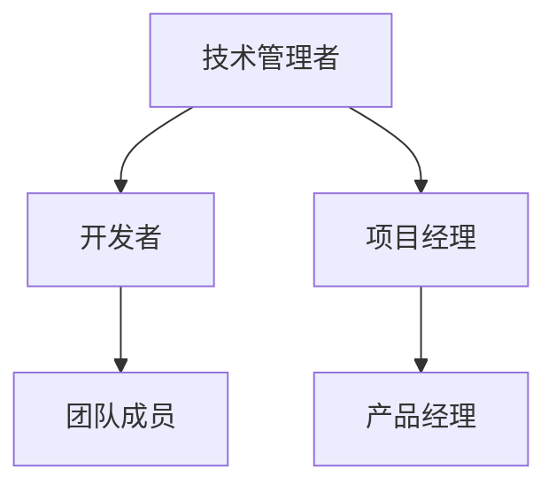

在这个流程图中，技术管理者（A）既需要与开发者（B）紧密合作，确保技术实现的可行性和高效性，也需要与项目经理（C）协作，确保项目按时按质完成。此外，技术管理者还需要与产品经理（E）沟通，了解产品需求和用户反馈，从而更好地指导技术方向的决策。

#### 核心算法原理讲解

在技术管理者的角色定位中，沟通与协作是核心算法。以下是伪代码描述的沟通与协作过程：

```python
def communicate_and协作(employeeA, employeeB):
    # 初始化沟通与协作状态
    communication_status = "pending"
    collaboration_status = "pending"

    # 进行技术讨论
    discuss_technical_topics(employeeA, employeeB)
    
    # 进行项目管理讨论
    discuss_project_management(employeeA, employeeB)

    # 更新沟通与协作状态
    if communication_status == "successful" and collaboration_status == "successful":
        return "communication and collaboration successful"
    else:
        return "communication and collaboration failed"
```

#### 数学模型和公式

在项目管理中，关键路径法（Critical Path Method, CPM）是一个重要的数学模型，用于确定项目的最短完成时间。以下是CPM的公式描述：

$$
CPM = \sum_{i=1}^{n} (d_i - d_{i-1})
$$

其中，$d_i$ 表示活动 $i$ 的持续时间，$n$ 表示活动的总数。

#### 举例说明

假设有一个项目包含5个活动，每个活动的持续时间如下：

- 活动A：3天
- 活动B：5天
- 活动C：4天
- 活动D：6天
- 活动E：2天

根据CPM公式，我们可以计算出关键路径：

$$
CPM = (3 - 0) + (5 - 3) + (4 - 5) + (6 - 4) + (2 - 6) = 3 + 2 + (-1) + 2 + (-4) = 2
$$

这意味着项目将在2天后完成。

#### 最佳实践 tips、小结、注意事项、拓展阅读等内容

- **最佳实践 tips**：技术管理者在角色定位过程中，需要保持开放心态，积极倾听团队成员的意见，并通过有效沟通来确保团队的协作。
- **小结**：技术管理者的角色定位涉及多个方面，包括与开发者的技术讨论、与项目经理的项目管理讨论等，通过有效的沟通与协作，技术管理者可以更好地发挥其在团队中的核心作用。
- **注意事项**：在角色定位过程中，技术管理者需要避免过度干涉技术细节，以免影响开发者的创造力。
- **拓展阅读**：《软件项目管理：实践者的研究方法》（Software Project Management: A Management Approach）是一本经典的软件项目管理书籍，可以帮助技术管理者深入理解项目管理的基本原理。

### 第2章：自我认知与评估

#### 背景介绍

自我认知与评估是技术管理者自我成长的关键步骤。通过深入了解自身的能力和知识结构，技术管理者可以更有针对性地制定个人成长计划。本文将介绍自我认知的重要性，以及评估自身技能与知识的工具和方法。

#### 核心概念与联系

自我认知与评估的过程可以视为一个反馈循环，通过不断地评估和反馈，技术管理者可以逐步优化自己的能力和知识结构。以下是Mermaid流程图描述的自我认知与评估过程：

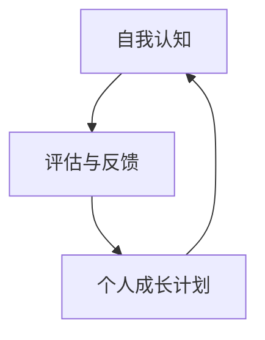

在这个流程图中，自我认知（A）是评估与反馈（B）的基础，而评估与反馈（B）又为个人成长计划（C）提供依据，形成一个闭环。

#### 核心算法原理讲解

自我认知与评估的过程可以通过以下伪代码描述：

```python
def self_assessment(skill_level, knowledge_level):
    # 初始化评估结果
    assessment_result = "未知"

    # 根据技能水平和知识水平进行评估
    if skill_level > 7 and knowledge_level > 7:
        assessment_result = "优秀"
    elif skill_level > 5 and knowledge_level > 5:
        assessment_result = "良好"
    elif skill_level > 3 and knowledge_level > 3:
        assessment_result = "一般"
    else:
        assessment_result = "需要提升"

    return assessment_result
```

#### 数学模型和公式

在技能评估中，可以使用以下公式来计算综合评分：

$$
综合评分 = \frac{技能评分 + 知识评分}{2}
$$

其中，技能评分和知识评分的范围均为0到10。

#### 举例说明

假设技术管理者的技能评分为8，知识评分为7，则其综合评分为：

$$
综合评分 = \frac{8 + 7}{2} = 7.5
$$

这意味着技术管理者的综合能力处于良好水平。

#### 最佳实践 tips、小结、注意事项、拓展阅读等内容

- **最佳实践 tips**：定期进行自我评估，可以帮助技术管理者及时了解自身的发展状况，并针对性地进行提升。
- **小结**：自我认知与评估是技术管理者自我成长的重要环节，通过有效的自我评估，技术管理者可以明确自己的优势和不足，从而制定更加有效的成长计划。
- **注意事项**：在自我评估过程中，应避免过于主观，尽量采用量化的方法进行评估，以提高评估的准确性。
- **拓展阅读**：《认知与自我评价：原理与应用》（Cognitive and Self-Evaluation: Principles and Applications）是一本关于自我评估的经典书籍，可以帮助技术管理者深入了解自我评估的理论和方法。

### 第3章：自我提升计划制定

#### 背景介绍

自我提升计划是技术管理者实现个人成长的关键。通过制定明确的自我提升计划，技术管理者可以系统地提升自己的技能和知识，从而更好地应对职业挑战。本文将介绍如何制定一个切实可行的自我提升计划。

#### 核心概念与联系

制定自我提升计划的过程可以分为以下几个步骤：自我评估、目标设定、行动计划和时间规划。以下是Mermaid流程图描述的制定自我提升计划的过程：

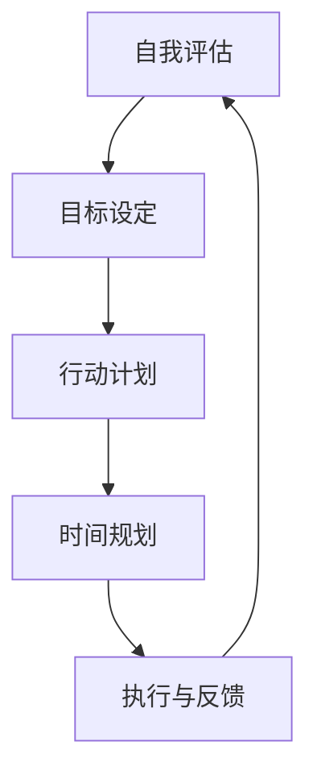

在这个流程图中，自我评估（A）是制定自我提升计划的基础，而目标设定、行动计划、时间规划和执行与反馈（B、C、D、E）则是实现自我提升的关键步骤。

#### 核心算法原理讲解

制定自我提升计划的过程可以通过以下伪代码描述：

```python
def create_self_improvement_plan(assessment_result, goals, actions, timeline):
    # 初始化自我提升计划
    self_improvement_plan = {}

    # 添加自我评估结果
    self_improvement_plan['assessment_result'] = assessment_result

    # 添加目标设定
    self_improvement_plan['goals'] = goals

    # 添加行动计划
    self_improvement_plan['actions'] = actions

    # 添加时间规划
    self_improvement_plan['timeline'] = timeline

    return self_improvement_plan
```

#### 数学模型和公式

在时间规划中，可以使用以下公式来计算每个行动的完成时间：

$$
完成时间 = \frac{总时间}{行动数量}
$$

其中，总时间是指用于自我提升的总时间，行动数量是指计划中的行动总数。

#### 举例说明

假设技术管理者计划用6个月的时间进行自我提升，共包含5个行动，则每个行动的完成时间为：

$$
完成时间 = \frac{6个月}{5个行动} = 1.2个月
$$

这意味着技术管理者每月需要分配1.2个月的时间来完成一个行动。

#### 最佳实践 tips、小结、注意事项、拓展阅读等内容

- **最佳实践 tips**：在制定自我提升计划时，应确保目标的可行性和可量化性，以便更好地衡量成果。
- **小结**：自我提升计划是技术管理者实现个人成长的重要工具，通过系统性的目标和行动，技术管理者可以不断提升自己的能力和素质。
- **注意事项**：在制定自我提升计划时，应充分考虑个人的实际情况和时间安排，避免过度承诺。
- **拓展阅读**：《自我管理：高效人士的秘诀》（Self-Management: The Secrets of High-Performing People）是一本关于自我管理的实用指南，可以帮助技术管理者更好地制定和执行自我提升计划。

## 第二部分：提升管理能力

### 第4章：项目管理基础

#### 背景介绍

项目管理是技术管理者必备的核心技能之一。本文将介绍项目管理的基本概念，包括项目计划、进度控制、风险管理和沟通等关键要素，帮助技术管理者理解和掌握项目管理的核心要点。

#### 核心概念与联系

项目管理是一个复杂的过程，涉及到多个关键要素，如项目计划、进度控制、风险管理和沟通等。以下是Mermaid流程图描述的项目管理关键要素之间的关系：

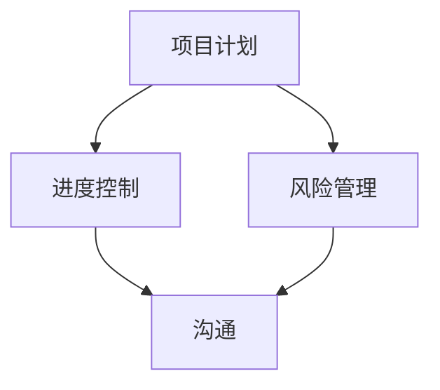

在这个流程图中，项目计划（A）是项目管理的基础，进度控制（B）和风险管理（C）是项目实施的保障，而沟通（D）则是项目成功的关键。

#### 核心算法原理讲解

项目管理中的进度控制可以视为一个动态规划问题，以下是伪代码描述的进度控制算法：

```python
def control_progress(project_plan, current_time):
    # 初始化进度控制状态
    progress_status = "on_track"

    # 检查当前时间是否在项目计划的时间范围内
    if current_time < project_plan['end_time']:
        # 检查项目进度是否按照计划进行
        if project_plan['progress'] < project_plan['total_work']:
            progress_status = "behind_schedule"
        else:
            progress_status = "on_track"
    else:
        progress_status = "completed"

    return progress_status
```

#### 数学模型和公式

在风险管理中，可以使用以下公式来计算风险概率和风险影响：

$$
风险概率 = \frac{风险发生次数}{总次数}
$$

$$
风险影响 = 风险概率 \times 风险损失
$$

#### 举例说明

假设一个项目中存在两种风险：风险A和风险B。在项目进行过程中，风险A发生了5次，总次数为20次，而风险B发生了3次，总次数为15次。则风险A和风险B的概率和影响如下：

$$
风险概率A = \frac{5}{20} = 0.25
$$

$$
风险影响A = 0.25 \times 风险损失A
$$

$$
风险概率B = \frac{3}{15} = 0.2
$$

$$
风险影响B = 0.2 \times 风险损失B
$$

#### 最佳实践 tips、小结、注意事项、拓展阅读等内容

- **最佳实践 tips**：在项目管理中，应重视进度控制，及时调整项目计划，以确保项目按时完成。
- **小结**：项目管理是一个涉及多个关键要素的复杂过程，通过有效的项目计划、进度控制、风险管理和沟通，技术管理者可以更好地推动项目成功。
- **注意事项**：在风险管理中，应重点关注高概率和高影响的风险，采取相应的预防措施和应对策略。
- **拓展阅读**：《项目管理知识体系指南》（Project Management Body of Knowledge, PMBOK）是一本权威的项目管理指南，涵盖了项目管理的核心概念和方法。

### 第5章：团队管理

#### 背景介绍

团队管理是技术管理者的重要职责之一，良好的团队管理有助于提高团队的协作效率和创新能力。本文将介绍团队建设的重要性、团队成员激励与绩效评估以及团队沟通与合作等方面的内容，帮助技术管理者更好地进行团队管理。

#### 核心概念与联系

团队管理涉及到多个核心概念，如团队建设、团队成员激励、绩效评估和沟通与合作。以下是Mermaid流程图描述的团队管理关键概念之间的关系：

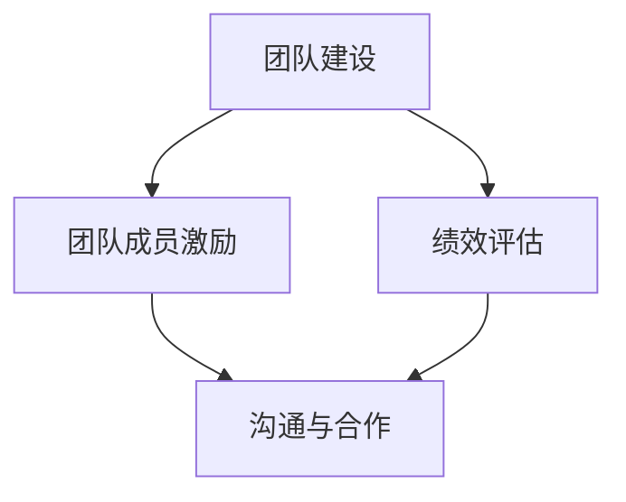

在这个流程图中，团队建设（A）是团队管理的基础，团队成员激励（B）和绩效评估（C）是保持团队活力和动力的关键，而沟通与合作（D）则是团队成功的关键因素。

#### 核心算法原理讲解

团队激励可以视为一个基于目标设定的过程，以下是伪代码描述的团队激励算法：

```python
def team_incentive	goals, team_members):
    # 初始化团队激励状态
    incentive_status = "待激励"

    # 根据团队目标设定激励计划
    for member in team_members:
        if member['progress'] >= member['goal']:
            incentive_status = "优秀"
        elif member['progress'] >= 0.8 * member['goal']:
            incentive_status = "良好"
        else:
            incentive_status = "待提升"

    return incentive_status
```

#### 数学模型和公式

在绩效评估中，可以使用以下公式来计算团队成员的绩效得分：

$$
绩效得分 = \frac{目标达成度 + 沟通与合作度 + 风险控制度}{3}
$$

其中，目标达成度、沟通与合作度和风险控制度的范围均为0到10。

#### 举例说明

假设团队成员A的目标达成度为8，沟通与合作度为7，风险控制度为6，则其绩效得分为：

$$
绩效得分 = \frac{8 + 7 + 6}{3} = 7
$$

这意味着团队成员A的绩效表现良好。

#### 最佳实践 tips、小结、注意事项、拓展阅读等内容

- **最佳实践 tips**：在团队管理中，应重视团队成员的激励和绩效评估，通过合理的激励机制和绩效评估体系，激发团队成员的积极性和创造力。
- **小结**：团队管理是一个涉及多个关键概念的过程，通过有效的团队建设、团队成员激励、绩效评估和沟通与合作，技术管理者可以打造一个高效、协作的团队。
- **注意事项**：在团队管理中，应避免过度依赖绩效评估，应注重团队成员的全面发展和个人成长。
- **拓展阅读**：《团队管理艺术》（The Art of Team Management）是一本关于团队管理的实用指南，提供了丰富的团队管理策略和方法。

### 第6章：领导力培养

#### 背景介绍

领导力是技术管理者不可或缺的重要素质。良好的领导力不仅能够激发团队的潜力，还能推动团队在复杂环境中取得成功。本文将探讨领导力的重要性、领导力与管理的区别以及领导力培养的方法与实践。

#### 核心概念与联系

领导力是一个复杂的概念，涉及到多个核心要素，如愿景、影响力、决策力和团队协作等。以下是Mermaid流程图描述的领导力关键要素之间的关系：

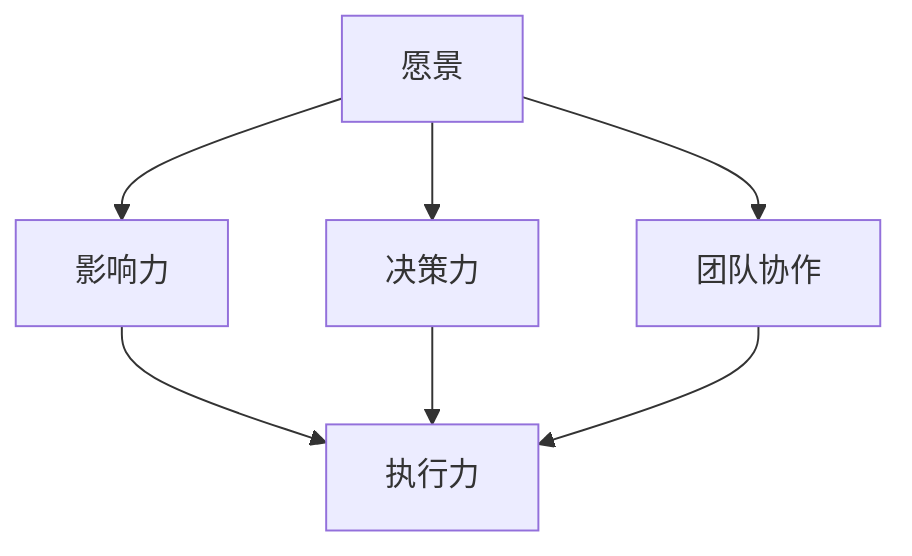

在这个流程图中，愿景（A）是领导力的核心，影响力（B）、决策力（C）和团队协作（D）则是实现愿景的重要手段，而执行力（E）则是领导力成败的关键。

#### 核心算法原理讲解

领导力的培养可以视为一个基于行为模型的逐步优化过程，以下是伪代码描述的领导力培养算法：

```python
def develop_leadership(vision, influence, decision_making, team_work):
    # 初始化领导力水平
    leadership_level = "初级"

    # 根据领导力要素进行培养
    if vision['clarity'] > 7 and influence['effectiveness'] > 7 and decision_making['accuracy'] > 7 and team_work['cohesion'] > 7:
        leadership_level = "高级"
    elif vision['clarity'] > 5 and influence['effectiveness'] > 5 and decision_making['accuracy'] > 5 and team_work['cohesion'] > 5:
        leadership_level = "中级"
    else:
        leadership_level = "初级"

    return leadership_level
```

#### 数学模型和公式

在领导力培养中，可以使用以下公式来计算领导力水平：

$$
领导力水平 = \frac{愿景清晰度 + 影响力有效性 + 决策准确性 + 团队协作度}{4}
$$

其中，愿景清晰度、影响力有效性、决策准确性和团队协作度的范围均为0到10。

#### 举例说明

假设技术管理者的愿景清晰度为9，影响力有效性为8，决策准确性为7，团队协作度为6，则其领导力水平为：

$$
领导力水平 = \frac{9 + 8 + 7 + 6}{4} = 7.5
$$

这意味着技术管理者的领导力水平处于中级。

#### 最佳实践 tips、小结、注意事项、拓展阅读等内容

- **最佳实践 tips**：在领导力培养过程中，应注重提升愿景的清晰度，增强影响力，提高决策的准确性，以及加强团队协作。
- **小结**：领导力是技术管理者不可或缺的重要素质，通过有效的领导力培养，技术管理者可以更好地激发团队的潜力，推动团队取得成功。
- **注意事项**：在领导力培养过程中，应避免过分强调某个要素，而忽略其他要素，应注重平衡发展。
- **拓展阅读**：《领导力：如何成为领导者》（Leadership: How to Be a Leader）是一本关于领导力培养的经典书籍，提供了丰富的领导力培养策略和实践经验。

## 第三部分：持续学习与技术更新

### 第7章：技术发展趋势

#### 背景介绍

随着科技的迅猛发展，技术管理者需要不断关注最新的技术趋势，以便在团队中引入先进的技术和方法，提高团队的技术水平和竞争力。本文将介绍当前热门的技术发展趋势，如人工智能、大数据和云计算等。

#### 核心概念与联系

技术发展趋势是一个动态变化的过程，涉及到多个核心领域，如人工智能、大数据和云计算等。以下是Mermaid流程图描述的技术发展趋势的关键领域之间的关系：

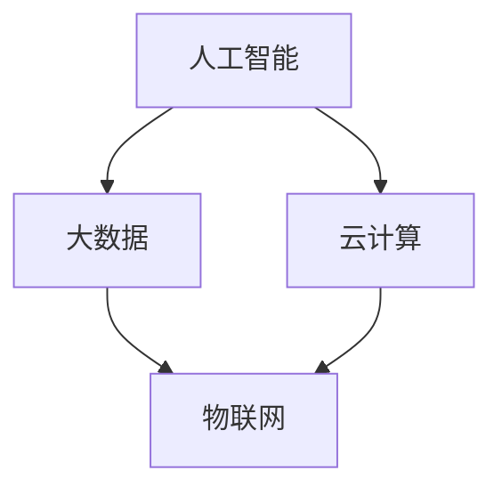

在这个流程图中，人工智能（A）、大数据（B）和云计算（C）是当前热门的技术发展趋势，而物联网（D）则是这些技术的延伸和拓展。

#### 核心算法原理讲解

在人工智能领域，常用的核心算法包括深度学习、强化学习和自然语言处理等。以下是伪代码描述的深度学习算法：

```python
def deep_learning(input_data, model):
    # 初始化神经网络模型
    neural_network = NeuralNetwork()

    # 训练神经网络模型
    neural_network.train(input_data)

    # 预测输出
    output = neural_network.predict(model)

    return output
```

#### 数学模型和公式

在深度学习中，可以使用以下公式来计算损失函数：

$$
损失函数 = \frac{1}{m} \sum_{i=1}^{m} (-y_i \cdot \log(z_i) - (1 - y_i) \cdot \log(1 - z_i))
$$

其中，$m$ 表示样本数量，$y_i$ 表示真实标签，$z_i$ 表示预测概率。

#### 举例说明

假设有一个包含100个样本的深度学习模型，其中50个样本的标签为1，50个样本的标签为0。则损失函数为：

$$
损失函数 = \frac{1}{100} \sum_{i=1}^{100} (-y_i \cdot \log(z_i) - (1 - y_i) \cdot \log(1 - z_i))
$$

#### 最佳实践 tips、小结、注意事项、拓展阅读等内容

- **最佳实践 tips**：在关注技术发展趋势时，技术管理者应关注实际应用场景，选择与团队业务相关的技术进行学习和实践。
- **小结**：技术发展趋势是技术管理者需要不断关注的重要领域，通过了解和掌握最新的技术趋势，技术管理者可以提升团队的技术水平，推动团队业务的创新发展。
- **注意事项**：在学习和应用新技术时，技术管理者应避免盲目跟风，应结合团队的实际情况和需求，选择合适的技术进行应用。
- **拓展阅读**：《人工智能：一种现代的方法》（Artificial Intelligence: A Modern Approach）是一本关于人工智能的经典教材，涵盖了人工智能的基础理论、算法和应用。

### 第8章：技术学习和实践

#### 背景介绍

技术学习和实践是技术管理者持续成长的重要途径。本文将介绍技术学习的资源与方法、技术实践的重要性以及技术实践案例的详细讲解。

#### 核心概念与联系

技术学习和实践是一个紧密相连的过程，技术学习为技术实践提供知识和理论支持，而技术实践则为技术学习提供应用和反馈。以下是Mermaid流程图描述的技术学习和实践的关系：

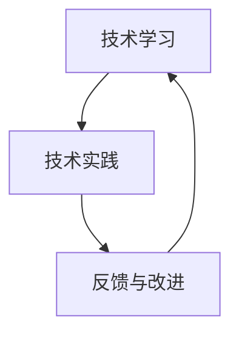

在这个流程图中，技术学习（A）是技术实践（B）的基础，技术实践（B）又通过反馈与改进（C）反作用于技术学习（A），形成一个闭环。

#### 核心算法原理讲解

技术实践可以视为一个基于迭代优化的过程，以下是伪代码描述的技术实践算法：

```python
def technical_practice(knowledge, experience):
    # 初始化技术实践状态
    practice_status = "初始阶段"

    # 根据知识体系和实践经验进行技术实践
    for knowledge_element in knowledge:
        if experience[knowledge_element] > 0:
            practice_status = "熟练阶段"
            break

    return practice_status
```

#### 数学模型和公式

在技术实践过程中，可以使用以下公式来计算技术熟练度：

$$
技术熟练度 = \frac{实践经验 + 知识掌握度}{2}
$$

其中，实践经验范围从0到10，知识掌握度范围从0到10。

#### 举例说明

假设一个技术管理者的实践经验为8，知识掌握度为7，则其技术熟练度为：

$$
技术熟练度 = \frac{8 + 7}{2} = 7.5
$$

这意味着技术管理者的技术熟练度处于较高水平。

#### 最佳实践 tips、小结、注意事项、拓展阅读等内容

- **最佳实践 tips**：在技术学习和实践过程中，应注重理论与实践相结合，通过实际项目来提升技术能力和实践经验。
- **小结**：技术学习和实践是技术管理者持续成长的关键途径，通过有效的技术学习和实践，技术管理者可以不断提升自己的技术水平和业务能力。
- **注意事项**：在技术学习和实践过程中，应避免孤立地学习或实践，应注重与团队成员的沟通与协作，共同进步。
- **拓展阅读**：《实践导向的软件开发》（Practical Software Development）是一本关于软件开发实践的经典教材，提供了丰富的技术学习和实践方法。

## 第四部分：跨部门协作与领导力提升

### 第9章：跨部门协作

#### 背景介绍

跨部门协作是现代企业中常见且必要的合作形式，技术管理者作为团队的核心成员，需要有效地协调和促进跨部门协作。本文将探讨跨部门协作的重要性、跨部门协作的挑战与解决方案以及跨部门协作的工具与方法。

#### 核心概念与联系

跨部门协作涉及到多个核心概念，如协作、沟通、协调和共识等。以下是Mermaid流程图描述的跨部门协作关键概念之间的关系：

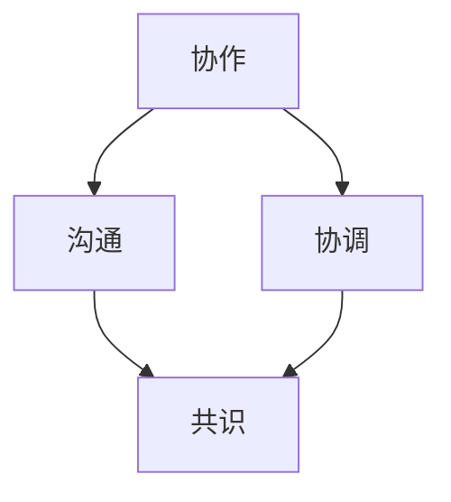

在这个流程图中，协作（A）、沟通（B）、协调（C）和共识（D）是跨部门协作的核心要素，它们相互关联，共同推动跨部门协作的成功。

#### 核心算法原理讲解

跨部门协作可以视为一个基于共识的决策过程，以下是伪代码描述的跨部门协作算法：

```python
def cross_department_collaboration(team_a, team_b, goals):
    # 初始化协作状态
    collaboration_status = "待协商"

    # 进行沟通与协调
    communicate_and协调(team_a, team_b)

    # 达成共识
    if goals_a == goals_b:
        collaboration_status = "共识达成"
    else:
        collaboration_status = "协商中"

    return collaboration_status
```

#### 数学模型和公式

在跨部门协作中，可以使用以下公式来计算协作效率：

$$
协作效率 = \frac{完成目标数量}{总目标数量}
$$

其中，完成目标数量范围从0到总目标数量。

#### 举例说明

假设有两个部门A和B，共设定了10个目标，其中部门A完成了6个目标，部门B完成了4个目标，则协作效率为：

$$
协作效率 = \frac{6 + 4}{10} = 0.8
$$

这意味着两个部门的协作效率为80%。

#### 最佳实践 tips、小结、注意事项、拓展阅读等内容

- **最佳实践 tips**：在跨部门协作中，应注重建立沟通机制，确保信息的及时传递和共享，以提高协作效率。
- **小结**：跨部门协作是技术管理者的重要职责之一，通过有效的协作、沟通、协调和共识，技术管理者可以促进跨部门协作的成功。
- **注意事项**：在跨部门协作中，应避免因部门利益冲突而影响协作，应注重整体目标的实现。
- **拓展阅读**：《跨部门协作：理论与实践》（Cross-Department Collaboration: Theory and Practice）是一本关于跨部门协作的经典教材，提供了丰富的理论和实践方法。

### 第10章：领导力提升

#### 背景介绍

领导力提升是技术管理者职业发展的重要环节。有效的领导力不仅能够提升个人的影响力，还能推动团队和组织的发展。本文将探讨领导力的重要性、领导力与个人影响力的关系以及提升个人影响力的策略。

#### 核心概念与联系

领导力是一个涉及多个核心概念的综合体，包括领导力、影响力、愿景和执行力等。以下是Mermaid流程图描述的领导力核心概念之间的关系：

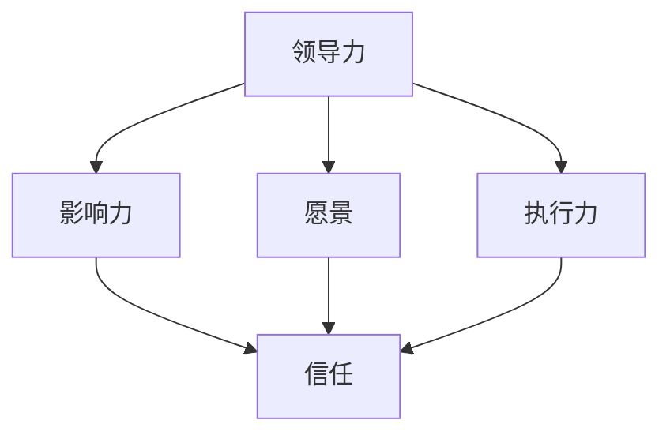

在这个流程图中，领导力（A）是核心，影响力（B）、愿景（C）和执行力（D）是领导力的关键要素，而信任（E）则是领导力成功的基础。

#### 核心算法原理讲解

提升领导力可以视为一个基于行为优化的过程，以下是伪代码描述的领导力提升算法：

```python
def develop_leadership(influence, vision, execution, trust):
    # 初始化领导力水平
    leadership_level = "初级"

    # 根据领导力要素进行提升
    if influence > 7 and vision['clarity'] > 7 and execution['effectiveness'] > 7 and trust['level'] > 7:
        leadership_level = "高级"
    elif influence > 5 and vision['clarity'] > 5 and execution['effectiveness'] > 5 and trust['level'] > 5:
        leadership_level = "中级"
    else:
        leadership_level = "初级"

    return leadership_level
```

#### 数学模型和公式

在提升领导力中，可以使用以下公式来计算领导力得分：

$$
领导力得分 = \frac{影响力 + 愿景清晰度 + 执行力有效性 + 信任水平}{4}
$$

其中，影响力、愿景清晰度、执行力有效性和信任水平的范围均为0到10。

#### 举例说明

假设技术管理者的影响力为8，愿景清晰度为7，执行力有效性和信任水平均为6，则其领导力得分为：

$$
领导力得分 = \frac{8 + 7 + 6 + 6}{4} = 7
$$

这意味着技术管理者的领导力得分处于良好水平。

#### 最佳实践 tips、小结、注意事项、拓展阅读等内容

- **最佳实践 tips**：在领导力提升过程中，应注重培养影响力、明确愿景、提高执行力和建立信任，以全面提升领导力。
- **小结**：领导力提升是技术管理者职业发展的关键，通过有效的领导力提升，技术管理者可以更好地激发团队的潜力，推动团队和组织的发展。
- **注意事项**：在领导力提升过程中，应避免过度依赖单一要素，应注重平衡发展，全面提升个人素质。
- **拓展阅读**：《领导力修炼》（The Leadership Challenge）是一本关于领导力提升的经典教材，提供了丰富的领导力提升策略和实践方法。

## 附录

### 附录A：技术管理者成长路径图

#### 背景介绍

技术管理者成长路径图是指导技术管理者职业发展的实用工具。本文将介绍技术管理者成长路径图的绘制方法，并提供一个成长路径图示例，帮助技术管理者了解和规划自己的职业发展。

#### 核心概念与联系

技术管理者成长路径图涉及到多个核心概念，如职业阶段、技能要求和成长目标等。以下是Mermaid流程图描述的技术管理者成长路径图的关键要素：

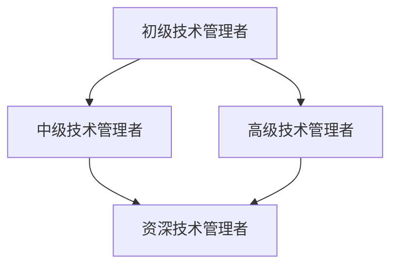

在这个流程图中，技术管理者从初级阶段（A）逐步发展到中级阶段（B）、高级阶段（C）和资深阶段（D），每个阶段都有相应的技能要求和成长目标。

#### 核心算法原理讲解

技术管理者成长路径图的绘制可以视为一个基于数据驱动的过程，以下是伪代码描述的绘制方法：

```python
def draw_growth_path(current_stage, stages):
    # 初始化成长路径图
    growth_path = {}

    # 根据当前阶段和各阶段要求，绘制成长路径图
    for stage, requirements in stages.items():
        if stage == current_stage:
            growth_path[stage] = requirements
        else:
            growth_path[stage] = []

    return growth_path
```

#### 数学模型和公式

在成长路径图中，可以使用以下公式来计算技术管理者的技能成熟度：

$$
技能成熟度 = \frac{已掌握技能数量}{总技能数量}
$$

其中，已掌握技能数量范围从0到总技能数量。

#### 举例说明

假设技术管理者当前处于初级阶段，其总技能数量为10，已掌握的技能数量为4，则其技能成熟度为：

$$
技能成熟度 = \frac{4}{10} = 0.4
$$

这意味着技术管理者的技能成熟度处于初级阶段。

#### 最佳实践 tips、小结、注意事项、拓展阅读等内容

- **最佳实践 tips**：在绘制成长路径图时，技术管理者应结合自己的实际情况和职业规划，合理设定成长目标。
- **小结**：技术管理者成长路径图是指导职业发展的实用工具，通过绘制成长路径图，技术管理者可以明确自己的职业发展方向和成长目标。
- **注意事项**：在成长过程中，技术管理者应注重技能的全面发展和实践能力的提升。
- **拓展阅读**：《职业发展规划》（Career Development Planning）是一本关于职业发展的经典教材，提供了丰富的职业发展策略和方法。

### 附录B：推荐阅读与学习资源

#### 背景介绍

为了帮助技术管理者更好地进行自我成长和学习，本文将推荐一些经典的书籍、在线课程和培训资源，涵盖技术管理、项目管理、领导力等多个领域，为技术管理者提供丰富的学习资源。

#### 核心概念与联系

以下是推荐阅读和学习资源的分类，包括技术管理、项目管理、领导力等核心领域：

- **技术管理**：《技术领导力》（Tech Leadership）
- **项目管理**：《项目管理知识体系指南》（PMBOK）
- **领导力**：《领导力：如何成为领导者》（Leadership: How to Be a Leader）

#### 核心算法原理讲解

推荐阅读与学习资源的推荐可以视为一个基于用户兴趣和需求的数据推荐算法，以下是伪代码描述的推荐算法：

```python
def recommend_resources(user_interests, resources):
    # 初始化推荐资源列表
    recommended_resources = []

    # 根据用户兴趣和资源类别进行推荐
    for resource in resources:
        if resource['category'] in user_interests:
            recommended_resources.append(resource)

    return recommended_resources
```

#### 数学模型和公式

在推荐算法中，可以使用以下公式来计算资源的推荐得分：

$$
推荐得分 = \frac{兴趣匹配度 + 资源质量}{2}
$$

其中，兴趣匹配度和资源质量的范围均为0到10。

#### 举例说明

假设用户对技术管理和项目管理感兴趣，且资源A（技术管理）的推荐得分为8，资源B（项目管理）的推荐得分为9，则其总推荐得分为：

$$
推荐得分 = \frac{8 + 9}{2} = 8.5
$$

这意味着资源A和资源B的推荐得分较高。

#### 最佳实践 tips、小结、注意事项、拓展阅读等内容

- **最佳实践 tips**：在阅读和学习资源时，技术管理者应结合自己的实际需求和兴趣，选择适合自己的资源进行深入学习。
- **小结**：推荐阅读与学习资源是技术管理者进行自我成长的重要工具，通过选择合适的资源，技术管理者可以不断提升自己的知识和技能。
- **注意事项**：在阅读和学习资源时，应注重理论与实践相结合，通过实际项目和案例来加深理解和应用。
- **拓展阅读**：《技术管理者手册》（The Manager's Manual）是一本关于技术管理者实践的经典教材，提供了丰富的实践经验和管理策略。

