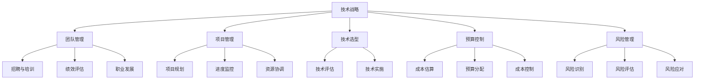

                 

### 引言

在当今快速发展的信息技术领域，技术管理者扮演着至关重要的角色。他们不仅需要具备扎实的技术背景，还需要具备出色的管理能力和领导力。然而，随着技术环境的不断变化，技术管理者面临着越来越多的挑战，如何实现自我成长和领导力的持续进化成为了一个亟待解决的问题。

本文旨在探讨技术管理者的自我成长路径，并深入分析持续进化的领导力在技术管理中的应用。我们将从多个维度展开讨论，包括技术管理者的角色与职责、自我成长的路径与方法、领导力的核心要素以及成功的技术管理者成长案例等。

通过本文的阅读，读者将能够了解技术管理者应如何通过持续学习和实践来实现自我成长，并在领导力方面不断提升，从而更好地应对技术环境的变革。

### 背景介绍

技术管理者在当今企业中的角色日益重要。他们不仅需要具备深厚的技术知识，还要具备出色的管理能力和领导力。技术管理者通常负责制定技术战略、管理技术团队、推动技术创新以及确保项目按时交付。他们的职责涉及多个方面，包括项目管理、团队建设、技术选型、预算控制和风险管理等。

首先，技术管理者的职责包括技术战略的制定和执行。技术管理者需要根据企业的业务需求和市场趋势，制定符合企业长远发展目标的技术战略。这包括评估现有技术的不足和潜力，提出技术改进方案，以及推动新技术的应用。

其次，技术管理者在团队建设方面发挥着关键作用。他们需要招聘、培训和管理技术团队，确保团队具备完成项目所需的技能和知识。此外，技术管理者还需关注团队成员的职业发展，提供成长机会，激励团队士气，促进团队协作。

此外，技术管理者还需在项目管理和预算控制方面发挥重要作用。他们需要确保项目按照预定时间和预算顺利完成，同时保证项目质量。这包括制定项目计划、分配任务、监控项目进度、协调内外部资源以及处理项目中的各种风险。

最后，技术管理者在风险管理方面也承担着重要职责。他们需要识别和评估项目中的风险，制定风险应对策略，并确保风险在可控范围内。这包括制定应急预案、监控风险变化以及及时调整项目计划。

综上所述，技术管理者的角色和职责是多方面的，他们需要具备丰富的技术知识、出色的管理能力和领导力，以应对不断变化的技术环境和企业需求。

### 技术管理者的核心概念：角色与职责

为了更好地理解技术管理者的角色与职责，我们需要从以下几个方面进行详细探讨：

#### 1. 技术管理者的定义

技术管理者，通常是指在企业中负责技术方向的管理人员。他们不仅具备深厚的专业知识，还需要具备管理能力，能够领导和管理技术团队，推动技术项目的发展和实施。技术管理者在企业中的角色类似于技术领导者，但其职责更侧重于管理和技术执行的结合。

#### 2. 技术管理者的职责范围

技术管理者的职责范围非常广泛，主要包括以下几个方面：

- **技术战略制定与执行**：技术管理者需要根据企业的发展方向和市场需求，制定和执行技术战略。这包括评估现有技术、提出改进方案、制定技术路线图等。
- **团队管理与建设**：技术管理者负责管理技术团队，包括招聘、培训、绩效评估和职业发展等。他们需要确保团队成员具备完成项目所需的技能和知识，并促进团队协作和士气。
- **项目管理**：技术管理者在项目管理中扮演关键角色，包括项目规划、进度监控、资源协调、风险管理等。他们需要确保项目按时、按预算高质量地完成。
- **技术选型与实施**：技术管理者需要根据项目需求和业务目标，选择合适的技术方案，并推动技术的实施和应用。
- **预算控制**：技术管理者需要管理项目预算，确保项目在预算范围内完成。这包括成本估算、预算分配、成本控制等。
- **风险管理**：技术管理者需要识别和评估项目中的风险，制定应对策略，确保风险在可控范围内。

#### 3. 技术管理者与项目经理的区别

虽然技术管理者在项目管理中发挥着重要作用，但他们与项目经理之间存在一些区别：

- **职责重点**：项目经理主要负责项目的具体实施，确保项目按计划进行。技术管理者则更多地关注技术战略和团队管理，关注项目的长期发展和团队成长。
- **角色定位**：项目经理通常是一个执行角色，专注于项目目标的实现。技术管理者则更多地扮演领导角色，关注团队和技术的长远发展。
- **技能要求**：项目经理需要具备出色的组织和沟通能力，能够有效地管理项目进度和资源。技术管理者则除了这些技能外，还需要具备深厚的专业知识和领导力。

通过上述讨论，我们可以看出技术管理者的角色和职责是多方面的，他们需要同时具备技术知识和领导力，以应对复杂多变的技术环境和业务需求。

#### 4. 技术管理者的核心概念与联系

为了更好地理解技术管理者的角色和职责，我们引入一个核心概念架构，通过Mermaid流程图来展示各个概念之间的关系：

这个流程图清晰地展示了技术管理者的核心概念及其之间的联系。从技术战略开始，技术管理者需要制定和执行技术战略，这涉及到团队管理、项目管理、技术选型、预算控制和风险管理等多个方面。团队管理包括招聘与培训、绩效评估和职业发展，确保团队成员具备完成项目所需的技能和知识。项目管理则包括项目规划、进度监控、资源协调等，确保项目按时、按预算完成。技术选型和技术实施则关注如何选择和实施合适的技术方案，预算控制和风险管理则确保项目在预算范围内完成，并有效管理风险。

#### 5. 核心概念与联系的解释

通过上述流程图，我们可以更直观地理解技术管理者的核心概念及其之间的联系：

- **技术战略**：技术管理者需要根据企业的发展方向和市场需求，制定符合企业长远发展目标的技术战略。这包括评估现有技术、提出改进方案、制定技术路线图等。
- **团队管理**：技术管理者负责管理技术团队，包括招聘、培训、绩效评估和职业发展等。通过这些活动，确保团队成员具备完成项目所需的技能和知识，并促进团队协作和士气。
- **项目管理**：技术管理者在项目管理中扮演关键角色，包括项目规划、进度监控、资源协调、风险管理等。确保项目按时、按预算高质量地完成。
- **技术选型**：技术管理者需要根据项目需求和业务目标，选择合适的技术方案。这包括评估不同技术的优缺点，选择最适合项目的技术。
- **预算控制**：技术管理者需要管理项目预算，确保项目在预算范围内完成。这包括成本估算、预算分配、成本控制等。
- **风险管理**：技术管理者需要识别和评估项目中的风险，制定应对策略，确保风险在可控范围内。通过风险管理，技术管理者可以降低项目风险，提高项目成功率。

通过这个流程图，我们可以清晰地看到技术管理者的核心概念及其之间的联系。这些概念相互关联，共同构成了技术管理者在企业发展中的核心职责和角色。

### 技术管理者的成长路径

技术管理者的成长路径可以分为三个主要阶段：初级技术管理者、中级技术管理者和高级技术管理者。每个阶段都有其独特的成长路径和关键能力要求。

#### 1. 初级技术管理者

初级技术管理者通常是从技术专家或工程师转型而来的。他们在成长过程中需要掌握以下关键能力：

- **技术能力**：作为初级技术管理者，他们需要继续提升自己在某一领域的技术能力，成为团队中的技术专家。这包括掌握最新的技术趋势、解决复杂的技术问题以及进行技术预研。
- **基本管理能力**：初级技术管理者需要学习基本的管理技能，如团队沟通、任务分配和绩效评估。这些能力帮助他们更好地协调团队成员的工作，提高团队效率。
- **业务理解**：初级技术管理者需要加强对企业业务的理解，了解业务需求和目标，以便更好地将技术解决方案与业务战略相结合。

#### 2. 中级技术管理者

中级技术管理者通常具备一定的管理经验，并开始承担更重要的管理职责。他们在成长过程中需要掌握以下关键能力：

- **高级管理能力**：中级技术管理者需要进一步提升自己的管理能力，包括团队领导、战略规划和资源管理。他们需要学会如何激励和培养团队成员，如何制定有效的项目计划，以及如何优化资源配置。
- **跨部门协作**：中级技术管理者需要增强跨部门协作的能力，学会与其他部门的同事进行有效沟通和合作，确保项目顺利进行。
- **业务洞察力**：中级技术管理者需要提升对业务的洞察力，能够从业务角度出发，评估技术方案对业务的影响，并提出具有前瞻性的建议。

#### 3. 高级技术管理者

高级技术管理者通常在企业中担任重要的技术领导角色，如首席技术官（CTO）或技术副总裁（VP of Technology）。他们在成长过程中需要掌握以下关键能力：

- **战略思维**：高级技术管理者需要具备战略思维能力，能够从企业的全局出发，制定和实施长期技术战略。他们需要了解市场趋势、技术发展方向以及企业的发展目标，确保技术战略与企业的整体战略保持一致。
- **领导力**：高级技术管理者需要具备卓越的领导力，能够带领团队迎接挑战、实现突破。这包括愿景规划、团队建设、领导力培养以及危机处理能力。
- **创新思维**：高级技术管理者需要具备创新思维，能够推动企业进行技术创新，引领企业保持竞争力。他们需要不断探索新技术、新方法，并推动这些创新在企业的应用。

#### 4. 技能提升的方法

无论处于哪个成长阶段，技术管理者都需要持续提升自己的技能。以下是一些常见的方法：

- **继续学习**：技术管理者可以通过参加专业培训、攻读学位或参加在线课程来不断提升自己的知识和技能。例如，可以参加项目管理专业认证（如PMP）、数据科学课程或人工智能相关培训。
- **实践项目**：通过参与实际项目，技术管理者可以锻炼自己的技能，并将所学知识应用到实际工作中。他们可以主动承担具有挑战性的项目，从中积累经验。
- **阅读和研究**：技术管理者可以通过阅读专业书籍、学术论文和技术博客来了解最新的技术动态和行业趋势。这有助于他们保持对前沿技术的敏感性，并在实际工作中应用这些知识。
- **建立人脉**：通过参加行业会议、技术研讨会和社交活动，技术管理者可以结识同行，分享经验和见解。这有助于他们拓展视野、学习新技能，并建立有益的人脉关系。

总之，技术管理者的成长路径是一个不断学习和提升的过程。通过明确每个阶段的关键能力要求，并采取有效的提升方法，技术管理者可以逐步实现自我成长，成为卓越的技术领导者。

### 领导力的核心要素

在技术管理者的自我成长过程中，领导力是不可或缺的一环。领导力不仅决定了技术管理者能否有效地管理团队，还影响到整个团队的士气和项目成功率。以下是领导力的三个核心要素：人际关系管理、沟通技巧和决策能力。

#### 1. 人际关系管理

人际关系管理是领导力的基础。技术管理者需要具备处理复杂人际关系的能力，包括与团队成员、上级领导以及其他部门同事建立和维护良好的关系。以下是一些关键点：

- **了解团队成员**：技术管理者需要了解每个团队成员的兴趣、优势和短板，以便更好地进行任务分配和团队协作。通过与团队成员进行一对一交流，技术管理者可以更好地了解他们的需求和期望。
- **建立信任**：信任是团队协作的基础。技术管理者需要通过透明的沟通、公正的决策和负责任的行为来建立信任。此外，他们还应该鼓励团队成员之间的相互信任，共同营造一个信任和尊重的工作氛围。
- **解决冲突**：在任何团队中，冲突都是不可避免的。技术管理者需要具备解决冲突的能力，通过有效的沟通和调解，找到解决问题的最佳方案。他们应该鼓励团队成员以建设性的方式表达自己的观点，并积极寻求共识。

#### 2. 沟通技巧

沟通技巧是技术管理者成功的关键。有效的沟通不仅能够确保信息准确传递，还能够提高团队的士气和合作效率。以下是一些关键的沟通技巧：

- **明确表达**：技术管理者应该具备清晰、简洁的表达能力，确保团队成员理解任务目标和预期成果。在沟通时，他们应该使用简单明了的语言，避免使用过于专业或复杂的术语。
- **积极倾听**：有效的沟通是双向的。技术管理者需要积极倾听团队成员的意见和建议，了解他们的想法和需求。通过倾听，技术管理者可以更好地理解团队的情况，并做出更合适的决策。
- **反馈与认可**：技术管理者需要给予团队成员及时的反馈，认可他们的工作和成就。这不仅能够提高团队成员的工作积极性，还能够增强团队的凝聚力。
- **跨部门沟通**：技术管理者还需要具备跨部门沟通的能力，能够与其他部门的同事进行有效合作。他们应该了解其他部门的工作职责和需求，以便更好地协调资源和确保项目顺利进行。

#### 3. 决策能力

决策能力是技术管理者的重要素质。技术管理者需要在不同情况下做出明智的决策，确保项目顺利进行。以下是一些关键的决策能力：

- **分析能力**：技术管理者需要具备强大的分析能力，能够从复杂的信息中提取关键点，做出基于数据的决策。他们应该学会使用各种分析工具和方法，如SWOT分析、成本效益分析等。
- **快速决策**：在某些情况下，技术管理者需要迅速做出决策，特别是在紧急情况或时间紧迫的情况下。他们需要具备快速思考和分析的能力，以便在有限的时间内做出最佳决策。
- **风险评估**：在做出决策之前，技术管理者需要评估决策的风险和潜在影响。他们应该考虑所有可能的结果，并制定相应的应对策略。
- **适应性**：技术管理者需要具备适应性，能够根据实际情况调整决策和策略。他们应该灵活应对变化，及时调整计划，确保项目目标的实现。

总之，人际关系管理、沟通技巧和决策能力是技术管理者成功的关键要素。通过不断提升这些能力，技术管理者可以更好地管理团队，推动项目的成功，并在职业生涯中不断成长和进步。

### 领导力的持续进化

领导力是一种动态发展的能力，随着技术环境和社会变化的不断演进，技术管理者需要不断进化自己的领导力，以适应新的挑战。以下是领导力持续进化的几个关键方面。

#### 1. 面对变化的领导力

在信息技术飞速发展的今天，技术环境的变化异常迅速，技术管理者需要具备应对变化的能力。以下是一些具体策略：

- **敏捷思维**：技术管理者应培养敏捷思维，能够快速适应新的技术和市场需求。他们需要学会从变化中捕捉机遇，并迅速调整团队策略和行动方案。
- **持续学习**：技术管理者应保持学习的热情，不断更新自己的知识库，掌握最新的技术趋势和行业动态。通过参加培训、阅读专业书籍和参加行业会议，他们可以保持对前沿技术的敏感性。
- **灵活管理**：技术管理者应具备灵活的管理风格，能够根据不同情境和团队需求，调整管理策略。例如，在面临紧急情况时，他们需要迅速做出决策并采取行动，而在日常工作中，他们则需要更多地进行指导和激励。

#### 2. 创新思维的领导力

创新是技术管理的核心驱动力，技术管理者需要具备创新思维的领导力，推动团队进行技术创新和业务模式创新。以下是一些具体策略：

- **鼓励创新**：技术管理者应营造一个鼓励创新的企业文化，让团队成员敢于尝试新想法和新技术。他们可以设立创新基金、组织创新竞赛或设立创新奖项，激励团队成员提出创新方案。
- **创新机制**：技术管理者应建立有效的创新机制，包括创新项目评估、资源分配和激励机制。通过这些机制，他们可以确保创新项目得到充分支持和资源保障，并能够顺利实施。
- **跨界合作**：技术管理者应鼓励跨界合作，与其他部门和外部合作伙伴共同探索创新机会。通过跨界合作，他们可以借助外部资源和智慧，推动团队的创新突破。

#### 3. 面向未来的领导力

技术管理者不仅需要应对当前的技术挑战，还需要具备面向未来的领导力，为企业的长期发展奠定基础。以下是一些具体策略：

- **技术预见**：技术管理者应具备技术预见能力，能够预测未来技术的发展趋势和潜在影响。通过技术预见，他们可以提前布局，为企业的发展做好准备。
- **战略规划**：技术管理者应制定清晰的技术战略，确保技术发展与企业整体战略保持一致。他们需要根据企业的发展目标和市场需求，制定长期和短期技术规划，并确保规划的实施。
- **人才发展**：技术管理者应重视人才培养和发展，确保企业拥有足够的技术储备和人才梯队。他们可以通过培训、轮岗和项目指导等方式，提升团队成员的技术能力和综合素质。

总之，领导力的持续进化是技术管理者成功的关键。通过面对变化的领导力、创新思维的领导力和面向未来的领导力，技术管理者可以不断提升自己的领导力，带领团队应对各种挑战，实现企业的长期发展目标。

### 成功的技术管理者成长故事

在技术管理领域，有许多成功的技术管理者通过自我成长和领导力的持续进化，成为了行业中的佼佼者。以下介绍几位具有代表性的技术管理者成长故事，以及他们是如何在职业生涯中取得成功的。

#### 1. 从工程师到CTO的转型

李华是一名拥有15年软件开发经验的技术专家，曾在国内一家知名互联网公司担任高级工程师。然而，李华并不满足于仅仅成为一名优秀的工程师，他渴望在技术管理方面实现更大的突破。为了实现这一目标，李华开始系统地学习项目管理、团队管理和领导力等管理知识。

首先，李华参加了PMP（项目管理专业认证）培训，并通过了认证考试，获得了项目管理专业认证。这不仅提升了他的项目管理能力，还使他具备了专业的项目管理知识和方法。接着，李华又参加了领导力培训，学习了如何激励团队、处理冲突和进行有效沟通等领导力技能。

在积累了丰富的管理知识后，李华开始逐步向技术管理岗位转型。他从担任项目经理开始，逐步承担了更多的管理职责。在担任项目经理期间，李华通过有效的项目管理和团队协作，成功地带领团队完成了多个重要项目。他的出色表现得到了公司的认可，不久后他被提拔为技术部门经理。

成为技术部门经理后，李华继续不断提升自己的领导力。他鼓励团队成员进行技术创新，推动公司的技术发展。同时，他还注重团队建设，通过定期的团队培训和团队建设活动，提高了团队的整体素质和协作效率。

经过多年的努力，李华成功晋升为公司的首席技术官（CTO）。作为CTO，他不仅负责公司的技术战略和技术发展，还负责管理整个技术团队。在他的领导下，公司的技术实力得到了显著提升，技术水平处于行业领先地位。李华的成功转型展示了通过持续学习和不断提升领导力，技术管理者可以在职业生涯中取得巨大的成功。

#### 2. 技术团队高效协作的典范

张强是一家大型软件公司的技术总监，他所在的技术团队在公司的众多项目中表现卓越。张强通过有效的团队管理和领导力，成功实现了技术团队的卓越协作。

首先，张强注重团队建设，他深知一个高效的团队需要成员之间的相互信任和良好沟通。为此，他定期组织团队建设活动，如团队拓展训练、技术分享会和团队聚餐等，增强了团队成员之间的感情和协作精神。

其次，张强采用了一种称为“敏捷开发”的工作模式，这种模式强调快速响应变化和高效协作。他通过引入敏捷开发的方法和工具，如Scrum和看板，提高了团队的工作效率和项目交付质量。团队成员在敏捷开发模式下，能够更好地协作，快速解决问题，并确保项目按时交付。

此外，张强还非常注重团队成员的技能提升和职业发展。他定期组织技术培训和内部技术分享会，鼓励团队成员学习新技术和分享经验。通过这些活动，团队成员不仅提升了技能，还增强了团队凝聚力。

在张强的领导下，技术团队不仅完成了多个重要项目，还获得了客户的高度评价。张强的成功经验表明，技术管理者通过有效的团队管理和领导力，可以显著提升团队协作效率，推动项目的成功。

#### 3. 创新驱动的技术管理者

王丽是一家初创公司的创始人兼CTO，她凭借卓越的领导力和创新思维，带领公司实现了快速成长。

首先，王丽在技术战略方面具有远见，她深入了解行业趋势和市场变化，制定了符合公司发展目标的技术战略。她注重技术创新，鼓励团队不断探索新技术，并在实际应用中不断优化和改进。

其次，王丽非常重视团队建设和人才发展。她通过设立内部技术竞赛、组织技术培训和提供职业发展机会，激发了团队成员的积极性和创新能力。团队成员在王丽的带领下，不仅技能水平得到了提升，还培养了团队合作精神和创新能力。

此外，王丽还注重与外部合作伙伴的合作，通过跨界合作，共同探索新技术和解决方案。这种开放的创新模式，不仅推动了公司的技术创新，还提升了公司的市场竞争力。

在王丽的领导下，公司实现了多个技术创新突破，产品在市场上得到了广泛认可。王丽的成功经验展示了创新驱动的技术管理者如何通过卓越的领导力和创新思维，带领团队实现企业的快速发展。

总之，这些成功的技术管理者通过自我成长和领导力的持续进化，不仅在职业生涯中取得了巨大成就，还为企业和行业的发展做出了重要贡献。他们的故事为我们提供了宝贵的经验和启示。

### 技术管理者的职业发展路径选择

技术管理者的职业发展路径多种多样，主要包括技术路线、管理路线和创业路线。每条路径都有其独特的优势和挑战，需要技术管理者根据个人兴趣、技能和职业目标进行选择。

#### 1. 技术路线

选择技术路线的技术管理者，通常会更加关注自己的技术技能和专业知识。他们在职业生涯中会致力于成为一名技术专家或技术领导者，负责研发、技术预研和关键技术攻关。

- **优势**：
  - 技术成就感：在技术领域，技术管理者可以持续提升自己的技术水平，解决复杂的编程问题和算法难题，获得专业上的成就感。
  - 职业发展空间：技术路线为技术管理者提供了广阔的职业发展空间，他们可以逐步晋升为技术总监、首席技术官（CTO）等高级职位。
  - 个人品牌：技术管理者在技术领域取得成就后，可以建立自己的个人品牌，成为行业内的知名专家。

- **挑战**：
  - 管理能力：技术管理者在技术领域的成功并不意味着他们在管理能力上的优势。因此，他们需要不断学习和提升自己的管理能力，以更好地应对团队管理和项目管理等挑战。
  - 工作压力：技术路线往往伴随着较高的工作压力，尤其是在关键技术攻关或项目紧急情况下，技术管理者需要具备快速应对和解决问题的能力。

#### 2. 管理路线

选择管理路线的技术管理者，更加关注团队管理、项目管理和组织发展。他们在职业生涯中会致力于成为一名出色的技术管理者或管理者。

- **优势**：
  - 管理成就：管理路线使技术管理者能够发挥自己的领导力，通过有效的团队管理和项目管理，实现项目目标和企业发展目标。
  - 人际关系：管理路线有助于技术管理者建立广泛的人际关系，提升沟通协调能力，增强职业竞争力。
  - 职业多样性：管理路线为技术管理者提供了多样化的职业选择，如技术部门经理、产品经理、项目经理等。

- **挑战**：
  - 技术深度：管理路线可能导致技术管理者在技术深度上不如技术路线的同行。因此，他们需要平衡技术学习和管理工作，确保自身的技术能力不落后。
  - 决策压力：管理者需要做出许多关键决策，这些决策往往涉及多个方面的权衡和风险。技术管理者在管理过程中需要具备出色的决策能力和风险控制能力。

#### 3. 创业路线

选择创业路线的技术管理者，通常具有创新精神和创业热情，他们希望通过创建自己的公司或参与创业项目，实现自己的职业梦想。

- **优势**：
  - 自主性：创业路线为技术管理者提供了高度的自主性，他们可以根据自己的兴趣和市场需求，自主决定公司的发展方向和策略。
  - 创新空间：创业过程中，技术管理者可以充分发挥自己的创新能力，探索新技术和市场机会，推动企业的快速发展。
  - 收益潜力：创业成功后，技术管理者可以分享企业增长的收益，实现财务自由和职业价值。

- **挑战**：
  - 风险承担：创业过程充满不确定性，技术管理者需要承担财务、市场和技术等多方面的风险。
  - 时间压力：创业初期，技术管理者需要投入大量的时间和精力，处理各种复杂的业务和管理工作。
  - 竞争压力：在竞争激烈的市场环境中，技术管理者需要具备强大的市场洞察力和竞争力，以确保企业的生存和发展。

综上所述，技术管理者在选择职业发展路径时，应充分考虑个人兴趣、技能和职业目标，结合市场环境和行业趋势，做出明智的决策。无论是选择技术路线、管理路线还是创业路线，持续学习和不断提升领导力都是实现职业成功的关键。

### 技术管理者的职业发展策略

技术管理者在职业发展中，需要制定明确的策略，以实现个人和职业目标。以下是一些关键的策略：

#### 1. 拓宽视野

拓宽视野是技术管理者实现职业发展的关键一步。为了提升自己的视野，技术管理者可以采取以下几种方法：

- **学习新技能**：不断学习新技术和行业动态，可以帮助技术管理者保持对前沿技术的敏感性，从而在职业发展中占据优势。可以通过参加培训课程、攻读学位或自学来获取新知识。
- **跨部门交流**：积极参与公司内跨部门的交流和合作项目，可以拓宽技术管理者对业务和组织的理解。通过与不同部门的同事交流，技术管理者可以更好地理解公司的运作模式和战略目标。
- **参加行业活动**：参加行业会议、技术研讨会和社交活动，可以结识同行，了解行业最新趋势和最佳实践。此外，这些活动还可以为技术管理者提供展示自己能力的机会，增强职业竞争力。

#### 2. 建立人脉

人脉在职业发展中扮演着重要角色。建立广泛的人脉网络，可以帮助技术管理者在职业生涯中取得更多的机会和支持。以下是一些建立人脉的方法：

- **主动社交**：在会议、活动或社交场合，主动与他人交流，结识新朋友。可以加入专业组织或社团，通过参加相关活动，扩大自己的社交圈。
- **维护关系**：建立人脉不仅需要主动拓展，还需要持续维护。定期与朋友保持联系，分享彼此的经验和见解，可以加深彼此的关系。
- **利用网络平台**：利用LinkedIn、GitHub等职业社交平台，与行业内的专家和同行建立联系。通过分享自己的经验和见解，参与讨论和问答，可以提升自己的知名度，吸引更多机会。

#### 3. 持续学习

持续学习是技术管理者实现自我提升和职业发展的基础。以下是一些持续学习的方法：

- **参加培训**：参加公司或外部机构的培训课程，可以系统性地提升自己的技能和管理能力。可以选择参加项目管理、领导力或技术专业认证培训，以获得专业认证。
- **自学**：利用网络资源，如在线课程、技术博客和论坛，自学新的技术和知识。可以订阅相关的技术期刊和博客，了解行业动态和最新技术趋势。
- **实践**：通过参与实际项目，将所学知识应用到实践中，提升自己的实际操作能力和解决问题的能力。可以通过参与开源项目或独立开发小项目，积累实战经验。

综上所述，技术管理者通过拓宽视野、建立人脉和持续学习，可以不断提升自己的能力和竞争力，实现职业发展的目标。

### 职业规划与实施

职业规划是技术管理者实现职业成功的重要步骤。一个有效的职业规划不仅可以帮助技术管理者明确职业目标，还能提供实现这些目标的具体路径和方法。以下是职业规划与实施的关键步骤：

#### 1. 确定职业目标

确定职业目标是职业规划的第一步。技术管理者需要明确自己想要达到的职位和成就。职业目标可以是短期的，如一年内晋升为项目经理，也可以是长期的，如五年内成为技术总监。在设定目标时，要确保目标具有可衡量性、可行性和挑战性。

#### 2. 自我评估

在明确职业目标后，技术管理者需要进行自我评估，了解自己的优势和短板。自我评估可以从以下几个方面进行：

- **技能和知识**：评估自己在技术和管理方面的技能和知识，确定需要提升的领域。
- **经验和成就**：回顾自己的工作经验和取得的成就，了解自己在哪些方面表现出色，哪些方面需要改进。
- **兴趣爱好**：了解自己的兴趣爱好和职业偏好，确保职业目标符合自己的兴趣和价值观。

#### 3. 制定行动计划

基于自我评估的结果，技术管理者需要制定具体的行动计划，以实现职业目标。行动计划应包括以下内容：

- **学习目标**：确定需要学习的技能和知识，制定学习计划和时间表。
- **实践机会**：寻找实践机会，如参与项目、加入技术社群或参与开源项目，以提升实战经验。
- **职业发展路径**：制定职业发展路径，明确每个阶段的职业目标和相关行动。
- **时间管理**：制定时间管理计划，确保有足够的时间投入到职业规划中。

#### 4. 实施和调整

在制定行动计划后，技术管理者需要开始实施，并持续监控和调整。以下是一些实施和调整的建议：

- **定期评估**：定期评估行动计划的有效性，了解哪些方面进展顺利，哪些方面需要改进。
- **寻求反馈**：向导师、同事或职业顾问寻求反馈，了解自己在职业发展中的表现和改进方向。
- **灵活调整**：根据实际情况和反馈，灵活调整职业规划，确保目标始终具有可行性和挑战性。
- **持续学习**：保持学习的热情，不断提升自己的技能和知识，以适应不断变化的技术环境。

通过以上步骤，技术管理者可以系统地实现职业规划，不断提升自己的职业素养和竞争力，实现职业成功。

### 技术管理者的软技能提升

在技术管理者的职业生涯中，除了技术能力和管理技能，软技能的提升同样至关重要。软技能不仅影响技术管理者的个人发展，还直接影响团队效率和项目成功。以下是几个关键的软技能及其提升方法。

#### 1. 沟通技巧

有效的沟通是技术管理者必须具备的软技能。良好的沟通技巧有助于确保信息的准确传递，减少误解和冲突，提高团队协作效率。以下是一些提升沟通技巧的方法：

- **积极倾听**：在沟通中，积极倾听比表达更重要。通过认真倾听，技术管理者可以更好地理解团队成员的需求和意见，从而做出更合适的决策。
- **清晰表达**：技术管理者应确保自己的表达清晰、简洁。在传达任务和目标时，使用简单明了的语言，避免使用过于专业或复杂的术语。
- **反馈与认可**：在沟通中，及时给予团队成员反馈和认可，可以增强团队的士气和合作意愿。通过表扬和鼓励，技术管理者可以激励团队成员发挥更好的表现。

#### 2. 团队协作

团队协作能力是技术管理者成功管理团队的关键。以下是一些提升团队协作能力的方法：

- **建立共同目标**：技术管理者应确保团队成员明确共同的目标和期望，通过共同目标激发团队成员的协作意愿。
- **分工明确**：在团队协作中，明确每个人的职责和任务，确保每个人都知道自己的角色和责任，从而提高工作效率。
- **促进沟通**：定期组织团队会议，鼓励团队成员分享意见和反馈，促进团队内部的沟通和协作。
- **建立信任**：通过透明和公正的管理，建立团队成员之间的信任，增强团队的凝聚力。

#### 3. 时间管理

高效的时间管理能力可以帮助技术管理者更好地平衡工作与生活，提高工作效率，确保项目按时交付。以下是一些提升时间管理能力的方法：

- **制定计划**：技术管理者应制定详细的工作计划，包括每天、每周和每月的任务清单。通过制定计划，可以明确工作重点，避免时间浪费。
- **优先排序**：将任务按照优先级排序，优先完成重要且紧急的任务。通过优先排序，可以确保关键任务得到及时处理。
- **避免拖延**：设定明确的截止日期和目标，避免拖延。通过制定严格的时间表，技术管理者可以更好地控制工作进度。
- **灵活调整**：在面对突发情况或任务变化时，技术管理者需要灵活调整计划，确保任务的顺利完成。

通过不断提升沟通技巧、团队协作能力和时间管理能力，技术管理者可以更好地应对职业挑战，提升团队效率，实现个人和职业目标。

### 技术管理者的软技能提升实践案例

为了更好地理解软技能提升在技术管理者职业生涯中的实际应用，我们来看几个具体案例，这些案例展示了软技能如何帮助技术管理者提升工作效率和团队绩效。

#### 1. 案例一：有效沟通技巧

王磊是一家软件开发公司的项目经理，他一直面临团队沟通不畅的问题。为了解决这一问题，王磊决定提升自己的沟通技巧。

首先，王磊参加了专业的沟通技巧培训，学习了积极倾听、清晰表达和有效反馈等关键技能。在培训中，他学会了如何通过提问和总结来确保团队成员理解任务和目标。

接下来，王磊开始将这些技巧应用到实际工作中。他定期组织团队会议，确保每次会议都有明确的议程和目标。在会议中，他积极倾听团队成员的意见，并清晰地传达任务和要求。通过定期的反馈，他及时解决了团队中的误解和冲突。

结果，团队的沟通效率显著提高，项目进展顺利。团队成员之间的协作更加顺畅，项目按时交付，客户满意度也得到提升。

#### 2. 案例二：团队协作能力

李娜是一家互联网公司的技术部门经理，她发现团队协作效率低下，项目常常因为沟通不畅和任务分配不明确而延误。为了提升团队协作能力，李娜采取了一系列措施。

首先，李娜组织了一次团队建设活动，通过团队拓展训练，增强了团队成员之间的信任和默契。在活动中，团队成员们学会了如何更好地沟通和协作，从而提高了团队的整体效能。

其次，李娜在团队中引入了看板管理系统，明确了每个人的职责和任务。看板系统使团队成员能够清晰地看到任务进度和截止日期，从而更好地分配时间和资源。此外，李娜还鼓励团队成员在遇到问题时及时沟通，共同解决。

通过这些措施，团队的协作效率显著提高，项目进展更加顺利。团队成员之间的沟通更加顺畅，任务分配更加明确，项目按时交付率也得到提升。

#### 3. 案例三：时间管理能力

张明是一家科技公司的研发总监，他发现自己和团队的工作效率不高，经常加班，但项目仍然无法按时完成。为了解决这一问题，张明决定提升自己的时间管理能力。

首先，张明制定了详细的工作计划，将任务按照优先级排序，确保关键任务得到优先处理。他学会了如何设定明确的截止日期和目标，从而避免任务的拖延。

其次，张明开始使用时间管理工具，如Trello和Google Calendar，来跟踪和管理任务。这些工具帮助他更好地规划时间，避免工作过程中的时间浪费。

此外，张明还引导团队成员学习时间管理技巧，如番茄工作法和优先排序法。通过这些技巧，团队成员能够更加高效地完成任务，项目进展也更加顺利。

结果，张明和他的团队的工作效率显著提升，项目按时交付率提高，工作压力也得到缓解。

通过以上案例，我们可以看到，软技能的提升对技术管理者的职业生涯和工作成效有着重要影响。通过积极学习并应用沟通技巧、团队协作能力和时间管理技巧，技术管理者可以显著提升工作效率和团队绩效，实现个人和职业目标。

### 技术管理者的自我成长与领导力进化的关键因素

技术管理者的自我成长与领导力进化是一个复杂的过程，涉及到多个关键因素。以下将详细探讨这些因素，包括个人价值观、团队文化以及组织环境。

#### 1. 个人价值观

个人价值观是技术管理者自我成长和领导力进化的基础。一个坚定的个人价值观可以帮助技术管理者在面对各种挑战时保持方向和动力。以下是几个关键的价值观：

- **责任感**：技术管理者应具备强烈的责任感，对自己的团队、项目和企业负责。这种责任感体现在对任务的认真对待、对问题的勇于承担以及对团队和员工的关心。
- **持续学习**：技术管理者应具备持续学习的价值观，不断更新自己的知识和技能，以适应快速变化的技术环境。这种价值观体现在对新技术和方法的积极学习，对行业趋势的敏感度以及在实际工作中不断反思和改进。
- **诚信**：诚信是技术管理者不可或缺的品质。在团队中，诚信意味着透明和公正的沟通，对团队成员的信任以及对企业价值观的坚持。诚信有助于建立团队的信任文化，提高团队的凝聚力和工作效率。

#### 2. 团队文化

团队文化是技术管理者自我成长和领导力进化的另一个关键因素。一个积极向上的团队文化可以激发团队成员的潜力，促进团队协作和创新能力。以下是几个关键的团队文化要素：

- **开放沟通**：开放沟通是团队文化的重要组成部分。一个开放沟通的团队鼓励成员表达自己的观点和意见，鼓励团队成员之间的互相学习和反馈。这种文化有助于发现和解决团队中的问题，提高团队的决策质量和工作效率。
- **相互尊重**：相互尊重的团队文化强调团队成员之间的平等和尊重。每个成员都被视为团队的重要组成部分，他们的贡献和意见都受到重视。这种文化有助于增强团队成员的归属感和工作积极性。
- **创新鼓励**：一个鼓励创新的团队文化可以激发团队成员的创造力和创新精神。通过设立创新基金、组织创新竞赛和提供创新培训，团队文化可以鼓励成员提出新的想法和解决方案，推动团队的技术和业务发展。

#### 3. 组织环境

组织环境对技术管理者的自我成长和领导力进化也有着重要影响。一个支持性的组织环境可以提供技术管理者所需的资源和支持，帮助他们实现个人和职业目标。以下是几个关键的组织环境因素：

- **培训与发展**：组织应提供持续的培训和发展机会，帮助技术管理者提升技能和知识。这包括内部培训课程、外部专业培训、技术研讨会以及职业发展规划等。通过这些培训和发展机会，技术管理者可以不断提升自己的专业能力和领导力。
- **资源支持**：组织应提供必要的资源支持，包括技术资源、资金和人力资源等。技术管理者需要这些资源来推动团队的技术创新和项目进展。组织应确保技术管理者能够获得他们所需的资源，以便更好地履行职责。
- **激励制度**：一个有效的激励制度可以激励技术管理者不断提升自己的能力和业绩。这包括绩效奖金、晋升机会和荣誉表彰等。通过这些激励措施，组织可以激发技术管理者的工作热情和创造力，推动企业的技术发展和业务增长。

总之，技术管理者的自我成长与领导力进化是一个多维度的过程，涉及到个人价值观、团队文化和组织环境等多个因素。通过坚定个人价值观、营造积极团队文化和提供支持性组织环境，技术管理者可以不断提升自己的能力和领导力，实现职业成功。

### 实践案例分析

为了更好地理解技术管理者的自我成长与领导力进化的实践方法，以下将介绍三个具体案例，详细分析技术管理者如何通过培训提升团队技术能力、改善沟通机制提升团队效率，以及通过激励措施提升员工积极性。

#### 1. 案例一：通过培训提升团队技术能力

背景：某科技公司是一家以大数据和人工智能技术为核心的创新企业。公司技术团队由多名具备深厚技术背景的工程师组成，但在新技术的学习和应用上存在一定的滞后，导致项目进展缓慢，客户满意度下降。

解决方案：
- **制定培训计划**：技术总监王明首先制定了一份详细的培训计划，包括数据科学、机器学习、深度学习等关键领域。培训计划明确了培训内容、培训时间和培训讲师。
- **组织内部培训**：公司内部安排了多场技术培训，邀请外部专家进行授课，同时鼓励团队成员积极参与。培训内容涵盖了最新的技术趋势和实际应用案例，帮助团队成员快速掌握新技术。
- **建立学习小组**：为了巩固培训效果，王明组织了学习小组，每个小组由不同部门的技术骨干组成。小组定期进行讨论和分享，交流学习心得和实际应用经验。

结果：通过系统的培训，团队成员的技术能力得到了显著提升，项目进展速度加快，客户满意度显著提高。此外，团队成员之间的技术交流更加频繁，团队凝聚力和协作效率也得到提升。

#### 2. 案例二：改善沟通机制提升团队效率

背景：某互联网公司由于团队成员分散在不同地点，沟通不畅导致项目进度延误，工作重复率高，工作效率低下。

解决方案：
- **引入沟通工具**：公司引入了Slack、Trello等高效沟通和协作工具，确保团队成员能够实时沟通和共享信息。这些工具帮助团队快速传达任务、讨论问题和跟踪项目进度。
- **定期团队会议**：公司建立了每周一次的团队会议制度，确保团队成员能够定期面对面沟通，讨论项目进展、问题和解决方案。会议内容经过详细记录，便于后续跟踪和执行。
- **建立反馈机制**：为了及时解决问题和改进工作流程，公司建立了反馈机制，鼓励团队成员提出意见和建议。技术总监定期收集反馈，并组织相关部门进行改进。

结果：通过改善沟通机制，团队工作效率显著提高，项目进度更加顺利，工作重复率降低。团队成员之间的沟通更加顺畅，工作氛围也变得更加积极。

#### 3. 案例三：通过激励措施提升员工积极性

背景：某软件公司虽然项目众多，但员工工作积极性不高，离职率较高，团队氛围紧张。

解决方案：
- **设立绩效奖金**：公司设立了一套绩效奖金制度，根据员工的绩效和项目贡献进行奖励。绩效奖金不仅考虑了工作成果，还考虑了团队协作和创新能力。
- **提供职业发展机会**：公司为员工提供了丰富的职业发展机会，包括内部晋升、外部培训和职业规划指导。通过这些机会，员工可以不断提升自己的技能和职业素养。
- **组织团队活动**：公司定期组织团队活动，如团队建设、团建旅行和技术交流分享会。这些活动不仅增进了团队成员之间的感情，还提高了团队凝聚力。

结果：通过激励措施，员工的工作积极性显著提高，离职率下降，团队氛围变得更加和谐。员工对公司的满意度增加，项目质量也得到了提升。

综上所述，通过培训提升团队技术能力、改善沟通机制提升团队效率以及通过激励措施提升员工积极性，技术管理者可以有效地推动团队的发展，实现个人和职业目标的共同提升。

### 实践总结与反思

在技术管理者的自我成长与领导力进化的过程中，实践是至关重要的。通过上述案例分析，我们可以总结出以下几点成功经验和教训：

#### 1. 成功经验

- **培训的重要性**：通过系统的培训，技术管理者不仅能够提升团队的技术能力，还可以增强团队成员的凝聚力和协作效率。这种提升对于项目的顺利进行和团队的长远发展具有重要意义。
- **沟通机制优化**：有效的沟通机制可以显著提升团队的工作效率，减少项目延误和工作重复率。通过引入先进的沟通工具和建立定期的团队会议制度，技术管理者可以确保信息的及时传递和问题的快速解决。
- **激励措施的有效性**：合理的激励措施可以激励员工的积极性，提高员工的工作满意度和忠诚度。通过设立绩效奖金、提供职业发展机会和团队活动，技术管理者可以建立一个积极向上、和谐融洽的工作氛围。

#### 2. 经验教训

- **持续性的重要性**：自我成长和领导力进化是一个持续的过程，需要技术管理者始终保持学习的热情和行动。只有持续学习和实践，技术管理者才能不断提升自己的能力和领导力。
- **平衡工作与生活的关键**：在追求职业发展的同时，技术管理者也需要注重工作与生活的平衡。过高的工作压力和长期的工作时间可能会导致身心健康问题，影响职业发展和生活质量。
- **个性化激励**：虽然激励措施可以提升员工积极性，但不同员工对激励的需求和偏好可能不同。技术管理者需要根据员工的个性和需求，制定个性化的激励方案，以更好地激发员工的潜力。

综上所述，通过实践，技术管理者可以积累宝贵的经验和教训，不断提升自己的能力和领导力。持续学习、优化沟通机制和实施有效的激励措施，是技术管理者实现自我成长和领导力进化的关键。

### 结论

技术管理者的自我成长与领导力的持续进化是一个至关重要的过程，对于企业的发展和个人职业成功都具有重要意义。本文通过详细分析技术管理者的角色与职责、成长路径、领导力的核心要素以及成功案例，提出了多个关键策略和最佳实践。

首先，技术管理者需要明确自身的角色与职责，从技术战略制定到团队管理，从项目管理到预算控制，全方位地履行管理职责。同时，技术管理者应理解自我成长的路径，包括初级、中级和高级技术管理者的不同成长阶段，并采取有效的提升方法，如继续学习、实践项目和建立个人品牌。

其次，领导力的核心要素，如人际关系管理、沟通技巧和决策能力，是技术管理者成功的关键。技术管理者应通过积极的沟通、有效的团队协作和明智的决策，提升团队效率和企业绩效。同时，领导力的持续进化，如面对变化的领导力、创新思维的领导力和面向未来的领导力，是技术管理者保持竞争力的关键。

在职业发展策略方面，技术管理者应根据自己的兴趣和职业目标，选择合适的技术路线、管理路线或创业路线。通过拓宽视野、建立人脉和持续学习，技术管理者可以不断提升自己的能力和竞争力。

最后，通过实践案例分析，我们总结了成功经验和教训，如通过培训提升团队技术能力、优化沟通机制和实施激励措施。技术管理者应在实际工作中不断反思和调整，以实现个人和职业目标的共同提升。

总之，技术管理者的自我成长与领导力进化是一个持续的过程，需要不断学习和实践。通过明确目标、优化方法、持续进化，技术管理者可以不断提升自己的能力和领导力，为企业的发展贡献自己的力量。

### 拓展阅读

为了进一步探索技术管理者的自我成长与领导力进化的深入话题，读者可以参考以下几本经典书籍和论文：

1. **《技术领导力：构建高绩效团队的策略与方法》**（作者：Steve Jobs）
   - 本书详细探讨了技术领导者如何通过战略规划、团队建设和创新思维，构建高绩效团队，推动企业成功。

2. **《如何成为领导者：领导力的五项实践》**（作者：John C. Maxwell）
   - 这本书提供了领导力的五个核心实践，包括身份认同、价值观、技能、影响力和持久性，对技术管理者具有很高的指导意义。

3. **《敏捷开发实践指南》**（作者：Ken Schwaber & Jeff Sutherland）
   - 本书介绍了敏捷开发的方法和实践，有助于技术管理者提高团队协作效率，应对快速变化的市场需求。

4. **论文《领导力与团队绩效的关系研究》**（作者：Robert J. House）
   - 这篇论文探讨了领导力对团队绩效的影响，分析了不同领导风格对团队表现的不同影响，为技术管理者提供了理论支持。

5. **《技术管理者的思维模式》**（作者：Steve Blank）
   - 本书通过阐述技术管理者的思维模式，帮助读者理解如何将创新思维应用于实际工作中，提升领导力和团队效能。

通过阅读这些书籍和论文，读者可以更深入地了解技术管理者的成长路径和领导力进化，为自己的职业发展提供更多启示和指导。

