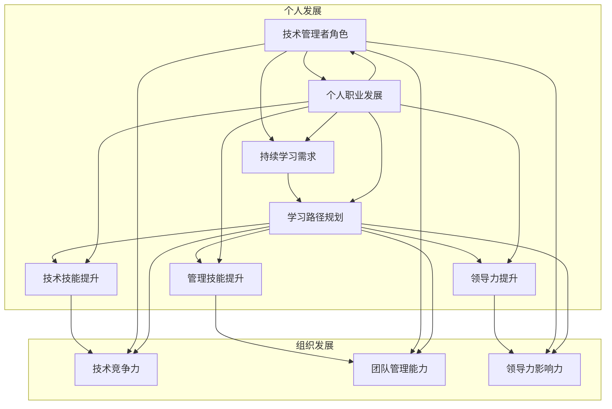

                 

### 书籍主题介绍

在当今快速发展的技术时代，技术管理者的角色显得尤为重要。他们不仅需要具备扎实的技术背景，还需要具备卓越的管理能力和领导力，以应对不断变化的市场需求和复杂的项目挑战。然而，技术的快速发展往往伴随着知识的快速淘汰，这就要求技术管理者必须具备持续学习的意识和能力。

《技术管理者的自我提升：持续学习的重要性》旨在探讨技术管理者如何在职业生涯中通过持续学习实现自我提升。本书不仅关注个人发展，更从组织视角出发，探讨持续学习对团队和组织竞争力的影响。通过深入分析核心概念，介绍有效的学习策略，以及提供具体的技能提升路径，本书为技术管理者提供了全面的学习指南。

**书籍目标：**
- 帮助技术管理者认识到持续学习的重要性。
- 提供实用的学习策略和方法，帮助技术管理者高效地获取和应用新知识。
- 探讨技能提升路径，包括技术技能、管理技能和领导力技能，助力技术管理者在职业生涯中不断前进。
- 分享实际案例和经验，为技术管理者提供可借鉴的学习模式和实践方法。

**书籍结构：**
本书分为七个主要部分：

1. **引言**：介绍书籍主题和背景，设定整体框架。
2. **核心概念与联系**：引入关键概念，并绘制流程图解释概念之间的关系。
3. **持续学习的重要性**：从个人和组织两个视角探讨持续学习的重要性。
4. **个人学习策略**：介绍有效的学习策略，如时间管理、阅读技巧和知识管理等。
5. **技能提升路径**：提供具体的技能提升路径，涉及技术技能、管理技能和领导力技能。
6. **实践与案例研究**：分享实际案例，讨论如何将学习策略和技能提升路径应用到实际工作中。
7. **未来展望**：讨论技术趋势和未来可能的学习需求。

通过这本书，读者将能够理解持续学习对技术管理者的重要性，掌握有效的学习方法和策略，并在实际工作中不断提升自己的技能和领导力，从而更好地应对技术和管理的挑战。

### 第一部分：引言

在当今的科技迅猛发展的时代，技术管理者的角色显得尤为关键。他们不仅是技术团队的领导者，更是组织的核心支柱。技术管理者需要具备深厚的技术背景，以确保团队能够在技术前沿保持竞争力。同时，他们还需要具备卓越的管理能力和领导力，以便在复杂多变的市场环境中，带领团队应对各种挑战。然而，随着技术的快速迭代和市场的不断变化，技术管理者所面临的挑战也日益加剧。

#### 技术管理者面临的挑战

1. **技术知识的更新速度快**：随着人工智能、大数据、云计算等前沿技术的快速发展，技术知识更新速度越来越快。技术管理者必须不断学习新知识、新技能，以保持自身的技术领先优势。
   
2. **管理复杂度高**：技术管理者不仅要管理技术团队，还需要处理项目管理、团队协作、资源分配等多方面的工作。这要求他们具备全面的技能和丰富的经验。

3. **市场需求多变**：市场需求的不断变化对技术管理者提出了更高的要求。他们需要能够迅速适应市场需求，调整团队策略和项目计划。

4. **团队合作与沟通**：技术管理者需要具备良好的团队合作和沟通能力，以确保团队能够高效协作，顺利完成任务。

#### 持续学习的重要性

在这样复杂的背景下，持续学习显得尤为重要。对于技术管理者来说，持续学习不仅能够帮助他们提升个人技能和知识储备，还能提高团队的整体效率和组织竞争力。以下是持续学习对技术管理者的重要性：

1. **提升个人竞争力**：持续学习能够帮助技术管理者紧跟技术前沿，提升自身的技术能力和知识水平，从而在职业市场上保持竞争力。

2. **增强团队实力**：技术管理者的持续学习能够带动整个团队的学习氛围，促进团队整体实力的提升。

3. **应对技术挑战**：通过持续学习，技术管理者能够及时掌握新技术，解决技术难题，确保项目的顺利进行。

4. **提升领导力**：持续学习不仅能够提升技术管理者的专业素养，还能培养他们的领导力和管理能力，使其更好地领导团队。

5. **促进组织发展**：技术管理者的持续学习能够推动组织的创新和进步，提升组织的整体竞争力。

#### 书籍的目标和结构

本书旨在帮助技术管理者认识到持续学习的重要性，并提供实用的学习策略和方法，以帮助他们高效地获取和应用新知识。具体目标如下：

1. **提高技术素养**：通过介绍最新的技术趋势和知识，帮助读者紧跟技术前沿，提升技术能力。

2. **培养管理能力**：介绍管理技能和领导力培养的方法，帮助读者提高团队管理能力和领导力。

3. **提供实践指导**：通过实际案例分享和技能提升路径的介绍，为读者提供具体可行的实践方法。

4. **推动组织发展**：探讨如何通过持续学习促进组织创新和进步，提升组织竞争力。

本书的结构分为七个主要部分：

1. **引言**：介绍书籍主题和背景，设定整体框架。
2. **核心概念与联系**：引入关键概念，并绘制流程图解释概念之间的关系。
3. **持续学习的重要性**：从个人和组织两个视角探讨持续学习的重要性。
4. **个人学习策略**：介绍有效的学习策略，如时间管理、阅读技巧和知识管理等。
5. **技能提升路径**：提供具体的技能提升路径，涉及技术技能、管理技能和领导力技能。
6. **实践与案例研究**：分享实际案例，讨论如何将学习策略和技能提升路径应用到实际工作中。
7. **未来展望**：讨论技术趋势和未来可能的学习需求。

通过这本书，读者将能够理解持续学习对技术管理者的重要性，掌握有效的学习方法和策略，并在实际工作中不断提升自己的技能和领导力，从而更好地应对技术和管理的挑战。

### 第二部分：核心概念与联系

为了更好地理解技术管理者的持续学习过程，我们首先需要明确几个核心概念，并探讨它们之间的关系。这些概念包括技术管理者的角色、持续学习的定义、学习路径规划以及这些因素如何相互作用，共同推动技术管理者的发展。

#### 核心概念

1. **技术管理者的角色**：
   技术管理者不仅需要具备深厚的技术背景，还需要具备项目管理和团队领导的能力。他们的职责包括制定技术战略、管理项目进度、协调团队工作、解决技术难题等。技术管理者是团队和组织的桥梁，需要同时具备技术和管理的双重能力。

2. **持续学习的定义**：
   持续学习指的是一种终身学习的态度和行为，通过不断地获取新知识、新技能，保持自身的竞争力和适应性。持续学习不仅仅是为了跟上技术发展的步伐，更是为了提升个人和团队的综合素质，增强组织的创新能力。

3. **学习路径规划**：
   学习路径规划是技术管理者在职业生涯中制定的学习计划和策略。它包括确定学习目标、选择学习资源、制定学习时间表等。一个合理的学习路径规划可以帮助技术管理者高效地学习和应用新知识。

#### 概念之间的关系

1. **技术管理者的角色与持续学习的联系**：
   技术管理者的角色决定了他们需要不断学习和更新知识。只有通过持续学习，技术管理者才能保持技术领先优势，解决复杂的技术和管理问题。持续学习是技术管理者履行职责的基础。

2. **持续学习与学习路径规划的关系**：
   持续学习需要有明确的学习目标和路径规划作为支撑。学习路径规划帮助技术管理者系统地学习和掌握新知识，而不是盲目地追求新知识。通过规划学习路径，技术管理者可以更加高效地利用时间和资源。

3. **学习路径规划与个人发展目标的关系**：
   学习路径规划应该与个人发展目标紧密相连。技术管理者需要根据自己的职业规划和未来发展方向，制定符合自身需求的学习计划。只有这样，持续学习才能真正促进个人的职业成长。

#### Mermaid 流程图

为了更直观地展示这些概念之间的关系，我们可以使用Mermaid流程图来描述技术管理者的持续学习路径：

在这个流程图中，我们可以看到：

- **技术管理者角色**是持续学习的起点，也是个人和组织的共同需求。
- **持续学习需求**驱动技术管理者进行学习路径规划。
- **学习路径规划**涵盖了技术技能、管理技能和领导力提升，这些都是个人职业发展的重要组成部分。
- **个人职业发展**和**组织发展**通过持续学习相互促进，形成良性循环。

通过这个流程图，我们可以清晰地看到技术管理者的持续学习路径是如何搭建的，以及各个概念之间的相互作用和影响。这种系统化的学习路径规划，有助于技术管理者在职业生涯中持续提升自己的能力和竞争力。

### 第三部分：持续学习的重要性

#### 个人发展视角

持续学习对技术管理者的个人发展至关重要。在技术飞速发展的今天，个人知识的更新速度直接影响着职业竞争力的强弱。以下从几个方面具体探讨持续学习对技术管理者个人发展的影响。

1. **提升技术能力**：
   技术管理者必须不断学习最新的技术趋势和知识，以保持自己在技术领域的领先地位。通过持续学习，技术管理者可以掌握新的编程语言、框架和工具，了解前沿的技术应用，从而在项目开发和团队管理中更加游刃有余。

2. **增强问题解决能力**：
   随着技术项目的复杂度不断增加，技术管理者面临的挑战也越来越多。通过持续学习，技术管理者不仅能够提高自己的技术能力，还能增强自己的问题解决能力。在面对复杂的技术难题时，他们可以快速找到解决方案，确保项目的顺利进行。

3. **培养创新思维**：
   创新是推动技术进步的重要动力。持续学习可以帮助技术管理者不断开拓视野，接触新的思想和观点，从而激发创新思维。在一个创新驱动的环境中，技术管理者能够提出新的解决方案，推动团队和组织的进步。

4. **提升沟通能力**：
   技术管理者需要与团队成员、上级领导和客户进行有效沟通。通过持续学习，技术管理者可以掌握更好的沟通技巧和策略，提高沟通效率，减少误解和冲突，从而营造一个更加和谐的工作氛围。

5. **职业晋升机会**：
   持续学习能够显著提升技术管理者的职业竞争力，为他们的职业晋升提供更多机会。在一个重视学习和创新的组织中，技术管理者可以通过展示自己的学习和领导能力，获得更高的职位和更大的责任。

#### 技术更新速度与学习压力

技术的快速更新速度给技术管理者带来了巨大的学习压力。以下从几个方面具体探讨技术更新速度对技术管理者学习的影响。

1. **知识更新速度快**：
   技术领域的发展非常迅速，新的技术和工具层出不穷。技术管理者需要不断更新自己的知识库，以适应新技术的要求。否则，他们可能会在技术上落后于市场，从而失去竞争力。

2. **持续学习压力增大**：
   随着技术更新速度的加快，技术管理者面临的学习压力也不断增大。他们需要投入更多的时间和精力进行学习，以跟上技术的发展步伐。这种压力可能导致学习效率的降低，甚至出现学习疲劳。

3. **平衡学习与工作**：
   技术管理者需要在工作和学习之间找到平衡。他们需要合理安排时间，确保学习不会影响日常工作。此外，他们还需要学会有效地利用碎片化时间进行学习，以最大化学习效果。

4. **学习资源的选择**：
   技术管理者需要选择适合自己的学习资源，包括技术书籍、在线课程、行业会议等。通过合理选择学习资源，他们可以更高效地获取所需知识，减轻学习压力。

#### 持续学习对技术管理者的影响力

持续学习对技术管理者的影响力不仅体现在个人发展层面，还涉及到组织层面。以下从几个方面具体探讨持续学习对技术管理者的影响力。

1. **提升团队整体素质**：
   技术管理者通过持续学习，不仅提升了自己的能力，还能带动整个团队的学习氛围。在一个注重学习和创新的团队中，团队成员的素质和技能水平会不断提高，从而提升整个团队的工作效率。

2. **增强组织竞争力**：
   技术管理者的持续学习能够推动组织的创新和进步，提高组织的整体竞争力。通过不断引入新技术和新理念，组织可以在市场中保持领先地位，赢得更多的商业机会。

3. **培养内部人才**：
   技术管理者通过持续学习，可以培养出更多的技术人才，为组织储备人才力量。这些内部人才不仅能够满足当前的组织需求，还能为组织的未来发展提供强大支持。

4. **推动知识共享**：
   持续学习有助于技术管理者积累丰富的知识和经验。通过分享这些知识和经验，技术管理者可以促进组织内的知识共享，提高整个组织的知识水平和创新能力。

综上所述，持续学习对技术管理者的个人发展和组织竞争力具有深远的影响。技术管理者需要认识到持续学习的重要性，并采取有效的学习策略，以应对快速变化的技术环境和市场竞争。

### 第四部分：个人学习策略

在快速发展的技术时代，技术管理者需要采取一系列有效的学习策略，以确保自己能够持续提升个人能力和职业竞争力。以下将详细介绍几种关键的学习策略，包括时间管理、阅读技巧和知识管理。

#### 时间管理

**重要性**：
时间管理对于技术管理者来说至关重要。技术管理者通常需要处理多项任务，包括项目管理、团队管理、技术研究和开发等。如果无法有效地管理时间，将很难在忙碌的工作中保持学习和提升的机会。

**方法**：

1. **优先级划分**：
   技术管理者应学会根据任务的重要性和紧急程度进行优先级划分。可以使用艾森豪威尔矩阵（Eisenhower Matrix）来帮助自己确定任务的优先级。

2. **时间块**：
   将时间划分为不同的“时间块”，每个时间块专注于一项任务。例如，可以设定每天上午9点到11点专注于技术学习，下午3点到5点专注于项目管理。

3. **避免拖延**：
   技术管理者应避免拖延，一旦确定了学习时间，就要严格遵守，避免其他事务干扰。

**工具**：

- **日历应用**：使用日历应用（如Google Calendar、Microsoft Outlook）来规划和跟踪学习时间。
- **时间管理软件**：使用如Trello、Asana等项目管理工具来管理任务和时间。

#### 阅读技巧

**重要性**：
阅读是获取知识的重要途径。对于技术管理者来说，通过阅读技术书籍、论文和博客，可以快速了解最新的技术趋势和知识。

**方法**：

1. **高效阅读**：
   采用高效阅读方法，如快速阅读（Speed Reading）和扫读（Skimming）。快速阅读可以帮助技术管理者快速获取文章的核心内容，扫读则可以帮助他们快速浏览大量信息。

2. **主题阅读**：
   选择与当前工作相关的主题进行集中阅读，这样可以更高效地吸收和应用新知识。

3. **笔记与回顾**：
   在阅读过程中做笔记，并定期回顾。这有助于加深对知识的理解和记忆。

**工具**：

- **阅读应用**：使用如Amazon Kindle、Adobe Digital Editions等电子书阅读应用，这些应用支持笔记和标注功能。
- **笔记软件**：使用如OneNote、Evernote等笔记软件，来记录阅读笔记和想法。

#### 知识管理

**重要性**：
知识管理对于技术管理者来说同样重要。通过有效的知识管理，技术管理者可以更好地组织和利用所学知识，提高工作效率。

**方法**：

1. **知识体系构建**：
   构建个人的知识体系，将所学知识分门别类地组织起来。例如，可以将知识分为技术、管理、领导力等类别。

2. **知识共享**：
   与团队成员和其他同事分享知识和经验，促进知识在组织内的流动。这不仅可以提高团队的整体素质，还可以增强个人的影响力。

3. **定期回顾**：
   定期回顾和更新自己的知识库，确保知识体系的时效性和准确性。

**工具**：

- **文档管理软件**：使用如Confluence、SharePoint等文档管理软件来存储和分享文档。
- **知识库**：建立个人或团队的知识库，如GitLab、GitBook等，用于存储和检索知识。

通过以上个人学习策略，技术管理者可以更有效地管理自己的学习时间，提升阅读效率，并建立起一个系统的知识管理体系。这些策略不仅有助于个人能力的提升，还能够促进团队和组织的发展。

### 第五部分：技能提升路径

技术管理者在职业生涯中需要不断提升自身的技术技能、管理技能和领导力技能，以适应快速变化的技术环境和市场需求。以下是具体的技能提升路径，涵盖了每个方面的重要性和提升方法。

#### 技术技能

**重要性**：
技术技能是技术管理者不可或缺的基础。只有掌握了扎实的技术技能，技术管理者才能有效地领导团队解决技术问题，推动项目进展。

**提升方法**：

1. **持续学习新技术**：
   技术管理者应关注最新的技术趋势和工具，通过在线课程、技术会议和学术论文等途径不断学习新知识。

2. **实践经验**：
   技术管理者可以通过参与实际项目，将理论知识应用到实践中，从而提高自己的技术能力。

3. **技术交流**：
   通过技术社区、论坛和GitHub等平台，与同行交流技术经验和心得，分享解决问题的思路。

**示例**：
- **学习路径**：订阅相关的技术博客、关注技术峰会、参与开源项目。
- **实践项目**：参与云平台的建设和运维、大数据分析项目、机器学习应用开发。

#### 管理技能

**重要性**：
管理技能是技术管理者在团队领导和项目管理中的关键。有效的管理技能可以帮助技术管理者更好地协调团队工作，提高项目效率。

**提升方法**：

1. **项目管理**：
   学习项目管理方法，如Scrum、Kanban等，掌握项目计划、进度控制和风险管理的技巧。

2. **沟通与协作**：
   提高沟通能力，学会有效表达和倾听，建立良好的团队协作氛围。

3. **领导力培养**：
   通过阅读领导力书籍、参加领导力培训课程，学习如何激励团队成员和带领团队达成目标。

**示例**：
- **学习资源**：《敏捷实践指南》、《高效能人士的七个习惯》等书籍。
- **实践技巧**：组织团队会议、制定明确的工作目标、定期进行绩效评估。

#### 领导力技能

**重要性**：
领导力技能是技术管理者在组织中的关键素质。优秀的领导力不仅能够提升团队士气，还能够促进组织的创新和发展。

**提升方法**：

1. **愿景与战略**：
   学习如何制定团队和组织的愿景和战略，确保团队工作与组织目标一致。

2. **决策能力**：
   提高决策能力，学会在面对复杂问题时快速做出明智的决策。

3. **人才管理**：
   学习如何发现和培养人才，建立高效的团队，激发团队成员的潜力。

**示例**：
- **学习路径**：参加领导力研讨会、领导力发展课程。
- **实践策略**：定期进行团队建设活动、开展绩效反馈和职业发展规划。

通过以上技能提升路径，技术管理者可以系统化地提升自己的技术、管理和领导力技能，从而更好地应对职业生涯中的各种挑战，实现个人和组织的共同发展。

### 第六部分：实践与案例研究

为了更好地展示如何将学习策略和技能提升路径应用到实际工作中，我们将通过三个具体案例来探讨技术管理者在个人学习成长、团队学习和组织学习文化建设中的实践过程和成果。

#### 案例一：个人学习成长

**背景**：
李华是一名资深的技术经理，他在公司负责一个由多个团队组成的项目。由于技术快速更新，李华感到自己在某些新兴技术上有所欠缺，这影响了项目的顺利进行。

**学习策略与实践**：

1. **时间管理**：
   李华采用了时间块管理法，每天下午5点到6点专注于学习新技术。通过这个方法，他能够在工作之余高效地进行学习。

2. **阅读技巧**：
   李华通过订阅技术博客和学术论文，采用快速阅读和主题阅读的方法，每天阅读并做笔记，以迅速掌握关键信息。

3. **知识管理**：
   李华使用Evernote记录阅读笔记和项目经验，定期回顾和更新，形成了一个个人知识库。

**成果**：
经过一年的持续学习，李华不仅掌握了新兴技术，还提升了项目管理能力。他成功带领团队完成了多个关键项目，并获得了公司高层的高度评价。

**经验与教训**：
李华的经验表明，有效的学习策略和时间管理是持续学习成功的关键。此外，定期回顾和更新知识库有助于巩固学习成果。

#### 案例二：团队学习实践

**背景**：
张丽担任一个大型技术团队的负责人，团队成员来自不同的专业背景。为了提高团队整体的技术能力和协作效率，张丽决定实施团队学习计划。

**学习策略与实践**：

1. **团队会议**：
   张丽每周组织一次团队会议，会议内容包括技术分享、项目讨论和问题解答。她鼓励团队成员在会上分享自己的学习和工作经验。

2. **项目实战**：
   张丽选择了一些具有挑战性的项目，让团队成员参与，通过实践提升技能。她在项目过程中提供指导和支持，帮助团队成员解决遇到的问题。

3. **知识共享**：
   张丽建立了团队内部的知识库，鼓励团队成员将项目经验和最佳实践上传到知识库中，以便团队成员随时查阅和学习。

**成果**：
通过团队学习计划，团队成员的技术能力和协作效率显著提升。团队在多个项目中表现出色，得到了客户和公司的高度认可。

**经验与教训**：
张丽的实践证明，定期的知识共享和项目实战是提升团队技能的有效方法。团队领导的支持和指导对团队成员的成长至关重要。

#### 案例三：组织学习文化建设

**背景**：
李总是一家技术公司的创始人兼CEO，他意识到持续学习对公司发展至关重要，于是决定在公司内部推动学习文化建设。

**学习策略与实践**：

1. **学习资源投入**：
   李总为员工提供了丰富的学习资源，包括在线课程、图书和订阅技术博客。他还设立了学习基金，鼓励员工参加外部培训和会议。

2. **学习氛围营造**：
   李总通过公司内部会议、技术分享会和团队建设活动，营造了一个鼓励学习和创新的工作氛围。他定期与员工交流，了解他们的学习进展和需求。

3. **绩效与学习挂钩**：
   李总将员工的学习表现与绩效评估相结合，对积极参与学习和分享知识的员工给予奖励，从而激励员工持续学习。

**成果**：
学习文化建设的推动使得公司的创新能力显著提升，团队成员的技术水平和协作效率也大幅提高。公司在市场竞争中脱颖而出，获得了多个重要项目。

**经验与教训**：
李总的实践表明，组织高层对学习的重视和支持是推动学习文化建设的核心。有效的学习资源投入和学习激励机制能够显著提升员工的学习积极性和工作绩效。

通过以上三个案例，我们可以看到，无论是个人学习成长、团队学习还是组织学习文化建设，持续学习都是提升技术管理者能力和组织竞争力的重要途径。有效的学习策略和实践方法，将帮助技术管理者在职业生涯中不断前进。

### 第七部分：未来展望

随着技术的迅猛发展，技术管理者的持续学习需求也在不断演变。未来，技术管理者需要更加前瞻性地思考自己的学习路径，以适应新技术和市场需求的变化。

#### 技术趋势分析

1. **人工智能和自动化**：人工智能和自动化技术的发展将对技术管理者提出新的要求。他们需要了解人工智能的基础知识，掌握自动化工具的应用，以便更好地管理和利用这些技术。

2. **云计算和边缘计算**：云计算和边缘计算的普及将改变技术架构和部署模式。技术管理者需要熟悉云计算平台和边缘计算网络，以优化资源利用和提升系统性能。

3. **区块链和分布式技术**：区块链技术的发展将带来新的商业模式和安全性挑战。技术管理者需要掌握区块链的基本原理和应用，确保系统的安全性和数据的完整性。

#### 学习需求的变化

1. **深度学习与数据科学**：随着大数据和机器学习技术的应用日益广泛，技术管理者需要具备深度学习和数据科学的知识，以便更好地分析和利用数据。

2. **网络安全与隐私保护**：随着网络安全威胁的日益增加，技术管理者需要深入了解网络安全知识，确保系统的安全性和数据的隐私保护。

3. **可持续发展与绿色技术**：未来，可持续发展将成为技术管理者的重要关注点。他们需要了解绿色技术和环保标准，推动组织在技术上的可持续性。

#### 持续学习在技术管理中的新角色

1. **知识共享与社区建设**：未来，技术管理者将更多地承担知识共享和社区建设的角色。通过构建学习社区和知识平台，他们可以促进团队成员之间的知识交流和经验分享。

2. **领导力与创新能力**：随着技术复杂性的增加，技术管理者的领导力和创新能力将变得越来越重要。他们需要具备跨学科的视野和创新能力，以应对复杂的技术挑战。

3. **战略规划与决策**：技术管理者将更多地参与到组织的战略规划中，他们需要具备战略思维和决策能力，确保组织的技术发展方向与市场趋势保持同步。

综上所述，未来技术管理者的持续学习需求将更加多样化和复杂化。通过前瞻性地规划学习路径，技术管理者可以不断提升自己的技能和竞争力，为组织和个人的未来发展奠定坚实基础。

### 总结与建议

通过《技术管理者的自我提升：持续学习的重要性》这本书，我们深入探讨了持续学习对技术管理者个人发展和组织竞争力的重要性。以下是全书的主要观点回顾：

1. **技术管理者的角色**：技术管理者不仅需要具备扎实的技术背景，还需要具备卓越的管理能力和领导力，以应对快速变化的市场和技术环境。

2. **持续学习的重要性**：持续学习能够帮助技术管理者提升个人竞争力，增强团队实力，应对技术挑战，提升领导力，并促进组织发展。

3. **个人学习策略**：有效的学习策略包括时间管理、阅读技巧和知识管理，这些策略有助于技术管理者高效地获取和应用新知识。

4. **技能提升路径**：技术管理者需要通过不断提升技术技能、管理技能和领导力技能，以适应不断变化的技术环境和市场需求。

5. **实践与案例研究**：通过实际案例，我们看到了学习策略和技能提升路径在个人、团队和组织层面上的成功应用。

6. **未来展望**：随着技术的迅猛发展，技术管理者需要前瞻性地规划自己的学习路径，以适应新技术和市场需求的变化。

对于技术管理者，以下是一些建议：

1. **培养持续学习的习惯**：将学习作为日常工作的一部分，保持对新知识的好奇心和求知欲。

2. **制定学习计划**：根据自己的职业规划和兴趣，制定详细的学习计划，确保学习的系统性和针对性。

3. **利用学习资源**：充分利用在线课程、技术博客、专业书籍、行业会议等学习资源，扩大知识面。

4. **实践与反思**：通过参与实际项目，将所学知识应用到实践中，并通过反思和总结不断优化学习效果。

5. **建立学习社区**：加入技术社区和论坛，与同行交流和学习，共享知识和经验。

通过遵循这些建议，技术管理者可以不断提升自己的能力和竞争力，为个人和组织的未来发展奠定坚实基础。

### 附录

为了帮助读者更好地理解和应用本书中的概念和策略，我们提供了以下附录：

1. **术语表**：
   - **持续学习**：指个人或组织为了适应变化和发展需求，不断地获取新知识和技能的过程。
   - **技术管理者**：负责技术团队领导和项目管理的人员，通常具备扎实的技术背景和优秀的管理能力。
   - **时间块**：将时间划分为特定的块，每个块专注于一项特定任务或活动。
   - **敏捷开发**：一种以人为核心、迭代、循序渐进的开发方法，强调灵活应对变化。
   - **知识管理**：通过组织、存储、共享和利用知识，以提高个人和组织的效率。

2. **参考文献**：
   - **《敏捷实践指南》**：肯尼思·史普林格著，详细介绍了敏捷开发的方法和实践。
   - **《高效能人士的七个习惯》**：史蒂芬·柯维著，提供了提高个人效率和领导力的策略。
   - **《深度学习》**：伊恩·古德费洛等著，介绍了深度学习的基础知识和应用。
   - **《区块链：从数字货币到信用社会》**：唐·塔普斯科特著，探讨了区块链技术的潜在影响。

3. **在线资源**：
   - **技术社区**：如Stack Overflow、GitHub、Reddit等，提供技术问题解答和知识分享。
   - **在线课程平台**：如Coursera、edX、Udemy等，提供丰富的技术和管理课程。
   - **专业博客**：如Medium、Medium、TechCrunch等，涵盖最新的技术趋势和行业动态。

通过这些附录内容，读者可以进一步深入了解本书中的概念和策略，并利用提供的资源进行更深入的学习和实践。附录的内容不仅为读者提供了丰富的参考资料，还为他们提供了实际操作的建议和指导，帮助他们在职业生涯中不断进步。

