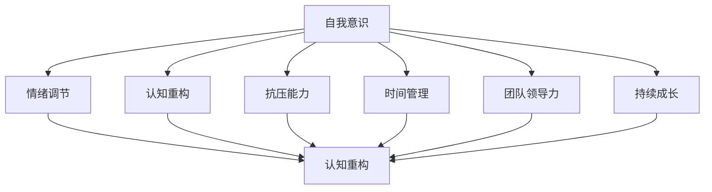
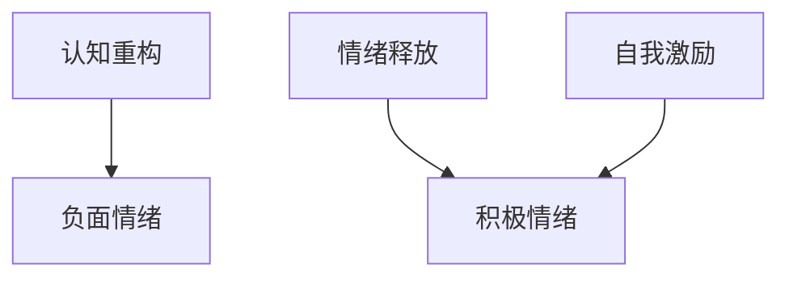
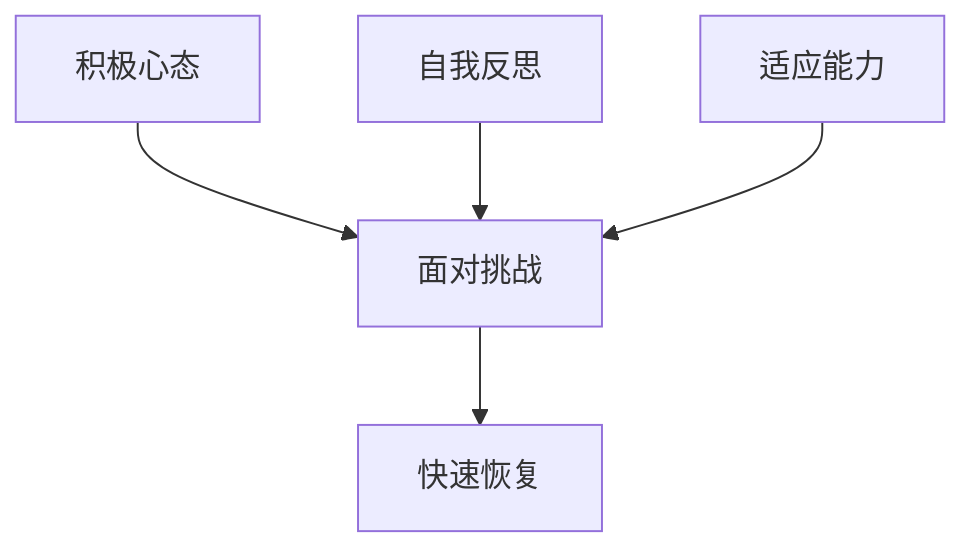
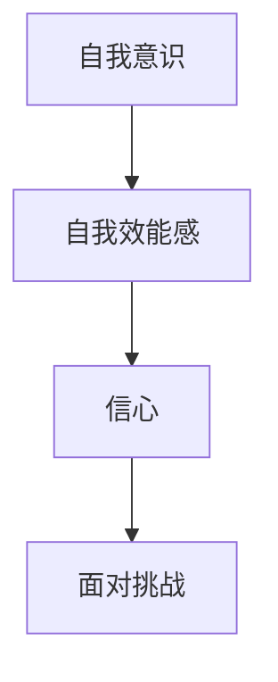
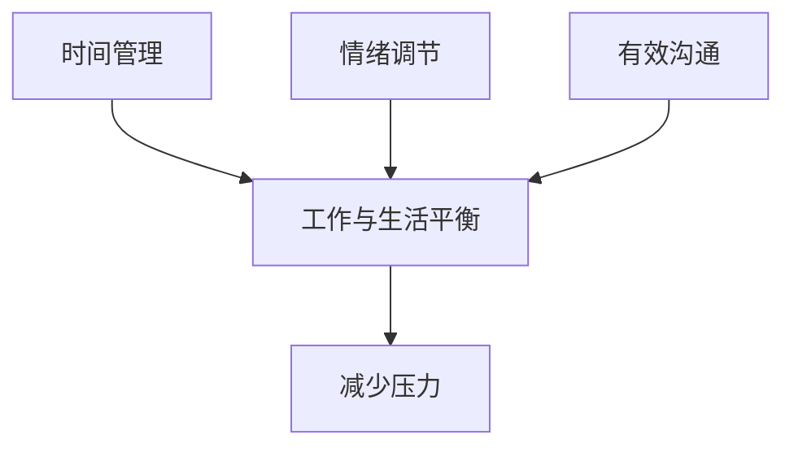
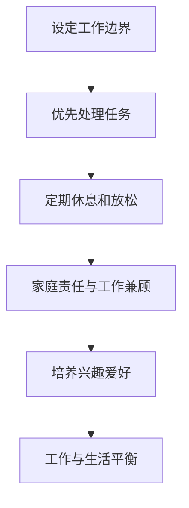
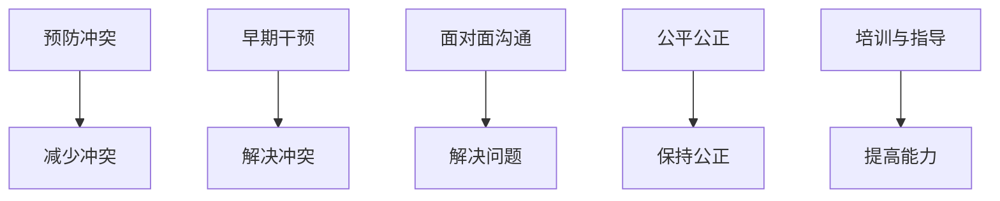
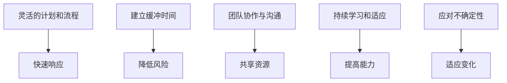
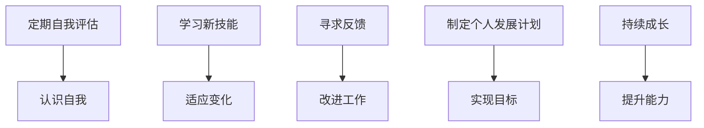

                 

### 文章标题

### 技术管理者的自我调节能力培养

在当今快速变化和高压力的技术环境中，技术管理者的角色日益重要。他们不仅要具备深厚的专业知识，还需具备出色的自我调节能力，以应对不断变化的挑战。本文旨在深入探讨技术管理者如何培养自我调节能力，从而在复杂的工作环境中保持高效和稳定。

### 文章关键词

- 技术管理者
- 自我调节能力
- 压力管理
- 时间管理
- 团队领导力
- 应对变化

### 文章摘要

本文首先介绍了技术管理者的角色和面临的挑战，然后重点探讨了自我调节能力的核心概念。通过心理学基础、压力管理、时间管理、团队领导力、应对变化和自我反思等六个方面，文章详细分析了技术管理者如何培养自我调节能力。最后，本文提出了实际案例和最佳实践，帮助读者更好地理解和应用这些策略。

-------------------------------------------------------------------

### 第1章 引言与核心概念

#### 1.1 技术管理者的角色与挑战

技术管理者在现代企业中扮演着至关重要的角色。他们不仅需要具备扎实的技术背景，还必须具备卓越的管理能力和战略眼光。技术管理者的核心职责包括但不限于：制定技术战略、领导团队、管理项目、协调内部资源、推动技术创新等。

然而，技术管理者面临着诸多挑战。首先，技术环境的快速变化要求他们不断更新知识，掌握最新的技术趋势。其次，项目管理中的不确定性、资源分配的困难以及团队成员的沟通和协作问题，都是常见挑战。此外，技术管理者还需要在压力和竞争环境中保持冷静和专注，以应对突发状况。

#### 1.2 自我调节能力的定义与重要性

自我调节能力是指个体在情绪、认知和行为等方面，通过自我控制和调节，以达到更好适应环境和实现目标的能力。对于技术管理者来说，自我调节能力尤为重要。以下是其重要性的几个方面：

1. **情绪管理**：技术管理者经常面临压力和挑战，良好的情绪管理能力可以帮助他们保持冷静，避免因情绪波动而影响决策。
2. **认知重构**：面对复杂的问题和困难，自我调节能力使技术管理者能够从不同角度思考，找到创新的解决方案。
3. **抗压能力**：自我调节能力有助于技术管理者在压力环境下保持高效工作，减少因压力导致的错误和失误。
4. **团队领导力**：优秀的自我调节能力有助于技术管理者更好地领导团队，激励团队成员，建立积极的工作氛围。

#### 1.3 本书的目标与结构

本书旨在帮助技术管理者提升自我调节能力，以更好地应对工作挑战。具体目标如下：

1. **理解自我调节能力的重要性**：通过介绍心理学基础和实际案例，帮助读者认识到自我调节能力对职业发展的影响。
2. **掌握自我调节的方法和技巧**：提供实用的策略和工具，帮助读者在实际工作中应用自我调节能力。
3. **培养自我反思和持续成长**：通过自我反思和持续学习，帮助读者不断提升自我调节能力，实现职业发展。

本书的结构分为七个章节：

1. **第1章 引言与核心概念**：介绍技术管理者的角色与挑战，自我调节能力的定义与重要性。
2. **第2章 自我调节能力的心理学基础**：探讨心理学基础、情绪调节、心理韧性等。
3. **第3章 技术管理者的压力管理**：介绍压力的来源、管理策略和工作与生活平衡。
4. **第4章 时间管理与优先级设置**：讲解时间管理的原则、优先级设置方法和实际案例。
5. **第5章 团队领导力与沟通**：探讨团队领导力的基础、有效沟通技巧和团队冲突管理。
6. **第6章 应对变化与不确定性**：分析变化管理的理论基础、适应不确定性的策略和实际案例。
7. **第7章 自我反思与持续成长**：强调自我反思的重要性、持续成长的方法和实际案例。

通过这七个章节的学习，读者将能够全面了解自我调节能力的各个方面，并掌握提升自我调节能力的具体方法和实践技巧。

#### 1.4 技术管理者的自我调节能力模型

为了更系统地理解和培养技术管理者的自我调节能力，我们可以构建一个自我调节能力模型。该模型包括以下几个核心要素：

1. **自我意识**：技术管理者需要对自己的情绪、行为和认知有清晰的认识，这是自我调节的前提。
2. **情绪调节**：通过认知重构、情绪释放和自我激励等方法，管理负面情绪，保持积极心态。
3. **认知重构**：在面对挑战时，技术管理者需要从不同角度思考问题，寻找创新解决方案。
4. **抗压能力**：通过自我调节，技术管理者能够在高压环境下保持冷静，减少错误和失误。
5. **时间管理**：合理规划时间，提高工作效率，减少因时间管理不当导致的压力。
6. **团队领导力**：通过有效沟通和激励，建立积极的团队氛围，提升团队绩效。
7. **持续成长**：通过自我反思和学习，不断提升自我调节能力，适应不断变化的环境。

以下是一个简化的 Mermaid 流程图，展示了技术管理者自我调节能力模型的结构：



通过这个模型，技术管理者可以系统地培养和提升自我调节能力，从而更好地应对工作中的各种挑战。接下来，我们将进一步探讨自我调节能力的心理学基础，为读者提供更深入的见解。

### 第2章 自我调节能力的心理学基础

#### 2.1 心理学基础知识

心理学是研究人类行为和心理过程的科学。理解心理学基础知识对于培养自我调节能力至关重要。以下是几个关键概念：

1. **认知行为理论**：认知行为理论强调思维模式对行为的影响。技术管理者通过认知重构，改变消极的思维模式，从而改善行为和情绪状态。
2. **情绪调节**：情绪调节是指个体通过自我控制和调节，管理情绪反应的过程。有效的情绪调节策略包括认知重构、情绪释放和自我激励等。
3. **心理韧性**：心理韧性是指个体在面临压力和挑战时，能够快速恢复并保持积极心态的能力。培养心理韧性有助于技术管理者更好地应对工作挑战。
4. **自我意识**：自我意识是指个体对自己的认知，包括情感、思想、行为等方面。自我意识有助于技术管理者更好地理解自己，从而进行有效的自我调节。

#### 2.2 情绪调节与认知重构

情绪调节是自我调节能力的重要组成部分。以下是一些情绪调节的策略：

1. **认知重构**：认知重构是指通过改变思维模式来调节情绪。例如，当技术管理者遇到困难时，他们可以通过认知重构来将“我不行”的想法转变为“这是一个挑战，我可以学习并克服它”。这种思维模式的转变有助于减少负面情绪。
2. **情绪释放**：情绪释放是指通过某种方式表达或释放负面情绪，以减轻情绪压力。例如，通过运动、写日记或与朋友倾诉，技术管理者可以释放压力，保持心理健康。
3. **自我激励**：自我激励是指通过积极思考和自我鼓励来提高情绪状态。例如，技术管理者可以通过设定小目标、庆祝小成就来激励自己，保持积极的心态。

以下是一个简化的 Mermaid 流程图，展示了情绪调节与认知重构的过程：



通过认知重构、情绪释放和自我激励，技术管理者可以有效地调节情绪，提高自我调节能力。

#### 2.3 心理韧性培养

心理韧性是指个体在面对压力和挑战时，能够快速恢复并保持积极心态的能力。以下是一些培养心理韧性的策略：

1. **积极心态**：保持积极心态有助于技术管理者更好地应对压力。他们可以通过自我激励、设定目标和庆祝小成就来培养积极心态。
2. **自我反思**：通过自我反思，技术管理者可以了解自己的优点和不足，从而在面临挑战时，更好地调整自己的心态和行为。
3. **适应能力**：培养适应能力有助于技术管理者在面对不确定性时，保持冷静和稳定。他们可以通过学习新的技能和知识，提高自己的适应能力。

以下是一个简化的 Mermaid 流程图，展示了心理韧性培养的过程：



通过积极心态、自我反思和适应能力，技术管理者可以培养出强大的心理韧性，更好地应对工作中的各种挑战。

#### 2.4 自我意识与自我效能感

自我意识是指技术管理者对自己的认知，包括情感、思想、行为等方面。自我意识有助于技术管理者更好地了解自己，从而进行有效的自我调节。

1. **自我意识**：技术管理者可以通过日记、冥想或心理咨询等方式，提高自我意识。了解自己的优点和不足，有助于制定更有效的自我调节策略。
2. **自我效能感**：自我效能感是指技术管理者对自己的能力和效果的信心。高自我效能感有助于技术管理者在面对挑战时，保持自信和积极。

以下是一个简化的 Mermaid 流程图，展示了自我意识与自我效能感的关系：



通过提高自我意识和自我效能感，技术管理者可以更好地理解自己，增强自信心，从而在面对挑战时，更有效地进行自我调节。

本章介绍了自我调节能力的心理学基础，包括心理学基础知识、情绪调节与认知重构、心理韧性培养以及自我意识与自我效能感。通过这些心理学理论和方法，技术管理者可以更系统地培养自我调节能力，以应对工作中的各种挑战。下一章，我们将探讨技术管理者如何管理压力，保持工作与生活的平衡。

### 第3章 技术管理者的压力管理

#### 3.1 压力的来源与影响

压力是技术管理者在职业生涯中不可避免的一部分。压力的来源多种多样，主要包括以下几个方面：

1. **工作压力**：技术管理者通常需要承担大量的工作责任，包括项目管理、团队领导和资源协调等。此外，项目期限的紧迫性和技术问题的复杂性，都会增加工作压力。
2. **技术环境变化**：技术行业变化迅速，技术管理者需要不断学习新的技术趋势和工具。这种持续的学习压力，可能导致他们感到焦虑和不安。
3. **人际关系**：技术管理者需要与团队成员、上级和管理层进行有效的沟通和协作。人际关系中的冲突和不和谐，也会成为压力的来源。
4. **个人生活**：家庭责任、个人兴趣和健康问题等，都可能对技术管理者的心理和生理健康产生负面影响。

长期承受压力，会对技术管理者产生多方面的影响：

1. **心理健康**：压力可能导致焦虑、抑郁等心理问题，影响技术管理者的工作表现和幸福感。
2. **生理健康**：长期的压力会引发一系列生理问题，如高血压、心脏病等。
3. **工作效率**：压力会降低技术管理者的工作效率，增加错误率和项目延迟的风险。
4. **人际关系**：压力可能导致技术管理者在与同事、上级和家庭成员的交往中，出现沟通障碍和冲突。

#### 3.2 压力管理策略

为了有效管理压力，技术管理者可以采取以下策略：

1. **时间管理**：合理安排工作时间，避免过度加班和长时间工作。通过设定优先级和合理分配任务，提高工作效率，减少工作压力。
2. **情绪调节**：学会情绪调节技巧，如深呼吸、冥想和运动等，帮助自己保持冷静和放松。此外，通过认知重构，改变消极的思维模式，减少负面情绪。
3. **有效沟通**：建立良好的沟通机制，与团队成员、上级和管理层保持透明和开放的信息交流。通过有效沟通，减少误解和冲突，降低压力。
4. **工作与生活平衡**：合理安排工作和个人时间，确保有足够的休息和娱乐时间。通过家庭聚会、运动和兴趣爱好等方式，缓解工作压力，提高生活质量。

以下是一个简化的 Mermaid 流程图，展示了压力管理的策略：



通过这些策略，技术管理者可以有效地管理压力，保持心理健康和工作效率。

#### 3.3 应对工作与生活平衡

工作与生活平衡对于技术管理者的身心健康和长期发展至关重要。以下是一些建议，帮助技术管理者实现工作与生活的平衡：

1. **设定清晰的工作边界**：明确工作时间和个人时间的界限，避免工作侵占个人时间。通过设定固定的下班时间和避免工作时的打扰，确保个人时间的完整性。
2. **优先处理重要任务**：在工作和生活中，区分重要和紧急的任务，优先处理重要任务。这样可以确保工作的高效完成，同时有更多时间关注个人生活。
3. **定期休息和放松**：确保每天有足够的休息时间，通过冥想、瑜伽、阅读等方式放松身心。定期休息有助于缓解压力，提高工作效率。
4. **家庭责任与工作兼顾**：合理规划家庭责任和工作时间，确保两者兼顾。通过家庭聚会、陪伴子女等方式，维护良好的家庭关系。
5. **培养兴趣爱好**：培养个人兴趣爱好，如绘画、音乐、运动等，有助于缓解工作压力，提高生活质量。

以下是一个简化的 Mermaid 流程图，展示了实现工作与生活平衡的策略：



通过这些策略，技术管理者可以更好地实现工作与生活的平衡，提高生活质量和工作效率。

本章探讨了技术管理者如何管理压力，包括压力的来源与影响、压力管理策略以及如何实现工作与生活的平衡。通过有效的压力管理，技术管理者可以保持心理健康，提高工作效率，实现长期发展。下一章，我们将讨论时间管理与优先级设置，帮助技术管理者更高效地规划和管理时间。

### 第4章 时间管理与优先级设置

#### 4.1 时间管理的原则

时间管理是技术管理者的一项关键技能，能够显著提高工作效率和生活质量。以下是一些基本的时间管理原则：

1. **设定明确的目标**：明确的目标是时间管理的基础。技术管理者应该为自己和团队设定清晰的目标，以确保时间和精力被有效地利用。
2. **任务分类**：将任务分为“紧急且重要”、“紧急但不重要”、“不紧急但重要”和“不紧急且不重要”四类。这样可以确保技术管理者首先关注最重要和紧急的任务。
3. **优先级排序**：在任务分类的基础上，对任务进行优先级排序，确保优先处理最重要和紧急的任务。这有助于减少任务堆积，提高工作效率。
4. **避免分心**：在工作中，避免频繁的分心和切换任务。分心会导致工作效率下降，增加错误率。技术管理者应该集中精力，一次只专注于一项任务。
5. **合理规划时间**：合理规划工作时间，确保有足够的时间来完成每项任务。通过设定明确的时间表和截止日期，可以更好地控制工作进度。

#### 4.2 优先级设置的方法

为了有效地设置优先级，技术管理者可以采用以下几种方法：

1. **紧急-重要矩阵**：这是一种常用的任务分类方法，将任务分为四个象限，根据紧急程度和重要程度来排序。重要且紧急的任务应首先处理，不重要但紧急的任务可以委托或推迟处理，重要但不紧急的任务应提前安排，而不重要且不紧急的任务可以忽略或简化处理。

   以下是一个简化的 Mermaid 流程图，展示了紧急-重要矩阵：

   ```mermaid
   graph TB
       A[重要紧急]
       B[重要不紧急]
       C[不重要紧急]
       D[不重要不紧急]
       A --> E[优先处理]
       B --> F[提前安排]
       C --> G[委托或推迟]
       D --> H[忽略或简化]
   ```

2. **四象限法**：这种方法与紧急-重要矩阵类似，但更侧重于任务的紧急程度和重要性。任务被分为四个象限，根据具体情况来决定优先级。紧急且重要、重要不紧急和紧急不重要是高优先级任务，而不紧急且不重要是低优先级任务。

   以下是一个简化的 Mermaid 流程图，展示了四象限法：

   ```mermaid
   graph TB
       A[紧急重要]
       B[重要不紧急]
       C[紧急不重要]
       D[不紧急不重要]
       A --> E[优先处理]
       B --> F[提前安排]
       C --> G[立即处理]
       D --> H[不处理]
   ```

3. **80/20法则**：也称为帕累托法则，它指出约80%的结果来自20%的活动。技术管理者可以利用这个法则，识别出最重要的20%任务，将主要精力集中在这些任务上，从而实现高效的优先级设置。

   以下是一个简化的 Mermaid 流程图，展示了80/20法则：

   ```mermaid
   graph TB
       A[20%重要任务]
       B[80%其他任务]
       A --> C[主要精力]
       B --> D[次要精力]
   ```

#### 4.3 实际案例解析

为了更好地理解时间管理和优先级设置的方法，我们可以通过一个实际案例来解析。

**案例背景**：某技术管理者李先生负责一个重要的项目，需要在接下来的两个月内完成。项目包括三个主要任务：需求分析、系统设计和测试。同时，他还有其他一些紧急和重要的任务，如团队培训、技术文档撰写和与客户的沟通。

**案例分析**：

1. **任务分类**：
   - **重要紧急**：与客户的沟通、需求分析。
   - **重要不紧急**：系统设计、测试、团队培训。
   - **不重要紧急**：技术文档撰写。
   - **不重要不紧急**：其他日常事务。

2. **优先级排序**：
   - **第一优先级**：与客户的沟通和需求分析，因为它们直接影响项目的进展和客户的满意度。
   - **第二优先级**：系统设计和测试，因为它们是项目成功的关键环节。
   - **第三优先级**：团队培训和技术文档撰写，虽然它们也是重要的任务，但相对次要。

3. **时间规划**：
   - **第一周**：专注于与客户的沟通和需求分析，确保项目方向正确。
   - **第二周**：进行系统设计和初步测试，确保设计符合需求。
   - **第三周**：完成详细测试，修复潜在问题，准备项目汇报。
   - **第四周**：进行项目汇报和团队培训，完成技术文档撰写。

4. **结果**：
   - 李先生通过有效的任务分类、优先级排序和时间规划，确保了项目的顺利进行。项目在规定时间内完成，客户满意，团队也得到了成长。

通过这个案例，我们可以看到，时间管理和优先级设置对于项目成功的重要性。技术管理者通过合理规划和有效执行，可以最大限度地提高工作效率，确保项目按时完成。

#### 总结

时间管理与优先级设置是技术管理者的重要技能。通过设定明确的目标、任务分类、优先级排序和合理规划时间，技术管理者可以更好地管理自己的时间和精力，提高工作效率和项目成功率。在实际工作中，技术管理者应该不断实践和优化这些方法，以适应不断变化的环境和挑战。

### 第5章 团队领导力与沟通

#### 5.1 团队领导力的基础

团队领导力是技术管理者不可或缺的技能，它不仅关系到项目的成功，也直接影响团队成员的士气和生产力。团队领导力主要包括以下几个方面：

1. **愿景与目标**：一个好的领导者需要有清晰的愿景和目标，能够激励团队成员为实现共同目标而努力。愿景应具有挑战性，同时也要切实可行。
2. **激励与支持**：领导者需要了解团队成员的需求，提供适当的激励和支持，帮助他们克服困难，实现个人和团队的目标。
3. **沟通与协调**：有效的沟通和协调能力是团队领导力的核心。领导者需要建立良好的沟通机制，确保信息透明和及时传达，同时协调团队成员的工作，解决冲突和问题。
4. **信任与尊重**：建立团队成员之间的信任和尊重，是团队领导力的基础。领导者应通过公正、透明和一致的行为，赢得团队成员的信任和尊重。
5. **决策与执行力**：领导者需要具备良好的决策能力和执行力，能够快速做出明智的决策，并确保决策得到有效执行。

#### 5.2 有效沟通技巧

有效的沟通是团队领导力的关键组成部分。以下是一些提升沟通技巧的方法：

1. **倾听**：良好的沟通始于倾听。领导者应该倾听团队成员的意见和需求，理解他们的立场和感受，从而做出更明智的决策。
2. **清晰表达**：领导者应确保自己的表达清晰、简洁，避免使用专业术语或复杂句子，确保团队成员能够理解。
3. **积极反馈**：给予团队成员积极的反馈，表扬他们的成就和努力，鼓励他们在未来继续保持良好的表现。
4. **建立信任**：通过开放和诚实的沟通，建立团队成员之间的信任。领导者应透明地分享信息，并鼓励团队成员提出问题和意见。
5. **冲突解决**：在沟通中，难免会出现冲突。领导者应具备解决冲突的能力，通过倾听、理解、协商和妥协，找到双方都能接受的解决方案。

#### 5.3 团队冲突管理

团队冲突是技术管理者面临的常见挑战之一。有效的团队冲突管理对于保持团队稳定和高效至关重要。以下是一些管理团队冲突的方法：

1. **预防冲突**：通过建立明确的规则和沟通机制，预防冲突的发生。领导者应鼓励团队成员表达意见，同时确保他们的意见得到尊重。
2. **早期干预**：当冲突发生时，领导者应尽早介入，了解冲突的根源，并采取措施进行调解。早期干预可以防止冲突升级，避免对团队产生负面影响。
3. **面对面沟通**：对于严重的冲突，领导者应进行面对面沟通，直接了解双方的立场和感受，从而找到更有效的解决方案。
4. **公平公正**：在解决冲突时，领导者应保持公平公正，不偏袒任何一方。通过客观、公正的态度，赢得团队成员的信任和尊重。
5. **培训与指导**：为团队成员提供沟通和冲突管理的培训，提高他们的沟通能力和冲突解决技巧。通过培训，可以帮助团队成员更好地理解冲突的原因和解决方案。

以下是一个简化的 Mermaid 流程图，展示了团队冲突管理的过程：



通过这些方法，技术管理者可以有效地管理团队冲突，维护团队的稳定和高效。

#### 实际案例

为了更好地理解团队领导力与沟通技巧，我们可以通过一个实际案例来解析。

**案例背景**：某技术管理团队由五名成员组成，他们在开发一个复杂的项目。由于任务分配不均和沟通不畅，团队成员之间出现了冲突。

**案例分析**：

1. **预防冲突**：团队领导者在项目开始时，明确了每个人的职责和任务，并建立了定期的沟通会议，确保团队成员之间的信息共享和协调。

2. **早期干预**：在项目进展过程中，领导者注意到团队成员之间存在意见分歧，立即进行了干预。他们组织了一次会议，让团队成员表达自己的观点和担忧。

3. **面对面沟通**：在会议中，领导者与团队成员进行了面对面的沟通，了解了冲突的根源。他们发现，由于任务分配不均，导致部分成员工作量过大，感到压力和不满。

4. **公平公正**：领导者重新评估了任务分配，确保每个人都承担合理的 workload。同时，他们为团队成员提供了额外的支持和资源，以帮助他们完成工作任务。

5. **培训与指导**：为了解决沟通问题，领导者组织了一次沟通技巧培训，提高了团队成员的沟通能力和冲突解决技巧。

**结果**：通过有效的团队领导力和沟通技巧，领导者成功解决了团队冲突，恢复了团队的稳定和高效。项目最终按时完成，团队成员之间的合作关系也得到了加强。

通过这个案例，我们可以看到，有效的团队领导力和沟通技巧对于解决团队冲突、维护团队稳定和高效的重要性。技术管理者应该不断实践和提升这些技能，以更好地应对团队中的挑战。

### 第6章 应对变化与不确定性

#### 6.1 变化管理的理论基础

在技术行业，变化是常态。技术管理者需要具备应对变化和不确定性的能力，以确保团队和项目的稳定发展。以下是一些关键的理论基础：

1. **变革管理**：变革管理是指通过一系列步骤和策略，引导组织适应新的环境和技术。变革管理理论强调领导力、沟通、规划和执行在变革过程中的重要性。
2. **敏捷开发**：敏捷开发是一种以用户需求为导向、灵活响应变化的开发方法。敏捷开发强调迭代、持续交付和团队协作，能够更好地适应变化。
3. **风险管理**：风险管理是指识别、评估和应对潜在风险的过程。技术管理者通过风险管理，降低变化带来的负面影响，确保项目的顺利推进。
4. **决策制定**：在变化和不确定的环境中，技术管理者需要快速做出决策。决策制定理论提供了一系列方法和工具，帮助管理者在压力下做出明智的决策。

#### 6.2 适应不确定性的策略

为了更好地适应不确定性，技术管理者可以采取以下策略：

1. **灵活的计划和流程**：建立灵活的计划和流程，允许在项目进展过程中进行调整。这有助于快速响应变化，减少不确定性对项目的影响。
2. **建立缓冲时间**：在项目计划和资源分配中，预留一定的缓冲时间，以应对可能出现的变化和延迟。缓冲时间有助于降低风险，确保项目按时完成。
3. **团队协作与沟通**：鼓励团队成员之间的协作和沟通，共享信息和资源，共同应对不确定性。通过团队协作，可以更好地识别和应对潜在的问题。
4. **持续学习和适应**：技术管理者应不断学习和更新自己的知识和技能，以适应快速变化的技术环境。持续学习有助于提高团队的适应能力，应对各种挑战。

以下是一个简化的 Mermaid 流程图，展示了适应不确定性的策略：



通过这些策略，技术管理者可以更好地应对变化和不确定性，确保项目的成功和团队的稳定。

#### 6.3 实际案例研究

为了更好地理解如何应对变化和不确定性，我们可以通过一个实际案例来分析。

**案例背景**：某技术公司正在开发一款新型智能设备，项目时间紧、任务重，且市场需求变化快。项目团队由10名成员组成，包括软件工程师、硬件工程师和产品经理。

**案例分析**：

1. **灵活的计划和流程**：项目开始时，团队制定了详细的计划和时间表，但考虑到市场需求的不确定性，团队决定采用敏捷开发方法，以适应快速变化。
2. **建立缓冲时间**：在项目计划和资源分配中，团队预留了20%的缓冲时间，以应对可能出现的延迟和变化。
3. **团队协作与沟通**：团队建立了定期的沟通机制，包括每日站立会议、每周回顾会议和月度进度报告，确保团队成员之间的信息共享和协调。
4. **持续学习和适应**：团队定期参加培训和学习活动，提高自己的技能和知识，以适应不断变化的市场需求。

**结果**：通过灵活的计划和流程、建立缓冲时间、团队协作与沟通以及持续学习和适应，团队成功应对了各种变化和不确定性，项目按时完成，并获得了市场的认可。

通过这个案例，我们可以看到，技术管理者通过有效的策略，可以成功应对变化和不确定性，确保项目的成功和团队的稳定。

### 第7章 自我反思与持续成长

#### 7.1 自我反思的重要性

自我反思是技术管理者提升自我调节能力和实现职业发展的关键步骤。通过自我反思，技术管理者可以深入理解自己的行为、思维模式和工作方法，从而发现自身的优点和不足，制定改进计划。

以下是一些自我反思的重要性：

1. **认识自我**：自我反思有助于技术管理者更清楚地认识自己，了解自己的价值观、信念和动机。这种自我认识有助于制定符合个人目标的职业发展计划。
2. **发现不足**：自我反思能够帮助技术管理者发现自己在工作中的不足，如时间管理不当、沟通技巧不足或压力管理不佳等。通过识别不足，可以针对性地进行改进。
3. **持续改进**：自我反思是一个持续的过程，技术管理者可以通过定期反思，持续改进自己的工作方法和技能，提高工作效率和职业素养。
4. **职业发展**：自我反思有助于技术管理者明确职业发展路径，制定长期的职业规划，从而实现职业目标。

#### 7.2 持续成长的方法

为了实现自我反思和持续成长，技术管理者可以采取以下方法：

1. **定期自我评估**：技术管理者应定期对自己进行评估，包括工作绩效、职业素养和人际关系等方面。通过自我评估，可以了解自己的优势和不足，并制定改进计划。
2. **学习新技能**：技术行业变化迅速，技术管理者应不断学习新技能和知识，以适应行业的发展和变化。可以通过参加培训、阅读专业书籍、参加线上课程等方式，提高自己的技能水平。
3. **寻求反馈**：从同事、上级和下属那里获取反馈，了解自己的工作表现和改进方向。积极寻求反馈，有助于技术管理者更全面地认识自己，并针对性地进行改进。
4. **制定个人发展计划**：根据自我评估和反馈，制定个人发展计划，明确短期和长期目标，并制定具体的实施步骤。通过个人发展计划，可以系统地提升自己的能力和素养。

以下是一个简化的 Mermaid 流程图，展示了持续成长的方法：



通过这些方法，技术管理者可以持续成长，提升自我调节能力，实现职业发展。

#### 7.3 实际案例分享

为了更好地理解如何通过自我反思和持续成长，我们可以通过一个实际案例来分享。

**案例背景**：李先生是一位技术团队经理，他在管理一个大型项目的过程中，意识到自己的时间管理能力和团队沟通技巧有待提升。

**案例分析**：

1. **定期自我评估**：李先生每月进行一次自我评估，记录自己的工作表现和存在的问题。他发现自己经常因为时间管理不当而导致工作延迟，并且在团队沟通中存在误解和冲突。
2. **学习新技能**：为了提升时间管理能力，李先生报名参加了一个时间管理的在线课程，学习如何合理安排工作和休息时间，提高工作效率。同时，他也参加了一个沟通技巧的培训，学习了有效沟通的方法和技巧。
3. **寻求反馈**：李先生主动向团队成员和上级寻求反馈，了解自己在工作中的表现和改进方向。他们给出了积极的反馈，并提出了一些建议，如改进沟通方式、更清晰地传达任务和目标等。
4. **制定个人发展计划**：根据自我评估和反馈，李先生制定了个人发展计划，明确了自己的目标，并制定了具体的实施步骤。他计划每月定期进行自我评估，跟踪自己的进步，并不断调整和改进。

**结果**：通过自我反思和持续成长，李先生在时间管理和团队沟通方面取得了显著进步。他的团队工作效率提高，工作满意度也显著提升，项目也按时完成。

通过这个案例，我们可以看到，通过自我反思和持续成长，技术管理者可以不断提升自己的能力，实现职业发展。持续成长是一个持续的过程，需要技术管理者保持自我反思和积极学习的态度。

### 总结

技术管理者在快速变化和高压力的工作环境中，面临着诸多挑战。通过培养自我调节能力，技术管理者可以更好地应对这些挑战，提高工作效率和项目成功率。本章总结了自我调节能力的重要性、心理学基础、压力管理、时间管理、团队领导力与沟通、应对变化与不确定性，以及自我反思与持续成长的方法。通过这些方法和策略，技术管理者可以不断提升自我调节能力，实现职业发展。

### 最佳实践 Tips

1. **定期自我反思**：每周花时间进行自我反思，记录工作中的得失，有助于持续改进。
2. **学习新技能**：定期学习新技能和知识，保持对行业的敏锐洞察力。
3. **有效沟通**：建立良好的沟通机制，确保信息透明和及时传达。
4. **合理规划时间**：制定清晰的时间表和任务清单，提高工作效率。
5. **保持工作与生活的平衡**：合理安排工作和个人时间，确保身心健康。

### 小结

通过本章的学习，技术管理者可以全面了解自我调节能力的重要性，掌握提升自我调节能力的具体方法和实践技巧。自我调节能力是技术管理者成功的关键，希望读者能够在实际工作中不断实践和提升。

### 注意事项

1. **压力管理**：在高压环境下，注意情绪调节，避免过度工作，保持身心健康。
2. **团队领导力**：建立信任和尊重，确保团队成员之间的良好沟通和协作。
3. **持续学习**：技术环境不断变化，持续学习是适应变化的关键。

### 拓展阅读

1. **《领导力的五个层次》**：史蒂芬·柯维著，探讨领导力的不同层次和培养方法。
2. **《时间管理：如何充分利用你的时间》**：戴维·艾伦著，详细介绍时间管理的方法和实践。
3. **《情绪智能》**：丹尼尔·戈尔曼著，探讨情绪调节和情商的重要性。

### 作者信息

作者：AI天才研究院/AI Genius Institute & 禅与计算机程序设计艺术 /Zen And The Art of Computer Programming

