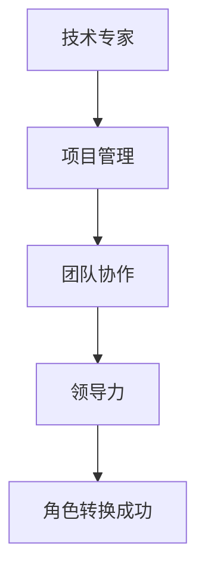
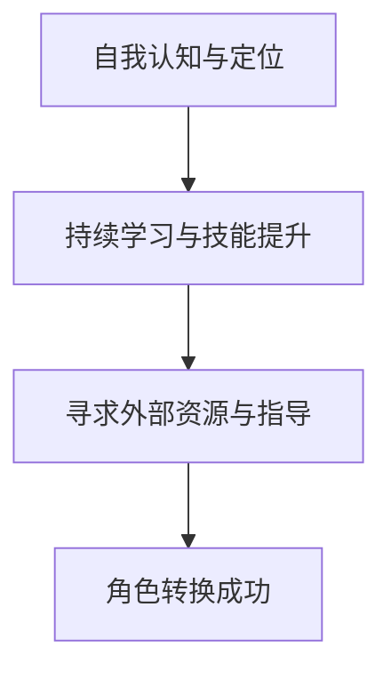

                 

# 技术管理者的角色转换与成长

## 摘要

本文旨在探讨技术管理者的角色转换与成长路径。通过对技术管理者面临的挑战、角色转换的方法与策略、个人成长规划、领导力培养、团队管理、项目管理实践以及技术趋势与未来展望的深入分析，为技术管理者提供一套全面且实用的成长指南。文章将通过具体案例和实践，帮助技术管理者更好地实现角色转变，提升领导力和团队管理能力，为企业的持续发展贡献力量。

## 关键词

技术管理者，角色转换，成长路径，领导力，团队管理，项目管理，技术趋势

## 引言

技术管理者的角色在企业中至关重要。他们不仅需要具备深厚的技术知识，还要具备出色的管理能力，能够有效协调团队、管理项目、推动技术创新。然而，随着技术的快速发展和企业环境的变化，技术管理者面临着一系列挑战，如技术与管理的平衡、角色转变的困惑等。因此，如何实现角色转换与成长，成为技术管理者亟待解决的问题。

本文将从以下几个方面展开讨论：

1. **角色转换**：分析技术管理者面临的挑战，探讨角色转换的方法与策略，分享成功案例。
2. **成长路径**：介绍个人成长规划，领导力培养，以及项目管理和团队协作的重要性。
3. **领导力与团队管理**：探讨领导风格与团队动力的关系，高效团队建设的方法，以及领导力与个人发展的关系。
4. **项目管理实践**：介绍项目管理流程与工具，风险管理，质量管理，并结合案例分析进行深入讲解。
5. **技术趋势与未来展望**：分析技术发展趋势，探讨技术管理者的新角色，以及企业应对技术趋势的策略。

通过以上内容，本文旨在为技术管理者提供一套实用的成长指南，帮助他们实现角色转换与成长，提升领导力和团队管理能力，为企业的持续发展贡献力量。

## 确定核心概念：技术管理者的角色转换与成长

在探讨技术管理者的角色转换与成长之前，我们需要明确几个核心概念。这些概念不仅是技术管理者日常工作的基础，也是实现角色转换和成长的关键。

### 技术管理者的角色

技术管理者在企业中扮演多重角色，包括但不限于：

- **技术专家**：技术管理者首先需要具备扎实的技术背景，能够解决复杂的技术问题，指导团队进行技术创新。
- **团队领导者**：技术管理者需要具备领导力，能够带领团队共同实现目标，提升团队的整体绩效。
- **项目管理者**：技术管理者需要掌握项目管理的基本知识，能够规划、执行、监控和收尾项目，确保项目按时、按质、按预算完成。
- **变革推动者**：技术管理者需要具备推动技术变革的能力，引领团队适应新技术、新方法，从而提升企业的竞争力。

### 角色转换的定义

角色转换是指技术管理者从传统的技术专家角色向更加综合的管理者角色转变的过程。这一过程通常包括以下方面：

- **技能转换**：从单一的技术技能向多领域的综合技能转变，如项目管理、团队领导、沟通协调等。
- **思维方式**：从以技术为中心的思维方式向以企业目标为导向的思维方式转变。
- **责任范围**：从关注个人技术成果向关注团队整体绩效和项目成功转变。

### 成长路径

成长路径是指技术管理者在职业发展中，逐步提升自身能力和实现职业目标的过程。成长路径通常包括以下几个阶段：

- **入门阶段**：技术管理者需要打好技术基础，提升自己的专业技能。
- **发展阶段**：技术管理者需要逐步扩大知识面，学习管理知识和技能，提升领导力。
- **成熟阶段**：技术管理者需要实现职业目标，如晋升为部门主管或项目经理，推动企业的技术变革。

### 角色转换与成长路径的关系

角色转换和成长路径密切相关。角色转换是成长路径中的一个重要环节，它决定了技术管理者能否顺利实现职业目标。而成长路径则为角色转换提供了必要的知识和技能支持。

通过明确这些核心概念，我们可以更好地理解技术管理者的角色转换与成长过程，为后续内容提供理论基础。

### 确定书籍的主要目标读者群体

本文的主要目标读者群体包括以下几类：

1. **技术管理者**：这些读者通常是已经在企业中担任技术管理职位的专业人士，他们希望通过本文了解角色转换与成长的方法，提升自身的管理能力和领导力。
2. **IT从业者**：包括软件开发工程师、系统架构师、数据库管理员等，他们正在寻求向技术管理者角色转换，希望通过本文获得相关知识和指导。
3. **技术领导**：如技术总监、首席技术官（CTO）等高级技术管理人员，他们需要了解如何更好地发挥领导力，推动团队和项目的发展。

对于这些目标读者群体，本文提供了以下具体帮助：

- **技术管理者**：通过分析角色转换的挑战、方法与策略，帮助他们更好地应对角色转变过程中的各种问题，提升管理水平和团队绩效。
- **IT从业者**：提供从技术专家向技术管理者角色转换的路径和建议，帮助他们了解管理知识，为未来的职业发展做好准备。
- **技术领导**：探讨领导力培养和团队管理的重要策略，帮助他们提升领导能力，推动企业的技术创新和业务发展。

### 确定书籍的主要主题

本文的主要主题围绕技术管理者的角色转换与成长展开。具体包括以下三个方面：

1. **角色转换**：分析技术管理者在角色转换过程中面临的挑战，探讨实现角色转换的方法与策略，并通过具体案例分享成功经验。
2. **成长路径**：介绍技术管理者在职业发展中的成长路径，包括个人成长规划、领导力培养、项目管理和团队协作等方面的内容。
3. **领导力与团队管理**：探讨技术管理者在领导力与团队管理方面的核心策略和实践，包括领导风格与团队动力的关系、高效团队建设的方法等。

通过这三个主要主题的深入分析，本文旨在为技术管理者提供一套全面且实用的成长指南，帮助他们实现角色转换，提升领导力和团队管理能力，从而为企业的持续发展贡献力量。

### 设计大纲结构

为了使本文的内容结构清晰、逻辑性强，我们将按照以下大纲结构进行组织：

#### 第一部分：角色转换

- **1.1 技术管理者面临的挑战**
  - **1.1.1 技术与管理的平衡**
  - **1.1.2 技术深度与广度的选择**
  - **1.1.3 管理责任的转变**

- **1.2 角色转换的方法与策略**
  - **1.2.1 自我认知与定位**
  - **1.2.2 持续学习与技能提升**
  - **1.2.3 寻求外部资源与指导**

- **1.3 成功案例分享**
  - **1.3.1 A公司的转变历程**
  - **1.3.2 B技术领导的经验分享**

#### 第二部分：成长路径

- **2.1 个人成长规划**
  - **2.1.1 成长目标设定**
  - **2.1.2 行动计划与执行**
  - **2.1.3 反馈与调整**

- **2.2 领导力培养**
  - **2.2.1 领导力模型分析**
  - **2.2.2 领导力提升策略**
  - **2.2.3 团队领导案例分析**

- **2.3 项目管理与团队协作**
  - **2.3.1 项目管理基础**
  - **2.3.2 团队协作技巧**
  - **2.3.3 项目成功案例分析**

#### 第三部分：领导力与团队管理

- **3.1 领导风格与团队动力**
  - **3.1.1 领导风格类型分析**
  - **3.1.2 团队动力的激发**

- **3.2 高效团队建设**
  - **3.2.1 团队文化建设**
  - **3.2.2 团队成员激励**
  - **3.2.3 团队冲突管理**

- **3.3 领导力与个人发展**
  - **3.3.1 领导者的自我提升**
  - **3.3.2 领导者与团队成员的关系**
  - **3.3.3 领导力与职业生涯规划**

#### 第四部分：项目管理实践

- **4.1 项目管理流程与工具**
  - **4.1.1 项目管理流程概述**
  - **4.1.2 项目管理工具介绍**
  - **4.1.3 项目管理案例分析**

- **4.2 风险管理**
  - **4.2.1 风险识别与评估**
  - **4.2.2 风险应对策略**
  - **4.2.3 风险监控与控制**

- **4.3 质量管理**
  - **4.3.1 质量管理原则与方法**
  - **4.3.2 质量管理工具与技术**
  - **4.3.3 质量管理案例分析**

#### 第五部分：技术趋势与未来展望

- **5.1 技术趋势分析**
  - **5.1.1 人工智能与自动化**
  - **5.1.2 云计算与边缘计算**
  - **5.1.3 区块链与分布式技术**

- **5.2 未来发展展望**
  - **5.2.1 技术管理者的新角色**
  - **5.2.2 技术趋势对企业管理的影响**
  - **5.2.3 企业在技术趋势中的应对策略**

通过以上五个部分的结构设计，本文将系统地探讨技术管理者的角色转换与成长路径，为技术管理者提供实用的指导和建议。

## 第一部分：角色转换

### 1.1 技术管理者面临的挑战

技术管理者在角色转换过程中会遇到诸多挑战，这些挑战涉及技术、管理以及个人成长等多个方面。以下是几个关键挑战：

#### 1.1.1 技术与管理的平衡

技术管理者首先需要处理的是技术与管理的平衡。作为技术专家，他们必须保持对技术趋势的敏感度和深入理解，以确保团队在技术上的竞争力。然而，随着管理职责的增加，技术管理者需要投入更多时间来处理团队管理、项目规划、资源分配等问题。这种平衡的难度在于，技术管理者往往需要在短时间内切换角色，从技术专家的角色迅速转变为管理者，这需要强大的自我管理和时间管理能力。

**解决方案：** 技术管理者可以通过以下策略来实现技术与管理的平衡：
- **时间管理**：合理规划工作时间，确保有足够的时间投入到技术研究和项目管理中。
- **团队合作**：培养团队成员的技术能力，使其能够承担更多技术职责，从而减轻管理者的负担。
- **目标设定**：明确个人和团队的目标，确保技术目标与管理目标的一致性。

#### 1.1.2 技术深度与广度的选择

技术管理者在职业发展中面临着深度与广度的选择问题。如果他们专注于某一特定领域，可能会成为该领域的专家，但可能会错失其他技术领域的发展机会。相反，如果追求技术广度，可能会分散精力，难以在某一领域达到顶尖水平。

**解决方案：** 技术管理者可以通过以下方式来处理深度与广度的选择问题：
- **技术专项**：选择一两个与自己兴趣和职业发展目标相关的技术领域进行深入研究。
- **技术网络**：积极参与技术社区和论坛，了解不同领域的最新动态，扩展知识面。
- **职业规划**：根据个人兴趣、能力和市场需求，合理规划职业发展方向。

#### 1.1.3 管理责任的转变

从技术专家到技术管理者的角色转换，不仅仅是职责的变化，更是管理责任的增加。技术管理者需要承担起团队绩效、项目成功以及企业技术创新的责任。这种责任转变对技术管理者的心理压力和责任感提出了更高的要求。

**解决方案：** 技术管理者可以通过以下方式来应对管理责任的转变：
- **心理准备**：提前做好心理准备，认识到管理责任的重要性，逐步适应新的角色。
- **学习经验**：通过阅读相关书籍、参加培训课程、向资深管理者请教，积累管理经验。
- **团队支持**：建立一支信任和协作的团队，共同承担责任，减轻个人压力。

通过以上分析，技术管理者在面对角色转换的挑战时，需要从多个方面进行思考和应对。只有通过不断学习和实践，才能在角色转换过程中取得成功。

### 1.2 角色转换的方法与策略

在明确了技术管理者面临的挑战后，接下来我们将探讨角色转换的方法与策略，帮助技术管理者顺利实现角色转变。以下是一些关键的方法与策略：

#### 1.2.1 自我认知与定位

自我认知是角色转换的第一步。技术管理者需要深入反思自己的价值观、兴趣、优势和弱点，明确自己的职业目标和定位。以下是一些自我认知的步骤：

1. **反思自身经历**：回顾过去的工作经历，分析哪些工作是令人兴奋且有成就感的，哪些工作是不愿意做的，从中找出自己的兴趣和擅长领域。
2. **评估个人优势与弱点**：分析自己在技术、管理、沟通等方面的优势和弱点，制定相应的提升计划。
3. **设定职业目标**：根据自身情况和市场需求，设定短期和长期的职业目标，明确自己在技术管理者角色中的发展方向。

**具体方法**：
- **职业规划工具**：使用职业规划工具，如SWOT分析（优势、劣势、机会、威胁）和职业路径图，帮助自己更好地进行自我认知和职业定位。
- **定期反思**：定期花时间反思自己的工作表现和职业发展，及时调整目标和策略。

#### 1.2.2 持续学习与技能提升

角色转换需要技术管理者具备新的知识和技能。为了实现这一目标，持续学习是必不可少的。以下是一些有效的学习策略：

1. **制定学习计划**：根据职业目标，制定详细的学习计划，包括学习内容、学习时间、学习方法等。
2. **利用在线资源**：利用各种在线平台，如Coursera、edX、Udemy等，参加相关课程和培训。
3. **阅读专业书籍**：阅读行业内的经典书籍和最新研究，了解前沿技术和管理理念。
4. **参与技术社区**：积极参与技术社区和论坛，与同行交流经验，拓展视野。

**具体方法**：
- **时间管理**：合理规划时间，确保每天有一定的学习时间。
- **实践应用**：将所学知识应用于实际工作中，通过实践来检验和提升自己的能力。

#### 1.2.3 寻求外部资源与指导

在角色转换过程中，寻求外部资源与指导是非常重要的。以下是一些有效的外部资源：

1. **导师制**：寻找一位经验丰富的导师，向他们请教职业发展和管理经验。
2. **行业会议**：参加行业会议和研讨会，了解行业动态，结识同行，扩展人脉。
3. **专业组织**：加入专业组织，如项目管理协会（PMI）、国际系统架构师协会（IASA）等，参加相关的培训和认证。
4. **在线社区**：加入在线社区和论坛，如Stack Overflow、GitHub等，与其他技术管理者交流心得。

**具体方法**：
- **建立人脉网络**：通过参加各种活动和会议，积极与他人交流，建立自己的职业网络。
- **定期辅导**：定期与导师或同行进行辅导和交流，获取反馈和建议。

通过自我认知与定位、持续学习与技能提升、以及寻求外部资源与指导，技术管理者可以更好地实现角色转换，为未来的职业发展打下坚实的基础。

### 1.3 成功案例分享

#### 1.3.1 A公司的转变历程

A公司是一家大型互联网企业，在数字化转型过程中，成功实现了技术管理者的角色转换。以下是A公司这一转变的详细过程：

**背景介绍**：

随着A公司的业务快速发展，对技术团队的要求越来越高。原有的技术管理者在技术领域表现突出，但在项目管理、团队协作等方面存在不足，导致项目进度不稳定、团队士气低落。为了提升整体竞争力，公司决定推动技术管理者的角色转换。

**核心概念与联系**：

角色转换的过程涉及多个核心概念，如项目管理、团队协作、领导力等。这些概念之间的关系可以表示为以下Mermaid流程图：



**核心算法原理讲解**：

为了实现角色转换，A公司采用了以下核心算法原理：

1. **项目管理培训**：公司为技术管理者提供项目管理培训，包括PMP（项目管理专业人士）认证课程，提升其项目管理能力。
2. **领导力培养**：通过领导力培训，技术管理者学习了不同的领导风格和团队激励方法，提升了领导力水平。
3. **实践应用**：技术管理者在项目中实践所学的项目管理知识和领导力方法，通过实际操作来提升自己的综合能力。

**数学模型和公式**：

在项目管理中，A公司采用了关键路径法（CPM）来优化项目进度。关键路径法中的关键公式为：

$$
\text{关键路径} = \text{活动持续时间} \times (\text{最早开始时间} + \text{最晚开始时间})
$$

**详细讲解与举例说明**：

A公司的技术管理者在参加培训后，开始将所学知识应用于实际工作中。例如，某项目负责人在负责一个新产品的开发项目时，通过关键路径法确定了项目的关键环节和里程碑，确保项目按时完成。

**项目实战**：

在实际项目中，项目负责人通过以下步骤来实现角色转换：

1. **项目规划**：制定详细的项目计划，明确项目目标、任务分配、资源需求等。
2. **团队协作**：利用敏捷开发方法，组织团队进行每日站会、迭代评审，提高团队协作效率。
3. **领导力实践**：通过激励团队、及时沟通，提升团队士气和工作效率。

**代码实现**：

在代码实现方面，项目负责人采用以下伪代码来管理项目进度：

```pseudo
function manageProject() {
    // 定义项目任务和资源
    tasks = ["需求分析", "设计", "开发", "测试", "部署"]
    resources = ["开发人员", "测试人员", "运维人员"]

    // 确定关键路径
    criticalPath = calculateCriticalPath(tasks)

    // 执行任务
    for (task in tasks) {
        if (task in criticalPath) {
            executeTask(task, resources)
        }
    }
}
```

**案例分析与详细讲解剖析**：

通过这一转变，A公司的技术管理者成功实现了角色转换，不仅提升了项目管理能力，还增强了团队协作和领导力。以下是对这一案例的详细剖析：

1. **项目管理能力提升**：技术管理者通过学习项目管理知识和工具，如关键路径法，优化了项目进度，确保项目按时交付。
2. **团队协作加强**：通过敏捷开发方法，团队成员之间的沟通和协作更加顺畅，提高了项目的执行效率。
3. **领导力提升**：技术管理者通过激励团队、及时沟通，提升了团队士气和工作效率，增强了团队的凝聚力。

**项目小结**：

A公司的成功案例表明，技术管理者通过自我认知与定位、持续学习与技能提升，以及寻求外部资源与指导，可以实现角色转换，提升管理能力和领导力，为企业的持续发展贡献力量。

### 1.3.2 B技术领导的经验分享

B技术领导曾是一家中型软件公司的首席技术官（CTO），他在技术管理者的角色转换过程中积累了丰富的经验。以下是他的经验分享：

**背景介绍**：

B技术领导在担任CTO之前，是一名资深软件工程师，拥有丰富的技术背景和项目经验。然而，在转型过程中，他意识到仅凭技术能力无法应对复杂的管理和领导任务，因此开始积极学习和探索角色转换的方法。

**核心经验与联系**：

B技术领导认为，角色转换的关键在于以下几个方面：

1. **自我认知与定位**：明确自己的兴趣和优势，找到适合自己的管理角色。
2. **持续学习与技能提升**：不断学习新的管理知识和技能，保持对技术和管理领域的敏锐度。
3. **寻求外部资源与指导**：积极寻求导师和同行的指导，扩展自己的职业网络。

这些核心经验之间的关系可以用以下Mermaid流程图表示：



**核心算法原理讲解**：

B技术领导在角色转换过程中，采用了以下核心算法原理：

1. **目标设定**：通过SMART原则（具体、可衡量、可实现、相关、时限）设定职业目标，确保目标的明确性和可实现性。
2. **行动规划**：根据目标制定详细的行动计划，包括学习内容、时间安排、关键里程碑等。
3. **反馈机制**：定期评估自身的学习成果和职业发展，及时调整目标和策略。

**数学模型和公式**：

为了更好地实现角色转换，B技术领导使用了以下数学模型：

$$
\text{角色转换成功率} = \frac{\text{实现目标数}}{\text{设定目标数}}
$$

**详细讲解与举例说明**：

B技术领导在设定职业目标时，明确了自己的兴趣在于技术管理和团队领导。他设定了以下目标：

1. **完成PMP认证**：通过学习PMP课程，提升项目管理能力。
2. **领导一个成功项目**：在项目中实践所学管理知识，确保项目按时、按质完成。
3. **建立导师关系**：寻找一位资深管理者作为导师，获得指导和支持。

通过行动规划和反馈机制，B技术领导逐步实现了这些目标。他在项目中积极运用项目管理工具和方法，如Gantt图和风险管理矩阵，优化了项目进度和团队协作。

**项目实战**：

在一次重要的软件升级项目中，B技术领导通过以下步骤实现了角色转换：

1. **项目规划**：制定详细的软件升级计划，明确项目目标、任务分配、资源需求等。
2. **团队协作**：组织团队进行每日站会，解决开发过程中的问题，确保团队协作顺畅。
3. **领导力实践**：通过激励团队、及时沟通，提升团队士气和工作效率。

**代码实现**：

在项目实战中，B技术领导采用以下伪代码来管理团队和项目：

```pseudo
function manageProject() {
    // 定义项目任务和团队角色
    tasks = ["需求分析", "设计", "开发", "测试", "部署"]
    roles = ["开发人员", "测试人员", "项目经理"]

    // 确定关键任务和角色
    criticalTasks = ["需求分析", "设计"]
    criticalRoles = ["项目经理", "开发人员"]

    // 执行任务
    for (task in tasks) {
        if (task in criticalTasks) {
            executeTask(task, criticalRoles)
        } else {
            executeTask(task, roles)
        }
    }
}
```

**案例分析与详细讲解剖析**：

B技术领导通过自我认知与定位、持续学习与技能提升，以及寻求外部资源与指导，成功实现了角色转换。以下是对这一案例的详细剖析：

1. **自我认知与定位**：B技术领导明确了自身兴趣和优势，找到了适合自己的管理角色，为角色转换奠定了基础。
2. **持续学习与技能提升**：通过学习新的管理知识和技能，B技术领导提升了自身的项目管理能力和领导力。
3. **寻求外部资源与指导**：通过建立导师关系和参与行业会议，B技术领导扩展了职业网络，获得了宝贵的指导和支持。

**项目小结**：

B技术领导的成功经验表明，技术管理者通过科学的方法和策略，可以实现角色转换，提升管理能力和领导力，为企业的持续发展贡献力量。他的经验对其他技术管理者具有重要的借鉴意义。

## 第二部分：成长路径

### 2.1 个人成长规划

技术管理者的成长路径是职业发展的关键。个人成长规划是这一路径的核心，它决定了技术管理者能否实现职业目标，提升自身的综合能力。以下是个人成长规划的具体内容和实施步骤：

#### 2.1.1 成长目标设定

成长目标设定是个人成长规划的第一步。技术管理者需要明确自己的职业愿景，并制定具体的成长目标。以下是设定成长目标的一些关键步骤：

1. **明确职业愿景**：技术管理者应思考自己未来想要达到的职业高度和领域，如技术总监、首席技术官（CTO）等。
2. **分析自身优势和短板**：通过自我评估，分析自身的优势和短板，找到需要提升的领域。
3. **设定短期和长期目标**：根据职业愿景和自身情况，设定短期（1-3年）和长期（3-5年）的成长目标，确保目标的可实现性。

**具体方法**：

- **SMART原则**：使用SMART（具体、可衡量、可实现、相关、时限）原则来设定目标，确保目标的明确性和可实现性。
- **分解目标**：将长期目标分解为若干个短期目标，逐步实现。

#### 2.1.2 行动计划与执行

在设定了成长目标后，技术管理者需要制定具体的行动计划，确保目标的实现。以下是行动计划与执行的一些关键步骤：

1. **制定学习计划**：根据成长目标，制定详细的学习计划，包括学习内容、学习时间、学习方法等。
2. **分配资源**：合理分配时间、资金和其他资源，确保学习计划的顺利实施。
3. **执行计划**：按照学习计划，逐步执行各项任务，确保学习目标的实现。

**具体方法**：

- **时间管理**：使用时间管理工具，如日历、任务清单等，合理安排学习时间，确保学习计划的执行。
- **反馈机制**：定期评估学习成果，及时调整学习计划，确保目标的实现。

#### 2.1.3 反馈与调整

反馈与调整是个人成长规划的重要环节。技术管理者需要通过以下步骤，不断优化自己的成长路径：

1. **收集反馈**：从同事、上级和导师等不同渠道收集反馈，了解自己在成长过程中存在的问题和不足。
2. **评估成果**：定期评估自身的成长成果，与设定的目标进行对比，分析实现程度。
3. **调整计划**：根据反馈和评估结果，调整成长目标和行动计划，确保持续进步。

**具体方法**：

- **定期评估**：每月或每季度进行一次成长评估，及时发现问题并采取措施。
- **动态调整**：根据实际情况，灵活调整成长目标和行动计划，确保目标的实现。

通过个人成长规划的设定、执行和反馈与调整，技术管理者可以系统地提升自身的综合能力，实现职业发展目标。

### 2.2 领导力培养

领导力是技术管理者在职业发展中不可或缺的重要能力。有效的领导力不仅能够提升团队绩效，还能激发团队成员的潜力，推动企业的创新和发展。以下将介绍领导力模型分析、提升策略以及团队领导案例分析，帮助技术管理者更好地培养领导力。

#### 2.2.1 领导力模型分析

领导力模型是理解领导力关键要素和作用方式的理论框架。以下是几种常见的领导力模型：

1. **行为领导模型**：该模型认为领导力是通过领导者的行为表现来实现的。领导者的行为可以分为任务行为和关系行为两类。任务行为包括设定目标、分配任务、监督进度等；关系行为包括支持员工、建立信任、提供反馈等。行为领导模型强调领导者需要在不同情境下灵活调整行为，以实现最佳领导效果。

2. **变革型领导模型**：变革型领导强调领导者通过激发和激励团队成员的内在动力，推动团队实现变革和发展。变革型领导具有以下特点：
   - **愿景领导**：领导者明确企业的愿景和目标，通过沟通和激励，使团队成员认同并积极追求。
   - **激励和赋能**：领导者通过激励和赋能，提升团队成员的自我认知和自我效能感，激发其潜力。
   - **个性化关怀**：领导者关注团队成员的个人需求和成长，提供个性化的支持和指导。

3. **服务型领导模型**：服务型领导强调领导者通过为团队成员提供服务，解决他们的需求和问题，实现团队的成功。服务型领导具有以下特点：
   - **员工关怀**：领导者关注员工的身心健康，提供必要的支持和资源，帮助其成长。
   - **倾听和反馈**：领导者积极倾听员工的意见和建议，提供及时和有效的反馈，促进员工的成长。
   - **组织服务**：领导者以组织的服务为己任，致力于解决组织面临的问题，推动组织的持续发展。

#### 2.2.2 领导力提升策略

要提升领导力，技术管理者可以采取以下策略：

1. **自我认知与反思**：技术管理者需要深入了解自己的性格特点、价值观、优势和不足，通过反思和总结，不断提升自我认知。

2. **持续学习和培训**：技术管理者应不断学习新的管理知识和技能，参加领导力培训课程，提高自身的领导能力。

3. **实践与反思**：通过实际工作中的领导实践，积累经验，并及时反思和总结，不断提升领导力。

4. **建立人脉网络**：通过建立和维护人脉网络，与不同背景的人交流，学习他们的领导经验和方法。

5. **寻求反馈**：定期从团队成员、上级和其他领导者那里获取反馈，了解自己的领导风格和效果，及时调整和改进。

#### 2.2.3 团队领导案例分析

以下是两个技术管理者的团队领导案例分析，通过这些案例可以更好地理解领导力在团队管理中的作用。

**案例1：A公司的技术总监**

A公司的技术总监李明在担任技术总监后，意识到领导力对于团队成功的重要性。他通过以下措施提升团队领导力：

1. **明确愿景**：李明明确公司的技术愿景，并与团队成员分享，使大家明确目标，增强团队凝聚力。

2. **培养团队文化**：李明倡导开放、协作和创新的团队文化，鼓励团队成员提出新的想法和解决方案。

3. **激励和赋能**：李明通过激励和赋能，提升团队成员的自我效能感，鼓励他们大胆尝试和创新。

4. **建立反馈机制**：李明建立定期的团队反馈会议，听取团队成员的意见和建议，及时调整团队策略。

通过这些措施，A公司的团队绩效显著提升，成功实现了多项技术创新。

**案例2：B公司的项目经理**

B公司的项目经理张华在负责一个跨部门项目时，面临着团队成员沟通不畅、进度缓慢等问题。他通过以下措施提升了团队领导力：

1. **建立沟通机制**：张华建立了定期的项目例会，确保团队成员之间的沟通畅通。

2. **分配明确任务**：张华明确了每个团队成员的任务和职责，确保任务分配合理。

3. **激励和关怀**：张华关注团队成员的个人需求，提供必要的支持和资源，帮助他们解决工作和生活中的问题。

4. **鼓励创新**：张华鼓励团队成员提出新的想法和解决方案，激发团队的创新能力。

通过这些措施，B公司的项目进度加快，团队协作更加顺畅，项目最终成功完成。

通过以上案例可以看出，有效的领导力对于团队管理至关重要。技术管理者可以通过明确愿景、培养团队文化、激励和赋能、建立反馈机制等措施，提升团队领导力，推动团队和项目的成功。

### 2.3 项目管理与团队协作

项目管理是技术管理者的一项核心能力，而团队协作则是实现项目管理成功的关键。以下将详细探讨项目管理基础、团队协作技巧以及项目成功案例分析。

#### 2.3.1 项目管理基础

项目管理基础包括项目生命周期、关键流程和常用工具等方面。以下是项目管理基础的主要内容：

1. **项目生命周期**：项目生命周期包括启动、规划、执行、监控和收尾五个阶段。
   - **启动阶段**：确定项目目标、范围和可行性，组建项目团队。
   - **规划阶段**：制定详细的项目计划，包括任务分配、资源调配、风险评估等。
   - **执行阶段**：按照项目计划，执行具体任务，确保项目按计划进行。
   - **监控阶段**：监控项目进度、质量和成本，及时调整计划，确保项目顺利进行。
   - **收尾阶段**：完成项目交付，进行项目总结和评估，为未来项目提供经验教训。

2. **关键流程**：项目管理的关键流程包括项目规划、项目执行、项目监控和项目收尾。
   - **项目规划**：制定项目计划，明确项目目标、任务分配、时间安排、资源需求等。
   - **项目执行**：执行项目计划，确保任务按时完成，团队协作顺畅。
   - **项目监控**：监控项目进度、质量和成本，及时发现和解决问题。
   - **项目收尾**：完成项目交付，进行项目总结和评估。

3. **常用工具**：项目管理中常用的工具包括Gantt图、甘特图、任务板、项目管理软件等。
   - **Gantt图**：用于展示项目任务的时间安排和进度，直观地反映项目的执行情况。
   - **甘特图**：用于监控项目进度和任务分配，便于团队协作和项目管理。
   - **任务板**：用于跟踪任务状态和进度，便于团队协作和任务管理。
   - **项目管理软件**：如JIRA、Trello等，提供全面的任务管理、进度监控和团队协作功能。

#### 2.3.2 团队协作技巧

团队协作技巧是技术管理者必须掌握的重要技能。以下是一些关键的团队协作技巧：

1. **沟通技巧**：良好的沟通是团队协作的基础。技术管理者应具备有效的沟通技巧，包括倾听、表达、反馈等。
   - **倾听**：倾听是沟通的重要部分，通过倾听，技术管理者可以了解团队成员的需求和意见。
   - **表达**：清晰、简洁的表达能够确保信息的准确传达。
   - **反馈**：及时给予团队成员反馈，帮助其改进工作，提升团队整体绩效。

2. **冲突解决**：在团队协作过程中，难免会出现冲突。技术管理者应具备冲突解决的能力，包括理解冲突原因、寻找解决方案、促进对话等。

3. **激励机制**：通过激励措施，如奖励、认可和培训等，激发团队成员的积极性和创造力，提升团队协作效果。

4. **任务分配**：合理分配任务，确保每个团队成员都能充分发挥自己的优势，避免过度依赖或资源浪费。

5. **团队文化建设**：建设积极、和谐、具有共同目标的团队文化，提升团队凝聚力和协作能力。

#### 2.3.3 项目成功案例分析

以下是一个项目成功案例的分析，通过该案例可以深入了解项目管理与团队协作的具体实践。

**案例：C公司的ERP系统升级项目**

C公司是一家大型制造企业，为了提升企业信息化水平，决定进行ERP系统升级。该项目由技术经理王强负责，以下是项目成功的关键要素：

1. **项目规划**：
   - **明确目标**：王强明确了ERP系统升级的目标，包括提升系统稳定性、优化业务流程、增强数据分析能力等。
   - **制定计划**：王强制定了详细的项目计划，包括任务分配、时间安排、资源调配等，确保项目按计划进行。

2. **团队协作**：
   - **组建团队**：王强组建了一支由系统架构师、开发人员、测试人员和业务专家组成的团队，确保项目各环节的专业性和协同性。
   - **沟通机制**：王强建立了定期的项目例会，确保团队成员之间的信息畅通，及时解决遇到的问题。

3. **风险管理**：
   - **识别风险**：王强在项目启动时，对潜在的风险进行了识别和评估，包括技术风险、业务风险和时间风险。
   - **制定应对策略**：针对识别出的风险，王强制定了相应的应对策略，包括备用方案、资源调配和沟通协调等。

4. **项目监控**：
   - **进度监控**：王强通过Gantt图和任务板，实时监控项目进度，确保任务按时完成。
   - **质量监控**：王强对项目质量进行严格监控，确保系统升级后的稳定性、可靠性和性能。

5. **项目收尾**：
   - **项目总结**：项目结束后，王强组织团队进行了项目总结，分析了项目中的成功经验和不足之处，为未来项目提供了宝贵的经验。
   - **用户培训**：为了确保系统升级后的顺利使用，王强组织了用户培训，提高了用户对系统的熟悉度。

**案例分析与详细讲解剖析**：

C公司的ERP系统升级项目成功的关键在于以下几个方面：

1. **明确的目标和计划**：王强明确了项目目标，制定了详细的项目计划，确保项目有明确的方向和可执行性。
2. **有效的团队协作**：王强通过组建专业团队、建立沟通机制，确保了项目各环节的协同和高效。
3. **全面的风险管理**：王强对项目风险进行了识别和评估，制定了应对策略，确保项目在遇到问题时能够迅速应对。
4. **严格的项目监控**：王强通过进度和质量监控，确保了项目按时、按质、按预算完成。
5. **有效的项目收尾**：王强组织了项目总结和用户培训，为项目的成功奠定了基础。

通过以上分析，可以看出项目管理与团队协作在项目成功中的重要性。技术管理者需要通过科学的规划和有效的执行，确保项目的成功，为企业的持续发展贡献力量。

### 第三部分：领导力与团队管理

#### 3.1 领导风格与团队动力

领导风格对团队动力具有重要影响。不同的领导风格会带来不同的团队动力和效果。以下是几种常见的领导风格类型及其对团队动力的关系：

1. **权威型领导风格**：
   - **特点**：领导者拥有绝对的权力和控制，决策高度集中。
   - **团队动力**：权威型领导风格可能会带来高效和迅速的决策，但在长期内可能削弱团队成员的自主性和创新能力。
   - **应用场景**：适用于紧急情况或需要快速决策的场景。

2. **民主型领导风格**：
   - **特点**：领导者鼓励团队成员参与决策，尊重团队意见，决策过程较为开放。
   - **团队动力**：民主型领导风格能够增强团队成员的参与感和归属感，激发创新和团队合作精神。
   - **应用场景**：适用于需要团队成员广泛参与和决策的复杂项目。

3. **支持型领导风格**：
   - **特点**：领导者关注团队成员的个人需求和成长，提供支持和资源。
   - **团队动力**：支持型领导风格能够提升团队成员的工作满意度和忠诚度，增强团队凝聚力。
   - **应用场景**：适用于需要高度信任和协作的项目。

4. **教练型领导风格**：
   - **特点**：领导者注重团队成员的技能提升和个人发展，提供指导和支持。
   - **团队动力**：教练型领导风格能够激发团队成员的潜力，提升其能力和自信心。
   - **应用场景**：适用于需要团队成员不断提升能力和应对挑战的项目。

#### 3.1.2 团队动力的激发

团队动力的激发是领导力的重要组成部分。以下是几种常用的激发团队动力的方法：

1. **目标设定**：设定明确、可实现的团队目标，使团队成员明确自己的工作意义和目标，提升工作动力。

2. **激励机制**：通过奖励、认可和晋升等激励机制，激发团队成员的积极性和创造力。

3. **沟通与反馈**：建立良好的沟通渠道，及时给予团队成员反馈，增强团队凝聚力和信任感。

4. **参与与授权**：鼓励团队成员参与决策和项目管理，赋予其一定的自主权和责任，提升其参与感和成就感。

5. **培训和成长**：提供培训和成长机会，帮助团队成员提升技能和能力，增强其职业发展动力。

#### 3.2 高效团队建设

高效团队建设是技术管理者的重要任务之一。以下是高效团队建设的几个关键方面：

1. **团队文化建设**：
   - **价值观**：建立共同的团队价值观，使团队成员认同和遵循。
   - **沟通机制**：建立良好的沟通机制，确保团队成员之间的信息畅通。
   - **协作精神**：培养团队成员的协作精神，促进团队内部的紧密合作。

2. **团队成员激励**：
   - **目标激励**：设定明确的个人和团队目标，激发团队成员的积极性。
   - **荣誉激励**：通过荣誉和表彰，提升团队成员的荣誉感和归属感。
   - **成长激励**：提供成长机会和职业发展路径，激发团队成员的长期动力。

3. **团队冲突管理**：
   - **识别冲突**：及时发现和识别团队中的冲突，防止冲突扩大。
   - **沟通解决**：通过有效沟通，帮助团队成员理解和解决冲突。
   - **调解与协调**：在必要时，通过调解和协调，促进团队成员达成共识。

#### 3.3 领导力与个人发展

领导力与个人发展密切相关。以下是领导力对个人发展的影响以及如何通过领导力实现个人成长：

1. **领导力对个人发展的影响**：
   - **职业晋升**：优秀的领导能力有助于技术管理者在职业道路上获得晋升机会。
   - **能力提升**：领导力的发展可以提升个人的沟通、协调、决策等综合能力。
   - **影响力**：领导能力增强了个人的影响力，使其能够在团队和组织中发挥更大的作用。

2. **如何通过领导力实现个人成长**：
   - **持续学习**：通过学习和实践，不断提升自己的领导能力。
   - **反思与总结**：定期反思领导实践，总结经验教训，不断提升领导水平。
   - **寻求反馈**：积极寻求团队成员和同行的反馈，了解自己的优势和不足，不断改进。

通过领导力的发展，技术管理者不仅能够提升自身的职业竞争力，还能够为团队和组织的发展做出更大的贡献。

## 第四部分：项目管理实践

### 4.1 项目管理流程与工具

项目管理流程是确保项目顺利实施的关键。以下是项目管理流程的概述以及常用工具的介绍。

#### 4.1.1 项目管理流程概述

项目管理流程通常包括以下几个关键阶段：

1. **项目启动**：
   - **项目立项**：明确项目目标、范围和可行性。
   - **组建团队**：确定项目团队成员，明确职责和权限。
   - **制定项目计划**：制定详细的项目计划，包括任务分配、时间安排、资源需求等。

2. **项目规划**：
   - **需求分析**：收集和分析项目需求，确保项目目标明确。
   - **制定详细计划**：制定详细的任务分配、时间安排和资源调配计划。
   - **风险评估**：识别和评估项目风险，制定应对策略。

3. **项目执行**：
   - **任务分配**：将任务分配给合适的团队成员，确保任务按时完成。
   - **监控进度**：实时监控项目进度，确保项目按计划进行。
   - **团队协作**：促进团队成员之间的协作，解决遇到的问题。

4. **项目监控**：
   - **质量监控**：确保项目质量符合要求，及时进行质量检查和评估。
   - **成本控制**：监控项目成本，确保项目在预算范围内完成。
   - **变更管理**：处理项目变更，确保项目目标的实现。

5. **项目收尾**：
   - **项目交付**：完成项目交付，确保项目目标实现。
   - **项目总结**：总结项目经验教训，为未来项目提供参考。
   - **项目评估**：评估项目成功程度，提出改进建议。

#### 4.1.2 项目管理工具介绍

项目管理工具是帮助技术管理者高效执行项目管理任务的重要工具。以下是几种常用的项目管理工具：

1. **Gantt图**：
   - **特点**：用于展示项目任务的时间安排和进度，直观地反映项目的执行情况。
   - **应用**：适用于项目规划、任务分配和进度监控。

2. **甘特图**：
   - **特点**：用于监控项目进度和任务分配，便于团队协作和项目管理。
   - **应用**：适用于项目执行和监控阶段。

3. **任务板**：
   - **特点**：用于跟踪任务状态和进度，便于团队协作和任务管理。
   - **应用**：适用于任务分配、进度监控和团队协作。

4. **项目管理软件**：
   - **特点**：提供全面的任务管理、进度监控和团队协作功能。
   - **应用**：适用于项目管理的各个阶段。

#### 4.1.3 项目管理案例分析

以下是一个项目管理成功案例的分析，通过该案例可以深入了解项目管理流程与工具的具体应用。

**案例：D公司的产品研发项目**

D公司是一家软件公司，为了提升产品竞争力，决定开展一次产品研发项目。以下是该项目在项目管理流程与工具上的应用：

1. **项目启动**：
   - **项目立项**：公司高层明确了产品研发的目标和范围，组建了项目团队。
   - **制定项目计划**：项目经理制定了详细的项目计划，包括任务分配、时间安排和资源需求。

2. **项目规划**：
   - **需求分析**：项目经理与产品经理、客户代表进行了多次沟通，明确了产品的功能需求和用户体验。
   - **制定详细计划**：项目经理制定了详细的任务分配、时间安排和风险评估计划。

3. **项目执行**：
   - **任务分配**：项目经理将任务分配给各团队成员，明确了任务的优先级和完成时间。
   - **监控进度**：项目经理通过Gantt图和任务板，实时监控项目进度，确保任务按时完成。

4. **项目监控**：
   - **质量监控**：项目经理设立了质量检查环节，确保每个阶段的产品质量符合要求。
   - **成本控制**：项目经理监控项目成本，确保项目在预算范围内完成。

5. **项目收尾**：
   - **项目交付**：项目经理完成了产品研发，进行了产品交付和用户培训。
   - **项目总结**：项目团队进行了项目总结，分析了项目中的成功经验和不足之处。

**案例分析与详细讲解剖析**：

D公司的产品研发项目成功的关键在于以下几个方面：

1. **明确的目标和计划**：公司高层明确了产品研发的目标，项目经理制定了详细的项目计划，确保项目有明确的方向和可执行性。

2. **有效的团队协作**：项目经理通过Gantt图和任务板，确保了项目各环节的协同和高效，促进了团队成员之间的协作。

3. **全面的风险管理**：项目经理在项目规划阶段，对潜在的风险进行了识别和评估，制定了应对策略，确保了项目的顺利进行。

4. **严格的项目监控**：项目经理通过质量监控和成本控制，确保了项目按时、按质、按预算完成。

5. **有效的项目收尾**：项目团队进行了项目总结，分析了项目中的成功经验和不足之处，为未来项目提供了宝贵的经验。

通过以上分析，可以看出项目管理流程与工具在项目成功中的重要性。技术管理者需要通过科学的规划和有效的执行，确保项目的成功，为企业的持续发展贡献力量。

### 4.2 风险管理

风险管理是项目管理中至关重要的一环，旨在识别、评估和应对项目中的潜在风险，以确保项目的顺利进行和目标的实现。以下将详细探讨风险识别与评估、风险应对策略以及风险监控与控制。

#### 4.2.1 风险识别与评估

风险识别是风险管理的第一步，旨在识别项目中可能出现的各种风险。以下是风险识别的几种常用方法：

1. **头脑风暴**：通过团队会议的形式，让团队成员共同讨论项目可能面临的风险。
2. **历史数据**：分析过去类似项目中的风险，从中识别可能出现的新风险。
3. **专家咨询**：邀请行业专家或经验丰富的项目经理，提供风险识别的建议。
4. **文档审查**：审查项目文档，如需求说明书、设计文档等，识别潜在的风险。

在识别出项目风险后，需要对风险进行评估，以确定其影响程度和发生概率。以下是风险评估的几个关键步骤：

1. **定性评估**：通过专家判断或评分方法，对风险的影响程度和发生概率进行定性评估。
2. **定量评估**：使用数学模型或统计方法，对风险的影响程度和发生概率进行定量评估。
3. **优先级排序**：根据风险的影响程度和发生概率，对风险进行优先级排序，确定需要重点关注和应对的风险。

#### 4.2.2 风险应对策略

在评估出项目风险后，需要制定相应的风险应对策略，以减少风险对项目的影响。以下是几种常用的风险应对策略：

1. **风险规避**：通过调整项目计划或资源配置，避免风险的发生。
   - **应用场景**：适用于风险发生概率高且影响较大的风险。

2. **风险减轻**：通过采取措施，减少风险的发生概率或影响程度。
   - **应用场景**：适用于风险发生概率较高但影响可控的风险。

3. **风险转移**：通过合同或保险等方式，将风险转移给其他方。
   - **应用场景**：适用于无法规避或减轻的风险。

4. **风险接受**：在风险发生概率较低或影响较小的情况下，选择接受风险。
   - **应用场景**：适用于风险发生概率低且影响可控的风险。

#### 4.2.3 风险监控与控制

在实施风险应对策略后，需要对风险进行持续监控与控制，以确保风险在可控范围内。以下是风险监控与控制的几个关键步骤：

1. **建立风险监控机制**：制定风险监控计划，明确监控频率、监控内容和监控责任人。
2. **定期评估风险状态**：通过定期评估，了解风险的变化情况，及时调整风险应对策略。
3. **风险预警**：在风险可能发生前，及时发出预警，采取相应的预防措施。
4. **风险处理**：在风险发生后，及时处理和解决，减少风险对项目的影响。

#### 风险管理案例分析

以下是一个风险管理成功案例的分析，通过该案例可以深入了解风险管理在项目中的具体应用。

**案例：E公司的IT系统升级项目**

E公司为了提升IT系统的稳定性，决定进行一次系统升级。以下是该项目在风险管理方面的应用：

1. **风险识别与评估**：
   - **识别风险**：项目经理通过头脑风暴和文档审查，识别出可能的风险，如技术难度、资源不足、用户培训等。
   - **评估风险**：项目经理对识别出的风险进行定量评估，确定其影响程度和发生概率，并按优先级排序。

2. **风险应对策略**：
   - **风险规避**：对于技术难度较高的部分，项目经理决定外包给专业的技术团队，以规避技术风险。
   - **风险减轻**：对于用户培训部分，项目经理增加了培训时间和培训内容，以减轻用户使用新系统的难度。
   - **风险转移**：项目经理与外包技术团队签订了详细的服务合同，将技术风险转移给外包团队。

3. **风险监控与控制**：
   - **建立监控机制**：项目经理制定了风险监控计划，每两周进行一次风险评估，及时调整风险应对策略。
   - **定期评估风险状态**：通过定期评估，项目经理发现了一些潜在的风险，如系统兼容性问题，并提前采取了预防措施。
   - **风险处理**：在系统升级过程中，出现了一些兼容性问题，项目经理及时与外包团队沟通，迅速解决了问题。

**案例分析与详细讲解剖析**：

E公司的IT系统升级项目成功的关键在于以下几个方面：

1. **全面的风险识别与评估**：项目经理通过多种方法识别和评估了项目中的风险，确保了风险的全面性和准确性。

2. **合理的风险应对策略**：项目经理根据风险的不同特点和影响，制定了合理的风险应对策略，有效减少了风险对项目的影响。

3. **有效的风险监控与控制**：项目经理建立了有效的风险监控机制，定期评估风险状态，确保了风险在可控范围内。

通过以上分析，可以看出风险管理在项目成功中的重要性。技术管理者需要通过全面的风险识别、合理的风险应对策略和有效的风险监控与控制，确保项目的顺利进行和目标的实现。

### 4.3 质量管理

质量管理是项目管理中的重要组成部分，旨在确保项目交付的产品或服务满足既定的质量标准。以下是质量管理的原则与方法、质量管理工具与技术的详细介绍以及质量管理案例分析。

#### 4.3.1 质量管理原则与方法

1. **质量管理体系**：
   - **ISO 9001**：国际标准化组织（ISO）制定的质量管理体系标准，提供了一套全面的质量管理原则和方法。
   - **PDCA循环**：计划（Plan）、执行（Do）、检查（Check）、行动（Act）循环，用于持续改进质量。

2. **质量保证**：
   - **预防为主**：通过预防措施，避免质量问题的发生，而非在问题出现后进行纠正。
   - **持续改进**：通过持续的质量改进，不断提高产品和服务的质量。

3. **质量控制**：
   - **过程控制**：对项目过程中的关键环节进行控制，确保每个环节的质量符合要求。
   - **统计质量控制**：使用统计学方法，对项目过程和结果进行监控和分析，确保质量符合标准。

#### 4.3.2 质量管理工具与技术

1. **流程图**：
   - **功能流程图**：用于描述项目任务的流程和逻辑关系。
   - **控制流程图**：用于描述项目控制流程和监控方法。

2. **鱼骨图（因果图）**：
   - **用于分析质量问题的原因，找出根本原因，制定相应的改进措施。

3. **控制图**：
   - **用于监控项目过程变量，确保过程稳定，及时发现和解决问题。

4. **帕累托图**：
   - **用于识别项目中影响最大的问题或原因，优先解决。

5. **统计过程控制（SPC）**：
   - **使用统计学方法，监控和控制项目过程中的变量，确保质量稳定。

#### 4.3.3 质量管理案例分析

以下是一个质量管理成功案例的分析，通过该案例可以深入了解质量管理在项目中的具体应用。

**案例：F公司的软件项目**

F公司是一家软件开发公司，为了确保软件项目的质量，采用了全面的质量管理方法。以下是该项目的质量管理过程：

1. **项目启动**：
   - **建立质量团队**：项目经理组建了一个专门的质量管理团队，负责项目全过程的质量控制。
   - **制定质量计划**：质量团队制定了详细的质量计划，包括质量目标、质量标准和质量控制方法。

2. **项目规划**：
   - **需求分析**：通过详细的用户需求分析，确保项目需求清晰明确。
   - **制定详细的质量标准**：质量团队制定了项目的质量标准，包括功能完整性、性能稳定性、用户满意度等。

3. **项目执行**：
   - **过程控制**：质量团队在每个开发阶段都进行过程控制，确保每个环节的质量符合标准。
   - **质量控制活动**：质量团队定期进行代码审查、功能测试、性能测试等质量控制活动。

4. **项目监控**：
   - **控制图监控**：质量团队使用控制图监控项目过程中的变量，确保过程稳定。
   - **帕累托图分析**：质量团队使用帕累托图分析质量问题，找出主要问题点，制定改进措施。

5. **项目收尾**：
   - **用户验收测试**：质量团队与用户合作，进行最终的用户验收测试，确保软件质量符合用户要求。
   - **质量总结**：质量团队总结了项目中的质量经验，提出改进建议，为未来项目提供参考。

**案例分析与详细讲解剖析**：

F公司的软件项目成功的关键在于以下几个方面：

1. **全面的质量管理计划**：质量团队制定了详细的质量管理计划，明确了项目的质量目标和标准。

2. **严格的过程控制**：质量团队在每个开发阶段都进行过程控制，确保项目质量符合标准。

3. **有效的质量控制活动**：质量团队定期进行代码审查、功能测试、性能测试等质量控制活动，确保软件质量。

4. **用户参与**：用户参与最终验收测试，确保软件质量符合用户要求。

5. **持续改进**：质量团队总结了项目中的质量经验，提出改进建议，为未来项目提供参考。

通过以上分析，可以看出质量管理在项目成功中的重要性。技术管理者需要通过全面的质量管理计划、严格的过程控制、有效的质量控制活动和用户参与，确保项目的质量符合标准，为企业的持续发展贡献力量。

### 4.4 项目复盘

项目复盘是项目管理中不可或缺的一部分，它通过对项目过程中的成功和不足进行总结和反思，为未来的项目提供宝贵的经验和教训。以下将详细介绍项目复盘的方法、步骤和实践，并通过具体案例进行分析。

#### 4.4.1 项目复盘的方法

项目复盘的方法包括以下几个方面：

1. **回顾会议**：组织项目团队成员进行回顾会议，讨论项目的成功经验和不足之处。
2. **文档记录**：详细记录项目的关键事件、决策点和问题，为复盘提供依据。
3. **数据分析**：对项目过程中的数据进行统计分析，找出问题的根本原因。
4. **用户反馈**：收集用户的反馈和评价，了解项目在实际应用中的表现。

#### 4.4.2 项目复盘的步骤

项目复盘通常包括以下几个步骤：

1. **项目回顾**：组织项目团队成员回顾项目的过程，讨论项目的成功经验和不足之处。
2. **问题分析**：对项目过程中出现的问题进行分析，找出根本原因。
3. **经验总结**：总结项目中的成功经验和教训，提炼出可复制的最佳实践。
4. **改进建议**：根据分析结果，提出改进建议和解决方案，为未来的项目提供参考。
5. **知识分享**：将复盘结果分享给其他项目团队和团队成员，促进知识的传递和经验的积累。

#### 4.4.3 项目复盘的实践

以下是一个项目复盘的具体实践案例：

**案例：G公司的客户关系管理系统项目**

G公司的客户关系管理系统项目在实施过程中遇到了一些问题，如需求变更频繁、项目进度延误等。为了解决这些问题，项目经理组织了项目复盘会议，以下是复盘的具体实践：

1. **回顾会议**：
   - **项目目标回顾**：项目经理与团队成员一起回顾了项目的目标和预期成果。
   - **项目过程回顾**：团队成员详细描述了项目的过程，包括需求分析、设计开发、测试和部署等阶段。

2. **问题分析**：
   - **需求变更分析**：项目经理与产品经理一起分析了需求变更的原因，发现主要是由于市场变化和客户需求的不确定性。
   - **进度延误分析**：项目经理对项目进度延误的原因进行了深入分析，发现主要是由于需求变更和测试阶段的问题。

3. **经验总结**：
   - **需求管理**：项目团队总结了需求管理的经验，提出了加强需求分析和需求变更控制的方法。
   - **进度管理**：项目团队总结了进度管理的经验，提出了优化项目进度监控和风险管理的方法。

4. **改进建议**：
   - **需求管理改进**：建议在项目启动阶段进行更详细的需求分析，并建立需求变更管理流程。
   - **进度管理改进**：建议在项目执行阶段加强进度监控，及时调整计划和资源分配。

5. **知识分享**：
   - **内部培训**：项目经理组织了内部培训，将复盘结果分享给其他项目团队和团队成员。
   - **文档记录**：项目团队将复盘结果记录在项目文档中，作为未来项目的参考资料。

**案例分析与详细讲解剖析**：

G公司的客户关系管理系统项目复盘实践取得了显著效果，以下是复盘实践的几个关键点：

1. **全面的问题分析**：项目团队通过回顾会议和问题分析，全面了解了项目过程中的问题，并找出了根本原因。

2. **具体的改进建议**：项目团队根据分析结果，提出了具体的改进建议，为未来的项目提供了明确的方向。

3. **知识分享与传承**：通过内部培训和文档记录，项目团队将复盘结果分享给其他团队成员，促进了知识和经验的传承。

通过项目复盘实践，G公司不仅解决了当前项目的问题，还提高了项目团队的整体管理水平，为未来的项目成功奠定了基础。

### 4.5 最佳实践 tips

在项目管理中，遵循最佳实践可以显著提升项目的成功率。以下是一些最佳实践技巧，供技术管理者参考：

1. **明确目标**：在项目启动阶段，确保项目目标和范围明确，避免项目范围蔓延。

2. **详细规划**：制定详细的项目计划，包括任务分配、时间安排、资源需求等，确保项目有明确的执行方向。

3. **持续沟通**：保持与团队成员、利益相关者和用户的沟通，确保信息的畅通和反馈的及时性。

4. **风险管理**：在项目过程中，定期进行风险评估和监控，及时应对潜在风险。

5. **质量保证**：建立严格的质量管理体系，进行定期质量检查，确保项目交付的产品或服务满足质量要求。

6. **用户参与**：在项目设计和开发阶段，积极邀请用户参与，确保项目满足用户需求。

7. **持续改进**：通过项目复盘和经验总结，不断优化项目管理流程，提升项目执行效率。

通过遵循这些最佳实践，技术管理者可以更好地应对项目管理中的挑战，确保项目的成功。

### 结论

本文详细探讨了技术管理者的角色转换与成长路径，包括角色转换的方法与策略、个人成长规划、领导力培养、团队管理、项目管理实践以及技术趋势与未来展望。通过分析技术管理者面临的挑战、设计有效的成长路径，以及分享成功案例和实践经验，本文为技术管理者提供了一套全面且实用的指导。技术管理者应持续学习和提升自身能力，把握技术趋势，积极应对变化，以实现职业发展和企业目标的共同提升。只有通过不断努力和实践，技术管理者才能在快速变化的技术环境中立于不败之地，为企业的持续创新和成功贡献力量。

### 附录

#### 附录 A: 技术管理资源与工具

**A.1 技术管理书籍推荐**

1. **《敏捷开发实践指南》**：作者：Jeff Sutherland，介绍敏捷开发的核心原则和实践方法。
2. **《项目管理知识体系指南（PMBOK指南）》**：作者：项目管理协会（PMI），全面介绍项目管理的基本原理和流程。
3. **《领导者的语言》**：作者：Joseph Grenny 等，探讨领导者在沟通中的技巧和策略。

**A.2 技术管理在线课程与讲座**

1. **Coursera**：提供多种技术管理和领导力在线课程，如“项目管理”、“敏捷管理”等。
2. **Udemy**：提供丰富的技术管理课程，涵盖项目管理、敏捷开发、质量管理等多个领域。
3. **edX**：与多家知名大学合作，提供技术管理和领导力领域的在线课程。

**A.3 技术管理社区与论坛**

1. **GitHub**：全球最大的代码托管平台，技术管理者可以在此交流代码、分享经验和最佳实践。
2. **Stack Overflow**：全球最大的编程问答社区，技术管理者可以在此寻求技术问题的解决方案。
3. **LinkedIn**：职业社交平台，技术管理者可以通过加入相关群组，与业内专家和同行建立联系。

通过利用这些资源与工具，技术管理者可以不断学习和提升自身能力，为企业的技术和管理创新贡献力量。

