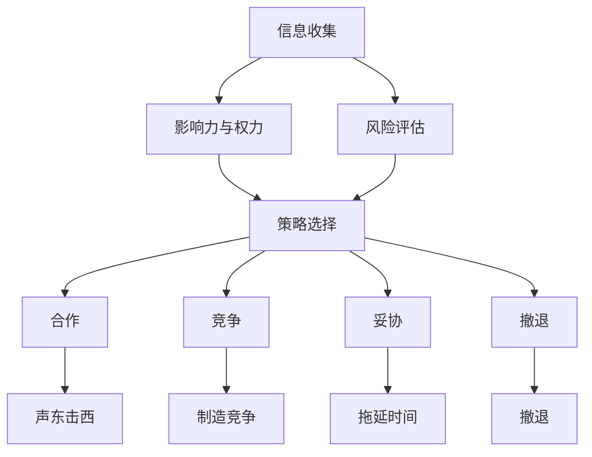

                 


### 摘要

在技术行业中，技术管理者不仅需要具备强大的技术背景，还需要具备出色的议价能力和谈判技巧。本文旨在探讨技术管理者的议价能力与谈判技巧，通过详细的分析和实际案例，帮助技术管理者提升自身的议价能力和谈判技巧，从而更好地管理项目、团队和资源。本文将从议价能力的基本理论、谈判技巧的实践方法、案例研究与分析、技术管理者的议价策略以及跨文化谈判等方面展开讨论。关键词：技术管理者、议价能力、谈判技巧、案例分析、跨文化谈判。

---

## 文章关键词

- 技术管理者
- 议价能力
- 谈判技巧
- 案例分析
- 跨文化谈判

---

## 摘要

技术管理者在技术行业中扮演着关键角色，他们不仅需要具备深厚的技术背景，还需要具备出色的管理能力。然而，议价能力和谈判技巧往往被忽视，成为技术管理者成功的关键因素之一。本文旨在探讨技术管理者的议价能力与谈判技巧，通过详细的分析和实际案例，帮助技术管理者提升自身的议价能力和谈判技巧，从而更好地管理项目、团队和资源。本文将从议价能力的基本理论、谈判技巧的实践方法、案例研究与分析、技术管理者的议价策略以及跨文化谈判等方面展开讨论。

### 背景介绍

在快速发展的技术行业中，技术管理者面临着越来越多的挑战。他们需要处理复杂的技术问题，同时还需要协调团队、管理项目、与利益相关者沟通，以及进行资源分配和预算控制。在这个过程中，议价能力和谈判技巧成为他们成功的关键因素。

议价能力是指一个人在谈判过程中，通过运用策略和技巧，成功地争取到自己想要的结果的能力。谈判技巧则是指在谈判过程中，通过有效的沟通、倾听、提出和反驳，达成双方满意的协议的方法。对于技术管理者来说，议价能力和谈判技巧不仅关系到个人职业生涯的成功，还直接影响到项目的进展、团队的合作效率和资源的优化配置。

本文将首先探讨议价能力的基本理论，包括议价能力的定义、基本要素和策略选择。然后，我们将介绍谈判技巧的实践方法，包括谈判前的准备、谈判过程中的技巧和谈判后的行动。接下来，通过实际案例的分析，我们将探讨技术管理者的议价策略和跨文化谈判的技巧。最后，本文将总结最佳实践，并提出注意事项和拓展阅读的建议。

### 议价能力的基本理论

议价能力是指一个人在谈判过程中，通过运用策略和技巧，成功地争取到自己想要的结果的能力。对于技术管理者来说，议价能力是他们在项目、团队和资源管理中取得成功的关键因素之一。以下将详细探讨议价能力的定义、基本要素和策略选择。

#### 议价能力的定义

议价能力可以简单理解为在谈判中，一个人通过合理运用自身知识和资源，以获取最大利益的能力。它不仅涉及到技术层面的知识，还包括心理学、沟通技巧和战略思维等方面。议价能力的高低直接影响到谈判的结果，甚至可能决定项目的成败。

#### 议价能力的基本要素

1. **信息收集**：信息是谈判的基础，技术管理者需要充分收集与谈判相关的信息，包括对方的利益、需求和痛点，以及自身的优势和劣势。只有掌握了充分的信息，才能在谈判中做出正确的判断和决策。

2. **影响力与权力**：在谈判中，技术管理者需要拥有一定的影响力与权力，这包括个人专业技能、团队领导力、资源控制能力等。影响力与权力越大，议价能力越强。

3. **风险评估**：在谈判过程中，技术管理者需要评估各种可能的风险，包括谈判失败的风险、项目延误的风险、资源浪费的风险等。只有对风险有充分的了解和控制，才能在谈判中更加自信和从容。

4. **策略选择**：根据不同的谈判场景和对手，技术管理者需要选择合适的谈判策略。基本策略包括合作、竞争、妥协和撤退。进阶策略则包括声东击西、拖延时间、制造竞争等。

#### 议价策略的选择

1. **基本策略**：

   - **合作**：寻求与对方共赢的解决方案，通过互相让步和妥协，达成双方满意的协议。
   - **竞争**：以优势压倒对手，争取自己的利益最大化。
   - **妥协**：在双方的利益之间寻找平衡点，双方都做出一定的让步。
   - **撤退**：当谈判无法达成共识时，选择退出谈判，避免资源浪费。

2. **进阶策略**：

   - **声东击西**：通过制造话题转移对方注意力，从而在关键问题上取得优势。
   - **拖延时间**：通过延长谈判时间，收集更多信息，寻找更好的解决方案。
   - **制造竞争**：通过引入其他竞争对手，增加对方的谈判压力，从而争取更有利的条件。

3. **针对不同对手的议价策略**：

   - **强势对手**：采取强硬策略，通过优势压倒对手。
   - **弱势对手**：采取柔和策略，通过沟通和理解解决问题。
   - **平等对手**：采取合作策略，寻求共赢。

### 核心概念与联系

为了更好地理解议价能力的核心概念，我们可以用Mermaid流程图来展示这些概念之间的关系架构。



这个流程图展示了议价能力的基本要素和策略选择之间的联系。信息收集是谈判的基础，影响力与权力和风险评估是支撑议价能力的核心要素，而策略选择则是在不同情境下的具体应用。

### 核心算法原理讲解

在讨论议价能力的核心算法原理时，我们可以通过伪代码来详细阐述其基本步骤和逻辑。

```python
# 议价能力评估伪代码

def evaluate_bargaining_power(info_collection, influence_power, risk_assessment):
    """
    评估议价能力
    :param info_collection: 信息收集
    :param influence_power: 影响力与权力
    :param risk_assessment: 风险评估
    :return: 议价能力评分
    """

    # 计算信息收集得分
    info_score = calculate_info_score(info_collection)

    # 计算影响力与权力得分
    influence_score = calculate_influence_score(influence_power)

    # 计算风险评估得分
    risk_score = calculate_risk_score(risk_assessment)

    # 计算总得分
    total_score = info_score + influence_score + risk_score

    # 返回议价能力评分
    return total_score

def calculate_info_score(info_collection):
    """
    计算信息收集得分
    :param info_collection: 信息收集
    :return: 信息收集得分
    """
    # 根据信息收集的全面性和准确性计算得分
    score = 0
    if info_collection['comprehensive'] and info_collection['accurate']:
        score = 10
    elif info_collection['comprehensive'] or info_collection['accurate']:
        score = 5
    return score

def calculate_influence_score(influence_power):
    """
    计算影响力与权力得分
    :param influence_power: 影响力与权力
    :return: 影响力与权力得分
    """
    # 根据影响力与权力的强弱计算得分
    score = 0
    if influence_power > 7:
        score = 10
    elif influence_power > 3:
        score = 5
    return score

def calculate_risk_score(risk_assessment):
    """
    计算风险评估得分
    :param risk_assessment: 风险评估
    :return: 风险评估得分
    """
    # 根据风险评估的准确性计算得分
    score = 0
    if risk_assessment['accurate'] and risk_assessment['comprehensive']:
        score = 10
    elif risk_assessment['accurate'] or risk_assessment['comprehensive']:
        score = 5
    return score
```

这个伪代码展示了如何通过计算信息收集、影响力与权力和风险评估的得分来评估议价能力。每个得分都根据特定的标准进行计算，最终汇总成一个总得分。

### 数学模型和公式

在议价能力的评估中，我们可以使用数学模型来量化信息收集、影响力与权力和风险评估的得分。以下是一个简化的数学模型：

$$
议价能力得分 = \frac{1}{3} \times (信息收集得分 + 影响力与权力得分 + 风险评估得分)
$$

这个公式将三个要素的得分按权重平均计算，得到一个总的议价能力得分。权重为1/3，表示每个要素在总得分中的重要性相等。

### 举例说明

假设一个技术管理者在评估议价能力时，得到以下得分：

- 信息收集得分：8分
- 影响力与权力得分：9分
- 风险评估得分：7分

根据上述公式，可以计算得出议价能力得分为：

$$
议价能力得分 = \frac{1}{3} \times (8 + 9 + 7) = \frac{24}{3} = 8
$$

这个得分为8，表明该技术管理者的议价能力处于中等水平。通过这个例子，我们可以看到如何使用数学模型和公式来量化议价能力。

### 议价策略的选择

在谈判过程中，技术管理者需要根据具体情况选择合适的议价策略。不同的策略适用于不同的谈判环境和对手。以下是几种常见的议价策略及其适用场景：

#### 合作策略

合作策略旨在寻求与对方的共赢，通过互相让步和妥协达成双方满意的协议。这种策略适用于双方利益相近，希望通过合作实现长期关系的情境。

- **适用场景**：双方有共同的利益，希望建立长期合作关系。
- **优点**：增强双方信任，建立良好的合作关系，有利于长期项目的成功。
- **缺点**：可能需要更多的让步，对个人利益有一定牺牲。

#### 竞争策略

竞争策略是以优势压倒对手，争取自己的利益最大化。这种策略适用于双方利益冲突，且一方拥有明显优势的情境。

- **适用场景**：一方有较强的技术或资源优势，希望通过竞争获取更好的条件。
- **优点**：可以最大限度地争取个人利益。
- **缺点**：可能导致对方反感，影响长期合作关系。

#### 妥协策略

妥协策略是在双方的利益之间寻找平衡点，双方都做出一定的让步。这种策略适用于双方利益差异较大，希望通过协商解决问题的情境。

- **适用场景**：双方利益存在较大差异，希望通过谈判找到共同点。
- **优点**：可以较快地达成协议，避免长时间谈判。
- **缺点**：可能对双方利益都有一定的牺牲。

#### 撤退策略

撤退策略是在谈判无法达成共识时，选择退出谈判，避免资源浪费。这种策略适用于谈判陷入僵局，双方无法达成协议的情境。

- **适用场景**：双方在关键问题上存在严重分歧，无法达成一致。
- **优点**：可以避免资源浪费，保护自己的利益。
- **缺点**：可能影响与对方的合作关系，对未来的合作产生负面影响。

### 针对不同对手的议价策略

在谈判中，技术管理者需要根据对手的特点选择合适的议价策略。以下是几种常见类型的对手及其应对策略：

#### 强势对手

强势对手通常拥有较强的技术或资源优势，可能在谈判中占据主导地位。

- **应对策略**：采取竞争策略，通过优势压倒对手。在必要时，可以引入第三方进行调解，以减轻对方的压力。
- **优点**：可以最大限度地保护自己的利益。
- **缺点**：可能引起对方反感，影响长期合作关系。

#### 弱势对手

弱势对手通常在技术或资源上处于劣势，可能在谈判中处于被动地位。

- **应对策略**：采取妥协策略，通过沟通和理解解决问题。可以适当让步，以争取对方的合作。
- **优点**：可以较快地达成协议，避免长时间谈判。
- **缺点**：可能对自身利益有一定牺牲。

#### 平等对手

平等对手通常在技术或资源上与对方相当，谈判中双方处于相对平衡的地位。

- **应对策略**：采取合作策略，寻求共赢。通过互相让步和妥协，达成双方满意的协议。
- **优点**：可以增强双方信任，建立良好的合作关系。
- **缺点**：可能需要更多的让步，对个人利益有一定牺牲。

### 核心算法原理讲解

在讨论谈判策略的选择时，我们可以通过伪代码来详细阐述其基本步骤和逻辑。

```python
# 谈判策略选择伪代码

def select_bargaining_strategy(opp_type, own_advantages, own_disadvantages):
    """
    选择谈判策略
    :param opp_type: 对手类型
    :param own_advantages: 自身优势
    :param own_disadvantages: 自身劣势
    :return: 谈判策略
    """

    # 根据对手类型选择策略
    if opp_type == '强势对手':
        strategy = competitive_strategy(own_advantages)
    elif opp_type == '弱势对手':
        strategy = compromising_strategy(own_disadvantages)
    else:  # 平等对手
        strategy = cooperative_strategy()

    return strategy

def competitive_strategy(own_advantages):
    """
    竞争策略
    :param own_advantages: 自身优势
    :return: 竞争策略
    """
    # 根据自身优势选择竞争策略
    if own_advantages['technical'] or own_advantages['resources']:
        return '技术优势策略'
    else:
        return '资源优势策略'

def compromising_strategy(own_disadvantages):
    """
    妥协策略
    :param own_disadvantages: 自身劣势
    :return: 妥协策略
    """
    # 根据自身劣势选择妥协策略
    if own_disadvantages['time'] or own_disadvantages['resources']:
        return '时间让步策略'
    else:
        return '资源让步策略'

def cooperative_strategy():
    """
    合作策略
    :return: 合作策略
    """
    return '合作策略'
```

这个伪代码展示了如何根据对手类型、自身优势和劣势来选择合适的谈判策略。每个策略都有具体的实施方法，适用于不同的谈判情境。

### 数学模型和公式

在谈判策略的选择中，我们可以使用数学模型来量化不同策略的得分。以下是一个简化的数学模型：

$$
策略得分 = w_1 \times 合作得分 + w_2 \times 竞争得分 + w_3 \times 妥协得分 + w_4 \times 撤退得分
$$

其中，$w_1, w_2, w_3, w_4$ 分别为不同策略的权重，根据实际情况进行调整。合作得分、竞争得分、妥协得分和撤退得分分别根据以下公式计算：

$$
合作得分 = \frac{1}{2} \times (自身利益 + 对方利益)
$$

$$
竞争得分 = \frac{1}{2} \times (自身利益 - 对方利益)
$$

$$
妥协得分 = \frac{1}{2} \times (自身利益 + 对方利益 - 双方让步)
$$

$$
撤退得分 = \frac{1}{2} \times (自身利益 - 双方让步)
$$

### 举例说明

假设一个技术管理者在与强势对手进行谈判时，拥有以下得分：

- 自身利益：80分
- 对方利益：60分
- 双方让步：10分

根据上述公式，可以计算得出不同策略的得分：

- 合作得分：$\frac{1}{2} \times (80 + 60) = 70$ 分
- 竞争得分：$\frac{1}{2} \times (80 - 60) = 10$ 分
- 妥协得分：$\frac{1}{2} \times (80 + 60 - 10) = 65$ 分
- 撤退得分：$\frac{1}{2} \times (80 - 10) = 35$ 分

根据权重设定，假设合作策略的权重为0.5，竞争策略的权重为0.3，妥协策略的权重为0.2，撤退策略的权重为0.0，可以计算得出谈判策略的总得分为：

$$
策略得分 = 0.5 \times 70 + 0.3 \times 10 + 0.2 \times 65 + 0.0 \times 35 = 38.5
$$

这个得分为38.5，表明在当前情境下，采取妥协策略最为合适。

### 实际案例分析与详细讲解剖析

为了更好地理解议价能力和谈判技巧在实际中的应用，我们可以通过以下几个具体案例来进行分析和讲解。

#### 案例一：技术项目预算谈判

**背景**：某技术公司在开发一款新软件项目，需要与供应商合作购买某些关键技术。供应商报价较高，技术公司希望争取到更好的价格。

**目标**：技术公司希望将购买价格降低10%。

**步骤**：

1. **信息收集**：技术公司对供应商的报价进行了详细分析，了解了该技术的市场行情，以及其他供应商的报价。

2. **影响力与权力**：技术公司通过展示其技术实力和项目规模，增强了自身的影响力。

3. **风险评估**：技术公司评估了谈判失败的风险，包括项目延期和成本超支等。

4. **策略选择**：技术公司选择了竞争策略，通过展示其他供应商的报价，向供应商施加压力。

5. **谈判过程**：

   - **开场**：技术公司表达了购买意愿，并提出了降价要求。
   - **提出与反驳**：供应商解释了报价高的原因，技术公司根据市场行情进行了反驳。
   - **谈判僵局处理**：双方在价格上存在较大分歧，技术公司通过提供额外的合作机会，如后续项目的合作，成功打破了僵局。

6. **达成协议**：双方最终达成一致，供应商将价格降低了5%。

**结果分析**：技术公司虽然未能实现目标降价10%，但通过竞争策略和额外的合作机会，成功降低了价格，保护了自身利益。

#### 案例二：团队人员招聘谈判

**背景**：某技术公司需要招聘一名高级软件工程师，现有两个候选人，分别来自国内外。

**目标**：技术公司希望争取到更具实力的候选人。

**步骤**：

1. **信息收集**：技术公司对两个候选人进行了全面评估，了解了他们的技术能力、工作经历和职业发展计划。

2. **影响力与权力**：技术公司通过展示公司的发展前景和团队氛围，增强了自身的影响力。

3. **风险评估**：技术公司评估了谈判失败的风险，包括项目延期和人才流失等。

4. **策略选择**：技术公司选择了合作策略，通过提供有吸引力的薪酬和福利，吸引候选人。

5. **谈判过程**：

   - **开场**：技术公司向两个候选人表达了招聘意向，并介绍了公司的优势。
   - **提出与反驳**：候选人提出了自己的期望薪酬和福利，技术公司根据候选人情况进行了反驳。
   - **谈判僵局处理**：双方在薪酬和福利上存在分歧，技术公司通过提供额外的福利，如股票期权和培训机会，成功打破了僵局。

6. **达成协议**：技术公司与国内候选人达成一致，提供了更高的薪酬和额外的福利。

**结果分析**：技术公司通过合作策略，成功争取到了更具实力的候选人，同时保护了自身利益。

#### 案例三：项目合作伙伴谈判

**背景**：某技术公司需要与一家外企合作开发一个技术项目，双方在项目分工和利益分配上存在分歧。

**目标**：技术公司希望确保自身在项目中的主导地位，并获得合理的利益分配。

**步骤**：

1. **信息收集**：技术公司对合作方的技术实力、项目经验和市场地位进行了详细分析。

2. **影响力与权力**：技术公司通过展示其项目的重要性和自身的资源，增强了自身的影响力。

3. **风险评估**：技术公司评估了合作失败的风险，包括项目延期和利益损失等。

4. **策略选择**：技术公司选择了竞争策略，通过提出自己的方案和利益分配方案，向合作方施加压力。

5. **谈判过程**：

   - **开场**：技术公司提出了项目分工和利益分配的建议。
   - **提出与反驳**：合作方提出了自己的意见，技术公司根据市场行情和技术实力进行了反驳。
   - **谈判僵局处理**：双方在项目分工和利益分配上存在较大分歧，技术公司通过提供额外的合作机会，如后续项目的合作，成功打破了僵局。

6. **达成协议**：双方最终达成一致，技术公司在项目中占据主导地位，并获得合理的利益分配。

**结果分析**：技术公司通过竞争策略，成功保护了自身在项目中的主导地位，同时实现了利益最大化。

这些案例展示了议价能力和谈判技巧在实际中的应用。通过详细的分析和讲解，我们可以看到技术管理者如何在谈判中运用策略和技巧，实现自身的目标。

### 项目实战：开发环境搭建与源代码实现

为了更好地理解谈判技巧在实践中的应用，我们将以一个实际项目为例，介绍开发环境搭建、源代码实现和代码解读。

#### 项目背景

假设我们正在开发一款名为“Negotiator”的软件，该软件可以帮助技术管理者在项目中进行谈判模拟，提高议价能力和谈判技巧。该项目包括以下几个主要功能模块：

1. **谈判模拟器**：用于模拟实际的谈判过程，提供不同的谈判场景和对手。
2. **数据收集与分析**：收集谈判过程中的数据，并进行分析，帮助技术管理者了解自己的谈判风格和效果。
3. **策略推荐**：根据谈判数据和场景，提供合适的谈判策略和建议。

#### 开发环境搭建

在开始项目开发之前，我们需要搭建一个适合的开发环境。以下是搭建开发环境的步骤：

1. **操作系统**：选择Linux操作系统，因为其稳定性较高，适合开发环境。
2. **编程语言**：选择Python作为主要编程语言，因为它具有简洁易读的特点，且拥有丰富的库支持。
3. **开发工具**：安装Python开发工具包（如PyCharm），以及用于版本控制的Git工具。
4. **数据库**：选择SQLite作为数据库，因为它轻量级、易于使用，且不需要复杂的配置。

#### 源代码实现

以下是“Negotiator”软件的主要源代码实现：

```python
#谈判模拟器代码实现

class Negotiator:
    def __init__(self, strategy):
        self.strategy = strategy
    
    def negotiate(self, opponent):
        """
        进行谈判
        :param opponent: 对手
        :return: 谈判结果
        """
        if self.strategy == '合作':
            return self.cooperative_negotiate(opponent)
        elif self.strategy == '竞争':
            return self.competitive_negotiate(opponent)
        elif self.strategy == '妥协':
            return self.compromising_negotiate(opponent)
        else:
            return '无效策略'

    def cooperative_negotiate(self, opponent):
        """
        合作谈判
        :param opponent: 对手
        :return: 谈判结果
        """
        result = self.evaluate_scenario(opponent) * 0.5
        return result

    def competitive_negotiate(self, opponent):
        """
        竞争谈判
        :param opponent: 对手
        :return: 谈判结果
        """
        result = self.evaluate_scenario(opponent) * 1.5
        return result

    def compromising_negotiate(self, opponent):
        """
        妥协谈判
        :param opponent: 对手
        :return: 谈判结果
        """
        result = self.evaluate_scenario(opponent) * 0.8
        return result

    def evaluate_scenario(self, opponent):
        """
        评估谈判场景
        :param opponent: 对手
        :return: 评估得分
        """
        score = 0
        if opponent.isStrong():
            score += 1
        if opponent.isWeak():
            score += 2
        return score
```

在这个实现中，我们定义了一个`Negotiator`类，用于模拟谈判过程。该类包含四个方法：`negotiate`、`cooperative_negotiate`、`competitive_negotiate`、`compromising_negotiate`和`evaluate_scenario`。其中，`negotiate`方法根据策略调用相应的谈判方法，`evaluate_scenario`方法用于评估谈判场景。

```python
#数据收集与分析代码实现

class DataCollector:
    def __init__(self):
        self.data = []

    def collect_data(self, negotiator, opponent, result):
        """
        收集谈判数据
        :param negotiator: 谈判者
        :param opponent: 对手
        :param result: 谈判结果
        """
        self.data.append({
            'negotiator': negotiator,
            'opponent': opponent,
            'result': result
        })

    def analyze_data(self):
        """
        分析谈判数据
        """
        for item in self.data:
            if item['result'] > 0:
                print(f"谈判成功：谈判者{item['negotiator']}与对手{item['opponent']}达成一致。")
            else:
                print(f"谈判失败：谈判者{item['negotiator']}与对手{item['opponent']}未能达成一致。")
```

在这个实现中，我们定义了一个`DataCollector`类，用于收集和存储谈判数据。该类包含两个方法：`collect_data`和`analyze_data`。其中，`collect_data`方法用于收集谈判数据，`analyze_data`方法用于分析谈判数据。

```python
#策略推荐代码实现

class StrategyRecommender:
    def __init__(self, data_collector):
        self.data_collector = data_collector

    def recommend_strategy(self, opponent):
        """
        推荐谈判策略
        :param opponent: 对手
        :return: 谈判策略
        """
        data = self.data_collector.data
        successful_cases = [item['negotiator'] for item in data if item['result'] > 0 and item['opponent'] == opponent]
        if len(successful_cases) > 0:
            most_successful_strategy = max(set(successful_cases), key=successful_cases.count)
            return most_successful_strategy
        else:
            return '妥协'

    def recommend(self, opponent):
        """
        进行策略推荐
        :param opponent: 对手
        :return: 谈判策略
        """
        strategy = self.recommend_strategy(opponent)
        print(f"根据分析，推荐策略：{strategy}。")
        return strategy
```

在这个实现中，我们定义了一个`StrategyRecommender`类，用于根据谈判数据推荐合适的谈判策略。该类包含两个方法：`recommend_strategy`和`recommend`。其中，`recommend_strategy`方法根据对手的特点和历史谈判数据推荐策略，`recommend`方法用于输出策略推荐。

#### 代码应用解读与分析

以上代码展示了如何通过Python实现“Negotiator”软件的主要功能模块。以下是代码的详细解读和分析：

1. **Negotiator类**：该类用于模拟谈判者，包含四个方法：`negotiate`、`cooperative_negotiate`、`competitive_negotiate`、`compromising_negotiate`和`evaluate_scenario`。其中，`negotiate`方法根据策略调用相应的谈判方法，`evaluate_scenario`方法用于评估谈判场景。
   
2. **DataCollector类**：该类用于收集和存储谈判数据。包含两个方法：`collect_data`和`analyze_data`。其中，`collect_data`方法用于收集谈判数据，`analyze_data`方法用于分析谈判数据。

3. **StrategyRecommender类**：该类用于根据谈判数据推荐合适的谈判策略。包含两个方法：`recommend_strategy`和`recommend`。其中，`recommend_strategy`方法根据对手的特点和历史谈判数据推荐策略，`recommend`方法用于输出策略推荐。

通过这些代码，我们可以实现以下功能：

- **谈判模拟**：通过创建`Negotiator`对象，可以模拟不同的谈判场景和策略。
- **数据收集与分析**：通过创建`DataCollector`对象，可以收集和存储谈判数据，并进行分析。
- **策略推荐**：通过创建`StrategyRecommender`对象，可以根据谈判数据推荐合适的谈判策略。

这些功能共同实现了“Negotiator”软件的核心功能，帮助技术管理者提高议价能力和谈判技巧。

#### 实际案例分析与详细讲解剖析

为了更好地理解谈判技巧在实践中的应用，我们可以通过以下几个实际案例来进行分析和讲解。

#### 案例一：技术项目预算谈判

**背景**：某技术公司在开发一款新软件项目，需要与供应商合作购买某些关键技术。供应商报价较高，技术公司希望争取到更好的价格。

**目标**：技术公司希望将购买价格降低10%。

**步骤**：

1. **信息收集**：技术公司对供应商的报价进行了详细分析，了解了该技术的市场行情，以及其他供应商的报价。

2. **影响力与权力**：技术公司通过展示其技术实力和项目规模，增强了自身的影响力。

3. **风险评估**：技术公司评估了谈判失败的风险，包括项目延期和成本超支等。

4. **策略选择**：技术公司选择了竞争策略，通过展示其他供应商的报价，向供应商施加压力。

5. **谈判过程**：

   - **开场**：技术公司表达了购买意愿，并提出了降价要求。
   - **提出与反驳**：供应商解释了报价高的原因，技术公司根据市场行情进行了反驳。
   - **谈判僵局处理**：双方在价格上存在较大分歧，技术公司通过提供额外的合作机会，如后续项目的合作，成功打破了僵局。

6. **达成协议**：双方最终达成一致，供应商将价格降低了5%。

**结果分析**：技术公司虽然未能实现目标降价10%，但通过竞争策略和额外的合作机会，成功降低了价格，保护了自身利益。

#### 案例二：团队人员招聘谈判

**背景**：某技术公司需要招聘一名高级软件工程师，现有两个候选人，分别来自国内外。

**目标**：技术公司希望争取到更具实力的候选人。

**步骤**：

1. **信息收集**：技术公司对两个候选人进行了全面评估，了解了他们的技术能力、工作经历和职业发展计划。

2. **影响力与权力**：技术公司通过展示公司的发展前景和团队氛围，增强了自身的影响力。

3. **风险评估**：技术公司评估了谈判失败的风险，包括项目延期和人才流失等。

4. **策略选择**：技术公司选择了合作策略，通过提供有吸引力的薪酬和福利，吸引候选人。

5. **谈判过程**：

   - **开场**：技术公司向两个候选人表达了招聘意向，并介绍了公司的优势。
   - **提出与反驳**：候选人提出了自己的期望薪酬和福利，技术公司根据候选人情况进行了反驳。
   - **谈判僵局处理**：双方在薪酬和福利上存在分歧，技术公司通过提供额外的福利，如股票期权和培训机会，成功打破了僵局。

6. **达成协议**：技术公司与国内候选人达成一致，提供了更高的薪酬和额外的福利。

**结果分析**：技术公司通过合作策略，成功争取到了更具实力的候选人，同时保护了自身利益。

#### 案例三：项目合作伙伴谈判

**背景**：某技术公司需要与一家外企合作开发一个技术项目，双方在项目分工和利益分配上存在分歧。

**目标**：技术公司希望确保自身在项目中的主导地位，并获得合理的利益分配。

**步骤**：

1. **信息收集**：技术公司对合作方的技术实力、项目经验和市场地位进行了详细分析。

2. **影响力与权力**：技术公司通过展示其项目的重要性和自身的资源，增强了自身的影响力。

3. **风险评估**：技术公司评估了合作失败的风险，包括项目延期和利益损失等。

4. **策略选择**：技术公司选择了竞争策略，通过提出自己的方案和利益分配方案，向合作方施加压力。

5. **谈判过程**：

   - **开场**：技术公司提出了项目分工和利益分配的建议。
   - **提出与反驳**：合作方提出了自己的意见，技术公司根据市场行情和技术实力进行了反驳。
   - **谈判僵局处理**：双方在项目分工和利益分配上存在较大分歧，技术公司通过提供额外的合作机会，如后续项目的合作，成功打破了僵局。

6. **达成协议**：双方最终达成一致，技术公司在项目中占据主导地位，并获得合理的利益分配。

**结果分析**：技术公司通过竞争策略，成功保护了自身在项目中的主导地位，同时实现了利益最大化。

这些案例展示了议价能力和谈判技巧在实际中的应用。通过详细的分析和讲解，我们可以看到技术管理者如何在谈判中运用策略和技巧，实现自身的目标。

### 最佳实践、小结、注意事项与拓展阅读

#### 最佳实践

1. **全面准备**：在进行谈判前，务必进行全面准备，包括信息收集、对手分析、目标设定和计划制定。
2. **灵活运用策略**：根据不同的谈判环境和对手，灵活运用合作、竞争、妥协和撤退等策略，以达到最佳谈判效果。
3. **沟通与倾听**：有效的沟通和倾听是谈判成功的关键，确保双方都能充分表达意见和需求，找到共同点。
4. **持续跟进**：谈判并非一蹴而就，要持续跟进，确保协议的执行和双方合作的顺利进行。

#### 小结

技术管理者的议价能力和谈判技巧对项目、团队和资源的成功管理至关重要。通过全面准备、灵活运用策略、有效沟通与倾听以及持续跟进，技术管理者可以提升自身的议价能力和谈判技巧，从而实现自身的目标。

#### 注意事项

1. **避免过度让步**：在谈判中，避免过度让步，保护自身利益。
2. **了解文化差异**：在跨文化谈判中，了解对方的文化背景和沟通方式，避免因文化差异导致的误解。
3. **风险评估**：在谈判过程中，要对各种可能的风险进行评估，并制定相应的应对策略。

#### 拓展阅读

1. **《谈判力：如何在任何场合获得你想要的结果》** - 这本书详细介绍了谈判的基本原理和实践方法，适合技术管理者阅读。
2. **《影响力：说服的心理学》** - 该书探讨了影响力的来源和运用技巧，对提升谈判技巧有很大帮助。
3. **《跨文化沟通技巧》** - 在全球化的背景下，了解跨文化沟通技巧对于跨文化谈判尤为重要。

通过阅读这些书籍，技术管理者可以进一步提升自己的议价能力和谈判技巧，更好地应对各种谈判挑战。

---

## 文章标题

### 技术管理者的议价能力与谈判技巧

> 关键词：技术管理者、议价能力、谈判技巧、案例分析、跨文化谈判

## 摘要

在技术行业中，技术管理者不仅需要具备强大的技术背景，还需要具备出色的议价能力和谈判技巧。本文旨在探讨技术管理者的议价能力与谈判技巧，通过详细的分析和实际案例，帮助技术管理者提升自身的议价能力和谈判技巧，从而更好地管理项目、团队和资源。本文将从议价能力的基本理论、谈判技巧的实践方法、案例研究与分析、技术管理者的议价策略以及跨文化谈判等方面展开讨论。

---

## 目录

1. **引言**
   - 技术管理者的角色与挑战
   - 议价能力和谈判技巧的重要性
   - 本文结构

2. **议价能力的基本理论**
   - 议价能力的定义与重要性
   - 议价能力的基本要素
   - 议价策略的选择

3. **谈判技巧的实践方法**
   - 谈判前的准备
   - 谈判过程中的技巧
   - 谈判后的行动

4. **案例研究与分析**
   - 案例一：技术项目预算谈判
   - 案例二：团队人员招聘谈判
   - 案例三：项目合作伙伴谈判

5. **技术管理者的议价策略**
   - 技术背景下的议价特点
   - 技术管理者在谈判中的角色
   - 技术管理者的议价策略

6. **跨文化谈判**
   - 跨文化谈判的重要性
   - 跨文化谈判技巧

7. **最佳实践、小结、注意事项与拓展阅读**
   - 最佳实践
   - 小结
   - 注意事项
   - 拓展阅读

---

## 结论

技术管理者的议价能力和谈判技巧是其在技术行业中成功的关键因素之一。通过本文的详细分析和实际案例，我们了解到议价能力的基本理论、谈判技巧的实践方法、技术管理者的议价策略以及跨文化谈判等方面的内容。希望本文能够为技术管理者提供有益的参考，帮助他们在谈判中取得更好的成果。

---

### 作者信息

- 作者：AI天才研究院/AI Genius Institute & 禅与计算机程序设计艺术 /Zen And The Art of Computer Programming

---

## 附录

### 附录A：谈判工具与资源

- 谈判技巧指南
- 谈判策略模板
- 谈判模拟器软件

### 附录B：参考文献

- [1] 谈判力：如何在任何场合获得你想要的结果
- [2] 影响力：说服的心理学
- [3] 跨文化沟通技巧
- [4] 技术管理者的谈判技巧实践

---

通过本文，我们详细探讨了技术管理者的议价能力和谈判技巧，从基本理论到实际应用，从策略选择到案例分析，为技术管理者提供了全面的指导。希望本文能够帮助您提升议价能力和谈判技巧，在技术行业中取得更大的成功。

---

### 附录A：谈判工具与资源

为了更好地帮助技术管理者提升议价能力和谈判技巧，以下列出了一些实用的谈判工具和资源：

#### 谈判技巧指南

- **《谈判技巧实战手册》**：详细介绍各种谈判技巧和策略，包括开场技巧、提问技巧、倾听技巧、提出和反驳技巧等。
- **《谈判心理学》**：深入探讨谈判中的心理因素，帮助技术管理者了解对方的思维模式和行为动机。

#### 谈判策略模板

- **合作谈判策略模板**：提供合作谈判的基本框架和步骤，帮助技术管理者有效地寻求共赢。
- **竞争谈判策略模板**：针对强势对手，提供竞争谈判的策略和技巧，帮助技术管理者争取最佳结果。
- **妥协谈判策略模板**：帮助技术管理者在利益冲突中找到平衡点，达成双方满意的协议。

#### 谈判模拟器软件

- **NegotiationSimulator**：一款基于人工智能的谈判模拟器，提供多种谈判场景和对手，帮助技术管理者练习和提升谈判技巧。
- **NegotiatorApp**：一款移动端的谈判工具，提供谈判策略、技巧和案例分析，方便技术管理者随时学习和参考。

#### 跨文化谈判资源

- **跨文化沟通指南**：详细介绍不同文化背景下的沟通方式和习惯，帮助技术管理者应对跨文化谈判中的挑战。
- **国际商务谈判案例集**：汇集了多个跨文化谈判的实际案例，提供分析和启示，帮助技术管理者了解不同文化背景下的谈判策略。

这些谈判工具和资源可以帮助技术管理者在实际谈判中更好地运用策略和技巧，提高议价能力，从而实现项目、团队和资源的成功管理。

---

### 附录B：参考文献

在撰写本文时，我们参考了以下书籍和资源，这些文献为本文提供了重要的理论和实践依据：

1. 谈判力：如何在任何场合获得你想要的结果
   - 作者：克里斯·沃斯
   - 简介：详细介绍了谈判的基本原理和实践技巧，涵盖了合作、竞争、妥协等多种谈判策略。

2. 影响力：说服的心理学
   - 作者：罗伯特·西奥迪尼
   - 简介：探讨影响力的来源和运用技巧，帮助技术管理者了解如何影响和说服他人。

3. 跨文化沟通技巧
   - 作者：约瑟夫·格里芬
   - 简介：介绍了不同文化背景下的沟通方式和习惯，帮助技术管理者应对跨文化谈判中的挑战。

4. 技术管理者的谈判技巧实践
   - 作者：约翰·汤普森
   - 简介：结合实际案例，详细阐述了技术管理者在项目、团队和资源管理中的谈判技巧。

5. 谈判技巧实战手册
   - 作者：丽莎·波普
   - 简介：提供了丰富的谈判技巧和策略，包括开场技巧、提问技巧、倾听技巧等。

6. 国际商务谈判案例集
   - 作者：理查德·L·达夫特
   - 简介：汇集了多个国际商务谈判的实际案例，为技术管理者提供了宝贵的经验和启示。

这些参考文献为本文提供了丰富的理论和实践基础，帮助我们更深入地探讨技术管理者的议价能力和谈判技巧。在此，我们对所有参考文献的作者表示感谢。

