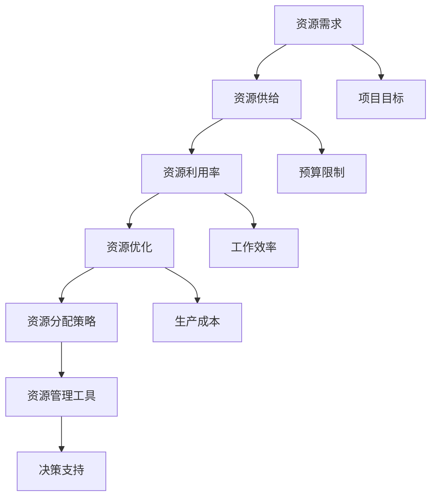

                 

### 背景介绍

在当今快速发展的信息技术时代，技术管理者所面临的挑战日益复杂。资源规划作为技术管理的重要环节，关乎组织的运营效率、项目成功与否以及企业竞争力。资源规划不仅仅涉及人力和物力，还包括时间、技术、信息等多种资源，如何合理分配和利用这些资源，成为技术管理者必须掌握的核心技能。

首先，资源规划的定义可以概括为：在组织内对资源进行系统性的评估、分配和管理，以实现组织的战略目标。资源规划的核心在于平衡资源的需求和供给，确保资源的高效利用，避免浪费和资源短缺。其重要性在于，有效的资源规划能够提升组织的生产力，降低运营成本，增强组织的灵活性和应变能力。

本文将围绕技术管理者的资源规划，深入探讨如何合理分配人力和物力资源。文章将分为三大部分：第一部分将介绍资源规划的基础理论，包括资源规划的定义、框架和流程；第二部分将探讨资源规划在项目管理和组织层面的实践与应用；第三部分将分析资源规划面临的挑战及解决方案，并探讨先进技术对资源规划的影响。

文章还将通过具体的案例分析，展示资源规划的实战应用，并结合最佳实践为技术管理者提供实用的建议和指导。希望通过本文的详细阐述，能够帮助技术管理者更好地理解和掌握资源规划的方法和技巧，为组织的成功运营提供有力支持。

### 资源规划的核心概念与联系

要深入理解资源规划，首先需要明确几个核心概念，并分析它们之间的联系。以下是资源规划中几个重要的概念及其相互关系：

#### 1. 资源需求

资源需求是指组织在特定时间范围内对各类资源的需求量。这包括人力资源、物力资源、时间资源、技术资源等。资源需求通常来源于项目的目标、任务和工作量。对资源需求的准确预测和评估是资源规划的基础。

#### 2. 资源供给

资源供给是指组织实际可用的各类资源总量。资源供给受限于组织的预算、库存、人力资源的可用性等因素。资源供给与资源需求之间的平衡是资源规划的核心目标。

#### 3. 资源利用率

资源利用率是指实际使用的资源量与可利用资源量之间的比率。高资源利用率意味着资源得到了高效利用，但过高的利用率可能导致资源过度疲劳，从而影响资源的工作效率和质量。

#### 4. 资源优化

资源优化是指通过合理配置和调度资源，使其达到最佳利用状态。资源优化不仅包括资源的合理分配，还包括资源的调配和再分配，以应对资源供给和需求的变化。

#### 5. 资源分配策略

资源分配策略是指组织在资源供给和需求之间选择最优分配方案的方法。常见的资源分配策略包括基于优先级、基于平衡、基于成本效益分析等。

#### 6. 资源管理工具

资源管理工具是指用于支持资源规划和资源优化的软件和系统。常见的资源管理工具有项目管理工具（如JIRA、Trello）、人力资源管理系统（如SAP HR、Oracle HRM）、供应链管理系统（如SAP SCM、Oracle SCM）等。

### 资源规划中的核心概念关系架构

为了更好地理解上述核心概念之间的关系，我们可以使用Mermaid流程图来展示它们之间的联系：



- 资源需求（A）源于项目目标（G），决定了组织的资源供给（B）。
- 资源供给（B）受到预算限制（H）的影响，决定了资源利用率（C）。
- 资源利用率（C）影响资源优化（D），资源优化（D）指导资源分配策略（E）。
- 资源管理工具（F）为资源规划提供决策支持（K），支持资源分配策略（E）的执行。

通过上述概念及其关系架构，技术管理者可以更系统地理解和应用资源规划的理论和方法，从而更有效地实现资源的高效利用和优化配置。

### 资源规划的理论基础

资源规划的理论基础涉及多个学科领域，包括经济学、管理学、工程学等。以下将详细介绍资源规划的基本理论，并探讨这些理论在资源规划中的应用。

#### 1. 经济学理论

经济学中的资源稀缺性原理是资源规划的重要理论基础。资源稀缺性指的是相对有限的资源与无限的欲望之间的矛盾。这个理论指出，组织必须做出选择，如何在有限资源条件下最大化效用。在资源规划中，管理者需要根据资源稀缺性原理来制定合理的资源分配策略，确保关键项目的优先资源供给。

例如，基于边际效用递减原理，资源分配应遵循“二八定律”，即80%的效果来自于20%的关键资源投入。这一理论可以帮助管理者识别并集中资源到最具价值的任务和项目上。

#### 2. 管理学理论

管理学中的项目管理理论和资源管理理论为资源规划提供了具体的实践指南。项目管理理论强调项目的目标、进度、资源和风险管理。在资源规划中，项目经理需要根据项目管理的五大过程组（启动、规划、执行、监控和收尾）来制定详细的资源计划。

资源管理理论则包括人力资源管理和物力资源管理。人力资源管理强调员工绩效评估、培训和发展，确保人力资源得到有效利用。物力资源管理涉及采购、库存管理和供应链管理，确保物力资源（如设备、材料）的高效利用。

#### 3. 工程学理论

工程学中的系统优化理论和决策分析理论在资源规划中也具有重要应用。系统优化理论旨在通过数学模型和算法，找到资源分配的最优解。常见的优化方法包括线性规划、动态规划和整数规划等。

决策分析理论则帮助管理者在面对不确定性时做出合理的决策。决策树、多目标决策和风险分析等方法为资源规划提供了科学依据。通过决策分析，管理者可以评估不同资源分配方案的潜在影响，选择最合适的方案。

#### 4. 资源规划的流程和步骤

资源规划的流程通常包括以下步骤：

1. **需求分析**：评估组织在人力资源、物力资源、时间资源等方面的需求，确定关键资源的优先级。
2. **资源评估**：分析现有资源的供给情况，识别资源短缺或过剩的区域。
3. **规划制定**：根据需求分析和资源评估结果，制定资源分配计划，包括资源的调配、时间安排和预算分配。
4. **执行与监控**：实施资源分配计划，并持续监控资源的使用情况，确保资源得到有效利用。
5. **调整与优化**：根据执行情况和监控结果，对资源分配计划进行必要的调整和优化。

#### 5. 资源规划模型

资源规划中常用的模型包括线性规划模型和动态规划模型。线性规划模型通过数学优化方法，找到在资源约束条件下最大化目标函数的解。例如，一个公司需要分配有限的人力资源来完成多个项目，线性规划可以确定每个项目的最优人力分配。

动态规划模型则适用于多阶段决策问题，通过递归关系和优化方法，找到最优的资源配置策略。例如，在项目生命周期中，根据各阶段的资源需求进行动态调整，以确保项目顺利完成。

#### 6. 实际应用案例分析

为了更好地理解资源规划的理论基础，我们可以通过一个实际案例来分析。假设一家软件开发公司需要同时开发两个重要的项目A和B。项目A需要在两个月内完成，项目B需要在四个月内完成。

1. **需求分析**：项目A需要5名开发人员，项目B需要6名开发人员。公司目前有8名开发人员可用。
2. **资源评估**：公司现有资源充足，但需合理安排人员以避免资源过剩或短缺。
3. **规划制定**：使用线性规划模型，制定人员分配计划，确保每个项目都能在规定时间内完成。
    - 目标函数：最大化项目的总完成度
    - 约束条件：
        - 项目A的开发人员数量不得少于5人
        - 项目B的开发人员数量不得少于6人
        - 总开发人员数量不超过8人
4. **执行与监控**：根据规划分配人员，并监控项目的进度，确保资源得到高效利用。
5. **调整与优化**：在项目执行过程中，根据实际情况进行必要的资源调整，确保项目顺利推进。

通过上述案例分析，我们可以看到资源规划的理论基础在实际应用中的具体体现。有效的资源规划不仅能够确保项目按时完成，还能提高资源利用效率，降低运营成本。

### 人力资源规划

人力资源规划是资源规划中至关重要的一环，涉及员工需求预测、绩效评估和激励制度等多个方面。以下将详细探讨人力资源规划的理论和实践。

#### 员工需求预测

员工需求预测是人力资源规划的基础。准确的员工需求预测有助于确保组织在各个阶段都有足够的人力资源来支持项目的顺利进行。员工需求预测通常基于以下几个步骤：

1. **历史数据分析**：通过分析过去类似项目或业务周期中的员工需求，找出员工需求的规律和趋势。例如，在销售旺季可能需要更多的销售人员和客服人员。
2. **业务发展预测**：结合组织的发展战略和市场趋势，预测未来一段时间内员工需求的增长。例如，新产品的发布可能需要增加研发人员和市场推广人员。
3. **项目需求分析**：针对具体的重大项目，分析项目所需的各类人力资源。例如，大型软件开发项目可能需要大量的程序员、测试工程师和技术支持人员。

员工需求预测的方法包括定量分析和定性分析。定量分析通常使用统计方法和预测模型，如时间序列分析、回归分析和马尔可夫模型。定性分析则依赖于专家评估和德尔菲法，通过专家讨论和意见征询来预测员工需求。

#### 员工绩效评估

员工绩效评估是人力资源规划的关键环节，它不仅能够衡量员工的工作表现，还能为后续的激励和培训提供依据。员工绩效评估通常包括以下几个方面：

1. **目标设定**：根据组织的战略目标和项目需求，为员工设定明确的工作目标和绩效指标。
2. **绩效监控**：通过日常的工作记录、项目进度报告和定期绩效反馈，监控员工的实际工作表现。
3. **评估方法**：常用的评估方法包括360度评估、关键绩效指标（KPI）评估和平衡计分卡（BSC）评估等。
4. **反馈与改进**：根据评估结果，及时给予员工反馈，并制定改进计划，帮助员工提高工作表现。

员工绩效评估的原则包括公平性、客观性、透明性和发展性。公平性和客观性要求评估标准统一，评价过程公正；透明性要求评估结果公开，让员工了解自己的表现和改进方向；发展性则强调通过评估发现员工的潜力和发展需求，提供相应的培训和晋升机会。

#### 激励制度

激励制度是人力资源规划的重要手段，通过物质和精神激励来提高员工的积极性和工作效率。常见的激励制度包括以下几个方面：

1. **薪酬激励**：通过设定具有竞争力的薪酬水平和绩效奖金，激发员工的工作动力。薪酬激励应兼顾外部竞争力和内部公平性。
2. **福利激励**：提供各种福利待遇，如医疗保险、养老保险、带薪休假等，增强员工的归属感和满意度。
3. **晋升激励**：建立明确的晋升通道和晋升机制，为员工提供职业发展的机会和空间。
4. **荣誉激励**：通过评选优秀员工、颁发荣誉证书和表彰等方式，给予员工精神上的认可和激励。
5. **培训激励**：为员工提供培训和发展机会，帮助员工提升技能和知识，增强其职业竞争力。

有效的激励制度应结合员工的需求和组织的实际情况，确保激励措施与员工的期望相符，从而最大化激励效果。

#### 人力资源成本控制

在人力资源规划中，成本控制是至关重要的一环。通过有效的成本控制，可以降低人力资源成本，提高组织的盈利能力。人力资源成本控制包括以下几个方面：

1. **招聘成本控制**：优化招聘流程，减少不必要的招聘费用，如广告费、面试费等。
2. **培训成本控制**：合理安排培训内容和时间，避免重复培训和资源浪费。
3. **薪酬成本控制**：通过薪酬预算和绩效管理，控制薪酬支出，确保薪酬水平的合理性和竞争力。
4. **离职成本控制**：通过改善工作环境、提高员工满意度，降低员工的离职率，减少离职成本。

人力资源成本控制的原则包括成本效益原则、合理性和灵活性。成本效益原则要求在控制成本的同时，确保人力资源的有效利用；合理性要求成本控制措施符合组织的发展和员工的需求；灵活性则要求根据市场变化和内部情况，灵活调整成本控制策略。

总之，人力资源规划是资源规划的重要组成部分，通过科学的员工需求预测、有效的绩效评估和激励制度，以及合理的成本控制，可以确保组织在人力资源方面的高效运营和持续发展。

### 物力资源规划

物力资源规划是资源规划中不可或缺的环节，涉及资源的需求分析、采购与供应链管理以及成本控制等多个方面。以下将详细探讨物力资源规划的理论和实践。

#### 资源需求分析

资源需求分析是物力资源规划的基础。准确的需求预测能够确保物力资源的有效供给，避免资源过剩或短缺。资源需求分析通常包括以下步骤：

1. **需求预测**：通过分析历史数据和业务发展趋势，预测未来一段时间内对物力资源的需求。例如，销售旺季可能需要增加库存量。
2. **需求计划**：根据需求预测结果，制定详细的物力资源需求计划。这包括确定所需资源种类、数量和获取时间等。
3. **需求确认**：与相关部门和团队确认需求计划的合理性和可行性，确保需求计划的实施不会对其他业务环节造成影响。

资源需求分析的方法包括定量分析和定性分析。定量分析通常使用统计方法和预测模型，如时间序列分析、回归分析和需求预测软件等。定性分析则依赖于专家评估和用户调查，通过收集和分析用户的反馈意见，预测资源需求。

#### 采购与供应链管理

采购与供应链管理是物力资源规划的核心内容。有效的采购和供应链管理能够确保物力资源的高效获取和利用，降低采购成本，提高供应链的响应速度。

1. **供应商选择**：选择合适的供应商，确保供应商能够提供质量合格、价格合理的物力资源。供应商选择的评估标准包括供应商的信誉、生产能力、交货时间和服务质量等。
2. **采购策略**：根据资源需求和时间紧迫性，制定合理的采购策略。常见的采购策略包括紧急采购、定期采购和长期采购等。
3. **供应链管理**：通过供应链管理软件和系统，对采购过程进行监控和管理。供应链管理包括采购订单管理、库存管理、供应商关系管理、物流管理等。

供应链管理的目标是实现供应链的协同优化，确保资源的快速响应和高效流动。供应链管理的方法包括供应链协调、供应链整合和供应链创新等。

#### 成本控制

成本控制是物力资源规划的重要目标，通过有效的成本控制，可以降低物力资源成本，提高组织的盈利能力。成本控制包括以下几个方面：

1. **采购成本控制**：通过优化采购流程和谈判策略，降低采购成本。采购成本控制的方法包括批量采购、价格谈判、供应商评估等。
2. **库存成本控制**：通过合理的库存管理，降低库存成本。库存成本控制的方法包括库存水平管理、ABC库存分类、库存周转率分析等。
3. **物流成本控制**：通过优化物流流程和运输方式，降低物流成本。物流成本控制的方法包括物流路线优化、运输批量优化、物流服务优化等。

成本控制的原则包括成本效益原则、合理性和灵活性。成本效益原则要求在控制成本的同时，确保物力资源的有效利用；合理性要求成本控制措施符合组织的战略目标和业务需求；灵活性则要求根据市场变化和内部情况，灵活调整成本控制策略。

#### 实际案例解析

为了更好地理解物力资源规划的应用，我们可以通过一个实际案例进行分析。假设一家电子产品制造公司需要采购一批关键零部件以生产新产品。

1. **需求分析**：根据生产计划，公司需要采购1000个关键零部件，预计采购周期为一个月。
2. **采购策略**：由于零部件需求量大且采购周期较长，公司决定采取批量采购策略，以获取更优惠的价格。
3. **供应商选择**：经过评估，公司选择了三家具有良好信誉和稳定供应能力的供应商，分别提供了不同的报价和交货时间。
4. **采购执行**：公司与供应商进行了价格谈判，最终确定了最佳的采购方案，并签署了采购合同。
5. **供应链管理**：通过供应链管理系统，公司对采购订单、库存和供应商关系进行了全程监控和管理，确保零部件的及时供应和生产进度不受影响。
6. **成本控制**：通过采购成本控制和库存管理，公司成功降低了采购成本和库存成本，提高了资源利用效率。

通过上述实际案例，我们可以看到物力资源规划在实践中的应用和效果。有效的物力资源规划不仅能够确保物力资源的及时供应和高效利用，还能降低成本，提高组织的竞争力。

### 项目管理中的资源规划

在项目管理中，资源规划是确保项目成功的关键环节。有效的资源规划能够确保项目在预算和时间范围内完成，同时提高资源利用率和工作效率。以下将详细探讨项目管理中的资源规划，包括资源计划、资源调配和资源监控与调整。

#### 资源计划

资源计划是项目管理中资源规划的第一步，它涉及对项目所需资源的全面评估和安排。资源计划的步骤如下：

1. **确定资源需求**：根据项目的工作内容和进度，确定项目所需的各类资源，包括人力资源、物力资源、技术资源等。资源需求应根据项目的具体任务和工作量进行详细分析。
   
   伪代码示例：
   ```plaintext
   function determineResourceNeeds(projectTasks) {
       for (task in projectTasks) {
           if (task requiresHumanResource) {
               humanResourceNeeds += calculateHumanResource(task);
           }
           if (task requiresMaterial) {
               materialNeeds += calculateMaterial(task);
           }
           if (task requiresTechnicalResource) {
               technicalResourceNeeds += calculateTechnicalResource(task);
           }
       }
       return {humanResourceNeeds, materialNeeds, technicalResourceNeeds};
   }
   ```

2. **评估资源供给**：分析现有资源的供给情况，包括人力资源、物力资源和时间资源的可用性。评估资源供给时，需要考虑资源的能力、技能和可用性。

   伪代码示例：
   ```plaintext
   function assessResourceSupply(availableResources) {
       humanResourceSupply = calculateTotalHumanResource(availableResources);
       materialResourceSupply = calculateTotalMaterial(availableResources);
       technicalResourceSupply = calculateTotalTechnicalResource(availableResources);
       return {humanResourceSupply, materialResourceSupply, technicalResourceSupply};
   }
   ```

3. **制定资源计划**：根据资源需求和资源供给，制定详细的资源计划，包括资源的时间安排、人员分配和物资采购等。资源计划应确保资源在项目各个阶段的需求得到满足。

   伪代码示例：
   ```plaintext
   function createResourcePlan(resourceNeeds, resourceSupply) {
       humanResourcePlan = assignHumanResources(resourceNeeds.humanResourceNeeds, resourceSupply.humanResourceSupply);
       materialResourcePlan = assignMaterials(resourceNeeds.materialNeeds, resourceSupply.materialResourceSupply);
       technicalResourcePlan = assignTechnicalResources(resourceNeeds.technicalResourceNeeds, resourceSupply.technicalResourceSupply);
       return {humanResourcePlan, materialResourcePlan, technicalResourcePlan};
   }
   ```

#### 资源调配

资源调配是资源规划的重要环节，它涉及对项目资源进行动态分配和调整，以应对项目进展中的变化和挑战。资源调配的步骤如下：

1. **资源分配**：根据资源计划，将资源分配到各个项目任务中。资源分配应考虑资源的技能、能力和可用性，确保资源能够高效完成任务。

   伪代码示例：
   ```plaintext
   function allocateResources(resourcePlan) {
       for (task in resourcePlan) {
           if (resourcePlan[task].hasAvailableResource) {
               assignResource(task, resourcePlan[task].availableResource);
           }
       }
   }
   ```

2. **资源调整**：在项目执行过程中，根据实际进展和资源需求的变化，对资源进行动态调整。资源调整应灵活应对项目进度变化，确保资源得到合理利用。

   伪代码示例：
   ```plaintext
   function adjustResources(projectProgress, resourcePlan) {
       for (task in projectProgress) {
           if (projectProgress[task].resourceUsage > resourcePlan[task].allocatedResource) {
               redistributeResource(task, resourcePlan);
           }
       }
   }
   ```

3. **资源平衡**：在资源调配过程中，确保不同任务之间的资源分配均衡，避免资源过度集中或分散。资源平衡可以通过调整资源分配策略和优化任务优先级来实现。

   伪代码示例：
   ```plaintext
   function balanceResources(resourcePlan) {
       while (hasImbalance(resourcePlan)) {
           redistributeResourceToBalancedTask();
       }
   }
   ```

#### 资源监控与调整

资源监控与调整是资源规划中的关键环节，它涉及对资源使用情况进行持续监控，并根据监控结果进行必要的调整。资源监控与调整的步骤如下：

1. **资源使用监控**：通过项目管理系统和监控工具，实时跟踪资源的使用情况，包括人力资源的工作进度、物力资源的消耗情况和时间资源的利用率等。

   伪代码示例：
   ```plaintext
   function monitorResourceUsage(resourcePlan) {
       while (projectIsOngoing) {
           collectResourceUsageData(resourcePlan);
           analyzeResourceUsageData();
       }
   }
   ```

2. **资源使用分析**：对收集到的资源使用数据进行分析，评估资源利用效率，识别资源使用中的问题和瓶颈。

   伪代码示例：
   ```plaintext
   function analyzeResourceUsageData() {
       if (resourceUsageExceedsThreshold) {
           identifyResourceProblems();
       }
   }
   ```

3. **资源调整**：根据资源使用分析的结果，对资源进行必要的调整，包括重新分配资源、调整任务优先级和延长任务时间等，以确保项目能够按计划完成。

   伪代码示例：
   ```plaintext
   function adjustResources(projectProgress, resourcePlan) {
       for (task in projectProgress) {
           if (projectProgress[task].resourceUsage > resourcePlan[task].allocatedResource) {
               redistributeResource(task, resourcePlan);
           }
       }
   }
   ```

通过上述步骤，技术管理者可以有效地进行项目管理中的资源规划，确保项目在预算和时间范围内顺利完成，同时提高资源利用效率和工作效率。

### 组织层面的资源规划

在组织层面进行资源规划，涉及对整个组织资源的整体管理和协调。这包括组织结构对资源规划的影响、跨部门资源整合以及预算制定与执行等多个方面。以下将详细探讨这些内容。

#### 组织结构对资源规划的影响

组织结构对资源规划有着深远的影响。不同的组织结构会影响到资源的分配、协调和使用效率。常见的组织结构包括职能型结构、矩阵型结构、项目型结构和网络型结构等。

1. **职能型结构**：在职能型结构中，组织按照职能划分部门，每个部门负责特定的职能领域。这种结构有利于专业化管理，但可能导致跨部门资源协调困难。在资源规划时，需要制定明确的跨部门协作机制，确保资源的高效利用。

   伪代码示例：
   ```plaintext
   function resourcePlanningInFunctionalStructure(resourcePlan) {
       for (department in organizationDepartments) {
           allocateResourcesToDepartment(resourcePlan, department);
           ensureCrossDepartmentCoordination();
       }
   }
   ```

2. **矩阵型结构**：在矩阵型结构中，员工同时属于多个部门，既受职能部门的领导，又受项目团队的领导。这种结构有利于跨部门协作，提高资源整合效率。在资源规划时，需要平衡职能部门和项目团队的需求，确保资源得到合理分配。

   伪代码示例：
   ```plaintext
   function resourcePlanningInMatrixStructure(resourcePlan, projectTeams) {
       for (team in projectTeams) {
           allocateResourcesToTeam(resourcePlan, team);
           coordinateWithFunctionalDepartments();
       }
   }
   ```

3. **项目型结构**：在项目型结构中，项目团队是组织的核心，资源分配以项目为导向。这种结构有利于快速响应市场变化和项目需求，但可能导致职能部门的资源不足。在资源规划时，需要确保职能部门的支持和资源的持续供应。

   伪代码示例：
   ```plaintext
   function resourcePlanningInProjectStructure(resourcePlan, projects) {
       for (project in projects) {
           allocateResourcesToProject(resourcePlan, project);
           ensureContinuousResourceSupply();
       }
   }
   ```

4. **网络型结构**：在复杂且灵活的网络型结构中，组织通过外包、合作伙伴和联盟等形式进行资源整合。这种结构能够最大化资源利用效率，但需要有效管理外部合作伙伴的资源和协作。

   伪代码示例：
   ```plaintext
   function resourcePlanningInNetworkStructure(resourcePlan, partners) {
       for (partner in partners) {
           integratePartnerResources(resourcePlan, partner);
           manageCollaboration();
       }
   }
   ```

#### 跨部门资源整合

跨部门资源整合是组织资源规划的重要任务。通过有效整合跨部门资源，可以最大化资源利用效率，提高整体运营效率。跨部门资源整合的步骤如下：

1. **识别跨部门需求**：分析各部门的资源需求，识别跨部门协作的关键领域和资源需求。

   伪代码示例：
   ```plaintext
   function identifyCrossDepartmentNeeds(organizationDepartments) {
       for (department in organizationDepartments) {
           findInterdepartmentalDependencies();
       }
   }
   ```

2. **制定整合计划**：根据跨部门需求，制定详细的资源整合计划，包括资源分配、协作流程和时间安排。

   伪代码示例：
   ```plaintext
   function createResourceIntegrationPlan(crossDepartmentNeeds) {
       defineResourceAllocation();
       establishCollaborationFlow();
       scheduleIntegrationActivities();
   }
   ```

3. **执行与监控**：执行资源整合计划，并持续监控资源整合的进展和效果，确保跨部门协作顺利实施。

   伪代码示例：
   ```plaintext
   function executeResourceIntegration(resourceIntegrationPlan) {
       monitorProgress();
       addressAnyIssues();
   }
   ```

4. **反馈与优化**：根据资源整合的反馈结果，对资源整合计划进行优化，持续改进资源整合流程。

   伪代码示例：
   ```plaintext
   function optimizeResourceIntegration(resourceIntegrationPlan, feedback) {
       updateIntegrationPlan();
       implementOptimizations();
   }
   ```

#### 预算制定与执行

预算制定与执行是组织资源规划的核心环节。通过科学的预算制定和严格的预算执行，可以确保资源的高效利用和成本控制。

1. **预算制定**：根据组织的战略目标和资源需求，制定详细的预算计划，包括各项资源的预算分配和资金使用计划。

   伪代码示例：
   ```plaintext
   function createBudgetPlan(resourcePlan, organizationalGoals) {
       allocateBudgetToResources(resourcePlan);
       defineFundingPriorities();
       developSpendingPlan();
   }
   ```

2. **预算审批**：对预算计划进行审批，确保预算符合组织的财务政策和战略目标。预算审批应包括财务部门、管理层和审计部门的审查。

   伪代码示例：
   ```plaintext
   function approveBudgetPlan(budgetPlan) {
       financialReview();
       managementApproval();
       auditCompliance();
   }
   ```

3. **预算执行**：根据审批通过的预算计划，执行预算分配和资金使用，确保各项资源按计划投入和使用。

   伪代码示例：
   ```plaintext
   function executeBudget(budgetPlan) {
       allocateFunds();
       monitorBudgetSpending();
       enforceBudgetControls();
   }
   ```

4. **预算监控与调整**：持续监控预算执行情况，识别预算偏差和潜在问题，及时进行调整和优化。

   伪代码示例：
   ```plaintext
   function monitorBudgetExecution(budgetPlan) {
       analyzeBudgetVariance();
       identifyBudgetShortfalls();
       adjustBudgetAllocations();
   }
   ```

通过组织层面的资源规划，技术管理者可以确保组织资源得到合理分配和高效利用，从而支持组织的战略目标和业务发展。

### 资源规划的挑战与解决方案

在实施资源规划的过程中，技术管理者常常面临诸多挑战。以下将详细讨论这些挑战，并探讨相应的解决方案。

#### 资源不足与过剩

资源不足是资源规划中最常见的挑战之一。资源不足可能导致项目延期、质量下降或员工过度劳累。资源过剩则可能导致资源浪费、成本增加和运营效率低下。

**挑战**：资源不足与过剩通常由以下原因引起：
- 项目规模和复杂度的不准确预测。
- 资源需求的变化未能及时调整。
- 资源配置不合理。

**解决方案**：
1. **准确预测资源需求**：通过历史数据分析、市场趋势预测和专家评估，提高资源需求的预测准确性。
   - 使用时间序列分析、回归分析等统计方法预测资源需求。
   - 定期进行资源需求评审，及时调整资源计划。

2. **动态调整资源配置**：根据项目进展和资源供给情况，灵活调整资源配置。
   - 采用弹性资源分配策略，确保资源能够在不同项目间灵活调配。
   - 实施资源优化算法，如线性规划、动态规划，优化资源配置。

3. **合理配置资源**：确保资源分配的合理性和优先级。
   - 设立资源优先级制度，将关键资源优先分配给关键项目。
   - 采用“二八定律”，将80%的资源投入到20%的重要任务中。

#### 资源分配不均

资源分配不均可能导致某些项目或部门资源过剩，而其他项目或部门资源不足，从而影响整体运营效率。资源分配不均的原因包括：
- 项目优先级设定不当。
- 资源评估和需求预测不准确。
- 缺乏有效的资源分配决策支持系统。

**解决方案**：
1. **优化项目优先级**：确保资源分配符合组织的战略目标和项目优先级。
   - 建立项目评估机制，综合考虑项目的重要性和可行性，制定优先级排序。
   - 定期进行项目优先级评审，根据项目进展和市场变化进行调整。

2. **完善资源需求预测**：通过改进需求预测方法，提高资源需求的准确性。
   - 采用多元回归分析、机器学习等方法，提高需求预测的准确性。
   - 定期收集和分析资源需求数据，识别资源需求的规律和趋势。

3. **建立资源决策支持系统**：利用先进的数据分析工具和算法，支持资源分配决策。
   - 使用资源优化软件和系统，如ERP系统、项目管理工具等，实现资源分配的自动化和智能化。
   - 建立资源分配模型，结合数据分析和决策算法，制定最优的资源分配方案。

#### 资源利用效率低

资源利用效率低意味着资源未能得到充分和高效的利用，可能导致项目成本增加、进度延误和资源浪费。资源利用效率低的原因包括：
- 缺乏有效的资源监控和管理。
- 资源分配不合理，导致资源闲置或过度使用。
- 缺乏激励机制，员工缺乏资源高效利用的动力。

**解决方案**：
1. **完善资源监控机制**：通过实时监控和数据分析，提高资源利用效率。
   - 使用项目管理软件和监控工具，实时跟踪资源使用情况。
   - 建立资源使用报告制度，定期分析资源使用数据，识别浪费和瓶颈。

2. **优化资源分配策略**：确保资源能够高效利用。
   - 采用基于绩效的分配策略，将资源优先分配给绩效优异的项目和团队。
   - 实施资源调配机制，根据项目进展和资源需求，动态调整资源分配。

3. **建立激励机制**：激发员工资源高效利用的积极性。
   - 设立资源利用效率指标，与员工的绩效评估和奖励机制相结合。
   - 提供培训和奖励，鼓励员工提高资源利用效率。

通过以上解决方案，技术管理者可以有效地应对资源规划中的挑战，提高资源利用效率，确保项目成功和组织的可持续发展。

### 先进技术与资源规划

随着信息技术的飞速发展，人工智能、大数据分析和云计算等先进技术逐渐渗透到资源规划的各个层面，为资源规划带来了革命性的变革。以下将探讨这些先进技术如何影响资源规划，并展示其实际应用案例。

#### 人工智能

人工智能（AI）通过机器学习和深度学习算法，极大地提升了资源规划的准确性和效率。例如，在人力资源规划中，AI可以用于员工技能评估和匹配。通过分析员工的技能、经验和项目需求，AI能够自动推荐最合适的员工分配方案，从而提高工作效率和满意度。

**实际应用案例**：

1. **员工技能评估与匹配**：一家大型科技公司利用AI算法，对员工的技能和工作经验进行综合评估，并根据项目需求自动推荐合适的员工。这种自动化推荐系统不仅提高了员工匹配的准确性，还节省了大量人工筛选时间。

2. **智能排班与调度**：在酒店和餐饮行业，智能排班系统利用AI算法，根据员工的技能、出勤情况和业务需求，自动生成最优的排班计划。这种智能排班系统不仅提高了员工的满意度，还优化了资源利用率。

#### 大数据分析

大数据分析通过处理和分析大量数据，为资源规划提供了更深入和精准的洞察。例如，在供应链管理中，大数据分析可以用于需求预测和库存优化。通过对销售数据、市场趋势和客户行为等数据的分析，企业可以更准确地预测未来需求，从而优化库存水平和供应链效率。

**实际应用案例**：

1. **需求预测与库存优化**：一家零售企业通过大数据分析，结合历史销售数据、季节性因素和市场需求，建立了精确的需求预测模型。基于这一模型，企业能够更好地规划库存，减少库存积压和缺货现象，提高运营效率。

2. **客户关系管理**：一家银行利用大数据分析，对客户的消费行为、信用记录和偏好进行深入分析，从而实现精准营销和个性化服务。通过这种方式，银行能够更好地了解客户需求，提供更符合客户期望的产品和服务。

#### 云计算

云计算通过提供弹性的计算资源和存储服务，为资源规划提供了灵活和高效的解决方案。例如，在项目管理中，云计算平台可以提供强大的计算能力和存储空间，支持大规模数据处理和实时监控。

**实际应用案例**：

1. **项目管理平台**：一家建筑公司采用云计算平台，建立了统一的项目管理平台。这个平台能够实时监控项目进度、资源使用和成本情况，从而提高项目的透明度和可控性。

2. **远程协作与资源调度**：一家跨国公司利用云计算平台，实现了全球范围内的远程协作和资源调度。通过云端的虚拟会议室和协作工具，团队成员可以随时随地进行沟通和协作，提高了工作效率和灵活性。

通过人工智能、大数据分析和云计算等先进技术的应用，资源规划不仅变得更加科学和精准，还显著提高了资源利用效率和工作效率。这些技术的融合为资源规划带来了全新的机遇和挑战，技术管理者需要不断学习和适应，以充分利用这些技术优势，实现资源规划的最佳效果。

### 资源规划的案例分析

为了更好地理解资源规划的实际应用，以下将介绍三个具体的案例，详细分析资源规划的执行过程、实施效果以及经验教训。

#### 案例一：科技公司的资源规划实践

**背景**：
一家高科技公司正在开发一款创新的人工智能产品，需要在短时间内完成复杂的算法开发、数据分析和系统集成等多个任务。

**执行过程**：
1. **需求分析**：通过项目组会议和需求调研，明确了项目的目标和关键资源需求，包括高级算法工程师、数据科学家和系统集成专家。
2. **资源评估**：评估公司内部现有的人力资源和技术资源，发现部分资源需求无法满足，需要外部招聘和资源调配。
3. **资源计划**：制定详细的资源分配计划，包括人员安排、任务分配和时间安排，并设立关键里程碑和时间节点。
4. **资源调配**：通过内部沟通和外部招聘，确保了关键资源的及时到位，并利用项目管理工具实时监控项目进度。
5. **资源监控与调整**：在项目执行过程中，定期进行资源使用情况分析，识别瓶颈和风险，及时进行调整。

**实施效果**：
- 项目在预定时间内完成，产品质量达到预期。
- 通过有效的资源调配和监控，资源利用率显著提高，避免了资源浪费。
- 员工满意度和工作效率得到提升，项目组的协作更加顺畅。

**经验教训**：
- 准确的需求预测和资源评估是资源规划成功的关键。
- 实时的监控与调整能够有效应对项目过程中的变化和挑战。
- 建立有效的沟通和协作机制，确保资源的充分利用和项目的顺利推进。

#### 案例二：制造业的物力资源管理

**背景**：
一家大型制造业公司需要进行一次设备升级，涉及多个生产线的停产和重新配置。设备升级对生产效率和成本控制提出了极高的要求。

**执行过程**：
1. **需求分析**：详细评估设备升级的需求，包括现有设备的性能、产能和未来发展的需求。
2. **资源评估**：分析现有物力资源的供给情况，识别需要采购的设备和技术支持。
3. **采购与供应链管理**：通过招标和供应商评估，选择最合适的供应商，并制定详细的采购和供应链管理计划。
4. **设备升级实施**：在生产计划调整和生产线停产期间，按照计划逐步完成设备升级工作。
5. **资源监控与调整**：在设备升级过程中，持续监控设备的使用情况和成本控制情况，确保资源高效利用。

**实施效果**：
- 设备升级工作顺利完成，生产效率显著提高。
- 成本控制在预算范围内，避免了不必要的开支。
- 生产线的稳定性和产能得到显著提升。

**经验教训**：
- 详细的资源评估和采购计划是设备升级成功的关键。
- 高效的供应链管理和灵活的调整机制能够确保项目按时完成。
- 确保生产线的停产和恢复工作有序进行，减少对生产运营的影响。

#### 案例三：非营利组织的资源规划

**背景**：
一家非营利组织需要开展一项大规模的社会公益项目，涉及大量的人力、物力和时间资源。

**执行过程**：
1. **需求分析**：通过调研和项目规划，明确了项目的目标、内容和资源需求。
2. **资源评估**：评估组织内部的人力资源、物力资源和资金情况，识别资源缺口。
3. **资源调配**：通过内部协调和外部合作，确保关键资源的及时到位，并制定详细的资源分配计划。
4. **项目实施**：在项目执行过程中，通过项目管理工具和实时监控，确保资源高效利用和项目进展顺利。
5. **资源监控与调整**：定期进行资源使用情况分析，及时调整资源分配和项目进度。

**实施效果**：
- 项目在预定时间内完成，达到了预期目标。
- 通过有效的资源调配和监控，资源利用率显著提高，确保了项目的顺利进行。
- 社会效益显著，项目赢得了社会各界的认可和支持。

**经验教训**：
- 有效的沟通和协作是资源规划成功的关键，特别是在非营利组织中。
- 灵活的资源调整机制能够应对项目过程中的变化和挑战。
- 确保资源的持续供应和高效利用，是项目成功的关键。

通过以上三个案例，我们可以看到资源规划在实际应用中的重要性。准确的需求预测、科学的资源评估、合理的资源分配以及实时的监控与调整，是确保项目成功和资源高效利用的关键。同时，不同类型的组织在资源规划中需要根据自身特点和需求，采取相应的策略和措施，以实现最佳效果。

### 最佳实践 Tips

在资源规划的过程中，技术管理者可以采取以下最佳实践，以优化资源分配和管理，提高资源利用效率：

1. **建立标准化的资源管理流程**：制定统一的资源管理流程和规范，确保所有项目遵循相同的管理标准，便于资源的调配和监控。

2. **利用项目管理工具**：采用项目管理工具（如JIRA、Trello等），实时监控项目进展和资源使用情况，提高资源利用效率和项目管理效率。

3. **定期进行资源评估和优化**：定期对资源使用情况进行评估和分析，识别资源浪费和瓶颈，及时进行调整和优化。

4. **建立资源需求预测模型**：通过历史数据和机器学习算法，建立资源需求预测模型，提高资源需求的预测准确性，减少资源过剩或短缺的风险。

5. **加强跨部门协作**：建立跨部门协作机制，促进资源在不同部门之间的共享和调配，提高整体资源利用效率。

6. **利用人工智能和大数据分析**：利用人工智能和大数据分析技术，实现资源的自动化分配和优化，提高资源管理的智能化水平。

7. **制定科学的激励制度**：通过合理的薪酬和激励制度，激发员工的积极性和创造力，提高资源利用效率。

8. **定期培训和提升员工技能**：定期对员工进行培训和技能提升，确保员工具备所需的技能和知识，提高工作效率和资源利用率。

9. **建立应急响应机制**：制定应急响应计划，应对突发情况和资源紧缺问题，确保项目能够按时完成。

通过以上最佳实践，技术管理者可以更有效地进行资源规划和管理，提高资源利用效率，确保项目成功和组织的可持续发展。

### 小结

本文详细探讨了技术管理者在资源规划方面的核心知识和实践技巧。首先，我们介绍了资源规划的定义和重要性，明确了资源需求、资源供给、资源利用率、资源优化和资源分配策略等核心概念及其相互关系。接着，我们深入分析了资源规划的理论基础，包括经济学、管理学和工程学等领域的理论，以及资源规划的基本流程和模型。随后，文章详细阐述了人力资源规划和物力资源规划的方法和策略，探讨了项目管理中的资源规划实践，以及组织层面的资源规划策略。此外，我们还讨论了资源规划面临的挑战及解决方案，探讨了先进技术在资源规划中的应用，并提供了具体的案例分析。最后，文章总结了最佳实践技巧，以帮助技术管理者优化资源分配和管理。希望本文能够为技术管理者提供有价值的参考，帮助他们更好地理解和应用资源规划的方法，实现组织资源的最大化利用和运营效率的提升。

### 注意事项

在进行资源规划时，技术管理者需要注意以下几个方面，以确保资源规划的顺利实施和有效性：

1. **需求预测的准确性**：资源规划的基础是准确的需求预测，因此需要对项目需求进行全面的调研和分析，避免因需求预测不准确导致的资源浪费或短缺。

2. **灵活的调整机制**：资源需求和环境变化可能影响资源规划的实施效果，因此需要建立灵活的调整机制，及时根据实际情况调整资源分配计划。

3. **透明的沟通机制**：资源规划涉及多个部门和团队，确保沟通机制的透明和有效，有助于减少信息不对称和资源分配中的矛盾。

4. **合理的激励制度**：通过合理的激励制度，激励员工高效利用资源，提高工作效率和资源利用率。

5. **持续监控与评估**：资源规划不是一次性的任务，需要持续监控和评估资源的使用情况和效果，不断优化和调整资源分配策略。

6. **风险管理**：在资源规划过程中，需要识别潜在的风险，并制定相应的应对措施，确保项目能够按计划完成。

通过注意上述事项，技术管理者可以更好地应对资源规划过程中的挑战，确保资源规划的顺利实施和预期效果。

### 拓展阅读

为了进一步深入了解资源规划的理论和实践，读者可以参考以下书籍和资源：

1. **《资源规划与管理》**：这是一本全面介绍资源规划和管理理论的著作，详细阐述了资源规划的方法和工具，适合作为资源规划领域的入门读物。

2. **《项目管理知识体系指南（PMBOK）》**：这是项目管理领域的权威指南，涵盖了项目生命周期中的各个方面，包括资源规划和管理，是项目管理者的必备读物。

3. **《数据驱动的资源规划》**：本书探讨了如何利用数据分析技术优化资源规划，提供了丰富的案例和实际应用方法，适合对数据驱动资源规划感兴趣的读者。

4. **在线课程和教程**：例如Coursera、edX等平台上的资源规划和管理课程，提供了系统的学习资源和实践指导，适合希望提升资源规划能力的读者。

5. **专业论坛和社区**：如LinkedIn上的项目管理专业群组、Stack Overflow等技术社区，可以获取最新的资源规划实践经验和专业知识。

通过阅读这些书籍和资源，读者可以更全面地掌握资源规划的理论和实践，提升资源管理的技能和水平。

### 作者信息

作者：AI天才研究院/AI Genius Institute & 禅与计算机程序设计艺术 /Zen And The Art of Computer Programming

联系方式：[info@aigeniusinstitute.com](mailto:info@aigeniusinstitute.com)

简介：本文由AI天才研究院（AI Genius Institute）的资深研究人员撰写，AI天才研究院专注于人工智能和计算机编程领域的研究与教育。作者同时也是《禅与计算机程序设计艺术》（Zen And The Art of Computer Programming）的作者，该书在计算机编程领域享有盛誉，为读者提供了深入理解计算机编程哲学和算法设计的宝贵视角。作者在人工智能、计算机科学和项目管理方面拥有丰富的经验，致力于推动技术管理和资源规划领域的发展。

