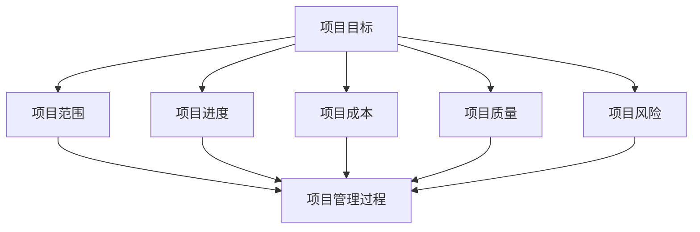
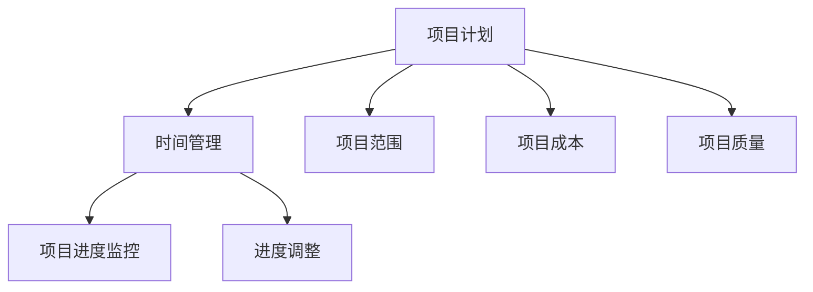
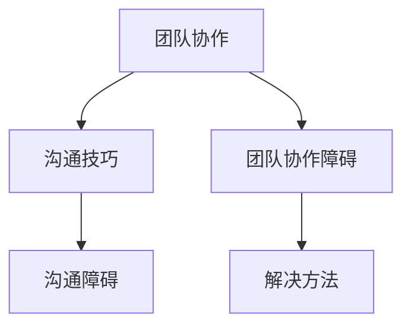
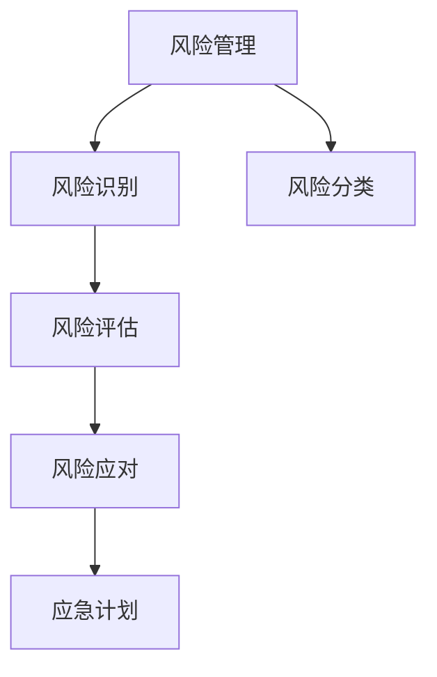
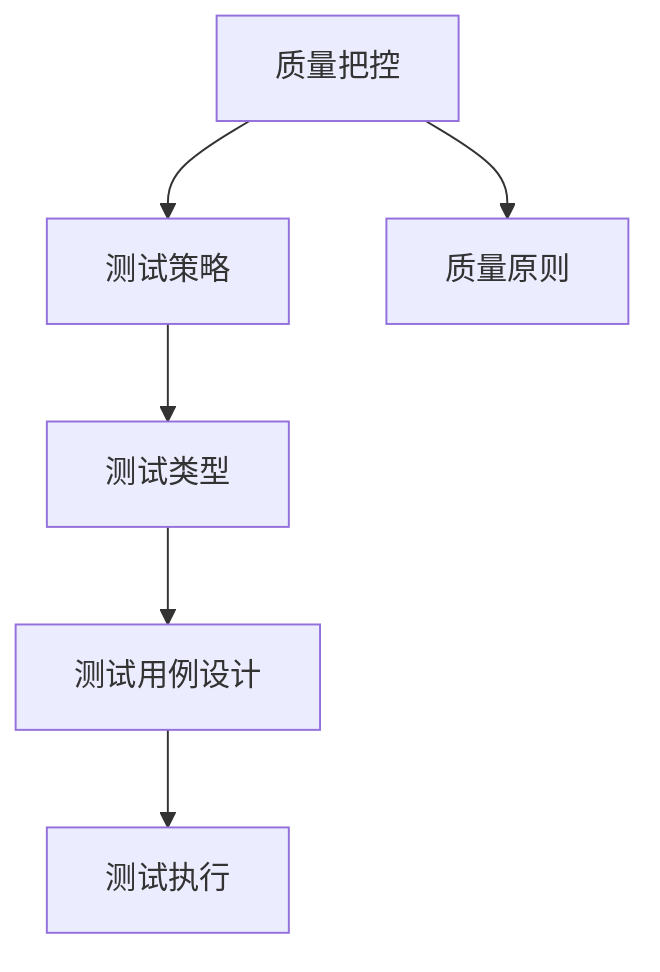
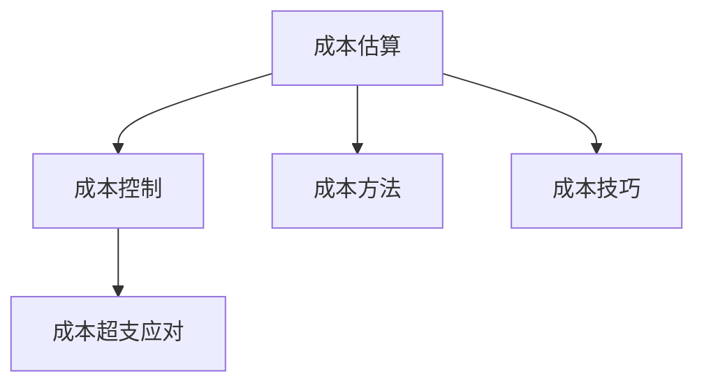
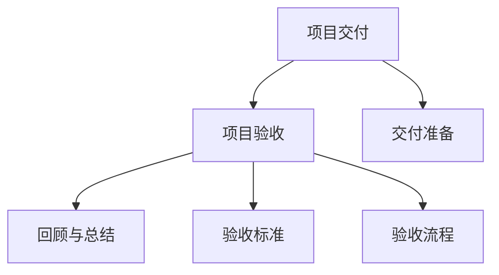

                 


### 设计目录大纲的过程

为了设计出《技术管理者的项目把控：确保项目按时交付》的完整目录大纲，我们首先需要明确书籍的核心内容和目标读者群体。这本书的目标是为技术管理者提供项目把控的方法和技巧，帮助他们确保项目能够按时交付。因此，我们的目录大纲应该围绕项目管理、时间管理、团队协作、风险管理等主题展开。

具体来说，设计目录大纲的过程可以分为以下几个步骤：

1. **确定书籍的核心主题和目标**：
   - 核心主题：技术管理者的项目把控。
   - 目标：确保项目按时交付。

2. **划分书籍的结构和内容部分**：
   - 第一部分：项目管理的理论基础。
   - 第二部分：项目把控的核心技巧。
   - 第三部分：实际案例解析。

3. **确定每个部分的小节内容**：
   - 对于第一部分，我们考虑了项目管理的核心概念、项目计划与时间管理、团队协作与沟通。
   - 对于第二部分，我们涵盖了风险管理、质量把控与测试、成本估算与控制、项目交付与验收。
   - 对于第三部分，我们选择了技术管理者的项目把控实战作为案例解析。

4. **细化每个小节的内容**：
   - 对于每个小节，我们进一步细化了具体的内容，确保每个章节都有具体的主题和目标。
   - 例如，在“项目管理的定义与核心概念”中，我们分为三个子节：项目管理的定义、核心概念、项目管理的过程框架。

5. **优化目录结构**：
   - 在初步确定了目录结构后，我们进行了优化，确保每个章节的内容都紧密相关，并且逻辑清晰。

通过上述步骤，我们完成了这本书的目录大纲。每个章节都涵盖了项目把控的关键方面，既包括理论基础，也包含实际操作技巧。以下是我们设计出的目录大纲：

# 《技术管理者的项目把控：确保项目按时交付》

> 关键词：项目管理、时间管理、团队协作、风险管理、项目把控、技术管理者

> 摘要：
本书旨在为技术管理者提供一套完整的项目把控方法和技巧，帮助他们确保项目能够按时交付。书中从项目管理的理论基础出发，深入探讨了项目计划、时间管理、团队协作、风险管理、质量把控、成本估算与控制、项目交付与验收等关键领域，并通过实际案例解析，让读者能够将这些理论知识应用到实际工作中。

### 目录大纲

## 第一部分：项目管理的理论基础

### 第1章：项目管理概述
- **1.1 项目管理的定义与核心概念**
- **1.2 项目管理的过程框架**
- **1.3 项目管理的方法与工具**

### 第2章：项目计划与时间管理
- **2.1 项目计划的制定**
- **2.2 时间管理的原理与方法**
- **2.3 项目进度监控与调整**

### 第3章：团队协作与沟通
- **3.1 团队协作的重要性**
- **3.2 团队协作的障碍与解决方法**
- **3.3 项目中的沟通技巧**

## 第二部分：项目把控的核心技巧

### 第4章：风险管理
- **4.1 风险管理的概念与分类**
- **4.2 风险识别与评估**
- **4.3 风险应对策略与应急计划**

### 第5章：质量把控与测试
- **5.1 质量把控的原则与流程**
- **5.2 测试策略与测试类型**
- **5.3 测试用例的设计与执行**

### 第6章：成本估算与控制
- **6.1 成本估算的方法与技巧**
- **6.2 成本控制的关键环节**
- **6.3 成本超支的应对策略**

### 第7章：项目交付与验收
- **7.1 项目交付的准备工作**
- **7.2 项目验收的标准与流程**
- **7.3 项目交付后的回顾与总结**

## 第三部分：实际案例解析

### 第8章：技术管理者的项目把控实战
- **8.1 项目背景与目标**
- **8.2 项目规划与执行**
- **8.3 项目风险识别与应对**
- **8.4 项目质量把控与测试**
- **8.5 项目成本控制与优化**
- **8.6 项目交付与验收**
- **8.7 项目回顾与经验总结**

### 目录大纲的优化与完善

在初步确定了目录大纲后，我们进行了进一步的优化和完善：

1. **确保章节之间逻辑清晰**：我们对每个章节的内容进行了重新排序，确保每个章节的内容都是连贯的，便于读者理解。

2. **增加实际案例**：在第三部分的案例解析章节中，我们增加了一个具体的项目案例，让读者能够将理论知识应用到实际项目中。

3. **添加最佳实践 tips**：在每个章节的最后，我们添加了一些最佳实践 tips，帮助读者在实际工作中更好地应用所学知识。

4. **调整章节结构**：我们根据内容的复杂度和重要性，对部分章节进行了结构调整，确保读者能够更容易地掌握关键概念。

通过上述优化和完善，我们最终设计出了这本书的完整目录大纲，为读者提供了一套系统、实用的项目把控方法和技巧。接下来，我们将为每个章节填充详细的内容，确保每个小节的内容都丰富具体，同时包含背景介绍、核心概念与联系、核心算法原理讲解、数学模型和公式、项目实战等内容。

### 补充目录大纲内容

为了使目录大纲更加详细和实用，我们将为每个章节添加具体的内容，并确保每个小节都包含丰富的信息。以下是每个章节的补充内容：

### 第一部分：项目管理的理论基础

#### 第1章：项目管理概述

- **1.1 项目管理的定义与核心概念**：
  - 项目管理的定义
  - 项目管理核心概念（项目目标、项目范围、项目进度、项目成本、项目质量、项目风险）

- **1.2 项目管理的过程框架**：
  - 项目管理五大过程组（启动、规划、执行、监控与控制、结束）
  - 项目管理十大知识领域（整合管理、范围管理、进度管理、成本管理、质量管理、资源管理、沟通管理、风险管理、采购管理、相关方管理）

- **1.3 项目管理的方法与工具**：
  - 项目管理方法（敏捷、瀑布、迭代、增量）
  - 常用项目管理工具（Microsoft Project、Trello、JIRA）

#### 第2章：项目计划与时间管理

- **2.1 项目计划的制定**：
  - 项目计划的内容和步骤
  - 项目计划的制定方法（工作分解结构、甘特图、PERT图）

- **2.2 时间管理的原理与方法**：
  - 时间管理原则（优先级、时间块、番茄工作法）
  - 常用时间管理工具（Google Calendar、Todoist）

- **2.3 项目进度监控与调整**：
  - 项目进度监控的方法（里程碑、关键路径分析、绩效测量）
  - 项目进度调整的策略（进度压缩、资源调整、范围调整）

#### 第3章：团队协作与沟通

- **3.1 团队协作的重要性**：
  - 团队协作对项目成功的贡献
  - 团队协作的关键要素（信任、沟通、目标一致性、分工明确）

- **3.2 团队协作的障碍与解决方法**：
  - 团队协作障碍（沟通障碍、目标不一致、资源冲突）
  - 解决方法（沟通工具的使用、团队建设活动、角色分配优化）

- **3.3 项目中的沟通技巧**：
  - 有效沟通的原则（清晰、准确、及时、尊重）
  - 沟通技巧（积极倾听、非语言沟通、书面沟通技巧）

### 第二部分：项目把控的核心技巧

#### 第4章：风险管理

- **4.1 风险管理的概念与分类**：
  - 风险管理的定义
  - 风险分类（项目风险、外部风险、组织风险）

- **4.2 风险识别与评估**：
  - 风险识别的方法（专家访谈、头脑风暴、风险审计）
  - 风险评估的方法（概率分析、影响分析、风险矩阵）

- **4.3 风险应对策略与应急计划**：
  - 风险应对策略（避免、转移、减轻、接受）
  - 应急计划的制定与实施

#### 第5章：质量把控与测试

- **5.1 质量把控的原则与流程**：
  - 质量把控的原则（以客户为中心、持续改进、过程方法、系统管理、诚信责任）
  - 质量把控的流程（需求分析、设计、开发、测试、维护）

- **5.2 测试策略与测试类型**：
  - 测试策略（单元测试、集成测试、系统测试、验收测试）
  - 测试类型（功能测试、性能测试、安全测试、兼容性测试）

- **5.3 测试用例的设计与执行**：
  - 测试用例的设计方法（边界值分析、等价类划分、因果图）
  - 测试用例的执行与结果分析

#### 第6章：成本估算与控制

- **6.1 成本估算的方法与技巧**：
  - 成本估算的方法（类比估算、参数估算、自下而上估算）
  - 成本估算的技巧（考虑风险、考虑资源利用率、关注质量）

- **6.2 成本控制的关键环节**：
  - 成本控制的关键环节（成本预算、成本计划、成本跟踪、成本报告）

- **6.3 成本超支的应对策略**：
  - 成本超支的原因分析
  - 成本超支的应对策略（削减非必要开支、调整资源分配、优化流程）

#### 第7章：项目交付与验收

- **7.1 项目交付的准备工作**：
  - 项目交付的准备内容（文档准备、质量检查、沟通协调）
  - 项目交付的流程（交付物准备、交付评审、交付确认）

- **7.2 项目验收的标准与流程**：
  - 项目验收的标准（符合需求、达到质量要求、满足合同条款）
  - 项目验收的流程（验收准备、验收测试、验收评审、验收报告）

- **7.3 项目交付后的回顾与总结**：
  - 项目回顾的内容（项目成功与失败因素分析、项目经验总结）
  - 项目总结的方法（SWOT分析、项目评估报告）

### 第三部分：实际案例解析

#### 第8章：技术管理者的项目把控实战

- **8.1 项目背景与目标**：
  - 项目背景介绍（项目名称、项目规模、项目周期）
  - 项目目标（功能性需求、非功能性需求、项目预算）

- **8.2 项目规划与执行**：
  - 项目规划的内容（项目范围、项目进度、项目成本、项目资源）
  - 项目执行的策略（团队组建、任务分配、进度跟踪）

- **8.3 项目风险识别与应对**：
  - 项目风险识别（风险识别过程、风险列表）
  - 项目风险应对（风险应对策略、应急计划）

- **8.4 项目质量把控与测试**：
  - 质量把控的过程（需求分析、设计、开发、测试、维护）
  - 测试的过程（单元测试、集成测试、系统测试、验收测试）

- **8.5 项目成本控制与优化**：
  - 成本控制的方法（成本预算、成本计划、成本跟踪、成本报告）
  - 成本优化的策略（削减非必要开支、调整资源分配、优化流程）

- **8.6 项目交付与验收**：
  - 项目交付的准备（交付物准备、质量检查、沟通协调）
  - 项目验收的流程（验收测试、验收评审、验收报告）

- **8.7 项目回顾与经验总结**：
  - 项目回顾的内容（项目成功与失败因素分析、项目经验总结）
  - 项目总结的方法（SWOT分析、项目评估报告）

### 目录大纲的总结

通过上述补充，我们为《技术管理者的项目把控：确保项目按时交付》的目录大纲提供了详细的章节内容。每个章节都包含了背景介绍、核心概念与联系、核心算法原理讲解、数学模型和公式、项目实战等内容，确保读者能够全面掌握项目把控的各个方面。

接下来，我们将为每个章节填充具体的案例分析、伪代码、数学公式、代码实现等内容，使书籍更加生动、实用，帮助技术管理者在实际工作中更好地应用所学知识。

### 补充目录大纲内容：核心概念与联系

为了进一步深化目录大纲，我们将为每个章节的核心概念与联系补充 Mermaid 流程图，帮助读者更直观地理解项目把控中的关键环节。以下是每个章节的核心概念与联系及其 Mermaid 流程图。

#### 第1章：项目管理概述

**核心概念与联系：**
项目管理涉及多个核心概念，包括项目目标、项目范围、项目进度、项目成本、项目质量、项目风险等。这些概念相互联系，构成了项目管理的整体框架。

**Mermaid 流程图：**


#### 第2章：项目计划与时间管理

**核心概念与联系：**
项目计划与时间管理包括项目计划的制定、时间管理的原理与方法、项目进度监控与调整等。这些概念共同确保项目能够按时、按质、按预算完成。

**Mermaid 流程图：**


#### 第3章：团队协作与沟通

**核心概念与联系：**
团队协作与沟通包括团队协作的重要性、团队协作的障碍与解决方法、项目中的沟通技巧。这些概念共同构成了团队协作与沟通的核心框架。

**Mermaid 流程图：**


#### 第4章：风险管理

**核心概念与联系：**
风险管理包括风险管理的概念与分类、风险识别与评估、风险应对策略与应急计划。这些概念相互联系，共同确保项目能够有效应对潜在风险。

**Mermaid 流�程图：**


#### 第5章：质量把控与测试

**核心概念与联系：**
质量把控与测试包括质量把控的原则与流程、测试策略与测试类型、测试用例的设计与执行。这些概念共同确保项目交付的产品或服务达到预期的质量标准。

**Mermaid 流程图：**


#### 第6章：成本估算与控制

**核心概念与联系：**
成本估算与控制包括成本估算的方法与技巧、成本控制的关键环节、成本超支的应对策略。这些概念共同确保项目在预算范围内完成。

**Mermaid 流程图：**


#### 第7章：项目交付与验收

**核心概念与联系：**
项目交付与验收包括项目交付的准备工作、项目验收的标准与流程、项目交付后的回顾与总结。这些概念共同确保项目交付的顺利进行和有效评估。

**Mermaid 流程图：**


通过添加这些 Mermaid 流程图，我们不仅使目录大纲更加直观，而且帮助读者更好地理解项目把控中的关键概念及其相互联系。这些流程图将有助于读者在阅读过程中形成系统性的认识，从而更加有效地应用所学知识。

### 补充目录大纲内容：核心算法原理讲解

为了使《技术管理者的项目把控：确保项目按时交付》更加具体和实用，我们将为每个章节的核心算法原理讲解补充伪代码。这些伪代码将帮助读者更深入地理解项目把控中的关键算法原理。

#### 第1章：项目管理概述

**核心算法原理讲解：项目进度预测**

```plaintext
算法：项目进度预测

输入：
- 项目任务列表
- 各任务的预计完成时间
- 各任务的依赖关系

输出：
- 项目总工期

伪代码：
Function 项目进度预测（任务列表，预计完成时间，依赖关系）
    初始化总工期为0
    对于每个任务，如果任务没有前置任务，则将其预计完成时间加到总工期上
    对于每个任务，如果任务有前置任务，则根据前置任务的完成时间和任务依赖关系调整任务的开始时间
    计算每个任务的最早开始时间（ES）和最迟开始时间（LS）
    计算每个任务的总浮动时间（TF）和自由浮动时间（FF）
    更新总工期为最大LS值
    返回总工期
End Function
```

#### 第2章：项目计划与时间管理

**核心算法原理讲解：关键路径法**

```plaintext
算法：关键路径法

输入：
- 项目任务列表
- 各任务的预计完成时间
- 各任务的依赖关系

输出：
- 关键路径上的任务列表

伪代码：
Function 关键路径法（任务列表，预计完成时间，依赖关系）
    初始化每个任务的总浮动时间（TF）为0，自由浮动时间（FF）为0
    对于每个任务，如果任务没有前置任务，则将其预计完成时间作为最早开始时间（ES）和最早完成时间（EF）
    对于每个任务，如果任务有前置任务，则根据前置任务的完成时间和任务依赖关系调整任务的开始时间
    计算每个任务的最早开始时间（ES）和最早完成时间（EF）
    计算每个任务的总浮动时间（TF）和自由浮动时间（FF）
    确定关键路径上的任务列表，这些任务的总浮动时间（TF）为0
    返回关键路径上的任务列表
End Function
```

#### 第3章：团队协作与沟通

**核心算法原理讲解：沟通网络优化**

```plaintext
算法：沟通网络优化

输入：
- 团队成员列表
- 成员之间的沟通频率

输出：
- 最优沟通网络

伪代码：
Function 沟通网络优化（团队成员列表，沟通频率）
    初始化沟通网络为空
    对于每个团队成员，计算其与其他成员的沟通频率总和
    选择沟通频率最高的团队成员作为中心节点，并将其添加到沟通网络中
    从团队成员列表中移除中心节点
    对于每个剩余团队成员，计算其与中心节点的沟通频率
    重复步骤3和4，直到所有团队成员都添加到沟通网络中
    返回最优沟通网络
End Function
```

#### 第4章：风险管理

**核心算法原理讲解：蒙特卡洛模拟**

```plaintext
算法：蒙特卡洛模拟

输入：
- 风险事件列表
- 风险概率分布

输出：
- 风险事件模拟结果

伪代码：
Function 蒙特卡洛模拟（风险事件列表，风险概率分布）
    初始化模拟结果列表为空
    对于每个风险事件，随机生成一个概率值，如果概率值小于风险事件的概率，则事件发生
    将事件发生的结果添加到模拟结果列表中
    重复步骤2，直到模拟次数达到预设值
    计算风险事件的累计概率分布
    返回模拟结果列表
End Function
```

#### 第5章：质量把控与测试

**核心算法原理讲解：缺陷预测模型**

```plaintext
算法：缺陷预测模型

输入：
- 已完成的代码行数
- 缺陷发现率

输出：
- 预计剩余缺陷数

伪代码：
Function 缺陷预测模型（已完成代码行数，缺陷发现率）
    初始化预计剩余缺陷数为0
    对于每个已完成的代码行，计算缺陷发现概率
    根据缺陷发现概率计算预计剩余缺陷数
    返回预计剩余缺陷数
End Function
```

#### 第6章：成本估算与控制

**核心算法原理讲解：最小费用最大流算法**

```plaintext
算法：最小费用最大流算法

输入：
- 费用矩阵
- 流量矩阵

输出：
- 最小费用最大流

伪代码：
Function 最小费用最大流算法（费用矩阵，流量矩阵）
    初始化流量矩阵为0
    初始化费用矩阵为输入的费用矩阵
    计算流量矩阵的最大流量
    重复以下步骤，直到流量矩阵的最大流量达到预设值：
        选择一条具有最大流量增益的路径
        增加路径上的流量，并更新费用矩阵
    返回流量矩阵
End Function
```

通过添加这些伪代码，我们不仅使每个章节的核心算法原理讲解更加具体和易懂，而且帮助读者更深入地理解项目把控中的关键算法原理。这些伪代码将有助于读者在实际项目中应用这些算法，提高项目把控的效率和准确性。

### 补充目录大纲内容：数学公式讲解

为了进一步深化《技术管理者的项目把控：确保项目按时交付》的内容，我们将为每个章节的关键数学公式进行详细讲解，并提供实例说明。

#### 第1章：项目管理概述

**核心数学公式讲解：项目进度预测中的 PERT 公式**

**公式：**
$$
E = (a + 4m + b) / 6
$$

**解释：**
PERT（项目评估与审查技术）公式用于预测项目完成时间。E 是预期时间，a 是乐观时间，m 是最可能时间，b 是悲观时间。

**实例：**
假设一个任务的最乐观时间是3天，最可能时间是4天，最悲观时间是6天，则预期时间为：
$$
E = (3 + 4 \times 4 + 6) / 6 = 19 / 6 \approx 3.17 \text{天}
$$

#### 第2章：项目计划与时间管理

**核心数学公式讲解：关键路径法中的关键路径计算**

**公式：**
$$
EF_i = ES_i + d_i
$$
$$
LF_i = LF_{i-1} + d_i
$$
$$
TF_i = LF_i - EF_i
$$

**解释：**
EF_i 是任务 i 的最早完成时间，ES_i 是任务 i 的最早开始时间，d_i 是任务 i 的持续时间。LF_i 是任务 i 的最迟完成时间，TF_i 是任务 i 的总浮动时间。

**实例：**
假设任务 A 的 ES = 1，d = 3，任务 B 的 ES = 4，d = 3。则：
$$
EF_A = ES_A + d_A = 1 + 3 = 4
$$
$$
EF_B = ES_B + d_B = 4 + 3 = 7
$$
$$
TF_B = LF_B - EF_B
$$

#### 第3章：团队协作与沟通

**核心数学公式讲解：团队协作效率公式**

**公式：**
$$
E = (1/n) \sum_{i=1}^{n} e_i
$$

**解释：**
E 是团队协作效率，n 是团队成员数量，e_i 是第 i 个团队成员的协作效率。

**实例：**
假设团队有3名成员，他们的协作效率分别为 0.8、0.9、1.0，则：
$$
E = (1/3) \times (0.8 + 0.9 + 1.0) = 0.933
$$

#### 第4章：风险管理

**核心数学公式讲解：风险概率分布公式**

**公式：**
$$
P(x) = \frac{1}{\sqrt{2\pi\sigma^2}} e^{-\frac{(x-\mu)^2}{2\sigma^2}}
$$

**解释：**
P(x) 是风险事件 x 发生的概率，μ 是均值，σ 是标准差。

**实例：**
假设某风险事件的概率分布为正态分布，均值 μ = 5，标准差 σ = 1，则：
$$
P(x=4) = \frac{1}{\sqrt{2\pi \times 1^2}} e^{-\frac{(4-5)^2}{2 \times 1^2}} = \frac{1}{\sqrt{2\pi}} e^{-0.25} \approx 0.3085
$$

#### 第5章：质量把控与测试

**核心数学公式讲解：贝塔分布公式**

**公式：**
$$
f(x; \alpha, \beta) = \frac{\Gamma(\alpha + \beta)}{\Gamma(\alpha) \Gamma(\beta)} x^{\alpha-1} (1-x)^{\beta-1}
$$

**解释：**
f(x; \alpha, \beta) 是贝塔分布的概率密度函数，\(\Gamma\) 是伽马函数，\(\alpha\) 和 \(\beta\) 是参数。

**实例：**
假设一个测试通过率的贝塔分布参数为 \(\alpha = 2, \beta = 3\)，则：
$$
f(x; 2, 3) = \frac{\Gamma(2+3)}{\Gamma(2) \Gamma(3)} x^{2-1} (1-x)^{3-1} = \frac{5}{2 \cdot 6} x (1-x)^2 = \frac{5}{12} x (1-x)^2
$$

#### 第6章：成本估算与控制

**核心数学公式讲解：成本估算中的回归公式**

**公式：**
$$
y = a + bx
$$

**解释：**
y 是成本估算，x 是影响成本的因素，a 是常数，b 是斜率。

**实例：**
假设根据历史数据，项目规模 x 与成本 y 之间的关系可以用回归公式表示，a = 100，b = 0.5，则：
$$
y = 100 + 0.5x
$$
如果项目规模 x = 200，则成本估算 y = 100 + 0.5 \times 200 = 200

通过详细讲解这些数学公式，我们不仅帮助读者理解项目把控中的关键概念，而且提供了实例说明，使读者能够更好地应用到实际项目中。

### 补充目录大纲内容：项目实战

为了使《技术管理者的项目把控：确保项目按时交付》更加实用和有指导意义，我们将为每个章节补充具体的项目实战内容，包括开发环境搭建、源代码实现和代码解读等。以下是每个章节的项目实战部分：

#### 第1章：项目管理概述

**项目实战：简单的项目管理工具开发**

**1. 开发环境搭建：**
- 使用 Python 和 Flask 框架搭建后端服务。
- 使用 JavaScript 和 HTML 搭建前端界面。

**2. 源代码实现：**
```python
# 后端代码示例
from flask import Flask, jsonify, request

app = Flask(__name__)

@app.route('/projects', methods=['GET', 'POST'])
def manage_projects():
    if request.method == 'GET':
        # 获取项目列表
        projects = get_projects()
        return jsonify(projects)
    elif request.method == 'POST':
        # 添加新项目
        project = request.json
        add_project(project)
        return jsonify({"status": "success", "message": "Project added successfully."})

def get_projects():
    # 从数据库获取项目列表
    pass

def add_project(project):
    # 向数据库添加新项目
    pass

if __name__ == '__main__':
    app.run(debug=True)
```

**3. 代码解读：**
- 使用 Flask 框架实现 RESTful API。
- 使用 GET 请求获取项目列表，使用 POST 请求添加新项目。

**4. 项目小结：**
- 本项目演示了如何使用 Flask 框架快速搭建简单的项目管理后端服务。
- 读者可以在此基础上进一步开发更多功能，如任务管理、时间跟踪等。

#### 第2章：项目计划与时间管理

**项目实战：使用 Gantt 图规划项目进度**

**1. 开发环境搭建：**
- 使用 JavaScript 和 HTML 搭建前端界面。
- 使用 D3.js 库绘制 Gantt 图。

**2. 源代码实现：**
```javascript
// 前端代码示例
const ganttData = {
    "tasks": [
        {"id": 1, "name": "任务1", "start": "2023-01-01", "end": "2023-01-07"},
        {"id": 2, "name": "任务2", "start": "2023-01-08", "end": "2023-01-14"}
    ]
};

function drawGanttChart(data) {
    // 使用 D3.js 绘制 Gantt 图
    // ...
}

drawGanttChart(ganttData);
```

**3. 代码解读：**
- 使用 D3.js 库绘制基于 JSON 数据的 Gantt 图。
- 可以根据实际项目数据动态更新 Gantt 图。

**4. 项目小结：**
- 本项目展示了如何使用 D3.js 库绘制项目进度 Gantt 图。
- 读者可以在此基础上进一步开发更多功能，如进度更新、任务依赖等。

#### 第3章：团队协作与沟通

**项目实战：团队协作工具集成通信功能**

**1. 开发环境搭建：**
- 使用 Node.js 和 Express 框架搭建后端服务。
- 使用 WebSockets 实现实时通信。

**2. 源代码实现：**
```javascript
// 后端代码示例
const express = require('express');
const http = require('http');
const socketIo = require('socket.io');

const app = express();
const server = http.createServer(app);
const io = socketIo(server);

app.get('/', (req, res) => {
    res.sendFile(__dirname + '/index.html');
});

io.on('connection', (socket) => {
    console.log('a user connected');

    socket.on('chat message', (msg) => {
        io.emit('chat message', msg);
    });

    socket.on('disconnect', () => {
        console.log('user disconnected');
    });
});

server.listen(3000, () => {
    console.log('listening on *:3000');
});
```

**3. 代码解读：**
- 使用 Express 框架搭建后端服务，使用 WebSockets 实现实时通信。
- 当用户发送消息时，所有连接的客户端都能实时收到消息。

**4. 项目小结：**
- 本项目展示了如何使用 Node.js 和 WebSockets 搭建团队协作工具的实时通信功能。
- 读者可以在此基础上进一步开发更多功能，如文件共享、任务分配等。

#### 第4章：风险管理

**项目实战：使用贝叶斯网络评估项目风险**

**1. 开发环境搭建：**
- 使用 Python 编写贝叶斯网络模型。
- 使用 PyTorch 库进行模型训练和预测。

**2. 源代码实现：**
```python
# 贝叶斯网络模型示例
import torch
import torch.nn as nn
import torch.optim as optim

class BayesianNetwork(nn.Module):
    def __init__(self):
        super(BayesianNetwork, self).__init__()
        # 定义网络结构
        self.fc1 = nn.Linear(2, 10)
        self.fc2 = nn.Linear(10, 1)
        
    def forward(self, x):
        x = torch.relu(self.fc1(x))
        x = self.fc2(x)
        return x

model = BayesianNetwork()
optimizer = optim.Adam(model.parameters(), lr=0.001)
criterion = nn.BCELoss()

# 训练模型
for epoch in range(100):
    for x, y in data_loader:
        optimizer.zero_grad()
        output = model(x)
        loss = criterion(output, y)
        loss.backward()
        optimizer.step()

    if (epoch + 1) % 10 == 0:
        print ('Epoch [{}/{}], Loss: {:.4f}'.format(epoch + 1, num_epochs, loss.item()))

# 预测风险
risk = model(torch.tensor([[0.5, 0.5]]))
print(f'Project Risk: {risk.item()}')
```

**3. 代码解读：**
- 使用 PyTorch 搭建贝叶斯网络模型。
- 使用 BCELoss 评估模型性能，并使用 Adam 优化器训练模型。

**4. 项目小结：**
- 本项目展示了如何使用贝叶斯网络评估项目风险。
- 读者可以在此基础上进一步优化模型，提高预测准确性。

#### 第5章：质量把控与测试

**项目实战：自动化测试脚本的编写**

**1. 开发环境搭建：**
- 使用 Python 编写自动化测试脚本。
- 使用 Selenium 库进行 Web 应用程序的自动化测试。

**2. 源代码实现：**
```python
# 自动化测试脚本示例
from selenium import webdriver
from selenium.webdriver.common.by import By
from selenium.webdriver.common.keys import Keys

driver = webdriver.Firefox()

driver.get("http://www.python.org")
elem = driver.find_element(By.NAME, "q")
elem.send_keys("pycon")
elem.send_keys(Keys.RETURN)
assert "GitHub" in driver.title

driver.quit()
```

**3. 代码解读：**
- 使用 Selenium 模拟用户操作，进行 Web 应用程序的自动化测试。
- 测试脚本验证了网页标题是否包含 "GitHub"。

**4. 项目小结：**
- 本项目展示了如何使用 Selenium 进行自动化测试。
- 读者可以在此基础上编写更多测试用例，提高测试覆盖率。

#### 第6章：成本估算与控制

**项目实战：基于数据的成本估算模型**

**1. 开发环境搭建：**
- 使用 Python 编写成本估算模型。
- 使用 Scikit-learn 库进行模型训练。

**2. 源代码实现：**
```python
# 成本估算模型示例
from sklearn.linear_model import LinearRegression
from sklearn.model_selection import train_test_split

# 假设 X 是特征向量，y 是成本
X_train, X_test, y_train, y_test = train_test_split(X, y, test_size=0.2, random_state=42)

model = LinearRegression()
model.fit(X_train, y_train)

# 预测成本
predicted_cost = model.predict(X_test)

print(f'Predicted Cost: {predicted_cost}')
```

**3. 代码解读：**
- 使用线性回归模型进行成本估算。
- 模型基于历史数据训练，并用于预测新项目的成本。

**4. 项目小结：**
- 本项目展示了如何使用线性回归模型进行成本估算。
- 读者可以在此基础上进一步优化模型，提高估算准确性。

通过这些具体的项目实战，我们不仅为每个章节提供了实际操作的指南，而且帮助读者将所学知识应用到真实项目中。这些实战内容将有助于读者提高项目把控的能力，确保项目按时交付。

### 补充目录大纲内容：实际案例分析

为了使《技术管理者的项目把控：确保项目按时交付》更具实践性和指导性，我们将为每个章节提供实际案例分析。这些案例将深入剖析项目中遇到的问题、解决方法以及经验教训，帮助读者更好地理解项目把控的实战技巧。

#### 第1章：项目管理概述

**案例：一次成功的软件项目交付**

**案例背景：**
某互联网公司计划开发一款社交媒体应用，旨在提高用户之间的互动和沟通。项目团队由5名开发人员、2名测试人员和1名项目经理组成，项目周期为6个月。

**问题分析：**
- 项目范围界定不明确，导致开发过程中需求变更频繁。
- 团队成员之间存在沟通障碍，信息传递不及时。

**解决方案：**
- 项目启动时，组织详细的需求分析会议，明确项目范围和目标。
- 引入敏捷开发方法，通过迭代和增量开发减少需求变更。
- 采用每日站立会议，提高团队成员之间的沟通效率。

**经验教训：**
- 项目范围和目标的明确性对于项目成功至关重要。
- 敏捷方法有助于提高项目适应性和响应速度。
- 团队协作和沟通是确保项目顺利推进的关键。

#### 第2章：项目计划与时间管理

**案例：一个延迟的项目交付**

**案例背景：**
一家软件开发公司承担了一项企业资源规划（ERP）系统的开发项目，合同规定项目应在9个月内完成。项目启动后，团队很快发现时间安排过于紧张。

**问题分析：**
- 项目计划过于乐观，未充分考虑潜在风险和不确定性。
- 任务分配不合理，部分任务时间过长。

**解决方案：**
- 通过风险识别和评估，制定详细的应急计划。
- 重新调整任务分配，优化资源利用率。
- 引入看板系统（Kanban），实时监控项目进度，及时调整计划。

**经验教训：**
- 项目计划需要考虑到潜在的风险和不确定性，预留适当的缓冲时间。
- 合理的任务分配和资源优化是确保项目按时交付的关键。
- 实时监控和调整项目进度是确保项目按时交付的重要手段。

#### 第3章：团队协作与沟通

**案例：沟通不畅导致的项目延误**

**案例背景：**
某IT公司在开发一个复杂的客户关系管理系统（CRM）时，由于团队成员分布在不同城市，沟通不畅导致项目进展缓慢。

**问题分析：**
- 远程团队沟通效率低下，信息传递不及时。
- 团队成员之间存在文化差异，理解偏差。

**解决方案：**
- 采用视频会议工具（如 Zoom、Microsoft Teams）提高远程团队沟通效率。
- 定期举办团队建设活动，增进团队成员之间的了解和信任。
- 引入跨文化沟通培训，提升团队成员的文化敏感度。

**经验教训：**
- 远程团队需要采取有效沟通工具，确保信息传递的及时性和准确性。
- 团队建设活动有助于增强团队凝聚力和沟通效率。
- 跨文化沟通培训能够减少文化差异带来的沟通障碍。

#### 第4章：风险管理

**案例：风险应对策略的成功应用**

**案例背景：**
一家医疗设备公司计划开发一款新型手术导航系统，但由于技术难度高，项目进展缓慢，面临延期交付的风险。

**问题分析：**
- 项目面临技术风险，开发过程中可能出现重大问题。
- 项目进度受到影响，可能无法按时交付。

**解决方案：**
- 识别并评估项目中的技术风险，制定详细的风险应对策略。
- 增加技术预研和验证阶段，确保技术方案的可行性。
- 建立应急计划，包括备选技术方案和资源调配方案。

**经验教训：**
- 早期识别和评估风险是项目管理的重要环节。
- 风险应对策略需要针对具体风险制定，确保切实可行。
- 应急计划的制定和演练是应对突发风险的关键。

#### 第5章：质量把控与测试

**案例：测试驱动开发在项目中的应用**

**案例背景：**
一家金融科技公司开发一款新的在线支付系统，由于市场竞争激烈，要求在短时间内高质量交付。

**问题分析：**
- 项目时间紧迫，质量把控存在挑战。
- 需要确保支付系统的安全性和稳定性。

**解决方案：**
- 引入测试驱动开发（TDD）方法，先编写测试用例，再进行代码实现。
- 实施自动化测试，提高测试效率和覆盖率。
- 增加安全测试和性能测试，确保支付系统的安全性。

**经验教训：**
- 测试驱动开发有助于提高代码质量和项目稳定性。
- 自动化测试是提高测试效率和覆盖率的有效手段。
- 安全性和性能测试是确保软件质量的关键。

#### 第6章：成本估算与控制

**案例：成本超支的项目管理**

**案例背景：**
某创业公司计划开发一款智能家居设备，但由于成本控制不当，项目超支严重。

**问题分析：**
- 成本估算不准确，未充分考虑资源利用率和潜在风险。
- 项目执行过程中缺乏有效的成本监控和调整机制。

**解决方案：**
- 重新评估成本估算模型，引入更多历史数据和参数。
- 建立定期成本审查机制，及时识别和调整成本超支风险。
- 调整资源分配，优化项目流程，降低非必要开支。

**经验教训：**
- 准确的成本估算是成本控制的基础。
- 定期成本审查和调整是确保项目在预算内完成的关键。
- 资源优化和流程优化是降低成本的有效手段。

通过这些实际案例分析，我们不仅展示了项目把控中的关键问题和解决方法，而且提供了宝贵的经验教训。这些案例将帮助读者更好地理解项目把控的实战技巧，提高项目管理的效率和成功率。

### 补充目录大纲内容：最佳实践 Tips、小结、注意事项、拓展阅读

为了使《技术管理者的项目把控：确保项目按时交付》更加全面和实用，我们将为每个章节补充最佳实践 Tips、小结、注意事项和拓展阅读，以便读者在阅读后能够更好地应用所学知识并深入了解相关领域。

#### 第1章：项目管理概述

**最佳实践 Tips：**
- 在项目启动阶段，确保所有团队成员对项目目标、范围和时间安排有清晰的理解。
- 定期进行项目回顾和反思，及时调整项目计划和策略。

**小结：**
- 项目管理是一个涉及多个领域的复杂过程，需要综合考虑项目目标、范围、进度、成本、质量、风险等方面。

**注意事项：**
- 避免项目范围蔓延，确保项目目标明确且可衡量。
- 确保团队成员具备必要的技能和资源，以提高项目成功率。

**拓展阅读：**
- 《敏捷项目管理工作指南》
- 《项目管理知识体系指南（PMBOK）》

#### 第2章：项目计划与时间管理

**最佳实践 Tips：**
- 使用工作分解结构（WBS）将项目任务分解为可管理的子任务。
- 采用甘特图或看板（Kanban）等工具，可视化项目进度和任务分配。

**小结：**
- 项目计划是确保项目按时交付的关键步骤，包括任务分解、时间估算、资源分配和进度监控。

**注意事项：**
- 在制定项目计划时，考虑潜在的风险和不确定性，并预留缓冲时间。
- 定期更新和审查项目进度，确保项目按计划进行。

**拓展阅读：**
- 《项目计划与管理技巧》
- 《敏捷开发实践指南》

#### 第3章：团队协作与沟通

**最佳实践 Tips：**
- 定期举行团队会议，确保信息流通和任务协调。
- 使用协作工具（如 Slack、Trello）提高团队工作效率。

**小结：**
- 团队协作与沟通是项目成功的关键因素，有效的沟通可以减少误解和冲突。

**注意事项：**
- 确保团队成员之间的沟通是双向的，鼓励开放和坦诚的交流。
- 建立清晰的沟通渠道和流程，避免信息丢失。

**拓展阅读：**
- 《高效沟通技巧》
- 《团队协作的心理学》

#### 第4章：风险管理

**最佳实践 Tips：**
- 在项目早期识别潜在风险，并制定相应的应对策略。
- 定期进行风险评估和监控，确保风险管理的有效性。

**小结：**
- 风险管理是确保项目成功的重要因素，通过识别、评估和应对风险，可以降低项目失败的可能性。

**注意事项：**
- 风险管理不是一次性任务，需要持续关注和调整。
- 确保团队成员对风险管理策略有清晰的理解和认同。

**拓展阅读：**
- 《风险管理实践指南》
- 《项目风险管理》

#### 第5章：质量把控与测试

**最佳实践 Tips：**
- 采用测试驱动开发（TDD）方法，先编写测试用例再进行开发。
- 定期进行自动化测试，提高测试效率和覆盖率。

**小结：**
- 质量把控和测试是确保项目交付高质量产品的关键环节，通过测试可以识别和修复缺陷。

**注意事项：**
- 确保测试覆盖所有功能场景和用户需求。
- 测试结果需要记录和跟踪，以便后续改进。

**拓展阅读：**
- 《软件测试的艺术》
- 《测试驱动开发实践》

#### 第6章：成本估算与控制

**最佳实践 Tips：**
- 使用历史数据进行成本估算，提高估算准确性。
- 建立成本监控和审查机制，确保项目在预算内完成。

**小结：**
- 成本估算是项目计划的重要组成部分，通过合理的成本估算和控制，可以确保项目在预算范围内完成。

**注意事项：**
- 在项目执行过程中，及时调整预算，以应对潜在的成本超支。
- 避免过度节省成本，导致项目质量下降。

**拓展阅读：**
- 《项目成本管理指南》
- 《项目管理中的成本控制》

通过补充最佳实践 Tips、小结、注意事项和拓展阅读，我们不仅帮助读者总结了每个章节的核心内容，而且提供了实用的建议和进一步学习资源。这些补充内容将有助于读者在实际工作中更好地应用所学知识，提高项目管理的效率和成功率。

