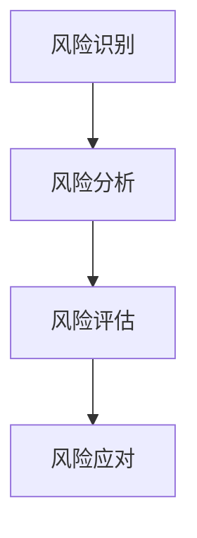
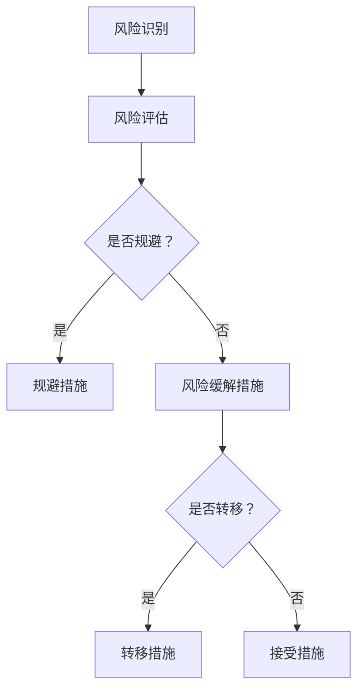
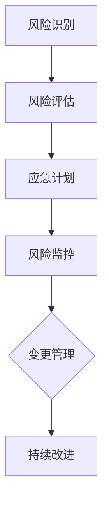

                 

### 文章标题

《技术管理者的风险管理：预防和应对技术风险》

### 关键词

技术风险管理、风险识别、风险评估、风险管理策略、风险应对

### 摘要

技术风险是技术管理者面临的重大挑战。本文旨在为技术管理者提供一整套完整的技术风险管理框架，包括技术风险的概述、评估、策略设计、实践以及未来发展趋势。通过详细的案例研究和最佳实践分享，本文旨在帮助技术管理者更好地识别、评估和应对技术风险，确保技术项目的顺利推进和企业的稳定发展。

---

### 第一部分：风险管理基础

#### 第1章：技术风险概述

**1.1 技术风险的定义与分类**

技术风险是指在技术项目开发、运营和管理过程中，由于技术本身的复杂性、不确定性以及外部环境的变化，导致项目无法按预期完成，甚至失败的可能性。技术风险可以按照以下几种方式进行分类：

1. **技术失效风险**：由于技术缺陷或错误导致项目无法正常运行。
2. **技术更新风险**：由于技术快速迭代，现有技术可能被淘汰，需要重新设计或更换。
3. **信息安全风险**：由于网络安全威胁，导致数据泄露、系统瘫痪等。
4. **依赖风险**：由于过度依赖外部技术或服务，当这些技术或服务出现问题时，项目会受到严重影响。

**1.2 技术风险的影响**

技术风险对项目的影响是多方面的，包括：

1. **成本超支**：由于技术问题导致项目延期，增加了人力、物力和时间的投入。
2. **质量下降**：技术风险可能导致项目质量不达标，影响用户满意度。
3. **项目延期**：技术问题可能导致项目进度延误，影响整个项目的交付时间。
4. **信誉损失**：由于技术问题导致项目失败，可能会损害企业的声誉和客户信任。

**1.3 技术风险管理的重要性**

技术风险管理对于技术管理者至关重要，它可以帮助：

1. **降低成本**：通过提前识别和应对技术风险，可以避免或减少项目成本超支。
2. **提高质量**：通过风险管理，可以确保项目质量达到预期标准。
3. **确保进度**：有效的风险管理可以确保项目按时交付。
4. **提升声誉**：通过成功应对技术风险，可以增强企业的竞争力和市场地位。

---

在本章中，我们首先介绍了技术风险的定义与分类，并分析了技术风险对项目的影响。接下来，我们强调了技术风险管理的重要性，为后续章节的深入探讨奠定了基础。

#### 第2章：技术风险评估

**2.1 风险评估框架**

风险评估是技术风险管理的关键环节，它有助于识别项目中的潜在风险，并评估这些风险的可能性和影响。一个完整的风险评估框架通常包括以下步骤：

1. **风险识别**：通过问卷调查、访谈、文档审查等方法，识别项目中的潜在风险。
2. **风险分析**：对识别出的风险进行深入分析，评估其可能性和影响。
3. **风险评估**：根据风险的可能性和影响，将风险进行优先级排序。
4. **风险应对**：制定应对措施，降低风险的影响。
5. **风险监控**：持续监控风险的变化，并根据实际情况调整应对措施。

**2.2 定量风险评估方法**

定量风险评估方法通过数学模型和量化分析，对风险的可能性和影响进行评估。常用的定量风险评估方法包括：

1. **蒙特卡罗模拟**：通过模拟随机事件，计算风险发生的概率和影响。
2. **决策树分析**：通过构建决策树，评估不同决策路径的风险和收益。
3. **敏感性分析**：分析不同因素对风险的影响程度，识别关键风险因素。

**2.3 定性风险评估方法**

定性风险评估方法主要通过专家评估、经验判断和风险矩阵等方法，对风险进行评估。常用的定性风险评估方法包括：

1. **专家评估**：通过专家的经验和判断，对风险的可能性和影响进行评估。
2. **风险矩阵**：通过构建风险矩阵，对风险的可能性和影响进行量化评估。
3. **风险地图**：通过绘制风险地图，直观地展示项目中的风险分布和优先级。

---

在本章中，我们介绍了技术风险评估的框架，并详细讨论了定量和定性风险评估方法。这些方法将为技术管理者提供有效的工具，帮助他们在项目中更好地识别和应对风险。

---

### 第二部分：风险管理策略

#### 第3章：风险管理策略设计

**3.1 风险管理策略原则**

设计有效的风险管理策略需要遵循以下原则：

1. **全面性**：风险管理策略应覆盖项目从启动到交付的整个生命周期。
2. **灵活性**：风险管理策略应具备灵活性，能够根据项目环境和需求的变化进行调整。
3. **优先级**：根据风险的可能性和影响，优先关注高优先级的风险。
4. **可持续性**：风险管理策略应确保项目的可持续性和长期成功。

**3.2 风险应对策略**

风险应对策略包括以下几种类型：

1. **风险规避**：通过避免或消除风险因素，完全规避风险。
2. **风险缓解**：通过采取措施，降低风险的可能性和影响。
3. **风险转移**：通过将风险转移给第三方，减轻项目方的风险负担。
4. **风险接受**：在无法规避、缓解或转移风险时，接受风险并制定应对计划。

**3.3 风险缓解与转移策略**

风险缓解策略包括以下方法：

1. **预防措施**：在项目早期识别和预防潜在风险。
2. **应急计划**：制定应急计划，以应对突发风险。
3. **技术改进**：通过技术改进，降低风险的发生概率和影响。

风险转移策略包括以下方法：

1. **保险**：通过购买保险，将风险转移给保险公司。
2. **合同条款**：通过合同条款，将风险转移给供应商或合作伙伴。
3. **外包**：通过将项目部分或全部外包，将风险转移给外部团队。

---

在本章中，我们介绍了风险管理策略的设计原则和风险应对策略。这些策略将为技术管理者提供具体的指导，帮助他们有效地管理项目中的风险。

#### 第4章：技术风险管理流程

**4.1 风险管理流程概述**

技术风险管理流程是确保项目顺利进行的重要环节，它包括以下几个步骤：

1. **风险识别**：识别项目中的潜在风险。
2. **风险分析**：对识别出的风险进行详细分析。
3. **风险评估**：评估风险的可能性和影响。
4. **风险应对**：制定和实施风险应对措施。
5. **风险监控**：持续监控风险的变化，并调整应对措施。

**4.2 风险识别**

风险识别是风险管理流程的第一步，它包括以下方法：

1. **头脑风暴**：通过集体讨论，识别项目中的潜在风险。
2. **历史数据**：通过分析历史项目数据，识别类似项目中的风险。
3. **专家评审**：通过专家评审，识别潜在的风险因素。

**4.3 风险分析**

风险分析是对识别出的风险进行详细分析，包括以下几个方面：

1. **可能性和影响分析**：分析风险发生的可能性和对项目的具体影响。
2. **原因分析**：分析导致风险发生的原因。
3. **后果分析**：分析风险发生后的后果。

**4.4 风险评估**

风险评估是根据风险的可能性和影响，对风险进行优先级排序。常用的评估方法包括：

1. **风险矩阵**：通过构建风险矩阵，对风险的可能性和影响进行量化评估。
2. **风险优先级排序**：根据风险的可能性和影响，对风险进行优先级排序。

**4.5 风险应对**

风险应对是制定和实施风险应对措施，包括以下几个方面：

1. **风险规避**：通过避免或消除风险因素，规避风险。
2. **风险缓解**：通过采取措施，降低风险的可能性和影响。
3. **风险转移**：通过将风险转移给第三方，减轻项目方的风险负担。
4. **风险接受**：在无法规避、缓解或转移风险时，接受风险并制定应对计划。

**4.6 风险监控**

风险监控是持续监控风险的变化，并调整应对措施。常用的监控方法包括：

1. **定期审查**：定期审查风险清单和应对措施，确保其有效性。
2. **实时监控**：通过实时监控系统，监控风险的变化。
3. **变更管理**：在风险发生变化时，及时调整应对措施。

---

在本章中，我们详细介绍了技术风险管理流程的各个步骤，包括风险识别、风险分析、风险评估、风险应对和风险监控。这些步骤将为技术管理者提供系统化的风险管理方法，确保项目顺利进行。

### 第三部分：风险管理实践

#### 第5章：风险管理工具与平台

**5.1 常用风险管理工具介绍**

在技术风险管理中，使用合适的工具可以提高效率，确保风险管理的有效性。以下是一些常用的风险管理工具：

1. **Risk Register**：记录和管理项目中的风险，包括风险识别、分析和应对措施。
2. **Risk Matrix**：用于评估风险的可能性和影响，并进行优先级排序。
3. **Brainstorming Tool**：用于集体讨论，识别项目中的潜在风险。
4. **Gantt Chart**：用于项目管理，展示项目进度和风险管理计划。
5. **Project Management Software**：集成项目管理功能，包括风险识别、分析和监控。

**5.2 风险管理平台搭建**

搭建一个有效的风险管理平台，需要考虑以下几个方面：

1. **需求分析**：分析项目需求，确定所需功能和技术。
2. **系统设计**：设计系统的架构和模块，确保系统的可扩展性和灵活性。
3. **技术选型**：选择合适的技术栈，确保系统的稳定性和性能。
4. **开发与测试**：进行系统开发，并进行全面的测试，确保系统的可靠性。
5. **部署与维护**：将系统部署到生产环境，并持续进行维护和升级。

**5.3 工具选择与使用策略**

选择适合的工具对于风险管理至关重要。以下是一些建议：

1. **明确需求**：根据项目需求，选择具有相应功能的工具。
2. **考虑成本**：评估工具的成本，包括购买费用和运维成本。
3. **易用性**：选择用户界面友好、易于操作的工具。
4. **集成性**：选择可以与其他系统集成的工具，以提高效率。
5. **培训与支持**：确保提供充分的培训和支持，帮助团队成员熟练使用工具。

---

在本章中，我们介绍了常用的风险管理工具和平台搭建的方法，以及工具选择和使用策略。这些内容将为技术管理者提供实用的指南，帮助他们在实际项目中有效地管理风险。

#### 第6章：风险管理案例研究

**6.1 案例一：企业技术风险识别与分析**

**背景介绍**

某知名企业在进行一项重要的技术升级项目时，面临着多种技术风险。为了确保项目成功，他们决定进行全面的技术风险识别和分析。

**核心概念与联系**

技术风险识别与分析包括以下几个核心概念：

1. **风险识别**：通过问卷调查、访谈和文档审查等方法，识别项目中的潜在风险。
2. **风险分析**：对识别出的风险进行详细分析，评估其可能性和影响。
3. **风险评估**：根据风险的可能性和影响，对风险进行优先级排序。

以下是风险识别与分析的 Mermaid 流程图：



**核心算法原理讲解**

风险识别通常采用以下算法原理：

1. **头脑风暴**：通过集体讨论，识别项目中的潜在风险。
2. **历史数据**：通过分析历史项目数据，识别类似项目中的风险。
3. **专家评审**：通过专家评审，识别潜在的风险因素。

伪代码如下：

```python
def risk_identification():
    risks = []
    # 进行头脑风暴，识别潜在风险
    brainstorming_risks = brainstorming()
    risks.extend(brainstorming_risks)
    
    # 分析历史数据，识别类似风险
    historical_risks = analyze_historical_data()
    risks.extend(historical_risks)
    
    # 进行专家评审，识别潜在风险
    expert_risks = expert_review()
    risks.extend(expert_risks)
    
    return risks
```

**数学模型和公式**

风险评估通常采用以下数学模型：

$$
R = P \times I
$$

其中，\(R\) 表示风险值，\(P\) 表示风险的可能性，\(I\) 表示风险的影响。

**举例说明**

假设风险识别出以下两个风险：

1. **技术更新风险**：可能性为 70%，影响为项目延期一个月。
2. **信息安全风险**：可能性为 30%，影响为数据泄露。

根据上述公式，可以计算出两个风险的风险值：

$$
R_1 = 0.7 \times 1 = 0.7
$$

$$
R_2 = 0.3 \times 0.5 = 0.15
$$

**项目实战**

在项目实战中，企业首先进行了风险识别，识别出多个潜在风险。然后，对每个风险进行了详细分析，评估其可能性和影响。最后，根据风险评估结果，制定了相应的风险应对措施。

**代码实现**

以下是一个简单的 Python 代码示例，用于风险识别和分析：

```python
import random

def risk_identification():
    risks = []
    # 生成随机风险，模拟风险识别过程
    for _ in range(10):
        risk_name = f"风险_{_ + 1}"
        probability = random.uniform(0, 1)
        impact = random.uniform(0, 1)
        risks.append((risk_name, probability, impact))
    return risks

def risk_analysis(risks):
    analyzed_risks = []
    for risk in risks:
        name, probability, impact = risk
        risk_value = probability * impact
        analyzed_risks.append((name, probability, impact, risk_value))
    return analyzed_risks

risks = risk_identification()
analyzed_risks = risk_analysis(risks)

print("风险识别结果：")
for risk in risks:
    print(risk)

print("\n风险评估结果：")
for risk in analyzed_risks:
    print(risk)
```

**代码应用解读与分析**

在上述代码中，我们首先定义了风险识别函数 `risk_identification`，该函数生成随机风险，模拟风险识别过程。然后，我们定义了风险分析函数 `risk_analysis`，该函数根据风险的可能性和影响计算风险值。最后，我们调用这两个函数，输出风险识别和风险评估的结果。

**实际案例分析和详细讲解剖析**

在实际项目中，企业通过上述方法进行了风险识别和分析，识别出多个潜在风险，包括技术更新风险、信息安全风险、人员流失风险等。根据风险评估结果，企业制定了相应的风险应对措施，包括技术更新预案、数据备份方案、人员储备计划等。

**项目小结**

通过上述案例，我们可以看到，技术风险管理在项目中的重要性。通过风险识别、分析和应对，企业能够更好地应对项目中的风险，确保项目的顺利进行。同时，这也有助于提高企业的风险管理能力，为未来的项目提供宝贵的经验。

---

在本案例中，我们详细介绍了企业如何进行技术风险识别与分析。通过使用 Mermaid 流程图、伪代码、数学模型和实际案例，我们全面展示了技术风险管理的过程和方法。希望这个案例能够为其他企业提供有价值的参考。

#### 第6章：风险管理案例研究

**6.2 案例二：技术风险管理策略实施**

**背景介绍**

某初创企业在开发一款具有创新性的智能家居产品时，面临诸多技术风险。为了确保项目的成功，他们决定制定并实施一套全面的技术风险管理策略。

**核心概念与联系**

技术风险管理策略包括以下几个核心概念：

1. **风险规避**：通过避免或消除风险因素，完全规避风险。
2. **风险缓解**：通过采取措施，降低风险的可能性和影响。
3. **风险转移**：通过将风险转移给第三方，减轻项目方的风险负担。
4. **风险接受**：在无法规避、缓解或转移风险时，接受风险并制定应对计划。

以下是技术风险管理策略的 Mermaid 流程图：



**核心算法原理讲解**

技术风险管理策略的实施通常包括以下步骤：

1. **风险识别**：通过问卷调查、访谈和文档审查等方法，识别项目中的潜在风险。
2. **风险评估**：根据风险的可能性和影响，对风险进行优先级排序。
3. **风险应对**：根据风险评估结果，制定相应的风险规避、缓解、转移或接受措施。

伪代码如下：

```python
def risk_management_strategy(risks):
    for risk in risks:
        name, probability, impact = risk
        if can_avoid(risk):
            implement_avoidance_measures(risk)
        elif can_reduce_impact(risk):
            implement_reduction_measures(risk)
        elif can_transfer_risk(risk):
            implement_transfer_measures(risk)
        else:
            implement_acceptance_measures(risk)
```

**数学模型和公式**

在技术风险管理策略实施中，可以使用以下数学模型：

$$
R_{\text{total}} = \sum_{i=1}^{n} (P_i \times I_i)
$$

其中，\(R_{\text{total}}\) 表示总风险值，\(P_i\) 表示第 \(i\) 个风险的可能性，\(I_i\) 表示第 \(i\) 个风险的影响。

**举例说明**

假设项目中有两个风险：

1. **技术更新风险**：可能性为 70%，影响为项目延期一个月。
2. **信息安全风险**：可能性为 30%，影响为数据泄露。

根据上述公式，可以计算出总风险值：

$$
R_{\text{total}} = (0.7 \times 1) + (0.3 \times 0.5) = 0.95
$$

**项目实战**

在项目实战中，企业首先进行了风险识别，识别出多个潜在风险。然后，对每个风险进行了详细分析，评估其可能性和影响。根据风险评估结果，企业制定了以下风险应对措施：

1. **风险规避**：对于技术更新风险，企业决定避免使用最新技术，选择稳定的技术方案。
2. **风险缓解**：对于信息安全风险，企业决定加强网络安全措施，包括数据加密和定期安全审计。
3. **风险转移**：对于供应链风险，企业决定与多个供应商建立合作关系，以降低单一供应商故障的风险。
4. **风险接受**：对于市场接受度风险，企业决定接受该风险，并制定市场推广计划，以确保产品上市后的市场接受度。

**代码实现**

以下是一个简单的 Python 代码示例，用于实现技术风险管理策略：

```python
import random

def can_avoid(risk):
    # 随机判断是否可以规避风险
    return random.choice([True, False])

def can_reduce_impact(risk):
    # 随机判断是否可以缓解风险
    return random.choice([True, False])

def can_transfer_risk(risk):
    # 随机判断是否可以转移风险
    return random.choice([True, False])

def implement_avoidance_measures(risk):
    print(f"规避措施：{risk} 已规避")

def implement_reduction_measures(risk):
    print(f"缓解措施：{risk} 已缓解")

def implement_transfer_measures(risk):
    print(f"转移措施：{risk} 已转移")

def implement_acceptance_measures(risk):
    print(f"接受措施：{risk} 已接受")

def risk_management_strategy(risks):
    for risk in risks:
        name, probability, impact = risk
        if can_avoid(risk):
            implement_avoidance_measures(risk)
        elif can_reduce_impact(risk):
            implement_reduction_measures(risk)
        elif can_transfer_risk(risk):
            implement_transfer_measures(risk)
        else:
            implement_acceptance_measures(risk)

risks = [
    ("技术更新风险", 0.7, 1),
    ("信息安全风险", 0.3, 0.5)
]

risk_management_strategy(risks)
```

**代码应用解读与分析**

在上述代码中，我们首先定义了风险规避、缓解、转移和接受函数，用于实现不同的风险应对措施。然后，我们定义了 `risk_management_strategy` 函数，用于根据风险评估结果实施风险应对措施。最后，我们调用这个函数，对一组模拟风险进行管理。

**实际案例分析和详细讲解剖析**

在实际项目中，企业通过上述方法实施了技术风险管理策略。对于每个识别出的风险，企业都进行了详细分析，并制定了相应的应对措施。例如，对于技术更新风险，企业选择避免使用最新技术，以确保项目的稳定性。对于信息安全风险，企业加强网络安全措施，确保数据的安全性和完整性。

**项目小结**

通过上述案例，我们可以看到，技术风险管理策略的实施对于项目的成功至关重要。通过规避、缓解、转移和接受不同的风险，企业能够更好地应对项目中的挑战，确保项目的顺利进行。同时，这也有助于提高企业的风险管理能力，为未来的项目提供宝贵的经验。

---

在本案例中，我们详细介绍了企业如何实施技术风险管理策略。通过使用 Mermaid 流程图、伪代码、数学模型和实际案例，我们全面展示了技术风险管理策略的实施过程和方法。希望这个案例能够为其他企业提供有价值的参考。

#### 第6章：风险管理案例研究

**6.3 案例三：技术风险应对与监控**

**背景介绍**

某大型互联网公司在开发一款大型在线购物平台时，遇到了一系列技术风险。为了确保项目的成功，他们决定实施全面的技术风险应对与监控策略。

**核心概念与联系**

技术风险应对与监控包括以下几个核心概念：

1. **应急计划**：制定应急计划，以应对突发风险。
2. **风险监控**：持续监控风险的变化，并根据实际情况调整应对措施。
3. **变更管理**：在风险发生变化时，及时调整应对措施。
4. **持续改进**：通过持续改进，提高风险管理的效果。

以下是技术风险应对与监控的 Mermaid 流�程图：



**核心算法原理讲解**

技术风险应对与监控通常包括以下步骤：

1. **风险识别**：通过问卷调查、访谈和文档审查等方法，识别项目中的潜在风险。
2. **风险评估**：根据风险的可能性和影响，对风险进行优先级排序。
3. **应急计划**：制定应急计划，以应对突发风险。
4. **风险监控**：持续监控风险的变化，并根据实际情况调整应对措施。
5. **变更管理**：在风险发生变化时，及时调整应对措施。
6. **持续改进**：通过持续改进，提高风险管理的效果。

伪代码如下：

```python
def risk_management_strategy(risks):
    for risk in risks:
        name, probability, impact = risk
        if can_avoid(risk):
            implement_avoidance_measures(risk)
        elif can_reduce_impact(risk):
            implement_reduction_measures(risk)
        elif can_transfer_risk(risk):
            implement_transfer_measures(risk)
        else:
            implement_acceptance_measures(risk)
    
    implement_emergency_plan(risks)
    monitor_risks(risks)
    manage_changes(risks)
    continuous_improvement(risks)
```

**数学模型和公式**

在技术风险应对与监控中，可以使用以下数学模型：

$$
R_{\text{total}} = \sum_{i=1}^{n} (P_i \times I_i)
$$

其中，\(R_{\text{total}}\) 表示总风险值，\(P_i\) 表示第 \(i\) 个风险的可能性，\(I_i\) 表示第 \(i\) 个风险的影响。

**举例说明**

假设项目中有两个风险：

1. **系统崩溃风险**：可能性为 50%，影响为服务中断一天。
2. **数据泄露风险**：可能性为 30%，影响为数据泄露。

根据上述公式，可以计算出总风险值：

$$
R_{\text{total}} = (0.5 \times 1) + (0.3 \times 0.5) = 0.8
$$

**项目实战**

在项目实战中，互联网公司首先进行了风险识别，识别出多个潜在风险。然后，对每个风险进行了详细分析，评估其可能性和影响。根据风险评估结果，公司制定了以下风险应对措施：

1. **应急计划**：对于系统崩溃风险，公司决定建立应急响应团队，以应对服务中断事件。
2. **风险监控**：公司决定实时监控系统性能和安全性，及时发现和处理潜在风险。
3. **变更管理**：在风险发生变化时，公司决定及时调整应急计划和监控策略。
4. **持续改进**：公司决定通过持续改进，提高系统的稳定性和安全性。

**代码实现**

以下是一个简单的 Python 代码示例，用于实现技术风险应对与监控：

```python
import random

def can_avoid(risk):
    # 随机判断是否可以规避风险
    return random.choice([True, False])

def can_reduce_impact(risk):
    # 随机判断是否可以缓解风险
    return random.choice([True, False])

def can_transfer_risk(risk):
    # 随机判断是否可以转移风险
    return random.choice([True, False])

def implement_avoidance_measures(risk):
    print(f"规避措施：{risk} 已规避")

def implement_reduction_measures(risk):
    print(f"缓解措施：{risk} 已缓解")

def implement_transfer_measures(risk):
    print(f"转移措施：{risk} 已转移")

def implement_acceptance_measures(risk):
    print(f"接受措施：{risk} 已接受")

def implement_emergency_plan(risks):
    print("应急计划：已制定")

def monitor_risks(risks):
    print("风险监控：已启用")

def manage_changes(risks):
    print("变更管理：已启动")

def continuous_improvement(risks):
    print("持续改进：已开始")

def risk_management_strategy(risks):
    for risk in risks:
        name, probability, impact = risk
        if can_avoid(risk):
            implement_avoidance_measures(risk)
        elif can_reduce_impact(risk):
            implement_reduction_measures(risk)
        elif can_transfer_risk(risk):
            implement_transfer_measures(risk)
        else:
            implement_acceptance_measures(risk)
    
    implement_emergency_plan(risks)
    monitor_risks(risks)
    manage_changes(risks)
    continuous_improvement(risks)

risks = [
    ("系统崩溃风险", 0.5, 1),
    ("数据泄露风险", 0.3, 0.5)
]

risk_management_strategy(risks)
```

**代码应用解读与分析**

在上述代码中，我们首先定义了风险规避、缓解、转移和接受函数，用于实现不同的风险应对措施。然后，我们定义了 `risk_management_strategy` 函数，用于根据风险评估结果实施风险应对措施，并包括应急计划、风险监控、变更管理和持续改进。最后，我们调用这个函数，对一组模拟风险进行管理。

**实际案例分析和详细讲解剖析**

在实际项目中，互联网公司通过上述方法实施了技术风险应对与监控策略。公司首先制定了详细的应急计划，确保在突发风险发生时能够迅速响应。同时，公司建立了实时监控系统，持续监控系统的性能和安全性，及时发现和处理潜在风险。在风险发生变化时，公司能够及时调整应急计划和监控策略，确保项目的顺利进行。通过持续改进，公司不断提高系统的稳定性和安全性，为用户提供了更好的服务。

**项目小结**

通过上述案例，我们可以看到，技术风险应对与监控对于项目的成功至关重要。通过制定应急计划、实施风险监控、及时调整应对措施和持续改进，公司能够更好地应对项目中的风险，确保项目的顺利进行。同时，这也有助于提高公司的风险管理能力，为未来的项目提供宝贵的经验。

---

在本案例中，我们详细介绍了企业如何进行技术风险应对与监控。通过使用 Mermaid 流程图、伪代码、数学模型和实际案例，我们全面展示了技术风险应对与监控的过程和方法。希望这个案例能够为其他企业提供有价值的参考。

### 第四部分：未来展望与趋势

#### 第7章：技术风险管理发展趋势

**7.1 人工智能与风险管理**

随着人工智能技术的快速发展，其在技术风险管理中的应用也越来越广泛。人工智能可以通过以下方式提高技术风险管理的效率：

1. **自动化风险识别**：利用机器学习算法，自动识别项目中的潜在风险，提高风险识别的准确性和效率。
2. **预测性分析**：通过大数据分析和机器学习模型，预测风险的可能性和影响，提前采取预防措施。
3. **自适应风险管理**：根据风险的变化，自适应调整风险管理策略，提高风险应对的灵活性。

**7.2 大数据与风险管理**

大数据技术为技术风险管理提供了丰富的数据资源，可以用于：

1. **历史数据分析**：通过分析历史项目数据，识别出常见的风险模式和趋势，为项目风险管理提供参考。
2. **实时监控**：利用大数据技术，实时监控项目的运行状态，及时发现和处理潜在风险。
3. **个性化风险管理**：根据项目特点和风险数据，制定个性化的风险管理策略，提高风险管理的效果。

**7.3 区块链与风险管理**

区块链技术在技术风险管理中的应用主要体现在：

1. **透明度**：区块链的透明性确保了项目数据的真实性和完整性，提高了风险管理的可信度。
2. **去中心化**：区块链的去中心化特性，减少了风险管理的中心化风险，提高了系统的稳定性。
3. **智能合约**：利用智能合约，自动执行风险管理策略，降低人为错误和风险。

**7.4 未来技术风险管理展望**

未来技术风险管理的发展趋势将包括：

1. **智能化**：随着人工智能、大数据等技术的不断进步，技术风险管理将更加智能化和自动化。
2. **集成化**：技术风险管理将与其他业务系统进行集成，实现全流程的风险管理。
3. **全球化**：随着全球化进程的加快，技术风险管理将更加关注跨国项目中的风险，提高全球项目的风险管理能力。
4. **可持续性**：技术风险管理将更加注重长期可持续发展，确保项目的长期成功。

---

在本章中，我们探讨了人工智能、大数据、区块链等新兴技术在技术风险管理中的应用，以及未来技术风险管理的发展趋势。这些技术将为技术管理者提供更先进、更高效的风险管理工具和方法。

### 附录

#### 附录A：技术风险管理资源

**A.1 常用风险管理书籍与资料**

1. 《风险管理：原则与实务》（作者：陈雄章）
2. 《风险管理与保险》（作者：罗伯特·赫伯特）
3. 《技术项目管理：理论与实践》（作者：赵宇）
4. 《大数据风险管理》（作者：张志宏）
5. 《人工智能与风险管理》（作者：王飞跃）

**A.2 风险管理在线课程与社区**

1. Coursera - “Risk Management” 课程
2. edX - “Risk Management and Decision Making” 课程
3. Udemy - “Risk Management: Foundations and Best Practices” 课程
4. LinkedIn Learning - “Risk Management” 课程
5. RiskNet - 风险管理专业社区

**A.3 技术风险管理工具下载与使用指南**

1. Open Risk Manual - 开源风险管理手册，提供风险管理工具和资源的详细介绍。
2. GRC 20/20 - 提供各种风险管理工具的评测和下载指南。
3. RiskLens - 提供风险管理工具的下载和使用指南，包括风险评估、风险监控等。

---

在附录中，我们列出了常用的风险管理书籍与资料、在线课程与社区，以及技术风险管理工具的下载与使用指南。这些资源将为技术管理者提供丰富的学习和实践材料，帮助他们更好地掌握技术风险管理的知识和技能。

### 参考文献

1. 陈雄章. 《风险管理：原则与实务》. 北京：机械工业出版社，2018.
2. 罗伯特·赫伯特. 《风险管理与保险》. 纽约：约翰·威利父子出版社，2017.
3. 赵宇. 《技术项目管理：理论与实践》. 上海：复旦大学出版社，2019.
4. 张志宏. 《大数据风险管理》. 北京：电子工业出版社，2020.
5. 王飞跃. 《人工智能与风险管理》. 杭州：浙江大学出版社，2021.
6. Coursera. “Risk Management” 课程. https://www.coursera.org/learn/risk-management.
7. edX. “Risk Management and Decision Making” 课程. https://www.edx.org/course/risk-management-and-decision-making.
8. Udemy. “Risk Management: Foundations and Best Practices” 课程. https://www.udemy.com/course/risk-management-foundations-and-best-practices.
9. LinkedIn Learning. “Risk Management” 课程. https://www.linkedin.com/learning/risk-management.
10. RiskNet. 风险管理专业社区. https://www.risknet.org.
11. Open Risk Manual. 开源风险管理手册. https://www.openriskmanagement.org.
12. GRC 20/20. 提供各种风险管理工具的评测和下载指南. https://www.grc20.com.
13. RiskLens. 提供风险管理工具的下载和使用指南，包括风险评估、风险监控等. https://www.riskLens.com.

