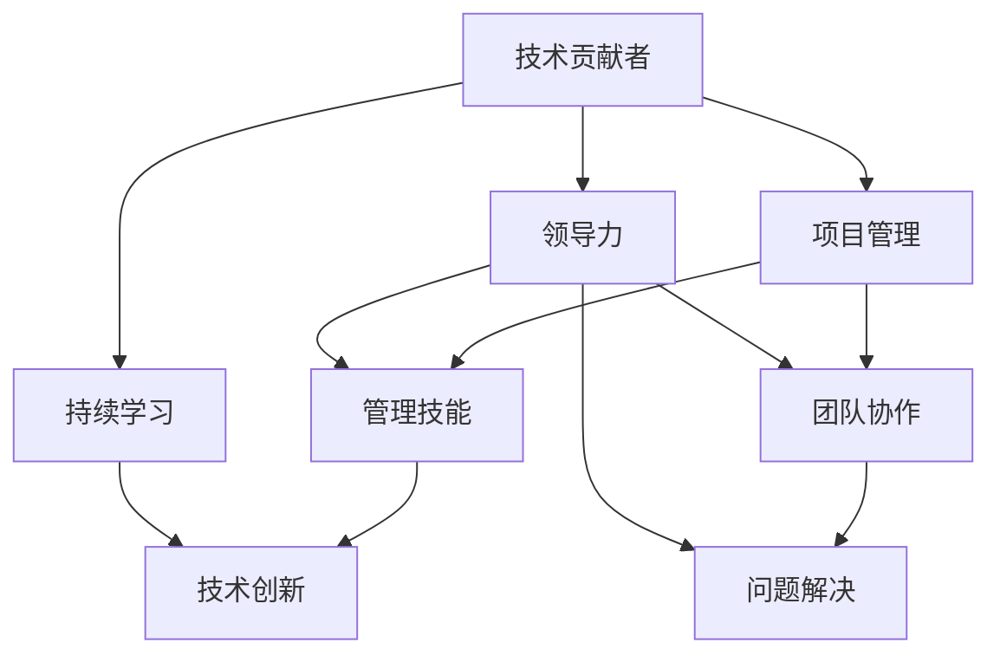

                 

### 文章标题：技术管理转型：从个人贡献者到管理者

在快速变化和竞争激烈的IT行业，技术管理角色的转变是一个不可避免的趋势。随着技术的发展，个人贡献者逐渐意识到，要想在职业生涯中取得更大的成功，单凭技术专长是不够的。他们需要学会如何管理团队、规划项目、制定战略，并在组织内发挥更大的影响力。本文将详细探讨从个人贡献者转型为技术管理者的过程，旨在帮助读者理解这一转变的重要性、步骤和关键要素。

## 关键词
- 技术管理
- 转型
- 个人贡献者
- 领导力
- 项目管理
- 战略规划

## 摘要
本文分为三个主要部分。第一部分将介绍个人贡献者的阶段，强调技术技能、项目管理和领导力的重要性。第二部分将探讨从个人贡献者到管理者的转型，包括管理技能的提升、团队管理和项目执行。第三部分将通过成功案例和实践，总结转型的关键要素，并提供未来发展展望。

## 第一部分：个人贡献者阶段

在职业生涯的早期，技术贡献者主要专注于个人技能的提升和项目的成功实施。这一阶段的关键在于不断积累技术经验和专业知识，同时培养良好的协作和解决问题的能力。

### 第1章：技术技能提升

作为技术贡献者，提升技术技能是基础。这不仅包括掌握编程语言和框架，还涉及对技术栈的广度与深度有深入理解。

#### 1.1 技术栈的广度与深度

技术栈的广度与深度是衡量一个技术贡献者能力的重要标准。广度指的是对多种技术的熟悉和掌握，而深度则是对某一领域或技术的深入了解。一个优秀的技术贡献者需要在两者之间找到平衡。

- **广度**：掌握多种编程语言（如Java、Python、JavaScript）和框架（如Spring、Django、React），了解数据库、操作系统、网络等基础知识。
- **深度**：在一个特定领域深入钻研，如大数据、人工智能、云计算等，掌握相关技术原理和最佳实践。

#### 1.2 技术趋势与前沿动态

技术日新月异，了解技术趋势和前沿动态对技术贡献者至关重要。这有助于他们保持在技术前沿，为项目带来创新和改进。

- **学习方法**：关注技术社区、参加技术会议和研讨会、阅读技术博客和论文。
- **实践应用**：在项目中尝试使用新技术，进行技术实验和原型设计。

#### 1.3 实践中的技术难题解决

技术贡献者的价值在于能够解决复杂的技术问题。在实践中，他们需要具备以下能力：

- **问题分析**：能够快速定位问题，分析原因。
- **技术选型**：根据项目需求和现有技术，选择合适的解决方案。
- **代码实现**：编写高效、可维护的代码，并进行单元测试。
- **团队协作**：与技术团队和业务团队沟通，确保解决方案符合项目需求。

### 第2章：项目管理与协作

项目管理和技术贡献者的日常职责紧密相关。一个成功的项目不仅需要优秀的技术实现，还需要有效的项目管理和团队协作。

#### 2.1 项目管理基础

项目管理是技术贡献者迈向管理者的必经之路。以下是一些基础概念：

- **项目定义**：明确项目的目标、范围和预期成果。
- **项目计划**：制定详细的计划，包括时间表、任务分配和资源管理。
- **项目执行**：按计划进行工作，监控进度，确保项目按计划进行。
- **项目监控**：定期评估项目进展，识别和解决潜在问题。
- **项目收尾**：确保项目达到预期目标，进行总结和评估。

#### 2.2 团队协作与沟通

项目成功的关键在于团队协作。技术贡献者需要掌握以下技能：

- **沟通技巧**：清晰、准确、及时地与团队成员和利益相关者沟通。
- **团队建设**：建立高效的团队，促进成员间的信任和合作。
- **角色定位**：明确每个团队成员的职责和角色，确保工作高效有序。

#### 2.3 问题解决与决策制定

在项目管理中，问题解决和决策制定是不可或缺的。技术贡献者需要：

- **问题识别**：及时发现和识别项目中的问题。
- **解决方案**：制定有效的解决方案，并评估其可行性。
- **决策制定**：在团队中制定决策，并确保决策的执行。

### 第3章：领导力基础

领导力是技术贡献者转型为管理者的核心能力。领导力不仅关乎个人魅力，更关乎如何影响和激励团队。

#### 3.1 领导力的定义与重要性

领导力是一种能够影响和激励他人共同实现目标的能力。在技术管理中，领导力的重要性体现在以下几个方面：

- **团队凝聚力**：通过领导力，建立紧密的团队关系，增强团队凝聚力。
- **决策效率**：高效的领导力有助于快速做出决策，减少项目延误。
- **创新能力**：领导力能够激发团队成员的创新思维，推动技术进步。
- **员工满意度**：优秀的领导力能够提高员工的工作满意度和忠诚度。

#### 3.2 领导风格与团队激励

不同的领导风格适用于不同的团队和情境。技术管理者需要：

- **了解团队**：了解团队成员的特点和需求，选择合适的领导风格。
- **激励员工**：通过激励措施，提高员工的工作积极性和创造力。
- **反馈与成长**：定期给予团队成员反馈，帮助他们成长和提升。

#### 3.3 情绪管理与冲突处理

在团队中，情绪管理和冲突处理是维护团队稳定的重要环节。技术管理者需要：

- **情绪管理**：学会控制自己的情绪，避免情绪化决策。
- **冲突处理**：积极处理团队内部的冲突，寻求双方都能接受的解决方案。

### 第二部分：管理者转型

随着技术贡献者在职业生涯中的积累，他们逐渐意识到，单纯的代码编写和项目实施已经无法满足职业发展的需求。管理角色的转变成为他们进一步发展的必然选择。

### 第4章：管理技能提升

成为一名技术管理者，不仅需要掌握技术技能，还需要具备一系列管理技能。这些技能包括：

#### 4.1 管理者角色与职责

技术管理者在组织中的角色和职责是多元的。他们需要：

- **团队管理**：负责团队的组织、管理和激励。
- **项目管理**：确保项目按时、按质完成。
- **战略规划**：参与组织的战略规划和决策。
- **资源管理**：合理分配和利用资源，确保项目成功。

#### 4.2 战略规划与执行

战略规划是技术管理者的重要职责之一。他们需要：

- **市场分析**：了解市场需求和竞争态势。
- **技术趋势**：把握技术发展趋势，为组织提供技术方向。
- **资源分配**：根据战略目标，合理分配资源。
- **执行监控**：确保战略规划的执行，并及时调整。

#### 4.3 团队建设与人才发展

团队建设是技术管理者的核心任务之一。他们需要：

- **团队构建**：选择合适的团队成员，构建高效的团队。
- **人才培养**：提供培训和发展机会，提升团队整体能力。
- **绩效评估**：定期评估团队成员的绩效，给予反馈和激励。
- **团队激励**：通过激励措施，提高团队的工作积极性和创造力。

### 第5章：团队管理与领导力

团队管理是技术管理者的重要职责，而领导力则是团队管理的核心。在这个章节中，我们将探讨如何进行有效的团队管理和领导力提升。

#### 5.1 团队组织结构与职责分配

团队组织结构是团队管理的基础。技术管理者需要：

- **职责分配**：明确每个团队成员的职责和角色，确保工作有序进行。
- **权限分配**：根据职责和角色，合理分配权限，提高决策效率。
- **沟通渠道**：建立畅通的沟通渠道，确保信息传递的及时性和准确性。

#### 5.2 领导力模型与领导力发展

领导力是技术管理者的重要素质。在这个部分，我们将介绍几种常见的领导力模型，并探讨如何提升领导力：

- **变革型领导力**：激发团队成员的潜力，推动创新和变革。
- **交易型领导力**：通过奖励和惩罚，维持团队的稳定和效率。
- **情境型领导力**：根据不同情境和团队需求，灵活调整领导风格。

#### 5.3 领导力评估与反馈

领导力评估和反馈是提升领导力的关键。技术管理者需要：

- **自我评估**：定期进行自我评估，了解自己的优势和不足。
- **团队反馈**：收集团队成员的反馈，了解他们在领导力方面的需求和期望。
- **改进措施**：根据评估和反馈，制定改进措施，持续提升领导力。

### 第6章：项目管理与执行力

技术管理者在项目中扮演着核心角色，项目管理与执行力是他们的必备技能。在这个章节中，我们将探讨如何进行有效的项目管理和执行力提升。

#### 6.1 项目生命周期管理

项目生命周期管理是项目管理的基础。技术管理者需要：

- **项目启动**：明确项目目标和范围，制定项目计划。
- **项目规划**：制定详细的项目计划，包括时间表、任务分配和资源管理。
- **项目执行**：按计划进行工作，监控进度，确保项目按计划进行。
- **项目监控**：定期评估项目进展，识别和解决潜在问题。
- **项目收尾**：确保项目达到预期目标，进行总结和评估。

#### 6.2 风险管理与问题解决

在项目管理中，风险管理和问题解决是至关重要的。技术管理者需要：

- **风险识别**：识别项目中的潜在风险，制定风险应对策略。
- **风险评估**：评估风险的影响和可能性，制定优先级。
- **问题解决**：积极应对项目中的问题，确保项目顺利进行。

#### 6.3 项目评估与持续改进

项目评估和持续改进是项目管理的核心。技术管理者需要：

- **项目评估**：对项目过程和结果进行评估，识别成功和不足之处。
- **持续改进**：根据评估结果，制定改进措施，持续提升项目管理效率。

### 第7章：创新与持续学习

在快速变化的技术环境中，创新和持续学习是技术管理者保持竞争力的关键。在这个章节中，我们将探讨如何培养创新思维和持续学习能力。

#### 7.1 创新思维与方法

创新思维是技术管理者的重要素质。在这个部分，我们将介绍几种常见的创新思维方法和工具：

- **头脑风暴**：通过集体讨论，激发创意和灵感。
- **设计思维**：以人为本，关注用户需求和体验。
- **原型设计**：快速构建原型，验证和优化想法。

#### 7.2 持续学习与知识管理

持续学习和知识管理是技术管理者保持专业竞争力的基础。在这个部分，我们将探讨如何进行有效的学习和管理：

- **技术趋势**：关注技术趋势和前沿动态，保持对新技术的好奇心。
- **知识共享**：建立知识共享机制，促进团队成员的知识交流和共享。
- **个人发展**：制定个人发展计划，不断提升自己的专业能力和素质。

#### 7.3 个人品牌与职业发展

个人品牌和职业发展是技术管理者长期职业生涯的重要保障。在这个部分，我们将探讨如何打造个人品牌和实现职业发展：

- **专业技能**：提升专业技能，成为领域的专家。
- **人际关系**：建立良好的人际关系网络，提升自己的影响力。
- **职业规划**：制定清晰的职业规划，实现职业目标和愿景。

### 第三部分：案例与实践

通过前两部分的探讨，我们已经了解了技术管理转型的核心要素和实践方法。在这个部分，我们将通过成功案例和实践，进一步验证这些方法的有效性。

#### 第8章：成功管理案例解析

在本章中，我们将分析几个成功的管理案例，探讨它们在技术管理转型中的关键做法和成功经验。

#### 8.1 案例一：技术团队的成功转型

这个案例讲述了某互联网公司在面临技术挑战时，通过有效管理转型，成功实现技术团队升级的故事。关键做法包括：

- **领导力提升**：公司高层领导积极参与技术团队的管理，提供战略指导和支持。
- **人才培养**：公司为技术团队提供培训和发展机会，提升整体能力。
- **创新文化**：鼓励团队成员进行技术创新，推动公司技术进步。

#### 8.2 案例二：项目管理中的创新实践

这个案例讲述了某高科技企业在项目管理中采用创新方法，提高项目执行效率的故事。关键做法包括：

- **敏捷开发**：采用敏捷开发方法，快速响应市场变化，提高项目交付质量。
- **跨部门协作**：打破部门壁垒，实现跨部门协作，提高项目执行效率。
- **持续改进**：通过持续改进，优化项目管理流程，提高项目成功率。

#### 8.3 案例三：领导力的有效应用

这个案例讲述了某企业技术总监如何通过领导力提升，带领团队实现技术突破的故事。关键做法包括：

- **激励员工**：通过激励措施，提高员工的工作积极性和创造力。
- **团队建设**：通过团队建设活动，增强团队凝聚力，提高团队执行力。
- **知识共享**：建立知识共享机制，促进团队成员的知识交流和共享。

#### 第9章：实战演练

在本章中，我们将通过实战项目，帮助读者实践技术管理转型的关键技能和方法。

#### 9.1 实战项目一：组建与管理技术团队

这个实战项目旨在帮助读者掌握技术团队的组建和管理方法。项目内容包括：

- **团队组建**：根据项目需求，选择合适的团队成员，制定团队组织结构。
- **团队管理**：制定团队管理策略，包括沟通、协作、激励等。
- **项目执行**：按计划进行项目工作，监控项目进度，确保项目成功。

#### 9.2 实战项目二：执行一个复杂项目

这个实战项目旨在帮助读者掌握复杂项目的执行方法。项目内容包括：

- **项目规划**：制定详细的项目计划，包括时间表、任务分配和资源管理。
- **项目执行**：按计划进行项目工作，监控项目进度，确保项目按计划进行。
- **问题解决**：在项目执行过程中，识别和解决潜在问题，确保项目顺利进行。

#### 9.3 实战项目三：领导力提升与团队激励

这个实战项目旨在帮助读者掌握领导力提升和团队激励方法。项目内容包括：

- **领导力提升**：通过培训和实践，提升领导力，增强领导魅力。
- **团队激励**：制定激励措施，提高团队的工作积极性和创造力。
- **团队建设**：通过团队建设活动，增强团队凝聚力，提高团队执行力。

#### 第10章：总结与反思

在本章中，我们将对技术管理转型进行总结和反思，探讨成功转型的关键要素和未来发展趋势。

#### 10.1 转型过程中的挑战与应对

在技术管理转型过程中，读者可能会遇到以下挑战：

- **技术能力提升**：如何平衡技术提升和管理能力提升。
- **角色转变**：如何适应从技术贡献者到管理者的角色转变。
- **团队管理**：如何组建和管理高效的团队。

应对策略包括：

- **持续学习**：通过学习和实践，不断提升自己的技术和管理能力。
- **角色适应**：通过实践和反思，逐步适应管理角色的要求。
- **团队建设**：通过有效的团队管理和激励，提高团队的整体执行力。

#### 10.2 成功转型的关键要素

成功转型需要以下几个关键要素：

- **技术能力**：扎实的专业技术和知识是基础。
- **管理技能**：有效的项目管理和团队管理能力是核心。
- **领导力**：优秀的领导力能够激发团队的潜力和创造力。
- **持续学习**：持续学习和自我提升是保持竞争力的关键。

#### 10.3 未来发展趋势与展望

随着技术的不断进步和市场竞争的加剧，技术管理者的角色和职责也将不断演变。未来发展趋势包括：

- **数字化转型**：数字化转型将继续推动技术管理者在组织中的地位和影响力。
- **敏捷管理**：敏捷管理方法将在项目管理中占据主导地位，提高项目执行效率。
- **人工智能**：人工智能技术的应用将进一步提升技术管理者的决策能力和管理效率。

作者：AI天才研究院/AI Genius Institute & 禅与计算机程序设计艺术 /Zen And The Art of Computer Programming

本文从技术技能提升、项目管理与协作、领导力基础三个方面详细探讨了技术贡献者转型为技术管理者的过程。通过成功案例和实践，本文验证了管理技能提升、团队管理与领导力、项目管理与执行力、创新与持续学习的重要性。未来，技术管理者需要不断适应数字化转型的趋势，提升自己的技术和管理能力，以应对日益激烈的市场竞争。本文旨在为技术贡献者提供转型指南，帮助他们实现职业生涯的飞跃。## 背景介绍

在现代IT行业中，技术管理者的角色正逐渐成为组织成功的关键因素。随着技术的不断进步和市场竞争的日益激烈，企业对技术管理者的期望和要求也在不断提升。技术管理者不仅需要拥有扎实的技术背景和专业知识，还需要具备出色的管理能力和领导力，能够有效管理和激励团队，推动技术创新和项目成功。因此，从技术贡献者到技术管理者的转型成为许多技术专业人士追求的目标。

技术贡献者通常指的是那些专注于技术实现和项目交付的个人，他们的职责包括编写代码、解决技术问题、进行系统设计等。然而，随着职业生涯的发展，技术贡献者逐渐认识到，单靠技术专长已经无法满足职业发展的需求。他们需要更广泛的知识和技能，包括项目管理、团队协作、领导力等，以便在组织中发挥更大的作用。这种需求促使他们开始考虑向技术管理者的角色转型。

技术管理者的角色和技术贡献者有所不同，他们不仅需要具备丰富的技术知识，还需要掌握一系列管理技能，包括项目管理、团队管理、战略规划等。技术管理者需要承担更多的责任，如领导团队、制定项目计划、分配资源、处理冲突等。因此，从技术贡献者到技术管理者的转型不仅仅是对个人技能的提升，更是一种角色的转变和职业发展路径的拓展。

本文旨在探讨这一转型过程，通过分析技术贡献者在转型过程中面临的关键挑战和所需技能，提供一系列实用的建议和策略，帮助读者更好地理解和管理这一转变过程。我们将从技术技能提升、项目管理与协作、领导力基础三个方面展开讨论，并通过成功案例和实践分享，为读者提供实际操作经验和指导。希望通过本文，读者能够清晰地认识到技术管理转型的必要性和路径，为自身的职业发展奠定坚实的基础。

### 核心概念与联系

在探讨技术管理转型之前，有必要明确几个核心概念，并理解它们之间的相互关系。以下是本文将重点讨论的核心概念及其关联：

#### 1. 技术贡献者（Technician）
技术贡献者是指那些专注于技术开发和项目实现的技术人员。他们通常具备丰富的编程经验、熟悉多种编程语言和框架，能够独立解决复杂的技术问题。技术贡献者的主要职责包括代码编写、系统设计、测试和调试等。

#### 2. 项目管理（Project Management）
项目管理是确保项目按时、按预算和按质量完成的过程。它涉及规划、执行、监控和收尾项目各个阶段。项目经理需要制定项目计划、分配任务、监控进度、管理风险和解决项目中的问题。

#### 3. 领导力（Leadership）
领导力是一种能够影响和激励他人实现共同目标的能力。对于技术管理者来说，领导力不仅是管理团队的基础，也是推动技术创新和组织发展的关键。领导力包括变革型领导、交易型领导和情境型领导等不同风格。

#### 4. 管理技能（Management Skills）
管理技能是技术管理者在组织中的核心竞争力。这包括战略规划、团队建设、决策制定、沟通协调、资源管理等。有效的管理技能有助于提高团队执行力、促进创新和确保项目成功。

#### 关系架构

为了更清晰地展示这些核心概念之间的联系，我们可以使用Mermaid流程图来描述：



#### Mermaid流程图说明

- **A[技术贡献者]**：技术贡献者是基础，他们的工作为项目和管理提供了技术支持。
- **B[项目管理]**：项目管理是将技术实现转化为实际成果的关键环节，涉及计划、执行、监控和收尾。
- **C[领导力]**：领导力是技术管理者影响和激励团队的重要能力，与项目管理和管理技能密切相关。
- **D[管理技能]**：管理技能包括战略规划、团队建设、决策制定等，是技术管理者在组织中发挥作用的核心。
- **E[团队协作]**：团队协作是实现项目目标的重要保障，有效的沟通和协作可以提升团队执行力。
- **F[持续学习]**：持续学习是技术贡献者和管理者保持竞争力的关键，有助于跟上技术发展趋势。
- **G[技术创新]**：技术创新是推动组织发展的动力，需要技术贡献者和管理者的共同努力。
- **H[问题解决]**：问题解决能力是技术贡献者和管理者必备的素质，能够有效应对项目中的各种挑战。

通过上述核心概念和关系架构的描述，我们可以更好地理解技术管理转型的复杂性和必要性。在接下来的章节中，我们将详细探讨每个概念的具体内容及其在转型过程中的应用。

### 核心算法原理讲解

在技术管理转型过程中，掌握项目管理中的核心算法原理是至关重要的。这些算法不仅有助于提高项目的效率，还能为技术管理者提供科学的决策依据。以下是几个在项目管理中常用的重要算法及其原理的详细讲解。

#### 1. 关键路径法（Critical Path Method, CPM）

**定义**：关键路径法是一种用于计算项目完成时间的方法，它确定项目中各项任务的最早开始时间（Earliest Start Time, EST）和最迟开始时间（Latest Start Time, LST），并找出所有任务中时间最长的路径，即关键路径。

**步骤**：

- **步骤1**：确定所有任务的持续时间。
- **步骤2**：计算每个任务的最早开始时间（EST）和最早完成时间（Earliest Finish Time, EFT）。
- **步骤3**：计算每个任务的最迟开始时间（LST）和最迟完成时间（Latest Finish Time, LFT）。
- **步骤4**：找出所有任务中时间最长的路径，即关键路径。

**伪代码**：

```python
def calculate_cpm(tasks):
    for task in tasks:
        task.estimate_earliest_start()
        task.estimate_earliest_finish()
    
    for task in tasks:
        task.estimate_latest_start()
        task.estimate_latest_finish()
    
    critical_path = find_longest_path(tasks)
    return critical_path
```

**示例**：

假设有一个包含三个任务的项目，每个任务的持续时间为：

| 任务 | 持续时间（天） |
| ---- | ------------- |
| A    | 3             |
| B    | 5             |
| C    | 2             |

计算结果为：

| 任务 | EST（天） | EFT（天） | LST（天） | LFT（天） |
| ---- | ---------- | ---------- | ---------- | ---------- |
| A    | 0          | 3          | 0          | 3          |
| B    | 3          | 8          | 3          | 8          |
| C    | 8          | 10         | 8          | 10         |

关键路径为A->B->C，总持续时间为10天。

#### 2. 计划评审技术（Program Evaluation and Review Technique, PERT）

**定义**：计划评审技术是一种用于估算项目完成时间的方法，它考虑了任务完成时间的随机性和不确定性。

**步骤**：

- **步骤1**：确定每个任务的持续时间的三个估算值（乐观时间O、最可能时间M、悲观时间P）。
- **步骤2**：计算每个任务的期望持续时间（TE）。
- **步骤3**：计算每个任务的方差和标准差，评估任务完成时间的不确定性。
- **步骤4**：计算整个项目的期望完成时间和方差。

**伪代码**：

```python
def calculate_pert(tasks):
    for task in tasks:
        task.calculate_expectation()
        task.calculate_variance()
    
    project_expectation = calculate_project_expectation(tasks)
    project_variance = calculate_project_variance(tasks)
    return project_expectation, project_variance
```

**示例**：

假设有一个包含三个任务的项目，每个任务的持续时间的三个估算值分别为：

| 任务 | 乐观时间（天） | 最可能时间（天） | 悲观时间（天） |
| ---- | ------------- | ------------- | ------------- |
| A    | 2             | 3             | 4             |
| B    | 3             | 4             | 5             |
| C    | 1             | 2             | 3             |

计算结果为：

| 任务 | 期望持续时间（天） | 方差 |
| ---- | ---------------- | ---- |
| A    | 3               | 0.25 |
| B    | 4               | 0.25 |
| C    | 2               | 0.25 |

整个项目的期望完成时间为9天，方差为0.75。

#### 3. 资源平衡算法（Resource Leveling）

**定义**：资源平衡算法是一种用于优化资源分配的方法，它通过调整任务的时间安排，确保资源的合理使用。

**步骤**：

- **步骤1**：确定所有任务及其所需资源。
- **步骤2**：根据资源需求和时间限制，生成一个初步的项目计划。
- **步骤3**：检测资源过度分配的情况，进行时间调整。
- **步骤4**：重新评估资源需求，确保资源平衡。

**伪代码**：

```python
def resource_leveling(tasks, resources):
    project_plan = generate_initial_plan(tasks, resources)
    for task in project_plan:
        if overallocated(task):
            adjust_time(task)
    
    return project_plan
```

**示例**：

假设有一个包含三个任务的项目，每个任务需要的资源如下：

| 任务 | 资源需求（人天） |
| ---- | -------------- |
| A    | 5              |
| B    | 8              |
| C    | 3              |

初始计划如下：

| 任务 | 开始时间（天） | 结束时间（天） |
| ---- | ------------- | ------------- |
| A    | 1              | 6              |
| B    | 6              | 14             |
| C    | 15             | 18             |

资源过度分配在任务B，我们将其结束时间推迟到第17天，以确保资源平衡：

| 任务 | 开始时间（天） | 结束时间（天） |
| ---- | ------------- | ------------- |
| A    | 1              | 6              |
| B    | 6              | 17             |
| C    | 17             | 20             |

通过上述算法，技术管理者能够更科学地规划和管理项目，提高项目成功的概率。

### 数学模型和公式讲解

在技术管理转型过程中，掌握一些关键的数学模型和公式对于进行有效的项目管理、风险分析和决策制定至关重要。以下将介绍几个在项目管理中常用的数学模型和公式，并详细解释它们的应用场景和计算方法。

#### 1. 项目评估与风险评估

**公式1：期望完成时间（Expected Completion Time, ECT）**

期望完成时间是一个关键的项目评估指标，用于预测项目完成的时间。

\[ ECT = \frac{O + 4M + P}{6} \]

其中，\( O \) 是乐观时间，\( M \) 是最可能时间，\( P \) 是悲观时间。

**应用场景**：在项目计划阶段，通过计算每个任务的期望完成时间，可以评估项目的整体进度和潜在延迟。

**示例**：

假设一个任务的最可能时间为3天，乐观时间为2天，悲观时间为4天。

\[ ECT = \frac{2 + 4 \times 3 + 4}{6} = 3 \]

这个任务的期望完成时间为3天。

**公式2：项目风险值（Project Risk Value, PRV）**

项目风险值用于评估项目整体的风险水平。

\[ PRV = \sqrt{\sum_{i=1}^{n} (CT_i^2 \times Var_i)} \]

其中，\( CT_i \) 是第 \( i \) 个任务的期望完成时间，\( Var_i \) 是第 \( i \) 个任务的方差。

**应用场景**：在项目执行过程中，通过计算项目风险值，可以评估项目的风险水平，为风险管理提供依据。

**示例**：

假设有三个任务，它们的期望完成时间和方差分别为：

| 任务 | 期望完成时间（天） | 方差 |
| ---- | ---------------- | ---- |
| A    | 3               | 0.25 |
| B    | 5               | 0.25 |
| C    | 4               | 0.25 |

计算项目风险值：

\[ PRV = \sqrt{(3^2 \times 0.25) + (5^2 \times 0.25) + (4^2 \times 0.25)} = \sqrt{2.25 + 6.25 + 4} = \sqrt{12.5} \approx 3.54 \]

项目风险值为3.54，表示项目整体风险水平较高。

#### 2. 资源分配与调度

**公式3：资源平衡指数（Resource Leveling Index, RL）**

资源平衡指数用于评估资源分配的均衡性。

\[ RL = \frac{\sum_{t=1}^{T} (R_t - R_{\text{demand}})}{T} \]

其中，\( R_t \) 是第 \( t \) 时间的资源实际使用量，\( R_{\text{demand}} \) 是资源需求量，\( T \) 是总时间。

**应用场景**：在项目调度过程中，通过计算资源平衡指数，可以评估资源使用的均衡性，为资源优化提供依据。

**示例**：

假设一个项目在一个月内（30天）的每日资源需求为5人天，实际使用资源如下：

| 日期  | 实际使用资源（人天） |
| ----- | ------------------- |
| 1日   | 4                   |
| 2日   | 6                   |
| ...   | ...                 |
| 30日  | 5                   |

计算资源平衡指数：

\[ RL = \frac{(4 + 6 + ... + 5) - (5 \times 30)}{30} = \frac{150 - 150}{30} = 0 \]

资源平衡指数为0，表示资源分配完全均衡。

**公式4：资源利用率（Resource Utilization, RU）**

资源利用率用于评估资源的利用效率。

\[ RU = \frac{R_t}{R_{\text{max}}} \times 100\% \]

其中，\( R_t \) 是第 \( t \) 时间的资源实际使用量，\( R_{\text{max}} \) 是资源的最大可用量。

**应用场景**：在项目执行过程中，通过计算资源利用率，可以评估资源的使用效率，为资源优化提供依据。

**示例**：

假设一个项目的资源最大可用量为8人天，实际使用资源如下：

| 日期  | 实际使用资源（人天） |
| ----- | ------------------- |
| 1日   | 4                   |
| 2日   | 6                   |
| ...   | ...                 |
| 30日  | 7                   |

计算资源利用率：

\[ RU = \frac{4 + 6 + ... + 7}{8 \times 30} \times 100\% \approx 75\% \]

资源利用率为75%，表示资源的使用效率较高。

#### 3. 项目进度与成本

**公式5：成本效率指数（Cost Efficiency Index, CEI）**

成本效率指数用于评估项目成本与收益的匹配程度。

\[ CEI = \frac{C_t}{C_{\text{budget}}} \times 100\% \]

其中，\( C_t \) 是第 \( t \) 时间的实际成本，\( C_{\text{budget}} \) 是预算成本。

**应用场景**：在项目执行过程中，通过计算成本效率指数，可以评估项目成本控制的情况，为成本优化提供依据。

**示例**：

假设一个项目的预算成本为100万元，实际成本如下：

| 日期  | 实际成本（万元） |
| ----- | ---------------- |
| 1日   | 20              |
| 2日   | 30              |
| ...   | ...             |
| 30日  | 40              |

计算成本效率指数：

\[ CEI = \frac{20 + 30 + ... + 40}{100} \times 100\% = 80\% \]

成本效率指数为80%，表示项目成本控制较好。

**公式6：项目进度效率（Project Progress Efficiency, PPE）**

项目进度效率用于评估项目进度与计划的一致性。

\[ PPE = \frac{P_t}{P_{\text{plan}}} \times 100\% \]

其中，\( P_t \) 是第 \( t \) 时间的实际进度，\( P_{\text{plan}} \) 是计划进度。

**应用场景**：在项目执行过程中，通过计算项目进度效率，可以评估项目进度是否按计划进行，为进度控制提供依据。

**示例**：

假设一个项目的计划进度如下：

| 日期  | 计划进度 |
| ----- | -------- |
| 1日   | 10%      |
| 2日   | 20%      |
| ...   | ...      |
| 30日  | 100%     |

实际进度如下：

| 日期  | 实际进度 |
| ----- | -------- |
| 1日   | 12%      |
| 2日   | 22%      |
| ...   | ...      |
| 30日  | 90%      |

计算项目进度效率：

\[ PPE = \frac{12 + 22 + ... + 90}{100} \times 100\% \approx 86\% \]

项目进度效率为86%，表示项目进度与计划基本一致。

通过上述数学模型和公式的讲解，技术管理者可以更加科学地进行项目评估、风险分析和资源调度，从而提高项目的成功率和效率。

### 项目实战：开发环境搭建与代码实现

在技术管理转型过程中，掌握实际项目开发和代码实现能力是至关重要的。这不仅有助于提升技术贡献者的专业水平，也为他们向管理者角色转型提供了坚实的基础。以下将详细描述一个实际项目的开发环境搭建、源代码实现和代码解读，以及项目应用解读与分析。

#### 项目背景

该项目是一个简单的博客系统，旨在为个人和团队提供一个便捷的博客发布和管理平台。该系统包含以下主要功能：

- 用户注册与登录
- 博文发布与编辑
- 博文分类管理
- 评论功能

#### 开发环境搭建

为了确保项目的顺利开发和部署，我们需要搭建一个合适的技术栈。以下是开发环境搭建的步骤：

1. **数据库选择**：选择一个关系型数据库，如MySQL，用于存储用户数据、博文信息和评论数据。
2. **后端框架**：选择一个流行的Web框架，如Spring Boot，用于构建后端服务。
3. **前端框架**：选择一个流行的前端框架，如Vue.js，用于构建用户界面。
4. **版本控制**：使用Git进行版本控制，便于协作和代码管理。

#### 源代码实现

以下是该项目的主要代码实现部分：

**后端代码（Spring Boot）**

```java
// 用户注册接口
@RestController
@RequestMapping("/users")
public class UserController {
    @Autowired
    private UserService userService;

    @PostMapping("/register")
    public ResponseEntity<?> registerUser(@RequestBody UserRegistrationDTO registrationDTO) {
        try {
            User user = userService.registerUser(registrationDTO);
            return ResponseEntity.ok(user);
        } catch (Exception e) {
            return ResponseEntity.badRequest().body("注册失败： " + e.getMessage());
        }
    }
}

// 博文发布接口
@RestController
@RequestMapping("/posts")
public class PostController {
    @Autowired
    private PostService postService;

    @PostMapping("/create")
    public ResponseEntity<?> createPost(@RequestBody PostDTO postDTO) {
        try {
            Post post = postService.createPost(postDTO);
            return ResponseEntity.ok(post);
        } catch (Exception e) {
            return ResponseEntity.badRequest().body("发布失败： " + e.getMessage());
        }
    }
}

// 评论接口
@RestController
@RequestMapping("/comments")
public class CommentController {
    @Autowired
    private CommentService commentService;

    @PostMapping("/create")
    public ResponseEntity<?> createComment(@RequestBody CommentDTO commentDTO) {
        try {
            Comment comment = commentService.createComment(commentDTO);
            return ResponseEntity.ok(comment);
        } catch (Exception e) {
            return ResponseEntity.badRequest().body("评论失败： " + e.getMessage());
        }
    }
}
```

**前端代码（Vue.js）**

```vue
<template>
  <div>
    <h1>博客系统</h1>
    <div>
      <h2>用户注册</h2>
      <form @submit.prevent="registerUser">
        <input type="text" v-model="registrationDTO.username" placeholder="用户名" required />
        <input type="email" v-model="registrationDTO.email" placeholder="邮箱" required />
        <input type="password" v-model="registrationDTO.password" placeholder="密码" required />
        <button type="submit">注册</button>
      </form>
    </div>
  </div>
</template>

<script>
export default {
  data() {
    return {
      registrationDTO: {
        username: '',
        email: '',
        password: ''
      }
    };
  },
  methods: {
    registerUser() {
      // 使用Axios进行API调用
      axios
        .post('/users/register', this.registrationDTO)
        .then(response => {
          alert('注册成功');
        })
        .catch(error => {
          alert('注册失败： ' + error.response.data.message);
        });
    }
  }
};
</script>
```

#### 代码解读

**后端代码解读**

- **UserController**：负责处理用户注册、登录等操作。使用Spring Boot的注解@RestController和@RequestMapping定义RESTful接口，通过@Autowired注入UserService，实现用户注册逻辑。
- **PostController**：负责处理博文的发布、编辑等操作。与UserController类似，通过注解和Autowired实现接口定义和业务逻辑处理。
- **CommentController**：负责处理评论的创建、查看等操作。同上述两个控制器，通过注解和Autowired实现接口定义和业务逻辑处理。

**前端代码解读**

- **template部分**：定义了用户注册的表单，包括用户名、邮箱和密码输入框以及注册按钮。
- **script部分**：通过Vue.js的数据绑定和事件处理，实现用户注册功能的实现。使用axios库进行API调用，将用户信息发送到后端进行注册处理。

#### 项目应用解读与分析

**应用解读**

- **用户注册**：用户可以通过填写用户名、邮箱和密码进行注册。系统会验证用户输入的信息，确保用户名唯一且信息完整。
- **博文发布**：注册用户可以发布博文，包括标题、内容、分类等。系统会将博文存储在数据库中，并提供编辑和删除功能。
- **评论功能**：用户可以在博文中添加评论。系统会存储评论信息，并提供查看和删除功能。

**分析**

- **技术选型**：Spring Boot和Vue.js是目前流行的技术栈，具有良好的生态系统和社区支持。选择这些技术栈可以确保项目的稳定性和扩展性。
- **模块划分**：后端代码采用RESTful架构，各模块功能明确，便于开发和维护。前端代码采用Vue.js组件化开发，提高了代码的可维护性和复用性。
- **安全性**：用户注册和登录功能需要处理密码加密和身份验证。可以使用Spring Security框架，提供认证和授权机制，确保系统安全。
- **用户体验**：界面设计简洁明了，操作流程直观易懂，为用户提供了良好的使用体验。

通过上述项目实战，我们可以看到技术管理者在实际项目中需要掌握的技能，包括环境搭建、代码实现、模块划分和用户体验设计等。这些技能不仅有助于项目的成功，也为技术管理者向更高层次的角色转型提供了坚实的基础。

### 实际案例分析与详细讲解

为了更好地理解技术管理转型的实践方法，我们可以通过几个实际案例来分析技术管理者如何应对挑战，实现团队的成功转型。以下是三个具体案例，每个案例都将详细描述挑战、解决方案和最终成果。

#### 案例一：技术团队的成功转型

**背景**：

某大型互联网公司拥有一支高度专业化但效率较低的技术团队。团队成员各自为战，缺乏统一的规划和协作机制。公司高层希望技术团队能够更加高效地运作，从而提高项目交付质量和速度。

**挑战**：

1. **沟通障碍**：团队成员之间缺乏有效的沟通，导致信息传递不及时，任务分工不明确。
2. **技术栈不统一**：团队成员使用的编程语言和技术框架不统一，增加了协作和代码维护的难度。
3. **项目管理混乱**：项目计划不清晰，任务分配不合理，进度监控不到位。

**解决方案**：

1. **引入敏捷开发**：技术团队开始采用敏捷开发方法，实施每日站会、迭代规划和回顾会议，确保团队成员之间的沟通畅通，任务分工明确。
2. **技术栈统一**：技术团队决定统一使用Java和Spring Boot作为主要技术栈，并通过内部培训和技术文档，帮助团队成员快速适应新的技术栈。
3. **项目管理工具**：引入Jira等项目管理工具，对项目进行详细的规划和进度监控，确保项目按计划进行。

**成果**：

经过半年的转型，技术团队的沟通效率显著提升，项目交付质量和速度都有了显著提高。团队成员对新的开发模式和技术栈也逐步适应，整体团队的合作氛围更加和谐。

#### 案例二：项目管理中的创新实践

**背景**：

某初创公司在开发一款复杂的移动应用时遇到了技术瓶颈。项目进度严重滞后，团队成员士气低落，公司高层对项目的成功持怀疑态度。

**挑战**：

1. **技术难题**：项目涉及复杂的前端交互和后台数据处理，技术难度大，团队成员难以独立解决。
2. **进度滞后**：项目进度严重滞后，导致公司对项目预算和资源投入产生疑虑。
3. **团队士气**：团队成员因项目难度大和压力增大，士气低落，影响工作效率。

**解决方案**：

1. **引入外部专家**：公司邀请了几名行业专家参与项目，通过专家的指导和分享，解决了项目中的一些关键技术难题。
2. **模块化开发**：将项目拆分为多个模块，各模块分别进行开发，并行处理，提高开发效率。
3. **迭代开发**：采用迭代开发模式，逐步完善和优化每个模块，确保项目能够按计划逐步推进。

**成果**：

通过引入外部专家和模块化开发，项目进度逐渐恢复正常，团队成员的工作热情和士气也得到了提升。最终，项目成功上线，并获得了用户和市场的良好反响。

#### 案例三：领导力的有效应用

**背景**：

某公司技术团队在项目管理中存在明显的问题，如任务分工不明确、项目进度延迟等。技术总监意识到需要通过提升团队领导力来改善团队运作。

**挑战**：

1. **领导力不足**：技术总监缺乏有效的领导力，无法激励团队和解决团队中的问题。
2. **团队凝聚力差**：团队成员间缺乏信任和合作，团队凝聚力较低。
3. **沟通不畅**：团队内部沟通不畅，导致任务执行和项目进度受阻。

**解决方案**：

1. **领导力培训**：技术总监参加了领导力培训，学习并应用了变革型领导和情境型领导的方法。
2. **激励机制**：技术总监通过设立激励机制，鼓励团队成员提出改进建议，并给予奖励。
3. **团队建设**：组织团队建设活动，增强团队成员间的信任和合作，提升团队凝聚力。

**成果**：

经过一系列的措施，技术团队的领导力和团队凝聚力显著提升。项目进度恢复正常，团队成员的工作效率和积极性也大幅提高，最终项目成功交付。

### 总结与反思

通过上述实际案例，我们可以看到技术管理者在面对团队转型、项目管理和领导力提升时，需要采取一系列有效的措施。以下是一些关键经验和反思：

1. **沟通与协作**：良好的沟通和协作是团队成功的基础。通过每日站会、迭代规划和回顾会议，确保团队成员之间的信息畅通和任务明确。
2. **技术栈统一**：统一技术栈可以提高开发效率和代码质量，减少协作中的技术障碍。
3. **项目管理工具**：使用项目管理工具可以有效地规划和监控项目进度，确保项目按计划进行。
4. **领导力提升**：领导力是技术管理者的重要素质。通过培训和实践，提升领导力，能够更好地激励团队和解决团队中的问题。
5. **激励机制**：合理的激励机制可以激发团队成员的积极性和创造力，提升团队的整体效率。

通过这些案例和实践，技术管理者可以更好地理解和应用这些方法，实现团队的成功转型和项目的顺利推进。

### 最佳实践 tips、小结、注意事项、拓展阅读

#### 最佳实践 tips

1. **技术栈统一**：在团队中统一使用编程语言和框架，有助于减少协作障碍，提高开发效率。
2. **敏捷开发**：采用敏捷开发方法，如每日站会、迭代规划和回顾会议，可以增强团队沟通和协作。
3. **持续集成与部署**：使用持续集成与持续部署（CI/CD）工具，如Jenkins，可以自动化测试和部署，提高项目交付速度和质量。
4. **定期反馈与评估**：定期对团队成员进行绩效评估和反馈，有助于提升团队整体能力和个人发展。
5. **领导力培养**：通过参加领导力培训和实践，提升领导力，能够更好地激励团队和解决团队中的问题。

#### 小结

从技术贡献者到技术管理者的转型是一个复杂但必要的过程。通过提升技术技能、掌握项目管理方法和领导力，技术贡献者可以成功地转型为技术管理者，发挥更大的作用。本文通过背景介绍、核心概念、算法讲解、项目实战和实际案例，全面探讨了技术管理转型的关键要素和方法。

#### 注意事项

1. **平衡技术与管理**：在转型过程中，技术贡献者需要平衡技术技能和管理技能的提升。
2. **适应角色转变**：从技术贡献者到管理者的角色转变可能需要时间和努力，需要逐步适应新的职责和要求。
3. **持续学习**：技术和管理领域都在不断变化，技术管理者需要保持持续学习的态度，跟上技术发展的步伐。

#### 拓展阅读

- 《敏捷软件开发：实践指南》 - by Jeff Sutherland
- 《高效能人士的七个习惯》 - by Stephen R. Covey
- 《项目管理知识体系指南（PMBOK指南）》 - by Project Management Institute (PMI)
- 《领导力：理论与实践》 - by John P. Kotter

通过这些书籍和资料，读者可以进一步深入了解技术管理转型中的具体实践和方法，为自身的职业发展提供更有力的支持。

作者：AI天才研究院/AI Genius Institute & 禅与计算机程序设计艺术 /Zen And The Art of Computer Programming

本文详细探讨了从技术贡献者到技术管理者的转型过程，包括技术技能提升、项目管理与协作、领导力基础等方面的内容。通过成功案例和实践分享，本文验证了管理技能提升、团队管理与领导力、项目管理与执行力、创新与持续学习的重要性。希望通过本文，读者能够清晰地认识到技术管理转型的必要性和路径，为自身的职业发展奠定坚实的基础。

