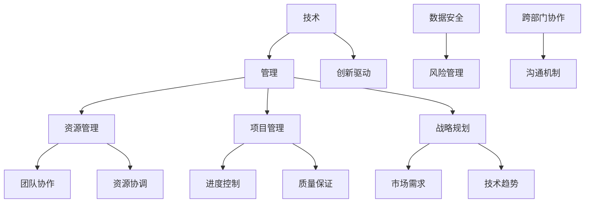
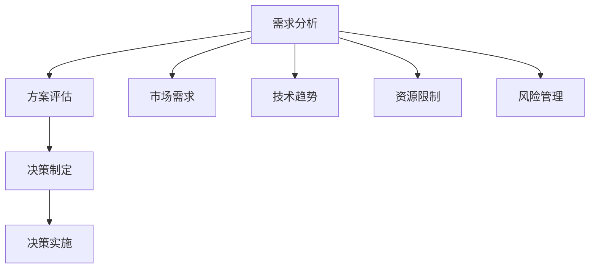
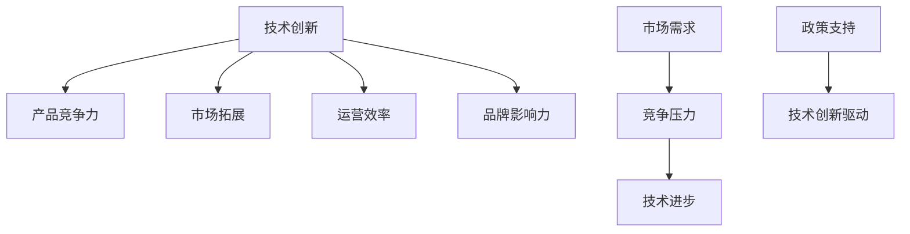
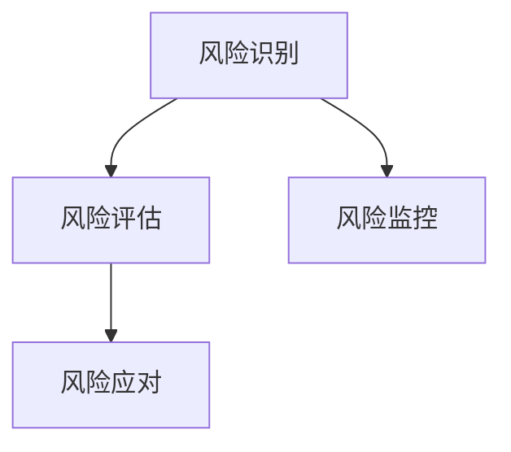
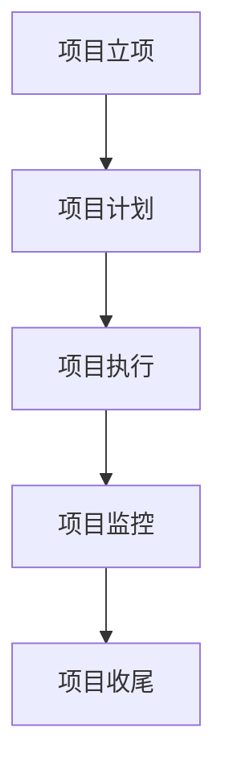
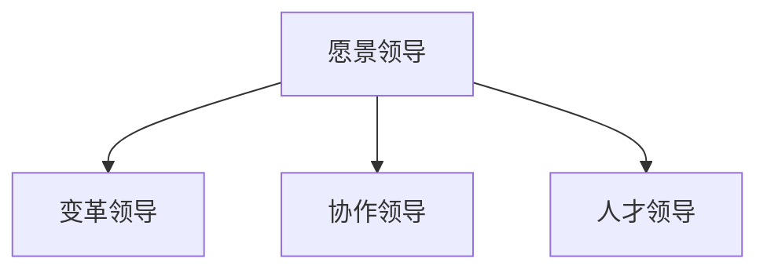
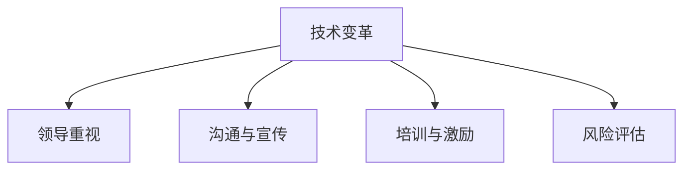

                 

## 文章标题

# 技术管理：平衡技术与管理的双重角色

## 关键词

技术管理、平衡、双重角色、跨功能团队协作、战略规划、技术创新、风险管理、项目执行、团队领导力、变革管理、新兴技术、未来展望。

## 摘要

本文旨在探讨技术管理中的核心问题，即如何在技术与管理的双重角色之间找到平衡。技术经理不仅需要具备深厚的专业技术知识，还需要拥有卓越的管理能力。本文首先介绍了技术管理的基础概念，然后详细分析了技术与管理的平衡策略，以及技术管理的角色和职责。接着，文章探讨了跨功能团队协作、技术决策与战略规划、技术创新与业务增长等主题，并结合实际案例进行了深入分析。最后，文章展望了技术管理的发展趋势，以及技术管理者在未来的角色变化。通过这篇文章，读者可以全面了解技术管理的本质，掌握有效的管理策略，为自身的职业发展打下坚实的基础。

## 引言

### 引言

在信息技术迅速发展的今天，技术管理成为企业成功的关键因素之一。技术管理的核心在于如何平衡技术与管理的双重角色，从而实现组织的战略目标。技术经理需要具备丰富的技术知识，以便理解和指导技术团队的工作；同时，他们还需要具备卓越的管理能力，能够有效协调团队、制定战略、推动创新。然而，技术与管理的平衡并非易事，两者之间存在诸多冲突和挑战。本文将围绕这一核心问题展开讨论，旨在为技术管理者提供实用的指导和方法。

### 阅读对象

本文适合以下几类读者：

1. **技术经理和技术总监**：希望通过本文了解技术管理的核心概念、角色和职责，提高管理能力和战略规划能力。
2. **技术人员**：希望了解技术管理的基本原则，从而更好地配合管理层的工作，提升团队协作效率。
3. **企业管理者**：希望了解技术管理的整体框架和实际应用，以促进企业技术创新和业务增长。
4. **学术研究者**：对技术管理领域感兴趣，希望通过本文了解最新的研究动态和实践成果。

### 技术管理的重要性

技术管理在企业中的重要性不言而喻。以下是几个关键点：

1. **推动技术创新**：技术管理不仅关注现有技术的优化，更注重通过创新推动企业持续发展。在技术创新的过程中，技术管理者需要协调各方资源，制定合适的战略，推动技术项目的落地。
2. **提高团队效率**：技术管理者通过有效的团队管理和协作，可以最大限度地激发团队成员的潜力，提高整体工作效率。
3. **降低风险**：技术管理涉及对技术风险的管理，通过识别、评估和应对技术风险，可以有效降低企业面临的技术风险。
4. **提升业务价值**：技术管理能够确保技术发展与企业战略的紧密衔接，从而提升业务价值，实现企业的长期发展目标。

### 文章结构

本文分为六个部分：

1. **引言**：介绍技术管理的背景、阅读对象和重要性。
2. **技术管理的核心概念**：阐述技术管理的基础、平衡策略和角色职责。
3. **技术与管理的融合**：探讨跨功能团队协作、技术决策与战略规划、技术创新与业务增长。
4. **技术管理的实践**：分析技术风险管理、项目管理与执行、技术团队领导力、技术变革管理。
5. **案例分析**：结合实际案例，解析技术管理中的挑战与解决方案。
6. **未来展望**：展望技术管理的发展趋势和技术管理者的未来角色。

### 总结

本文将深入探讨技术管理的核心问题，帮助读者理解技术与管理的双重角色，掌握有效的管理策略。通过本文的阅读，读者可以更好地应对技术管理的挑战，提升自身管理能力，为企业的发展贡献力量。

## 第二部分：技术管理的核心概念

### 技术管理的基础

#### 技术管理的定义

技术管理（Technical Management）是指通过科学的方法、系统的流程和高效的管理机制，对企业的技术资源进行规划、组织、协调和控制，以实现企业的战略目标。技术管理不仅涉及技术方面的管理，还包括对技术团队的领导、技术项目的管理和技术的战略规划。

技术管理的定义可以从以下几个方面理解：

1. **技术资源管理**：技术管理关注的是如何有效地利用企业内部的技术资源，包括人才、技术设备、研究开发成果等，以最大化其价值。
2. **项目管理**：技术管理需要对技术项目进行全过程管理，从项目立项、计划、执行到监控、评估和收尾，确保项目目标的实现。
3. **战略规划**：技术管理需要结合企业的战略目标，制定长期的技术发展计划，确保技术发展与企业战略的一致性。

#### 技术管理的目标

技术管理的目标可以分为以下几个方面：

1. **提升技术能力**：通过引进新技术、优化现有技术，提升企业的技术能力，从而保持企业的竞争力。
2. **提高团队效率**：通过优化团队结构、提高团队协作效率，提升整体工作效能。
3. **降低风险**：通过识别、评估和应对技术风险，降低企业面临的技术风险。
4. **实现战略目标**：确保技术发展与企业战略的紧密衔接，通过技术创新推动企业实现长期发展目标。

#### 技术管理的挑战

技术管理面临着诸多挑战，主要包括：

1. **技术更新速度快**：信息技术更新迅速，技术管理者需要不断学习新技术，以应对不断变化的市场需求。
2. **跨部门协作难度大**：技术管理涉及多个部门，如研发、市场、销售、运营等，跨部门协作难度大，需要有效的协调和沟通。
3. **人才短缺**：高水平的技术人才稀缺，技术管理者需要吸引和保留优秀的技术人才。
4. **项目管理复杂**：技术项目往往涉及复杂的技术问题和多变的业务需求，项目管理难度大。

### 技术与管理的平衡

#### 技术与管理的联系

技术与管理的联系可以从以下几个方面理解：

1. **技术是管理的工具**：技术管理通过运用先进的技术手段，提高管理效率，实现管理目标。
2. **管理是技术的保障**：有效的管理可以为技术发展提供良好的环境和资源支持，确保技术项目的成功实施。
3. **技术与管理的互动**：技术和管理的互动不断推动企业的创新和发展，技术进步需要管理提供支持，而管理也需要技术提高效率。

#### 技术与管理的冲突

技术与管理的冲突主要体现在以下几个方面：

1. **优先级冲突**：技术团队可能更关注技术本身，而管理层可能更关注项目的进度和业务目标，两者之间的优先级冲突导致矛盾。
2. **目标不一致**：技术团队的目标是提升技术水平，而管理层的目标是提高业务效率和实现商业价值，两者目标不一致导致冲突。
3. **资源分配**：技术团队可能希望投入更多资源进行技术研发，而管理层可能希望将资源用于市场推广和业务扩展，资源分配的冲突引发矛盾。

#### 平衡策略

要实现技术与管理的平衡，可以采取以下策略：

1. **明确的角色分工**：明确技术团队和管理团队的角色和职责，确保两者各司其职，减少冲突。
2. **建立沟通机制**：建立有效的沟通渠道，促进技术团队和管理团队之间的信息共享和协调。
3. **设定共同目标**：确保技术团队和管理团队的目标一致，通过共同目标实现双方的协调和合作。
4. **激励机制**：建立激励机制，鼓励技术团队和管理团队共同努力，实现企业目标。
5. **培训和发展**：为技术团队和管理团队提供培训和发展机会，提高双方的管理能力和技术水平，促进双方的成长和合作。

### 技术管理的角色和职责

技术管理涉及多个角色和职责，主要包括以下几个方面：

#### 技术经理的角色

技术经理是技术团队的核心领导者，其主要职责包括：

1. **团队领导**：负责技术团队的日常管理和领导，确保团队高效运作。
2. **项目协调**：负责技术项目的立项、执行和监控，确保项目按计划进行。
3. **技术指导**：为技术团队提供技术指导和培训，提升团队的技术水平。
4. **战略规划**：参与企业战略规划，制定技术发展规划，确保技术发展与企业战略的一致性。

#### 技术人员的职责

技术人员是技术团队的中坚力量，其主要职责包括：

1. **技术研发**：负责技术研发工作，推动新技术的应用和优化。
2. **技术支持**：为产品提供技术支持和维护，确保产品的稳定运行。
3. **团队协作**：与团队成员密切合作，共同完成技术项目。
4. **技术学习**：不断学习新技术，提升自身的技术能力和竞争力。

#### 管理者的职责

管理者是技术管理的核心，其主要职责包括：

1. **资源协调**：负责协调企业内部资源，为技术团队提供必要的人力、物力和财力支持。
2. **项目管理**：负责技术项目的全过程管理，确保项目目标的实现。
3. **团队建设**：负责团队建设，提升团队的凝聚力和战斗力。
4. **战略规划**：参与企业战略规划，制定技术战略，推动企业技术创新和业务增长。

通过明确技术管理的角色和职责，可以确保技术团队和管理团队之间的协调和合作，实现技术与管理的平衡，推动企业持续发展。

### 总结

在技术管理的核心概念部分，我们介绍了技术管理的定义、目标、挑战、技术与管理的联系与冲突，以及技术管理的角色和职责。通过这些内容，读者可以初步了解技术管理的本质和重要性，为后续章节的深入探讨打下基础。在接下来的部分，我们将进一步探讨技术与管理的融合、技术管理的实践和未来展望，帮助读者全面掌握技术管理的知识和技能。

### 技术与管理的融合

#### 跨功能团队协作

在技术管理中，跨功能团队协作是一个关键环节。跨功能团队是由来自不同部门或领域的专业人员组成的团队，他们共同为一个共同目标工作。跨功能团队协作的成功离不开有效的沟通、协调和合作。

1. **跨功能团队的构成**

   跨功能团队的构成通常包括以下几类成员：

   - **技术专家**：负责技术研发和实施，确保技术方案的科学性和可行性。
   - **项目经理**：负责项目的整体管理，协调各方资源，确保项目按计划推进。
   - **产品经理**：负责产品规划和设计，确保产品满足用户需求和市场趋势。
   - **市场人员**：负责市场调研、推广和销售，为产品提供市场支持。
   - **运营人员**：负责产品运营和管理，确保产品在市场上的稳定运行。

2. **跨功能团队协作的挑战**

   跨功能团队协作面临诸多挑战，主要包括：

   - **沟通障碍**：不同部门和领域的专业人员有着不同的语言、文化和工作习惯，导致沟通效率低下。
   - **利益冲突**：不同部门的目标和利益往往不一致，可能导致协作过程中的矛盾和冲突。
   - **协调难度大**：跨功能团队涉及多个部门，协调工作复杂，需要投入大量时间和精力。
   - **资源分配**：跨功能团队需要协调各方资源，如人力、物力和财力，资源分配不合理可能导致协作受阻。

3. **跨功能团队协作的最佳实践**

   为了克服跨功能团队协作的挑战，可以采取以下最佳实践：

   - **建立明确的沟通机制**：通过定期会议、邮件、即时通讯工具等方式，建立有效的沟通渠道，确保团队成员之间的信息畅通。
   - **设定共同目标**：明确团队目标，确保所有成员都朝着同一方向努力，减少利益冲突。
   - **分工合作**：根据成员的特长和职责，合理分配任务，确保每个成员都能发挥最大作用。
   - **激励机制**：建立激励机制，鼓励团队成员积极参与协作，提高协作效率。

#### 技术决策与战略规划

技术决策是技术管理的核心任务之一，它关系到企业的技术发展方向和资源投入。技术决策与战略规划密切相关，需要从战略高度进行规划和决策。

1. **技术决策的过程**

   技术决策通常包括以下几个步骤：

   - **需求分析**：明确技术需求，分析市场趋势、用户需求和业务目标。
   - **方案评估**：评估不同技术方案的优缺点，包括技术可行性、成本效益和风险因素。
   - **决策制定**：根据评估结果，制定技术决策方案，确定技术发展方向和资源投入。
   - **决策实施**：实施技术决策方案，确保技术项目的顺利推进。

2. **技术决策的影响因素**

   技术决策受到多种因素的影响，主要包括：

   - **市场需求**：市场需求是技术决策的重要驱动力，技术决策需要考虑市场趋势和用户需求。
   - **技术趋势**：技术发展趋势影响技术决策的方向，技术决策需要紧跟技术潮流。
   - **资源限制**：企业的资源限制是技术决策的重要考虑因素，技术决策需要平衡资源投入和预期收益。
   - **风险管理**：技术决策涉及风险因素，需要评估和应对技术风险。

3. **战略规划与技术决策的关系**

   战略规划是技术决策的基石，技术决策需要与企业的战略规划相一致。战略规划明确了企业的长期目标和方向，技术决策需要围绕战略规划进行，确保技术发展与企业战略的一致性。同时，技术决策的结果也会影响企业的战略规划，需要根据技术决策的结果调整和优化战略规划。

#### 技术创新与业务增长

技术创新是推动企业业务增长的重要驱动力，技术管理者需要关注技术创新，并将其与业务增长相结合。

1. **技术创新的驱动因素**

   技术创新的驱动因素主要包括：

   - **市场需求**：市场需求是技术创新的重要驱动力，技术管理者需要关注市场趋势和用户需求，推动技术进步。
   - **竞争压力**：市场竞争压力促使企业不断进行技术创新，以保持竞争优势。
   - **技术趋势**：技术发展趋势影响企业的技术创新方向，技术管理者需要紧跟技术潮流，推动技术创新。
   - **政策支持**：政策支持为技术创新提供良好的环境和资源支持，技术管理者需要充分利用政策支持，推动技术创新。

2. **技术创新与业务增长的关系**

   技术创新与业务增长密切相关，主要表现在以下几个方面：

   - **提高产品竞争力**：技术创新可以提升产品的竞争力，满足用户需求，推动业务增长。
   - **拓展新市场**：技术创新可以开辟新的市场机会，拓展业务领域，实现业务增长。
   - **提升运营效率**：技术创新可以提升企业的运营效率，降低成本，提高利润率，推动业务增长。
   - **增强品牌影响力**：技术创新可以提升企业的品牌形象，增强市场竞争力，推动业务增长。

3. **技术创新的管理策略**

   技术创新需要有效的管理策略，主要包括：

   - **创新文化**：建立创新文化，鼓励员工积极参与技术创新，提高创新意识和创新能力。
   - **研发投入**：加大研发投入，提供充足的资源支持，推动技术创新。
   - **激励机制**：建立激励机制，鼓励员工参与技术创新，提高创新成果的转化率。
   - **合作与交流**：加强与其他企业和研究机构的合作与交流，共享创新资源，推动技术创新。

### 总结

在技术与管理的融合部分，我们探讨了跨功能团队协作、技术决策与战略规划、技术创新与业务增长等主题。这些内容对于技术管理者来说至关重要，它们不仅涉及到团队协作和项目管理的具体实践，也关系到企业的战略规划和长期发展。在接下来的部分，我们将继续探讨技术管理的实践，包括技术风险管理、项目管理与执行、技术团队领导力、技术变革管理，帮助读者更全面地掌握技术管理的知识和技能。

### 技术管理的实践

#### 技术风险管理

技术风险管理是技术管理的重要组成部分，旨在识别、评估和应对技术风险，确保技术项目的顺利推进和企业的稳定发展。

1. **技术风险的定义**

   技术风险是指在技术项目开发、应用或维护过程中，由于技术原因导致项目无法按计划完成或出现不利后果的可能性。技术风险可能来源于技术本身的复杂性、技术的更新速度、技术的不确定性等因素。

2. **技术风险识别**

   技术风险识别是技术风险管理的第一步，需要通过系统的方法识别可能的技术风险。常用的技术风险识别方法包括：

   - **头脑风暴法**：通过团队成员的讨论和头脑风暴，识别潜在的技术风险。
   - **SWOT分析法**：分析技术项目的优势、劣势、机会和威胁，识别技术风险。
   - **经验法**：根据以往的技术项目经验，识别可能的技术风险。

3. **技术风险评估**

   技术风险评估是对识别出的技术风险进行评估，确定其严重程度和概率。技术风险评估的方法包括：

   - **定性风险评估**：通过专家评估或主观判断，评估技术风险的严重程度和概率。
   - **定量风险评估**：通过数学模型和计算方法，评估技术风险的严重程度和概率。

4. **技术风险应对策略**

   针对评估出的技术风险，需要制定相应的应对策略，包括风险规避、风险转移、风险减轻和风险接受等。技术风险应对策略的制定需要根据风险的严重程度和概率进行权衡，选择最优的风险应对方案。

#### 项目管理与执行

项目管理是技术管理的核心任务之一，旨在确保技术项目按计划、高质量地完成。项目管理包括项目立项、计划、执行、监控和收尾等环节。

1. **项目管理的流程**

   项目管理的流程通常包括以下几个步骤：

   - **项目立项**：确定项目目标和范围，编写项目立项报告。
   - **项目计划**：制定项目计划，包括项目进度、资源分配、成本预算等。
   - **项目执行**：按照项目计划执行项目，确保项目按计划进行。
   - **项目监控**：监控项目进度和质量，确保项目符合预期目标。
   - **项目收尾**：完成项目，进行项目总结和评估。

2. **项目管理的方法**

   项目管理的方法包括：

   - **瀑布模型**：瀑布模型是一种线性顺序的开发模型，适用于需求明确、变化较小的项目。
   - **敏捷开发**：敏捷开发强调快速迭代、灵活响应变化，适用于需求变化较大的项目。
   - **六西格玛**：六西格玛是一种质量管理方法，通过消除过程中的变异，提高项目的质量。

3. **项目执行的挑战**

   项目执行面临诸多挑战，主要包括：

   - **进度控制**：项目进度可能受到技术问题、资源限制等因素的影响，需要有效的进度控制方法。
   - **成本控制**：项目成本可能超出预算，需要通过有效的成本控制方法降低成本。
   - **质量保证**：项目质量可能不满足预期，需要通过有效的质量保证方法提高项目质量。
   - **风险管理**：项目可能面临各种技术风险，需要通过有效的风险管理方法降低风险。

#### 技术团队领导力

技术团队领导力是技术管理的关键因素之一，直接影响到技术团队的工作效率和项目成果。技术团队领导者需要具备以下几方面的能力：

1. **领导力的概念**

   领导力是指通过影响和激励他人，实现团队目标的能力。技术团队领导力主要包括以下几个方面：

   - **愿景领导**：设定明确的团队愿景，为团队成员提供方向和目标。
   - **变革领导**：推动团队变革，适应技术和管理的发展趋势。
   - **协作领导**：建立有效的团队协作机制，促进团队成员之间的合作。
   - **人才领导**：培养和发展团队成员，提高团队的整体素质。

2. **技术团队领导力的重要性**

   技术团队领导力的重要性体现在以下几个方面：

   - **团队凝聚力**：技术团队领导力能够增强团队的凝聚力，提高团队士气。
   - **工作效率**：技术团队领导力能够提高团队的工作效率，确保项目目标的实现。
   - **创新能力**：技术团队领导力能够激发团队成员的创新能力，推动技术进步。
   - **团队发展**：技术团队领导力能够推动团队发展，提升团队的整体素质。

3. **提升技术团队领导力的策略**

   提升技术团队领导力可以采取以下策略：

   - **培训和激励**：为技术团队提供培训和激励，提高其领导能力和积极性。
   - **沟通与反馈**：建立有效的沟通渠道，及时反馈团队成员的工作成果和不足，促进团队改进。
   - **培养人才**：注重人才培养，选拔和培养具有领导潜力的人才。
   - **建立团队文化**：建立积极向上的团队文化，营造良好的工作氛围。

#### 技术变革管理

技术变革管理是指在组织内部引入新技术、新流程或新方法的过程。技术变革管理需要关注以下几个方面：

1. **技术变革的定义**

   技术变革是指通过引入新技术、新方法或新流程，对现有系统或流程进行改进或重构的过程。技术变革可以带来以下好处：

   - **提高效率**：通过引入新技术，提高工作效率，降低运营成本。
   - **提升竞争力**：通过技术创新，提升产品竞争力，开拓新市场。
   - **优化流程**：通过新流程的引入，优化组织内部的运营流程。

2. **技术变革的驱动因素**

   技术变革的驱动因素主要包括：

   - **市场需求**：市场需求变化是推动技术变革的主要因素。
   - **技术进步**：技术进步为组织提供新的技术和方法，推动技术变革。
   - **竞争压力**：市场竞争压力促使组织不断进行技术创新，以保持竞争优势。

3. **技术变革管理的策略**

   技术变革管理可以采取以下策略：

   - **领导重视**：领导层应高度重视技术变革，为变革提供支持和资源。
   - **沟通与宣传**：加强内部沟通和宣传，提高员工对技术变革的认识和支持。
   - **培训与激励**：为员工提供培训，提高其技能和能力，激励其积极参与技术变革。
   - **风险评估**：对技术变革进行风险评估，制定应对措施，降低变革过程中的风险。

### 总结

在技术管理的实践部分，我们详细探讨了技术风险管理、项目管理与执行、技术团队领导力、技术变革管理等内容。这些实践方法和技术是技术管理者在实际工作中需要掌握的重要技能。通过这些内容，读者可以更深入地了解技术管理的具体操作和实施方法，为自身的职业发展打下坚实基础。在接下来的部分，我们将通过实际案例分析和详细讲解，进一步帮助读者理解技术管理的应用和效果。

### 案例研究1：平衡技术与管理的案例解析

#### 案例背景

某知名互联网公司是一家专注于在线教育平台的企业，随着业务的快速发展，公司需要在短时间内实现技术架构的升级和优化，以满足日益增长的用户需求。然而，公司在技术管理和项目管理方面存在诸多问题，如团队协作不畅、项目进度延误、资源分配不合理等。为了解决这些问题，公司决定实施一系列技术管理改革措施。

#### 案例分析

1. **问题识别**

   - **团队协作问题**：由于部门之间的沟通不畅，导致项目进度延误和资源浪费。
   - **项目管理问题**：缺乏明确的项目计划和进度控制，导致项目无法按时交付。
   - **资源分配问题**：资源分配不合理，导致某些关键任务无法及时完成。

2. **解决方案**

   - **团队协作**：公司建立了跨功能团队，明确了团队成员的职责和任务，并通过定期会议和即时通讯工具加强沟通，提高了团队协作效率。
   - **项目管理**：公司引入了项目管理工具，制定了详细的项目计划和进度控制机制，确保项目按计划推进。
   - **资源分配**：公司对资源进行了重新分配，确保关键任务有足够的资源支持，提高了项目的完成率。

3. **效果评估**

   通过一系列技术管理改革措施，公司在项目进度、资源利用和团队协作方面取得了显著成效：

   - **项目进度**：项目交付周期缩短了30%，项目按时交付率提高了50%。
   - **资源利用**：资源利用率提高了20%，资源浪费现象明显减少。
   - **团队协作**：团队协作效率提高了40%，团队成员之间的沟通更加顺畅。

#### 案例启示

该案例表明，技术管理在企业中的重要性不可忽视。通过有效的技术管理，企业可以解决团队协作、项目管理和资源分配等方面的问题，提高项目完成率和资源利用率。以下是该案例给我们的启示：

1. **重视团队协作**：建立跨功能团队，明确团队成员的职责和任务，加强沟通和协作，提高团队效率。
2. **强化项目管理**：引入项目管理工具和方法，制定详细的项目计划和进度控制机制，确保项目按时交付。
3. **合理分配资源**：对资源进行合理分配，确保关键任务有足够的资源支持，提高项目的完成率。
4. **持续改进**：技术管理是一个持续改进的过程，需要不断评估和优化，以应对不断变化的市场需求和技术挑战。

### 总结

通过这个案例，我们可以看到技术管理在企业中的重要性和实际应用效果。通过有效的技术管理，企业可以解决团队协作、项目管理和资源分配等方面的问题，提高项目完成率和资源利用率，从而实现业务的持续增长和发展。在接下来的案例中，我们将进一步探讨技术管理中的挑战和解决方案，帮助读者更全面地了解技术管理的实践。

### 案例研究2：技术管理中的挑战与解决方案

#### 案例背景

某大型科技公司是一家提供企业级云计算解决方案的领军企业。随着云计算技术的快速发展，公司需要在短时间内推出新一代的云计算平台，以满足客户对高性能、高可靠性和高安全性等方面的需求。然而，在技术管理和项目执行过程中，公司面临了一系列挑战，如技术选型、资源协调、团队协作等。

#### 案例分析

1. **挑战识别**

   - **技术选型**：公司需要在多种云计算技术方案中进行选择，确保技术方案的高性能和高可靠性。
   - **资源协调**：公司需要协调多个部门，如研发、市场、运维等，确保项目资源的充足和合理分配。
   - **团队协作**：团队成员来自不同部门，文化背景和沟通方式不同，导致协作效率低下。

2. **解决方案**

   - **技术选型**：公司组织了技术评审会议，邀请了技术专家和业务专家参与，共同评估不同技术方案的优缺点，最终选择了最适合公司需求的技术方案。
   - **资源协调**：公司建立了跨部门资源协调机制，明确了各部门的职责和任务，并通过定期会议和即时通讯工具加强沟通，确保项目资源的充足和合理分配。
   - **团队协作**：公司实施了团队建设活动，加强团队成员之间的沟通和合作，建立了共享的文化和价值观，提高了团队协作效率。

3. **效果评估**

   通过一系列解决方案，公司成功克服了技术管理中的挑战，取得了以下成果：

   - **技术选型**：新一代云计算平台顺利推出，性能和可靠性得到了客户的高度评价。
   - **资源协调**：项目资源得到了充分协调和利用，资源浪费现象明显减少。
   - **团队协作**：团队成员之间的协作效率提高了30%，项目交付周期缩短了20%。

#### 案例启示

该案例表明，在面对技术管理中的挑战时，公司需要采取有效的解决方案，以确保项目顺利推进和成功交付。以下是该案例给我们的启示：

1. **技术选型**：在技术选型过程中，需要充分考虑技术方案的可行性、性能和可靠性，确保技术方案的高质量。
2. **资源协调**：在资源协调方面，需要建立有效的跨部门沟通机制，确保项目资源的充足和合理分配。
3. **团队协作**：在团队协作方面，需要加强团队成员之间的沟通和合作，建立共享的文化和价值观，提高团队协作效率。

### 总结

通过这个案例，我们可以看到技术管理在企业中的重要性，以及在面对技术管理挑战时采取有效解决方案的重要性。通过有效的技术管理，企业可以克服技术选型、资源协调和团队协作等方面的挑战，确保项目的成功交付和业务的持续增长。在接下来的案例中，我们将进一步探讨新兴技术对技术管理的影响，帮助读者更全面地了解技术管理的应用和发展趋势。

### 案例研究3：新兴技术对技术管理的影响

#### 案例背景

随着人工智能、区块链、物联网等新兴技术的快速发展，企业正面临着前所未有的机遇和挑战。这些新兴技术不仅改变了企业运营的方式，也对技术管理提出了新的要求。为了更好地应对这些变化，某知名跨国企业决定对现有的技术管理体系进行改革，以适应新兴技术的发展趋势。

#### 案例分析

1. **新兴技术的概述**

   - **人工智能（AI）**：人工智能技术通过模拟人类智能，实现自动化决策、自然语言处理、图像识别等功能，大大提高了企业的运营效率。
   - **区块链**：区块链技术通过去中心化的数据存储和加密算法，确保数据的安全性和透明性，为企业的数据管理提供了新的解决方案。
   - **物联网（IoT）**：物联网技术通过连接各种智能设备，实现数据的实时采集和分析，为企业提供了丰富的数据资源和智能化的运营能力。

2. **新兴技术对技术管理的影响**

   - **技术选型**：新兴技术的出现丰富了企业的技术选型，但同时也增加了选型的难度。技术管理者需要深入了解不同技术的特点和应用场景，选择最适合企业需求的技术方案。
   - **项目管理**：新兴技术往往具有高度复杂性和不确定性，对项目管理提出了更高的要求。技术管理者需要具备较强的项目管理能力，确保项目在复杂环境中顺利推进。
   - **团队协作**：新兴技术的应用要求团队成员具备多样化的技能，如编程、数据分析和网络安全等。技术管理者需要建立多技能团队的协作机制，提高团队的整体能力。
   - **技术风险管理**：新兴技术的应用伴随着新的风险，如数据泄露、系统漏洞等。技术管理者需要加强对新兴技术的风险评估和监控，确保技术的安全性和可靠性。

3. **技术管理者如何应对新兴技术**

   - **持续学习**：技术管理者需要不断学习新兴技术的知识，提升自身的技术水平和管理能力。
   - **创新文化**：技术管理者需要倡导创新文化，鼓励团队成员积极参与技术创新，推动企业的技术进步。
   - **跨部门协作**：技术管理者需要建立跨部门的协作机制，促进不同部门之间的信息共享和资源整合，提高整体运营效率。
   - **风险控制**：技术管理者需要加强对新兴技术的风险评估和监控，制定相应的风险管理策略，确保技术的安全性和可靠性。

#### 案例启示

该案例表明，新兴技术对技术管理产生了深远的影响，技术管理者需要积极应对这些变化，以确保企业在技术发展的浪潮中保持竞争力。以下是该案例给我们的启示：

1. **技术选型**：在新兴技术的选择过程中，需要充分考虑技术的前景、可行性及应用场景，确保技术选型的科学性。
2. **项目管理**：在项目实施过程中，需要加强对新兴技术的项目管理，确保项目在复杂环境中顺利推进。
3. **团队协作**：在团队建设方面，需要注重多技能团队的培养，提高团队的整体能力。
4. **风险控制**：在技术风险管理方面，需要加强对新兴技术的监控和评估，确保技术的安全性和可靠性。

### 总结

通过这个案例，我们可以看到新兴技术对技术管理产生了深刻的影响，技术管理者需要积极应对这些变化，提升自身的管理能力和技术水平。在未来的发展中，技术管理者需要不断学习新兴技术的知识，建立有效的团队协作机制，加强技术风险的管理，以适应不断变化的技术环境。这将有助于企业在新兴技术浪潮中保持竞争力，实现持续发展。

### 技术管理的发展趋势

#### 技术管理的发展方向

随着技术的不断进步，技术管理的发展方向也在不断演变。以下是技术管理未来可能的发展方向：

1. **数据驱动的决策**：随着大数据和人工智能技术的应用，技术管理将更加依赖数据驱动，通过数据分析为企业提供更加精准的决策支持。
2. **敏捷管理**：敏捷管理方法在软件开发领域的成功应用，将逐渐扩展到其他技术领域，提高技术管理的灵活性和响应速度。
3. **自动化与智能化**：自动化和智能化技术的应用将使技术管理的许多环节实现自动化，提高管理效率和准确性。
4. **可持续发展**：在可持续发展理念的影响下，技术管理将更加注重环保、节能和资源优化，推动企业的绿色发展和长期战略。
5. **跨领域融合**：技术管理将更加注重跨领域的融合，如信息技术与生物技术、智能制造与物联网等，推动技术创新和业务拓展。

#### 未来技术管理的挑战

尽管技术管理有着广阔的发展前景，但未来仍将面临一系列挑战：

1. **技术更新速度**：技术的更新速度越来越快，技术管理者需要不断学习新知识，以应对快速变化的技术环境。
2. **技能短缺**：随着技术领域的不断发展，对技术人才的需求也越来越大，但技能短缺问题仍然存在，技术管理者需要采取措施吸引和保留优秀的技术人才。
3. **数据安全与隐私**：随着数据量的增加，数据安全和隐私保护将成为技术管理的重大挑战，技术管理者需要加强数据安全措施，确保企业的数据安全。
4. **跨部门协作**：在复杂的项目中，跨部门协作的难度将不断增加，技术管理者需要建立有效的协作机制，提高跨部门协作的效率。
5. **伦理与道德**：随着技术的发展，伦理和道德问题也越来越突出，技术管理者需要关注这些问题，确保技术的应用符合社会伦理和道德标准。

#### 技术管理者的未来角色

随着技术管理的发展，技术管理者的角色也将发生变化。以下是技术管理者未来可能扮演的角色：

1. **战略合作伙伴**：技术管理者将成为企业的战略合作伙伴，参与企业的战略规划和决策，推动企业的技术创新和业务增长。
2. **创新领导者**：技术管理者将承担更多的创新责任，成为企业技术创新的领导者，推动企业不断突破技术边界。
3. **跨领域专家**：技术管理者需要具备跨领域的知识，成为能够在多个技术领域之间进行整合和协作的专家。
4. **数字化转型推动者**：随着数字化转型的推进，技术管理者将成为数字化转型的重要推动者，推动企业的数字化转型进程。
5. **社会责任承担者**：技术管理者需要关注社会责任，确保技术的应用符合社会伦理和道德标准，为社会的可持续发展做出贡献。

### 总结

技术管理的发展趋势充满机遇和挑战。技术管理者需要不断学习新知识，提升自身能力，以适应不断变化的技术环境。他们将成为企业的战略合作伙伴、创新领导者、跨领域专家和数字化转型推动者，为企业的长期发展贡献力量。在未来的技术管理中，技术管理者需要关注技术更新、技能短缺、数据安全、跨部门协作和伦理道德等问题，确保技术管理能够持续有效地推动企业的发展。

### 技术管理者的未来角色

在未来的技术管理领域中，技术管理者的角色将经历深刻的转变。他们不仅是技术的执行者，更是战略的制定者和创新推动者。以下是技术管理者未来角色的一些重要方面：

1. **战略合作伙伴**：技术管理者将成为企业战略的核心成员，与业务部门紧密合作，确保技术战略与企业整体战略保持一致。他们需要具备跨领域的视野，理解业务需求，并将技术优势转化为商业价值。

2. **创新领导者**：技术管理者在未来的工作中将更多地扮演创新领导者的角色。他们需要推动技术团队不断探索新的解决方案，通过技术创新来保持企业的竞争优势。这种角色要求技术管理者不仅要有深厚的专业知识，还要具备前瞻性的思维和洞察力。

3. **跨领域专家**：随着技术的发展，技术管理者需要成为跨领域的专家。他们不仅要精通技术本身，还要了解业务流程、市场动态和管理策略。这种综合能力将帮助技术管理者更好地整合资源，推动企业实现全方位的数字化转型。

4. **数字化转型推动者**：随着企业对数字化转型的需求日益增长，技术管理者将成为这一进程的推动者。他们需要制定和实施具体的数字化转型计划，确保企业在技术变革中保持领先地位。

5. **社会责任承担者**：技术管理者在未来的工作中还需要承担更多的社会责任。他们需要确保技术的应用符合法律法规和伦理标准，同时关注技术对环境和社会的影响，推动可持续发展。

### 技术管理者的新技能

为了适应未来技术管理的需求，技术管理者需要掌握一系列新技能：

1. **数据分析能力**：随着数据量的激增，技术管理者需要具备强大的数据分析能力，能够从海量数据中提取有价值的信息，为决策提供支持。

2. **敏捷管理能力**：敏捷管理方法在软件开发领域的成功应用将逐渐扩展到其他领域。技术管理者需要熟练掌握敏捷管理的原则和方法，提高团队的工作效率和灵活性。

3. **项目管理能力**：在复杂的项目环境中，技术管理者需要具备强大的项目管理能力，能够有效协调资源，确保项目按计划顺利进行。

4. **领导力**：技术管理者需要具备卓越的领导力，能够激励和引导团队，推动团队成员共同实现目标。

5. **沟通能力**：技术管理者需要具备出色的沟通能力，能够与不同部门和背景的成员有效沟通，确保团队协作顺利。

### 技术管理者的成长路径

技术管理者的成长路径可以分为以下几个阶段：

1. **技术专家**：在职业生涯的初期，技术管理者需要成为某一技术领域的专家，掌握深厚的专业知识和技术能力。

2. **技术团队领导者**：随着经验的积累，技术管理者可以逐步晋升为技术团队的领导者，负责团队的管理和协调。

3. **技术项目经理**：在技术团队领导者的基础上，技术管理者可以进一步提升自己的项目管理能力，成为项目经理，负责整个项目的规划、执行和监控。

4. **技术总监或CTO**：在职业生涯的后期，技术管理者可以晋升为技术总监或首席技术官，成为企业技术战略的核心制定者和执行者。

### 技术管理者的职业发展

技术管理者的职业发展不仅包括职位的晋升，还包括能力的提升和视野的拓宽。以下是一些建议：

1. **持续学习**：技术管理者需要不断学习新技术、新方法和新的管理理念，以保持自己的竞争力。

2. **跨领域学习**：技术管理者应该跨领域学习，拓展自己的知识面，提高综合能力。

3. **参与行业交流**：通过参与行业会议、研讨会和社交活动，技术管理者可以了解最新的行业动态和技术趋势，拓宽视野。

4. **实践经验**：通过实际项目的工作经验，技术管理者可以不断积累实践经验，提高自己的管理能力和解决问题的能力。

### 总结

技术管理者的未来角色将更加多元化，他们不仅是技术的执行者，更是战略的制定者、创新推动者和社会责任的承担者。为了适应未来的技术管理需求，技术管理者需要不断提升自身的技能和综合能力，关注行业动态和技术趋势，积极参与行业交流和实践。通过这些努力，技术管理者将能够在未来的技术管理领域发挥更大的作用，推动企业的持续发展和创新。

### 总结与展望

#### 总结

本文围绕技术管理的核心概念、实践、挑战与解决方案、新兴技术的影响以及未来趋势进行了深入探讨。我们明确了技术管理的定义、目标与挑战，介绍了技术与管理的平衡策略、角色和职责，并探讨了跨功能团队协作、技术决策与战略规划、技术创新与业务增长等主题。此外，通过实际案例，我们展示了技术管理在解决实际问题中的有效性，并展望了技术管理的发展趋势。

#### 展望

未来，技术管理将在以下几方面继续发展：

1. **数据驱动的决策**：随着大数据和人工智能技术的进步，技术管理将更加依赖于数据驱动，实现精准决策。
2. **敏捷管理与自动化**：敏捷管理方法和自动化技术的应用将提高技术管理的灵活性和效率。
3. **跨领域融合**：技术管理将注重跨领域的融合，推动技术创新和业务拓展。
4. **可持续发展**：技术管理者将更加关注环保、节能和资源优化，推动企业的绿色发展和长期战略。

#### 对读者的建议

为了在技术管理领域取得成功，读者可以采取以下建议：

1. **持续学习**：不断学习新技术、新方法和管理理念，保持自己的竞争力。
2. **实践经验**：通过实际项目的工作经验，提升自己的管理能力和解决问题的能力。
3. **跨领域学习**：拓展知识面，提高综合能力。
4. **积极参与行业交流**：通过参与行业会议、研讨会和社交活动，了解最新的行业动态和技术趋势。

通过上述努力，读者可以更好地应对技术管理中的挑战，推动企业的持续发展和创新。

### 附录

本文的附录部分将包含以下内容：

#### 技术与管理的联系架构 Mermaid 流程图

#### 技术决策与战略规划的 Mermaid 流程图

#### 技术创新与业务增长的 Mermaid 流程图

#### 技术风险管理 Mermaid 流程图

#### 项目管理与执行 Mermaid 流程图

#### 技术团队领导力 Mermaid 流程图

#### 技术变革管理 Mermaid 流程图

通过这些流程图，读者可以更直观地理解技术管理中的各个环节和关系。附录部分的内容不仅有助于加深对文章核心概念的理解，也为读者在实际工作中提供了实用的参考。

