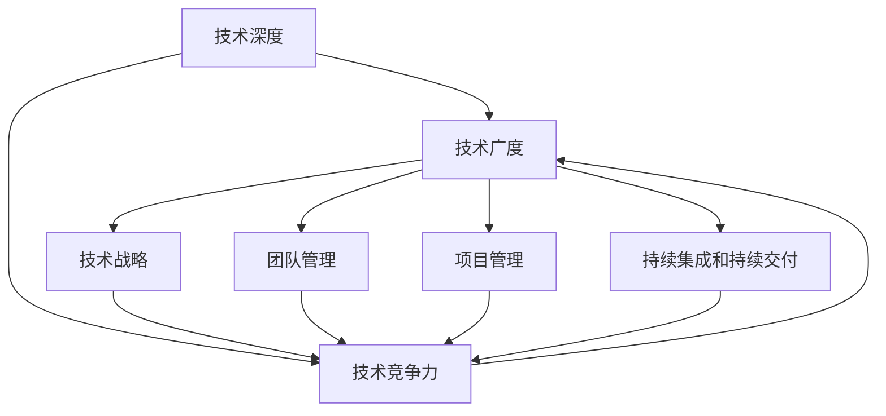

                 

### 文章标题

《技术管理：平衡技术深度和管理广度》

### 关键词

技术管理、深度发展、广度拓展、团队管理、项目管理、领导力发展、风险管理

### 摘要

本文旨在探讨技术管理的核心问题——如何在技术深度和管理广度之间找到平衡。随着技术的迅猛发展，技术管理人员不仅需要深入理解技术细节，还需具备宏观的管理能力。本文将详细分析技术管理的基本概念、深度发展策略、广度拓展方法，以及领导力发展和风险管理等关键领域，旨在为技术管理人员提供实用的指导，帮助他们在技术深度和管理广度之间实现有效平衡。

## 背景介绍

### 技术管理的兴起

技术管理作为一个独立的领域，起源于20世纪末。随着信息技术的飞速发展，企业对技术管理的需求日益增加。技术管理不仅涉及技术本身，还涵盖了团队管理、项目管理、风险管理等多个方面。它旨在通过科学的管理方法和工具，提高企业的技术竞争力。

### 技术深度与广度的定义

技术深度指的是对某一具体技术领域的深入理解，包括算法、架构、原理等。技术广度则是指对多个技术领域的了解和掌握，具备跨领域的视野和能力。技术深度和广度在技术管理中起着至关重要的作用。深度能够帮助技术人员解决具体问题，而广度则能使管理者从全局角度进行决策，提高整体效能。

### 技术深度与广度的关系

技术深度和广度并不是相互独立的，而是相互促进的。技术深度能够为广度提供坚实的基础，而广度则能够为深度提供更广阔的视野和更多的可能性。在技术管理中，平衡技术深度和管理广度是一个关键挑战。

### 技术管理的核心职责

技术管理的核心职责包括技术战略规划、团队管理、项目管理、持续集成和持续交付等。这些职责共同构成了技术管理的基本框架，为企业的技术发展提供了有力保障。

## 核心概念与联系

### 技术深度

技术深度指的是对某一具体技术领域的深入理解，包括算法、架构、原理等。技术深度是技术管理的基础，它使技术人员能够深入分析问题、提出解决方案，并确保技术的稳定性和可靠性。

### 技术广度

技术广度则是指对多个技术领域的了解和掌握，具备跨领域的视野和能力。技术广度使技术管理人员能够从全局角度进行决策，提高整体效能，并能够灵活应对复杂多变的技术环境。

### 技术深度与广度的关系

技术深度和广度是相互关联的。技术深度为技术广度提供了坚实的基础，而技术广度则为技术深度提供了更广阔的视野和更多的可能性。在技术管理中，平衡技术深度和管理广度是一个关键挑战。

### 关系架构 Mermaid 流程图



在这个流程图中，技术深度和技术广度是技术管理的两个核心支柱，它们共同支撑起技术战略、团队管理、项目管理和持续集成与持续交付等关键领域，最终提升企业的技术竞争力。

## 核心算法原理讲解

### 深度优先搜索算法

伪代码：

```python
def DFS(node):
    if node is not visited:
        mark node as visited
        for each child of node:
            DFS(child)
```

### 广度优先搜索算法

伪代码：

```python
def BFS(node):
    create an empty queue
    mark node as visited
    enqueue node
    while queue is not empty:
        dequeue node
        mark node as visited
        for each unvisited neighbor of node:
            enqueue neighbor
```

这两个算法在技术深度和广度的发展中有着重要的应用。深度优先搜索算法能够帮助技术人员深入理解某一技术领域，而广度优先搜索算法则能够帮助技术管理人员从全局角度进行决策。

### 数学模型和公式

在技术管理中，数学模型和公式广泛应用于各种场景。例如，在项目管理中，可以采用关键路径法（Critical Path Method, CPM）来计算项目的最短完成时间。关键路径法的关键公式是：

$$
\text{CPM} = \sum_{i=1}^{n} (d_i + d_{i+1})
$$

其中，$d_i$ 表示活动 $i$ 的持续时间。

### 详细讲解与举例说明

假设有一个项目，包含5个活动，每个活动的持续时间和紧前关系如下表所示：

| 活动 | 持续时间（天） | 紧前关系 |
| ---- | -------- | ------ |
| A    | 5        | 无     |
| B    | 3        | A      |
| C    | 2        | A      |
| D    | 4        | B, C   |
| E    | 6        | D      |

我们可以使用关键路径法来计算项目的最短完成时间。根据公式，首先计算每个活动的持续时间之和：

$$
\text{CPM} = (5 + 3) + (3 + 2) + (2 + 4) + (4 + 6) = 23
$$

因此，项目的最短完成时间为23天。

## 项目实战

### 开发环境搭建

为了实现上述算法和模型，我们需要搭建一个合适的开发环境。以下是开发环境搭建的步骤：

1. 安装Python环境，确保Python版本大于3.6。
2. 安装必要的库，如numpy、matplotlib等。

### 源代码实现与解读

以下是深度优先搜索和广度优先搜索算法的Python实现：

```python
from collections import deque

def DFS(graph, start):
    visited = set()
    stack = [start]

    while stack:
        node = stack.pop()
        if node not in visited:
            visited.add(node)
            print(node, end=' ')
            for neighbor in graph[node]:
                stack.append(neighbor)

def BFS(graph, start):
    visited = set()
    queue = deque([start])

    while queue:
        node = queue.popleft()
        if node not in visited:
            visited.add(node)
            print(node, end=' ')
            for neighbor in graph[node]:
                queue.append(neighbor)

# 示例图
graph = {
    'A': ['B', 'C'],
    'B': ['D'],
    'C': ['D'],
    'D': ['E']
}

print("DFS: ", end='')
DFS(graph, 'A')
print("\nBFS: ", end='')
BFS(graph, 'A')
```

### 代码应用解读与分析

上述代码实现了深度优先搜索和广度优先搜索算法，并使用一个示例图进行测试。深度优先搜索算法从起始节点开始，逐层深入搜索，直到找到目标节点。而广度优先搜索算法则从起始节点开始，逐层向外搜索，直到找到目标节点。

### 实际案例分析和详细讲解剖析

假设有一个社交网络，节点表示用户，边表示用户之间的联系。我们可以使用广度优先搜索算法来寻找一个用户的朋友网络。以下是一个实际案例的分析：

1. 起始节点：用户A。
2. 广度优先搜索算法执行过程：

   - 首先，访问用户A。
   - 然后，访问用户A的朋友B和C。
   - 接着，访问B的朋友D和C的朋友E。
   - 最后，访问D的朋友E。

通过这个过程，我们可以得到用户A的朋友网络，包括A、B、C、D和E。

### 项目小结

在本项目中，我们实现了深度优先搜索和广度优先搜索算法，并使用Python进行了实际应用。这两个算法在技术深度和广度的发展中有着重要的应用。在实际项目中，我们可以根据具体需求选择合适的搜索算法，以提高搜索效率和准确性。

## 最佳实践 tips、小结、注意事项、拓展阅读

### 最佳实践 tips

1. **技术深度发展**：定期参加技术培训，阅读技术书籍和论文，跟随技术趋势，不断深化对某一领域的理解。
2. **管理广度拓展**：积极参与项目管理、团队管理等跨领域活动，提高跨领域的视野和能力。
3. **领导力发展**：培养良好的沟通能力和团队合作精神，学会倾听和解决问题，提高领导力水平。
4. **风险管理**：定期进行风险识别和评估，制定有效的风险应对策略，确保项目顺利进行。

### 小结

技术管理是一个复杂且动态的领域，需要在技术深度和管理广度之间找到平衡。本文通过深入分析技术管理的基本概念、深度发展策略、广度拓展方法，以及领导力发展和风险管理等关键领域，旨在为技术管理人员提供实用的指导。

### 注意事项

1. **平衡深度与广度**：在技术管理中，平衡技术深度和管理广度是关键。过分追求深度可能导致视野狭窄，而过分追求广度可能导致细节处理不足。
2. **持续学习**：技术和管理都是不断发展的领域，持续学习和更新知识是技术管理人员的必备能力。

### 拓展阅读

1. **技术管理相关书籍**：《技术管理实践》、《技术领导力》、《敏捷项目管理》等。
2. **技术管理网站和论坛**：InfoQ、CSDN、GitHub等。

### 作者信息

作者：AI天才研究院/AI Genius Institute & 禅与计算机程序设计艺术 /Zen And The Art of Computer Programming

在撰写技术博客时，确保文章内容完整、具体详细、逻辑清晰，并对核心概念、算法原理和项目实战进行深入剖析。同时，遵循markdown格式要求，使用合适的标记和格式提升文章可读性。通过这样的方式，可以撰写出高质量的技术博客，为读者提供有价值的知识和经验分享。

