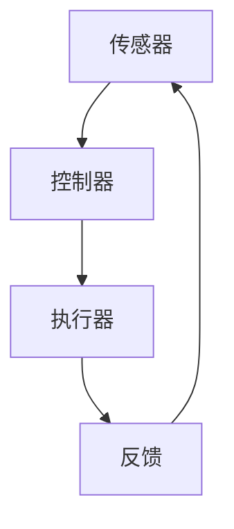
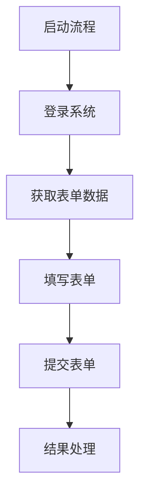
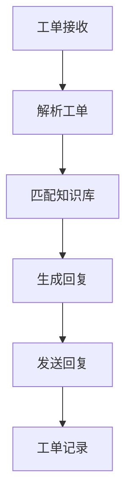
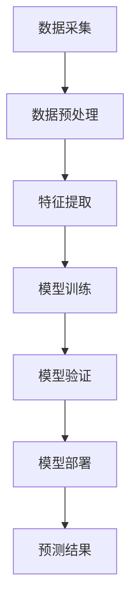

                 

# 技术自动化：减少重复工作，提高效率

## 关键词

- 技术自动化
- 重复工作
- 效率提升
- 机器人流程自动化
- 机器学习
- 智能优化

## 摘要

本文旨在探讨技术自动化的概念、原理、应用以及未来发展趋势。技术自动化通过减少重复性工作，提高工作效率，成为当今信息化社会的重要驱动力。本文将详细介绍技术自动化的核心概念和原理，探讨其在流程自动化、机器人自动化、企业应用和个人生活中的具体应用，同时分析技术自动化的优化策略与工具，并展望其未来的发展趋势和面临的挑战。通过本文的阅读，读者将全面了解技术自动化，并能够将其应用于实际工作和生活中，提高生产效率和工作质量。

## 引言

在信息化社会的背景下，数据爆炸、技术进步和市场竞争的加剧，使得人们面临越来越多的重复性工作。这些工作不仅耗费了大量的人力资源，还降低了工作效率，影响了整体生产力和生活质量。因此，寻找一种能够有效减少重复工作、提高工作效率的方法变得尤为重要。技术自动化正是为了解决这一问题而诞生的一种先进技术。

技术自动化是指利用计算机技术、机器学习、人工智能等手段，将重复性、繁琐的工作自动化完成，从而降低人工干预，提高工作效率。它不仅能够减少人工操作错误，提高生产质量，还能够解放劳动力，使得人们有更多时间专注于更有价值和创新性的工作。

本文将首先介绍技术自动化的定义与历史背景，探讨其意义与影响，然后深入解析技术自动化的核心概念和原理，详细阐述其在不同领域的应用实践，最后讨论技术自动化的优化策略、工具以及未来发展趋势和挑战。希望通过本文的探讨，读者能够对技术自动化有一个全面、深入的理解，并将其应用于实际工作中，实现效率提升。

### 技术自动化的定义与历史背景

技术自动化，顾名思义，是指通过应用现代信息技术，如计算机技术、机器学习、人工智能等，实现某些工作任务的自动执行。这一概念最早可以追溯到20世纪中叶，随着计算机技术的快速发展和应用，自动化逐渐从工业生产扩展到各个领域。

**定义**

技术自动化可以定义为：利用计算机硬件、软件以及人工智能技术，对重复性、标准化的任务进行自动处理，从而减少人工干预，提高工作效率和质量的过程。技术自动化的核心目标是减少人工劳动，实现任务的自动化、智能化和高效化。

**历史背景**

技术自动化的历史可以追溯到20世纪40年代，当时计算机的出现为自动化提供了硬件基础。随着计算机技术的发展，自动化也逐渐从简单的计算任务扩展到更复杂的领域。以下是一些重要的历史节点：

1. **1950s - 1960s：早期自动化**
   - 1950年代，IBM等公司开始研发和生产自动化的生产设备，如自动化流水线和机器人。
   - 1960年代，计算机编程语言的发展使得自动化任务可以通过编写程序来实现。

2. **1970s - 1980s：自动化技术的初步应用**
   - 1970年代，自动化技术在工业生产中得到广泛应用，如自动化生产线、自动化装配线等。
   - 1980年代，计算机技术的发展推动了自动化技术的进一步普及，计算机辅助设计（CAD）、计算机辅助制造（CAM）等技术开始出现。

3. **1990s - 2000s：互联网时代的自动化**
   - 1990年代，互联网的兴起带来了信息自动化，电子邮件、在线支付、在线购物等应用逐渐普及。
   - 2000年代，随着电子商务和大数据技术的发展，自动化技术在商业、金融等领域得到了广泛应用，如自动化交易、自动化数据分析等。

4. **2010s - 至今：智能自动化时代**
   - 2010年代，人工智能和机器学习技术的突破使得自动化进入了一个新的阶段，智能自动化成为可能。
   - 目前，自动化技术已经在生产、服务、医疗、教育等多个领域得到广泛应用，如智能制造、智能客服、自动驾驶等。

**意义与影响**

技术自动化在现代社会中具有重要意义和广泛影响。首先，它能够显著提高工作效率。通过自动化技术，许多重复性、繁琐的工作可以由计算机和机器人完成，从而减少人工干预，提高工作效率。

其次，技术自动化有助于提高生产质量。自动化系统能够精确执行任务，减少人为错误，提高产品质量。

此外，技术自动化还能够解放劳动力，使得人们有更多时间专注于更有价值和创新性的工作。在工业生产中，自动化技术的应用使得劳动力从繁重的体力劳动中解放出来，从事更有技术含量和创新性的工作。

最后，技术自动化对社会和经济的发展也产生了深远影响。它推动了产业升级和转型，促进了经济的发展。同时，自动化技术还带来了新的就业机会，如自动化系统的设计、开发和维护等。

总之，技术自动化是信息化社会的重要驱动力，它通过减少重复性工作、提高工作效率，为社会的进步和个人的发展提供了强大的支持。随着技术的不断进步，自动化将在未来发挥更加重要的作用，成为推动社会发展的关键力量。

### 技术自动化的核心概念和原理

技术自动化涉及多个核心概念和原理，包括硬件自动化、软件自动化以及数据自动化等。这些概念和原理共同构成了自动化技术的理论基础，为实际应用提供了重要的指导。

#### 硬件自动化的原理

硬件自动化主要涉及利用机械、电子和计算机技术实现物理过程的自动化。其基本原理包括传感器、执行器和控制器等组成部分的协同工作。

1. **传感器**

传感器是硬件自动化的关键组成部分，用于检测和测量环境中的各种物理量，如温度、压力、湿度等。传感器将物理量转换为电信号，为控制系统提供输入。

2. **执行器**

执行器是硬件自动化的执行部分，根据控制器的指令，对物理系统进行操作，如开关阀门、驱动电机等。执行器将电信号转换为物理动作，实现对过程的控制。

3. **控制器**

控制器是硬件自动化的核心部分，负责接收传感器的输入信号，通过算法进行处理，然后发送指令给执行器。控制器通常由计算机或单片机等组成，具有计算、存储和执行功能。

4. **控制系统**

控制系统是硬件自动化的整体架构，包括传感器、执行器和控制器等组成部分。控制系统通过闭环控制原理，实现对物理过程的精确控制。

**Mermaid流程图**

以下是一个简单的硬件自动化系统流程图，使用Mermaid语法绘制：



#### 软件自动化的原理

软件自动化主要涉及利用计算机程序和脚本语言，对软件系统进行自动化操作。其核心原理包括脚本编写、自动化工具和集成开发环境等。

1. **脚本编写**

脚本编写是软件自动化的基础，通过编写脚本，可以实现对软件系统的自动化操作。常见的脚本语言包括Python、Shell、JavaScript等。

2. **自动化工具**

自动化工具是软件自动化的重要组成部分，如Selenium、Applitools、Puppet等。这些工具提供了丰富的功能和接口，方便开发者进行自动化测试、部署和监控等操作。

3. **集成开发环境（IDE）**

集成开发环境是软件自动化的开发平台，提供了代码编写、调试、运行和发布等功能。常见的IDE包括Visual Studio、Eclipse、IntelliJ IDEA等。

**伪代码**

以下是一个简单的Python脚本，用于自动化执行一个简单的计算任务：

```python
# 定义一个计算函数
def calculate(a, b):
    result = a + b
    return result

# 执行计算任务
input_a = 5
input_b = 10
output = calculate(input_a, input_b)
print("计算结果为：", output)
```

#### 数据自动化的原理

数据自动化主要涉及利用数据技术和算法，对数据进行处理、分析和可视化。其核心原理包括数据采集、数据清洗、数据分析等。

1. **数据采集**

数据采集是数据自动化的第一步，通过传感器、数据库、API接口等途径获取数据。

2. **数据清洗**

数据清洗是数据自动化的关键步骤，用于处理数据中的噪声、错误和不一致性。常见的数据清洗方法包括数据去重、缺失值填充、异常值处理等。

3. **数据分析**

数据分析是数据自动化的核心，通过统计学、机器学习等技术对数据进行处理，提取有价值的信息和规律。常见的数据分析方法包括回归分析、聚类分析、分类分析等。

4. **数据可视化**

数据可视化是数据自动化的重要环节，通过图表、图像等可视化形式，展示数据分析结果，帮助人们更好地理解和利用数据。

**数学模型和公式**

以下是一个简单的线性回归模型，用于分析数据：

$$
y = wx + b
$$

其中，$y$ 是因变量，$x$ 是自变量，$w$ 是权重，$b$ 是偏置。通过最小二乘法，可以求解权重 $w$ 和偏置 $b$，从而建立回归模型。

```latex
\begin{equation}
y = wx + b
\end{equation}
```

综上所述，技术自动化的核心概念和原理涵盖了硬件、软件和数据的各个方面。通过理解这些原理，可以更好地设计和实现自动化系统，提高工作效率和质量。

### 常见自动化技术与方法

在技术自动化的应用中，多种技术与方法被广泛采用，以实现不同场景下的自动化需求。以下将介绍几种常见的自动化技术与方法，包括流程自动化、机器人自动化、机器学习自动化等。

#### 流程自动化

流程自动化是技术自动化中最为基础和广泛应用的一种形式，它主要通过软件工具和自动化脚本，对业务流程中的任务进行自动化执行。流程自动化的关键在于对业务流程的全面理解和建模，以便设计出高效的自动化方案。

1. **自动化流程设计**

自动化流程设计是流程自动化的第一步，其核心是明确业务流程中的各个环节和步骤，并对其进行建模。常用的建模工具包括流程图、状态图等。通过这些工具，可以直观地展示业务流程，并标识出需要自动化的任务节点。

2. **自动化流程工具**

自动化流程工具是实现流程自动化的关键，常见的工具有AutoHotkey、Automate、WorkFusion等。这些工具提供了丰富的功能，如任务调度、数据采集、条件判断、异常处理等，能够满足不同场景的自动化需求。

3. **自动化流程案例**

以下是一个简单的自动化流程案例，用于自动填写和提交一个在线表单：



在上述案例中，流程自动化工具会按照设计好的流程图，自动完成登录、获取表单数据、填写表单和提交表单等任务。如果提交过程中遇到错误，工具会自动重试或触发异常处理。

#### 机器人自动化

机器人自动化是近年来随着人工智能技术发展而兴起的一种自动化形式，它通过模拟人类的操作行为，实现自动化任务执行。机器人自动化广泛应用于客服、财务、人力资源等领域。

1. **机器人自动化概述**

机器人自动化通常包括两种类型：流程机器人（RPA）和智能机器人（IA）。流程机器人主要模拟人类在特定业务流程中的操作，如数据录入、审批流程等；智能机器人则结合了人工智能技术，如自然语言处理、机器学习等，能够实现更复杂的任务。

2. **机器人自动化技术**

机器人自动化技术主要包括以下几方面：

- **界面自动化**：通过模拟人类的点击、拖拽等操作，实现软件界面的自动化。
- **数据交互**：通过API接口、数据库连接等方式，实现数据的自动化处理和传输。
- **自然语言处理**：通过理解和处理自然语言，实现人机交互的自动化。

3. **机器人自动化应用**

以下是一个机器人自动化的应用案例，用于自动化处理客服工单：



在上述案例中，机器人会自动接收工单、解析工单内容、查询知识库、生成回复，并最终发送给客户。如果遇到复杂问题，机器人会自动转交人工处理。

#### 机器学习自动化

机器学习自动化是利用机器学习算法，实现数据分析和预测的自动化。它广泛应用于金融、医疗、制造业等领域，能够帮助企业从海量数据中提取有价值的信息。

1. **机器学习自动化概述**

机器学习自动化主要包括以下两个方面：

- **特征工程**：通过自动化手段，从原始数据中提取出有用的特征，用于训练模型。
- **模型自动化**：通过自动化工具，实现模型的训练、验证和部署。

2. **机器学习自动化技术**

机器学习自动化技术主要包括：

- **自动化特征提取**：通过自动化工具，从数据中提取出高质量的特征，如特征选择、特征工程等。
- **自动化模型选择**：通过自动化工具，选择适合的机器学习模型，如交叉验证、模型选择等。
- **自动化模型训练与部署**：通过自动化工具，实现模型的训练、验证和部署。

3. **机器学习自动化应用**

以下是一个机器学习自动化的应用案例，用于预测股票价格：



在上述案例中，自动化系统会自动采集股票数据、预处理数据、提取特征、训练模型，并最终部署模型进行实时预测。

综上所述，流程自动化、机器人自动化和机器学习自动化是技术自动化中常见的几种方法。通过这些方法，企业可以实现重复性工作的自动化，提高工作效率和质量。在实际应用中，可以根据具体需求，选择合适的技术和方法进行自动化实现。

### 自动化技术的应用实践

技术自动化在各个领域都有广泛应用，通过实际案例和实践，可以更清晰地理解其具体应用和效果。以下将介绍自动化技术在企业应用、个人生活和自动化交通等领域的实践案例。

#### 企业应用

在企业应用中，自动化技术不仅提高了工作效率，还优化了业务流程，减少了人力资源的浪费。以下是一些典型的企业应用案例：

1. **生产制造**

生产制造领域是自动化技术的重要应用场景之一。通过自动化生产线，企业可以实现生产过程的全程监控和自动调节，从而提高生产效率和产品质量。例如，汽车制造企业采用自动化机器人进行车身焊接、喷漆等操作，大大提高了生产效率。

2. **物流与供应链管理**

自动化技术也在物流与供应链管理中发挥了重要作用。自动化仓储系统通过机器人和自动化设备，实现货物的快速存取和分类，提高了物流效率。此外，自动化跟踪系统可以实时监控货物的位置和状态，确保供应链的透明和高效。

3. **财务与人力资源**

在财务和人力资源领域，自动化技术同样得到了广泛应用。自动化财务系统可以自动处理账务、报表等任务，减少了人工操作错误，提高了财务管理的准确性和效率。自动化招聘系统通过机器学习和自然语言处理技术，自动筛选和评估简历，提高了招聘效率。

#### 个人生活

自动化技术已经深刻地改变了我们的个人生活，使得生活更加便捷和智能化。以下是一些典型的个人生活应用案例：

1. **智能家居**

智能家居通过自动化技术，实现家庭设备的智能控制，提高了生活舒适度和便利性。例如，智能灯光系统可以根据光线强度自动调节亮度，智能空调可以根据室内温度自动调节制冷或制热，智能安防系统可以自动监控家庭安全。

2. **个人健康管理**

自动化技术也在个人健康管理中发挥了重要作用。智能手环和智能手表等设备可以实时监测心率、睡眠质量等健康数据，并通过手机应用进行分析和反馈，帮助用户实现健康生活。

3. **在线教育**

在线教育领域通过自动化技术，实现了教学过程的智能化和个性化。智能学习平台可以根据学生的学习进度和表现，自动调整教学内容和难度，提供个性化的学习建议和反馈。

#### 自动化交通

自动化交通是未来交通发展的重要方向，通过自动化技术，实现车辆的自动驾驶、智能交通管理等目标。以下是一些典型的自动化交通应用案例：

1. **自动驾驶**

自动驾驶技术通过传感器、人工智能和机器学习等技术，实现车辆的自主驾驶。自动驾驶汽车可以自动识别道路标志、交通信号和行人，并根据交通状况进行智能驾驶。这不仅可以提高交通安全和效率，还可以减少交通事故。

2. **智能交通管理**

智能交通管理系统通过自动化技术，实现交通流量、车辆密度等数据的实时监控和智能调节，优化交通状况。例如，智能交通灯可以根据实时交通流量自动调整红绿灯时长，提高道路通行效率。

3. **无人机配送**

无人机配送是自动化交通的一种创新应用，通过无人机实现快速、高效的物流配送。无人机可以在城市中自主飞行，避开交通拥堵，将货物快速送达用户手中。

总之，技术自动化在各个领域的应用实践，不仅提高了工作效率和生活质量，还推动了产业升级和社会进步。随着技术的不断进步，自动化将在未来发挥更加重要的作用，成为推动社会发展的关键力量。

### 自动化技术的优化策略与工具

为了进一步提高自动化技术的效率和效果，我们需要采取一系列优化策略和工具。以下将从自动化目标确定、优化方法选择、优化效果评估以及常用自动化工具等方面进行详细探讨。

#### 自动化目标的确定

明确自动化目标是对自动化项目进行优化的重要前提。在确定自动化目标时，我们需要考虑以下几个方面：

1. **工作效率**：提高工作效率是自动化技术最直接的收益。通过自动化，我们可以减少重复性、繁琐的工作，使得工作人员能够将更多时间用于更有价值的工作。

2. **准确性**：自动化技术可以减少人为错误，提高数据的准确性和一致性。这在需要高精度和严格质量控制的领域尤为重要。

3. **成本降低**：自动化技术可以减少人工成本和运营成本，从而提高整体效益。

4. **灵活性**：自动化系统应具备一定的灵活性，能够适应不同的工作需求和变化。

5. **扩展性**：自动化系统应具有良好的扩展性，能够方便地集成新的功能和模块。

#### 优化方法的选择

在确定自动化目标后，选择合适的优化方法是关键。以下是一些常见的优化方法：

1. **流程优化**：通过重新设计业务流程，消除不必要的步骤，简化流程，提高效率。可以使用流程图、价值流图等工具进行流程优化。

2. **算法优化**：优化算法可以提高自动化系统的运行效率。例如，在机器学习模型中，通过调整参数、特征选择等方法，可以提高模型的预测准确性和运行速度。

3. **硬件升级**：升级硬件设备，如服务器、存储设备等，可以提升系统的处理能力和稳定性。

4. **工具集成**：通过集成不同的自动化工具，实现协同工作，提高整体效率。例如，将RPA（机器人流程自动化）与AI（人工智能）技术相结合，可以实现更复杂的自动化任务。

5. **自动化测试**：自动化测试可以确保自动化系统的稳定性和可靠性。通过持续集成（CI）和持续交付（CD）工具，可以实现自动化测试的自动化执行。

#### 优化效果的评估

评估自动化优化的效果是优化过程中的重要环节。以下是一些常见的评估方法：

1. **性能测试**：通过模拟实际工作场景，对自动化系统的性能进行测试，评估其响应时间、吞吐量等指标。

2. **成本效益分析**：通过对比自动化前后的人力成本、运营成本等，评估自动化的经济效益。

3. **用户反馈**：通过用户反馈，了解自动化系统的使用体验和效果，及时进行优化。

4. **关键绩效指标（KPI）**：设定关键绩效指标，如任务完成率、错误率等，定期进行监控和评估。

#### 常用自动化工具

以下是一些常用的自动化工具，可以帮助我们实现自动化目标：

1. **RPA工具**：如UiPath、Blue Prism、Automation Anywhere等，用于实现业务流程的自动化。

2. **AI开发平台**：如Google AI、Microsoft Azure AI、Amazon AI等，提供丰富的机器学习算法和工具，支持自动化数据分析。

3. **测试工具**：如Selenium、TestComplete、JMeter等，用于实现自动化测试。

4. **集成开发环境（IDE）**：如Visual Studio、Eclipse、IntelliJ IDEA等，提供代码编写、调试和运行等功能。

5. **持续集成和持续交付（CI/CD）工具**：如Jenkins、Travis CI、GitLab CI/CD等，用于实现自动化构建、测试和部署。

通过以上优化策略与工具，我们可以显著提升自动化技术的效率和效果，实现更高水平的自动化和智能化。

### 自动化技术的未来趋势与挑战

随着科技的不断进步，自动化技术正迎来新的发展趋势和挑战。以下是自动化技术未来可能的发展方向以及面临的挑战。

#### 未来趋势

1. **智能自动化与人工智能的融合**

   未来的自动化技术将更加智能，与人工智能（AI）技术深度融合。通过AI算法，自动化系统能够实现自我学习和优化，提高决策的准确性和效率。例如，智能客服机器人将通过深度学习和自然语言处理技术，提供更加自然、高效的客户服务。

2. **边缘计算与云计算的结合**

   边缘计算和云计算的结合将为自动化技术提供更强大的数据处理和计算能力。边缘计算可以在数据产生的源头进行实时处理和分析，而云计算则提供强大的数据存储和计算资源。这种结合将使自动化系统在处理大量数据时更加高效和灵活。

3. **自动化技术的多样化应用**

   自动化技术将在更多领域得到广泛应用，包括医疗、教育、能源等。例如，智能医疗系统可以通过自动化技术实现精准诊断和个性化治疗；智能教育系统可以通过自动化教学和个性化学习，提高教育质量。

4. **自动化工具的普及和开源化**

   随着自动化工具的普及和开源化，更多企业和开发者将能够轻松地实现自动化。开源自动化工具如Kubernetes、Apache Airflow等，将推动自动化技术的快速发展和创新。

#### 挑战

1. **技术挑战**

   自动化技术的快速发展带来了新的技术挑战。例如，如何在海量数据中进行高效的数据处理和分析；如何在复杂的动态环境中实现可靠的自动化控制等。此外，自动化系统的可靠性和安全性也是需要重点关注的问题。

2. **伦理和隐私挑战**

   自动化技术的广泛应用引发了伦理和隐私问题。例如，自动化系统如何保证数据安全和隐私保护；自动化决策的透明度和可解释性如何等。这些问题需要我们在技术设计中充分考虑和解决。

3. **社会挑战**

   自动化技术的快速发展也可能带来社会挑战。例如，自动化可能导致就业岗位的减少，引发社会不稳定。此外，自动化技术的不当使用可能对社会产生负面影响，如自动化武器、自动化监控系统等。

4. **法律和法规挑战**

   随着自动化技术的普及，相关的法律法规也需要不断完善。例如，如何规范自动化系统的开发和部署；如何对自动化决策进行监督和责任界定等。这些法律法规的完善将为自动化技术的健康发展提供保障。

总之，自动化技术在未来将继续快速发展，带来巨大的机遇和挑战。通过技术创新、伦理和法律建设，我们可以更好地应对这些挑战，实现自动化技术的健康和可持续发展。

### 总结与展望

技术自动化作为信息化社会的重要驱动力，已经深刻改变了我们的工作方式和生活方式。通过减少重复性工作、提高工作效率，自动化技术不仅提升了企业的生产力，也提升了个人生活质量。本文从技术自动化的定义、核心概念、应用实践、优化策略到未来趋势，全面探讨了自动化技术的重要性和应用前景。

未来，随着人工智能、边缘计算和云计算等技术的发展，自动化技术将更加智能、高效和普及。然而，自动化技术的广泛应用也带来了伦理、隐私和社会等多方面的挑战。我们需要在技术创新的同时，关注这些问题，推动自动化技术的健康和可持续发展。

对于读者而言，掌握自动化技术不仅能够提高工作效率，还能为职业生涯提供更多机会。希望本文能为您提供对自动化技术的全面理解，激发您对这一领域的兴趣和探索。在未来的技术发展中，让我们共同迎接自动化带来的美好变革。

### 最佳实践 Tips

1. **学习基础编程技能**：无论是自动化流程设计还是编写自动化脚本，基础编程技能都是必不可少的。Python、Java、JavaScript等编程语言都是不错的选择，它们在自动化领域有广泛应用。

2. **了解常用自动化工具**：熟悉常用的自动化工具，如RPA（机器人流程自动化）工具（UiPath、Blue Prism）、测试工具（Selenium）等，能够快速上手并实现自动化任务。

3. **数据驱动决策**：在设计和优化自动化系统时，充分利用数据分析工具，如Excel、Tableau等，对系统性能和效果进行监控和评估。

4. **持续学习和创新**：自动化技术不断进步，持续学习和创新是保持竞争力的关键。关注行业动态，学习新技术，尝试创新应用。

### 小结

本文通过详细探讨技术自动化的定义、核心概念、应用实践、优化策略和未来趋势，全面阐述了自动化技术的重要性和应用前景。技术自动化不仅能够提高工作效率，还能够推动产业升级和社会进步。希望读者能够深入理解和应用自动化技术，实现工作与生活的优化。

### 注意事项

1. **安全性和隐私保护**：在使用自动化技术时，务必确保系统和数据的安全性，遵循相关法律法规，保护用户隐私。

2. **合规性**：在设计自动化系统时，要充分考虑法律法规和行业标准，确保系统的合规性。

3. **灵活性和可扩展性**：在设计和实施自动化系统时，要充分考虑系统的灵活性和可扩展性，以适应未来业务需求的变化。

### 拓展阅读

1. **《深度学习》**：由Ian Goodfellow等编著，深入讲解了深度学习的基本原理和应用。

2. **《R语言实战》**：由Robert Kabacoff编著，详细介绍了如何使用R语言进行数据分析和自动化。

3. **《人工智能：一种现代方法》**：由Stuart Russell和Peter Norvig编著，全面介绍了人工智能的基础知识和发展趋势。

作者：AI天才研究院/AI Genius Institute & 禅与计算机程序设计艺术 /Zen And The Art of Computer Programming

