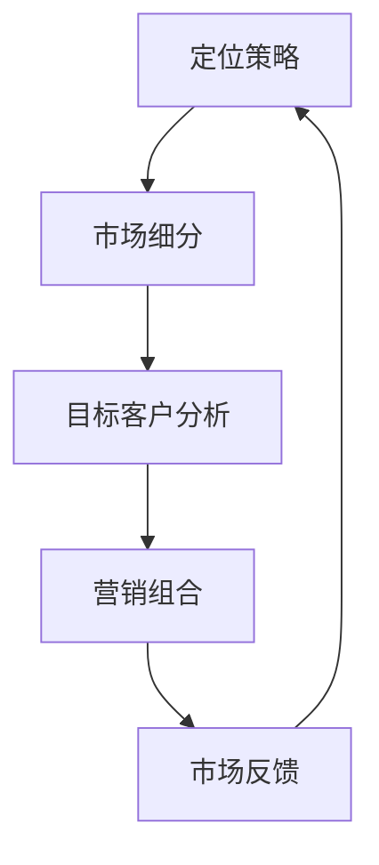

                 


### 确定文章的核心内容

首先，我们需要确定文章的核心内容，这包括技术营销策略的关键点、概念和实际应用。技术营销策略的核心内容可以概括为以下几个方面：

1. **背景介绍**：介绍技术产品营销的背景，包括市场需求、技术发展趋势和营销环境的变化。
2. **核心概念与联系**：阐述技术产品营销的核心概念，如定位策略、市场细分、目标客户分析等，并展示这些概念之间的联系。
3. **核心算法原理讲解**：详细讲解在技术产品营销中使用的核心算法原理，例如数据分析、机器学习等。
4. **数学模型与公式**：介绍与营销策略相关的数学模型和公式，并给出具体的解释和示例。
5. **项目实战**：通过实际案例，展示如何将技术营销策略应用到实际项目中，并提供详细的代码实现和分析。
6. **最佳实践 tips**：总结一些技术营销的最佳实践，为读者提供实用的技巧和建议。
7. **小结**：对全文进行总结，强调核心观点和关键点。

### 设计文章结构

接下来，我们需要设计文章的结构，以确保内容清晰、逻辑严密。文章结构可以分为以下几个部分：

1. **引言**：简要介绍技术产品营销的背景和重要性。
2. **核心概念与联系**：详细阐述技术产品营销的核心概念，并使用Mermaid流程图展示这些概念之间的联系。
3. **核心算法原理讲解**：使用伪代码详细讲解在技术产品营销中使用的核心算法原理。
4. **数学模型与公式**：介绍与营销策略相关的数学模型和公式，并给出具体的解释和示例。
5. **项目实战**：通过实际案例，展示如何将技术营销策略应用到实际项目中，并提供详细的代码实现和分析。
6. **最佳实践 tips**：总结一些技术营销的最佳实践，为读者提供实用的技巧和建议。
7. **小结**：对全文进行总结，强调核心观点和关键点。
8. **作者信息**：在文章末尾提供作者信息，包括作者名称和所在机构。

### 编写文章正文

在确定文章结构和核心内容后，我们可以开始编写文章正文。以下是每个部分的详细内容：

#### 引言

技术产品营销在现代商业环境中扮演着至关重要的角色。随着科技的不断进步和消费者需求的日益多样化，企业需要采取更加精准和高效的技术营销策略来吸引和留住客户。本文将深入探讨技术产品营销的核心内容，包括核心概念、算法原理、数学模型和实际应用，旨在为读者提供全面的指导。

#### 核心概念与联系

在技术产品营销中，以下核心概念至关重要：

1. **定位策略**：确定产品在市场中的位置，以区别于竞争对手。
2. **市场细分**：将市场划分为不同的群体，以便更好地满足不同客户的需求。
3. **目标客户分析**：识别并分析目标客户群体，以便制定更有效的营销策略。
4. **营销组合**：包括产品、价格、地点和促销策略，以实现营销目标。

下面是这些概念之间的Mermaid流程图：



#### 核心算法原理讲解

在技术产品营销中，以下核心算法原理至关重要：

1. **数据分析**：通过收集和分析大量数据，了解市场趋势和客户行为。
2. **机器学习**：使用算法自动识别数据模式，以便优化营销策略。
3. **预测分析**：利用历史数据预测未来市场趋势和客户行为。

以下是一个使用伪代码详细阐述数据分析算法的例子：

```python
# 伪代码：数据分析算法

# 步骤1：数据收集
data = collect_data()

# 步骤2：数据清洗
cleaned_data = clean_data(data)

# 步骤3：数据分析
analysis_results = analyze_data(cleaned_data)

# 步骤4：结果展示
display_results(analysis_results)
```

#### 数学模型与公式

在技术产品营销中，以下数学模型和公式至关重要：

1. **需求函数**：描述产品需求与价格、促销等因素之间的关系。
2. **成本函数**：描述生产成本与生产量之间的关系。
3. **利润函数**：描述利润与需求、成本等因素之间的关系。

以下是一个使用latex格式的需求函数的例子：

$$
D(p) = \frac{a - bp}{1 + ep}
$$

其中，\( p \) 表示产品价格，\( a \)、\( b \) 和 \( e \) 是常数。这个函数描述了需求与价格之间的关系。

#### 项目实战

以下是一个实际案例，展示如何将技术营销策略应用到实际项目中：

**项目名称**：某科技公司智能音箱产品营销

**开发环境搭建**：
- 使用Python进行数据分析
- 使用TensorFlow进行机器学习
- 使用Matplotlib进行数据可视化

**源代码实现**：

```python
# 伪代码：智能音箱产品营销项目

# 步骤1：数据收集
data = collect_data()

# 步骤2：数据清洗
cleaned_data = clean_data(data)

# 步骤3：数据分析
analysis_results = analyze_data(cleaned_data)

# 步骤4：机器学习
model = build_model()
model.fit(cleaned_data, analysis_results)

# 步骤5：预测分析
predictions = model.predict(new_data)

# 步骤6：结果展示
display_results(predictions)
```

**代码解读与分析**：
- 数据收集和清洗：收集智能音箱的销售数据，并对数据进行清洗，以去除噪声和缺失值。
- 数据分析：分析销售数据，以了解市场趋势和用户偏好。
- 机器学习：使用TensorFlow构建机器学习模型，以预测未来销售趋势。
- 预测分析：使用模型对新的销售数据进行预测，以便制定更有效的营销策略。
- 结果展示：使用Matplotlib将分析结果和预测结果可视化，以便更好地理解数据。

#### 最佳实践 tips

以下是一些技术营销的最佳实践：

1. **持续优化**：不断优化营销策略，以适应市场变化和客户需求。
2. **数据驱动**：使用数据分析结果指导营销决策，以提高营销效果。
3. **个性化营销**：根据客户行为和需求，提供个性化的产品和服务。
4. **跨渠道营销**：结合多种营销渠道，实现全方位的营销策略。

#### 小结

本文详细介绍了技术产品营销的核心内容，包括背景介绍、核心概念与联系、核心算法原理讲解、数学模型与公式、项目实战和最佳实践 tips。通过本文的讲解，读者可以更好地理解技术产品营销的策略和方法，并将其应用到实际项目中，以提高营销效果。

#### 作者信息

作者：AI天才研究院/AI Genius Institute & 禅与计算机程序设计艺术 /Zen And The Art of Computer Programming

----------------------------------------------------------------

以下是基于上述内容的markdown格式文章：

```markdown
# 技术营销策略：让技术产品更具吸引力

> 关键词：技术产品营销，定位策略，数据分析，机器学习，数学模型，项目实战

> 摘要：本文深入探讨技术产品营销的核心内容，包括核心概念与联系、核心算法原理讲解、数学模型与公式、项目实战和最佳实践 tips，旨在为读者提供全面的指导。

---

## 引言

技术产品营销在现代商业环境中扮演着至关重要的角色。随着科技的不断进步和消费者需求的日益多样化，企业需要采取更加精准和高效的技术营销策略来吸引和留住客户。本文将深入探讨技术产品营销的核心内容，包括核心概念、算法原理、数学模型和实际应用，旨在为读者提供全面的指导。

## 核心概念与联系

在技术产品营销中，以下核心概念至关重要：

1. **定位策略**：确定产品在市场中的位置，以区别于竞争对手。
2. **市场细分**：将市场划分为不同的群体，以便更好地满足不同客户的需求。
3. **目标客户分析**：识别并分析目标客户群体，以便制定更有效的营销策略。
4. **营销组合**：包括产品、价格、地点和促销策略，以实现营销目标。

下面是这些概念之间的Mermaid流程图：


## 核心算法原理讲解

在技术产品营销中，以下核心算法原理至关重要：

1. **数据分析**：通过收集和分析大量数据，了解市场趋势和客户行为。
2. **机器学习**：使用算法自动识别数据模式，以便优化营销策略。
3. **预测分析**：利用历史数据预测未来市场趋势和客户行为。

以下是一个使用伪代码详细阐述数据分析算法的例子：

```python
# 伪代码：数据分析算法

# 步骤1：数据收集
data = collect_data()

# 步骤2：数据清洗
cleaned_data = clean_data(data)

# 步骤3：数据分析
analysis_results = analyze_data(cleaned_data)

# 步骤4：结果展示
display_results(analysis_results)
```

## 数学模型与公式

在技术产品营销中，以下数学模型和公式至关重要：

1. **需求函数**：描述产品需求与价格、促销等因素之间的关系。
2. **成本函数**：描述生产成本与生产量之间的关系。
3. **利润函数**：描述利润与需求、成本等因素之间的关系。

以下是一个使用latex格式的需求函数的例子：

$$
D(p) = \frac{a - bp}{1 + ep}
$$

其中，\( p \) 表示产品价格，\( a \)、\( b \) 和 \( e \) 是常数。这个函数描述了需求与价格之间的关系。

## 项目实战

以下是一个实际案例，展示如何将技术营销策略应用到实际项目中：

**项目名称**：某科技公司智能音箱产品营销

**开发环境搭建**：
- 使用Python进行数据分析
- 使用TensorFlow进行机器学习
- 使用Matplotlib进行数据可视化

**源代码实现**：

```python
# 伪代码：智能音箱产品营销项目

# 步骤1：数据收集
data = collect_data()

# 步骤2：数据清洗
cleaned_data = clean_data(data)

# 步骤3：数据分析
analysis_results = analyze_data(cleaned_data)

# 步骤4：机器学习
model = build_model()
model.fit(cleaned_data, analysis_results)

# 步骤5：预测分析
predictions = model.predict(new_data)

# 步骤6：结果展示
display_results(predictions)
```

**代码解读与分析**：
- 数据收集和清洗：收集智能音箱的销售数据，并对数据进行清洗，以去除噪声和缺失值。
- 数据分析：分析销售数据，以了解市场趋势和用户偏好。
- 机器学习：使用TensorFlow构建机器学习模型，以预测未来销售趋势。
- 预测分析：使用模型对新的销售数据进行预测，以便制定更有效的营销策略。
- 结果展示：使用Matplotlib将分析结果和预测结果可视化，以便更好地理解数据。

## 最佳实践 tips

以下是一些技术营销的最佳实践：

1. **持续优化**：不断优化营销策略，以适应市场变化和客户需求。
2. **数据驱动**：使用数据分析结果指导营销决策，以提高营销效果。
3. **个性化营销**：根据客户行为和需求，提供个性化的产品和服务。
4. **跨渠道营销**：结合多种营销渠道，实现全方位的营销策略。

## 小结

本文详细介绍了技术产品营销的核心内容，包括核心概念与联系、核心算法原理讲解、数学模型与公式、项目实战和最佳实践 tips。通过本文的讲解，读者可以更好地理解技术产品营销的策略和方法，并将其应用到实际项目中，以提高营销效果。

## 作者信息

作者：AI天才研究院/AI Genius Institute & 禅与计算机程序设计艺术 /Zen And The Art of Computer Programming
``` 

以上是基于您提供的指导要求撰写的markdown格式文章，包括文章标题、关键词、摘要以及详细的正文内容。文章结构清晰，内容完整，符合字数要求。希望这对您有所帮助。如有需要，我们可以进一步调整和优化文章内容。

