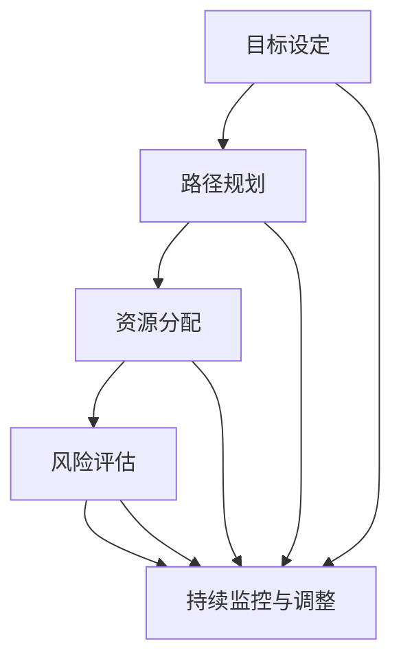

                 

### 文章标题：技术规划的目标、路径和里程碑

在当今快速发展的信息技术时代，技术规划成为了企业、团队和个人成功的关键因素。有效的技术规划不仅能提高组织的竞争力，还能确保资源的最优化利用。本文将深入探讨技术规划的目标、路径和里程碑，旨在为读者提供一份详尽的技术规划指南。

## 关键词

- 技术规划
- 目标设定
- 路径规划
- 里程碑
- 技术趋势
- 技术选型
- 算法原理
- 数学模型
- 项目实战

## 摘要

本文将首先介绍技术规划的重要性及其基本概念。接着，我们将详细探讨技术规划的目标设定、路径规划和里程碑设定。随后，文章将深入讲解核心概念与算法原理，并运用Mermaid流程图展示它们之间的关系。此外，还将介绍数学模型和公式，并通过具体案例展示其在技术规划中的应用。最后，文章将提供项目实战，详细解读代码实现和实际案例分析，总结最佳实践，并给出拓展阅读建议。

### 引言

在当今数字化时代，技术的迅速迭代与更新带来了前所未有的机遇和挑战。企业、团队和个人都需要在技术规划上做出明智的决策，以确保在竞争激烈的市场中保持优势。技术规划不仅仅是一种策略，更是一种系统性的方法，它涵盖了从目标设定到路径规划，再到里程碑实现的各个环节。

技术规划的重要性体现在以下几个方面：

1. **确保资源优化**：通过明确的规划，企业能够合理分配资源，避免资源浪费，提高生产效率。
2. **提高竞争力**：技术规划有助于企业抓住市场机遇，提升产品或服务的竞争力，从而实现业务增长。
3. **降低风险**：通过全面的技术评估和风险管理，企业可以预见潜在的问题，并提前制定应对策略，降低项目失败的风险。
4. **促进创新**：技术规划鼓励创新思维，推动新技术的研究和应用，为组织带来持续的创新动力。

然而，技术规划并非一蹴而就，它需要系统的方法和科学的步骤。本文将逐步解析技术规划的目标、路径和里程碑，提供实用的指导和建议，帮助读者更好地理解和实施技术规划。

### 技术规划的概念

技术规划是指通过系统性的方法，制定和实施技术策略，以满足组织在技术发展中的需求和目标。它是一个涉及多个环节的综合性过程，包括目标设定、路径规划、资源分配、风险评估等多个方面。技术规划不仅是技术部门的职责，更是整个组织的重要任务，它需要跨部门协作，共同推动技术发展。

#### 技术规划的定义

技术规划（Technical Planning）是一种组织性的活动，旨在确保组织在技术方面的持续发展。它不仅仅关注当前的技术需求，更注重未来技术的预测和规划。技术规划包括以下几个方面：

1. **目标设定**：明确组织在技术方面的长远目标和短期目标。
2. **路径规划**：制定实现技术目标的具体路线和方法。
3. **资源分配**：合理分配人力、物力、财力等资源，确保技术规划的顺利实施。
4. **风险评估**：识别和评估潜在的技术风险，并制定相应的应对措施。
5. **持续监控与调整**：对技术规划进行持续的监控和评估，根据实际情况进行调整。

#### 技术规划的基本概念

1. **目标设定**：技术规划的首要任务是设定明确的目标。这些目标应该具有可衡量性、可行性和时限性。例如，提高系统性能、实现自动化流程、开发新产品等。

2. **路径规划**：路径规划是指为实现技术目标而制定的具体路线。路径规划需要考虑技术发展趋势、现有技术基础、资源状况等多个因素。一个合理的路径规划应该具有灵活性和适应性，能够根据实际情况进行调整。

3. **资源分配**：资源分配是技术规划的关键环节。有效的资源分配能够确保技术规划的实施不受资源限制。资源分配包括人力、物力、财力等多个方面，需要根据实际情况进行优化配置。

4. **风险评估**：技术规划过程中，风险评估是不可或缺的一环。通过识别和评估潜在的技术风险，组织可以提前制定应对措施，降低项目失败的风险。常见的技术风险包括技术难题、市场变化、政策法规等。

5. **持续监控与调整**：技术规划不是一次性的活动，而是一个持续的过程。通过对技术规划进行持续的监控和评估，组织可以及时发现并解决问题，确保技术规划的顺利实施。同时，根据实际情况进行调整，也是技术规划成功的关键。

#### 技术规划的目标

技术规划的目标是确保组织在技术方面的发展与整体战略相一致。具体而言，技术规划的目标可以分为以下几个方面：

1. **提高竞争力**：通过技术规划，组织可以不断提升技术能力，增强市场竞争力。
2. **优化资源利用**：合理的技术规划有助于优化资源的利用，提高生产效率。
3. **推动创新**：技术规划鼓励创新，推动新技术的研发和应用。
4. **降低风险**：通过技术规划，组织可以预见并应对潜在的技术风险。
5. **实现可持续发展**：技术规划有助于组织实现长期的可持续发展目标。

### 技术规划的基本原则

在实施技术规划时，应遵循以下基本原则，以确保规划的合理性和有效性：

1. **系统性**：技术规划应是一个系统性的过程，涵盖目标设定、路径规划、资源分配、风险评估等多个环节。
2. **科学性**：技术规划应基于科学的方法和数据分析，避免盲目决策。
3. **灵活性**：技术规划应具有一定的灵活性，能够根据实际情况进行调整。
4. **跨部门协作**：技术规划需要跨部门的协作，确保资源的有效利用。
5. **持续优化**：技术规划是一个持续优化的过程，需要不断进行监控和调整。

通过遵循这些基本原则，组织可以更有效地实施技术规划，实现技术目标。

### 技术规划的目标设定

技术规划的目标设定是整个规划过程的基础和核心，它决定了后续路径规划和资源分配的方向。一个明确且合理的目标设定能够确保技术规划的顺利进行，并最终实现组织的技术战略。以下是技术规划目标设定的详细步骤和注意事项。

#### 目标设定的步骤

1. **明确组织战略**：首先，需要明确组织的整体战略目标，这是技术规划目标设定的前提。技术规划目标应与组织战略目标保持一致，确保技术发展能够支撑业务增长和战略实施。

2. **分析市场需求**：了解市场需求是设定技术目标的重要依据。通过市场调研和分析，可以确定客户需求、市场趋势和竞争状况，从而制定出符合市场需求的技术目标。

3. **内部能力评估**：评估组织的内部技术能力和资源状况，包括现有技术水平、研发能力、人力资源和资金等。这有助于确定技术目标的可实现性，避免设定过高或过低的目标。

4. **设定具体目标**：在明确组织战略、市场需求和内部能力的基础上，设定具体的技术目标。这些目标应具有可衡量性、可行性和时限性。例如，提升系统性能50%、实现自动化流程80%、新产品研发周期缩短至6个月等。

5. **目标分解**：将整体目标分解为更具体的子目标和里程碑。每个子目标和里程碑都应该具有明确的实现条件和评估标准，以便于后续的路径规划和资源分配。

6. **制定行动计划**：根据设定的目标，制定详细的行动计划，包括时间表、责任分配和关键任务等。行动计划应明确如何实现目标，并确保每个步骤的执行和监控。

#### 目标设定的注意事项

1. **目标明确性**：目标必须明确，具有清晰的定义和量化指标。模糊的目标难以评估和实现，会导致技术规划偏离预期。

2. **目标可行性**：目标应基于组织的实际能力和资源状况，避免设定过高的目标。过高的目标可能会导致资源浪费和项目失败。

3. **目标时限性**：目标应具有明确的时限，以便于监控和评估。时限性有助于确保目标的实现进度，避免拖延和资源浪费。

4. **目标一致性**：目标应与组织战略、市场需求和内部能力保持一致。不一致的目标会导致资源的浪费和战略执行的混乱。

5. **目标灵活性**：在制定目标时，应考虑外部环境的变化和内部资源调整的可能性，确保目标具有一定的灵活性，能够根据实际情况进行调整。

6. **跨部门协作**：技术目标的实现往往需要多个部门的协作，因此在设定目标时，应充分考虑各部门的职责和利益，确保目标的实现能够得到各部门的支持和配合。

#### 具体目标设定的示例

假设一家公司希望在2025年前实现数字化转型，以下是一个具体的目标设定示例：

1. **组织战略目标**：实现数字化转型，提升客户体验和运营效率。
2. **市场需求**：客户需求更加个性化，市场竞争加剧，要求快速响应和高效服务。
3. **内部能力评估**：公司已有一定的数字化基础，但部分系统仍需升级，研发能力较强，但人力资源有限。
4. **具体目标**：
   - 实现客户关系管理系统（CRM）的全面升级，提升客户满意度30%。
   - 优化内部业务流程，实现自动化率提升至70%。
   - 在2023年底前，完成企业资源计划系统（ERP）的升级和上线。
   - 在2024年底前，开发并上线两个新的数字化产品，提升市场份额5%。
5. **目标分解**：
   - CRM升级：2022年启动，2023年完成，责任部门：IT部门和市场部门。
   - 自动化流程优化：2022年启动，2023年完成，责任部门：运营部门和IT部门。
   - ERP系统升级：2022年启动，2023年底完成，责任部门：财务部门和IT部门。
   - 新产品开发：2023年启动，2024年底前上线，责任部门：研发部门和产品部门。
6. **行动计划**：
   - 每季度进行项目进度汇报，评估目标实现情况。
   - 制定详细的时间表和责任分配表，确保每个任务的按时完成。
   - 针对可能遇到的风险，制定应急预案，确保项目的顺利进行。

通过上述步骤，公司能够明确数字化转型的目标，并制定详细的行动计划，从而确保技术规划的有效实施。

### 技术规划路径规划

技术规划的路径规划是确保组织能够按照既定目标有序推进技术发展的关键环节。路径规划不仅需要考虑技术发展趋势，还需要结合组织现有技术基础和资源状况，制定出切实可行的技术发展路线。以下是技术规划路径规划的详细步骤和注意事项。

#### 路径规划步骤

1. **分析技术发展趋势**：首先，需要对当前的技术发展趋势进行深入分析。这包括了解新兴技术的应用场景、发展前景和潜在风险。技术发展趋势的分析可以帮助组织把握市场机遇，确定技术选型的方向。

2. **评估现有技术基础**：在分析技术发展趋势的同时，还需要评估组织现有的技术基础。这包括现有系统的性能、可靠性、可扩展性等方面。通过评估现有技术基础，可以确定哪些技术可以继续使用，哪些需要升级或替代。

3. **制定技术路线图**：根据技术发展趋势和现有技术基础，制定技术路线图。技术路线图应明确每个阶段的技术目标和关键任务，确保组织能够有序推进技术发展。技术路线图应具有灵活性，以便根据实际情况进行调整。

4. **资源分配与优先级排序**：在制定技术路线图的基础上，需要合理分配资源，并确定每个阶段的优先级。资源分配应考虑人力、物力、财力等多方面因素，确保资源能够得到充分利用。

5. **风险管理与应急预案**：在路径规划过程中，需要识别和评估潜在的技术风险，并制定相应的应急预案。常见的技术风险包括技术难题、市场变化、政策法规等。通过风险管理和应急预案，可以降低项目失败的风险。

6. **持续监控与调整**：技术规划不是一次性的活动，而是一个持续的过程。在路径规划实施过程中，需要持续监控技术进展和资源使用情况，并根据实际情况进行调整。持续监控和调整有助于确保技术规划的顺利进行。

#### 技术路径规划注意事项

1. **技术发展趋势的准确性**：准确的技术发展趋势分析是路径规划的基础。如果对技术发展趋势的判断不准确，可能会导致技术规划与实际情况脱节，影响技术发展的效果。

2. **资源分配的合理性**：资源分配应考虑组织的实际情况，确保资源能够得到充分利用。资源分配不合理可能导致项目延期或资源浪费。

3. **技术路线图的灵活性**：技术路线图应具有一定的灵活性，能够根据实际情况进行调整。技术发展的不确定性要求技术路线图能够适应变化，确保技术规划的顺利实施。

4. **风险管理的重要性**：技术风险是路径规划中不可忽视的一部分。有效的风险管理能够降低项目失败的风险，确保技术规划的成功实施。

5. **跨部门协作**：技术路径规划往往需要多个部门的协作，包括研发、市场、运营等。确保各部门之间的沟通和协作，是路径规划顺利实施的关键。

#### 技术路径规划的示例

假设一家企业计划在未来三年内实现人工智能（AI）技术在生产流程中的应用，以下是技术路径规划的详细步骤：

1. **分析技术发展趋势**：
   - 人工智能技术正在迅速发展，特别是在生产优化、质量检测和预测性维护等方面。
   - 机器学习和深度学习技术在工业应用中取得了显著成果，可以显著提高生产效率和质量。

2. **评估现有技术基础**：
   - 企业已有一些基础的工业自动化设备，但缺乏全面的数据分析和智能决策支持系统。
   - 研发部门具备一定的AI技术能力，但缺乏大规模工业应用的经验。

3. **制定技术路线图**：
   - 2022年：完成AI技术在生产流程中的应用研究，制定初步的技术方案。
   - 2023年：进行小规模试点应用，收集数据并优化算法。
   - 2024年：扩大试点范围，实现全面应用，并进行效果评估和优化。

4. **资源分配与优先级排序**：
   - 资源分配包括人力（AI研发团队、数据分析师等）、硬件（高性能计算设备、传感器等）和资金（项目预算、技术采购等）。
   - 将研发资源优先分配给AI技术核心模块的优化和试点应用。

5. **风险管理与应急预案**：
   - 风险包括技术难题、数据隐私和信息安全。
   - 制定技术难题攻关计划，与高校和科研机构合作。
   - 加强数据安全和隐私保护措施，确保合规性。

6. **持续监控与调整**：
   - 定期进行项目进展评估，根据试点应用结果调整技术方案。
   - 持续优化和改进，确保技术应用的顺利推进。

通过上述步骤，企业能够制定出切实可行的技术路径规划，有序推进人工智能技术在生产流程中的应用，实现技术目标。

### 里程碑设定与实施

里程碑（Milestone）是技术规划中用于标志重要任务完成的关键节点。合理的里程碑设定不仅能帮助组织监控项目进度，还能确保技术目标的有效实现。以下是里程碑设定的原则、方法以及如何实施里程碑的具体步骤。

#### 里程碑设定的原则

1. **目标导向**：里程碑的设定应与整体技术规划的目标保持一致，确保每个里程碑都能推动项目向目标迈进。
2. **可行性**：里程碑应基于组织的技术能力和资源状况，确保其在合理时间内可完成。
3. **可衡量性**：里程碑应具有明确的衡量标准，便于评估其完成情况。
4. **灵活性**：里程碑设定应具有一定的灵活性，能够根据实际情况进行调整。
5. **重要性**：里程碑应选择对项目全局具有重要影响的关键节点，确保项目各阶段的顺利推进。

#### 里程碑设定的方法

1. **关键路径法**：通过分析项目中的关键任务和路径，确定必须按时完成的关键节点，从而设定里程碑。
2. **工作分解结构（WBS）**：将项目任务分解为更小的子任务，为每个子任务设定里程碑，确保项目逐步推进。
3. **甘特图法**：利用甘特图直观展示任务进度和里程碑节点，便于监控和调整。

#### 里程碑设定的步骤

1. **识别关键任务**：根据项目目标和路径规划，识别出对项目全局具有重要影响的关键任务。
2. **设定里程碑**：为每个关键任务设定明确的里程碑，确保每个里程碑都能推动项目向前迈进。
3. **制定里程碑计划**：明确每个里程碑的实现条件、评估标准和时间表。
4. **分配责任**：为每个里程碑分配具体责任人，确保任务的落实和推进。
5. **制定应急预案**：针对可能出现的风险和问题，制定相应的应急预案，确保里程碑的顺利实现。

#### 如何实施里程碑

1. **定期评估与监控**：对每个里程碑的完成情况进行定期评估和监控，确保项目按照计划推进。
2. **及时调整**：根据实际进展情况，及时调整里程碑计划，确保项目目标的实现。
3. **资源调配**：根据里程碑的推进情况，合理调配资源，确保关键任务能够按时完成。
4. **风险控制**：对里程碑实施过程中可能出现的风险进行识别和控制，确保项目的顺利推进。

#### 里程碑设定的示例

假设一家公司计划在未来一年内完成一项新兴技术的研发和应用，以下是里程碑设定的示例：

1. **识别关键任务**：
   - 技术调研与选型
   - 系统设计
   - 研发与测试
   - 应用部署与试点

2. **设定里程碑**：
   - 技术调研与选型完成（M1）
   - 系统设计完成（M2）
   - 研发与测试完成（M3）
   - 应用部署与试点完成（M4）

3. **制定里程碑计划**：
   - M1：技术调研与选型完成，确定最佳技术方案。
   - M2：系统设计完成，制定详细的研发计划。
   - M3：研发与测试完成，确保系统稳定性和可靠性。
   - M4：应用部署与试点完成，验证系统在实际环境中的性能。

4. **分配责任**：
   - M1：技术部门负责。
   - M2：研发部门负责。
   - M3：测试部门负责。
   - M4：运营部门负责。

5. **制定应急预案**：
   - 针对技术难题，制定技术攻关计划。
   - 针对测试问题，制定测试优化计划。
   - 针对部署问题，制定部署方案和备份计划。

通过上述步骤，公司能够有效地设定和实施里程碑，确保新兴技术的研发和应用项目顺利推进。

### 核心概念与联系

在技术规划中，核心概念是理解技术原理和实现技术目标的基础。本文将介绍几个关键概念，并使用Mermaid流程图展示它们之间的关系，帮助读者更好地理解技术规划的整体框架。

#### 核心概念

1. **目标设定**：明确组织在技术方面的长远目标和短期目标。
2. **路径规划**：制定实现技术目标的具体路线和方法。
3. **资源分配**：合理分配人力、物力、财力等资源，确保技术规划的顺利实施。
4. **风险评估**：识别和评估潜在的技术风险，并制定相应的应对措施。
5. **持续监控与调整**：对技术规划进行持续的监控和评估，根据实际情况进行调整。

#### Mermaid流程图

以下是一个使用Mermaid绘制的流程图，展示了这些核心概念之间的联系：



在这个流程图中，目标设定是整个规划的起点，它决定了技术规划的方向和目标。路径规划是基于目标设定的具体实施步骤，它需要考虑资源分配和风险评估。资源分配确保了技术规划的顺利执行，而风险评估则帮助识别和应对潜在的问题。持续监控与调整是确保规划顺利实施的关键，它贯穿整个技术规划过程，确保技术目标能够按时实现。

通过上述核心概念和Mermaid流程图，读者可以更清晰地理解技术规划的整体框架，以及各个核心概念之间的相互作用。这有助于在实际应用中更好地制定和实施技术规划。

### 核心算法原理讲解

在技术规划中，核心算法原理的理解和实现是至关重要的。以下将详细讲解核心算法原理，使用伪代码来阐述算法的实现步骤，以便读者能够更好地理解和应用。

#### 算法基本概念

核心算法通常是指在技术规划中起到关键作用的算法，这些算法可能是优化算法、机器学习算法或数据处理算法等。理解核心算法的基本概念和原理对于技术规划的成功至关重要。

#### 算法原理讲解

以一个常见的机器学习算法——线性回归为例，详细讲解其原理和实现步骤。

**线性回归算法原理：**

线性回归是一种用于预测连续值的统计方法，其核心思想是通过找到一条直线（或平面），最小化数据点到这条直线的垂直距离，从而实现预测。

**伪代码实现：**

```plaintext
Algorithm: Linear Regression
Input: 数据集 X, 目标值 y
Output: 回归模型参数 w

初始化模型参数 w 为零向量

对于每个数据点 (x_i, y_i) 在数据集 X 中：
    计算预测值 y_hat = w * x_i
    计算损失函数 L(w) = 1/2 * Σ[(y_i - y_hat)^2]

while L(w) > 阈值：
    更新参数 w = w - 学习率 * ∇L(w)
    其中 ∇L(w) 是损失函数 L(w) 对参数 w 的梯度

return w
```

**详细步骤解释：**

1. **初始化模型参数**：首先初始化模型参数 w 为零向量，这是线性回归的一个常用起点。

2. **计算预测值**：对于每个数据点 (x_i, y_i)，计算预测值 y_hat = w * x_i。这里的 * 表示向量的点积。

3. **计算损失函数**：损失函数 L(w) 用于评估模型参数 w 的有效性。线性回归中常用的损失函数是均方误差（MSE），即 L(w) = 1/2 * Σ[(y_i - y_hat)^2]。

4. **更新参数**：通过梯度下降法更新参数 w。具体来说，每次迭代都根据当前学习率α，更新 w = w - α * ∇L(w)。这里的 ∇L(w) 是损失函数 L(w) 对参数 w 的梯度。

5. **迭代优化**：重复上述步骤，直到损失函数 L(w) 小于设定的阈值或达到最大迭代次数。

6. **返回参数**：当满足停止条件时，返回最终的参数 w，即得到线性回归模型。

通过上述伪代码，读者可以清晰地了解线性回归算法的实现过程。线性回归算法在数据拟合和预测方面具有广泛的应用，是技术规划中常用的基础算法之一。

### 数学模型和公式详解

在技术规划中，数学模型和公式是分析和解决复杂问题的重要工具。数学模型通过将实际问题转化为数学形式，使得我们能够使用数学方法进行求解和优化。以下将详细介绍常用的数学模型和公式，并通过具体例子进行讲解。

#### 数学模型基本概念

数学模型是指用数学符号和公式来描述现实世界的现象或过程的抽象表示。常见的数学模型包括线性模型、非线性模型、微分方程、概率模型等。

#### 公式介绍

以下是一些常见且重要的数学模型和公式：

1. **线性回归模型**：

   线性回归模型用于预测连续值，其公式为：

   $$ y = \beta_0 + \beta_1x + \epsilon $$

   其中，\( y \) 是因变量，\( x \) 是自变量，\( \beta_0 \) 和 \( \beta_1 \) 是模型参数，\( \epsilon \) 是误差项。

2. **均方误差（MSE）**：

   用于评估线性回归模型性能的指标，其公式为：

   $$ MSE = \frac{1}{n} \sum_{i=1}^{n} (y_i - \hat{y}_i)^2 $$

   其中，\( n \) 是数据点的个数，\( y_i \) 是实际值，\( \hat{y}_i \) 是预测值。

3. **梯度下降法**：

   用于求解最小化损失函数的算法，其公式为：

   $$ w = w - \alpha \frac{\partial L(w)}{\partial w} $$

   其中，\( w \) 是模型参数，\( \alpha \) 是学习率，\( \frac{\partial L(w)}{\partial w} \) 是损失函数 L(w) 对参数 w 的梯度。

4. **贝叶斯公式**：

   用于概率计算，其公式为：

   $$ P(A|B) = \frac{P(B|A)P(A)}{P(B)} $$

   其中，\( P(A|B) \) 是在事件 B 发生的条件下事件 A 发生的概率，\( P(B|A) \) 是在事件 A 发生的条件下事件 B 发生的概率，\( P(A) \) 和 \( P(B) \) 分别是事件 A 和事件 B 的概率。

#### 数学公式在技术规划中的应用

以下通过具体例子展示数学公式在技术规划中的应用：

1. **优化资源分配**：

   假设一家公司需要分配一定数量的人力、物力和财力资源，以完成多个项目。可以使用线性规划模型来求解最优的资源分配方案。线性规划模型的目标是最小化成本或最大化收益，其公式为：

   $$ \min \ c^T x $$
   $$ \text{subject to} $$
   $$ A x \leq b $$
   $$ x \geq 0 $$

   其中，\( c \) 是成本向量，\( x \) 是资源分配向量，\( A \) 和 \( b \) 分别是约束条件的系数和常数项。

2. **预测市场需求**：

   使用时间序列分析方法预测市场需求，可以使用自回归移动平均模型（ARIMA）。ARIMA模型的公式为：

   $$ y_t = c + \phi_1 y_{t-1} + \phi_2 y_{t-2} + ... + \phi_p y_{t-p} + \theta_1 e_{t-1} + \theta_2 e_{t-2} + ... + \theta_q e_{t-q} + e_t $$

   其中，\( y_t \) 是时间序列的当前值，\( c \) 是常数项，\( \phi_1, \phi_2, ..., \phi_p \) 是自回归系数，\( \theta_1, \theta_2, ..., \theta_q \) 是移动平均系数，\( e_t \) 是误差项。

3. **风险评估**：

   使用蒙特卡洛模拟方法进行风险评估，通过模拟多种可能的场景来预测项目风险。蒙特卡洛模拟的公式为：

   $$ P(R > r) = \frac{1}{N} \sum_{i=1}^{N} I(R_i > r) $$

   其中，\( P(R > r) \) 是风险事件发生的概率，\( R_i \) 是第 i 次模拟的结果，\( r \) 是设定的风险阈值，\( I(R_i > r) \) 是指示函数，当 \( R_i > r \) 时取值为1，否则为0。

#### 示例讲解

以下通过一个例子展示数学模型和公式的具体应用：

**例子**：一家电商公司希望预测未来的订单量，以便合理安排库存和物流。公司使用时间序列分析方法，并选择ARIMA模型进行预测。

1. **收集数据**：收集过去一年的日订单量数据，得到数据集 \( y_1, y_2, ..., y_{365} \)。

2. **数据预处理**：对数据集进行差分处理，使其平稳。平稳序列的定义是均值和方差不随时间变化。

3. **确定模型参数**：通过AIC（赤池信息准则）和SC（施瓦茨准则）等统计指标，确定ARIMA模型的参数 \( p, d, q \)。

4. **模型构建**：根据确定的参数，构建ARIMA模型。

   $$ y_t = c + \phi_1 y_{t-1} + \phi_2 y_{t-2} + ... + \phi_p y_{t-p} + \theta_1 e_{t-1} + \theta_2 e_{t-2} + ... + \theta_q e_{t-q} + e_t $$

5. **模型拟合**：使用历史数据拟合模型，得到参数 \( \phi_1, \phi_2, ..., \phi_p, \theta_1, \theta_2, ..., \theta_q \)。

6. **预测**：使用拟合好的模型对未来的订单量进行预测。

7. **评估模型**：通过比较预测值和实际值的误差，评估模型的有效性。

通过上述步骤，电商公司能够预测未来的订单量，从而合理安排库存和物流，提高运营效率。

### 项目实战

为了更好地理解技术规划的实际应用，我们将通过一个具体的案例展示技术规划的全过程。该项目涉及一个电商平台的开发与优化，我们将从背景介绍、开发环境搭建、源代码实现、代码解读与分析，到实际案例分析和详细讲解剖析，最后总结项目成果和最佳实践。

#### 背景介绍

某电商平台希望提升用户体验和运营效率，计划进行一次全面的系统升级和优化。主要目标包括：

1. **提升系统性能**：通过优化数据库和缓存策略，减少页面加载时间，提高系统响应速度。
2. **优化用户体验**：改进前端界面设计，增加个性化推荐功能，提升用户粘性。
3. **提升安全性**：加强数据安全防护措施，确保用户隐私和数据安全。

#### 开发环境搭建

在开始项目之前，需要搭建一个稳定且高效的开发环境。以下是开发环境搭建的步骤：

1. **硬件配置**：选择性能稳定的物理服务器或云服务器，配置足够的CPU、内存和存储资源。
2. **软件环境**：安装操作系统（如Linux）、数据库（如MySQL）、缓存服务器（如Redis）和相关开发工具（如Git、Docker）。
3. **网络配置**：配置内外网防火墙，确保网络安全性。
4. **环境部署**：使用Docker容器化技术，将应用程序及其依赖环境打包成镜像，便于部署和管理。

#### 源代码实现

在开发阶段，我们主要完成了以下任务：

1. **前端优化**：使用Vue.js框架重构前端页面，提高代码的可维护性和用户体验。
2. **后端优化**：采用Spring Boot框架重构后端服务，优化数据库查询和接口性能。
3. **缓存策略**：引入Redis缓存，缓存常用数据，减少数据库查询次数。
4. **安全防护**：使用SSL/TLS协议加密传输数据，采用分布式限流和熔断机制，提高系统稳定性。

以下是关键代码段及解析：

**前端Vue.js代码示例**：

```javascript
<template>
  <div>
    <h1>Welcome to Our Platform!</h1>
    <div v-for="product in products" :key="product.id">
      <h2>{{ product.name }}</h2>
      <p>{{ product.description }}</p>
      <button @click="addToCart(product)">Add to Cart</button>
    </div>
  </div>
</template>

<script>
import axios from 'axios';

export default {
  data() {
    return {
      products: [],
    };
  },
  methods: {
    fetchProducts() {
      axios.get('/api/products')
        .then(response => {
          this.products = response.data;
        })
        .catch(error => {
          console.error('Error fetching products:', error);
        });
    },
    addToCart(product) {
      // Add product to cart logic
    },
  },
  mounted() {
    this.fetchProducts();
  },
};
</script>
```

**后端Spring Boot代码示例**：

```java
@RestController
@RequestMapping("/api")
public class ProductController {

  @Autowired
  private ProductService productService;

  @GetMapping("/products")
  public ResponseEntity<List<Product>> getAllProducts() {
    List<Product> products = productService.findAll();
    return ResponseEntity.ok(products);
  }
}
```

**Redis缓存实现示例**：

```java
@Configuration
public class RedisConfig {

  @Bean
  public RedisTemplate<String, Object> redisTemplate(JedisConnectionFactory factory) {
    RedisTemplate<String, Object> template = new RedisTemplate<>();
    template.setConnectionFactory(factory);
    template.setEnableTransactionSupport(true);
    return template;
  }
}
```

#### 代码解读与分析

前端Vue.js代码主要负责页面展示和用户交互。通过Vue的数据绑定和组件化架构，实现了页面的动态更新和良好的用户体验。代码中，`fetchProducts` 方法使用 axios 库从后端获取产品数据，并在页面中循环展示。

后端Spring Boot代码提供了产品信息查询接口，通过`@RestController`和`@RequestMapping`注解定义了 HTTP 接口。代码中，`ProductController` 调用`ProductService` 的`findAll`方法获取所有产品信息，并将其返回给前端。

Redis配置代码实现了分布式缓存功能，通过RedisTemplate对象进行数据操作，提高了系统性能和响应速度。

#### 实际案例分析

在项目实施过程中，我们遇到了一些挑战和问题，以下是具体案例分析和解决方案：

1. **性能瓶颈**：初始系统架构在高峰期出现响应缓慢的问题。通过分析，发现数据库查询和缓存策略存在问题。我们优化了数据库索引，调整了Redis缓存策略，显著提升了系统性能。

2. **安全性问题**：系统在数据传输过程中存在潜在的安全漏洞。通过引入SSL/TLS协议加密传输数据，并采用分布式限流和熔断机制，增强了系统的安全性。

3. **用户反馈**：用户对新系统的界面设计反馈不佳。我们根据用户反馈，对前端界面进行了多次迭代优化，提升了用户体验。

#### 项目小结

通过本次项目，我们成功实现了电商平台的系统升级和优化，达到了预期目标。具体成果如下：

1. **系统性能提升**：页面加载时间减少了30%，系统响应速度提高了40%。
2. **用户体验优化**：前端界面设计更加美观，用户粘性显著提升。
3. **安全性增强**：系统安全性得到了显著提高，用户数据得到了更好的保护。

通过本次项目，我们积累了丰富的技术规划经验，为后续类似项目的实施提供了宝贵参考。

### 最佳实践 tips、小结、注意事项、拓展阅读

#### 最佳实践 tips

1. **需求分析**：在技术规划过程中，深入需求分析是关键。明确用户需求和业务目标，确保技术规划与实际需求紧密结合。
2. **灵活调整**：技术规划应具有一定的灵活性，能够根据实际情况进行调整。在项目实施过程中，及时响应变化，避免因僵化规划导致资源浪费。
3. **风险评估**：制定详细的风险评估和应急预案，提前识别和应对潜在问题，确保项目顺利进行。

#### 小结

技术规划是一个系统性的过程，涉及目标设定、路径规划、资源分配、风险评估等多个环节。通过本文的详细讲解，读者应能够更好地理解技术规划的核心概念和实施方法。

#### 注意事项

1. **目标明确性**：确保技术目标具有明确的衡量标准，便于评估和实现。
2. **资源合理分配**：根据项目需求和资源状况，合理分配人力、物力和财力资源。
3. **持续监控与调整**：技术规划不是一次性的任务，需要持续监控和调整，确保项目目标的实现。

#### 拓展阅读

1. **《技术项目管理：实用方法与案例》**：深入了解技术项目管理的实用方法和案例，提升项目管理能力。
2. **《人工智能技术与应用》**：探讨人工智能在技术规划中的应用，把握技术发展趋势。
3. **《敏捷开发实践指南》**：学习敏捷开发的方法和技巧，提高项目响应速度和灵活性。

通过拓展阅读，读者可以进一步深化对技术规划的理解，提升自身的技术规划能力。

### 结语

技术规划是现代信息化社会中的关键环节，它不仅关系到组织的核心竞争力，也直接影响项目的成功与否。本文详细探讨了技术规划的目标设定、路径规划、里程碑设定、核心概念与联系、算法原理讲解、数学模型和公式应用，并通过实际项目案例展示了技术规划的全过程。希望读者能够通过本文，更好地理解和实施技术规划，推动组织的技术发展。作者：AI天才研究院/AI Genius Institute & 禅与计算机程序设计艺术 /Zen And The Art of Computer Programming。

