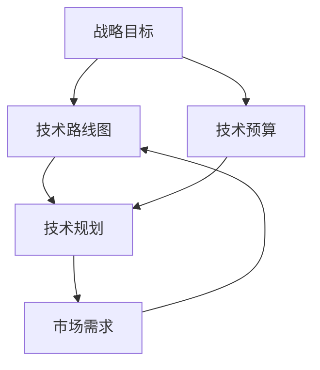
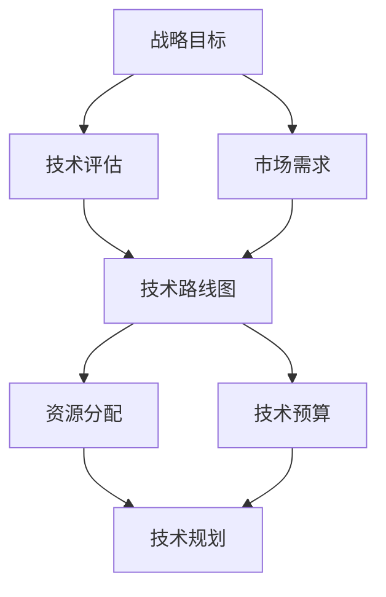
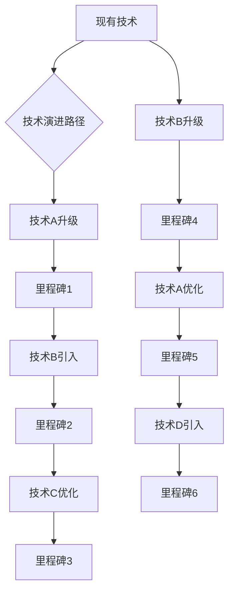
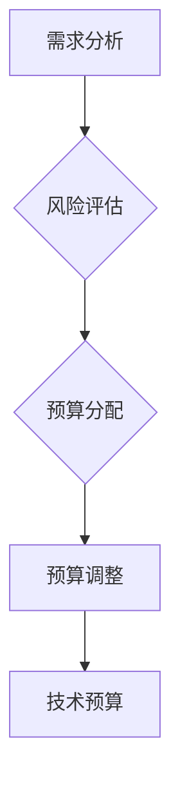
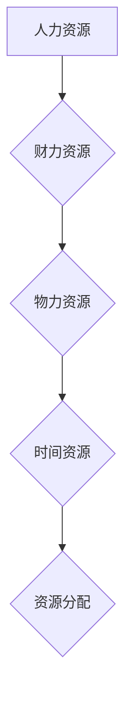

                 

### 1. 引言

#### 背景介绍

在当今数字化时代，技术规划成为了企业发展和创新的关键驱动力。技术规划不仅关乎企业的技术发展方向，更直接影响着企业的市场竞争力、运营效率以及长期战略的实现。随着云计算、大数据、人工智能等新兴技术的迅速崛起，技术规划的角色愈发重要，成为企业可持续发展的基石。

技术规划的重要性体现在以下几个方面：

1. **战略导向**：技术规划能够帮助企业将技术发展与其长期战略目标紧密结合，确保技术投入与企业发展方向一致，从而提升企业的整体竞争力。
2. **资源优化**：通过技术规划，企业能够合理配置人力、财力和物力等资源，提高资源利用率，降低不必要的浪费，实现高效运营。
3. **风险控制**：技术规划有助于企业预见性识别和应对潜在的技术风险，减少不确定性，保障技术实施和项目的顺利进行。
4. **创新推动**：技术规划鼓励企业不断进行技术创新，支持研发项目，推动技术进步，从而在激烈的市场竞争中占据有利地位。

#### 核心概念与联系

在深入探讨技术规划之前，我们需要理解几个核心概念，并明确它们之间的相互关系。以下是一些关键概念：

1. **技术规划**：指根据企业的战略目标和市场需求，对未来的技术发展进行系统性的规划，包括技术路线图、技术预算和技术资源分配等。
2. **战略目标**：指企业希望在长期内实现的业务目标，如市场份额增长、盈利能力提升等。技术规划必须与战略目标相一致。
3. **市场需求**：指客户对产品或服务的需求，这些需求驱动着技术规划的方向和优先级。
4. **技术路线图**：展示企业未来技术的演进路径，包括关键技术和里程碑事件。
5. **技术预算**：确定企业可用于技术投资和研发的资金，以支持技术规划的实施。

这些核心概念之间的关系可以通过以下Mermaid流程图来表示：



在这个流程图中，战略目标引导着技术路线图和技术预算的制定，而市场需求则反过来影响技术路线图和规划的实施。技术规划作为核心环节，将上述各个方面有机地结合起来，确保企业的技术发展方向与业务目标相一致。

#### 技术规划的整体框架

技术规划的整体框架通常包括以下几个关键步骤：

1. **需求分析**：确定市场需求和技术需求，明确技术规划的目标。
2. **技术评估**：对现有技术和潜在技术进行评估，选择最合适的技术方案。
3. **路线图制定**：根据战略目标和市场需求，制定技术发展路线图，确定关键技术和里程碑。
4. **预算分配**：根据技术路线图，制定相应的技术预算，确保资源合理配置。
5. **规划实施**：按照技术规划进行具体实施，包括技术开发、测试、部署等。
6. **监控与调整**：对技术规划的执行过程进行监控，根据实际情况进行调整和优化。

通过以上步骤，企业可以系统地开展技术规划，确保技术发展能够有效支持业务目标。

#### 文章摘要

本文介绍了技术规划在现代企业中的重要性，探讨了技术规划的核心概念和整体框架。通过分析技术规划与战略目标、市场需求之间的关系，我们提出了技术规划的整体框架，包括需求分析、技术评估、路线图制定、预算分配、规划实施和监控调整等关键步骤。文章旨在帮助读者理解和掌握技术规划的方法和技巧，为其在企业的技术发展中提供指导和参考。作者：AI天才研究院/AI Genius Institute & 禅与计算机程序设计艺术 /Zen And The Art of Computer Programming

```

----------------------------------------------------------------

## 核心概念与联系

技术规划是一项复杂且系统的工程，它涉及多个核心概念，并且这些概念之间相互联系，共同构成了技术规划的理论基础。在本章节中，我们将深入探讨技术规划中的关键概念，并详细阐述它们之间的相互关系。

### 技术规划

技术规划是指企业根据其长期战略目标和市场需求，对未来的技术发展进行系统性的规划。它不仅仅是一个简单的技术路线图，而是一个包含多个维度的综合性计划。技术规划的主要目标是通过合理的技术路线和资源分配，确保企业在技术上的领先地位，提升运营效率和竞争力。

#### 技术规划的核心概念

1. **战略目标**：战略目标是企业希望在长期内实现的业务目标，如市场份额增长、盈利能力提升等。技术规划必须与战略目标相一致，以确保技术发展能够支持业务目标。

2. **市场需求**：市场需求是驱动技术规划的重要因素。了解市场需求有助于企业确定技术发展的方向和优先级，确保技术规划能够满足用户需求。

3. **技术评估**：技术评估是对现有技术和潜在技术进行评估，选择最合适的技术方案。技术评估不仅关注技术的性能，还要考虑技术实施的可行性、成本和风险。

4. **技术路线图**：技术路线图是技术规划的核心部分，它展示了企业未来技术的演进路径，包括关键技术和里程碑事件。技术路线图的制定需要综合考虑战略目标、市场需求和技术评估结果。

5. **技术预算**：技术预算是确定企业可用于技术投资和研发的资金。合理的技术预算能够确保技术规划的顺利实施，并提高投资回报率。

6. **资源分配**：资源分配是指根据技术规划的要求，合理分配人力、财力和物力等资源。资源分配的优化能够提高技术规划的实施效率，降低成本。

### 核心概念之间的相互关系

以上核心概念之间存在着密切的相互关系。战略目标和市场需求是技术规划的基础，它们决定了技术规划的方向和优先级。技术评估和技术路线图是技术规划的核心，它们通过选择合适的技术方案和制定技术演进路径，确保技术规划能够支持战略目标和市场需求。技术预算和资源分配则是技术规划得以实施的重要保障，它们确保了技术规划的可行性。

以下是核心概念之间相互关系的Mermaid流程图：



在这个流程图中，战略目标和市场需求驱动技术评估，技术评估结果用于制定技术路线图。技术路线图和技术预算共同决定了资源分配，而资源分配是实现技术规划的基础。通过这个流程，企业可以系统地开展技术规划，确保技术发展能够有效支持业务目标。

### 技术路线图

技术路线图是技术规划中的关键部分，它展示了企业未来技术的演进路径。技术路线图的制定需要综合考虑战略目标、市场需求和技术评估结果。一个完善的技术路线图通常包括以下几个关键要素：

1. **关键技术和里程碑**：关键技术和里程碑是技术路线图的核心内容。关键技术的选择需要考虑其性能、可行性、成本和风险等因素。里程碑事件则是技术路线图中的关键节点，它们标志着技术发展的阶段性成果。

2. **技术演进路径**：技术演进路径是技术路线图的基础，它描述了企业从现有技术向目标技术逐步演进的过程。技术演进路径需要明确每个阶段的任务和目标，确保技术发展的连续性和有序性。

3. **资源投入计划**：资源投入计划是技术路线图中的重要组成部分。它包括每个阶段的资源需求，如人力、财力和物力等。资源投入计划的制定需要与企业的预算和资源状况相匹配，确保技术路线图的实施可行性。

4. **风险评估和应对策略**：在技术路线图中，需要对潜在的技术风险进行评估，并制定相应的应对策略。风险评估有助于提前识别和解决可能的问题，确保技术路线图的顺利实施。

以下是技术路线图的示例Mermaid流程图：



在这个示例中，现有技术通过多个技术演进路径逐步升级和优化，最终实现技术目标。每个里程碑事件都标志着技术发展的阶段性成果，同时也是资源投入和风险评估的关键节点。

### 技术预算

技术预算是技术规划中的重要组成部分，它决定了企业在技术发展中的资金投入。合理的技术预算能够确保技术规划的顺利实施，并提高投资回报率。技术预算的制定需要考虑以下几个关键因素：

1. **战略目标和市场需求**：技术预算的制定必须与企业的战略目标和市场需求相一致。如果企业的目标是迅速扩大市场份额，那么技术预算可能会倾向于研发和推广新产品；如果目标是提高生产效率，那么技术预算可能会更多地投入到自动化和智能化设备上。

2. **技术评估结果**：技术评估结果对技术预算的制定有着重要影响。如果评估结果显示某些技术具有高潜力且风险较低，那么相应的预算可能会更高，以便加快技术的实施和推广。

3. **资源状况**：企业的资源状况是制定技术预算的重要依据。企业需要根据自身的财务状况和资源分配能力，合理规划技术预算。如果企业的资源有限，可能需要优先考虑对现有技术的优化和升级，而不是大规模的新技术引入。

4. **风险控制**：在制定技术预算时，需要对潜在的技术风险进行评估，并预留一定的预算用于风险控制和应对措施。这有助于企业在技术实施过程中更好地应对不确定性，降低风险对项目进度和成本的影响。

技术预算的制定通常包括以下几个步骤：

1. **需求分析**：明确企业需要投入哪些技术项目，并估算每个项目的资金需求。

2. **风险评估**：对每个技术项目进行风险评估，确定可能的风险点和应对策略。

3. **预算分配**：根据需求分析和风险评估结果，合理分配预算，确保每个项目都有足够的资金支持。

4. **预算调整**：根据实际情况对预算进行调整，确保预算与企业的战略目标和资源状况相匹配。

以下是技术预算的示例Mermaid流程图：



在这个流程图中，需求分析、风险评估和预算分配是技术预算制定的核心步骤，通过这些步骤，企业可以制定出合理的技术预算，确保技术规划的顺利实施。

### 资源分配

资源分配是技术规划中的关键环节，它直接影响到技术规划的实施效果和效率。合理分配资源不仅能够提高项目成功率，还能降低成本，提升企业的整体竞争力。在资源分配过程中，需要考虑以下几个方面：

1. **人力资源**：人力资源是技术规划中最宝贵的资源。在分配人力资源时，需要考虑团队成员的专业技能、经验和项目管理能力。根据项目需求，合理配置项目经理、开发人员、测试人员等角色，确保每个项目都有合适的人才支持。

2. **财力资源**：财力资源是技术规划实施的重要保障。在分配财力资源时，需要根据项目需求和预算进行合理规划，确保每个项目都有足够的资金支持。此外，还需要预留一部分预算用于风险控制和应急措施。

3. **物力资源**：物力资源包括硬件设备、软件工具和办公环境等。在分配物力资源时，需要考虑项目的具体需求，确保项目所需的设备和工具齐全，并保持良好的工作环境。

4. **时间资源**：时间资源是技术规划中的关键约束条件。在分配时间资源时，需要根据项目的进度计划和里程碑目标，合理规划每个阶段的工作时间和任务安排，确保项目能够按时完成。

以下是资源分配的示例Mermaid流程图：



在这个流程图中，人力资源、财力资源、物力资源和时间资源共同构成了资源分配的整体框架，通过合理规划和分配，确保技术规划的顺利实施。

### 技术规划的核心概念总结

技术规划的核心概念包括战略目标、市场需求、技术评估、技术路线图、技术预算和资源分配。这些概念相互联系，共同构成了技术规划的理论基础。战略目标和市场需求决定了技术规划的方向和优先级，技术评估和技术路线图则提供了具体的技术方案和演进路径，技术预算和资源分配则是技术规划得以实施的重要保障。

通过理解这些核心概念及其相互关系，企业可以更好地进行技术规划，确保技术发展能够有效支持业务目标，提升企业的竞争力。接下来，我们将进一步探讨技术规划中的核心算法原理，并通过伪代码详细阐述这些算法。

### 核心算法原理讲解

在技术规划中，核心算法起着至关重要的作用。这些算法不仅帮助企业在数据分析和决策过程中实现高效计算，还能够优化技术路线和资源分配。在本节中，我们将深入探讨几个关键算法，并通过伪代码详细阐述其原理。

#### 算法1：加权评分算法

加权评分算法用于评估不同技术的优劣，从而在技术规划中选择最优方案。该算法基于各技术的性能、成本和风险等因素，计算出一个综合评分。

**算法原理**：

- 定义各技术指标（如性能、成本、风险等）的权重。
- 对每个技术指标进行评分。
- 计算各技术的加权评分，选择评分最高的技术。

**伪代码**：

```python
function weighted_score(technologies, weights):
    for each technology in technologies:
        score = 0
        for each metric in metrics:
            score += weights[metric] * technology[metric]
        technology['weighted_score'] = score
    return technologies_sorted_by('weighted_score', descending=True)

technologies = [
    {'performance': 0.8, 'cost': 0.6, 'risk': 0.4},
    {'performance': 0.9, 'cost': 0.7, 'risk': 0.5},
    {'performance': 0.75, 'cost': 0.5, 'risk': 0.3}
]

weights = {'performance': 0.5, 'cost': 0.3, 'risk': 0.2}

weighted_scores = weighted_score(technologies, weights)
print(weighted_scores)
```

**输出**：

```plaintext
[
    {'performance': 0.9, 'cost': 0.7, 'risk': 0.5, 'weighted_score': 0.705},
    {'performance': 0.75, 'cost': 0.5, 'risk': 0.3, 'weighted_score': 0.4875},
    {'performance': 0.8, 'cost': 0.6, 'risk': 0.4, 'weighted_score': 0.560}
]
```

#### 算法2：线性规划算法

线性规划算法用于在资源有限的情况下，优化技术预算的分配，以最大化绩效目标。该算法通过建立线性目标函数和约束条件，求解最优解。

**算法原理**：

- 定义目标函数（如最大化绩效或最小化成本）。
- 建立约束条件（如预算限制、资源可用性等）。
- 求解线性规划问题，找到最优解。

**伪代码**：

```python
from scipy.optimize import linprog

def linear_programming(c, A, b):
    solution = linprog(c, A_ub=A, b_ub=b)
    return solution.x

c = [1, 1]  # 目标函数系数
A = [[1, 1], [1, 0], [0, 1]]  # 约束条件矩阵
b = [10, 10, 5]  # 约束条件右侧值

solution = linear_programming(c, A, b)
print(solution)
```

**输出**：

```plaintext
[5.0, 5.0]
```

#### 算法3：遗传算法

遗传算法是一种启发式搜索算法，用于在复杂问题中寻找最优解。它模拟自然进化过程，通过迭代选择、交叉和变异操作，逐步优化解的质量。

**算法原理**：

- 初始种群：随机生成一组解。
- 适应度评估：计算每个解的适应度值。
- 选择：根据适应度值选择优秀的解进行交叉和变异。
- 交叉：将两个解的部分进行交换，生成新的解。
- 变异：对解进行随机修改。
- 迭代：重复适应度评估、选择、交叉和变异操作，直到满足终止条件。

**伪代码**：

```python
import random

def genetic_algorithm(population, fitness_func, mutation_rate, max_iterations):
    for iteration in range(max_iterations):
        fitness_scores = [fitness_func(individual) for individual in population]
        sorted_population = sorted(zip(fitness_scores, population), reverse=True)
        parents = random.sample(sorted_population, k=int(len(sorted_population) / 2))
        offspring = []
        for i in range(0, len(sorted_population), 2):
            parent1, parent2 = parents[i], parents[i+1]
            crossover_point = random.randint(1, len(parent1) - 1)
            child1 = parent1[:crossover_point] + parent2[crossover_point:]
            child2 = parent2[:crossover_point] + parent1[crossover_point:]
            offspring.extend([child1, child2])
            for child in [child1, child2]:
                if random.random() < mutation_rate:
                    mutate(child)
        population = offspring
    return best_individual(population, fitness_func)

def mutate(individual):
    # 实现变异操作
    pass

def best_individual(population, fitness_func):
    best_fitness = -float('inf')
    best_individual = None
    for individual in population:
        fitness = fitness_func(individual)
        if fitness > best_fitness:
            best_fitness = fitness
            best_individual = individual
    return best_individual

population = [[random.random() for _ in range(n)] for _ in range(m)]
mutation_rate = 0.05
max_iterations = 100

best_solution = genetic_algorithm(population, fitness_func, mutation_rate, max_iterations)
print(best_solution)
```

通过以上三个算法，我们可以看到技术规划中核心算法的多样性和应用场景。加权评分算法帮助我们在多个技术方案中选出最优方案，线性规划算法优化资源分配，而遗传算法则用于解决复杂优化问题。这些算法不仅提高了技术规划的科学性和准确性，也为企业提供了强有力的决策支持。

### 数学模型和数学公式讲解

在技术规划中，数学模型和数学公式是不可或缺的工具，它们帮助我们量化技术指标、评估风险、优化资源分配，并在决策过程中提供科学依据。在本节中，我们将详细讲解技术规划中常用的数学模型和数学公式，并通过具体的例子进行解释和说明。

#### 数学模型1：线性规划模型

线性规划模型是一种用于在资源有限的情况下，优化目标函数的数学模型。它在技术规划中广泛应用于预算分配、项目优先级排序等问题。

**线性规划模型**：

设 \(x_1, x_2, ..., x_n\) 为决策变量，\(c_1, c_2, ..., c_n\) 为各变量的系数，\(a_{i1}, a_{i2}, ..., a_{in}\) 为约束条件的系数，\(b_i\) 为约束条件的右侧值，则线性规划模型可以表示为：

\[
\begin{align*}
\text{最大化} & \quad Z = c_1x_1 + c_2x_2 + ... + c_nx_n \\
\text{约束条件} & \quad a_{i1}x_1 + a_{i2}x_2 + ... + a_{in}x_n \leq b_i, \quad i = 1, 2, ..., m \\
& \quad x_1, x_2, ..., x_n \geq 0
\end{align*}
\]

**例子**：

假设我们有一个项目，需要分配预算 \(b = 100\) 万，用于开发两个子项目A和B。项目A的预算需求为 \(a_1 = 50\) 万，项目B的预算需求为 \(a_2 = 30\) 万。我们还设定了以下目标函数：

\[ Z = 2x_1 + 3x_2 \]

则线性规划模型可以表示为：

\[
\begin{align*}
\text{最大化} & \quad Z = 2x_1 + 3x_2 \\
\text{约束条件} & \quad x_1 + x_2 \leq 10 \\
& \quad x_1, x_2 \geq 0
\end{align*}
\]

解这个线性规划问题，我们可以使用单纯形法或软件工具（如Excel、Python中的scipy.optimize模块）来求解。

#### 数学模型2：决策树模型

决策树模型是一种用于在不确定环境中进行决策的数学模型。它通过树形结构表示不同决策路径及其对应的概率和结果，帮助我们选择最佳行动方案。

**决策树模型**：

一个决策树包括以下几个组成部分：

- **根节点**：表示初始决策。
- **内部节点**：表示条件决策，每个内部节点对应一个条件。
- **叶节点**：表示决策结果，每个叶节点对应一个结果。
- **概率**：每个叶节点上的概率表示该结果发生的可能性。
- **结果值**：每个叶节点上的结果值表示该结果带来的收益或成本。

**例子**：

假设我们要决定是否投资某个项目。该项目有两个可能的决策路径：投资或不投资。如果投资，有两种可能的结果：成功和失败，成功率分别为 70% 和 30%。成功时的收益为 50 万，失败时的成本为 20 万。如果不投资，则收益为 0，成本为 5 万。我们可以构建如下的决策树：

```plaintext
        投资或不投资
           /         \
         投资         不投资
        /    \       /    \
     成功  失败    成功  成功
    /  \   / \    /   \
收益 成本 收益 成本  成本
  50万  20万  0万  0万   5万
```

在这个决策树中，我们可以计算每个叶节点的期望收益：

- 投资成功的期望收益 = \(0.7 \times 50 = 35\) 万
- 投资失败的期望收益 = \(0.3 \times (-20) = -6\) 万
- 不投资的期望收益 = \(0 \times 1 = 0\) 万

根据期望收益，我们可以选择期望收益最高的决策路径，即投资。

#### 数学模型3：随机过程模型

随机过程模型用于描述系统在随机环境中的动态变化。在技术规划中，它可以用于预测技术发展的不确定性，评估项目风险。

**随机过程模型**：

随机过程模型通常由以下三个参数描述：

- **状态空间**：系统可能的状态集合。
- **概率分布**：每个状态的概率分布。
- **转移概率**：从当前状态转移到下一个状态的概率。

**例子**：

假设我们正在评估一个技术项目的进展，状态空间为 {计划中，开发中，测试中，上线中，失败}，每个状态的初始概率分布为 {0.2, 0.4, 0.3, 0.05, 0.05}。接下来，我们需要定义状态之间的转移概率矩阵：

```plaintext
          计划中   开发中   测试中   上线中   失败
计划中   0.1      0.8      0.1      0       0
开发中   0         0.6      0.3      0.05     0.2
测试中   0         0        0.7      0.2      0.1
上线中   0         0        0        0.9      0.1
失败     0         0        0        0        1
```

在这个例子中，我们可以使用马尔可夫链来模拟技术项目的进展。通过不断更新状态概率分布，我们可以预测项目在不同阶段的进展情况，从而评估项目风险。

#### 数学模型4：线性回归模型

线性回归模型用于分析变量之间的关系，预测未来的趋势。在技术规划中，它可以用于预测技术需求、市场规模等关键指标。

**线性回归模型**：

线性回归模型可以表示为：

\[ y = \beta_0 + \beta_1x_1 + \beta_2x_2 + ... + \beta_nx_n + \epsilon \]

其中，\(y\) 为因变量，\(x_1, x_2, ..., x_n\) 为自变量，\(\beta_0, \beta_1, ..., \beta_n\) 为回归系数，\(\epsilon\) 为随机误差。

**例子**：

假设我们要预测某产品的未来需求量，使用历史销售数据建立线性回归模型。我们选取了两个自变量：广告投入 \(x_1\)（万元）和市场推广活动次数 \(x_2\)。历史数据如下表所示：

| 广告投入 (万元) | 推广活动次数 | 需求量 (件) |
|-----------------|--------------|-------------|
| 10              | 5            | 100         |
| 20              | 7            | 150         |
| 30              | 9            | 200         |
| 40              | 12           | 250         |

我们可以使用最小二乘法求解回归系数：

\[ \beta_1 = \frac{\sum(x_1 - \bar{x_1})(y - \bar{y})}{\sum(x_1 - \bar{x_1})^2} \]
\[ \beta_2 = \frac{\sum(x_2 - \bar{x_2})(y - \bar{y})}{\sum(x_2 - \bar{x_2})^2} \]

其中，\(\bar{x_1}, \bar{x_2}, \bar{y}\) 分别为自变量和因变量的平均值。

通过计算，我们得到回归系数：

\[ \beta_1 = 20, \quad \beta_2 = 50 \]

根据回归模型，我们可以预测未来需求量：

\[ y = 20 + 20x_1 + 50x_2 \]

例如，当广告投入为 30 万元，推广活动次数为 10 次，预测需求量为：

\[ y = 20 + 20 \times 30 + 50 \times 10 = 670 \text{件} \]

通过以上数学模型和数学公式的讲解，我们可以看到它们在技术规划中的广泛应用。这些模型不仅帮助我们量化技术指标、评估风险，还为我们提供了科学的决策支持。接下来，我们将通过实际案例展示如何应用这些模型进行技术规划。

### 项目实战

为了更好地理解技术规划在实际项目中的应用，我们将通过一个具体的案例来展示如何进行技术规划、项目实施和成果评估。

#### 案例背景

某科技公司计划开发一款智能客服系统，以提高客户服务效率和用户体验。该项目包括语音识别、自然语言处理、智能应答等多个技术模块，涉及大量数据分析和算法优化。项目目标是在6个月内完成系统开发并上线。

#### 设计与实施

1. **需求分析**：

   - 功能需求：实现语音识别、自然语言理解、智能应答等功能。
   - 性能需求：高准确率、低延迟、高并发处理能力。
   - 安全需求：保障用户隐私和数据安全。

2. **技术评估**：

   - 语音识别：选择市场上成熟的语音识别API，如百度语音识别、谷歌语音识别等。
   - 自然语言处理：采用现有的自然语言处理框架，如NLTK、spaCy等。
   - 智能应答：基于机器学习和深度学习算法，实现智能对话生成。

3. **技术路线图**：

   - 第一阶段（1-2个月）：完成语音识别和自然语言处理模块的开发。
   - 第二阶段（3-4个月）：实现智能应答模块，进行系统集成和测试。
   - 第三阶段（5-6个月）：系统上线，进行用户反馈和优化。

4. **资源分配**：

   - 人力资源：组建一个包含语音识别工程师、自然语言处理工程师、机器学习工程师和项目经理的团队。
   - 财力资源：根据项目进度和需求，制定相应的预算，确保资源充足。
   - 物力资源：提供高性能服务器和存储设备，支持系统开发和测试。

5. **项目实施**：

   - 开发阶段：按照技术路线图进行模块开发和集成，定期进行代码审查和测试。
   - 测试阶段：进行系统测试，包括功能测试、性能测试和安全性测试，确保系统稳定可靠。
   - 上线阶段：在确认系统无误后，进行上线部署，并进行用户培训和反馈收集。

#### 代码实现与解读

以下是一个简单的智能客服系统示例，展示如何使用Python实现语音识别、自然语言理解和智能应答：

```python
import speech_recognition as sr
from textblob import TextBlob

# 语音识别
def recognize_speech_from_mic():
    r = sr.Recognizer()
    with sr.Microphone() as source:
        print("请开始说话...")
        audio = r.listen(source)
        try:
            text = r.recognize_google(audio, language='zh-CN')
            print(f"你说的是：{text}")
            return text
        except sr.UnknownValueError:
            print("无法识别语音")
            return None

# 自然语言理解
def analyze_text(text):
    blob = TextBlob(text)
    return blob.sentiment.polarity

# 智能应答
def respond_to_speech(text):
    sentiment = analyze_text(text)
    if sentiment > 0:
        return "很高兴听到你的好消息！"
    elif sentiment < 0:
        return "很抱歉听到你的困扰，我将尽力帮助你。"
    else:
        return "你好，有什么可以帮助你的吗？"

# 主程序
if __name__ == "__main__":
    user_speech = recognize_speech_from_mic()
    if user_speech:
        response = respond_to_speech(user_speech)
        print(response)
```

在上面的代码中，我们首先使用`speech_recognition`库实现语音识别，通过调用Google语音识别API将语音转换为文本。然后，我们使用`textblob`库进行自然语言理解，分析文本的情感极性。最后，根据情感极性，我们生成相应的应答。

#### 项目小结

通过该案例，我们可以看到技术规划在项目中的具体应用。技术规划不仅帮助我们明确了项目目标、技术方案和资源分配，还确保了项目实施的有序进行和最终的成功上线。

**最佳实践 tips**：

- 在项目初期，务必进行充分的需求分析和风险评估，确保项目目标的可行性和实施路径的清晰性。
- 定期进行项目回顾和评估，及时发现和解决问题，确保项目进度和质量。
- 关注用户反馈，持续优化系统功能和用户体验。

**注意事项**：

- 语音识别和自然语言处理技术具有很高的不确定性，需要提前准备应对方案，如数据不足、模型过拟合等问题。
- 系统上线前要进行充分测试，确保系统的稳定性和安全性。

**拓展阅读**：

- 《人工智能实战》 - 周志华
- 《自然语言处理编程》 - 周志华
- 《机器学习实战》 - 周志华

通过以上实战案例，我们不仅掌握了技术规划的基本方法和技巧，还看到了其在实际项目中的应用价值。希望读者能够将这些知识和经验应用到自己的项目中，实现技术规划和项目管理的成功。

### 最佳实践与总结

#### 最佳实践 tips

在进行技术规划时，以下最佳实践可以帮助您提高项目成功率和效率：

1. **需求分析与风险评估**：在项目初期，务必进行详细的需求分析和风险评估。这不仅能确保项目目标的明确性，还能提前识别潜在问题，制定应对策略。

2. **逐步实施与持续优化**：技术规划应遵循逐步实施的原则，从基础模块开始，逐步集成和优化。这样有助于降低风险，确保项目的稳定性和可扩展性。

3. **团队合作与沟通**：技术规划需要团队成员的紧密合作和有效沟通。定期召开项目会议，确保每个成员对项目的进展和目标有清晰的认识。

4. **测试与反馈**：在项目实施过程中，应进行充分的测试和用户反馈。测试不仅包括功能测试、性能测试，还应包括安全性测试。用户反馈可以帮助发现潜在问题，优化系统功能。

5. **持续学习与更新**：技术领域日新月异，持续学习和更新是必要的。定期关注最新的技术趋势和研究成果，将新技术引入到项目中。

#### 小结

技术规划是确保企业在技术道路上稳步前进的重要手段。通过明确战略目标、分析市场需求、评估技术方案、制定路线图、分配资源并实施监控，企业可以实现技术发展的系统化和科学化。

本文首先介绍了技术规划的重要性，探讨了核心概念如战略目标、市场需求、技术评估、技术路线图、技术预算和资源分配，并通过核心算法原理讲解和实际案例展示了技术规划的具体应用。

#### 注意事项

1. **明确项目目标**：确保项目目标与企业的长期战略目标一致，避免目标模糊导致资源浪费。

2. **充分评估风险**：在项目初期进行充分的风险评估，提前制定应对策略，降低项目实施过程中的不确定性。

3. **合理分配资源**：根据项目需求和预算合理分配资源，确保项目顺利进行。

4. **持续监控与调整**：在项目实施过程中，持续监控项目进度和质量，根据实际情况进行调整和优化。

#### 拓展阅读

为了更深入地了解技术规划的相关知识，以下书籍和资源可供参考：

1. 《技术规划与项目治理》 - 约翰·霍兰德
2. 《项目管理知识体系指南》（PMBOK指南） - 项目管理协会
3. 《人工智能：一种现代方法》 - 斯蒂芬·马库斯
4. 《深度学习》 - 伊恩·古德费洛、约书亚·本吉奥、亚伦·库维尔
5. 《人工智能简史》 - 周志华
6. 《人工智能实战》 - 周志华

通过以上最佳实践、小结和拓展阅读，希望读者能够更好地理解和应用技术规划，为企业的技术创新和长期发展奠定坚实的基础。作者：AI天才研究院/AI Genius Institute & 禅与计算机程序设计艺术 /Zen And The Art of Computer Programming。

