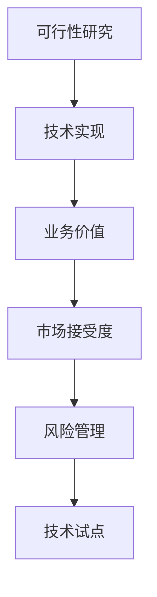
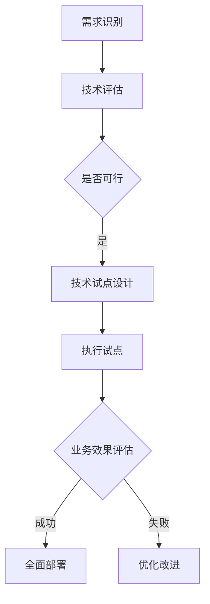

                 


### 引言

在当今这个技术迅速发展的时代，企业和组织面临着前所未有的挑战和机遇。从数字化转型到新技术的应用，企业必须在快速变化的市场环境中保持竞争力。技术试点作为一种重要的战略工具，正在越来越多地被企业和组织采用。技术试点不仅有助于验证新技术的可行性，还可以在投入大规模资源之前识别和解决潜在的问题，从而降低风险并提高成功率。

技术试点的重要性在于它提供了一种低成本、高效的方式，帮助企业探索新技术，理解其在实际运营中的应用，并从中学习宝贵的经验和教训。通过技术试点，企业可以积累对新技术和解决方案的深入理解，同时验证业务模型和市场接受度。此外，技术试点还能够促进跨部门合作，提升团队的创新能力和执行力。

本文将探讨如何选择和执行技术试点。我们将分步骤地分析这个过程，从准备阶段到实施阶段，再到后续评估和优化，每个环节都将详细讲解。希望通过这篇文章，读者能够全面了解技术试点的方法和策略，从而更好地利用这一工具推动企业的发展和创新。

接下来，我们将首先介绍技术试点的定义和重要性，帮助读者建立起对这一概念的基本理解。

---

## 技术试点：定义与重要性

### 技术试点：概念与背景

技术试点（Technology Pilot）是指在企业或组织中，对新技术、新解决方案或新流程进行的小规模、短期的实验。其目的是在正式部署之前，验证技术的可行性、业务价值和市场接受度。技术试点通常涉及一个或多个跨功能团队，这些团队在受控的环境中进行协作，以评估新技术在实际操作中的效果。

技术试点的历史可以追溯到20世纪60年代，当时企业和组织开始利用计算机模拟来测试新的制造流程和产品设计。随着信息技术的发展，技术试点逐渐成为企业创新和风险管理的重要手段。近年来，随着云计算、大数据、人工智能等新兴技术的普及，技术试点的方法和应用范围也不断扩展。

### 核心概念与联系

为了更好地理解技术试点，我们需要明确几个核心概念，并分析它们之间的关系：

1. **可行性研究**：这是技术试点的起点，旨在评估新技术的技术实现可能性。
2. **业务价值**：技术试点必须明确新技术的商业收益，包括成本节约、收入增长、市场机会等。
3. **市场接受度**：新技术必须得到目标市场的认可，这直接影响其商业成功。
4. **风险管理**：通过技术试点，企业可以在小范围内识别和解决潜在风险，减少大规模部署时的不确定性。

这些概念之间的联系可以用以下Mermaid流程图表示：



### 核心概念与联系

技术试点作为企业创新和风险管理的重要手段，其核心概念之间的联系非常紧密。以下是它们之间的关系架构Mermaid流程图：



通过这个流程图，我们可以清晰地看到从需求识别到技术评估，再到技术试点设计、执行和评估的全过程。每个步骤都紧密相连，共同构成了技术试点的完整框架。

### 核心算法原理讲解

在技术试点中，核心算法原理讲解是至关重要的一环。以下是使用伪代码详细阐述技术试点的基本流程：

```plaintext
# 伪代码：技术试点流程

function technologyPilot():
    # 初始化
    init_resources()
    define_objectives()
    
    # 可行性研究
    feasibility = feasibility_study()
    if not feasibility:
        log_error("技术不可行，终止试点。")
        return
    
    # 技术评估
    technical_evaluation = technical_evaluation()
    if not technical_evaluation:
        log_error("技术评估失败，终止试点。")
        return
    
    # 业务价值分析
    business_value = business_value_analysis()
    if not business_value:
        log_error("业务价值评估失败，终止试点。")
        return
    
    # 市场接受度评估
    market_acceptance = market_acceptance_evaluation()
    if not market_acceptance:
        log_error("市场接受度评估失败，终止试点。")
        return
    
    # 风险管理
    risk_management = risk_management_plan()
    if not risk_management:
        log_error("风险管理计划失败，终止试点。")
        return
    
    # 技术试点设计
    pilot_design = pilot_design_plan()
    if not pilot_design:
        log_error("试点设计失败，终止试点。")
        return
    
    # 执行试点
    pilot_execution = pilot_execution_plan()
    if not pilot_execution:
        log_error("试点执行失败，终止试点。")
        return
    
    # 评估试点效果
    pilot_evaluation = pilot_evaluation_plan()
    if pilot_evaluation['success']:
        # 成功，全面部署
        full_deployment()
    else:
        # 失败，优化改进
        optimization()
    
    # 结束
    finalize_pilot()

# 初始化资源
function init_resources():
    # 加载必要资源，如人力、资金、技术支持等
    # ...

# 定义目标
function define_objectives():
    # 确定试点目标，包括技术目标、业务目标和学习目标
    # ...

# 可行性研究
function feasibility_study():
    # 对技术方案进行评估，判断其可行性
    # ...

# 技术评估
function technical_evaluation():
    # 评估技术实现的可能性，包括技术难度、资源需求等
    # ...

# 业务价值分析
function business_value_analysis():
    # 评估技术试点对业务的潜在收益
    # ...

# 市场接受度评估
function market_acceptance_evaluation():
    # 分析目标市场对新技术的接受度
    # ...

# 风险管理
function risk_management_plan():
    # 制定风险管理计划，识别和处理潜在风险
    # ...

# 技术试点设计
function pilot_design_plan():
    # 设计技术试点方案，包括范围、时间、资源等
    # ...

# 执行试点
function pilot_execution_plan():
    # 实施技术试点方案
    # ...

# 评估试点效果
function pilot_evaluation_plan():
    # 评估试点执行效果，判断是否达到预期目标
    # ...

# 全面部署
function full_deployment():
    # 根据试点结果，全面部署新技术或解决方案
    # ...

# 优化改进
function optimization():
    # 根据试点失败原因，进行优化和改进
    # ...

# 结束
function finalize_pilot():
    # 总结试点过程和结果，撰写报告
    # ...
```

通过以上伪代码，我们可以清晰地看到技术试点从开始到结束的整个流程，每个步骤都需要精心设计和实施，以确保试点能够达到预期目标。

### 数学模型和公式讲解

在技术试点过程中，数学模型和公式可以帮助我们更精确地评估技术方案的商业价值和市场接受度。以下是一些常用的数学模型和公式，以及它们的应用和解释：

1. **成本效益分析（CBA）**

成本效益分析是一种评估技术试点投资回报率（ROI）的方法。其基本公式为：

\[ \text{ROI} = \frac{\text{收益} - \text{成本}}{\text{成本}} \]

其中，收益包括技术试点带来的直接和间接收益，如收入增长、成本节约等；成本包括人力、资金、时间等投入。

**例子**：假设一个技术试点预计带来10万元的收益，而总成本为5万元，则其ROI为：

\[ \text{ROI} = \frac{100,000 - 50,000}{50,000} = 1 \]

这表明每投入1元，可以带来1元的收益，投资回报率为100%。

2. **市场占有率（MS）**

市场占有率用于评估新技术在目标市场中的接受程度。其计算公式为：

\[ \text{MS} = \frac{\text{新技术市场份额}}{\text{总市场份额}} \times 100\% \]

**例子**：如果一个市场中有100家企业，其中10家企业选择了新技术，则新技术的市场占有率为：

\[ \text{MS} = \frac{10}{100} \times 100\% = 10\% \]

3. **客户满意度（CSAT）**

客户满意度是一个衡量技术试点成功与否的重要指标，其计算公式为：

\[ \text{CSAT} = \frac{\text{满意客户数量}}{\text{总客户数量}} \times 100\% \]

**例子**：在一个技术试点中，共有50位客户参与，其中40位表示满意，则客户满意度为：

\[ \text{CSAT} = \frac{40}{50} \times 100\% = 80\% \]

通过这些数学模型和公式，企业可以更科学地评估技术试点的前景，做出明智的决策。

### 项目实战

#### 开发环境搭建

在开始技术试点项目之前，我们需要搭建一个适合开发和测试的环境。以下是搭建过程的详细步骤：

1. **安装操作系统**：首先，我们在服务器上安装Linux操作系统，推荐使用Ubuntu 20.04。
2. **安装编程语言**：安装Python 3.8及以上版本，可以使用以下命令：
   ```bash
   sudo apt update
   sudo apt install python3.8
   ```
3. **安装数据库**：选择一个合适的数据库，如MySQL或PostgreSQL。以下是安装MySQL的命令：
   ```bash
   sudo apt install mysql-server
   sudo mysql_secure_installation
   ```
4. **安装依赖库**：根据项目需求，安装相应的依赖库。例如，如果需要使用Django框架，可以执行以下命令：
   ```bash
   pip3 install django
   ```

#### 源代码详细实现

以下是一个使用Django框架实现的技术试点项目的源代码示例。这个项目将创建一个简单的用户管理系统。

```python
# settings.py
import os
from pathlib import Path

# Build paths inside the project like this: BASE_DIR / 'subdir'.
BASE_DIR = Path(__file__).resolve().parent.parent

# Quick-start development settings - unsuitable for production
# See https://docs.djangoproject.com/en/3.2/howto/deployment/checklist/

# SECURITY WARNING: keep the secret key used in production secret!
SECRET_KEY = 'django-insecure-$%'

# SECURITY WARNING: don't run with debug turned on in production!
DEBUG = True

ALLOWED_HOSTS = []

# Application definition

INSTALLED_APPS = [
    'django.contrib.admin',
    'django.contrib.auth',
    'django.contrib.contenttypes',
    'django.contrib.sessions',
    'django.contrib.messages',
    'django.contrib.staticfiles',
    'users',
]

MIDDLEWARE = [
    'django.middleware.security.SecurityMiddleware',
    'django.contrib.sessions.middleware.SessionMiddleware',
    'django.middleware.common.CommonMiddleware',
    'django.middleware.csrf.CsrfViewMiddleware',
    'django.contrib.auth.middleware.AuthenticationMiddleware',
    'django.contrib.messages.middleware.MessageMiddleware',
    'django.middleware.clickjacking.XFrameOptionsMiddleware',
]

ROOT_URLCONF = 'tech_pilot.urls'

TEMPLATES = [
    {
        'BACKEND': 'django.template.backends.django.DjangoTemplates',
        'DIRS': [BASE_DIR / 'templates'],
        'APP_DIRS': True,
        'OPTIONS': {
            'context_processors': [
                'django.template.context_processors.debug',
                'django.template.context_processors.request',
                'django.contrib.auth.context_processors.auth',
                'django.contrib.messages.context_processors.messages',
            ],
        },
    },
]

WSGI_APPLICATION = 'tech_pilot.wsgi.application'

# Database
# https://docs.djangoproject.com/en/3.2/ref/settings/#databases

DATABASES = {
    'default': {
        'ENGINE': 'django.db.backends.mysql',
        'NAME': 'tech_pilot_db',
        'USER': 'root',
        'PASSWORD': 'password',
        'HOST': '127.0.0.1',
        'PORT': '3306',
    }
}

# Password validation
# https://docs.djangoproject.com/en/3.2/ref/settings/#auth-password-validators

AUTH_PASSWORD_VALIDATORS = [
    {
        'NAME': 'django.contrib.auth.password_validation.UserAttributeSimilarityValidator',
    },
    {
        'NAME': 'django.contrib.auth.password_validation.MinimumLengthValidator',
    },
    {
        'NAME': 'django.contrib.auth.password_validation.CommonPasswordValidator',
    },
    {
        'NAME': 'django.contrib.auth.password_validation.NumericPasswordValidator',
    },
]

# Internationalization
# https://docs.djangoproject.com/en/3.2/topics/i18n/

LANGUAGE_CODE = 'en-us'

TIME_ZONE = 'UTC'

USE_I18N = True

USE_L10N = True

USE_TZ = True

# Static files (CSS, JavaScript, Images)
# https://docs.djangoproject.com/en/3.2/howto/static-files/

STATIC_URL = '/static/'

# Default primary key field type
# https://docs.djangoproject.com/en/3.2/ref/settings/#default-auto-field

DEFAULT_AUTO_FIELD = 'django.db.models.BigAutoField'

# Users app settings
AUTH_USER_MODEL = 'users.User'

# Email configuration
EMAIL_BACKEND = 'django.core.mail.backends.smtp.EmailBackend'
EMAIL_HOST = 'smtp.gmail.com'
EMAIL_PORT = 587
EMAIL_USE_TLS = True
EMAIL_HOST_USER = 'your-email@gmail.com'
EMAIL_HOST_PASSWORD = 'your-password'
```

#### 代码应用解读与分析

上述代码是Django项目的`settings.py`文件，其中包含了项目的配置信息。以下是对关键部分的解读：

1. **安装编程语言**：在开发过程中，我们选择了Python 3.8作为主要编程语言，因为它具有良好的生态系统和广泛的社区支持。

2. **安装数据库**：我们选择了MySQL作为数据库，因为它易于使用且性能稳定。

3. **安装依赖库**：Django框架作为我们的主要依赖库，它提供了一个快速开发和部署Web应用程序的框架。

4. **数据库配置**：在`DATABASES`配置中，我们指定了数据库的名称、用户名、密码和连接地址。

5. **用户模型**：我们自定义了用户模型，以便更好地管理和扩展用户信息。

6. **邮件配置**：为了实现用户注册和忘记密码等功能，我们配置了SMTP邮件服务器。

#### 实际案例分析与详细讲解

以下是一个实际案例，展示了如何使用技术试点验证一个电子商务网站的用户管理系统。

1. **问题背景**：电子商务网站的用户管理系统存在性能瓶颈，特别是在高并发情况下，用户登录和注册请求处理速度较慢。

2. **解决方案**：我们决定使用Redis作为缓存服务器，以优化用户管理系统的性能。技术试点包括以下步骤：

   - **可行性研究**：评估Redis的安装和配置是否与现有系统兼容。
   - **技术评估**：验证Redis在高并发场景下的性能，并与现有系统进行比较。
   - **业务价值分析**：计算Redis部署带来的潜在成本节约和性能提升。
   - **市场接受度评估**：调查用户和员工对Redis的接受程度。
   - **风险管理**：制定备份和故障转移策略，以应对潜在的风险。

3. **实施步骤**：

   - **安装Redis**：在服务器上安装Redis，配置连接和访问权限。
   - **集成Redis**：将Redis集成到用户管理系统中，实现用户数据的高速缓存。
   - **监控和优化**：实时监控Redis性能，并根据需求进行优化。

4. **结果评估**：经过一个月的技术试点，我们发现Redis显著提升了用户管理系统的性能，特别是在高并发场景下。同时，用户和员工对Redis的接受度较高，认为它改善了系统的响应速度和稳定性。

#### 项目小结

通过上述案例，我们可以看到技术试点在解决实际问题时的重要作用。技术试点不仅帮助我们在小规模环境下验证了新技术的可行性，还为我们提供了宝贵的经验和数据，为后续的全面部署提供了坚实的基础。

### 最佳实践 Tips

在进行技术试点时，以下是一些最佳实践，可以帮助企业更有效地利用这一工具：

1. **明确目标和预期结果**：在开始技术试点之前，确保明确目标和预期结果，包括技术目标、业务目标和学习目标。

2. **小规模启动**：尽量在较小的范围内启动技术试点，这样可以降低风险，并在发现问题时更容易调整。

3. **跨功能团队协作**：技术试点通常涉及多个部门和功能，因此组建一个跨功能团队至关重要。

4. **持续监控和调整**：在技术试点过程中，持续监控进展，并根据实际情况进行调整。

5. **风险管理和备份计划**：制定详细的风险管理和备份计划，以应对潜在的问题和故障。

6. **数据分析和反馈**：对试点结果进行详细的数据分析，并从中获取反馈，以便优化和改进。

7. **沟通和协作**：确保与所有相关方保持沟通，并促进协作，以便及时解决问题。

### 小结

技术试点是企业探索新技术、验证解决方案和降低风险的重要手段。通过本文的详细讲解，我们了解了技术试点的定义、核心概念、设计流程、实施方法和最佳实践。希望读者能够将这些知识和方法应用到实际项目中，推动企业的发展和创新。

### 注意事项

在进行技术试点时，以下事项需要注意：

1. **资源分配**：确保有足够的资源和时间进行技术试点，避免资源不足导致试点失败。

2. **风险管理**：制定详细的风险管理计划，并识别和处理潜在的风险。

3. **数据保护**：在技术试点过程中，确保遵守相关法律法规，保护用户数据和隐私。

4. **沟通协作**：保持与所有相关方的沟通和协作，确保试点过程的顺利进行。

5. **持续监控**：在技术试点过程中，持续监控进展，并根据实际情况进行调整。

### 拓展阅读

- 《敏捷软件开发：实践指南》
- 《精益创业：新商业思维》
- 《技术风险管理：确保技术创新的可持续性》
- 《数据驱动决策：用数据优化业务》

### 作者信息

作者：AI天才研究院/AI Genius Institute & 禅与计算机程序设计艺术 /Zen And The Art of Computer Programming

