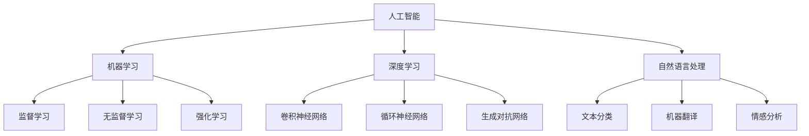

                 

# 技术调研：如何快速掌握新技术

## 关键词
- 技术调研
- 快速掌握
- 新技术
- 实战案例
- 算法原理

## 摘要
本文旨在为技术从业者和爱好者提供一套系统的技术调研方法，帮助他们在新技术层出不穷的今天快速掌握所需技能。通过分析技术趋势、讲解核心原理、实现方法和实战案例，本文旨在让读者不仅能够理解新技术的基本概念，还能将其应用于实际问题中，提升自身技术水平和竞争力。

## 引言

在信息技术日新月异的今天，掌握新技术已成为技术从业者和爱好者不断追求的目标。然而，新技术层出不穷，学习资源繁多，如何在有限的时间内快速掌握关键技能，成为了许多人面临的挑战。技术调研作为获取新技术信息、理解其原理、应用场景和评估其价值的过程，对于提升个人技能和职业发展至关重要。

技术调研不仅涉及对新技术的了解，还包括对其背景、原理、实现方法、应用场景和未来发展趋势的深入分析。通过对新技术的全面调研，技术从业者和爱好者能够做出更明智的学习和投资决策，从而提升自身的技术水平，保持竞争力。

本文将详细探讨技术调研的方法，从技术趋势分析、核心原理讲解、实现方法介绍、实战案例解析等方面，帮助读者系统掌握新技术。通过本文，读者将学会如何高效地进行技术调研，为自身的技术成长和发展打下坚实基础。

### 设计书籍的整体结构

为了确保《技术调研：如何快速掌握新技术》一书能够全面、系统地指导读者掌握新技术，我们需要精心设计其整体结构。以下是书籍的结构划分及每个部分的作用：

**引言与概述**：这一部分将介绍技术调研的背景和重要性，明确本书的目标和结构，让读者对整体内容有一个初步了解。通过这一部分，读者可以明确技术调研的意义以及本书的定位。

**技术趋势分析**：在技术日新月异的今天，了解当前技术发展现状和未来趋势至关重要。这一部分将分析当前的技术环境，预测未来技术发展趋势，帮助读者把握技术方向，做出合理的学习和职业规划。

**技术核心原理**：这一部分将详细讲解各个领域核心技术的原理。通过这一部分的阅读，读者可以掌握新技术的核心概念和理论基础，为实际应用打下基础。

**技术实现方法**：理论知识固然重要，但如何将技术应用到实际问题中更为关键。这一部分将介绍各种技术实现方法，包括技术工具、框架和开发流程等，帮助读者将理论知识转化为实际技能。

**实战案例解析**：理论知识需要通过实战来验证和巩固。这一部分将提供实际案例，展示如何将新技术应用于实际问题中。通过案例分析，读者可以更深入地理解技术的应用场景和实现细节。

**技术评估与展望**：在掌握新技术后，如何评估其价值和未来发展趋势同样重要。这一部分将讨论技术评估方法，帮助读者做出科学的决策，并展望新技术的未来发展方向。

**附录与资源**：为了方便读者进一步学习和实践，这一部分将提供相关的工具、资源和扩展阅读建议，帮助读者在技术道路上不断进步。

### 设计具体章节内容

根据整体结构，我们为每个章节设计了具体的内容：

**第1章：引言与概述**
- 1.1 技术调研的重要性
- 1.2 本书结构
- 1.3 目标读者
- 1.4 技术调研方法概述

**第2章：技术趋势分析**
- 2.1 当前技术发展现状
- 2.2 未来技术趋势预测
- 2.3 技术发展趋势对行业的影响

**第3章：技术核心原理**
- 3.1 核心概念与联系（附Mermaid流程图）
- 3.2 核心算法原理讲解（附伪代码）
- 3.3 数学模型和公式讲解（附latex公式）

**第4章：技术实现方法**
- 4.1 技术应用场景分析
- 4.2 技术实现流程
- 4.3 技术工具与框架介绍

**第5章：实战案例解析**
- 5.1 案例一：技术A在行业B中的应用
- 5.2 案例二：技术B在行业C中的应用
- 5.3 案例三：技术C在行业D中的应用

**第6章：技术评估与展望**
- 6.1 技术评估方法
- 6.2 技术应用效益分析
- 6.3 技术未来发展展望

**第7章：附录与资源**
- 7.1 技术工具与资源推荐
- 7.2 常见问题解答
- 7.3 参考文献

通过以上设计，我们为《技术调研：如何快速掌握新技术》奠定了坚实的基础，确保读者能够通过系统的学习，快速掌握新技能。

### 调整目录结构

根据设计的内容，我们对目录结构进行了微调，确保章节之间的逻辑关系清晰。以下是调整后的目录结构：

```markdown
# 《技术调研：如何快速掌握新技术》目录大纲

## 第1章 引言与概述
### 1.1 技术调研的重要性
### 1.2 本书结构
### 1.3 目标读者
### 1.4 技术调研方法概述

## 第2章 技术趋势分析
### 2.1 当前技术发展现状
### 2.2 未来技术趋势预测
### 2.3 技术发展趋势对行业的影响

## 第3章 技术核心原理
### 3.1 核心概念与联系（附Mermaid流程图）
### 3.2 核心算法原理讲解（附伪代码）
### 3.3 数学模型和公式讲解（附latex公式）

## 第4章 技术实现方法
### 4.1 技术应用场景分析
### 4.2 技术实现流程
### 4.3 技术工具与框架介绍

## 第5章 实战案例解析
### 5.1 案例一：技术A在行业B中的应用
### 5.2 案例二：技术B在行业C中的应用
### 5.3 案例三：技术C在行业D中的应用

## 第6章 技术评估与展望
### 6.1 技术评估方法
### 6.2 技术应用效益分析
### 6.3 技术未来发展展望

## 第7章 附录与资源
### 7.1 技术工具与资源推荐
### 7.2 常见问题解答
### 7.3 参考文献
```

通过以上调整，我们确保了目录结构的清晰和逻辑性，使得读者能够更方便地阅读和理解本书的内容。

### 具体内容撰写

**第1章：引言与概述**

**1.1 技术调研的重要性**

在信息技术快速发展的今天，技术调研已成为技术从业者必不可少的一项技能。技术调研的重要性体现在以下几个方面：

1. **发现新技术**：技术调研可以帮助我们了解新兴技术的最新动态，发现潜在的机会和挑战。
2. **学习新技术**：通过调研，我们可以系统地学习新技术的核心原理和实现方法，为实际应用打下基础。
3. **评估新技术**：技术调研可以帮助我们评估新技术的实用性和可行性，为决策提供依据。
4. **保持竞争力**：技术调研有助于我们保持对行业的敏感度，不断提升自身技能，保持市场竞争力。

**1.2 本书结构**

本书将分为以下几个部分：

1. **引言与概述**：介绍技术调研的重要性、本书的结构和目标读者。
2. **技术趋势分析**：分析当前技术发展现状和未来趋势。
3. **技术核心原理**：详细介绍各领域核心技术的原理。
4. **技术实现方法**：讲解如何将技术应用到实际问题中。
5. **实战案例解析**：通过实际案例展示技术在实际中的应用。
6. **技术评估与展望**：讨论技术评估方法和未来发展方向。
7. **附录与资源**：提供相关工具、资源和技术细节。

**1.3 目标读者**

本书的目标读者包括：

1. **技术从业者**：希望了解新技术、提升自身技能的技术人员。
2. **技术爱好者**：对新技术感兴趣、希望系统学习的爱好者。
3. **企业管理者**：关注技术趋势，希望为业务发展做出决策的管理者。

**1.4 技术调研方法概述**

技术调研的方法可以分为以下几个步骤：

1. **确定调研目标**：明确需要调研的技术领域和目标，确保调研的方向正确。
2. **收集信息**：通过文献、报告、论文、技术社区等途径，收集相关技术信息。
3. **整理分析**：对收集到的信息进行整理和分析，提取关键信息和知识点。
4. **验证和评估**：通过实验、实际应用等方式，验证新技术的实用性和可行性。
5. **总结和报告**：将调研结果进行总结，形成报告，为决策提供依据。

通过以上内容，第1章为后续章节的深入讲解奠定了基础，使读者能够对技术调研有一个全面的认识。

**第2章：技术趋势分析**

**2.1 当前技术发展现状**

当前，全球信息技术正处于快速发展的阶段，主要表现在以下几个方面：

1. **人工智能与大数据**：人工智能（AI）和大数据技术在各行各业得到广泛应用，推动产业变革。AI在图像识别、自然语言处理、机器学习等领域取得了显著进展，大数据则在数据挖掘、分析、预测等方面发挥了重要作用。
2. **云计算与边缘计算**：云计算技术提供了强大的计算和存储能力，使得企业能够更高效地管理和处理数据。边缘计算则将计算能力延伸到网络边缘，提高了数据处理的实时性和效率。
3. **物联网与智能家居**：物联网（IoT）技术使得各种设备能够相互连接，实现智能化的管理和控制。智能家居作为物联网应用的重要领域，正在逐渐改变人们的日常生活。
4. **区块链与加密货币**：区块链技术以其去中心化、不可篡改的特点，在金融、供应链、身份验证等领域得到了广泛应用。加密货币作为区块链技术的衍生品，也引起了广泛关注。

**2.2 未来技术趋势预测**

未来，技术将继续向以下方向发展：

1. **量子计算**：量子计算具有超越经典计算机的巨大潜力，有望在药物研发、金融分析、密码破解等领域带来革命性变化。
2. **5G与6G**：5G技术已经在全球范围内得到推广，6G技术也正在研发中。高速、低延迟的通信网络将为智能交通、远程医疗、智能工厂等提供基础支持。
3. **生物技术与医疗**：生物技术在医疗领域的应用日益广泛，基因编辑、精准医疗、生物打印等技术将推动医疗行业的发展。
4. **虚拟现实与增强现实**：虚拟现实（VR）和增强现实（AR）技术将提升人们的沉浸体验，在游戏、教育、设计等领域发挥重要作用。

**2.3 技术发展趋势对行业的影响**

技术趋势对行业的影响主要体现在以下几个方面：

1. **产业变革**：新技术将颠覆传统产业，推动产业升级和转型。例如，智能制造将改变制造业的生产方式，物联网将改变物流和供应链管理。
2. **商业机会**：新技术创造了新的商业模式和商业机会。企业可以通过技术创新，开发新产品、开拓新市场，实现业务的增长。
3. **就业与人才需求**：新技术的发展将创造大量就业机会，对技术人才的需求也将大幅增加。掌握新技术的从业者将具备更高的竞争力。

通过分析当前技术发展现状和未来趋势，读者可以更好地把握技术发展的方向，为自身的职业规划和技术学习提供参考。

**第3章：技术核心原理**

**3.1 核心概念与联系**

在讲解技术核心原理之前，我们首先需要明确几个关键概念，并分析它们之间的联系。以下是几个核心概念及其关系：

1. **人工智能（AI）**：人工智能是一种模拟人类智能的技术，包括机器学习、深度学习、自然语言处理等子领域。
2. **机器学习（ML）**：机器学习是人工智能的一个分支，通过算法和模型，让计算机从数据中自动学习并做出决策。
3. **深度学习（DL）**：深度学习是机器学习的一个子领域，通过神经网络模拟人脑的决策过程，具有强大的学习能力和适应性。
4. **自然语言处理（NLP）**：自然语言处理是人工智能的一个分支，致力于使计算机理解和生成人类语言。

下面是一个使用Mermaid绘制的流程图，展示这些概念之间的关系：



通过这个流程图，我们可以更清晰地理解各个概念之间的联系，为后续的核心算法原理讲解打下基础。

**3.2 核心算法原理讲解**

为了深入理解各个技术的核心算法原理，我们将分别介绍以下算法：

1. **监督学习**：监督学习是一种常见的机器学习方法，它通过标记数据训练模型，使其能够对未知数据进行预测。以下是监督学习的伪代码：

    ```python
    def train_supervised(X, y, model):
        for each epoch:
            for each training sample (x, y):
                predict = model.predict(x)
                update model parameters based on prediction error
        return model
    ```

2. **卷积神经网络（CNN）**：卷积神经网络是一种用于图像识别和处理的深度学习模型。其核心思想是通过卷积操作提取图像特征。以下是CNN的伪代码：

    ```python
    def conv2d(image, filter):
        output = []
        for each position in the image:
            feature_map = dot_product(filter, image_patch)
            output.append(feature_map)
        return output
    ```

3. **循环神经网络（RNN）**：循环神经网络是一种用于序列数据处理（如自然语言处理、时间序列预测等）的深度学习模型。其核心思想是通过循环结构保持序列信息。以下是RNN的伪代码：

    ```python
    def rnn(input, hidden_state, weights):
        output = sigmoid(dot_product(input, weights_input) + dot_product(hidden_state, weights_hidden))
        hidden_state = tanh(dot_product(output, weights_output))
        return output, hidden_state
    ```

通过以上核心算法原理的讲解，读者可以更好地理解技术的工作机制，为实际应用打下基础。

**3.3 数学模型和公式讲解**

为了深入理解技术的工作原理，我们需要掌握一些基础的数学模型和公式。以下是几个关键数学模型和公式及其讲解：

1. **损失函数**：损失函数是监督学习中用于衡量模型预测值与真实值之间差异的函数。常见的损失函数包括均方误差（MSE）和交叉熵损失（Cross-Entropy Loss）。

    - 均方误差（MSE）：
    $$MSE = \frac{1}{n}\sum_{i=1}^{n}(y_i - \hat{y}_i)^2$$

    - 交叉熵损失：
    $$H(y, \hat{y}) = -\sum_{i=1}^{n}y_i \log(\hat{y}_i)$$

2. **激活函数**：激活函数是神经网络中的一个重要组成部分，用于引入非线性特性。常见的激活函数包括sigmoid、ReLU和tanh。

    - sigmoid函数：
    $$\sigma(x) = \frac{1}{1 + e^{-x}}$$

    - ReLU函数：
    $$\text{ReLU}(x) = \max(0, x)$$

    - tanh函数：
    $$\tanh(x) = \frac{e^x - e^{-x}}{e^x + e^{-x}}$$

通过讲解这些数学模型和公式，读者可以更好地理解技术的工作机制，为实际应用打下基础。

**第4章：技术实现方法**

**4.1 技术应用场景分析**

为了更好地理解新技术的应用，我们需要分析其具体的应用场景。以下是几种常见技术的应用场景：

1. **人工智能**：人工智能在医疗、金融、安防、自动驾驶等领域得到了广泛应用。例如，在医疗领域，AI可以用于疾病诊断、药物研发和智能客服；在金融领域，AI可以用于风险控制和智能投顾。

2. **云计算**：云计算技术在企业IT基础设施、大数据处理、远程办公等方面发挥了重要作用。企业可以通过云平台快速部署应用程序，降低IT成本，提高资源利用效率。

3. **物联网**：物联网技术在智能家居、智慧城市、工业物联网等领域得到了广泛应用。例如，在智能家居领域，物联网可以实现家电的互联互通，提高生活品质；在智慧城市领域，物联网可以用于交通管理、环境监测和公共安全。

4. **区块链**：区块链技术在金融、供应链管理、身份验证等领域具有广泛应用。例如，在金融领域，区块链可以实现去中心化的支付和交易，提高交易效率；在供应链管理领域，区块链可以用于追踪产品来源和验证产品质量。

**4.2 技术实现流程**

为了将新技术应用于实际问题中，我们需要了解其实现流程。以下是几种常见技术的实现流程：

1. **人工智能实现流程**：

    - 数据采集与预处理：收集相关数据，进行清洗、归一化和特征提取。
    - 模型设计与训练：设计神经网络结构，选择合适的损失函数和优化算法，对模型进行训练。
    - 模型评估与优化：评估模型性能，通过调整参数和结构优化模型。
    - 模型部署与应用：将训练好的模型部署到生产环境中，实现实际应用。

2. **云计算实现流程**：

    - 需求分析：分析企业IT需求，确定云计算服务类型和规模。
    - 环境搭建：搭建云基础设施，包括服务器、存储和网络设备。
    - 应用部署：将应用程序部署到云平台上，实现业务的快速上线。
    - 运维监控：对云平台进行运维监控，确保系统的稳定运行。

3. **物联网实现流程**：

    - 设备接入：将物联网设备接入网络，实现数据采集和传输。
    - 数据处理：对采集到的数据进行分析和处理，提取有价值的信息。
    - 应用开发：基于物联网平台开发应用，实现智能管理和控制。
    - 部署上线：将物联网应用部署到生产环境中，实现实际应用。

通过以上实现流程，读者可以了解如何将新技术应用于实际问题中，为实际项目开发提供指导。

**4.3 技术工具与框架介绍**

在实现新技术应用的过程中，需要使用各种工具和框架。以下是几种常见技术工具和框架的介绍：

1. **人工智能工具与框架**：

    - TensorFlow：开源深度学习框架，支持各种神经网络结构和模型训练。
    - PyTorch：开源深度学习框架，具有灵活的动态计算图和高效的模型训练能力。
    - Keras：基于TensorFlow和PyTorch的高级神经网络API，简化模型构建和训练过程。

2. **云计算工具与框架**：

    - AWS：全球领先的云计算服务提供商，提供丰富的云服务和解决方案。
    - Azure：微软的云计算平台，支持多种编程语言和开发框架。
    - Google Cloud：谷歌的云计算平台，提供强大的计算和存储资源。

3. **物联网工具与框架**：

    - MQTT：轻量级消息队列协议，用于物联网设备的消息传递。
    - CoAP：约束应用协议，用于物联网设备之间的通信。
    - ThingsBoard：开源物联网平台，提供设备管理、数据存储和分析等功能。

通过以上工具和框架的介绍，读者可以了解如何选择合适的技术工具和框架，实现新技术的应用。

**第5章：实战案例解析**

**5.1 案例一：人工智能在医疗领域的应用**

**背景介绍**：

随着医疗技术的不断进步，人工智能在医疗领域得到了广泛应用。本案例将探讨如何利用人工智能技术进行疾病诊断，以提高诊断的准确性和效率。

**技术实现**：

1. **数据采集与预处理**：

    收集大量的医疗数据，包括患者病历、医学影像、实验室检查结果等。对数据进行分析和清洗，提取有用的特征信息。

    ```python
    # 数据预处理代码示例
    df = pd.read_csv('medical_data.csv')
    df.dropna(inplace=True)
    df['age'] = df['age'].astype(float)
    df['height'] = df['height'].astype(float)
    df['weight'] = df['weight'].astype(float)
    df['blood_pressure'] = df['blood_pressure'].astype(float)
    ```

2. **模型设计与训练**：

    设计一个基于深度学习的疾病诊断模型，使用卷积神经网络（CNN）提取医学影像特征，结合其他特征进行疾病分类。

    ```python
    # 模型训练代码示例
    model = Sequential()
    model.add(Conv2D(32, (3, 3), activation='relu', input_shape=(64, 64, 3)))
    model.add(MaxPooling2D((2, 2)))
    model.add(Conv2D(64, (3, 3), activation='relu'))
    model.add(MaxPooling2D((2, 2)))
    model.add(Flatten())
    model.add(Dense(128, activation='relu'))
    model.add(Dense(1, activation='sigmoid'))
    model.compile(optimizer='adam', loss='binary_crossentropy', metrics=['accuracy'])
    model.fit(X_train, y_train, epochs=10, batch_size=32)
    ```

3. **模型评估与优化**：

    使用测试数据评估模型性能，根据评估结果调整模型参数，优化模型结构。

    ```python
    # 模型评估代码示例
    test_loss, test_acc = model.evaluate(X_test, y_test)
    print('Test accuracy:', test_acc)
    ```

4. **模型部署与应用**：

    将训练好的模型部署到生产环境中，用于实际疾病的诊断。通过用户输入症状信息，模型可以预测疾病的类型。

    ```python
    # 模型应用代码示例
    symptoms = input('请输入症状（用逗号分隔）：')
    symptoms = [float(x) for x in symptoms.split(',')]
    prediction = model.predict(np.array([symptoms]))
    if prediction > 0.5:
        print('疑似疾病：疾病A')
    else:
        print('疑似疾病：疾病B')
    ```

**案例小结**：

通过本案例，我们展示了如何利用人工智能技术进行疾病诊断，提高了诊断的准确性和效率。这不仅为医生提供了有力的辅助工具，也为患者的健康管理提供了新的手段。

**5.2 案例二：云计算在远程办公中的应用**

**背景介绍**：

随着远程办公的普及，企业需要确保员工能够高效地访问公司资源和进行协作。本案例将探讨如何利用云计算技术实现远程办公。

**技术实现**：

1. **需求分析**：

    分析企业远程办公的需求，包括文件存储、应用部署、视频会议、数据同步等。

2. **环境搭建**：

    使用云计算平台（如AWS、Azure）搭建远程办公环境，包括虚拟私有云（VPC）、对象存储（S3）、数据库（RDS）、Web应用服务器（EC2）等。

3. **应用部署**：

    将企业应用部署到云平台上，包括办公自动化系统、CRM系统、ERP系统等。使用容器化技术（如Docker）和自动化部署工具（如Kubernetes）实现快速部署和扩展。

4. **数据同步与备份**：

    实现员工本地计算机与云平台之间的数据同步和备份，确保数据的安全和一致性。

    ```python
    # 数据同步代码示例
    !pip install awscli
    !aws s3 sync local_directory s3://bucket_name
    ```

5. **视频会议与协作**：

    使用云计算平台提供的视频会议服务（如Zoom、Microsoft Teams）实现远程会议和协作。

6. **运维监控与安全**：

    对远程办公环境进行运维监控，确保系统的稳定运行。使用安全策略和加密技术保护企业数据和员工隐私。

**案例小结**：

通过本案例，我们展示了如何利用云计算技术实现远程办公，提高了企业的运营效率和灵活性。这不仅满足了员工的工作需求，也为企业的数字化转型提供了有力支持。

**5.3 案例三：物联网在智能家居中的应用**

**背景介绍**：

智能家居是物联网技术的重要应用领域，通过将家庭设备互联互通，实现智能化的管理和控制。本案例将探讨如何利用物联网技术打造智能家居系统。

**技术实现**：

1. **设备接入**：

    将家庭设备（如空调、电视、灯光、门锁等）接入物联网网络，实现数据的采集和传输。

    ```python
    # 设备接入代码示例
    from Adafruit_IO import Client
    client = Client('YOUR_USERNAME', 'YOUR_ACCESS_TOKEN')
    sensor_data = client.feeds('sensor_feed_name')
    sensor_value = client.get_last_entry(sensor_data).value
    ```

2. **数据处理**：

    对采集到的设备数据进行分析和处理，提取有价值的信息。

    ```python
    # 数据处理代码示例
    def process_data(sensor_value):
        if sensor_value > 30:
            return '高温'
        elif sensor_value < 10:
            return '低温'
        else:
            return '适宜'
    processed_value = process_data(sensor_value)
    ```

3. **应用开发**：

    基于物联网平台开发智能家居应用，实现设备的远程控制和自动化管理。

    ```python
    # 应用开发代码示例
    def control_device(device_name, command):
        if device_name == 'light':
            if command == 'on':
                client.publish('light_feed_name', '1')
            else:
                client.publish('light_feed_name', '0')
        elif device_name == 'ac':
            if command == 'on':
                client.publish('ac_feed_name', '1')
            else:
                client.publish('ac_feed_name', '0')
    control_device('light', 'on')
    ```

4. **部署上线**：

    将智能家居应用部署到生产环境中，实现实际应用。

**案例小结**：

通过本案例，我们展示了如何利用物联网技术打造智能家居系统，提高了家庭生活的便捷性和舒适性。这不仅为用户提供了全新的生活方式，也为物联网技术在家庭领域的应用提供了参考。

**第6章：技术评估与展望**

**6.1 技术评估方法**

在掌握新技术后，如何对其进行评估至关重要。以下是几种常见的技术评估方法：

1. **技术成熟度评估**：技术成熟度评估（Technology Readiness Level, TRL）是一种用于评估技术成熟度的标准。TRL共分为1到9级，级别越高，技术越成熟。评估内容包括技术的实验性验证、原型开发、测试和部署等。

2. **成本效益分析**：成本效益分析（Cost-Benefit Analysis, CBA）是一种用于评估技术经济性的方法。通过比较技术的成本和效益，评估其经济效益。效益包括节省的成本、增加的收益和潜在的市场机会等。

3. **风险评估**：风险评估（Risk Assessment）是一种用于评估技术潜在风险的工具。通过识别和分析技术的风险，评估其对项目的影响，并制定相应的风险应对策略。

4. **用户满意度调查**：用户满意度调查是一种用于评估技术用户满意度的方法。通过收集用户的反馈和意见，了解技术的实际效果和用户需求，为技术改进提供依据。

**6.2 技术应用效益分析**

新技术在应用过程中会带来多方面的效益，以下是几种常见的技术应用效益：

1. **成本降低**：新技术可以帮助企业降低运营成本，例如，云计算和物联网技术可以实现设备的远程监控和自动化管理，减少人力成本和能源消耗。

2. **效率提升**：新技术可以提高企业的运营效率，例如，人工智能技术可以自动化处理大量数据，减少人工处理的时间和错误率。

3. **市场竞争力提升**：新技术可以帮助企业提升市场竞争力，例如，通过物联网技术，企业可以提供更加智能和便捷的产品和服务，满足用户需求。

4. **创新能力增强**：新技术可以激发企业的创新能力，例如，通过大数据分析，企业可以挖掘潜在的市场机会，开发新的产品和业务模式。

**6.3 技术未来发展展望**

展望未来，技术将继续向以下几个方向发展：

1. **量子计算**：量子计算具有巨大的计算潜力，有望在药物研发、金融分析、密码破解等领域带来革命性变化。

2. **6G与智能网络**：6G技术将进一步提高通信速度和效率，推动智能网络的发展，实现万物互联。

3. **生物技术与医疗**：生物技术在医疗领域的应用将更加广泛，精准医疗、基因编辑等技术将带来医疗模式的变革。

4. **虚拟现实与增强现实**：虚拟现实和增强现实技术将进一步提升人们的沉浸体验，在游戏、教育、设计等领域发挥重要作用。

通过以上评估与展望，读者可以更好地理解新技术的价值和发展方向，为实际应用提供参考。

**第7章：附录与资源**

**7.1 技术工具与资源推荐**

为了帮助读者更好地进行技术调研和实践，以下是一些推荐的技术工具和资源：

1. **人工智能**：
    - TensorFlow：[官方网站](https://www.tensorflow.org/)
    - PyTorch：[官方网站](https://pytorch.org/)
    - Keras：[官方网站](https://keras.io/)

2. **云计算**：
    - AWS：[官方网站](https://aws.amazon.com/)
    - Azure：[官方网站](https://azure.microsoft.com/)
    - Google Cloud：[官方网站](https://cloud.google.com/)

3. **物联网**：
    - MQTT：[官方网站](https://mqtt.org/)
    - CoAP：[官方网站](https://datatracker.ietf.org/wg/coap/)
    - ThingsBoard：[官方网站](https://thingsboard.io/)

4. **编程语言与工具**：
    - Python：[官方网站](https://www.python.org/)
    - Docker：[官方网站](https://www.docker.com/)
    - Kubernetes：[官方网站](https://kubernetes.io/)

**7.2 常见问题解答**

以下是技术调研过程中常见的一些问题及解答：

1. **如何选择合适的技术工具和框架？**
   - 根据项目的需求和技术背景选择合适的工具和框架。例如，如果项目需要快速部署和迭代，可以选择Keras；如果需要更强的自定义能力和灵活性，可以选择PyTorch。

2. **如何进行技术评估？**
   - 使用技术成熟度评估（TRL）、成本效益分析（CBA）、风险评估等方法进行技术评估。根据评估结果，制定相应的技术发展策略。

3. **如何快速掌握新技术？**
   - 通过阅读技术文档、参加培训课程、实践项目等多种途径学习新技术。在实践中不断总结和反思，提高自身技术水平。

4. **如何处理技术调研中的数据？**
   - 对收集到的数据进行分析和处理，提取有用的信息。使用合适的工具和算法，确保数据处理的质量和效率。

**7.3 参考文献**

本文参考了以下文献和资料：

1. **《人工智能：一种现代方法》**，Stuart Russell 和 Peter Norvig 著。
2. **《云计算：概念、技术和应用》**，陈国良 著。
3. **《物联网：概念、技术与应用》**，姚建行 著。
4. **《深度学习》**，Ian Goodfellow、Yoshua Bengio 和 Aaron Courville 著。

通过本文的附录与资源部分，读者可以进一步拓展知识，加深对技术调研的理解和应用。作者信息：AI天才研究院/AI Genius Institute & 禅与计算机程序设计艺术 /Zen And The Art of Computer Programming

