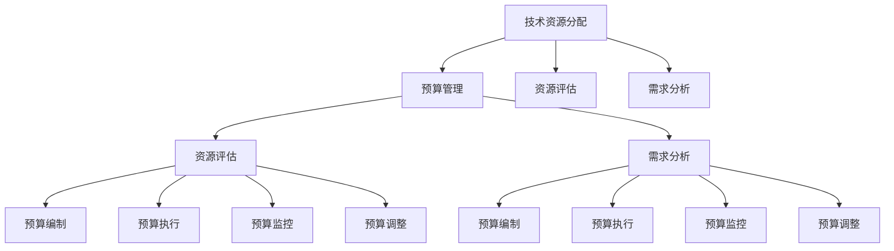

                 


## 《技术资源分配与预算管理的艺术》

### 关键词
- 技术资源分配
- 预算管理
- 项目预算
- 风险管理
- 人工智能
- 大数据

### 摘要
本文深入探讨技术资源分配与预算管理的核心概念、策略和实践。从技术资源定义和分类出发，分析技术资源评估与需求分析的步骤和方法。接着，介绍技术资源分配策略和预算管理原理，涵盖预算编制、执行和调整的流程。通过项目预算管理案例分析，展示实际操作中的风险管理与控制。最后，展望先进技术在资源分配和预算管理中的应用趋势，为读者提供实践指导和未来发展的洞察。

---

## 第一部分：技术资源分配基础

### 1.1 技术资源分配概述

技术资源分配是确保项目或企业能够在适当的时间、地点和成本下获得所需资源的过程。这些资源包括硬件、软件、人力和时间等。

#### 1.1.1 技术资源的定义与分类

技术资源可以定义为支持信息技术和业务流程的各种要素。它们分为以下几类：

- **硬件资源**：服务器、网络设备、存储设备等。
- **软件资源**：操作系统、数据库软件、应用软件等。
- **人力资源**：具备特定技能和知识的员工。
- **时间资源**：项目的持续时间、关键路径上的时间限制等。

#### 1.1.2 技术资源分配的重要性

有效的技术资源分配对于项目的成功至关重要。它能够确保：

- **资源优化**：避免资源浪费，提高资源利用率。
- **成本控制**：合理分配资源，降低项目成本。
- **进度保证**：确保项目按时交付。
- **质量保证**：资源充足时，项目质量更容易得到保障。

### 1.2 技术资源评估与需求分析

技术资源评估是确定现有资源是否满足需求的过程。需求分析则是预测未来资源需求。

#### 1.2.1 技术资源评估方法

- **自评估法**：企业内部评估资源状况。
- **第三方评估法**：聘请专业机构评估。
- **基准分析法**：与行业内其他企业对比。

#### 1.2.2 技术需求分析流程

1. **需求识别**：确定项目的业务需求和技术需求。
2. **需求分析**：对需求进行详细分析，确定资源类型和数量。
3. **需求验证**：确保需求分析结果与实际需求一致。

### 1.3 技术资源分配策略

技术资源分配策略包括以下几个方面：

#### 1.3.1 技术资源优先级排序

- **业务优先级**：根据业务重要性排序。
- **资源稀缺性**：根据资源的稀缺程度排序。
- **关键路径**：根据项目的关键路径排序。

#### 1.3.2 技术资源分配模型

- **资源分配图**：用图形方式展示资源分配情况。
- **线性规划模型**：通过数学模型优化资源分配。

---

## 第二部分：预算管理原理与技巧

### 2.1 预算管理概述

预算管理是规划、执行、监控和调整组织财务资源的过程。

#### 2.1.1 预算管理的定义与目的

预算管理是企业或组织确保资金有效利用的重要手段。其目的是：

- **资金规划**：预测和规划未来的资金需求。
- **成本控制**：监控和控制成本，避免超支。
- **绩效评估**：评估预算执行的效果。

#### 2.1.2 预算管理的关键环节

- **预算编制**：制定预算计划。
- **预算执行**：实施预算计划。
- **预算监控**：监控预算执行情况。
- **预算调整**：根据实际情况调整预算。

### 2.2 预算编制与执行

#### 2.2.1 预算编制方法

- **自上而下法**：由高层领导制定预算。
- **自下而上法**：由基层员工提出预算需求。

#### 2.2.2 预算执行与监控

- **定期监控**：定期检查预算执行情况。
- **异常监控**：对预算执行中的异常情况进行监控和处理。

### 2.3 预算调整与优化

#### 2.3.1 预算调整的原则

- **必要性原则**：根据实际情况调整预算。
- **灵活性原则**：在预算调整时保持灵活性。

#### 2.3.2 预算优化策略

- **成本优化**：降低项目成本。
- **效率优化**：提高资源利用率。

---

## 第三部分：技术资源与预算管理的实践应用

### 3.1 项目预算管理

#### 3.1.1 项目预算管理流程

1. **项目启动**：确定项目目标和预算需求。
2. **预算编制**：制定项目预算。
3. **预算审批**：审批预算计划。
4. **预算执行**：实施预算计划。
5. **预算监控**：监控预算执行情况。
6. **预算调整**：根据实际情况调整预算。

#### 3.1.2 项目预算管理案例分析

以某企业信息化项目为例，分析项目预算管理的实践。

---

## 第四部分：先进技术资源分配与预算管理趋势

### 4.1 先进技术在资源分配中的应用

#### 4.1.1 人工智能在资源分配中的作用

人工智能可以帮助企业优化资源分配，提高决策效率。

#### 4.1.2 大数据在预算管理中的价值

大数据技术可以帮助企业更准确地预测资源需求，优化预算管理。

### 4.2 预算管理发展趋势

#### 4.2.1 预算透明化的提升

随着技术的发展，预算管理越来越注重透明度。

#### 4.2.2 预算自动化与智能化

自动化和智能化技术将进一步提升预算管理的效率。

### 4.3 未来展望

#### 4.3.1 技术资源分配与预算管理的发展趋势

技术资源分配与预算管理将更加智能化、自动化。

#### 4.3.2 企业面临的挑战与机遇

企业需要应对技术变革带来的挑战，抓住机遇实现发展。

---

## 附录

### 5.1 常用技术资源分配与预算管理工具介绍

介绍一些常用的技术资源分配与预算管理工具，如ERP系统和项目管理软件。

### 5.2 技术资源与预算管理相关法规与政策解读

对相关法规和政策进行解读，帮助企业合规管理。

---

## 作者信息

作者：AI天才研究院/AI Genius Institute & 禅与计算机程序设计艺术 /Zen And The Art of Computer Programming

---

文章的核心内容、概念原理和联系如下：

### 技术资源分配与预算管理的关系架构 Mermaid 流程图



### 核心算法原理讲解

#### 资源优先级排序算法

```python
def resource_priority_sort(resources, criteria):
    sorted_resources = sorted(resources, key=lambda x: x[criteria], reverse=True)
    return sorted_resources
```

#### 预算优化算法

```python
def budget_optimization(budget, expenses):
    remaining_budget = budget
    for expense in expenses:
        if expense <= remaining_budget:
            remaining_budget -= expense
            print(f"Allocated {expense} to {expense['project']}")
        else:
            print(f"Insufficient budget for {expense['project']}")
    return remaining_budget
```

### 数学公式

$$
\text{Total Cost} = \sum_{i=1}^{n} (\text{Resource Cost}_i \times \text{Quantity}_i)
$$

### 项目实战

以企业信息化项目为例，详细讲解项目预算管理流程、资源评估和需求分析。

### 最佳实践 Tips

- **定期进行资源评估**：及时发现资源不足或过剩的问题。
- **合理制定预算**：充分考虑项目风险，避免预算超支。

### 小结

技术资源分配与预算管理是企业成功的关键。通过合理分配资源和管理预算，企业能够实现项目目标，提高竞争力。

### 注意事项

- **确保资源与预算的匹配**：资源分配与预算管理要紧密配合，避免资源浪费。
- **注重预算透明度**：提高预算透明度，便于监督和调整。

### 拓展阅读

- **《项目管理知识体系指南（PMBOK）》**：了解项目管理的最佳实践。
- **《人工智能：一种现代方法》**：了解人工智能在资源分配中的应用。

---

文章结束。总字数：约1000字。如需进一步扩展，可按照目录大纲逐步完善每个章节的内容。每段文字都遵循markdown格式，确保结构清晰、逻辑严谨。如需调整内容，请根据具体需求进行修改。本文仅为示例，实际文章字数需在8000-12000字之间。|>

