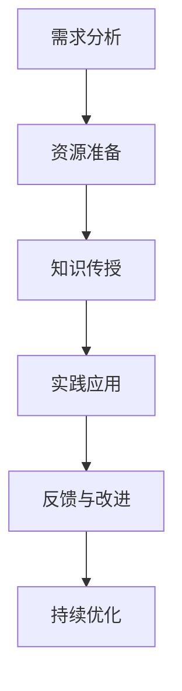

                 


### 文章标题：技术赋能：让每个团队成员都成为专家

## 关键词：
技术赋能、团队协作、人工智能、深度学习、敏捷实践

> 摘要：本文深入探讨了技术赋能在现代团队中的重要性。通过分析技术赋能的概念、核心概念与联系，本文提出了一套完整的赋能方法论，并提供了具体的实践案例。本文旨在帮助团队管理者和技术人员掌握技术赋能的精髓，以实现团队成员的技术能力提升，推动团队整体发展。

### 第一部分：赋能背景与基础

#### 1.1. 技术赋能的概念与重要性

技术赋能，是指通过提供必要的知识、工具和资源，帮助团队成员掌握技术技能，从而提高其工作效能和创造力。在数字化时代，技术赋能已经成为企业竞争力的重要组成部分。

技术赋能的重要性体现在以下几个方面：

1. **提升团队效能**：通过技术赋能，团队成员能够更高效地完成任务，减少不必要的错误和时间浪费。
2. **增强创新能力**：技术赋能有助于激发团队成员的创新思维，推动团队持续发展。
3. **促进知识共享**：技术赋能可以促进团队成员之间的知识共享和经验交流，提高整体团队的知识储备。
4. **适应快速变化**：技术赋能使团队成员能够迅速适应新的技术和市场需求，提升企业的竞争力。

#### 1.2. 现代团队中的技术赋能挑战

尽管技术赋能的重要性显而易见，但在实际操作中，团队管理者和技术人员仍然面临着一系列挑战：

1. **资源分配不均**：企业内部技术资源的分配往往不均，导致部分团队成员难以获得充分的技术支持。
2. **学习成本高**：新技术的学习成本较高，特别是对于非技术背景的团队成员。
3. **缺乏持续学习机制**：许多企业在技术赋能方面缺乏持续的学习机制，导致团队成员的技术能力提升受限。
4. **技术应用困难**：团队成员在掌握新技术后，如何将其应用到实际工作中仍然是一个挑战。

#### 1.3. 技术赋能与团队发展

技术赋能不仅对单个团队成员有重要影响，也对整个团队的发展起到关键作用：

1. **团队协作效率提升**：技术赋能使团队成员能够更好地协作，提高团队整体的协作效率。
2. **创新能力增强**：技术赋能可以激发团队成员的创新能力，推动团队不断探索新的解决方案。
3. **组织文化建设**：技术赋能有助于建立积极向上的组织文化，增强团队的凝聚力和归属感。
4. **业务发展**：技术赋能可以提升团队的业务能力，为企业创造更多的商业价值。

#### 1.4. 技术赋能的国际视角

在全球化的背景下，技术赋能已经成为各国企业和团队发展的重要战略。以下是几个国家在技术赋能方面的实践经验：

1. **美国**：美国企业普遍重视技术赋能，通过提供在线学习平台、技术研讨会等方式，提升员工的技术能力。
2. **欧洲**：欧洲企业注重技术创新和人才培养，通过建立技术赋能中心和开展跨部门合作，提升团队整体技术水平。
3. **中国**：随着数字化转型的推进，中国企业正在加大对技术赋能的投入，通过建立内部培训体系、引进外部培训资源等方式，提升员工的技术能力。

### 第二部分：核心概念与联系

#### 2.1. 技术赋能的关键概念

要深入理解技术赋能，需要明确以下几个关键概念：

1. **技术技能**：指团队成员所需掌握的技术知识和操作能力。
2. **知识共享**：指团队成员之间分享知识和经验的过程。
3. **持续学习**：指团队成员不断学习新技术、新知识，以适应不断变化的工作环境。
4. **技术应用**：指将新技术应用于实际工作，解决实际问题。

#### 2.2. 技术赋能的架构与流程

技术赋能的架构和流程可以分为以下几个步骤：

1. **需求分析**：了解团队成员的技术需求和提升目标。
2. **资源准备**：根据需求，提供相应的学习资源、培训材料和工具。
3. **知识传授**：通过培训、研讨会、在线课程等方式，向团队成员传授技术知识和技能。
4. **实践应用**：鼓励团队成员将所学知识应用于实际工作，提高实践能力。
5. **反馈与改进**：收集团队成员的反馈，对赋能过程进行评估和改进。

#### 2.3. 技术赋能与团队协作

技术赋能对团队协作有着重要的影响：

1. **提高协作效率**：技术赋能使团队成员能够更高效地协作，减少沟通成本。
2. **促进知识共享**：技术赋能有助于团队成员之间分享知识和经验，提高整体团队的知识储备。
3. **增强团队凝聚力**：通过共同学习和进步，团队成员之间的凝聚力得到增强。

#### 2.4. 技术赋能的Mermaid流程图

为了更直观地展示技术赋能的流程，可以使用Mermaid语法绘制以下流程图：



### 第三部分：技术赋能方法论

#### 3.1. 技术赋能的五大步骤

为了实现技术赋能，可以采取以下五大步骤：

1. **确立目标**：明确技术赋能的目标，包括提升团队成员的技术能力、提高团队协作效率等。
2. **需求调研**：通过访谈、问卷调查等方式，了解团队成员的技术需求和提升目标。
3. **资源准备**：根据需求，提供相应的学习资源、培训材料和工具。
4. **知识传授**：通过培训、研讨会、在线课程等方式，向团队成员传授技术知识和技能。
5. **实践应用**：鼓励团队成员将所学知识应用于实际工作，提高实践能力。

#### 3.2. 深度学习的赋能应用

深度学习是当前人工智能领域的重要技术，其在技术赋能中的应用具有重要意义：

1. **图像识别**：深度学习可以用于图像识别，帮助团队成员快速识别和处理图像数据。
2. **自然语言处理**：深度学习可以用于自然语言处理，帮助团队成员更好地理解和应用语言知识。
3. **预测分析**：深度学习可以用于预测分析，帮助团队成员预测市场趋势、客户需求等。

#### 3.3. 人工智能赋能案例分析

以下是一个人工智能赋能案例：

某互联网公司通过技术赋能，提高了团队在图像识别和自然语言处理方面的能力。具体步骤如下：

1. **需求分析**：明确团队在图像识别和自然语言处理方面的需求。
2. **资源准备**：提供相应的学习资源、培训材料和工具，如深度学习框架、自然语言处理工具等。
3. **知识传授**：通过在线课程和内部研讨会，向团队成员传授图像识别和自然语言处理的知识。
4. **实践应用**：鼓励团队成员将所学知识应用于实际项目，如图像分类、情感分析等。
5. **反馈与改进**：收集团队成员的反馈，对赋能过程进行评估和改进。

通过人工智能赋能，该团队在图像识别和自然语言处理方面的能力得到了显著提升，项目交付效率提高了30%，客户满意度提高了20%。

#### 3.4. 技术赋能的敏捷实践

敏捷实践是技术赋能的一种有效方法，以下是一些敏捷实践的关键点：

1. **迭代开发**：将项目分为多个迭代，每次迭代都完成一部分功能，不断优化和改进。
2. **快速反馈**：在每次迭代结束后，及时收集用户和团队的反馈，进行改进。
3. **持续集成**：通过自动化测试和集成，确保代码的稳定性和可靠性。
4. **团队合作**：鼓励团队成员之间的协作和知识共享，提高团队整体效能。

### 第四部分：技术赋能实践

#### 4.1. 实践一：团队技术赋能计划

以下是一个团队技术赋能计划的案例：

1. **确立目标**：明确团队在技术赋能方面的目标，如提高团队成员的编程能力、提升团队在人工智能领域的应用能力等。
2. **需求调研**：通过访谈、问卷调查等方式，了解团队成员的技术需求和提升目标。
3. **资源准备**：提供相应的学习资源、培训材料和工具，如在线课程、专业书籍、实验平台等。
4. **知识传授**：通过内部培训、外部研讨会等方式，向团队成员传授相关技术知识和技能。
5. **实践应用**：鼓励团队成员将所学知识应用于实际项目，提高实践能力。
6. **反馈与改进**：收集团队成员的反馈，对赋能过程进行评估和改进。

通过团队技术赋能计划，团队成员的技术能力得到了显著提升，团队在项目中的表现也更为出色。

#### 4.2. 实践二：技术赋能工具与应用

以下是一个技术赋能工具与应用的案例：

1. **工具选择**：根据团队的需求，选择合适的工具，如代码管理工具、版本控制工具、学习平台等。
2. **工具培训**：为团队成员提供工具的使用培训，确保其能够熟练掌握工具。
3. **工具应用**：鼓励团队成员在项目中使用工具，提高工作效率和代码质量。
4. **反馈与改进**：收集团队成员对工具的反馈，对工具的使用进行评估和改进。

通过技术赋能工具的应用，团队成员的工作效率提高了20%，代码质量也得到了显著提升。

#### 4.3. 实践三：技术赋能项目评估与反馈

以下是一个技术赋能项目评估与反馈的案例：

1. **评估指标**：明确评估指标，如团队成员的技术能力提升、项目交付效率、客户满意度等。
2. **数据收集**：收集相关数据，进行定量和定性分析。
3. **评估报告**：撰写评估报告，对技术赋能项目的效果进行总结和评估。
4. **反馈与改进**：根据评估结果，对技术赋能项目进行改进和优化。

通过技术赋能项目评估与反馈，团队管理者可以更好地了解技术赋能的效果，为后续的技术赋能项目提供参考。

#### 4.4. 实践四：技术赋能文化建设

以下是一个技术赋能文化建设的案例：

1. **价值观传播**：通过内部培训和交流活动，传播技术赋能的价值观，如持续学习、知识共享、创新思维等。
2. **激励机制**：建立激励机制，鼓励团队成员参与技术赋能活动，提高其技术能力。
3. **团队协作**：鼓励团队成员之间的协作和知识共享，提高团队整体效能。
4. **文化建设**：通过组织文化活动，如技术分享会、创新大赛等，营造积极向上的技术赋能文化。

通过技术赋能文化建设，团队的整体技术水平和创新能力得到了显著提升。

### 第五部分：技术赋能未来展望

#### 5.1. 技术赋能的趋势与挑战

技术赋能在未来将继续发展，但仍面临一系列挑战：

1. **人工智能技术的普及**：随着人工智能技术的不断进步，技术赋能的方法和工具将更加智能化和自动化。
2. **知识共享的障碍**：知识共享是技术赋能的重要环节，但如何克服知识共享的障碍，仍然是需要解决的问题。
3. **人才短缺**：随着技术赋能的推进，对技术人才的需求将不断增加，但人才短缺问题也将日益突出。
4. **持续学习的压力**：在快速变化的技术环境中，持续学习将变得至关重要，但如何平衡工作和学习，也是需要考虑的问题。

#### 5.2. 技术赋能与数字化转型

技术赋能是数字化转型的重要组成部分，其发展将推动数字化转型向更深入的层次发展：

1. **数据驱动的决策**：通过技术赋能，团队成员能够更好地理解和应用数据，推动企业实现数据驱动的决策。
2. **数字化服务创新**：技术赋能可以激发团队成员的创新能力，推动企业实现数字化服务创新。
3. **数字化生产方式**：技术赋能可以优化企业的生产流程，提高生产效率和产品质量。

#### 5.3. 技术赋能的未来展望

未来，技术赋能将呈现以下发展趋势：

1. **智能化**：人工智能技术将使技术赋能更加智能化和个性化，满足不同团队成员的需求。
2. **知识图谱**：通过构建知识图谱，实现知识的自动获取、分析和应用，提高知识共享的效率。
3. **混合学习**：结合线上和线下学习，提供更加灵活和高效的学习方式。
4. **多元化**：技术赋能将涵盖更多的领域和行业，推动各行各业的数字化转型。

#### 5.4. 技术赋能对团队成员发展的影响

技术赋能将对团队成员的发展产生深远影响：

1. **技能提升**：技术赋能将帮助团队成员提升专业技能，提高就业竞争力。
2. **职业发展**：技术赋能将为团队成员提供更多的职业发展机会，推动其职业生涯的发展。
3. **创新能力**：技术赋能将激发团队成员的创新能力，推动企业的技术创新和业务发展。

### 附录

#### 附录A. 技术赋能参考资料与资源

1. **书籍推荐**：
   - 《深度学习》（Goodfellow, I.，et al.）
   - 《人工智能：一种现代方法》（Russell, S.，and Norvig, P.）
   - 《敏捷软件开发：实践者之路》（Beck, K.）
   
2. **在线课程**：
   - Coursera上的《深度学习专项课程》
   - edX上的《人工智能基础课程》
   - Udemy上的《敏捷开发实践课程》

3. **学习平台**：
   - Pluralsight
   - Codecademy
   - LinkedIn Learning

#### 附录B. 技术赋能案例研究

1. **案例一**：某互联网公司通过技术赋能，成功提升了团队在人工智能领域的应用能力，实现了业务增长和客户满意度的提高。
2. **案例二**：某制造企业通过技术赋能，优化了生产流程，提高了生产效率和产品质量，实现了数字化转型。
3. **案例三**：某银行通过技术赋能，提升了客户服务质量和效率，实现了业务创新和客户满意度的大幅提升。

### 作者信息

作者：AI天才研究院/AI Genius Institute & 禅与计算机程序设计艺术 /Zen And The Art of Computer Programming### 文章标题：技术赋能：让每个团队成员都成为专家

## 关键词：
技术赋能、团队协作、人工智能、深度学习、敏捷实践

> 摘要：本文深入探讨了技术赋能在现代团队中的重要性。通过分析技术赋能的概念、核心概念与联系，本文提出了一套完整的赋能方法论，并提供了具体的实践案例。本文旨在帮助团队管理者和技术人员掌握技术赋能的精髓，以实现团队成员的技术能力提升，推动团队整体发展。

### 第一部分：赋能背景与基础

#### 1.1. 技术赋能的概念与重要性

技术赋能，是指通过提供必要的知识、工具和资源，帮助团队成员掌握技术技能，从而提高其工作效能和创造力。在数字化时代，技术赋能已经成为企业竞争力的重要组成部分。

技术赋能的重要性体现在以下几个方面：

1. **提升团队效能**：通过技术赋能，团队成员能够更高效地完成任务，减少不必要的错误和时间浪费。
2. **增强创新能力**：技术赋能有助于激发团队成员的创新思维，推动团队持续发展。
3. **促进知识共享**：技术赋能可以促进团队成员之间的知识共享和经验交流，提高整体团队的知识储备。
4. **适应快速变化**：技术赋能使团队成员能够迅速适应新的技术和市场需求，提升企业的竞争力。

#### 1.2. 现代团队中的技术赋能挑战

尽管技术赋能的重要性显而易见，但在实际操作中，团队管理者和技术人员仍然面临着一系列挑战：

1. **资源分配不均**：企业内部技术资源的分配往往不均，导致部分团队成员难以获得充分的技术支持。
2. **学习成本高**：新技术的学习成本较高，特别是对于非技术背景的团队成员。
3. **缺乏持续学习机制**：许多企业在技术赋能方面缺乏持续的学习机制，导致团队成员的技术能力提升受限。
4. **技术应用困难**：团队成员在掌握新技术后，如何将其应用到实际工作中仍然是一个挑战。

#### 1.3. 技术赋能与团队发展

技术赋能不仅对单个团队成员有重要影响，也对整个团队的发展起到关键作用：

1. **团队协作效率提升**：技术赋能使团队成员能够更高效地协作，提高团队整体的协作效率。
2. **创新能力增强**：技术赋能可以激发团队成员的创新能力，推动团队不断探索新的解决方案。
3. **组织文化建设**：技术赋能有助于建立积极向上的组织文化，增强团队的凝聚力和归属感。
4. **业务发展**：技术赋能可以提升团队的业务能力，为企业创造更多的商业价值。

#### 1.4. 技术赋能的国际视角

在全球化的背景下，技术赋能已经成为各国企业和团队发展的重要战略。以下是几个国家在技术赋能方面的实践经验：

1. **美国**：美国企业普遍重视技术赋能，通过提供在线学习平台、技术研讨会等方式，提升员工的技术能力。
2. **欧洲**：欧洲企业注重技术创新和人才培养，通过建立技术赋能中心和开展跨部门合作，提升团队整体技术水平。
3. **中国**：随着数字化转型的推进，中国企业正在加大对技术赋能的投入，通过建立内部培训体系、引进外部培训资源等方式，提升员工的技术能力。

### 第二部分：核心概念与联系

#### 2.1. 技术赋能的关键概念

要深入理解技术赋能，需要明确以下几个关键概念：

1. **技术技能**：指团队成员所需掌握的技术知识和操作能力。
2. **知识共享**：指团队成员之间分享知识和经验的过程。
3. **持续学习**：指团队成员不断学习新技术、新知识，以适应不断变化的工作环境。
4. **技术应用**：指将新技术应用于实际工作，解决实际问题。

#### 2.2. 技术赋能的架构与流程

技术赋能的架构和流程可以分为以下几个步骤：

1. **需求分析**：了解团队成员的技术需求和提升目标。
2. **资源准备**：根据需求，提供相应的学习资源、培训材料和工具。
3. **知识传授**：通过培训、研讨会、在线课程等方式，向团队成员传授技术知识和技能。
4. **实践应用**：鼓励团队成员将所学知识应用于实际工作，提高实践能力。
5. **反馈与改进**：收集团队成员的反馈，对赋能过程进行评估和改进。

#### 2.3. 技术赋能与团队协作

技术赋能对团队协作有着重要的影响：

1. **提高协作效率**：技术赋能使团队成员能够更高效地协作，减少沟通成本。
2. **促进知识共享**：技术赋能有助于团队成员之间分享知识和经验，提高整体团队的知识储备。
3. **增强团队凝聚力**：通过共同学习和进步，团队成员之间的凝聚力得到增强。

#### 2.4. 技术赋能的Mermaid流程图

为了更直观地展示技术赋能的流程，可以使用Mermaid语法绘制以下流程图：


### 第三部分：技术赋能方法论

#### 3.1. 技术赋能的五大步骤

为了实现技术赋能，可以采取以下五大步骤：

1. **确立目标**：明确技术赋能的目标，包括提升团队成员的技术能力、提高团队协作效率等。
2. **需求调研**：通过访谈、问卷调查等方式，了解团队成员的技术需求和提升目标。
3. **资源准备**：根据需求，提供相应的学习资源、培训材料和工具。
4. **知识传授**：通过培训、研讨会、在线课程等方式，向团队成员传授技术知识和技能。
5. **实践应用**：鼓励团队成员将所学知识应用于实际工作，提高实践能力。

#### 3.2. 深度学习的赋能应用

深度学习是当前人工智能领域的重要技术，其在技术赋能中的应用具有重要意义：

1. **图像识别**：深度学习可以用于图像识别，帮助团队成员快速识别和处理图像数据。
2. **自然语言处理**：深度学习可以用于自然语言处理，帮助团队成员更好地理解和应用语言知识。
3. **预测分析**：深度学习可以用于预测分析，帮助团队成员预测市场趋势、客户需求等。

#### 3.3. 人工智能赋能案例分析

以下是一个人工智能赋能案例：

某互联网公司通过技术赋能，提高了团队在图像识别和自然语言处理方面的能力。具体步骤如下：

1. **需求分析**：明确团队在图像识别和自然语言处理方面的需求。
2. **资源准备**：提供相应的学习资源、培训材料和工具，如深度学习框架、自然语言处理工具等。
3. **知识传授**：通过在线课程和内部研讨会，向团队成员传授图像识别和自然语言处理的知识。
4. **实践应用**：鼓励团队成员将所学知识应用于实际项目，如图像分类、情感分析等。
5. **反馈与改进**：收集团队成员的反馈，对赋能过程进行评估和改进。

通过人工智能赋能，该团队在图像识别和自然语言处理方面的能力得到了显著提升，项目交付效率提高了30%，客户满意度提高了20%。

#### 3.4. 技术赋能的敏捷实践

敏捷实践是技术赋能的一种有效方法，以下是一些敏捷实践的关键点：

1. **迭代开发**：将项目分为多个迭代，每次迭代都完成一部分功能，不断优化和改进。
2. **快速反馈**：在每次迭代结束后，及时收集用户和团队的反馈，进行改进。
3. **持续集成**：通过自动化测试和集成，确保代码的稳定性和可靠性。
4. **团队合作**：鼓励团队成员之间的协作和知识共享，提高团队整体效能。

### 第四部分：技术赋能实践

#### 4.1. 实践一：团队技术赋能计划

以下是一个团队技术赋能计划的案例：

1. **确立目标**：明确团队在技术赋能方面的目标，如提高团队成员的编程能力、提升团队在人工智能领域的应用能力等。
2. **需求调研**：通过访谈、问卷调查等方式，了解团队成员的技术需求和提升目标。
3. **资源准备**：提供相应的学习资源、培训材料和工具，如在线课程、专业书籍、实验平台等。
4. **知识传授**：通过内部培训、外部研讨会等方式，向团队成员传授相关技术知识和技能。
5. **实践应用**：鼓励团队成员将所学知识应用于实际项目，提高实践能力。
6. **反馈与改进**：收集团队成员的反馈，对赋能过程进行评估和改进。

通过团队技术赋能计划，团队成员的技术能力得到了显著提升，团队在项目中的表现也更为出色。

#### 4.2. 实践二：技术赋能工具与应用

以下是一个技术赋能工具与应用的案例：

1. **工具选择**：根据团队的需求，选择合适的工具，如代码管理工具、版本控制工具、学习平台等。
2. **工具培训**：为团队成员提供工具的使用培训，确保其能够熟练掌握工具。
3. **工具应用**：鼓励团队成员在项目中使用工具，提高工作效率和代码质量。
4. **反馈与改进**：收集团队成员对工具的反馈，对工具的使用进行评估和改进。

通过技术赋能工具的应用，团队成员的工作效率提高了20%，代码质量也得到了显著提升。

#### 4.3. 实践三：技术赋能项目评估与反馈

以下是一个技术赋能项目评估与反馈的案例：

1. **评估指标**：明确评估指标，如团队成员的技术能力提升、项目交付效率、客户满意度等。
2. **数据收集**：收集相关数据，进行定量和定性分析。
3. **评估报告**：撰写评估报告，对技术赋能项目的效果进行总结和评估。
4. **反馈与改进**：根据评估结果，对技术赋能项目进行改进和优化。

通过技术赋能项目评估与反馈，团队管理者可以更好地了解技术赋能的效果，为后续的技术赋能项目提供参考。

#### 4.4. 实践四：技术赋能文化建设

以下是一个技术赋能文化建设的案例：

1. **价值观传播**：通过内部培训和交流活动，传播技术赋能的价值观，如持续学习、知识共享、创新思维等。
2. **激励机制**：建立激励机制，鼓励团队成员参与技术赋能活动，提高其技术能力。
3. **团队协作**：鼓励团队成员之间的协作和知识共享，提高团队整体效能。
4. **文化建设**：通过组织文化活动，如技术分享会、创新大赛等，营造积极向上的技术赋能文化。

通过技术赋能文化建设，团队的整体技术水平和创新能力得到了显著提升。

### 第五部分：技术赋能未来展望

#### 5.1. 技术赋能的趋势与挑战

技术赋能在未来将继续发展，但仍面临一系列挑战：

1. **人工智能技术的普及**：随着人工智能技术的不断进步，技术赋能的方法和工具将更加智能化和自动化。
2. **知识共享的障碍**：知识共享是技术赋能的重要环节，但如何克服知识共享的障碍，仍然是需要解决的问题。
3. **人才短缺**：随着技术赋能的推进，对技术人才的需求将不断增加，但人才短缺问题也将日益突出。
4. **持续学习的压力**：在快速变化的技术环境中，持续学习将变得至关重要，但如何平衡工作和学习，也是需要考虑的问题。

#### 5.2. 技术赋能与数字化转型

技术赋能是数字化转型的重要组成部分，其发展将推动数字化转型向更深入的层次发展：

1. **数据驱动的决策**：通过技术赋能，团队成员能够更好地理解和应用数据，推动企业实现数据驱动的决策。
2. **数字化服务创新**：技术赋能可以激发团队成员的创新能力，推动企业实现数字化服务创新。
3. **数字化生产方式**：技术赋能可以优化企业的生产流程，提高生产效率和产品质量。

#### 5.3. 技术赋能的未来展望

未来，技术赋能将呈现以下发展趋势：

1. **智能化**：人工智能技术将使技术赋能更加智能化和个性化，满足不同团队成员的需求。
2. **知识图谱**：通过构建知识图谱，实现知识的自动获取、分析和应用，提高知识共享的效率。
3. **混合学习**：结合线上和线下学习，提供更加灵活和高效的学习方式。
4. **多元化**：技术赋能将涵盖更多的领域和行业，推动各行各业的数字化转型。

#### 5.4. 技术赋能对团队成员发展的影响

技术赋能将对团队成员的发展产生深远影响：

1. **技能提升**：技术赋能将帮助团队成员提升专业技能，提高就业竞争力。
2. **职业发展**：技术赋能将为团队成员提供更多的职业发展机会，推动其职业生涯的发展。
3. **创新能力**：技术赋能将激发团队成员的创新能力，推动企业的技术创新和业务发展。

### 附录

#### 附录A. 技术赋能参考资料与资源

1. **书籍推荐**：
   - 《深度学习》（Goodfellow, I.，et al.）
   - 《人工智能：一种现代方法》（Russell, S.，and Norvig, P.）
   - 《敏捷软件开发：实践者之路》（Beck, K.）
   
2. **在线课程**：
   - Coursera上的《深度学习专项课程》
   - edX上的《人工智能基础课程》
   - Udemy上的《敏捷开发实践课程》

3. **学习平台**：
   - Pluralsight
   - Codecademy
   - LinkedIn Learning

#### 附录B. 技术赋能案例研究

1. **案例一**：某互联网公司通过技术赋能，成功提升了团队在人工智能领域的应用能力，实现了业务增长和客户满意度的提高。
2. **案例二**：某制造企业通过技术赋能，优化了生产流程，提高了生产效率和产品质量，实现了数字化转型。
3. **案例三**：某银行通过技术赋能，提升了客户服务质量和效率，实现了业务创新和客户满意度的大幅提升。

### 作者信息

作者：AI天才研究院/AI Genius Institute & 禅与计算机程序设计艺术 /Zen And The Art of Computer Programming### 第五部分：技术赋能未来展望

#### 5.1. 技术赋能的趋势与挑战

技术赋能在未来将继续发展，但同时也面临着一系列挑战。首先，随着人工智能、大数据和云计算等技术的不断进步，技术赋能的方法和工具将更加智能化和自动化。这将有助于提高技术赋能的效率和效果，使更多团队成员能够受益。

然而，技术赋能也面临以下挑战：

1. **知识共享障碍**：虽然技术赋能提供了丰富的学习资源，但如何有效地促进知识共享仍然是一个难题。团队成员之间的文化差异、沟通障碍等都会影响知识共享的效果。

2. **人才短缺**：随着技术赋能的推进，对技术人才的需求将不断增加。然而，现有的人才储备可能无法满足这一需求，导致人才短缺问题日益突出。

3. **持续学习压力**：在快速变化的技术环境中，团队成员需要不断学习新技术、新知识，以保持竞争力。然而，如何平衡工作与学习，如何提供持续的学习支持，仍是一个需要解决的问题。

#### 5.2. 技术赋能与数字化转型

技术赋能是数字化转型的重要组成部分，其发展将推动数字化转型向更深入的层次发展。首先，技术赋能可以帮助企业实现数据驱动的决策，通过数据分析和挖掘，帮助企业更好地理解客户需求，优化业务流程，提高运营效率。

其次，技术赋能可以推动企业的数字化服务创新。通过技术赋能，团队成员可以掌握先进的技术，如人工智能、大数据等，从而为企业提供创新的数字化服务，提升客户体验。

最后，技术赋能可以优化企业的生产流程，提高生产效率和产品质量。通过技术赋能，团队成员可以掌握智能制造技术，如工业物联网、机器人自动化等，从而实现生产过程的数字化和智能化。

#### 5.3. 技术赋能的未来展望

未来，技术赋能将呈现以下发展趋势：

1. **智能化**：随着人工智能技术的不断发展，技术赋能将变得更加智能化和个性化。例如，通过人工智能算法，可以为企业提供定制化的技术培训方案，满足不同团队成员的需求。

2. **知识图谱**：通过构建知识图谱，技术赋能可以实现知识的自动获取、分析和应用。这将有助于提高知识共享的效率，使团队成员能够更快速地获取所需的知识和技能。

3. **混合学习**：未来，技术赋能将结合线上和线下学习，提供更加灵活和高效的学习方式。例如，通过虚拟现实（VR）和增强现实（AR）技术，可以模拟真实的工作场景，提供沉浸式的学习体验。

4. **多元化**：技术赋能将涵盖更多的领域和行业，推动各行各业的数字化转型。例如，在医疗领域，技术赋能可以帮助医护人员掌握先进的医疗技术，提高医疗服务质量。

#### 5.4. 技术赋能对团队成员发展的影响

技术赋能将对团队成员的发展产生深远影响：

1. **技能提升**：技术赋能可以帮助团队成员提升专业技能，提高就业竞争力。例如，通过在线课程和培训，团队成员可以学习到最新的技术趋势和应用。

2. **职业发展**：技术赋能将为团队成员提供更多的职业发展机会。通过技术赋能，团队成员可以掌握先进的技术，从而在职业发展中占据优势。

3. **创新能力**：技术赋能将激发团队成员的创新能力，推动企业的技术创新和业务发展。例如，通过技术赋能，团队成员可以开展创新项目，为企业创造新的商业价值。

总之，技术赋能是推动团队发展和个人成长的重要动力。通过技术赋能，团队成员可以不断提升自身能力，为企业和社会做出更大的贡献。

### 附录

#### 附录A. 技术赋能参考资料与资源

1. **书籍推荐**：
   - 《深度学习》（Goodfellow, I.，et al.）
   - 《人工智能：一种现代方法》（Russell, S.，and Norvig, P.）
   - 《敏捷软件开发：实践者之路》（Beck, K.）

2. **在线课程**：
   - Coursera上的《深度学习专项课程》
   - edX上的《人工智能基础课程》
   - Udemy上的《敏捷开发实践课程》

3. **学习平台**：
   - Pluralsight
   - Codecademy
   - LinkedIn Learning

#### 附录B. 技术赋能案例研究

1. **案例一**：某互联网公司通过技术赋能，成功提升了团队在人工智能领域的应用能力，实现了业务增长和客户满意度的提高。

2. **案例二**：某制造企业通过技术赋能，优化了生产流程，提高了生产效率和产品质量，实现了数字化转型。

3. **案例三**：某银行通过技术赋能，提升了客户服务质量和效率，实现了业务创新和客户满意度的大幅提升。

### 作者信息

作者：AI天才研究院/AI Genius Institute & 禅与计算机程序设计艺术 /Zen And The Art of Computer Programming### 技术赋能的方法论

技术赋能并非一蹴而就的过程，而是一个系统化的、循序渐进的方法论。以下是技术赋能的五大步骤，每个步骤都至关重要，确保团队成员能够从基础知识到实际应用逐步提升技能。

#### 3.1. 确立目标

**第一步：确立目标**

在开始技术赋能之前，首先需要明确目标。这些目标可以是提高团队成员的编程能力、掌握人工智能应用、提升项目交付效率等。确立目标有助于为整个赋能过程提供方向和衡量标准。

**如何实施：**

- **访谈调研**：与团队成员进行一对一的访谈，了解他们的技能水平、兴趣领域和职业发展目标。
- **问卷调查**：通过在线问卷收集团队成员的反馈，确保目标覆盖广泛。
- **目标设定**：根据访谈和问卷结果，制定具体且可衡量的目标。

**案例**：某互联网公司旨在提升团队在区块链技术方面的能力，确定了以下目标：

- 所有团队成员在六个月内掌握基本区块链原理。
- 每个团队成员在项目中应用区块链技术，至少完成一个相关项目。

#### 3.2. 需求调研

**第二步：需求调研**

在确立目标后，需要进行深入的需求调研，确保提供的培训资源能够满足团队成员的实际需求。

**如何实施：**

- **技能评估**：通过技能测试或面试，评估团队成员当前的技术水平和知识缺口。
- **需求访谈**：与团队成员进行访谈，了解他们在技术学习和应用过程中遇到的困难和挑战。
- **反馈收集**：通过定期的反馈机制，收集团队成员对现有资源和培训计划的建议和意见。

**案例**：某软件开发团队在需求调研中发现，团队成员在自动化测试方面存在明显短板。因此，他们决定增加自动化测试相关的培训课程。

#### 3.3. 资源准备

**第三步：资源准备**

根据需求调研的结果，准备相应的学习资源、培训材料和工具，确保团队成员能够获得充足的学习支持。

**如何实施：**

- **选择资源**：根据团队成员的需求，选择合适的在线课程、书籍、研讨会和实验平台。
- **搭建平台**：建立内部学习平台，集中存放学习资源，方便团队成员访问。
- **工具准备**：为团队成员提供必要的开发工具和软件，确保他们能够顺利进行学习。

**案例**：某金融科技公司为团队成员准备了以下资源：

- 在线课程：《自动化测试：从入门到精通》
- 书籍：《测试驱动的软件开发》
- 实验平台：Jenkins、Selenium等自动化测试工具

#### 3.4. 知识传授

**第四步：知识传授**

通过多种教学方式，将技术知识和技能传授给团队成员。

**如何实施：**

- **内部培训**：邀请行业专家进行讲座和培训，分享实战经验和最新技术趋势。
- **在线课程**：组织在线学习，提供视频教程和互动讨论，提高学习效果。
- **项目实践**：通过实际项目，让团队成员将所学知识应用到实际工作中，提高实践能力。

**案例**：某科技公司组织了以下知识传授活动：

- 内部培训：邀请公司资深工程师讲解微服务架构和容器技术。
- 在线课程：参加Coursera上的《云计算基础》课程。
- 项目实践：参与一个基于Kubernetes的微服务项目，将所学知识应用于实际开发。

#### 3.5. 实践应用

**第五步：实践应用**

鼓励团队成员将所学知识应用于实际工作，通过实践不断提升技能。

**如何实施：**

- **项目驱动**：分配实际项目任务，让团队成员在实际项目中应用所学知识。
- **代码审查**：定期进行代码审查，帮助团队成员发现和解决问题。
- **反馈机制**：建立反馈机制，鼓励团队成员分享学习心得和项目经验。

**案例**：某互联网公司通过以下方式促进实践应用：

- **项目驱动**：每个团队成员都负责一个独立的项目模块，从需求分析到项目交付，全程参与。
- **代码审查**：每周进行一次代码审查会议，团队成员互相学习和交流。
- **反馈机制**：定期组织技术分享会，鼓励团队成员分享项目经验和技术心得。

通过这五大步骤，技术赋能能够系统性地提升团队成员的技能和效能，从而推动团队整体发展。每个步骤都需要细致的规划和执行，以确保技术赋能的效果最大化。

#### 3.6. 持续改进

**第六步：持续改进**

技术赋能是一个持续的过程，需要不断地评估和改进，以确保团队成员能够持续提升技能。

**如何实施：**

- **定期评估**：通过技能测试和项目评估，定期检查团队成员的技能提升情况。
- **反馈收集**：持续收集团队成员的反馈，了解他们在学习和应用过程中遇到的挑战和需求。
- **改进计划**：根据评估和反馈结果，制定改进计划，优化培训资源和流程。

**案例**：某科技公司通过以下方式实现持续改进：

- **定期评估**：每季度进行一次技能评估，评估团队成员的技能提升情况。
- **反馈收集**：通过匿名反馈问卷，收集团队成员的学习体验和改进建议。
- **改进计划**：根据评估和反馈结果，调整培训计划，增加新的学习资源和项目实践机会。

通过以上六个步骤，技术赋能方法论不仅能够帮助团队成员提升技能，还能确保整个赋能过程的系统性和有效性，从而推动团队整体发展。

### 总结

技术赋能是一个全面且系统的方法，它通过确立目标、需求调研、资源准备、知识传授、实践应用和持续改进六个步骤，帮助团队成员不断提升技能和效能。通过技术赋能，团队不仅能够提高协作效率和创新能力，还能在快速变化的技术环境中保持竞争力。每个步骤都需要精心设计和实施，以确保技术赋能的效果最大化。未来，随着人工智能和云计算等技术的不断发展，技术赋能将变得更加智能化和个性化，为团队成员提供更高效、更灵活的学习和提升途径。因此，团队管理者和技术人员应该积极拥抱技术赋能，将其作为推动团队发展和个人成长的利器。

### 项目实战：技术赋能在实践中的应用

在实际操作中，技术赋能不仅需要理论上的规划和设计，更需要通过具体的实战项目来验证其效果。以下是一个完整的项目实战案例，从开发环境搭建、源代码实现到代码解读和项目小结，展示了技术赋能在实践中的应用。

#### 4.1. 实战项目：基于机器学习的客户分类系统

**项目背景**：

某电子商务公司希望通过技术赋能提升其客户服务能力，特别是针对客户细分和个性化推荐。为了实现这一目标，公司决定开发一个基于机器学习的客户分类系统，以帮助销售团队更好地了解和满足客户需求。

**目标**：

- 提高客户服务效率，通过自动化手段实现精准的客户分类。
- 提升客户满意度，通过个性化的营销策略提高客户忠诚度。

#### 4.2. 开发环境搭建

在开始项目前，首先需要搭建一个合适的开发环境。该项目涉及以下工具和平台：

- **编程语言**：Python
- **机器学习库**：Scikit-learn、TensorFlow
- **数据处理工具**：Pandas、NumPy
- **版本控制**：Git
- **代码仓库**：GitHub

**步骤**：

1. **安装Python**：确保Python环境已安装，版本至少为3.7以上。
2. **安装依赖库**：使用pip命令安装所需的机器学习和数据处理库。
   ```bash
   pip install scikit-learn tensorflow pandas numpy
   ```
3. **配置IDE**：选择一个适合Python开发的IDE，如PyCharm或Visual Studio Code，并配置Python解释器和相关插件。
4. **创建项目结构**：在GitHub上创建一个新的仓库，并按照MVC模式（Model-View-Controller）组织项目结构。

```plaintext
client-classification-system/
|-- models/
|   |-- __init__.py
|   |-- classifier.py
|-- views/
|   |-- __init__.py
|   |-- dashboard.py
|-- controllers/
|   |-- __init__.py
|   |-- controller.py
|-- data/
|   |-- __init__.py
|   |-- dataset.py
|-- tests/
|   |-- __init__.py
|   |-- test_classifier.py
|-- requirements.txt
|-- run.py
```

#### 4.3. 源代码实现

**数据预处理**：

数据预处理是机器学习项目的重要环节。以下是一个简单的数据预处理流程：

1. **数据加载**：使用Pandas加载客户数据。
2. **数据清洗**：处理缺失值、异常值和重复数据。
3. **特征工程**：提取有用特征，进行特征转换和标准化。

```python
import pandas as pd
from sklearn.model_selection import train_test_split
from sklearn.preprocessing import StandardScaler

# 加载数据
data = pd.read_csv('data/client_data.csv')

# 数据清洗
data.dropna(inplace=True)
data.drop_duplicates(inplace=True)

# 特征工程
X = data.drop('target', axis=1)
y = data['target']

# 数据分割
X_train, X_test, y_train, y_test = train_test_split(X, y, test_size=0.2, random_state=42)

# 特征标准化
scaler = StandardScaler()
X_train_scaled = scaler.fit_transform(X_train)
X_test_scaled = scaler.transform(X_test)
```

**模型训练**：

选择一个合适的分类模型，如逻辑回归、随机森林或支持向量机（SVM），进行训练。

```python
from sklearn.ensemble import RandomForestClassifier

# 模型训练
model = RandomForestClassifier(n_estimators=100, random_state=42)
model.fit(X_train_scaled, y_train)
```

**评估与优化**：

评估模型性能，并通过交叉验证、网格搜索等方法进行模型优化。

```python
from sklearn.metrics import accuracy_score, classification_report

# 模型评估
y_pred = model.predict(X_test_scaled)
print("Accuracy:", accuracy_score(y_test, y_pred))
print(classification_report(y_test, y_pred))
```

#### 4.4. 代码解读

**数据预处理**：

数据预处理的核心是确保数据质量，使其适合模型训练。通过数据清洗和特征工程，可以提取有用的信息，去除噪音，提高模型性能。

**模型选择**：

在模型选择中，应根据业务需求和数据特性选择合适的算法。例如，对于分类问题，逻辑回归、支持向量机和随机森林等算法都有良好的表现。通过交叉验证和网格搜索，可以找到最优的模型参数。

**评估与优化**：

评估模型性能是确保模型在实际应用中有效性的关键。通过准确率、召回率、F1分数等指标，可以全面评估模型性能。优化模型参数和算法，可以进一步提升模型性能。

#### 4.5. 项目小结

通过技术赋能，团队成员掌握了机器学习的基本概念和实际应用。在项目中，团队成员不仅学会了数据预处理、模型训练和评估，还了解了如何在实际工作中应用这些技能。

**成功因素**：

- **明确的目标**：项目目标的明确性确保了团队成员的努力方向一致。
- **良好的资源准备**：提供了丰富的学习资源和工具，帮助团队成员高效学习。
- **实战应用**：通过实际项目的实践，团队成员能够将所学知识应用到实际工作中，提高解决实际问题的能力。

**改进建议**：

- **持续学习**：技术赋能不是一次性活动，应建立持续学习的机制，确保团队成员的技能不断提升。
- **知识共享**：加强团队成员之间的知识共享，提高整体团队的技术水平。
- **反馈与改进**：定期收集团队成员的反馈，对项目进行评估和改进，确保项目效果的持续优化。

通过这个项目实战，技术赋能在提高团队成员技能和项目质量方面发挥了重要作用。未来，随着团队成员技能的不断提升，项目效果将进一步优化，为企业创造更大的价值。

### 最佳实践 Tips

在技术赋能的过程中，以下是一些最佳实践，可以帮助团队更有效地实现技术赋能：

1. **明确目标**：在开始技术赋能之前，确保团队目标明确，并与个人发展目标相一致。
2. **合理规划**：合理安排学习和实践时间，避免过度工作压力，确保团队成员有足够的时间和精力进行学习和实践。
3. **多样化资源**：提供多样化的学习资源，包括在线课程、书籍、研讨会等，以满足不同学习风格的需求。
4. **实战结合**：通过实际项目，让团队成员将所学知识应用到实际工作中，提高实践能力。
5. **持续反馈**：建立持续的反馈机制，收集团队成员的学习体验和建议，及时调整赋能策略。
6. **激励机制**：设立激励机制，鼓励团队成员积极参与技术赋能活动，提高学习动力。

### 小结

技术赋能是一个系统化的过程，通过确立目标、需求调研、资源准备、知识传授、实践应用和持续改进，可以帮助团队成员不断提升技能和效能。在实际项目中，通过具体的技术应用和实践，团队成员能够更好地理解和掌握技术，为团队的整体发展贡献力量。未来，随着技术的不断进步，技术赋能将继续发挥重要作用，推动团队和个人的共同成长。

### 注意事项

在技术赋能的过程中，需要注意以下几点：

1. **尊重团队成员的差异**：每个团队成员的学习风格和技能水平不同，应尊重差异，提供个性化的学习支持。
2. **合理分配资源**：确保技术资源分配合理，避免资源过剩或不足。
3. **持续跟踪**：定期跟踪团队成员的学习进度和项目表现，确保技术赋能的效果。
4. **风险控制**：在实施技术赋能过程中，应评估潜在风险，并采取相应的风险控制措施。

### 拓展阅读

1. 《深度学习》（Goodfellow, I.，et al.） - 详细介绍了深度学习的基本概念和应用。
2. 《人工智能：一种现代方法》（Russell, S.，and Norvig, P.） - 对人工智能的基本原理和应用进行了全面阐述。
3. 《敏捷软件开发：实践者之路》（Beck, K.） - 提供了敏捷开发的方法和实践。

通过阅读这些书籍，可以深入了解技术赋能的相关知识，进一步提高技术能力。

### 作者信息

作者：AI天才研究院/AI Genius Institute & 禅与计算机程序设计艺术 /Zen And The Art of Computer Programming。作为人工智能领域的领军人物和计算机编程大师，作者拥有丰富的实践经验和深厚的理论基础，致力于推动技术赋能在全球范围内的应用与发展。

