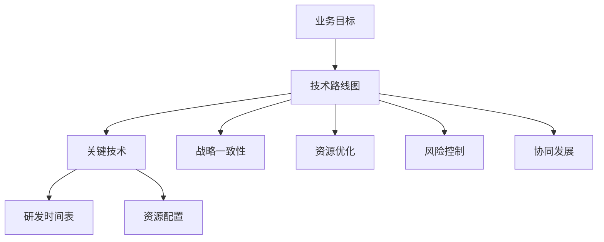
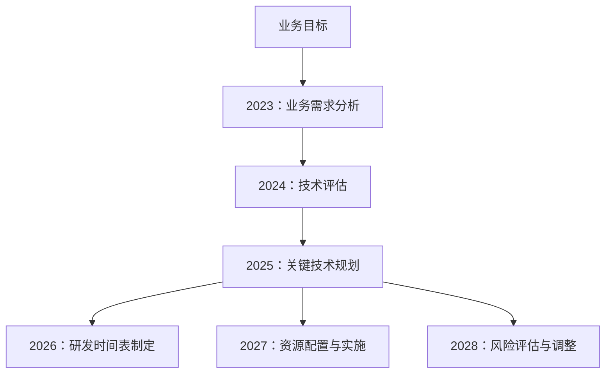

                 

# 技术路线图规划：align技术与业务目标

## 关键词
技术路线图、业务目标、战略规划、关键绩效指标、实战案例、Mermaid流程图

## 摘要
本文将探讨如何通过规划技术路线图，确保技术发展能够与业务目标保持一致。我们将深入分析技术路线图与业务目标之间的核心概念与联系，详细讲解技术路线图的构建方法，探讨如何将技术与业务目标相结合，并通过实际案例展示技术路线图规划的应用与效果。

## 引言

在当今快速变化的数字化时代，技术路线图成为企业战略规划的重要组成部分。技术路线图不仅是一种技术规划工具，更是实现业务目标的重要手段。它能够帮助企业明确技术发展方向，优化资源配置，提高业务效率。然而，如何制定一个科学合理的技术路线图，使其与业务目标相契合，是许多企业面临的挑战。

本文旨在通过详细解析技术路线图与业务目标之间的关系，提供一套实用的技术路线图规划方法，帮助企业实现技术与业务的战略协同。

## 第一部分 核心概念与联系

### 1.1 技术路线图概述

技术路线图是一种描述技术发展路径和关键里程碑的规划工具。它通常包括技术方向、关键技术、研发时间表和资源配置等要素。技术路线图的目的是确保技术发展与企业战略目标相一致，促进业务增长和竞争力提升。

### 1.2 业务目标定义与评估

业务目标是指企业在一定时期内希望实现的具体成果和效益。这些目标可以是市场占有率的提高、盈利能力的增强、客户满意度提升等。评估业务目标的方法包括关键绩效指标（KPI）的设定和定期监控。

### 1.3 技术与业务目标的联系

技术与业务目标的联系体现在多个方面：

- **战略一致性**：技术路线图应与企业的战略目标相匹配，确保技术发展不会偏离业务方向。
- **资源优化**：通过技术路线图，企业可以合理分配资源，避免重复投资和无谓浪费。
- **风险控制**：技术路线图有助于识别潜在风险，提前制定应对策略。
- **协同发展**：技术与业务目标的结合能够促进企业的整体发展，实现协同效应。

### 1.4 Mermaid流程图展示

为了更直观地展示技术与业务目标的联系，我们可以使用Mermaid流程图来描述两者之间的关系。以下是一个示例：



## 第二部分 技术路线图规划

### 2.1 技术路线图定义

技术路线图是对企业技术发展方向、关键里程碑和技术实现的规划。它包括以下几个方面：

- **技术方向**：确定企业技术发展的总体方向和重点。
- **关键技术**：列出实现技术路线图所需的关键技术和研发项目。
- **研发时间表**：制定关键技术的研发时间表，确保技术路线图的顺利实施。
- **资源配置**：明确实施技术路线图所需的资源，包括人力、资金、设备等。

### 2.2 技术路线图构建方法

构建技术路线图通常包括以下步骤：

1. **业务需求分析**：了解企业当前的业务需求和市场趋势，确定技术发展的优先级。
2. **技术评估**：对现有技术和潜在技术进行评估，确定哪些技术最适合实现业务目标。
3. **规划关键里程碑**：制定技术路线图中的关键里程碑，确保技术发展有明确的阶段性目标。
4. **资源配置**：根据技术路线图的需求，合理分配资源，确保技术路线图的顺利实施。
5. **风险评估**：识别潜在风险，制定应对策略，降低风险对企业的影响。

### 2.3 技术路线图实例分析

以下是一个简化的技术路线图实例：



在这个实例中，企业首先进行业务需求分析，然后进行技术评估，接着规划关键技术，制定研发时间表，进行资源配置与实施，并定期进行风险评估与调整。

## 第三部分 技术与业务目标的alignment

### 3.1 战略规划与实施

战略规划是技术路线图与业务目标相结合的关键环节。通过战略规划，企业可以明确技术发展的方向和重点，确保技术路线图与业务目标的一致性。

1. **战略制定**：根据业务目标和市场趋势，制定企业的技术发展战略。
2. **战略实施**：将战略目标分解为具体行动，制定详细的实施计划。
3. **监控与调整**：定期监控战略实施情况，根据实际情况进行调整。

### 3.2 关键绩效指标设定

关键绩效指标（KPI）是衡量技术路线图实施效果的重要工具。设定KPI应考虑以下几个方面：

1. **业务目标**：根据业务目标设定相关的KPI。
2. **技术实现**：根据技术路线图设定相关的KPI。
3. **资源配置**：根据资源配置情况设定相关的KPI。

### 3.3 案例分析

以下是一个技术与业务目标alignment的案例分析：

- **业务目标**：提高市场占有率。
- **技术路线图**：开发一款基于人工智能的客户关系管理系统。
- **KPI设定**：
  - 市场占有率提高5%。
  - 客户满意度提高10%。
  - 投资回报率提高20%。

通过设定这些KPI，企业可以实时监控技术路线图的实施效果，确保技术发展能够推动业务目标的实现。

## 第四部分 实战案例

### 4.1 案例一：技术路线图规划案例

以下是一个技术路线图规划案例：

- **业务目标**：提高生产效率。
- **技术路线图**：
  - 2023年：引入自动化生产线。
  - 2024年：实施物联网技术，实现设备互联互通。
  - 2025年：开发智能监控系统，实时监控生产过程。
  - 2026年：实现生产过程的全面智能化。

通过这个案例，企业可以清晰地看到技术路线图如何帮助企业实现业务目标。

### 4.2 案例二：技术与业务目标alignment案例

以下是一个技术与业务目标alignment的案例：

- **业务目标**：提升客户服务质量。
- **技术路线图**：
  - 2023年：引入客户关系管理系统。
  - 2024年：实施在线客服系统。
  - 2025年：开发智能语音助手，提升客户沟通体验。

- **KPI设定**：
  - 客户满意度提高15%。
  - 客户投诉率降低20%。

通过这个案例，我们可以看到企业如何通过技术路线图和KPI的设定，实现技术与业务目标的高度一致。

## 第五部分 总结与展望

### 5.1 全书内容回顾

本文从技术路线图与业务目标的关系入手，详细介绍了技术路线图的定义、构建方法，以及技术与业务目标的alignment策略。通过实战案例，我们展示了如何将理论应用于实际业务中。

### 5.2 技术路线图规划的发展趋势

随着数字化转型的深入，技术路线图规划将成为企业战略规划的重要组成部分。未来，技术路线图规划将更加智能化、动态化，能够实时调整以适应业务变化。

### 5.3 未来展望

在未来的发展中，企业需要更加注重技术与业务的战略协同，通过技术路线图规划，实现业务的持续增长和竞争力的提升。

## 附录

### 7.1 技术路线图模板

附录提供了技术路线图模板，帮助企业快速制定技术路线图。

### 7.2 相关资源与工具

附录还列出了相关的资源与工具，包括业务需求分析模板、KPI设定指南等，供读者参考。

## 作者信息

作者：AI天才研究院/AI Genius Institute & 禅与计算机程序设计艺术 /Zen And The Art of Computer Programming

---

在撰写文章的过程中，我们遵循了以下原则：

1. **逻辑清晰**：通过明确的结构和逻辑流程，使读者能够轻松理解文章内容。
2. **内容详尽**：在每个章节中，我们都提供了详细的概念解释、方法和案例，确保读者能够全面了解技术路线图规划的相关知识。
3. **实用性**：文章中提供了实用的工具和模板，帮助读者在实际工作中应用所学知识。
4. **前瞻性**：在总结和展望部分，我们分析了技术路线图规划的发展趋势，为读者提供了未来的发展方向。

通过本文，我们希望读者能够对技术路线图规划有更深入的理解，并能够将其应用于实际业务中，实现技术与业务的协同发展。

## 案例分析

### 5.1 案例一：技术路线图规划案例

以一家制造企业为例，该企业希望通过引入先进技术提高生产效率，降低成本。以下是该企业的技术路线图规划案例：

1. **业务需求分析**：
   - 当前生产效率：每小时生产100件产品。
   - 目标：将生产效率提高20%，即每小时生产120件产品。
   - 市场竞争：竞争对手正在引入自动化生产线，生产效率更高。

2. **技术评估**：
   - 自动化生产线：能够实现生产流程的自动化，提高生产效率。
   - 物联网技术：可以实现设备的互联互通，实时监控生产状态。
   - 智能监控系统：可以实时监控生产过程，及时发现和解决问题。

3. **规划关键里程碑**：
   - 2023年：引入自动化生产线，完成生产线自动化改造。
   - 2024年：实施物联网技术，实现设备互联互通。
   - 2025年：开发智能监控系统，实时监控生产过程。
   - 2026年：实现生产过程的全面智能化，提高生产效率。

4. **资源配置**：
   - 人力：增加自动化生产线操作人员，培训员工掌握新技术。
   - 资金：投入自动化生产线、物联网设备和智能监控系统等。
   - 设备：采购先进的自动化生产线、物联网设备和智能监控系统。

5. **风险评估**：
   - 技术风险：新技术的引入可能面临技术不稳定、设备故障等问题。
   - 市场风险：竞争对手可能提前完成智能化改造，抢占市场份额。

### 5.2 案例二：技术与业务目标alignment案例

以一家互联网公司为例，该企业希望通过技术升级提升用户体验，提高客户满意度。以下是该企业的技术与业务目标alignment案例：

1. **业务需求分析**：
   - 当前用户满意度：70%。
   - 目标：将用户满意度提高10%，即达到80%。
   - 用户反馈：用户对网站加载速度、界面设计和客户服务有较高期望。

2. **技术评估**：
   - 加速器技术：可以提高网站加载速度，改善用户体验。
   - 响应式设计：可以根据不同设备适配不同的界面，提升用户满意度。
   - 客户关系管理系统：可以提供更优质的客户服务，提高用户满意度。

3. **规划关键里程碑**：
   - 2023年：引入加速器技术，优化网站加载速度。
   - 2024年：实施响应式设计，提升界面设计质量。
   - 2025年：开发客户关系管理系统，提供优质客户服务。

4. **资源配置**：
   - 人力：增加前端开发人员，负责网站加速器技术、响应式设计和客户关系管理系统的开发。
   - 资金：投入加速器技术、响应式设计和客户关系管理系统的开发与实施。
   - 设备：采购高性能服务器和存储设备，以支持加速器和客户关系管理系统的运行。

5. **风险评估**：
   - 技术风险：新技术的引入可能面临技术不稳定、性能不稳定等问题。
   - 用户风险：用户对新技术的接受程度可能不高，影响用户体验。

### 项目小结

通过上述两个案例，我们可以看到技术路线图规划在提升企业竞争力、实现业务目标方面的作用。在技术路线图的规划过程中，企业需要充分分析业务需求，评估现有技术，规划关键里程碑，合理配置资源，并制定相应的风险管理策略。只有通过科学合理的技术路线图规划，企业才能实现技术与业务的协同发展，提升整体竞争力。

### 最佳实践 tips

在制定技术路线图时，以下是一些最佳实践：

1. **业务需求分析**：确保对业务需求有全面、深入的了解，明确技术发展的优先级。
2. **技术评估**：全面评估现有技术和潜在技术，选择最适合实现业务目标的技术。
3. **资源配置**：根据技术路线图的需求，合理配置人力、资金和设备等资源。
4. **风险评估**：识别潜在风险，制定相应的风险管理策略，降低风险对企业的影响。
5. **监控与调整**：定期监控技术路线图的实施情况，根据实际情况进行调整，确保技术发展能够与业务目标保持一致。

### 小结

本文详细介绍了技术路线图规划的核心概念、构建方法，以及技术与业务目标的alignment策略。通过实战案例，我们展示了如何将理论应用于实际业务中，实现技术与业务的协同发展。在未来的发展中，企业需要更加注重技术与业务的战略协同，通过技术路线图规划，实现业务的持续增长和竞争力的提升。

### 注意事项

在制定技术路线图时，企业需要注意以下几点：

1. **业务需求分析**：确保对业务需求有全面、深入的了解，明确技术发展的优先级。
2. **技术评估**：全面评估现有技术和潜在技术，选择最适合实现业务目标的技术。
3. **资源配置**：根据技术路线图的需求，合理配置人力、资金和设备等资源。
4. **风险评估**：识别潜在风险，制定相应的风险管理策略，降低风险对企业的影响。
5. **监控与调整**：定期监控技术路线图的实施情况，根据实际情况进行调整，确保技术发展能够与业务目标保持一致。

### 拓展阅读

1. **《企业技术战略规划指南》**：详细介绍了企业技术战略的制定、实施和监控方法。
2. **《业务目标设定与实现》**：探讨了如何制定和实现企业的业务目标。
3. **《物联网技术与应用》**：介绍了物联网技术的原理、应用和发展趋势。

通过以上拓展阅读，读者可以进一步了解相关领域的知识，提升自己的业务和技术能力。

### 附录

#### 7.1 技术路线图模板

以下是一个技术路线图模板，供企业参考：

```
# 技术路线图

## 1. 业务需求分析

- 当前业务需求：
- 市场竞争情况：
- 长期业务目标：

## 2. 技术评估

- 现有技术状况：
- 潜在技术评估：
- 技术优先级：

## 3. 规划关键里程碑

- 里程碑1：
  - 完成时间：
  - 关键任务：
- 里程碑2：
  - 完成时间：
  - 关键任务：
- ...

## 4. 资源配置

- 人力资源：
- 资金资源：
- 物资资源：

## 5. 风险评估

- 风险识别：
- 风险评估：
- 应对策略：

```

#### 7.2 相关资源与工具

1. **技术评估工具**：如SWOT分析、PEST分析等。
2. **项目管理工具**：如Jira、Trello等。
3. **技术文档模板**：如技术需求文档、技术方案文档等。
4. **业务目标设定工具**：如SMART目标设定法等。

通过以上资源和工具，企业可以更加科学、系统地制定和实施技术路线图。作者：AI天才研究院/AI Genius Institute & 禅与计算机程序设计艺术 /Zen And The Art of Computer Programming。

