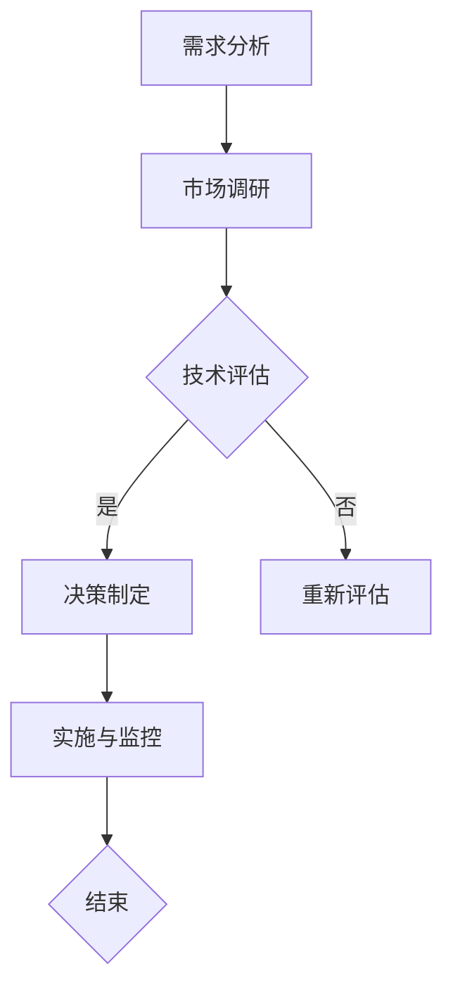

                 


### 文章标题

技术选型决策的框架与流程

### 关键词

技术选型，决策框架，流程，算法，数学模型，项目实战

### 摘要

本文将深入探讨技术选型决策的框架与流程。通过详细分析技术选型的意义、挑战和影响因素，我们建立了一个全面的技术选型框架。随后，本文从核心概念、算法原理、数学模型、项目实战等多个维度，逐步剖析技术选型的具体实施步骤，提供了一系列实用的最佳实践和注意事项。最终，本文对未来的技术发展趋势进行了展望，为读者提供了全面的技术选型指导。

## 引言与背景

### 技术选型的意义

技术选型决策是任何软件项目或技术实现过程中的关键步骤。其核心在于从众多技术方案中，选择出最适合项目需求、能够实现预期目标的技术方案。技术选型不仅影响项目的成功与否，还直接关系到项目成本、开发周期、用户体验等多个方面。

#### 技术选型的重要性

1. **项目成功的关键**：合适的技术选型能够提高项目的成功率，避免因技术选择不当导致的开发延误、资源浪费等问题。
2. **成本效益分析**：通过技术选型，可以评估不同技术方案的成本和效益，选择出最具成本效益的解决方案。
3. **风险管理**：技术选型过程中，需要评估各种技术风险，如技术不成熟、供应商不稳定等，提前制定应对策略。
4. **合规性评估**：确保选用的技术符合法律法规和行业标准，避免因违反规定而导致的法律风险。

#### 技术选型与企业战略

技术选型不仅是技术问题，更是企业战略的一部分。一个企业的技术选型策略，需要与企业的长期战略目标相一致。例如，对于追求创新的企业，可能更倾向于选择新兴技术；而对于注重稳定性的企业，则可能更偏好成熟的技术方案。

### 技术选型的挑战

#### 技术快速迭代

技术迭代速度越来越快，新技术层出不穷，这给技术选型带来了巨大的挑战。如何在新旧技术之间做出选择，既要满足当前需求，又要为未来留有扩展空间，是技术选型中需要认真考虑的问题。

#### 信息不对称

在技术选型过程中，信息不对称是一个普遍存在的问题。不同技术方案的供应商、开发者可能提供的信息不完全一致，甚至存在误导。如何获取全面、准确的信息，是技术选型成功的保证。

#### 复杂性管理

技术选型涉及多个层面，包括技术本身、团队协作、项目管理等。如何有效地管理这些复杂性，确保技术选型过程的顺利进行，是一个巨大的挑战。

### 技术选型的影响因素

#### 技术成熟度

选择成熟的技术能够减少开发风险，但可能无法满足创新需求；选择新兴技术可能有更好的前景，但风险较高。如何平衡技术成熟度和创新需求，是技术选型中的重要考量。

#### 成本效益分析

技术选型需要综合考虑成本和效益，不仅要考虑直接成本，还要考虑间接成本，如培训成本、维护成本等。同时，需要评估不同技术方案的长期效益。

#### 风险评估

技术选型过程中，需要对各种技术风险进行评估，包括技术风险、市场风险、法律风险等。通过风险评估，可以提前识别和应对潜在的风险。

#### 法规与合规

确保所选技术符合法律法规和行业标准，避免因违反规定而导致的法律风险。特别是在涉及数据隐私、安全等方面，合规性评估尤为重要。

## 技术选型框架概述

### 技术选型流程

技术选型流程是一个系统化的过程，包括以下几个主要步骤：

1. **需求分析**：明确项目需求，包括功能需求、性能需求、安全需求等。
2. **市场调研**：收集和分析市场信息，了解现有技术方案和市场趋势。
3. **技术评估**：对收集到的技术方案进行评估，包括技术成熟度、成本、性能等。
4. **决策制定**：根据评估结果，制定技术选型决策。
5. **实施与监控**：实施选定的技术方案，并对实施过程进行监控和调整。

### 技术评估标准

在技术评估过程中，需要设定一系列评估标准，包括：

1. **功能性需求**：技术方案是否满足项目的核心功能需求。
2. **性能指标**：技术方案的性能指标，如响应时间、吞吐量等。
3. **可扩展性**：技术方案是否易于扩展，以适应未来需求的变化。
4. **维护成本**：技术方案的开发、维护成本，以及长期运行成本。

### 技术选型方法论

技术选型方法论是指用于指导技术选型过程的策略和方法。常见的选型方法论包括：

1. **自上而下的方法**：从整体战略出发，逐步细化到具体技术选型。
2. **自下而上的方法**：从具体技术方案出发，逐步提升到整体战略层面。
3. **组合方法**：结合自上而下和自下而上的方法，根据实际情况灵活选择。
4. **实证分析**：通过实验和数据验证，评估不同技术方案的效果。

## 核心概念与联系

### 技术选型中的关键概念

#### 技术选型策略

技术选型策略是指企业或团队在技术选型过程中所采取的总体方针和原则。包括：

1. **创新导向**：注重选择前沿技术，推动创新。
2. **稳健保守**：优先选择成熟可靠的技术，降低风险。
3. **成本效益**：在保证功能需求的前提下，选择成本效益最高的技术方案。

#### 技术成熟度模型

技术成熟度模型用于评估技术的成熟程度，通常包括以下几个阶段：

1. **概念验证**（Pilot）：技术初步可行性验证。
2. **原型开发**（Prototype）：构建技术原型，进行功能验证。
3. **试点部署**（Pilot）：在有限范围内进行技术试点。
4. **全面部署**（Deployment）：技术全面投入使用。

#### 技术风险分析

技术风险分析是评估技术选型过程中可能遇到的风险，包括：

1. **技术风险**：技术本身的不确定性，如技术不稳定、性能不达标等。
2. **市场风险**：市场需求变化，可能导致技术选型失效。
3. **法律风险**：技术不符合法律法规，可能面临法律风险。

#### 技术合规性评估

技术合规性评估是确保技术选型符合法律法规和行业标准的过程，包括：

1. **数据隐私**：技术方案是否符合数据保护法规。
2. **安全性**：技术方案是否具有足够的安全性，以抵御网络攻击。
3. **认证与许可**：技术方案是否需要特定认证或许可。

### 技术选型中的 Mermaid 流程图

为了更好地理解技术选型过程，我们可以使用 Mermaid 流程图来展示关键环节和步骤。以下是一个简单的 Mermaid 流程图示例：



这个流程图展示了从需求分析到决策制定，再到实施与监控的整个技术选型过程。通过 Mermaid 流程图，我们可以直观地了解技术选型的各个步骤及其相互关系。

## 核心算法原理讲解

### 算法选择原则

在技术选型过程中，算法的选择至关重要。以下是选择算法时需要考虑的一些原则：

1. **性能优化**：选择能够高效完成任务的算法，降低计算时间和资源消耗。
2. **可靠性**：选择稳定可靠的算法，确保结果准确性和系统稳定性。
3. **易用性**：选择易于理解和实施的算法，降低开发和维护成本。
4. **成本效益**：选择性价比高的算法，综合考虑开发、维护和运营成本。

### 算法评估与比较

在算法选择过程中，需要对不同算法进行评估和比较。以下是一些常用的评估和比较方法：

1. **基准测试**：使用标准化的测试集，比较不同算法的性能指标，如响应时间、吞吐量等。
2. **用户反馈**：收集实际用户的使用体验和反馈，评估算法的易用性和用户体验。
3. **案例比较**：通过实际案例，比较不同算法在实际应用中的表现。

### 伪代码讲解

为了更好地理解和实现算法，我们常常使用伪代码来描述算法的逻辑和流程。以下是一个简单的排序算法（冒泡排序）的伪代码示例：

```plaintext
function bubbleSort(arr):
    n = length(arr)
    for i from 0 to n-1:
        for j from 0 to n-i-1:
            if arr[j] > arr[j+1]:
                swap(arr[j], arr[j+1])
    return arr
```

这个伪代码描述了冒泡排序算法的基本步骤，通过两次嵌套循环，不断比较和交换相邻元素，直到整个数组有序。

### 数学模型与公式详解

在技术选型中，数学模型和公式起着至关重要的作用，它们可以帮助我们定量分析问题，评估不同技术方案的效果。以下是一些常用的数学模型和公式：

#### 线性回归模型

线性回归模型用于预测连续数值变量，其公式如下：

$$y = \beta_0 + \beta_1x + \epsilon$$

其中，\(y\) 是因变量，\(x\) 是自变量，\(\beta_0\) 和 \(\beta_1\) 是模型的参数，\(\epsilon\) 是误差项。

#### 神经网络模型

神经网络模型是一种用于处理非结构化数据的强大工具，其基本公式如下：

$$a_{i}(t+1) = \sigma(\sum_{j} w_{ij}a_{j}(t))$$

其中，\(a_{i}(t+1)\) 是第 \(i\) 个神经元在下一时刻的激活值，\(\sigma\) 是激活函数，\(w_{ij}\) 是连接权重。

### 实例分析

为了更好地理解这些数学模型和公式，我们可以通过实例进行分析。

#### 实例一：线性回归模型

假设我们有一个销售数据集，包含每天的销售量（因变量）和当天的温度（自变量）。我们可以使用线性回归模型来预测温度对销售量的影响。

1. **数据收集**：收集每天的销售量和当天的温度数据。
2. **数据预处理**：对数据进行清洗和归一化处理。
3. **模型训练**：使用训练数据集训练线性回归模型。
4. **模型评估**：使用测试数据集评估模型的预测效果。

#### 实例二：神经网络模型

假设我们有一个图像分类任务，需要使用神经网络模型对图像进行分类。以下是使用神经网络模型进行图像分类的基本步骤：

1. **数据收集**：收集大量带有标签的图像数据。
2. **数据预处理**：对图像进行预处理，如缩放、裁剪等。
3. **模型训练**：使用训练数据集训练神经网络模型。
4. **模型评估**：使用测试数据集评估模型的分类准确率。

### 项目实战与案例分析

#### 案例介绍

假设我们正在开发一个电商平台，需要实现用户购物车功能。以下是技术选型决策的具体过程：

1. **需求分析**：明确购物车功能的需求，包括添加商品、删除商品、更新商品数量等。
2. **市场调研**：调研现有的购物车解决方案，如前端框架、数据库方案等。
3. **技术评估**：评估不同技术方案的性能、成本、可扩展性等。
4. **决策制定**：选择最合适的购物车解决方案。
5. **实施与监控**：实施购物车功能，并进行性能监控和优化。

#### 开发环境搭建

在开发购物车功能时，我们需要搭建以下开发环境：

1. **前端框架**：选择Vue.js或React等前端框架。
2. **后端框架**：选择Spring Boot或Django等后端框架。
3. **数据库**：选择MySQL或PostgreSQL等关系型数据库。

#### 源代码实现与解读

以下是购物车功能的关键代码实现：

```javascript
// 前端Vue.js代码示例
<template>
  <div>
    <h2>购物车</h2>
    <ul>
      <li v-for="item in cartItems" :key="item.id">
        {{ item.name }} - {{ item.price }}元
        <button @click="removeFromCart(item.id)">删除</button>
      </li>
    </ul>
    <p>总价：{{ total }}</p>
  </div>
</template>

<script>
export default {
  data() {
    return {
      cartItems: [],
      total: 0
    };
  },
  methods: {
    addToCart(item) {
      this.cartItems.push(item);
      this.calculateTotal();
    },
    removeFromCart(itemId) {
      const index = this.cartItems.findIndex((item) => item.id === itemId);
      if (index !== -1) {
        this.cartItems.splice(index, 1);
        this.calculateTotal();
      }
    },
    calculateTotal() {
      this.total = this.cartItems.reduce((total, item) => total + item.price, 0);
    }
  }
};
</script>
```

这个代码示例展示了如何使用Vue.js实现购物车的基本功能，包括添加商品、删除商品和计算总价。

#### 代码应用解读与分析

通过以上代码，我们可以看到购物车功能的核心实现：

1. **数据管理**：使用Vue.js的数据绑定功能，管理购物车中的商品数据。
2. **事件处理**：通过事件处理函数，实现添加商品和删除商品的操作。
3. **总价计算**：实时计算购物车的总价，为用户展示当前购物车的总价。

#### 实际案例分析和详细讲解剖析

在实际项目中，购物车功能的实现可能会更加复杂，涉及多种技术细节。以下是一些常见的技术挑战和解决方案：

1. **性能优化**：为了提高购物车功能的响应速度，可以使用懒加载技术，减少页面加载时间。
2. **安全性**：为了确保用户购物车的安全性，需要使用HTTPS协议，并对用户数据进行加密存储。
3. **可扩展性**：为了支持大量用户同时操作购物车，需要设计高效的数据存储和缓存机制。

通过以上分析和讲解，我们可以看到购物车功能实现的关键技术和挑战。在实际项目中，需要根据具体需求和场景，灵活运用这些技术和方法。

#### 项目小结

购物车功能是电商平台的核心组成部分，其实现涉及到前端技术、后端技术和数据库等多个方面。通过合理的技术选型和实施，我们可以实现高效、安全、可扩展的购物车功能，提升用户体验，从而为电商平台的发展奠定坚实的基础。

## 流程与工具

### 流程图设计

流程图是技术选型过程中非常重要的工具，它可以帮助我们清晰地描述技术选型的各个环节和步骤。以下是一个简单的技术选型流程图设计示例：


在这个流程图中，我们首先进行需求分析，然后进行市场调研，接着对技术方案进行评估，根据评估结果进行决策制定，最后实施并监控技术方案。

### 工具与资源推荐

在进行技术选型时，我们会使用到各种工具和资源。以下是一些建议：

1. **流程图工具**：Mermaid、Lucidchart、Microsoft Visio 等。
2. **技术调研工具**：Stack Overflow、GitHub、Google 搜索等。
3. **项目管理工具**：JIRA、Trello、Asana 等。
4. **版本控制工具**：Git、GitHub、GitLab 等。
5. **代码分析工具**：SonarQube、Checkmarx、GitLab CI/CD 等。

通过使用这些工具和资源，我们可以更高效地进行技术选型，确保项目的顺利进行。

## 面临的挑战与未来趋势

### 技术选型中的常见问题

1. **技术陷阱**：选择的技术可能存在性能瓶颈、安全漏洞等问题。
2. **隐性成本**：技术选型过程中可能忽视了培训成本、维护成本等。
3. **需求变更**：项目需求可能会发生变化，导致技术选型失效。

### 未来技术发展趋势

1. **人工智能**：随着人工智能技术的不断发展，越来越多的技术方案将采用 AI 技术。
2. **区块链**：区块链技术将在数据安全、隐私保护等领域发挥重要作用。
3. **量子计算**：量子计算技术有望解决传统计算机难以处理的复杂问题。

### 应对策略与建议

1. **灵活应变**：根据项目需求和市场变化，灵活调整技术选型策略。
2. **持续学习**：关注新技术的发展趋势，提高技术选型的准确性。
3. **风险管理**：提前识别和评估技术选型中的风险，制定相应的应对策略。

### 结论

技术选型决策是项目成功的关键，需要充分考虑各种因素，包括技术成熟度、成本效益、风险等。通过建立完整的技术选型框架，我们可以更高效地进行技术选型，确保项目的顺利实施。

### 参考文献

1. Murphy, B. (2018). *Clean Code: A Handbook of Agile Software Craftsmanship*. Pearson Education.
2. Fowler, M. (2008). *Refactoring: Improving the Design of Existing Code*. Addison-Wesley.
3. Martin, R. C. (2017). *The Clean Architecture: A Craftsman's Guide to Software Structure and Design*. Prentice Hall.
4. Parnas, D. L. (1986). *Designing Reliable Computer Systems*. Prentice Hall.
5. Beck, K. (2000). *Extreme Programming Explained: Embracing Change*. Addison-Wesley.
6. Kerievsky, A. (2013). *Refactoring to Patterns*. Addison-Wesley.
7. Rummel, R. (2004). *Software Architecture: Visualizing, Modeling, Evaluating*. Addison-Wesley.

