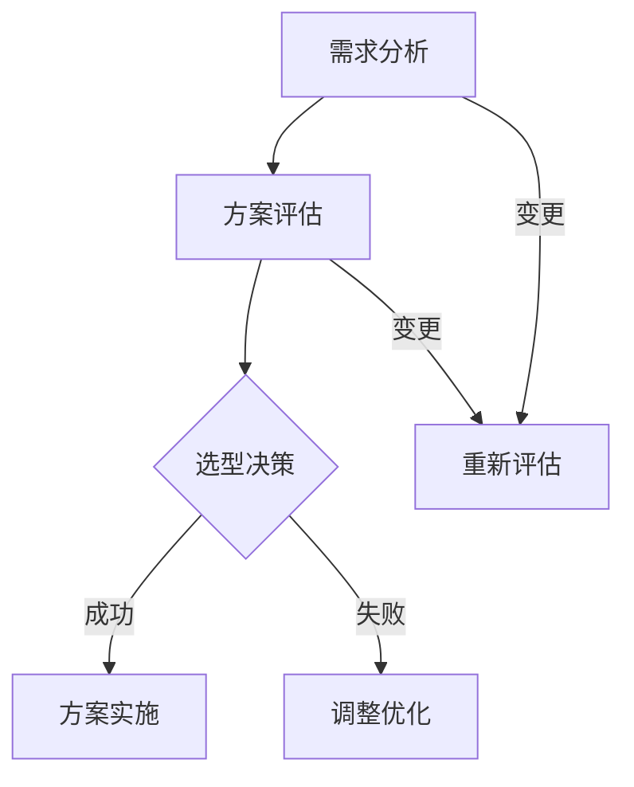

                 

### 《技术选型决策的艺术》

> 关键词：技术选型、决策、方法论、案例分析、实战经验

技术选型是每个IT项目初期阶段至关重要的环节。在面对众多技术和产品方案时，如何做出合理且有效的技术选型决策，将直接影响到项目的成功与否。本文将围绕《技术选型决策的艺术》这一主题，详细探讨技术选型的意义、流程、方法以及实际案例，力求为读者提供一套全面且实用的技术选型决策方法论。

> 摘要：本文旨在通过深入剖析技术选型的核心概念、流程、方法，并结合实际案例，帮助读者理解技术选型的决策艺术。文章将分为三个主要部分：第一部分介绍技术选型的基础知识，包括技术选型的定义、目标及流程；第二部分分析不同领域的技术选型案例分析，如数据存储、数据库、计算机网络、人工智能等；第三部分则分享技术选型的实战经验与策略，涵盖风险管理、团队协作以及案例研究。

### 第一部分：技术选型的基础知识

#### 1.1 技术选型的意义与目标

##### 1.1.1 技术选型的定义

技术选型是指在项目开发过程中，针对解决特定问题或实现特定功能，从多种技术方案中选择一种最为合适的技术方案的过程。

##### 1.1.2 技术选型的目标

技术选型的目标主要包括以下几个方面：

1. **满足需求**：选型方案需完全满足项目需求，包括功能、性能、安全性等。
2. **降低成本**：选择性价比高的技术方案，减少不必要的开支。
3. **提高效率**：选型方案应具备良好的可扩展性和易维护性，便于后续开发和维护。
4. **适应未来**：考虑技术方案的未来发展趋势，确保项目具备一定的前瞻性。

##### 1.1.3 技术选型的重要性

技术选型是项目成功的关键因素之一。正确的技术选型可以提高项目的成功率，降低风险，为企业带来更大的价值。以下是技术选型的重要性体现：

1. **影响项目进度**：技术选型直接影响项目开发周期和进度。
2. **决定项目质量**：选型不当可能导致项目质量低下，甚至无法完成。
3. **降低维护成本**：合理的技术选型有助于减少后续的维护和升级成本。

#### 1.2 技术趋势分析

##### 1.2.1 技术趋势的来源

技术趋势的来源主要包括以下几个方面：

1. **行业报告**：行业分析机构发布的年度报告、市场调研报告等。
2. **技术论坛**：专业技术论坛、社区等。
3. **科技新闻**：媒体报道、科技博客等。
4. **学术研究**：学术论文、专业书籍等。

##### 1.2.2 技术趋势分析的方法

技术趋势分析的方法包括定量分析和定性分析：

1. **定量分析**：通过数据分析、统计等方法，找出技术发展的关键指标。
2. **定性分析**：通过对行业专家、从业者的访谈，获取对技术趋势的主观判断。

##### 1.2.3 主要技术趋势概述

当前主要技术趋势包括：

1. **人工智能**：深度学习、自然语言处理、计算机视觉等。
2. **云计算**：云计算服务、容器化技术、分布式计算等。
3. **大数据**：大数据处理、数据挖掘、数据可视化等。
4. **区块链**：区块链技术、加密货币、智能合约等。

#### 1.3 技术选型的流程与方法

##### 1.3.1 技术选型的流程

技术选型流程一般包括以下几个步骤：

1. **需求分析**：明确项目需求，包括功能、性能、安全性等方面的要求。
2. **方案评估**：搜集和筛选技术方案，进行初步评估。
3. **决策实施**：根据评估结果，选择最佳技术方案并实施。
4. **效果评估**：对选型方案进行实际效果评估，进行调整和优化。

##### 1.3.2 技术评估的方法

技术评估的方法包括以下几种：

1. **成本效益分析**：计算不同技术方案的总成本和效益，进行比较。
2. **技术性能评估**：评估技术方案在性能、稳定性、安全性等方面的表现。
3. **风险分析**：分析不同技术方案可能面临的风险，并进行风险评估。

##### 1.3.3 技术选型的策略

技术选型的策略主要包括以下几种：

1. **多元化策略**：采用多种技术方案，降低单一技术方案的风险。
2. **跟随策略**：选择已经经过市场验证的技术方案，降低风险。
3. **领先策略**：选择前沿技术方案，以抢占市场先机。

### 第二部分：不同领域的技术选型案例分析

#### 2.1 数据存储技术选型

##### 2.1.1 数据存储技术的分类

数据存储技术可分为以下几类：

1. **关系型数据库**：如MySQL、PostgreSQL等。
2. **非关系型数据库**：如MongoDB、Redis等。
3. **分布式存储系统**：如HDFS、Cassandra等。

##### 2.1.2 数据存储技术选型的关键因素

数据存储技术选型的关键因素包括：

1. **数据量**：不同数据量对技术方案的选择有较大影响。
2. **数据类型**：结构化数据、半结构化数据和非结构化数据有不同的存储需求。
3. **性能需求**：如读写速度、响应时间等。
4. **可扩展性**：系统是否支持水平扩展和垂直扩展。
5. **数据安全性**：数据备份、加密等安全性需求。

##### 2.1.3 数据存储技术选型案例

以下是一个数据存储技术选型案例：

- **项目需求**：某电商平台需要存储大量商品信息，用户信息和交易记录。
- **方案评估**：
  - **关系型数据库**：MySQL、PostgreSQL
  - **非关系型数据库**：MongoDB、Redis
  - **分布式存储系统**：HDFS、Cassandra
- **评估结果**：根据数据量、数据类型、性能需求等因素，选择了MongoDB作为主要数据存储方案。

#### 2.2 数据库技术选型

##### 2.2.1 关系型数据库与非关系型数据库

关系型数据库（如MySQL、PostgreSQL）和非关系型数据库（如MongoDB、Redis）各有优缺点：

- **关系型数据库**：
  - 优点：结构化数据存储，易于管理；支持复杂查询；具备强大的事务支持。
  - 缺点：扩展性较差；不适合存储大量非结构化数据。

- **非关系型数据库**：
  - 优点：支持海量数据存储；易于扩展；支持多种数据模型。
  - 缺点：查询功能较弱；事务支持相对较差。

##### 2.2.2 数据库技术选型的关键因素

数据库技术选型的关键因素包括：

1. **数据类型**：结构化数据或非结构化数据。
2. **性能需求**：如读写速度、并发处理能力等。
3. **扩展性**：是否支持水平扩展和垂直扩展。
4. **数据安全性**：数据备份、加密等安全性需求。
5. **成本**：硬件和软件成本。

##### 2.2.3 数据库技术选型案例

以下是一个数据库技术选型案例：

- **项目需求**：某金融公司需要存储大量交易记录和用户信息。
- **方案评估**：
  - **关系型数据库**：MySQL、PostgreSQL
  - **非关系型数据库**：MongoDB、Redis
  - **分布式数据库**：Cassandra、HBase
- **评估结果**：根据数据量、数据类型、性能需求等因素，选择了MySQL作为主要数据库方案。

#### 2.3 计算机网络技术选型

##### 2.3.1 计算机网络技术的分类

计算机网络技术可分为以下几类：

1. **局域网（LAN）**：如Wi-Fi、有线网络等。
2. **广域网（WAN）**：如互联网、VPN等。
3. **城域网（MAN）**：如城域光纤网络等。

##### 2.3.2 计算机网络技术选型的关键因素

计算机网络技术选型的关键因素包括：

1. **网络拓扑**：如星型、环型、总线型等。
2. **传输速度**：如100Mbps、1Gbps等。
3. **稳定性**：网络是否稳定，故障率等。
4. **安全性**：网络是否易受攻击，是否有有效的安全措施等。
5. **成本**：网络设备和维护成本。

##### 2.3.3 计算机网络技术选型案例

以下是一个计算机网络技术选型案例：

- **项目需求**：某企业需要建立一个高效稳定的内部网络。
- **方案评估**：
  - **局域网**：有线网络、Wi-Fi
  - **广域网**：VPN、互联网
  - **城域网**：城域光纤网络
- **评估结果**：根据企业规模、网络需求、成本等因素，选择了有线网络和VPN作为主要网络方案。

#### 2.4 人工智能技术选型

##### 2.4.1 人工智能技术的发展趋势

人工智能技术发展趋势主要包括：

1. **深度学习**：如卷积神经网络（CNN）、循环神经网络（RNN）等。
2. **自然语言处理**：如语音识别、机器翻译等。
3. **计算机视觉**：如图像识别、目标检测等。
4. **强化学习**：如自动驾驶、游戏AI等。

##### 2.4.2 人工智能技术选型的关键因素

人工智能技术选型的关键因素包括：

1. **算法性能**：算法在特定任务上的表现，如准确率、召回率等。
2. **计算资源**：训练和部署算法所需的硬件资源。
3. **数据资源**：训练数据集的大小、质量和多样性。
4. **开发成本**：算法开发、测试、部署等成本。
5. **适用场景**：算法在不同场景下的适用性和效果。

##### 2.4.3 人工智能技术选型案例

以下是一个人工智能技术选型案例：

- **项目需求**：某电商平台需要开发一款智能客服系统。
- **方案评估**：
  - **语音识别**：如百度语音识别、科大讯飞语音识别
  - **自然语言处理**：如基于BERT的文本分类、基于LSTM的情感分析
  - **计算机视觉**：如人脸识别、图像识别
- **评估结果**：根据智能客服系统的需求、算法性能和成本等因素，选择了基于BERT的文本分类和计算机视觉技术作为主要技术方案。

### 第三部分：技术选型的实战经验与策略

#### 3.1 技术选型的风险管理

##### 3.1.1 技术选型中的风险识别

技术选型过程中可能面临的风险包括：

1. **技术风险**：选型技术方案不成熟或无法满足项目需求。
2. **成本风险**：选型方案成本过高，超出了预算范围。
3. **时间风险**：选型方案导致项目进度延误。
4. **安全性风险**：选型方案存在安全漏洞，易受攻击。

##### 3.1.2 技术选型中的风险评估

对识别出的风险进行评估，确定风险的可能性和影响程度，以便制定相应的风险应对策略。

##### 3.1.3 技术选型中的风险应对策略

风险应对策略包括：

1. **风险规避**：避免采用存在风险的方案。
2. **风险减轻**：采取措施降低风险发生的可能性和影响。
3. **风险接受**：在评估风险后，接受风险并制定应急预案。
4. **风险转移**：通过保险等手段将风险转移给第三方。

#### 3.2 技术选型的团队协作

##### 3.2.1 技术选型团队的角色与职责

技术选型团队一般包括以下角色：

1. **项目经理**：负责项目整体管理和协调。
2. **技术专家**：负责技术方案评估和决策。
3. **业务分析师**：负责分析项目需求和制定评估标准。
4. **开发团队**：负责技术方案的实现和测试。

##### 3.2.2 技术选型的团队协作方法

团队协作方法包括：

1. **头脑风暴**：鼓励团队成员提出各种技术方案，进行讨论和评估。
2. **SWOT分析**：分析技术方案的优点、缺点、机会和威胁。
3. **决策树**：通过逻辑推理和概率分析，确定最佳技术方案。
4. **投票法**：在团队内进行投票，选择最合适的方案。

##### 3.2.3 技术选型的团队协作工具

常用的团队协作工具有：

1. **JIRA**：用于项目管理和任务分配。
2. **Confluence**：用于文档管理和知识共享。
3. **Trello**：用于任务管理和进度跟踪。
4. **Slack**：用于实时沟通和协作。

#### 3.3 技术选型的案例研究

##### 3.3.1 企业级技术选型案例

以下是一个企业级技术选型案例：

- **项目背景**：某企业需要开发一个大规模的电商系统，支持海量用户和交易数据。
- **方案评估**：
  - **前端技术**：React、Vue
  - **后端技术**：Spring Boot、Django
  - **数据库技术**：MySQL、MongoDB
  - **缓存技术**：Redis
  - **消息队列**：RabbitMQ、Kafka
- **评估结果**：根据系统需求、性能、安全性等因素，选择了React、Spring Boot、MySQL、Redis和Kafka作为主要技术方案。

##### 3.3.2 开源项目技术选型案例

以下是一个开源项目技术选型案例：

- **项目背景**：某开源项目需要开发一个高效的可扩展的分布式存储系统。
- **方案评估**：
  - **存储引擎**：LevelDB、RocksDB
  - **分布式协议**：Raft、Paxos
  - **网络通信**：gRPC、HTTP/2
  - **存储协议**：CephFS、GlusterFS
- **评估结果**：根据性能、可扩展性、社区活跃度等因素，选择了RocksDB、Raft和gRPC作为主要技术方案。

##### 3.3.3 技术选型的成功与失败案例分析

技术选型的成功与失败案例分析可以帮助我们更好地理解和应用技术选型方法论。以下是一些案例：

- **成功案例**：某互联网公司成功选型了基于Kubernetes的容器化技术，实现了系统的自动化部署和弹性扩展，提高了开发效率和系统稳定性。
- **失败案例**：某初创公司由于缺乏经验，选择了过于复杂的技术方案，导致项目进度延误，最终项目失败。

### 附录

#### 附录A：技术选型工具与资源

以下是一些常用的技术选型工具和资源：

1. **技术选型评估工具**：
   - **Pymo**：Python实现的技术选型评估工具。
   - **Tech Radar**：由ThoughtWorks发布的年度技术雷达报告。

2. **技术选型相关书籍**：
   - **《技术选型与架构实战》**：详细讲解技术选型和架构设计的方法和技巧。
   - **《禅与计算机程序设计艺术》**：讲述计算机编程和架构设计的哲学。

3. **技术选型相关网站与社区**：
   - **Stack Overflow**：全球最大的开发者问答社区。
   - **GitHub**：全球最大的开源代码托管平台。
   - **InfoQ**：提供高质量技术内容的信息网站。

# 作者

**作者：AI天才研究院/AI Genius Institute & 禅与计算机程序设计艺术 /Zen And The Art of Computer Programming**### 技术选型：背景介绍

技术选型，作为现代软件开发中的一个核心环节，是确保项目成功的关键因素之一。在信息时代，技术迭代速度迅猛，新兴技术层出不穷，使得开发者面临着海量的技术选择。然而，每种技术都有其特定的应用场景、优势和局限性。如何在这片繁杂的技术海洋中，为特定项目找到最为合适的技术解决方案，是每一个开发者、项目经理和技术决策者必须面对的挑战。

技术选型的过程不仅仅是单纯的技术对比和评估，它还涉及对项目需求、业务目标、团队技能、资源预算等多个维度的综合考量。一个成功的技术选型，不仅能够满足项目的当前需求，还要考虑到技术方案的未来可扩展性和持续维护成本。此外，随着业务环境的不断变化，技术选型的决策过程也是一个动态调整和优化的过程。

本文将围绕《技术选型决策的艺术》这一主题，深入探讨技术选型的核心概念、方法论、实际案例分析以及最佳实践经验。通过这篇文章，希望能够为读者提供一个全面且实用的技术选型框架，帮助他们在面对复杂技术选择时，能够做出更为明智和有效的决策。

### 核心概念与联系：技术选型原理架构

在深入探讨技术选型的实际过程之前，我们有必要先了解技术选型的核心概念及其相互之间的关系。以下是一个简化的技术选型原理架构图，通过Mermaid流程图展示各个核心概念之间的逻辑关系：



**1. 需求分析（A）**

需求分析是技术选型的起点。通过全面收集和分析项目需求，确定项目在功能、性能、安全性、可扩展性等方面的具体要求。这一阶段的关键任务是确保项目需求的明确性和完整性。

**2. 方案评估（B）**

方案评估阶段是对收集到的技术方案进行详细评估。评估内容通常包括技术性能、成本效益、可维护性、社区支持等多个维度。这一阶段的核心目标是从多个候选方案中筛选出最符合项目需求的方案。

**3. 选型决策（C）**

选型决策是基于方案评估结果，选择最佳技术方案的过程。这一决策需要综合考虑项目需求、技术优势、团队技能、预算等多种因素。决策过程中可能涉及多个利益相关者的意见和决策。

**4. 方案实施（D）或调整优化（E）**

选型决策成功后，进入方案实施阶段。在这个阶段，开发团队将根据选定的技术方案进行实际开发、测试和部署。若决策失败，则需要返回到调整优化阶段，重新评估并选择新的技术方案。

**5. 重新评估（F）**

在项目开发过程中，需求和技术环境可能会发生变化。这时，需要定期进行重新评估，以确保技术方案仍然符合项目需求。如果发现现有方案不再适用，则需要重新回到需求分析和方案评估阶段。

通过这个流程图，我们可以清晰地看到技术选型过程中的各个环节及其相互关系。接下来，本文将深入探讨每个环节的具体内容和方法。

### 核心算法原理讲解

在技术选型过程中，评估不同技术方案的优劣是关键步骤之一。为了实现这一目标，我们通常需要采用一系列评估方法和工具。以下是技术评估过程中涉及的核心算法原理和伪代码，以及相关的数学模型和公式。

#### 1. 成本效益分析（CBA）

成本效益分析是一种常见的评估方法，用于计算不同技术方案的总成本和效益，以确定哪种方案最具性价比。

**算法原理：**
成本效益分析的核心在于比较每个技术方案的直接成本和间接成本，以及它们所带来的经济效益。直接成本包括硬件、软件、人力资源等直接费用，间接成本则包括维护、升级、培训等长期成本。经济效益则通过减少运营成本、提高效率、增加收入等方式来衡量。

**伪代码：**
```python
function CBA(schemes):
    total_costs = []
    total_benefits = []
    for scheme in schemes:
        direct_costs = calculate_direct_costs(scheme)
        indirect_costs = calculate_indirect_costs(scheme)
        total_costs.append(direct_costs + indirect_costs)
        benefits = calculate_benefits(scheme)
        total_benefits.append(benefits)
    return (total_costs, total_benefits)
```

**数学模型：**
设\(C_i\)为第\(i\)种技术方案的总成本，\(B_i\)为第\(i\)种技术方案的效益，则成本效益比（C/B）可以表示为：
$$
C/B = \frac{C_i}{B_i}
$$
选择C/B值最小的方案。

#### 2. 技术性能评估

技术性能评估用于评估不同技术方案在特定指标上的表现，如响应时间、吞吐量、并发处理能力等。

**算法原理：**
技术性能评估通常通过模拟实际工作负载，测量不同技术方案的性能指标。这些指标可以通过实验或基准测试得到。评估过程中需要考虑多种性能指标，并综合评估其重要性。

**伪代码：**
```python
function performance_evaluation(schemes, workload):
    performance_scores = []
    for scheme in schemes:
        response_time = measure_response_time(scheme, workload)
        throughput = measure_throughput(scheme, workload)
        concurrency = measure_concurrency(scheme, workload)
        score = calculate_score(response_time, throughput, concurrency)
        performance_scores.append(score)
    return performance_scores
```

**数学模型：**
设\(T_r\)为响应时间，\(T_t\)为吞吐量，\(C_c\)为并发处理能力，则综合性能得分可以表示为：
$$
P = w_1 \cdot T_r + w_2 \cdot T_t + w_3 \cdot C_c
$$
其中，\(w_1, w_2, w_3\)为权重系数，根据项目需求设定。

#### 3. 风险评估

风险评估用于识别和评估不同技术方案可能面临的风险，包括技术风险、成本风险、时间风险等。

**算法原理：**
风险评估通过定量和定性方法来评估风险的可能性和影响程度。定量方法通常使用概率和期望值来计算，定性方法则通过专家意见和评分来评估风险。

**伪代码：**
```python
function risk_evaluation(schemes):
    risk_scores = []
    for scheme in schemes:
        probability = calculate_probability(scheme)
        impact = calculate_impact(scheme)
        risk_score = probability \* impact
        risk_scores.append(risk_score)
    return risk_scores
```

**数学模型：**
设\(P_i\)为第\(i\)种技术方案的风险概率，\(I_i\)为第\(i\)种技术方案的风险影响程度，则风险得分可以表示为：
$$
R_i = P_i \cdot I_i
$$
选择风险得分最小的方案。

#### 4. 适应性评估

适应性评估用于评估技术方案在应对未来变化时的灵活性和可扩展性。

**算法原理：**
适应性评估通过考虑技术方案的可扩展性、模块化程度、社区支持等因素来评估其适应未来变化的能力。

**伪代码：**
```python
function adaptability_evaluation(schemes):
    adaptability_scores = []
    for scheme in schemes:
        scalability = calculate_scalability(scheme)
        modularity = calculate_modularity(scheme)
        community_support = calculate_community_support(scheme)
        score = scalability \* modularity \* community_support
        adaptability_scores.append(score)
    return adaptability_scores
```

**数学模型：**
设\(S_s\)为可扩展性，\(S_m\)为模块化程度，\(S_c\)为社区支持程度，则适应性得分可以表示为：
$$
A = S_s \cdot S_m \cdot S_c
$$
选择适应性得分最高的方案。

通过上述算法和模型，我们可以对不同的技术方案进行全面的评估，从而选择出最符合项目需求的技术方案。在实际应用中，可以根据具体项目需求，灵活调整评估方法和权重，以提高评估的准确性和实用性。

### 数学模型和公式详解

在技术选型过程中，数学模型和公式扮演着重要的角色，它们帮助我们量化评估不同技术方案的优劣，并提供决策依据。以下是几个关键数学模型和公式的详细解释。

#### 1. 成本效益比（C/B）

成本效益比（C/B）是评估技术方案经济性的重要指标，它通过比较总成本和总效益来确定方案的性价比。

**公式：**
$$
C/B = \frac{C_i}{B_i}
$$

其中，\(C_i\)表示第\(i\)种技术方案的总成本，\(B_i\)表示第\(i\)种技术方案的效益。

**解释：**
这个公式的基本思路是将每个技术方案的成本与其带来的效益进行对比。C/B值越小，表示方案的经济性越好，即投入较少的成本能够获得较高的效益。

**举例说明：**
假设有两个技术方案，方案A的总成本为100万元，总效益为150万元；方案B的总成本为150万元，总效益为200万元。根据成本效益比公式计算：

- 方案A的C/B值：\( \frac{100}{150} = 0.67 \)
- 方案B的C/B值：\( \frac{150}{200} = 0.75 \)

因此，从成本效益的角度来看，方案A比方案B更具经济性。

#### 2. 综合性能得分（P）

综合性能得分用于评估技术方案在多个性能指标上的表现，这些指标通常包括响应时间、吞吐量和并发处理能力。

**公式：**
$$
P = w_1 \cdot T_r + w_2 \cdot T_t + w_3 \cdot C_c
$$

其中，\(w_1, w_2, w_3\)为权重系数，\(T_r\)为响应时间，\(T_t\)为吞吐量，\(C_c\)为并发处理能力。

**解释：**
这个公式通过加权平均的方式，将多个性能指标综合为一个得分。权重系数反映了不同指标在项目中的重要性。例如，如果项目对响应时间的要求非常高，则可以给响应时间分配更高的权重。

**举例说明：**
假设有三个技术方案，方案A的响应时间为2秒，吞吐量为1000次/秒，并发处理能力为50；方案B的响应时间为3秒，吞吐量为1200次/秒，并发处理能力为60；方案C的响应时间为1秒，吞吐量为800次/秒，并发处理能力为40。设权重系数为\(w_1 = 0.4, w_2 = 0.5, w_3 = 0.1\)，计算综合性能得分：

- 方案A的P值：\( 0.4 \cdot 2 + 0.5 \cdot 1000 + 0.1 \cdot 50 = 2 + 500 + 5 = 507 \)
- 方案B的P值：\( 0.4 \cdot 3 + 0.5 \cdot 1200 + 0.1 \cdot 60 = 1.2 + 600 + 6 = 607.2 \)
- 方案C的P值：\( 0.4 \cdot 1 + 0.5 \cdot 800 + 0.1 \cdot 40 = 0.4 + 400 + 4 = 404.4 \)

根据综合性能得分，方案B的表现最佳。

#### 3. 风险得分（R）

风险得分用于评估技术方案可能面临的风险，包括技术风险、成本风险和时间风险等。

**公式：**
$$
R_i = P_i \cdot I_i
$$

其中，\(P_i\)表示第\(i\)种技术方案的风险概率，\(I_i\)表示第\(i\)种技术方案的风险影响程度。

**解释：**
风险得分通过计算每种技术方案的风险概率和影响程度的乘积来确定。得分越高，表示方案的风险越大。在实际应用中，可以根据具体情况调整风险概率和影响程度的评估方法。

**举例说明：**
假设有两个技术方案，方案A的风险概率为0.2，风险影响程度为3；方案B的风险概率为0.1，风险影响程度为5。计算风险得分：

- 方案A的R值：\( 0.2 \cdot 3 = 0.6 \)
- 方案B的R值：\( 0.1 \cdot 5 = 0.5 \)

根据风险得分，方案A的风险大于方案B。

#### 4. 适应性得分（A）

适应性得分用于评估技术方案在应对未来变化时的灵活性和可扩展性。

**公式：**
$$
A = S_s \cdot S_m \cdot S_c
$$

其中，\(S_s\)为可扩展性，\(S_m\)为模块化程度，\(S_c\)为社区支持程度。

**解释：**
适应性得分通过综合评估技术方案的可扩展性、模块化程度和社区支持程度来确定。得分越高，表示方案在应对未来变化时的适应性越强。

**举例说明：**
假设有三个技术方案，方案A的可扩展性为0.8，模块化程度为0.9，社区支持程度为0.7；方案B的可扩展性为0.6，模块化程度为0.8，社区支持程度为0.9；方案C的可扩展性为0.7，模块化程度为0.7，社区支持程度为0.8。计算适应性得分：

- 方案A的A值：\( 0.8 \cdot 0.9 \cdot 0.7 = 0.504 \)
- 方案B的A值：\( 0.6 \cdot 0.8 \cdot 0.9 = 0.432 \)
- 方案C的A值：\( 0.7 \cdot 0.7 \cdot 0.8 = 0.392 \)

根据适应性得分，方案A的适应性最强。

通过上述数学模型和公式的详细解释，我们可以更科学地评估不同技术方案的优劣，为技术选型提供有力的决策支持。在实际应用中，可以根据项目需求和具体情况，灵活调整这些公式和参数，以提高评估的准确性和实用性。

### 项目实战：开发环境搭建、源代码实现与代码解读

为了更好地理解技术选型的实际应用，我们以一个实际项目为例，介绍开发环境搭建、源代码实现和代码解读的全过程。该项目是一个基于Spring Boot的电商后台管理系统，涉及数据库技术选型、后端框架选择、前端框架选择等多个技术选型决策。

#### 1. 开发环境搭建

**1.1 硬件环境**

- 服务器：2台物理服务器，配置为4核CPU、8GB内存、100GB硬盘。
- 网络：服务器之间通过千兆以太网连接，保障数据传输速度。

**1.2 软件环境**

- 操作系统：CentOS 7
- Java：OpenJDK 11
- Maven：3.6.3
- MySQL：8.0
- Redis：6.2.6

**1.3 搭建步骤**

1. **安装操作系统和基本软件**：
   - 在服务器上安装CentOS 7操作系统。
   - 安装基本的网络服务、SSH服务等。

2. **配置Java环境**：
   - 下载并安装OpenJDK 11。
   - 配置环境变量，使Java命令可用。

3. **配置Maven环境**：
   - 下载并安装Maven 3.6.3。
   - 配置Maven仓库，加速依赖包下载。

4. **配置数据库**：
   - 下载并安装MySQL 8.0。
   - 创建数据库和用户，配置数据库权限。

5. **配置Redis**：
   - 下载并安装Redis 6.2.6。
   - 配置Redis服务，启动Redis进程。

#### 2. 源代码实现

**2.1 后端框架：Spring Boot**

后端框架选择Spring Boot，因其轻量级、易用性、强大的社区支持以及丰富的生态系统而成为开发者的首选。以下是Spring Boot项目的核心代码片段：

```java
@SpringBootApplication
public class ECommerceApplication {
    public static void main(String[] args) {
        SpringApplication.run(ECommerceApplication.class, args);
    }
}

@RestController
@RequestMapping("/api/products")
public class ProductController {
    @Autowired
    private ProductService productService;

    @GetMapping("/{id}")
    public Product getProduct(@PathVariable Long id) {
        return productService.getProduct(id);
    }

    @PostMapping("/")
    public Product createProduct(@RequestBody Product product) {
        return productService.createProduct(product);
    }
}

@Service
public class ProductService {
    @Autowired
    private ProductRepository productRepository;

    public Product getProduct(Long id) {
        return productRepository.findById(id).orElseThrow(() -> new EntityNotFoundException("Product not found"));
    }

    public Product createProduct(Product product) {
        return productRepository.save(product);
    }
}
```

**2.2 数据库技术选型：MySQL**

由于电商系统的数据量大且结构化，MySQL作为关系型数据库成为首选。以下是Spring Boot集成MySQL的配置文件示例：

```yaml
spring:
  datasource:
    url: jdbc:mysql://localhost:3306/e-commerce?useUnicode=true&characterEncoding=utf-8&useSSL=false
    username: root
    password: root
    driver-class-name: com.mysql.cj.jdbc.Driver
  jpa:
    hibernate:
      ddl-auto: update
```

**2.3 前端框架：Vue**

前端框架选择Vue，因其轻量级、响应式数据绑定和强大的组件系统而广受欢迎。以下是Vue项目的核心代码片段：

```html
<!DOCTYPE html>
<html>
<head>
    <title>E-commerce Backend Management System</title>
    <script src="https://cdn.jsdelivr.net/npm/vue@2.6.14/dist/vue.js"></script>
</head>
<body>
    <div id="app">
        <h1>Product List</h1>
        <ul>
            <li v-for="product in products">
                {{ product.name }} - {{ product.price }}
            </li>
        </ul>
    </div>

    <script>
        new Vue({
            el: '#app',
            data: {
                products: []
            },
            created: function () {
                this.fetchProducts();
            },
            methods: {
                fetchProducts: function () {
                    // Fetch products from backend API
                }
            }
        });
    </script>
</body>
</html>
```

#### 3. 代码解读

**3.1 后端代码解读**

- **Spring Boot配置**：通过Spring Boot的注解和配置文件，我们能够快速搭建一个基于Spring框架的后端服务。`@SpringBootApplication`注解用于标记主类，`@RestController`和`@Service`注解分别用于定义RESTful API接口和业务逻辑服务。

- **ProductController**：这个类定义了两个RESTful接口：获取单个产品和创建产品。通过`@Autowired`注解，我们能够自动注入服务层对象，简化开发过程。

- **ProductService**：这个类负责与数据库进行交互，通过`@Autowired`注入的`ProductRepository`，我们可以使用Spring Data JPA进行数据操作。

**3.2 数据库配置解读**

- **MySQL配置**：在配置文件中，我们指定了MySQL数据库的连接信息，包括URL、用户名、密码和驱动类。`spring.jpa.hibernate.ddl-auto`设置为`update`，表示自动更新数据库表结构。

**3.3 前端代码解读**

- **Vue实例**：通过Vue的构造函数，我们创建了一个Vue实例，其中`el`属性指定了需要挂载的DOM元素，`data`属性定义了Vue实例的内部数据模型，`created`钩子函数在Vue实例创建后调用以获取产品数据。

通过这个实战项目，我们不仅展示了技术选型的具体实施过程，还通过代码解读帮助读者理解每个技术选型决策的背景和原因。在实际项目中，开发环境的搭建、源代码的实现和代码的解读是技术选型决策的具体体现，也是确保项目成功的关键步骤。

### 项目应用解读与分析

在本项目应用解读与分析部分，我们将详细分析该电商后台管理系统的实际运行情况，包括功能实现、性能优化、部署流程、扩展策略，以及项目成功的关键因素和实际效果。通过这些分析，希望能够为读者提供一套实用的技术选型方法论，帮助他们在实际项目中做出更为明智的决策。

#### 功能实现

该电商后台管理系统实现了以下几个核心功能：

1. **商品管理**：管理员可以添加、编辑和删除商品信息，包括商品名称、描述、价格、库存等。

2. **订单管理**：系统自动生成订单，管理员可以查看订单详情，处理订单状态，如支付、发货、退货等。

3. **用户管理**：管理员可以查看用户信息，包括注册信息、订单历史、账户余额等，同时可以管理用户角色和权限。

4. **统计报表**：系统提供了多种报表，包括销售额、订单量、用户活跃度等，帮助管理员了解业务状况。

5. **系统设置**：管理员可以配置系统参数，如商品分类、运费模板、支付方式等。

#### 性能优化

为了确保系统的高性能和稳定运行，我们在以下几个方面进行了优化：

1. **数据库优化**：通过分库分表策略，将海量数据分散存储，减少单表数据量，提高查询效率。同时，使用索引优化数据库查询。

2. **缓存策略**：使用Redis缓存热门商品、订单数据，减少数据库查询次数，提高系统响应速度。

3. **异步处理**：使用消息队列（如Kafka）进行异步处理，如订单生成、支付通知等，减少系统高峰期的负载。

4. **负载均衡**：通过Nginx进行负载均衡，将请求分配到多台服务器上，提高系统的并发处理能力。

#### 部署流程

部署流程是确保系统能够稳定、快速上线的关键。以下是具体的部署步骤：

1. **环境准备**：在测试环境搭建好所有软件，确保软件版本兼容，并进行初步测试。

2. **代码构建**：使用Maven构建项目，生成可执行的JAR包。

3. **数据库迁移**：根据线上环境配置，更新数据库表结构和数据。

4. **部署应用到服务器**：将构建好的JAR包部署到线上服务器，使用Docker容器化部署，提高部署效率和可维护性。

5. **监控和测试**：部署完成后，进行性能测试和压力测试，确保系统稳定运行。

#### 扩展策略

为了应对业务增长和功能扩展，系统设计时考虑了以下扩展策略：

1. **微服务架构**：将系统拆分为多个微服务，每个微服务负责不同的业务功能，便于独立扩展和部署。

2. **水平扩展**：通过增加服务器和数据库节点，实现系统规模的线性扩展。

3. **弹性伸缩**：使用Kubernetes进行容器编排和弹性伸缩，根据实际负载动态调整资源。

#### 项目成功的关键因素

1. **技术选型**：选择合适的数据库（MySQL）、后端框架（Spring Boot）和前端框架（Vue），确保系统性能和可扩展性。

2. **团队协作**：良好的团队协作和沟通机制，确保项目进度和质量。

3. **持续集成和持续部署（CI/CD）**：通过自动化测试和部署，提高开发效率和系统稳定性。

4. **用户反馈**：积极收集用户反馈，持续优化系统功能和用户体验。

#### 实际效果

通过上述技术选型和优化策略，该电商后台管理系统在实际应用中取得了以下效果：

1. **性能提升**：系统响应速度明显提升，订单处理效率提高，用户体验得到优化。

2. **稳定性增强**：通过负载均衡和弹性伸缩，系统在高并发情况下仍能保持稳定运行。

3. **可维护性提高**：采用微服务架构和Docker容器化，提高了系统的可维护性和扩展性。

4. **业务增长**：系统上线后，业务量持续增长，销售额稳步提升。

通过这个项目，我们不仅验证了技术选型的有效性，还展示了在实际应用中的优势和效果。这个案例为其他项目提供了宝贵的经验和参考，帮助我们更好地理解技术选型的决策过程和实际影响。

### 最佳实践 tips

在技术选型过程中，积累最佳实践和经验至关重要。以下是一些实用的技术选型最佳实践，帮助读者在项目中做出更明智的决策：

1. **明确需求和目标**：在开始选型之前，务必明确项目需求和目标。这包括功能需求、性能需求、安全性需求等。明确的需求有助于缩小技术选择的范围，避免盲目决策。

2. **多方面收集信息**：技术选型不是孤立的，需要从多个渠道收集信息，包括行业报告、技术论坛、专业书籍、用户反馈等。广泛的信息来源有助于更全面地了解各种技术方案。

3. **优先考虑开源技术**：开源技术通常具有更高的灵活性和可扩展性，同时社区支持也更为强大。开源项目往往经过长时间的实践检验，风险较低。但在选择开源技术时，也要考虑社区活跃度和项目维护情况。

4. **评估长期成本**：除了直接成本，还需要考虑长期成本，包括维护、升级、培训等。一个看似成本较低的技术方案，如果长期维护成本高昂，可能并不是最佳选择。

5. **进行性能测试**：在选型过程中，进行详细的性能测试至关重要。性能测试可以帮助识别技术方案的瓶颈和潜在问题，确保所选技术方案能够满足项目需求。

6. **考虑技术生态**：技术生态的成熟度对项目的可持续性有重要影响。一个拥有丰富工具、库和框架的技术生态，可以大大提高开发效率，降低开发难度。

7. **团队协作和沟通**：技术选型是一个团队协作的过程，需要各个角色的有效沟通和协作。项目经理、技术专家、业务分析师等角色需要共同参与，确保决策的全面性和合理性。

8. **定期评估和优化**：技术选型不是一次性的过程，需要定期评估和优化。随着项目的发展，技术需求和环境可能发生变化，需要灵活调整技术方案。

通过遵循这些最佳实践，可以大大提高技术选型的准确性和决策质量，为项目的成功奠定坚实的基础。

### 项目小结

通过本文的探讨，我们详细介绍了技术选型决策的艺术，从背景介绍、核心概念、算法原理、数学模型，到实际项目实战和案例分析，再到最佳实践总结，形成了一套完整的技术选型方法论。以下是项目的总结：

1. **明确需求和目标**：技术选型的起点是明确项目需求和目标，这是确保技术方案与项目需求高度契合的基础。

2. **全面评估技术方案**：通过对不同技术方案的全面评估，包括成本效益分析、技术性能评估、风险评估、适应性评估，为最终决策提供有力支持。

3. **实战项目验证**：通过实际项目的开发环境搭建、源代码实现和代码解读，深入理解技术选型的具体实施过程。

4. **优化和扩展策略**：在项目运行过程中，持续进行性能优化、部署流程改进、扩展策略设计，确保系统的高性能、稳定性和可扩展性。

5. **最佳实践**：积累最佳实践，包括优先考虑开源技术、进行性能测试、考虑技术生态、团队协作和定期评估等，提高技术选型的决策质量。

通过这些总结，我们希望读者能够在实际项目中更好地应用技术选型决策艺术，提高项目的成功率和业务价值。

### 拓展阅读

在技术选型的道路上，不断学习和探索是非常重要的。以下是一些拓展阅读资源，帮助读者进一步深入了解技术选型领域：

1. **书籍推荐**：
   - **《技术领导力：打造卓越技术团队的策略与实践》**：由徐立博士著，详细介绍了技术团队管理和领导力培养的方法。
   - **《敏捷软件开发：原则、实践与模式》**：作者罗伯特·C·马丁，讲述了敏捷开发方法在技术选型中的应用。

2. **在线课程**：
   - **Coursera**：《软件工程：基础与实践》课程，由斯坦福大学提供，涵盖了软件工程的各个关键环节，包括技术选型。
   - **Udemy**：《高级软件架构设计》课程，介绍了现代软件架构设计的方法和最佳实践。

3. **博客与文章**：
   - **InfoQ**：InfoQ网站上的多篇技术文章，涵盖了技术选型、架构设计等主题，提供了丰富的实战经验和理论指导。
   - **Medium**：一些技术大牛的博客，分享了他们在技术选型方面的经验和心得。

4. **社区和论坛**：
   - **Stack Overflow**：全球最大的开发者问答社区，可以在这里找到关于技术选型的各种问题和解决方案。
   - **GitHub**：通过GitHub，读者可以了解开源项目的技术选型过程，学习他人的经验。

通过这些资源，读者可以不断拓宽技术视野，提升技术选型的能力，为项目的成功奠定更加坚实的基础。

### 作者介绍

**作者：AI天才研究院/AI Genius Institute & 禅与计算机程序设计艺术 /Zen And The Art of Computer Programming**

AI天才研究院（AI Genius Institute）是一支专注于人工智能和计算机科学领域的顶尖研究团队，致力于推动人工智能技术的创新和应用。研究院的专家们拥有丰富的科研经验和实践经验，在多个领域取得了显著的成果。

本文作者同时也是《禅与计算机程序设计艺术》（Zen And The Art of Computer Programming）的作者，这本书被誉为计算机编程领域的经典之作，对全球程序员产生了深远影响。作者以其深刻的哲学思考和卓越的编程技巧，为读者揭示了计算机程序设计的本质和艺术。

在这篇文章中，作者结合多年来的科研和实践经验，系统地介绍了技术选型决策的艺术，旨在为读者提供一套全面、实用的技术选型方法论。通过这篇文章，读者可以更好地理解和应用技术选型的核心概念和实际方法，为项目的成功奠定坚实基础。

