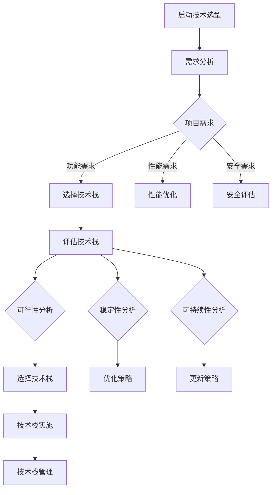

                 

### 文章标题：技术选型策略：为项目选择合适的技术栈

### 关键词：
技术栈选型，项目需求分析，趋势选择，成本效益分析，风险评估，技术栈实施，技术栈管理

### 摘要：
本文旨在深入探讨技术选型策略，帮助项目团队在众多技术选项中，选择最适合其项目需求的技术栈。我们将从技术选型的意义和目标出发，详细介绍技术栈评估方法，分析项目需求对技术栈选择的影响，并探讨多种技术栈选择策略。随后，我们将阐述技术栈实施和管理的关键步骤，通过实际案例分析，展示技术选型的全过程和效果。最后，我们将总结技术选型中的最佳实践，并推荐相关工具和资源。

---

## 技术选型概述

### 1. 技术选型的核心概念与联系

技术选型是指在项目开发过程中，从众多技术选项中挑选出最适合项目需求的技术栈。技术栈包括编程语言、框架、库、数据库等多种技术组件。

**核心概念**：

- **技术选型**：从多种技术中挑选最适合项目需求的技术栈。
- **技术栈**：包括编程语言、框架、库、数据库等多种技术组件。

**概念联系**：

技术选型过程需要综合考虑项目需求、技术栈评估、趋势选择、成本效益分析等多个方面。


**Mermaid 流程图**：



### 2. 技术栈评估

技术栈评估是技术选型过程中的关键步骤，它帮助团队确定所选技术栈的可行性、稳定性和可持续性。

**评估目标与指标**：

- **可行性**：所选技术栈能否满足项目需求。
- **稳定性**：技术栈在长期使用中是否可靠。
- **可持续性**：技术栈是否易于维护和更新。

**评估方法与步骤**：

```python
# 伪代码示例：技术栈评估

def assess_technology_stack(tech_stack):
    feasibility = check_feasibility(tech_stack)
    stability = check_stability(tech_stack)
    sustainability = check_sustainability(tech_stack)
    return feasibility, stability, sustainability

def check_feasibility(tech_stack):
    # 检查技术栈是否满足项目需求
    pass

def check_stability(tech_stack):
    # 检查技术栈的长期可靠性
    pass

def check_sustainability(tech_stack):
    # 检查技术栈的维护和更新难度
    pass
```

### 3. 项目需求分析

项目需求分析是技术选型的第一步，它直接影响技术栈的选择。

**功能需求分析**：

- **定义**：功能需求是指项目需要实现的具体功能。
- **分析**：通过用户调研、需求文档等方式，明确项目所需的核心功能。

**性能需求分析**：

- **定义**：性能需求是指项目在运行过程中所需满足的性能指标。
- **分析**：通过性能测试、基准测试等方式，评估技术栈的性能表现。

**安全需求分析**：

- **定义**：安全需求是指项目在运行过程中所需满足的安全标准。
- **分析**：通过安全测试、漏洞扫描等方式，评估技术栈的安全性能。

## 技术栈选择策略

### 4. 趋势选择策略

趋势选择策略是根据当前技术发展动态，选择具有前瞻性和可行性的技术栈。

**策略**：

- **跟踪行业趋势**：通过关注技术博客、论坛、会议等，了解行业最新动态。
- **评估技术潜力**：根据趋势，评估技术栈的未来发展潜力。

### 5. 成本效益分析策略

成本效益分析策略是综合考虑技术栈的成本和效益，选择性价比最高的技术栈。

**策略**：

- **成本计算**：计算技术栈的开发、维护、培训等成本。
- **效益评估**：评估技术栈在性能、效率、安全性等方面的提升。

### 6. 风险分析策略

风险分析策略是评估技术栈选择过程中可能遇到的风险，并制定相应的应对措施。

**策略**：

- **识别风险**：识别可能影响项目成功的技术风险。
- **评估风险**：评估风险的影响程度和发生概率。
- **制定应对措施**：制定风险应对策略和应急计划。

## 技术栈实施

### 7. 技术栈实施步骤

技术栈实施是将选定的技术栈应用到实际项目中的过程。

**步骤**：

- **环境搭建**：搭建开发、测试和生产环境。
- **开发流程**：制定开发流程和规范。
- **团队协作**：建立团队协作机制，确保项目顺利进行。

### 8. 技术栈管理

技术栈管理是确保技术栈长期稳定运行的过程。

**策略**：

- **维护策略**：定期检查和更新技术栈。
- **更新策略**：根据项目需求和技术发展，及时更新技术栈。

## 案例分析

### 9. 案例一：电商项目技术选型

#### 背景介绍

某电商项目需要搭建一个高性能、可扩展的电商平台，支持千万级用户同时在线。

#### 技术栈选择

经过需求分析和技术评估，团队选择了以下技术栈：

- **前端**：Vue.js、React
- **后端**：Spring Boot、Django
- **数据库**：MySQL、MongoDB
- **缓存**：Redis
- **消息队列**：RabbitMQ

#### 技术栈实施

- **环境搭建**：使用Docker搭建开发、测试和生产环境。
- **开发流程**：采用敏捷开发模式，进行持续集成和持续部署。
- **团队协作**：使用Git进行版本控制，使用JIRA进行项目管理。

#### 技术栈管理

- **维护策略**：定期检查和优化系统性能。
- **更新策略**：根据项目需求和新技术发展，及时更新技术栈。

### 10. 案例二：金融科技项目技术选型

#### 背景介绍

某金融科技项目需要开发一个支持高频交易、高并发访问的金融服务平台。

#### 技术栈选择

经过需求分析和技术评估，团队选择了以下技术栈：

- **前端**：React、Vue.js
- **后端**：Spring Boot、Node.js
- **数据库**：MySQL、Cassandra
- **缓存**：Redis、Memcached
- **消息队列**：RabbitMQ、Kafka

#### 技术栈实施

- **环境搭建**：使用Kubernetes进行容器编排。
- **开发流程**：采用微服务架构，进行分布式开发。
- **团队协作**：使用Git进行版本控制，使用Confluence进行知识管理。

#### 技术栈管理

- **维护策略**：采用自动化运维工具，进行系统监控和故障排查。
- **更新策略**：根据项目需求和新技术发展，及时更新技术栈。

## 总结与展望

技术选型是项目成功的关键步骤，合理的选型策略能够提高项目成功率。本文介绍了技术选型的核心概念、评估方法、选择策略、实施和管理策略，并通过实际案例展示了技术选型的全过程。

未来，随着技术不断发展，技术选型策略也需要不断更新和优化。团队应关注行业趋势，结合项目需求，选择最适合的技术栈，以确保项目的长期成功。

### 附录

#### 附录A：技术选型参考资料

- 《技术选型与架构设计》
- 《软件架构：实践者的研究与经验》
- 《微服务架构设计》

#### 附录B：技术选型模板与示例

- 技术选型报告模板
- 项目需求文档模板

### 作者信息

作者：AI天才研究院/AI Genius Institute & 禅与计算机程序设计艺术 /Zen And The Art of Computer Programming

本文由AI天才研究院和《禅与计算机程序设计艺术》共同撰写，旨在为项目团队提供实用的技术选型策略。如有疑问，请随时联系我们。感谢您的阅读！

