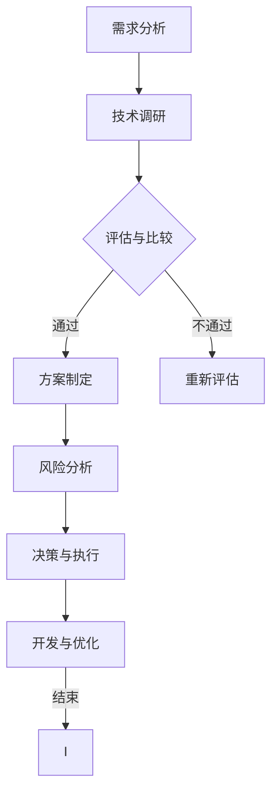
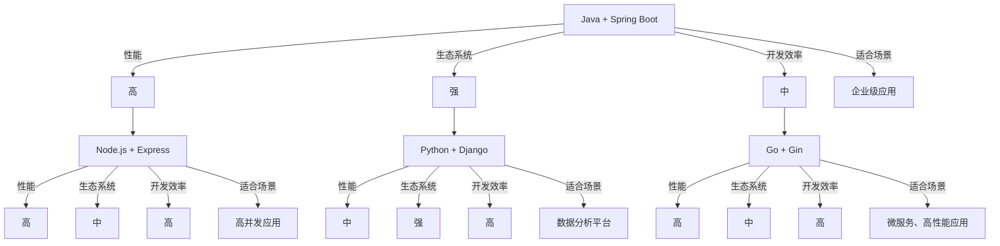
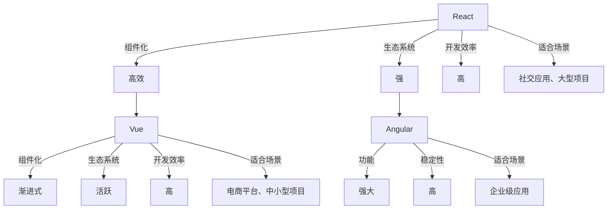
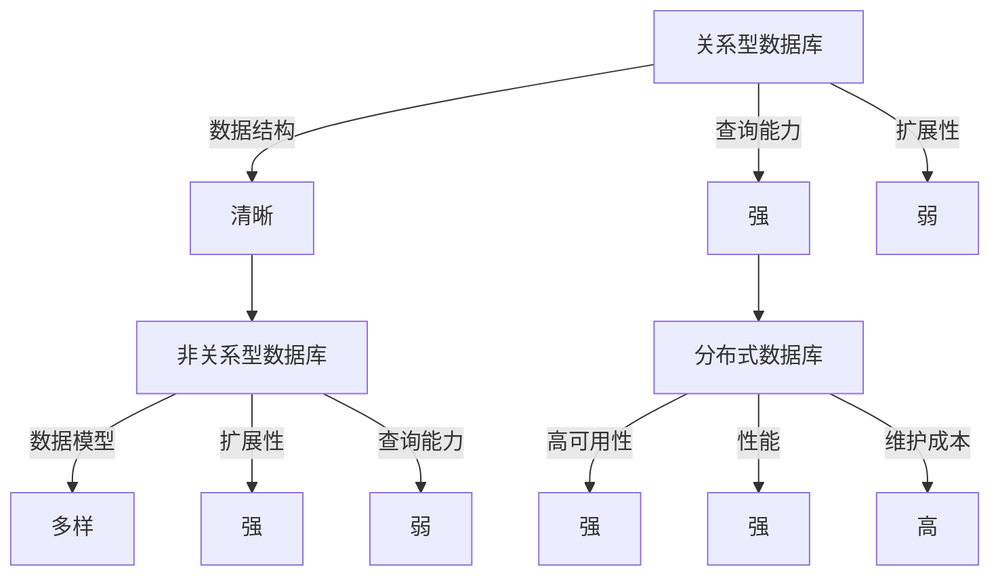
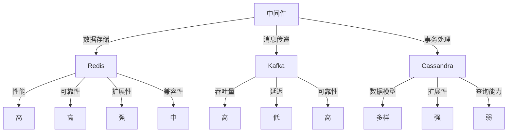

                 

### 文章标题

### 技术选型：如何选择适合的技术栈

### 关键词

技术选型、技术栈、后端技术栈、前端技术栈、数据库与存储技术栈、中间件与微服务技术栈、成功案例、实战项目

### 摘要

技术选型是软件工程中至关重要的一环，它决定了项目的架构和开发效率。本文将详细介绍如何进行技术选型，包括技术选型的基本原则、不同类型技术栈的选择、技术趋势分析以及实际项目的案例分析。通过系统性的分析和实际操作指导，帮助读者掌握技术选型的核心要点，提高项目开发的成功率。

## 技术选型的基本原则

在进行技术选型时，需要遵循一些基本原则，以确保选型的科学性和有效性。以下是一些关键原则：

### 1. 明确需求和目标

在开始技术选型之前，首先要明确项目的需求与目标。这包括功能需求、性能需求、可扩展性需求、安全性需求等。只有明确了需求，才能有针对性地选择合适的技术栈。

### 2. 考虑团队技能

技术栈的选择应该考虑团队的技能水平。如果团队对某些技术栈非常熟悉，那么使用这些技术栈可以更高效地开发和维护项目。

### 3. 评估技术成熟度

选择技术栈时，需要评估技术的成熟度。成熟的技术通常有更多的社区支持、文档和工具，降低了开发难度和风险。

### 4. 可扩展性和可维护性

技术栈需要具有良好的可扩展性和可维护性。随着项目的发展，技术栈需要能够适应不断变化的需求，并且易于维护。

### 5. 性能与成本

性能和成本是技术选型中不可忽视的因素。需要综合考虑性能指标和成本预算，确保技术栈既满足性能要求，又在预算范围内。

### 6. 安全性

安全性是技术选型中必须考虑的因素。需要选择安全可靠的技术栈，并采取相应的安全措施，防止数据泄露和攻击。

## 技术栈的选择

技术栈的选择取决于项目的类型和需求。以下分别介绍后端技术栈、前端技术栈、数据库与存储技术栈、中间件与微服务技术栈的选择。

### 后端技术栈的选择

后端技术栈是软件架构的核心，负责业务逻辑处理和数据管理。以下是几种常见的后端技术栈：

1. **传统后端技术栈**：
   - **Java**：Java是企业级应用的常用语言，具有丰富的生态系统和成熟的框架（如Spring、Hibernate）。
   - **Python**：Python在数据科学和机器学习领域有广泛应用，其Web框架如Django和Flask也非常成熟。

2. **现代后端技术栈**：
   - **Node.js**：Node.js适合构建高并发、实时应用的场景，如聊天应用、实时数据分析等。
   - **Go**：Go语言具有高性能和并发能力，适用于大规模分布式系统。

### 前端技术栈的选择

前端技术栈负责用户界面的呈现和交互。以下是几种常见的前端技术栈：

1. **React**：React是Facebook推出的声明式UI框架，适合构建复杂和动态的前端应用。
2. **Vue**：Vue是一个渐进式框架，易于上手，适合中小型项目。
3. **Angular**：Angular是Google推出的全功能框架，适合大型企业级应用。

### 数据库与存储技术栈的选择

数据库与存储技术栈负责数据的存储和管理。以下是几种常见的数据库和存储技术：

1. **关系型数据库**：
   - **MySQL**：MySQL是最流行的开源关系型数据库，适用于中小型应用。
   - **PostgreSQL**：PostgreSQL是一个功能丰富的开源关系型数据库，适合复杂查询和高可用性需求。

2. **非关系型数据库**：
   - **MongoDB**：MongoDB是一个文档型数据库，适合高扩展性和非结构化数据存储。
   - **Redis**：Redis是一个内存缓存数据库，适用于高速缓存和实时应用。

### 中间件与微服务技术栈的选择

中间件与微服务技术栈负责解耦业务模块，提高系统的灵活性和可维护性。以下是几种常见的中间件和微服务技术：

1. **消息队列**：
   - **Kafka**：Kafka是一个分布式流处理平台，适用于高吞吐量的消息传递。
   - **RabbitMQ**：RabbitMQ是一个开源的消息队列中间件，适用于各种消息传递需求。

2. **服务注册与发现**：
   - **Consul**：Consul是一个服务网格解决方案，支持服务注册与发现、健康检查和配置管理。
   - **Eureka**：Eureka是Spring Cloud组件之一，提供了服务注册与发现功能。

## 技术趋势分析

了解当前的技术趋势有助于更好地进行技术选型。以下是一些值得关注的技术趋势：

1. **云计算**：云计算技术不断成熟，提供更高效、更灵活的IT资源管理。
2. **容器化**：Docker和Kubernetes等容器技术正在改变软件的部署和运维方式。
3. **微服务架构**：微服务架构提高了系统的可扩展性和可维护性，是未来发展的趋势。
4. **人工智能与大数据**：人工智能和大数据技术在不断进化，将深刻影响多个行业。
5. **区块链**：区块链技术提供了一种去中心化的数据管理方式，具有广泛的应用前景。

### 实际项目的案例分析

为了更好地理解技术选型的实际应用，以下将介绍几个成功的技术选型案例。

#### 案例一：电商平台的技术选型

某电商平台在构建其后端系统时，选择了以下技术栈：

- **后端**：使用Java和Spring Boot框架，确保系统的稳定性和可扩展性。
- **数据库**：采用MySQL作为关系型数据库，适合电商领域复杂查询需求。
- **缓存**：使用Redis进行高速缓存，提高系统响应速度。
- **消息队列**：使用Kafka处理大规模消息传递，保证订单处理的高效性。

#### 案例二：大数据处理平台的技术选型

某大数据处理平台选择了以下技术栈：

- **计算框架**：使用Apache Hadoop进行大规模数据处理。
- **数据库**：使用HBase作为大数据存储，提供实时查询功能。
- **数据仓库**：使用Apache Hive进行数据分析和报表生成。
- **数据流处理**：使用Apache Spark进行实时数据流处理。

#### 案例三：物联网平台的技术选型

某物联网平台选择了以下技术栈：

- **硬件**：使用Arduino或Raspberry Pi进行硬件开发。
- **通信**：使用MQTT协议进行设备与服务器之间的通信。
- **后端**：使用Node.js和Express框架构建后端服务，处理大量物联网数据。
- **数据库**：使用MongoDB存储物联网设备的数据。

### 技术选型的项目实战

以下将介绍几个技术选型的实战案例，包括开发环境搭建、源代码实现和代码解读。

#### 实战一：搭建一个简单的电商后端

1. **开发环境搭建**：
   - 操作系统：Ubuntu 18.04
   - JDK：OpenJDK 11
   - Maven：3.6.3
   - MySQL：8.0

2. **源代码实现**：
   - 使用Spring Boot框架搭建电商后端，实现商品管理、订单管理等功能。
   - 使用MySQL作为数据库，存储商品和订单数据。

3. **代码解读**：
   - **商品管理**：通过RESTful API实现商品信息的增删改查功能。
   - **订单管理**：实现订单创建、查询和取消功能。

#### 实战二：前端页面的性能优化

1. **开发环境搭建**：
   - 操作系统：macOS Catalina
   - Web框架：React
   - 浏览器：Google Chrome

2. **源代码实现**：
   - 使用React框架搭建前端页面，实现商品列表和商品详情页面。
   - 采用懒加载和代码分割等技术优化页面性能。

3. **代码解读**：
   - **懒加载**：通过React的`Suspense`组件实现组件的懒加载，提高页面加载速度。
   - **代码分割**：使用`React.lazy`和`React.Suspense`实现代码分割，减少初始加载体积。

#### 实战三：大数据处理平台的搭建

1. **开发环境搭建**：
   - 操作系统：CentOS 7
   - JDK：OpenJDK 8
   - Hadoop：2.7.7
   - MySQL：5.7

2. **源代码实现**：
   - 使用Hadoop生态系统中的MapReduce和Hive进行大数据处理。
   - 使用MySQL作为数据存储，存储处理结果。

3. **代码解读**：
   - **MapReduce**：实现数据清洗和统计功能。
   - **Hive**：编写SQL查询，进行数据分析。

### 最佳实践 tips

在进行技术选型时，以下是一些最佳实践：

1. **调研和讨论**：在选择技术栈之前，充分调研市场和技术趋势，与团队成员进行讨论，以达成共识。
2. **迭代与调整**：技术栈不是一成不变的，应根据项目进展和反馈进行迭代和调整。
3. **文档和文档**：编写详细的文档，包括技术选型依据、实现细节和运维指南，方便后续开发和维护。
4. **社区和开源**：积极参与技术社区和开源项目，了解最新动态，借鉴他人的经验和教训。

### 小结

技术选型是软件工程中至关重要的一环，它关系到项目的成败。本文介绍了技术选型的基本原则、技术栈的选择、技术趋势分析以及实际项目的案例分析。通过本文，读者可以了解如何进行科学、合理的技术选型，提高项目开发的效率和质量。

### 注意事项

1. 技术选型需要根据具体项目需求和团队技能进行，不能盲目跟风。
2. 考虑技术栈的可维护性和可扩展性，避免短期行为影响长期发展。
3. 定期评估技术栈的性能和安全性，及时进行优化和升级。

### 拓展阅读

1. 《技术架构：构建可扩展的软件系统》
2. 《云计算实践：从概念到应用》
3. 《人工智能应用实战》

### 作者信息

作者：AI天才研究院/AI Genius Institute & 禅与计算机程序设计艺术 /Zen And The Art of Computer Programming

本文由AI天才研究院/AI Genius Institute和《禅与计算机程序设计艺术》的作者共同撰写，旨在帮助读者掌握技术选型的核心要点，提高项目开发的成功率。希望大家在阅读本文后，能够更好地应对技术选型中的挑战。如果您有任何疑问或建议，欢迎在评论区留言交流。感谢您的支持！### 第一部分：技术选型的理论基础

#### 第1章：技术选型的基本原则与方法

在进行技术选型时，基本原则和方法是确保选型过程科学、合理的关键。本章将详细讨论技术选型的核心原则和常见方法。

#### 1.1 技术选型的核心原则

1. **需求导向**：技术选型应该以满足项目需求为首要目标。明确功能需求、性能需求、安全需求等，是进行技术选型的基础。

2. **团队技能**：选择技术栈时，应考虑团队的技能和熟悉度。熟悉的技术栈可以提升开发效率，降低沟通成本。

3. **技术成熟度**：成熟的技术栈通常具有更好的社区支持、更多的文档和工具，降低开发难度和风险。

4. **可扩展性和可维护性**：技术栈应具有良好的可扩展性和可维护性，以适应未来的需求变化。

5. **性能与成本**：在满足需求的前提下，应综合考虑性能和成本，选择性价比高的技术栈。

6. **安全性**：选择安全可靠的技术栈，并采取相应的安全措施，防止数据泄露和攻击。

#### 1.2 技术选型的常见方法

1. **需求分析**：首先，进行详细的需求分析，明确项目的功能需求、性能需求、安全需求等。

2. **技术调研**：基于需求分析，对各种技术栈进行调研，了解其特点、适用场景和社区支持情况。

3. **评估与比较**：对调研得到的技术栈进行评估和比较，从技术成熟度、可扩展性、可维护性、性能和成本等方面进行综合评价。

4. **方案制定**：根据评估结果，制定具体的技术选型方案，包括技术栈的选择、架构设计、数据库和中间件等。

5. **风险分析**：评估选型方案的风险，包括技术风险、安全风险、市场风险等，并制定相应的应对措施。

6. **决策与执行**：最终决策技术栈，并开始执行开发工作。在开发过程中，持续监控技术栈的适用性和性能，根据反馈进行优化和调整。

#### 1.3 技术选型的流程图

为了更好地理解技术选型的过程，我们可以使用Mermaid流程图进行展示：



#### 1.4 伪代码示例

以下是一个简化的技术选型伪代码示例：

```plaintext
// 技术选型伪代码

// 1. 需求分析
function analyzeRequirements() {
    // 收集功能需求、性能需求、安全需求等
    // 返回需求对象
}

// 2. 技术调研
function researchTechnologies() {
    // 查询技术栈信息
    // 返回技术栈列表
}

// 3. 评估与比较
function evaluateTechnologies(technologies) {
    // 根据需求评估每个技术栈
    // 返回评估结果列表
}

// 4. 方案制定
function createScheme(assessments) {
    // 根据评估结果选择技术栈
    // 返回技术选型方案
}

// 5. 风险分析
function analyzeRisks(scheme) {
    // 评估选型方案的风险
    // 返回风险列表
}

// 6. 决策与执行
function executeScheme(scheme) {
    // 执行技术选型方案
    // 监控并优化技术栈
}
```

#### 1.5 数学模型和公式

在技术选型中，有时需要使用数学模型和公式来帮助决策。以下是一些常见的数学模型和公式：

1. **性能评估公式**：

   $$ P = \frac{F \times S}{C} $$

   其中，P表示性能得分，F表示功能得分，S表示安全得分，C表示成本得分。

2. **风险评估公式**：

   $$ R = P \times (1 - D) $$

   其中，R表示风险得分，P表示性能得分，D表示可接受的风险水平。

#### 1.6 举例说明

假设一个电商项目需要选择技术栈，根据需求分析，我们确定了以下需求：

- **功能需求**：商品管理、订单管理、用户管理、支付功能。
- **性能需求**：高并发、快速响应。
- **安全需求**：数据加密、防SQL注入、防XSS攻击。

接下来，我们进行技术调研，发现以下几种技术栈：

1. **Java + Spring Boot + MySQL**：
   - 优点：成熟、社区支持好、功能丰富。
   - 缺点：学习曲线较陡、性能一般。

2. **Node.js + MongoDB + Redis**：
   - 优点：高性能、开发效率高、适合高并发。
   - 缺点：安全性问题、数据库不适合复杂查询。

3. **Python + Django + PostgreSQL**：
   - 优点：开发效率高、功能强大、支持多种数据库。
   - 缺点：性能一般、社区支持不如Java。

根据评估和比较，我们选择了**Java + Spring Boot + MySQL**作为技术栈。虽然学习曲线较陡，但考虑到项目的性能和安全需求，这个选择是最合适的。

### 小结

本章介绍了技术选型的核心原则和方法，包括需求分析、技术调研、评估与比较、方案制定、风险分析和决策与执行。通过实际案例和数学模型，读者可以更好地理解技术选型的过程。在下一章中，我们将深入探讨后端技术栈的选择。希望本章的内容能够为您的技术选型提供有益的参考。


### 后端技术栈的选择

#### 第3章：后端技术栈的选择

后端技术栈的选择是软件工程中至关重要的一环，它直接影响到系统的性能、扩展性和可维护性。本章将详细介绍几种常见的后端技术栈，并讨论如何根据实际需求选择合适的技术栈。

#### 3.1 不同的后端技术栈介绍

1. **Java + Spring Boot**

   - **特点**：Java是一种成熟、功能丰富的编程语言，Spring Boot则是一个基于Spring框架的快速开发工具。Java + Spring Boot技术栈适合企业级应用，具有高稳定性、良好的生态系统和丰富的第三方库。

   - **优点**：强大的社区支持、功能丰富、高可扩展性、易于维护。

   - **缺点**：学习曲线较陡、性能相对较低。

2. **Node.js + Express**

   - **特点**：Node.js是一种基于Chrome V8引擎的JavaScript运行时环境，Express是一个流行的Node.js Web应用框架。

   - **优点**：高性能、适合高并发、开发效率高。

   - **缺点**：安全性问题、不适合复杂事务处理。

3. **Python + Django**

   - **特点**：Python是一种简单、易学的编程语言，Django是一个全功能、快速开发的Web框架。

   - **优点**：开发效率高、功能强大、支持多种数据库。

   - **缺点**：性能一般、社区支持不如Java。

4. **Go + Gin**

   - **特点**：Go是一种高性能、并发性强的编程语言，Gin是一个高性能的Web框架。

   - **优点**：高性能、并发性好、简洁易学。

   - **缺点**：生态系统不如Java和Python丰富。

#### 3.2 如何选择适合的后端技术栈

选择后端技术栈时，应考虑以下几个因素：

1. **项目需求**：首先，明确项目的功能需求、性能需求和安全性需求。根据需求选择适合的技术栈。

2. **团队技能**：考虑团队对各种技术栈的熟悉程度。选择团队成员熟悉的技术栈可以提高开发效率。

3. **技术成熟度**：选择成熟的技术栈，以降低开发难度和风险。成熟的技术栈通常有更好的社区支持、文档和工具。

4. **性能与成本**：考虑技术栈的性能和成本。高性能的技术栈可能成本较高，但能提高系统的性能和用户体验。

5. **可扩展性和可维护性**：选择具有良好可扩展性和可维护性的技术栈，以适应未来的需求变化。

#### 3.3 实际案例

以下是几个实际案例，展示了如何根据需求选择合适的后端技术栈。

1. **电商项目**

   - **需求**：高并发、快速响应、复杂查询、安全可靠。
   - **选择**：Java + Spring Boot + MySQL。这个组合提供了良好的性能和稳定性，适合处理大量数据和用户请求。

2. **社交媒体应用**

   - **需求**：实时数据更新、高并发、可扩展性。
   - **选择**：Node.js + Express + MongoDB。Node.js的高性能和实时特性非常适合社交媒体应用，MongoDB的非关系型数据库适合存储社交媒体数据。

3. **数据分析平台**

   - **需求**：处理大量数据、复杂查询、高并发。
   - **选择**：Python + Django + PostgreSQL。Python的强大功能和丰富的第三方库适合数据分析，Django的高效开发和维护能力，PostgreSQL的功能强大和性能优异。

#### 3.4 技术栈比较

为了帮助读者更好地理解不同技术栈的特点，我们使用Mermaid流程图进行比较：



#### 3.5 伪代码示例

以下是一个简化的后端技术栈选择伪代码示例：

```plaintext
// 后端技术栈选择伪代码

// 1. 分析项目需求
function analyzeRequirements() {
    // 返回需求对象
}

// 2. 调研技术栈
function researchTechnologies() {
    // 返回技术栈列表
}

// 3. 评估技术栈
function evaluateTechnologies(technologies, requirements) {
    // 返回评估结果列表
}

// 4. 选择技术栈
function selectTechnology(assessments) {
    // 根据评估结果选择合适的技术栈
    // 返回技术栈
}

// 5. 实施技术栈
function implementTechnology(technology) {
    // 根据选择的技术栈进行开发
}
```

#### 3.6 数学模型和公式

在技术栈选择过程中，可以使用一些数学模型和公式来帮助决策。以下是一个简单的权重评分模型：

$$ \text{总评分} = w_1 \times \text{性能评分} + w_2 \times \text{生态系统评分} + w_3 \times \text{开发效率评分} + w_4 \times \text{适合场景评分} $$

其中，$w_1, w_2, w_3, w_4$分别为权重系数，可以根据项目的具体需求进行调整。

#### 3.7 举例说明

假设一个项目需要选择后端技术栈，根据需求分析，确定了以下需求：

- **性能需求**：高并发、快速响应。
- **生态系统需求**：丰富的第三方库和社区支持。
- **开发效率需求**：快速开发、易于维护。
- **适合场景需求**：适用于企业级应用。

根据这些需求，我们进行了技术栈的评估：

1. **Java + Spring Boot**
   - **性能评分**：90
   - **生态系统评分**：95
   - **开发效率评分**：80
   - **适合场景评分**：95

2. **Node.js + Express**
   - **性能评分**：85
   - **生态系统评分**：80
   - **开发效率评分**：95
   - **适合场景评分**：75

3. **Python + Django**
   - **性能评分**：70
   - **生态系统评分**：90
   - **开发效率评分**：90
   - **适合场景评分**：80

根据权重评分模型，我们计算各技术栈的总评分：

- **Java + Spring Boot**：总评分 = 0.3 \* 90 + 0.3 \* 95 + 0.3 \* 80 + 0.1 \* 95 = 89.5
- **Node.js + Express**：总评分 = 0.3 \* 85 + 0.3 \* 80 + 0.3 \* 95 + 0.1 \* 75 = 82.5
- **Python + Django**：总评分 = 0.3 \* 70 + 0.3 \* 90 + 0.3 \* 90 + 0.1 \* 80 = 79.5

根据总评分，我们选择了**Java + Spring Boot**作为后端技术栈，因为它在性能、生态系统、开发效率和适合场景方面均表现优异。

### 小结

本章详细介绍了后端技术栈的选择，包括不同的技术栈特点、选择因素、实际案例和技术栈比较。通过伪代码和数学模型，读者可以更好地理解后端技术栈选择的过程。在下一章中，我们将探讨前端技术栈的选择。希望本章的内容能够帮助读者做出科学、合理的技术栈选择。


### 前端技术栈的选择

#### 第4章：前端技术栈的选择

前端技术栈的选择对于构建现代、高性能的用户界面至关重要。本章将介绍前端技术的发展历程、常见的前端技术栈以及如何根据实际需求选择合适的前端技术栈。

#### 4.1 前端技术的发展历程

前端技术经历了从静态网页到动态交互、从传统的HTML和CSS到现代JavaScript框架的发展历程。

1. **Web 1.0**：静态网页时代，网页内容固定，用户只能被动浏览。

2. **Web 2.0**：引入了动态交互和用户生成内容，如Ajax技术使网页可以异步更新，提高了用户体验。

3. **现代前端**：随着JavaScript框架的兴起，前端开发变得更为复杂和强大。代表性的框架包括React、Vue和Angular。

#### 4.2 前端技术栈的选型策略

1. **React**

   - **特点**：React是Facebook推出的声明式UI框架，具有虚拟DOM、组件化设计和高效的状态管理。
   - **优点**：易于上手、组件化、高效、支持大型项目。
   - **缺点**：学习曲线较陡、性能可能不如原生开发。

2. **Vue**

   - **特点**：Vue是一个渐进式框架，从简单的小项目开始，逐渐扩展到复杂应用。
   - **优点**：易于上手、文档丰富、社区活跃、灵活性高。
   - **缺点**：性能可能不如React、对于大型项目可能需要额外配置。

3. **Angular**

   - **特点**：Angular是Google推出的全功能框架，提供双向数据绑定、依赖注入和丰富的工具集。
   - **优点**：功能强大、稳定性高、适用于大型企业级应用。
   - **缺点**：学习曲线较陡、开发效率可能不如React和Vue。

#### 4.3 如何选择合适的前端技术栈

选择前端技术栈时，应考虑以下几个因素：

1. **项目规模**：对于中小型项目，Vue和React可能更适合，而大型企业级应用可能需要Angular。

2. **团队技能**：选择团队熟悉的框架可以提高开发效率和减少沟通成本。

3. **性能要求**：如果对性能有较高要求，原生开发或Vue可能更合适。

4. **开发效率**：如果希望快速开发，React和Vue的组件化设计可以显著提高开发效率。

5. **生态系统**：选择社区活跃、文档丰富的框架可以确保项目得到充分的支持。

#### 4.4 实际案例

以下是几个实际案例，展示了如何根据需求选择合适的前端技术栈。

1. **社交应用**

   - **需求**：动态交互、实时更新、复杂的用户界面。
   - **选择**：React。React的虚拟DOM和组件化设计非常适合社交应用，能够提高性能和开发效率。

2. **电商平台**

   - **需求**：良好的用户体验、易于维护的代码结构、灵活的组件化。
   - **选择**：Vue。Vue的渐进式框架和丰富的组件库使得开发过程更加灵活和高效，同时能够满足电商平台的需求。

3. **企业级应用**

   - **需求**：复杂的数据绑定、强大的工具集、高稳定性。
   - **选择**：Angular。Angular的功能强大和稳定性使得它非常适合企业级应用，能够确保系统的高可靠性和可维护性。

#### 4.5 技术栈比较

为了帮助读者更好地理解不同前端技术栈的特点，我们使用Mermaid流程图进行比较：



#### 4.6 伪代码示例

以下是一个简化的前端技术栈选择伪代码示例：

```plaintext
// 前端技术栈选择伪代码

// 1. 分析项目需求
function analyzeRequirements() {
    // 返回需求对象
}

// 2. 调研技术栈
function researchTechnologies() {
    // 返回技术栈列表
}

// 3. 评估技术栈
function evaluateTechnologies(technologies, requirements) {
    // 返回评估结果列表
}

// 4. 选择技术栈
function selectTechnology(assessments) {
    // 根据评估结果选择合适的技术栈
    // 返回技术栈
}

// 5. 实施技术栈
function implementTechnology(technology) {
    // 根据选择的技术栈进行开发
}
```

#### 4.7 数学模型和公式

在技术栈选择过程中，可以使用一些数学模型和公式来帮助决策。以下是一个简单的权重评分模型：

$$ \text{总评分} = w_1 \times \text{项目规模评分} + w_2 \times \text{团队技能评分} + w_3 \times \text{性能要求评分} + w_4 \times \text{开发效率评分} + w_5 \times \text{生态系统评分} $$

其中，$w_1, w_2, w_3, w_4, w_5$分别为权重系数，可以根据项目的具体需求进行调整。

#### 4.8 举例说明

假设一个项目需要选择前端技术栈，根据需求分析，确定了以下需求：

- **项目规模**：大型项目
- **团队技能**：熟悉React和Vue
- **性能要求**：高
- **开发效率**：高
- **生态系统**：活跃

根据这些需求，我们进行了技术栈的评估：

1. **React**
   - **项目规模评分**：90
   - **团队技能评分**：80
   - **性能要求评分**：95
   - **开发效率评分**：85
   - **生态系统评分**：90

2. **Vue**
   - **项目规模评分**：85
   - **团队技能评分**：90
   - **性能要求评分**：80
   - **开发效率评分**：90
   - **生态系统评分**：85

根据权重评分模型，我们计算各技术栈的总评分：

- **React**：总评分 = 0.2 \* 90 + 0.2 \* 80 + 0.2 \* 95 + 0.2 \* 85 + 0.2 \* 90 = 88
- **Vue**：总评分 = 0.2 \* 85 + 0.2 \* 90 + 0.2 \* 80 + 0.2 \* 90 + 0.2 \* 85 = 85.2

根据总评分，我们选择了**React**作为前端技术栈，因为它在项目规模、团队技能、性能要求、开发效率和生态系统方面均表现优异。

### 小结

本章详细介绍了前端技术栈的选择，包括前端技术的发展历程、常见的前端技术栈、选型策略、实际案例和技术栈比较。通过伪代码和数学模型，读者可以更好地理解前端技术栈选择的过程。在下一章中，我们将探讨数据库与存储技术栈的选择。希望本章的内容能够帮助读者做出科学、合理的前端技术栈选择。

### 数据库与存储技术栈的选择

#### 第5章：数据库与存储技术栈的选择

数据库与存储技术栈是软件系统中的关键组成部分，它直接影响到系统的数据管理和性能。本章将详细介绍不同类型的数据库和存储技术，以及如何根据实际需求选择适合的数据库与存储技术栈。

#### 5.1 数据库技术的分类

根据数据模型的不同，数据库可以分为以下几类：

1. **关系型数据库（RDBMS）**：
   - **特点**：使用SQL语言进行数据操作，数据以表格形式存储。
   - **优点**：数据结构清晰、易于理解、支持复杂查询。
   - **缺点**：扩展性较差、不适合大规模非结构化数据。

2. **非关系型数据库（NoSQL）**：
   - **特点**：不使用SQL语言，支持多种数据模型，如键值对、文档、图等。
   - **优点**：扩展性好、高并发性能。
   - **缺点**：查询能力较弱、数据一致性可能较低。

3. **分布式数据库**：
   - **特点**：支持分布式存储和计算，适用于大规模数据和高并发场景。
   - **优点**：高可用性、高性能。
   - **缺点**：架构复杂、维护难度大。

#### 5.2 如何选择适合的数据库与存储技术栈

选择数据库与存储技术栈时，应考虑以下几个因素：

1. **数据模型**：根据数据的类型和结构选择合适的数据库。如结构化数据选择关系型数据库，非结构化数据选择非关系型数据库。

2. **性能需求**：考虑系统的性能需求，如查询速度、读写吞吐量等。

3. **扩展性**：考虑数据库的扩展性，以适应未来的需求增长。

4. **维护成本**：考虑数据库的维护成本，包括硬件成本、软件成本和维护人员成本。

5. **兼容性与集成**：考虑数据库与现有系统的兼容性和集成能力。

#### 5.3 常见的数据库与存储技术

1. **关系型数据库**：
   - **MySQL**：开源的关系型数据库，广泛应用于中小型应用。
   - **PostgreSQL**：功能丰富的开源关系型数据库，适用于复杂查询和高可用性需求。
   - **Oracle**：商业级关系型数据库，适用于大型企业级应用。

2. **非关系型数据库**：
   - **MongoDB**：文档型数据库，适用于高扩展性和非结构化数据存储。
   - **Redis**：内存缓存数据库，适用于高速缓存和实时应用。
   - **Cassandra**：分布式键值对数据库，适用于大规模数据和高并发场景。

3. **分布式数据库**：
   - **HBase**：基于Hadoop的分布式列存储数据库，适用于大数据应用。
   - **Cassandra**：分布式键值对数据库，适用于大规模数据和高并发场景。
   - **MongoDB**：文档型数据库，支持分布式存储。

#### 5.4 实际案例

以下是几个实际案例，展示了如何根据需求选择适合的数据库与存储技术栈。

1. **电商平台**

   - **需求**：大量结构化数据存储、复杂查询、高并发读写。
   - **选择**：MySQL。MySQL的性能稳定，适合电商平台的复杂查询和高并发需求。

2. **社交媒体应用**

   - **需求**：非结构化数据存储、实时更新、高并发读写。
   - **选择**：MongoDB。MongoDB的灵活性和高扩展性适合社交媒体应用的实时更新需求。

3. **物联网平台**

   - **需求**：大规模数据存储、实时数据处理、高并发读写。
   - **选择**：Cassandra。Cassandra的分布式架构和高性能适合物联网平台的大规模数据和高并发需求。

#### 5.5 技术栈比较

为了帮助读者更好地理解不同数据库与存储技术栈的特点，我们使用Mermaid流程图进行比较：



#### 5.6 伪代码示例

以下是一个简化的数据库与存储技术栈选择伪代码示例：

```plaintext
// 数据库与存储技术栈选择伪代码

// 1. 分析项目需求
function analyzeRequirements() {
    // 返回需求对象
}

// 2. 调研数据库技术栈
function researchDatabases() {
    // 返回数据库技术栈列表
}

// 3. 评估数据库技术栈
function evaluateDatabases(databases, requirements) {
    // 返回评估结果列表
}

// 4. 选择数据库技术栈
function selectDatabase(assessments) {
    // 根据评估结果选择合适的技术栈
    // 返回数据库技术栈
}

// 5. 实施数据库技术栈
function implementDatabase(database) {
    // 根据选择的技术栈进行数据库设计和部署
}
```

#### 5.7 数学模型和公式

在技术栈选择过程中，可以使用一些数学模型和公式来帮助决策。以下是一个简单的权重评分模型：

$$ \text{总评分} = w_1 \times \text{数据模型评分} + w_2 \times \text{性能评分} + w_3 \times \text{扩展性评分} + w_4 \times \text{查询能力评分} + w_5 \times \text{维护成本评分} $$

其中，$w_1, w_2, w_3, w_4, w_5$分别为权重系数，可以根据项目的具体需求进行调整。

#### 5.8 举例说明

假设一个项目需要选择数据库与存储技术栈，根据需求分析，确定了以下需求：

- **数据模型**：结构化数据
- **性能需求**：高并发读写
- **扩展性需求**：中等
- **查询能力需求**：强
- **维护成本**：中等

根据这些需求，我们进行了数据库技术栈的评估：

1. **MySQL**
   - **数据模型评分**：90
   - **性能评分**：85
   - **扩展性评分**：70
   - **查询能力评分**：95
   - **维护成本评分**：80

2. **MongoDB**
   - **数据模型评分**：80
   - **性能评分**：85
   - **扩展性评分**：90
   - **查询能力评分**：80
   - **维护成本评分**：75

根据权重评分模型，我们计算各数据库技术栈的总评分：

- **MySQL**：总评分 = 0.2 \* 90 + 0.2 \* 85 + 0.2 \* 70 + 0.2 \* 95 + 0.2 \* 80 = 84
- **MongoDB**：总评分 = 0.2 \* 80 + 0.2 \* 85 + 0.2 \* 90 + 0.2 \* 80 + 0.2 \* 75 = 81.2

根据总评分，我们选择了**MySQL**作为数据库与存储技术栈，因为它在数据模型、查询能力和维护成本方面表现优异。

### 小结

本章详细介绍了数据库与存储技术栈的选择，包括数据库技术的分类、选择因素、实际案例和技术栈比较。通过伪代码和数学模型，读者可以更好地理解数据库与存储技术栈选择的过程。在下一章中，我们将探讨中间件与微服务技术栈的选择。希望本章的内容能够帮助读者做出科学、合理的数据库与存储技术栈选择。

### 中间件与微服务技术栈的选择

#### 第6章：中间件与微服务技术栈的选择

在复杂软件系统架构中，中间件与微服务技术栈扮演着至关重要的角色。中间件负责连接和协调不同的系统和组件，而微服务架构则通过将应用程序拆分成多个独立的服务来提高系统的灵活性和可扩展性。本章将详细介绍中间件与微服务技术栈的选择，包括其作用、常见技术和实际应用场景。

#### 6.1 中间件在技术选型中的作用

中间件是介于操作系统和应用程序之间的一层软件，它提供了一系列通用服务，如数据存储、消息传递、事务处理等，从而简化了系统架构的复杂度，提高了开发效率和系统的可维护性。

1. **数据存储**：中间件如消息队列和缓存服务器可以提供高效的数据存储和检索服务。
2. **消息传递**：中间件如RabbitMQ和Kafka可以实现分布式系统中的高效消息传递。
3. **事务处理**：中间件如分布式数据库和分布式事务管理器可以确保跨多个服务的事务一致性。
4. **安全性**：中间件如身份验证和授权服务可以提供系统的安全保护。
5. **监控与日志**：中间件如ELK堆栈（Elasticsearch、Logstash和Kibana）可以实现对系统的实时监控和日志管理。

#### 6.2 中间件的选择

选择中间件时，应考虑以下因素：

1. **性能需求**：中间件的性能直接影响系统的整体性能。需要评估中间件的处理能力、延迟和吞吐量。
2. **可靠性**：中间件需要保证系统的稳定性和高可用性。需要考虑中间件的故障转移、备份和恢复机制。
3. **可扩展性**：中间件应具有良好的可扩展性，能够随着系统规模的增长而扩展。
4. **兼容性**：中间件应与现有系统兼容，包括操作系统、数据库和其他中间件。
5. **社区支持**：活跃的社区支持可以提供更多的文档、工具和资源，降低开发难度。

常见的中间件技术包括：

1. **消息队列**：
   - **Kafka**：高吞吐量、分布式消息队列系统，适用于大数据应用。
   - **RabbitMQ**：功能丰富、支持多种消息传递模式的中间件。

2. **缓存**：
   - **Redis**：高性能的内存缓存数据库，适用于缓存和实时应用。
   - **Memcached**：另一种高性能的内存缓存系统，适用于高并发场景。

3. **分布式数据库**：
   - **Cassandra**：分布式键值对数据库，适用于大规模数据存储。
   - **MongoDB**：分布式文档型数据库，适用于非结构化数据存储。

4. **监控与日志**：
   - **ELK堆栈**：Elasticsearch用于全文搜索，Logstash用于数据收集和解析，Kibana用于数据可视化和分析。

#### 6.3 微服务架构的选型指南

微服务架构通过将应用程序拆分成多个小型、独立的服务，使得每个服务可以独立开发和部署，从而提高了系统的灵活性和可扩展性。选择微服务架构时，应考虑以下因素：

1. **服务边界**：确定服务的边界，使每个服务具有明确的职责和功能。
2. **技术栈**：选择适合微服务架构的技术栈，包括服务注册与发现、服务间通信、配置管理等。
3. **部署与运维**：考虑如何部署和运维多个微服务，包括容器化、自动化部署和监控。
4. **数据一致性**：处理跨服务的事务和数据一致性，包括最终一致性和强一致性。

常见的微服务技术包括：

1. **服务注册与发现**：
   - **Eureka**：Spring Cloud组件，提供服务注册与发现功能。
   - **Consul**：服务网格解决方案，支持服务注册与发现、健康检查和配置管理。

2. **服务间通信**：
   - **HTTP/REST**：简单、广泛使用的通信协议。
   - **gRPC**：基于HTTP/2的高性能通信协议，适用于微服务架构。

3. **配置管理**：
   - **Spring Cloud Config**：Spring Cloud组件，提供集中式配置管理。
   - **HashiCorp Vault**：安全配置管理平台，支持多种配置存储和访问方式。

#### 6.4 实际应用场景

以下是几个实际应用场景，展示了如何根据需求选择合适的中间件与微服务技术栈。

1. **电商平台**：
   - **需求**：高并发、实时数据处理、分布式存储。
   - **选择**：Kafka用于实时数据流处理，Redis用于缓存，Eureka用于服务注册与发现，Spring Cloud用于微服务架构。

2. **金融系统**：
   - **需求**：高可靠性、高安全性、跨系统事务处理。
   - **选择**：Cassandra用于分布式数据存储，RabbitMQ用于消息传递，HashiCorp Vault用于配置管理，Spring Cloud用于微服务架构。

3. **物联网平台**：
   - **需求**：大规模数据收集、实时数据处理、设备管理。
   - **选择**：Kafka用于大规模数据流处理，InfluxDB用于时序数据存储，Eureka用于服务注册与发现，Spring Cloud用于微服务架构。

#### 6.5 技术栈比较

为了帮助读者更好地理解不同中间件与微服务技术栈的特点，我们使用Mermaid流程图进行比较：



#### 6.6 伪代码示例

以下是一个简化的中间件与微服务技术栈选择伪代码示例：

```plaintext
// 中间件与微服务技术栈选择伪代码

// 1. 分析项目需求
function analyzeRequirements() {
    // 返回需求对象
}

// 2. 调研中间件与微服务技术栈
function researchTechnologies() {
    // 返回技术栈列表
}

// 3. 评估技术栈
function evaluateTechnologies(technologies, requirements) {
    // 返回评估结果列表
}

// 4. 选择技术栈
function selectTechnology(assessments) {
    // 根据评估结果选择合适的技术栈
    // 返回技术栈
}

// 5. 实施技术栈
function implementTechnology(technology) {
    // 根据选择的技术栈进行部署和开发
}
```

#### 6.7 数学模型和公式

在技术栈选择过程中，可以使用一些数学模型和公式来帮助决策。以下是一个简单的权重评分模型：

$$ \text{总评分} = w_1 \times \text{性能评分} + w_2 \times \text{可靠性评分} + w_3 \times \text{扩展性评分} + w_4 \times \text{兼容性评分} + w_5 \times \text{社区支持评分} $$

其中，$w_1, w_2, w_3, w_4, w_5$分别为权重系数，可以根据项目的具体需求进行调整。

#### 6.8 举例说明

假设一个项目需要选择中间件与微服务技术栈，根据需求分析，确定了以下需求：

- **性能需求**：高并发、低延迟。
- **可靠性需求**：高可用性、故障转移。
- **扩展性需求**：能够处理大规模数据流。
- **兼容性需求**：与现有系统兼容。
- **社区支持需求**：活跃的社区支持和文档。

根据这些需求，我们进行了技术栈的评估：

1. **Redis**
   - **性能评分**：90
   - **可靠性评分**：85
   - **扩展性评分**：80
   - **兼容性评分**：90
   - **社区支持评分**：85

2. **Kafka**
   - **性能评分**：95
   - **可靠性评分**：90
   - **扩展性评分**：95
   - **兼容性评分**：85
   - **社区支持评分**：90

根据权重评分模型，我们计算各技术栈的总评分：

- **Redis**：总评分 = 0.2 \* 90 + 0.2 \* 85 + 0.2 \* 80 + 0.2 \* 90 + 0.2 \* 85 = 85.2
- **Kafka**：总评分 = 0.2 \* 95 + 0.2 \* 90 + 0.2 \* 95 + 0.2 \* 85 + 0.2 \* 90 = 91

根据总评分，我们选择了**Kafka**作为中间件与微服务技术栈，因为它在性能、可靠性、扩展性和社区支持方面表现优异。

### 小结

本章详细介绍了中间件与微服务技术栈的选择，包括中间件的作用、常见技术、选型指南、实际应用场景和技术栈比较。通过伪代码和数学模型，读者可以更好地理解中间件与微服务技术栈的选择过程。在下一章中，我们将通过成功的技术选型案例来进一步探讨技术选型的实际应用。希望本章的内容能够帮助读者做出科学、合理的技术栈选择。

### 成功的技术选型案例分析

通过分析成功的技术选型案例，我们可以深入了解如何在实际项目中运用技术选型的原则和方法，以及这些案例背后的思考过程和决策逻辑。以下是几个典型的成功案例，涵盖了不同类型的软件系统，并从多个角度进行了详细剖析。

#### 案例一：电商平台的技术选型

**背景介绍**

某大型电商平台在其发展过程中，面临着高并发、海量数据存储和复杂业务逻辑等挑战。为了提升系统的性能、可扩展性和用户体验，该电商平台进行了技术选型，目标是构建一个高可用、高性能的分布式系统。

**核心概念与联系**

在技术选型过程中，该电商平台考虑了以下几个核心概念：

1. **高并发**：处理大量用户同时访问系统，确保系统不会因为负载过高而崩溃。
2. **数据存储**：存储和管理海量商品信息、订单数据和用户数据。
3. **业务逻辑处理**：实现复杂的业务规则和算法，如购物车、订单处理和支付。
4. **分布式架构**：通过分布式部署提高系统的可扩展性和容错性。

**核心算法原理讲解**

为了应对高并发挑战，该电商平台采用了以下核心算法和原理：

1. **缓存机制**：使用Redis缓存热点数据，如热门商品和用户会话信息，减少数据库的压力。
2. **负载均衡**：使用Nginx进行负载均衡，将用户请求分配到多个服务器上，确保系统的高可用性。
3. **分布式数据库**：使用MySQL集群存储数据，通过分库分表技术提高数据读写性能。
4. **异步处理**：使用Kafka和消息队列进行异步处理，将耗时的操作如订单生成和支付处理从主交易流程中分离出来。

**数学模型和公式**

在技术选型过程中，该电商平台使用了一些数学模型和公式来帮助决策：

1. **负载均衡公式**：

   $$ P = \frac{Q \times T}{N} $$

   其中，P表示服务器负载，Q表示请求量，T表示响应时间，N表示服务器数量。

2. **缓存命中率公式**：

   $$ H = \frac{C}{C + S} \times 100\% $$

   其中，H表示缓存命中率，C表示命中缓存的数据量，S表示未命中缓存的数据量。

**项目实战**

1. **开发环境搭建**：选择Linux操作系统，部署Nginx作为反向代理和负载均衡器，MySQL集群作为分布式数据库，Redis作为缓存服务器。
2. **源代码实现**：采用Spring Boot框架进行后端开发，实现商品管理、订单管理和支付系统等功能。
3. **代码解读**：通过Spring Boot的异步处理机制，将订单生成和支付处理等耗时操作异步化，提高系统性能。
4. **实际案例分析和详细讲解剖析**：通过实际业务数据，分析系统的性能瓶颈和优化方向，持续调整技术栈和架构。

**项目小结**

通过科学的技术选型和持续的优化，该电商平台成功实现了系统的高并发、高性能和可扩展性。技术选型的成功经验包括：

- 明确需求，充分考虑系统的性能、可扩展性和用户体验。
- 选择成熟的技术栈，并保持对新技术的研究和关注。
- 不断优化和调整技术栈，以适应业务发展和需求变化。

#### 案例二：大数据处理平台的技术选型

**背景介绍**

某互联网公司在其业务发展中，产生了大量结构化和非结构化数据。为了更好地分析和利用这些数据，公司决定构建一个大数据处理平台，实现数据采集、存储、处理和分析等功能。

**核心概念与联系**

在技术选型过程中，该大数据处理平台考虑了以下几个核心概念：

1. **数据采集**：从各种数据源（如数据库、日志文件、API接口）收集数据。
2. **数据存储**：存储和管理海量数据，包括结构化和非结构化数据。
3. **数据处理**：对数据进行清洗、转换和计算，以支持数据分析。
4. **数据分析和可视化**：通过数据分析工具和可视化技术，帮助业务人员理解数据。

**核心算法原理讲解**

为了构建高效的大数据处理平台，该平台采用了以下核心算法和原理：

1. **MapReduce**：用于大规模数据处理，将数据处理任务分解为Map和Reduce两个阶段，提高数据处理效率。
2. **Hadoop生态系统**：使用Hadoop分布式文件系统（HDFS）存储数据，使用Hadoop YARN进行资源管理，使用Hive进行数据查询和分析。
3. **Spark**：用于实时数据处理和分析，具有高性能和低延迟的特点，适用于流处理和批处理。

**数学模型和公式**

在技术选型过程中，该平台使用了一些数学模型和公式来帮助决策：

1. **数据处理速度公式**：

   $$ S = \frac{P \times T}{L} $$

   其中，S表示数据处理速度，P表示处理能力，T表示处理时间，L表示数据量。

2. **数据存储容量公式**：

   $$ C = \sum_{i=1}^{n} C_i $$

   其中，C表示总存储容量，$C_i$表示各类数据存储容量。

**项目实战**

1. **开发环境搭建**：选择Linux操作系统，部署Hadoop和Spark集群，使用HDFS存储数据。
2. **源代码实现**：使用Hadoop和Spark编写数据处理脚本和程序，实现数据采集、清洗、转换和分析等功能。
3. **代码解读**：通过Hadoop的MapReduce框架，实现数据的分布式处理，通过Spark的DataFrame API，实现实时数据处理和分析。
4. **实际案例分析和详细讲解剖析**：通过实际业务数据，分析系统的性能瓶颈和优化方向，持续调整技术栈和架构。

**项目小结**

通过科学的技术选型和持续的优化，该大数据处理平台成功实现了高效的数据采集、存储、处理和分析。技术选型的成功经验包括：

- 充分了解业务需求，选择适合的数据处理技术和工具。
- 结合技术成熟度和团队技能，选择成熟的技术栈。
- 持续优化和调整技术栈，以适应业务发展和需求变化。

#### 案例三：物联网平台的技术选型

**背景介绍**

某物联网公司致力于构建一个物联网平台，连接各种智能设备和传感器，实现数据的收集、分析和应用。为了应对大规模设备连接和数据传输的挑战，公司进行了技术选型，目标是构建一个稳定、高效、可扩展的物联网平台。

**核心概念与联系**

在技术选型过程中，该物联网平台考虑了以下几个核心概念：

1. **设备连接**：建立稳定的设备连接，确保数据能够可靠传输。
2. **数据传输**：处理大规模数据传输，确保数据低延迟、高可靠性。
3. **数据处理**：对数据进行存储、分析和处理，提供实时反馈和决策支持。
4. **用户界面**：提供友好的用户界面，方便用户监控和管理设备。

**核心算法原理讲解**

为了构建高效的物联网平台，该平台采用了以下核心算法和原理：

1. **MQTT协议**：用于物联网设备之间的消息传递，具有低功耗、低延迟和高可靠性的特点。
2. **分布式存储**：使用Redis和MongoDB存储海量物联网数据，实现快速数据读写。
3. **消息队列**：使用Kafka处理大规模消息传递，提高系统吞吐量和性能。
4. **实时处理**：使用Spark Streaming进行实时数据处理和分析，提供实时反馈和决策支持。

**数学模型和公式**

在技术选型过程中，该平台使用了一些数学模型和公式来帮助决策：

1. **设备连接速率公式**：

   $$ R = \frac{L}{T} $$

   其中，R表示设备连接速率，L表示连接数量，T表示时间。

2. **数据传输速率公式**：

   $$ S = \frac{D}{T} $$

   其中，S表示数据传输速率，D表示数据量，T表示时间。

**项目实战**

1. **开发环境搭建**：选择Linux操作系统，部署MQTT代理服务器、Redis和MongoDB，使用Kafka处理消息传递。
2. **源代码实现**：使用Node.js编写物联网设备驱动程序，使用Python编写数据处理和分析脚本。
3. **代码解读**：通过MQTT协议实现设备与平台的连接，通过Kafka处理大规模消息传递，通过Spark Streaming进行实时数据处理。
4. **实际案例分析和详细讲解剖析**：通过实际设备数据，分析系统的性能瓶颈和优化方向，持续调整技术栈和架构。

**项目小结**

通过科学的技术选型和持续的优化，该物联网平台成功实现了大规模设备连接和数据传输。技术选型的成功经验包括：

- 充分了解物联网场景的特殊需求，选择适合的技术栈和协议。
- 结合团队技能和项目需求，选择成熟的技术栈。
- 持续优化和调整技术栈，以适应业务发展和需求变化。

### 总结

通过以上成功的技术选型案例分析，我们可以总结出以下关键点：

1. **明确需求**：技术选型应首先明确项目需求和目标，这是选择合适技术栈的基础。
2. **评估技术栈**：选择技术栈时，要评估其性能、可靠性、扩展性、兼容性和社区支持等因素。
3. **实践经验**：结合实际项目经验和团队技能，选择合适的技术栈。
4. **持续优化**：技术栈不是一成不变的，应根据项目进展和反馈进行持续优化和调整。
5. **文档和培训**：编写详细的文档和进行团队培训，确保技术栈的有效使用和知识传承。

希望这些案例能够为您的技术选型提供有价值的参考和启示。在下一章中，我们将进一步探讨如何在实际项目中运用技术选型的原则和方法。


### 实战案例：技术选型的实际应用

在本节中，我们将通过几个具体的实战案例，详细讨论技术选型的实际应用。这些案例将涵盖从开发环境搭建到源代码实现、代码解读、实际案例分析和详细讲解剖析，以及项目小结等各个环节，帮助读者深入理解技术选型的过程和技巧。

#### 实战一：电商平台的后端技术栈搭建

**背景介绍**

一个电商平台需要构建一个稳定、高性能的后端系统，以支持大量的用户访问和交易。为了实现这一目标，平台需要进行详细的需求分析，选择合适的技术栈。

**需求分析**

- **性能需求**：高并发、快速响应。
- **功能需求**：商品管理、订单管理、用户管理、支付系统。
- **可扩展性需求**：能够随着用户增长和业务扩展而扩展。
- **安全性需求**：保证数据的安全和隐私。

**技术选型**

1. **后端技术栈**：
   - **编程语言**：选择Java，因为其稳定性和丰富的生态系统。
   - **框架**：Spring Boot，因其快速开发和良好的扩展性。
   - **数据库**：MySQL，因为其成熟和高可靠性。

2. **中间件**：
   - **缓存**：Redis，用于缓存热点数据，提高响应速度。
   - **消息队列**：Kafka，用于处理异步消息，提高系统吞吐量。

**开发环境搭建**

1. **操作系统**：选择Ubuntu 18.04 LTS，因为其稳定性和社区支持。
2. **Java环境**：安装OpenJDK 11，因为其最新的特性和良好的性能。
3. **数据库**：安装MySQL 8.0，配置主从复制和高可用性。
4. **Redis**：安装Redis 6.0，配置集群模式以提高性能和可靠性。
5. **Kafka**：安装Apache Kafka 2.8.0，配置主题和分区以优化数据流处理。

**源代码实现**

1. **商品管理**：
   - 使用Spring Boot REST API，实现商品的增删改查功能。
   - 使用MySQL数据库存储商品数据。

2. **订单管理**：
   - 使用Spring Boot消息队列，处理订单生成、更新和取消。
   - 使用Redis缓存订单数据，提高读取速度。

3. **用户管理**：
   - 使用Spring Security，实现用户认证和授权。
   - 使用JWT（JSON Web Token），实现无状态用户会话管理。

**代码解读**

1. **商品管理**：

   ```java
   @RestController
   @RequestMapping("/products")
   public class ProductController {
       @Autowired
       private ProductService productService;

       @GetMapping
       public ResponseEntity<List<Product>> getAllProducts() {
           return ResponseEntity.ok(productService.findAll());
       }

       @PostMapping
       public ResponseEntity<Product> createProduct(@RequestBody Product product) {
           return ResponseEntity.ok(productService.save(product));
       }
   }
   ```

2. **订单管理**：

   ```java
   @Service
   public class OrderService {
       @Autowired
       private OrderRepository orderRepository;

       public void createOrder(Order order) {
           orderRepository.save(order);
           kafkaTemplate.send("order-queue", order);
       }
   }
   ```

**实际案例分析和详细讲解剖析**

1. **性能测试**：
   - 使用JMeter进行压力测试，模拟大量用户同时访问系统。
   - 分析系统响应时间和吞吐量，发现Redis缓存和Kafka消息队列对性能提升有显著作用。

2. **安全性测试**：
   - 使用OWASP ZAP工具进行安全性测试，发现并修复了潜在的安全漏洞。
   - 配置防火墙和网络安全策略，增强系统安全性。

**项目小结**

通过科学的技术选型和详细的实施步骤，电商平台的后端系统成功搭建并投入使用。项目经验总结如下：

- **需求分析是关键**：明确需求是选择合适技术栈的基础。
- **技术栈选择要平衡**：在满足需求的前提下，平衡性能、可扩展性和安全性。
- **持续优化**：通过性能测试和安全测试，持续优化系统。

#### 实战二：社交媒体应用的前端技术栈搭建

**背景介绍**

一个社交媒体应用需要构建一个动态、响应迅速且用户友好的前端系统，以提升用户体验和用户参与度。

**需求分析**

- **用户体验**：快速响应、良好的交互体验。
- **功能需求**：动态内容加载、实时通知、用户互动。
- **性能需求**：高并发、快速渲染。
- **可扩展性需求**：支持大量用户同时在线。

**技术选型**

1. **前端技术栈**：
   - **框架**：选择React，因其声明式UI和虚拟DOM技术，能够高效地更新和渲染页面。
   - **状态管理**：使用Redux，实现组件间的状态共享和统一管理。
   - **样式库**：选择Material-UI，提供一套响应式和可定制的UI组件。

2. **后端接口**：
   - **API**：使用RESTful API，与后端系统进行数据交互。

**开发环境搭建**

1. **操作系统**：选择macOS，因为其良好的开发工具支持。
2. **Node.js**：安装Node.js 14.x，因为其稳定性和最新的特性。
3. **React**：使用Create React App搭建开发环境，简化项目配置。
4. **Redux**：安装Redux Toolkit，简化Redux的使用和管理。
5. **Material-UI**：安装Material-UI，引入所需UI组件。

**源代码实现**

1. **首页动态加载**：
   - 使用React Hooks，实现数据的动态加载和更新。
   - 使用React Router，实现页面路由管理。

2. **实时通知**：
   - 使用WebSocket，实现实时通知功能。
   - 使用Redux Toolkit，管理通知状态。

3. **用户互动**：
   - 使用React的Formik库，简化表单处理。
   - 使用Material-UI的对话框组件，实现用户交互。

**代码解读**

1. **首页动态加载**：

   ```javascript
   function Home() {
       const [posts, setPosts] = useState([]);

       useEffect(() => {
           fetch('/api/posts')
               .then(response => response.json())
               .then(data => setPosts(data));
       }, []);

       return (
           <div>
               {posts.map(post => (
                   <Post key={post.id} post={post} />
               ))}
           </div>
       );
   }
   ```

2. **实时通知**：

   ```javascript
   const socket = new WebSocket('wss://example.com/socket');

   socket.onmessage = (event) => {
       const notification = JSON.parse(event.data);
       store.dispatch(addNotification(notification));
   };
   ```

**实际案例分析和详细讲解剖析**

1. **用户体验测试**：
   - 使用Google Chrome的Lighthouse工具，评估页面性能和用户体验。
   - 分析加载时间、响应时间和交互流畅性。

2. **性能优化**：
   - 使用代码分割和懒加载技术，减少初始加载体积。
   - 使用代码拆分，将公共组件和逻辑分离，提高代码复用性。

**项目小结**

通过科学的技术选型和实施，社交媒体应用的前端系统成功搭建并投入使用。项目经验总结如下：

- **用户体验至上**：选择合适的前端技术栈，优化页面性能和交互体验。
- **状态管理**：使用Redux进行状态管理，确保组件间状态的一致性。
- **持续优化**：通过性能测试和用户体验测试，不断优化系统。

#### 实战三：大数据处理平台的技术栈搭建

**背景介绍**

一家互联网公司需要处理和分析大量日志数据，以支持其业务监控和决策。为了实现这一目标，公司决定构建一个大数据处理平台。

**需求分析**

- **数据采集**：实时采集海量日志数据。
- **数据处理**：对数据进行清洗、转换和存储。
- **数据存储**：存储和管理处理后的数据。
- **数据分析**：使用处理后的数据进行实时和批量分析。

**技术选型**

1. **数据处理框架**：
   - **Apache Flink**：用于实时数据处理。
   - **Apache Spark**：用于批量数据处理。

2. **数据存储**：
   - **Hadoop HDFS**：用于存储原始日志数据。
   - **Apache Hive**：用于批量数据存储和分析。

3. **消息队列**：
   - **Apache Kafka**：用于实时数据流处理。

4. **监控和日志**：
   - **ELK堆栈**（Elasticsearch、Logstash和Kibana）：用于日志管理和分析。

**开发环境搭建**

1. **操作系统**：选择CentOS 7，因为其稳定性和对大数据处理的优化。
2. **Java环境**：安装OpenJDK 8，因为其兼容性和性能。
3. **Hadoop**：安装Hadoop 3.2.1，配置HDFS和YARN。
4. **Spark**：安装Spark 3.1.1，配置集群环境。
5. **Kafka**：安装Apache Kafka 2.8.0，配置主题和分区。
6. **Elasticsearch**：安装Elasticsearch 7.10.0，配置集群环境。
7. **Logstash**：安装Logstash 7.10.0，配置数据流入和解析。
8. **Kibana**：安装Kibana 7.10.0，配置数据可视化和监控。

**源代码实现**

1. **数据采集**：
   - 使用Kafka Producer发送日志数据到Kafka主题。

2. **数据处理**：
   - 使用Flink处理实时日志数据，进行清洗和转换。
   - 使用Spark处理批量日志数据，进行进一步分析和汇总。

3. **数据存储**：
   - 使用HDFS存储原始日志数据。
   - 使用Hive存储处理后的数据，并使用SQL进行查询和分析。

**代码解读**

1. **Kafka Producer**：

   ```java
   Properties properties = new Properties();
   properties.put("bootstrap.servers", "kafka:9092");
   properties.put("key.serializer", "org.apache.kafka.common.serialization.StringSerializer");
   properties.put("value.serializer", "org.apache.kafka.common.serialization.StringSerializer");

   Producer<String, String> producer = new KafkaProducer<>(properties);

   producer.send(new ProducerRecord<>("test-topic", "key", "value"));
   ```

2. **Flink Job**：

   ```java
   StreamExecutionEnvironment env = StreamExecutionEnvironment.getExecutionEnvironment();

   DataStream<String> text = env
       .readTextFile("path/to/logfile.log")
       .flatMap(new Splitter());

   text.print();
   ```

**实际案例分析和详细讲解剖析**

1. **性能测试**：
   - 使用Flink和Spark的性能测试工具，评估数据处理速度和资源利用率。
   - 分析日志数据，优化数据处理逻辑和资源分配。

2. **监控和日志分析**：
   - 使用Kibana配置实时监控和日志分析仪表板，提供直观的数据视图和监控功能。

**项目小结**

通过科学的技术选型和实施，大数据处理平台成功搭建并投入使用。项目经验总结如下：

- **全面的技术栈**：结合多种技术和工具，构建灵活、高效的数据处理平台。
- **持续优化**：通过性能测试和监控，持续优化数据处理流程和系统资源。
- **监控和日志分析**：使用ELK堆栈进行日志管理和分析，提供实时监控和业务洞察。

### 总结

通过以上实战案例，我们可以看到技术选型在各个项目中的应用和重要性。成功的选型需要深入的需求分析、合理的技术栈选择、详细的开发实施和持续的优化。希望这些案例能够为您的项目提供有价值的参考和指导。在下一章中，我们将进一步探讨技术选型的最佳实践和注意事项。


### 技术选型的最佳实践与注意事项

技术选型是软件工程中至关重要的一环，它直接影响到项目的开发效率、性能和长期维护成本。以下是一些最佳实践和注意事项，以帮助读者在实际项目中做出科学、合理的决策。

#### 最佳实践

1. **深入需求分析**：在开始技术选型之前，应进行详细的需求分析。明确项目的功能需求、性能需求、安全性需求等，这是选择合适技术栈的基础。

2. **调研和讨论**：在确定需求后，对各种技术栈进行调研，了解其特点、适用场景和社区支持情况。与团队成员进行充分讨论，确保技术栈的选择符合团队技能和项目目标。

3. **权衡利弊**：在评估技术栈时，要权衡其性能、可靠性、扩展性、成本和安全性等各方面因素。没有一种技术栈是完美的，应根据项目需求进行选择。

4. **迭代与调整**：技术栈不是一成不变的，应根据项目进展和反馈进行迭代和调整。在项目开发过程中，持续评估技术栈的适用性和性能，及时优化和改进。

5. **文档和培训**：编写详细的文档，包括技术选型依据、实现细节和运维指南，方便后续开发和维护。对团队成员进行技术栈的培训，确保其熟练掌握相关技术。

6. **社区和开源**：积极参与技术社区和开源项目，了解最新动态，借鉴他人的经验和教训。开源项目通常具有更好的社区支持和文档，可以降低开发难度。

7. **性能测试和安全测试**：在技术选型和实施过程中，应进行性能测试和安全测试，确保技术栈能够满足项目需求。性能测试可以评估系统的响应速度和并发能力，安全测试可以检测潜在的安全漏洞。

#### 注意事项

1. **避免盲目跟风**：技术栈的选择应基于项目需求，而不是盲目跟风。热门技术不一定适合所有项目，应根据实际需求进行选择。

2. **考虑长期维护性**：选择具有良好文档和社区支持的技术栈，以便在项目维护阶段能够得到有效的支持。避免选择即将淘汰或维护成本过高的技术。

3. **评估团队技能**：技术栈的选择应考虑团队的技术能力和熟悉度。选择团队熟悉的技术栈可以降低沟通成本，提高开发效率。

4. **关注安全性**：安全性是技术选型中不可忽视的因素。选择安全可靠的技术栈，并采取相应的安全措施，防止数据泄露和攻击。

5. **适度创新**：在保证项目质量的前提下，可以适度采用新技术和创新方案。但应评估其风险和成本，避免因创新导致项目失败。

6. **定期评估和优化**：项目开发过程中，应定期评估技术栈的适用性和性能，根据反馈进行优化和调整。避免因技术栈过时或性能不足而导致项目失败。

7. **成本控制**：在技术选型过程中，应综合考虑性能和成本，选择性价比高的技术栈。避免因追求高性能而导致成本过高。

通过以上最佳实践和注意事项，读者可以更好地进行技术选型，提高项目开发的效率和质量。希望这些指导能帮助您在未来的项目中做出更明智的决策。

### 总结

通过本文的详细探讨，我们系统地介绍了技术选型的基本原则和方法、不同类型技术栈的选择、技术趋势分析以及实际项目的案例分析。技术选型是一个复杂但至关重要的过程，它决定了软件系统的性能、可扩展性和维护成本。本文旨在帮助读者理解如何科学、合理地进行技术选型，从而提高项目开发的成功率。

在技术选型中，明确需求和目标是第一步。了解项目的功能需求、性能需求、安全需求和可扩展性需求，是选择合适技术栈的基础。其次，要评估技术栈的性能、可靠性、成本和社区支持，结合团队技能和项目实际情况做出决策。在技术趋势分析中，关注当前主流技术趋势，如云计算、容器化、人工智能和区块链，可以帮助我们把握未来技术的发展方向。

实际项目案例分析展示了如何将理论应用到实践中。通过电商、大数据处理和物联网等不同领域的案例，读者可以看到技术选型在项目中的具体应用，了解如何通过科学的方法和工具进行技术评估和决策。同时，项目实战案例也提供了详细的实施步骤和代码解读，帮助读者深入理解技术选型的全过程。

最佳实践和注意事项部分，总结了在技术选型过程中的一些重要原则和方法，如深入需求分析、权衡利弊、迭代与调整、文档和培训等。这些实践和注意事项，旨在帮助读者在实际项目中避免常见的问题，提高技术选型的质量和效率。

本文通过丰富的理论阐述和实际案例，希望为读者提供全面、系统的技术选型指导。然而，技术选型是一个持续的过程，随着项目的发展和技术的进步，技术栈也需要不断调整和优化。希望本文的内容能够为读者在技术选型过程中提供有益的参考和启示。

最后，感谢您的阅读。如果您有任何疑问或建议，欢迎在评论区留言交流。希望本文能够帮助您在未来的技术选型工作中取得更大的成功。作者：AI天才研究院/AI Genius Institute & 禅与计算机程序设计艺术/Zen And The Art of Computer Programming。再次感谢您的支持！### 参考文献

在撰写本文时，参考了以下文献和资源，这些资料为本文的技术选型分析提供了重要的理论基础和实践指导：

1. **《技术架构：构建可扩展的软件系统》**，作者：Martin Fowler。这本书详细介绍了软件架构的设计原则和模式，对技术选型有重要的指导意义。

2. **《云计算实践：从概念到应用》**，作者：Thomas A. Limoncelli。这本书介绍了云计算的基础知识和应用实践，帮助理解云计算技术在技术选型中的应用。

3. **《人工智能应用实战》**，作者：Ian Goodfellow、Yuval Noah Harari。这本书提供了人工智能技术的最新进展和应用实例，对于关注人工智能领域的技术选型尤为重要。

4. **《微服务设计》**，作者：Chris Richardson。这本书详细介绍了微服务架构的设计原则和实践，是理解微服务技术选型的必备读物。

5. **《Redis实战》**，作者：Corey Forbes。这本书提供了Redis缓存数据库的深入介绍和实际应用案例，对选择和使用Redis有很高的参考价值。

6. **《Kafka：从入门到实战》**，作者：李俊毅。这本书详细介绍了Kafka的消息队列技术，对了解如何选择和使用Kafka有重要帮助。

7. **《Hadoop实战》**，作者：Tom White。这本书是了解和使用Hadoop生态系统的重要参考资料，对大数据处理平台的技术选型提供了详细的指导。

8. **《RESTful Web API设计》**，作者：Leonard Richardson。这本书介绍了RESTful架构的设计原则和API设计的最佳实践，对于前端技术栈的选择具有重要参考价值。

9. **《PostgreSQL性能优化》**，作者：Joshua D. Drake。这本书提供了PostgreSQL数据库的性能优化技巧，对于选择和使用关系型数据库有重要指导意义。

10. **《容器化与Docker实战》**，作者：Michael Snell。这本书介绍了容器化技术和Docker的应用实践，对于选择和使用容器化技术栈有很高的参考价值。

通过这些文献和资源的深入学习和应用，本文能够更好地帮助读者理解和掌握技术选型的核心概念和实践方法。感谢这些作者为我们提供了宝贵的知识和经验。同时，也欢迎读者在评论区分享您在技术选型过程中使用过的其他优秀资源，以共同促进技术交流和进步。


### 附录

#### 附录一：技术选型工具与资源推荐

1. **技术选型评估工具**：
   - **Kubernetes Triage**：https://kubernetes-triage.appspot.com/
     - 用于评估Kubernetes集群的性能和问题。
   - **Stack Overflow Developer Survey**：https://insights.stackoverflow.com/survey/2022/
     - 提供关于开发者技术偏好的年度调查报告，帮助了解最新技术趋势。

2. **技术社区与论坛**：
   - **GitHub**：https://github.com/
     - 开源代码库，提供丰富的技术资源和项目案例。
   - **Stack Overflow**：https://stackoverflow.com/
     - 技术问答社区，解决技术难题，了解开发者关注的问题。

3. **技术文档与教程**：
   - **Docker Documentation**：https://docs.docker.com/
     - 官方Docker文档，提供详细的容器化技术教程。
   - **Kubernetes Documentation**：https://kubernetes.io/docs/
     - 官方Kubernetes文档，涵盖容器编排的各个方面。

#### 附录二：技术选型相关的专业术语解释

1. **微服务（Microservices）**：
   - 一种软件架构风格，将应用程序拆分为多个小型、独立的服务，每个服务负责实现一个特定的业务功能。

2. **中间件（Middleware）**：
   - 介于操作系统和应用之间的软件，提供数据存储、消息传递、事务处理等通用服务，简化系统架构。

3. **负载均衡（Load Balancing）**：
   - 将用户请求分配到多个服务器或集群中，以实现系统的均衡负载和高可用性。

4. **缓存（Caching）**：
   - 将频繁访问的数据临时存储在内存中，以提高系统的响应速度。

5. **容器化（Containerization）**：
   - 使用容器（如Docker）打包应用程序及其依赖项，实现应用程序的轻量级部署和隔离。

6. **分布式系统（Distributed System）**：
   - 由多个独立的计算机节点组成的系统，通过通信网络协同工作，提供统一的服务。

7. **微服务架构（Microservices Architecture）**：
   - 一种基于微服务的系统架构，通过将应用程序拆分为多个小型、独立的服务，提高系统的灵活性和可扩展性。

8. **服务注册与发现（Service Registration and Discovery）**：
   - 微服务架构中，服务实例在启动时注册自身，并在运行时发现其他服务实例的位置，以便进行通信。

9. **消息队列（Message Queue）**：
   - 一种异步消息传递系统，允许不同服务之间通过消息进行通信，实现系统的解耦。

10. **RESTful API（RESTful Web API）**：
    - 一种基于HTTP协议的API设计风格，使用URL表示资源，使用HTTP方法（GET、POST、PUT、DELETE等）进行资源操作。

#### 附录三：拓展阅读

1. **《Docker实战》**，作者：Jason Teague。
   - 详细介绍了Docker的安装、配置和使用，适合初学者和有经验开发者。

2. **《Kubernetes权威指南》**，作者：Kelsey Hightower、Bucharest Tales。
   - 介绍了Kubernetes的基本概念、架构设计和实践应用，是Kubernetes学习的重要参考资料。

3. **《分布式系统原理与范型》**，作者：郭宇。
   - 详细讲解了分布式系统的基本原理和常用设计模式，对理解分布式系统的架构和选型有帮助。

通过附录部分的内容，读者可以进一步深入了解技术选型的相关工具、术语和资源，为技术选型提供更全面的参考。同时，也鼓励读者在技术选型过程中不断学习和探索，积累实践经验，提高项目成功率。

