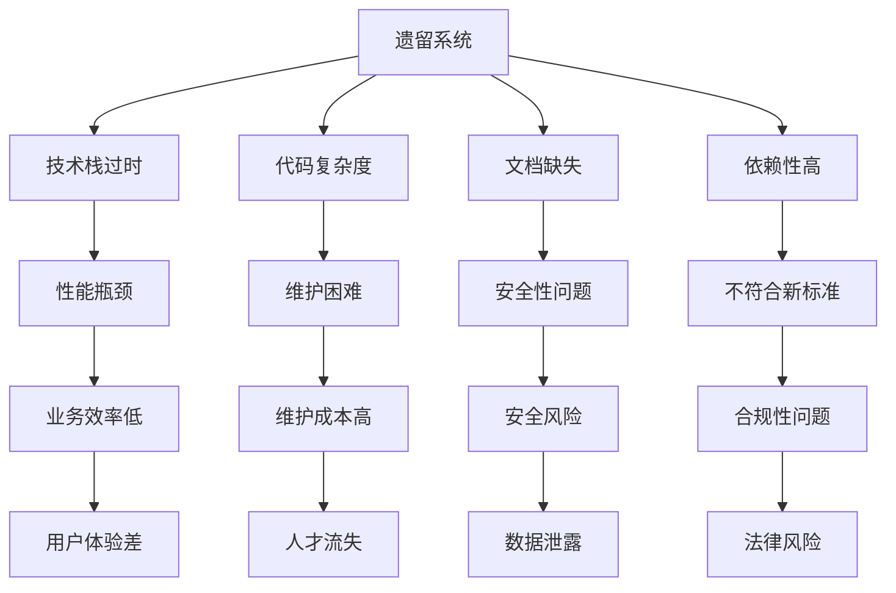
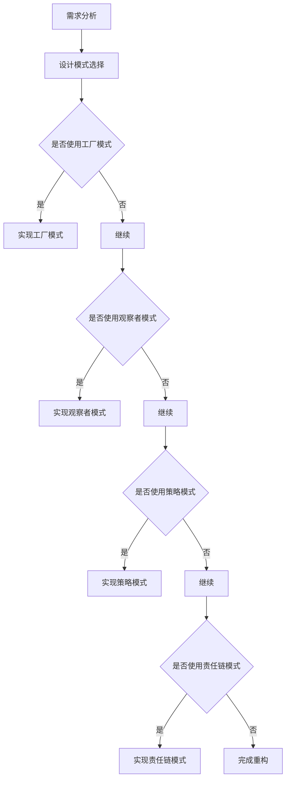

                 

### 摘要

《技术重构：遗留系统的现代化之路》旨在为IT专业人士提供一套系统化的遗留系统现代化策略和实战指南。随着技术的快速发展，许多企业面临遗留系统无法满足当前业务需求、性能瓶颈、维护困难等问题。本书首先介绍了遗留系统的现状与挑战，探讨了现代化的必要性，然后深入分析了现代化转型的理论基础，包括核心概念与联系、核心算法原理、数学模型和公式等。接下来，本书详细介绍了现代技术选型与评估、架构重构与设计模式、数据库升级与迁移、微服务化与云原生等关键技术方法。同时，通过实际案例研究和项目管理实践，本书为读者提供了从理论到实践的全面指导。最后，本书总结了现代化转型的关键要点，并对未来发展方向提出了展望。读者将能够通过本书掌握遗留系统现代化的核心技术和策略，为企业的发展注入新的活力。

----------------------------------------------------------------

## 引言

### 遗留系统现代化的重要性

在当今快速发展的科技时代，企业技术架构的更新换代显得尤为重要。随着新技术的不断涌现，遗留系统逐渐暴露出诸多问题，如性能瓶颈、维护困难、安全性不足等，这些问题不仅限制了企业的业务发展，还可能导致竞争力下降。因此，对遗留系统进行现代化转型已成为众多企业亟待解决的问题。

**遗留系统的挑战**

遗留系统通常具有以下特征：
1. **技术过时**：遗留系统可能基于陈旧的技术栈，无法支持现代业务需求。
2. **性能瓶颈**：随着业务规模的扩大，遗留系统可能难以应对不断增加的负载。
3. **维护困难**：遗留系统往往缺乏文档，维护成本高昂，且难以吸引新开发人员。
4. **安全性问题**：遗留系统可能存在安全漏洞，难以满足现代安全标准。

**现代化的必要性**

现代化转型具有以下几个方面的必要性：
1. **提高业务效率**：通过引入新架构和技术，提高系统的性能和可扩展性，从而提升业务处理能力。
2. **降低维护成本**：现代化的系统结构简化了维护工作，降低了维护成本。
3. **增强安全性**：采用现代安全技术，提高系统安全性，保护企业数据。
4. **适应新技术**：现代化转型使企业能够更快地适应新技术，保持竞争力。

### 全书结构概述

本书分为以下几个部分：

1. **第1章：遗留系统的现状与挑战**：介绍遗留系统的定义、特征及面临的挑战。
2. **第2章：现代化转型的理论基础**：讲解现代化转型的核心概念、算法原理、数学模型和关键因素。
3. **第3章：现代技术选型与评估**：探讨现代技术的选择策略和评估方法。
4. **第4章：架构重构与设计模式**：分析架构重构的原则和设计模式的应用。
5. **第5章：数据库升级与迁移**：阐述数据库升级和迁移的策略与方法。
6. **第6章：微服务化与云原生**：介绍微服务化与云原生技术的优势和实践。
7. **第7章：现代化转型的项目管理**：讨论现代化转型的项目管理框架和风险控制。

通过以上章节，本书将带领读者逐步了解遗留系统的现代化之路，掌握从理论到实践的全套技术和策略。

### 文章标题

**《技术重构：遗留系统的现代化之路》**

### 文章关键词

**遗留系统，现代化，架构重构，数据库升级，微服务化，项目管理**

### 摘要

《技术重构：遗留系统的现代化之路》旨在为IT专业人士提供一套系统化的遗留系统现代化策略和实战指南。本书首先介绍了遗留系统的现状与挑战，探讨了现代化的必要性，然后深入分析了现代化转型的理论基础，包括核心概念与联系、核心算法原理、数学模型和公式等。接下来，本书详细介绍了现代技术选型与评估、架构重构与设计模式、数据库升级与迁移、微服务化与云原生等关键技术方法。同时，通过实际案例研究和项目管理实践，本书为读者提供了从理论到实践的全面指导。最后，本书总结了现代化转型的关键要点，并对未来发展方向提出了展望。读者将能够通过本书掌握遗留系统现代化的核心技术和策略，为企业的发展注入新的活力。

----------------------------------------------------------------

## 第1章：遗留系统的现状与挑战

### 1.1 遗留系统的定义与特征

遗留系统（Legacy System）通常指的是那些在企业中运行了多年，且仍继续支持业务运作的计算机系统。这些系统可能基于过时的技术栈，使用老旧的编程语言和框架，难以满足现代业务需求。遗留系统的特征主要包括以下几点：

1. **技术栈过时**：遗留系统往往基于几十年前的技术，如COBOL、VB6等，这些技术已不再支持或更新缓慢。
2. **代码复杂度**：随着时间的推移，遗留系统中的代码变得越来越复杂，缺乏良好的设计模式和模块化。
3. **文档缺失**：由于系统的长时间运行，许多文档已经丢失或不再准确，使得维护和升级变得更加困难。
4. **依赖性高**：遗留系统可能与多个内部和外部系统紧密集成，任何修改都可能引发连锁反应。

### 1.2 遗留系统的挑战

面对遗留系统，企业往往会遇到以下挑战：

1. **性能瓶颈**：遗留系统可能无法处理现代业务的高并发和大数据量，导致系统响应速度慢，用户体验差。
2. **维护困难**：遗留系统的代码库庞大且复杂，维护成本高昂，且难以招募到熟悉旧技术栈的开发人员。
3. **安全性问题**：遗留系统可能存在未修补的安全漏洞，容易成为网络攻击的目标，威胁企业数据安全。
4. **不符合新标准**：遗留系统可能无法符合现代法律法规和行业标准，如数据保护法规（如GDPR）。

### 1.3 现代化的必要性

遗留系统现代化具有以下几个必要性：

1. **提升业务效率**：通过引入现代技术，优化系统性能，提高业务处理速度，提升企业竞争力。
2. **降低维护成本**：现代化后的系统结构更加简洁，易于维护，降低长期维护成本。
3. **增强安全性**：采用现代安全措施，提高系统安全性，保护企业数据免受网络攻击。
4. **适应新技术**：现代化转型使企业能够更快地适应新技术，如云计算、大数据等，保持技术领先地位。

### 1.4 Mermaid流程图：遗留系统与现代化技术的关联



通过以上流程图，我们可以清晰地看到遗留系统的各种问题及其所带来的负面影响，以及现代化技术如何帮助企业克服这些挑战。

### 1.5 现代化转型的理论背景

现代化转型不仅仅是对技术栈的更新，更是一个涉及多个方面的系统性工程。以下是现代化转型的核心理论基础：

1. **敏捷开发**：敏捷开发强调快速迭代、持续交付，以及应对变化的能力。它能够帮助企业更快地适应市场变化，提升产品交付速度。
2. **DevOps**：DevOps是一种文化、实践和工具的集合，旨在通过提高开发（Dev）和运营（Ops）之间的协作，实现快速、可靠和高质量的软件交付。
3. **微服务架构**：微服务架构将大型单体应用拆分为一组小型、独立的服务，每个服务负责不同的业务功能。这种架构提高了系统的可扩展性、可维护性和容错性。
4. **云计算**：云计算提供了弹性、可扩展的计算资源，使企业能够按需使用资源，降低基础设施成本。
5. **容器化与容器编排**：容器化技术如Docker和Kubernetes，使应用程序的部署和运维变得更加高效和灵活。

### 1.6 现代化转型的关键步骤

现代化转型通常包括以下几个关键步骤：

1. **评估与规划**：对现有系统进行全面评估，确定现代化转型的可行性和优先级。
2. **技术选型**：根据业务需求，选择适合的现代技术栈和工具。
3. **重构与升级**：逐步重构和升级系统，包括代码重构、数据库迁移、架构调整等。
4. **测试与验证**：在转型过程中进行持续测试，确保新系统能够满足业务需求。
5. **部署与运维**：将新系统部署到生产环境，并实施现代化的运维管理。

### 1.7 实际案例：企业A的现代化转型

**案例背景**：企业A是一家拥有20年历史的传统制造企业，其核心业务系统基于COBOL和Unix技术，面临性能瓶颈、维护困难和安全性问题。

**现代化转型步骤**：

1. **评估与规划**：企业A首先对现有系统进行了全面评估，确定了系统重构的必要性和优先级。
2. **技术选型**：企业A选择了基于Java和Spring Boot的现代技术栈，以及Docker和Kubernetes进行容器化部署。
3. **重构与升级**：企业A逐步重构了核心业务模块，将COBOL代码转换为Java代码，并采用微服务架构进行重构。
4. **测试与验证**：在重构过程中，企业A进行了持续集成和持续交付（CI/CD），确保新系统能够稳定运行。
5. **部署与运维**：企业A将新系统部署到云平台，采用云原生架构，并实施了DevOps运维策略。

**成果**：通过现代化转型，企业A成功提高了系统性能和可扩展性，降低了维护成本，并增强了系统安全性，实现了业务的持续发展。

### 1.8 小结与启示

通过对遗留系统的现状与挑战、现代化转型的必要性、理论基础、关键步骤和实际案例的分析，我们可以得出以下结论和启示：

1. **重视现代化转型**：企业应高度重视遗留系统的现代化转型，以提升业务效率、降低成本和增强安全性。
2. **系统化规划**：现代化转型需要系统化的规划和实施，包括评估与规划、技术选型、重构与升级、测试与验证、部署与运维等步骤。
3. **持续改进**：现代化转型不是一次性项目，而是一个持续的过程。企业应保持对新技术和最佳实践的关注，不断进行优化和改进。
4. **团队协作**：现代化转型需要团队协作，尤其是开发、运维和业务团队的紧密合作，共同推动项目的成功。

### 1.9 拓展阅读

- 《微服务设计》：由Martin Fowler撰写，详细介绍微服务架构的设计原则和实践。
- 《DevOps实践指南》：由Jesse Veljanovic撰写，提供了全面的DevOps实践指南。
- 《云原生应用架构指南》：由Kubernetes社区撰写，介绍了云原生应用架构的核心概念和技术实践。

通过阅读这些资料，读者可以进一步深入了解现代化转型的理论和实践，为实际项目的实施提供有力支持。

## 第2章：现代化转型的理论基础

### 2.1 核心概念与联系

现代化转型涉及多个核心概念，这些概念相互关联，共同构建了转型的理论基础。以下是几个关键概念及其之间的联系：

1. **敏捷开发**：敏捷开发是一种以人为核心、迭代和增量的软件开发方法。它强调快速响应变化、持续交付价值和团队协作。
2. **DevOps**：DevOps是一种结合软件开发（Development）和信息技术运营（Operations）的方法论，旨在通过自动化、协作和共享来优化软件交付流程。
3. **微服务架构**：微服务架构将大型单体应用拆分为多个小型、独立的服务，每个服务负责一个特定的业务功能。这种架构提高了系统的可扩展性、可维护性和容错性。
4. **云原生技术**：云原生技术包括容器化（如Docker）、服务网格（如Istio）、不可变基础设施（如Kubernetes）等，旨在在云环境中构建和部署应用程序。

这些概念之间的联系如下：

- **敏捷开发**与**DevOps**：敏捷开发是DevOps的一部分，DevOps通过自动化和协作实践进一步优化敏捷开发过程。
- **微服务架构**与**DevOps**：微服务架构需要DevOps的支持，以确保服务的快速部署、监控和运维。
- **云原生技术**与**微服务架构**：云原生技术为微服务架构提供了高效的部署和管理环境。

### 2.2 核心算法原理讲解

在现代化转型中，算法的优化和改进是一个重要方面。以下介绍两个核心算法及其原理：

1. **缓存算法**：
   - **原理**：缓存算法用于提高数据访问速度，通过将常用数据存储在内存中，减少对磁盘的访问次数。
   - **伪代码**：
     ```python
     function cache_algo(data, cache_size):
         if data in cache:
             return cache[data]
         else:
             if len(cache) < cache_size:
                 cache[data] = data
             else:
                 # 基于最近最少使用（LRU）策略替换缓存中的数据
                 lru_data = cache.keys()[0]
                 del cache[lru_data]
                 cache[data] = data
             return data
     ```

2. **分布式一致性算法**：
   - **原理**：分布式一致性算法用于确保分布式系统中数据的一致性，常见算法包括Paxos和Raft。
   - **伪代码**：
     ```python
     function paxos_algorithm léader, propose_value:
         # Paxos算法的核心步骤
         acceptor_v = -1
         learner_v = -1
         while true:
             prepare(ProposalID, ProposalValue)
             if accepted:
                 accept(ProposalID, ProposalValue)
                 learner_v = ProposalValue
             else:
                 if ProposalValue != acceptor_v:
                     acceptor_v = ProposalValue
                     accept(ProposalID, ProposalValue)
                     propose(ProposalID, ProposalValue)
     ```

### 2.3 数学模型与公式

在现代化转型中，数学模型和公式用于评估和优化系统性能。以下介绍两个关键模型：

1. **响应时间模型**：
   - **公式**：
     ```latex
     R(t) = \frac{1}{\lambda} + \frac{\lambda}{\mu} + \left(1 - \frac{\lambda}{\mu}\right)e^{-\lambda t}
     ```
   - **解释**：R(t) 表示系统在时间t内的响应时间，λ为到达率，μ为服务率。

2. **系统利用率模型**：
   - **公式**：
     ```latex
     U = \frac{\lambda}{\mu}
     ```
   - **解释**：U 表示系统的利用率，即系统忙时的比例。

通过这些模型，可以评估系统的性能和资源利用率，从而进行优化。

### 2.4 项目实战：遗留系统现代化改造

**项目背景**：企业B是一家金融服务公司，其核心系统基于老版本的Java EE技术栈，面临性能瓶颈和可维护性问题。

**实施步骤**：

1. **评估与规划**：对企业B的现有系统进行了详细评估，确定了性能瓶颈和可维护性问题。
2. **技术选型**：选择了Spring Boot、Docker和Kubernetes作为现代化技术栈。
3. **重构与升级**：
   - **代码重构**：将Java EE代码重构为Spring Boot风格，简化了代码结构，提高了可维护性。
   - **数据库升级**：将MySQL升级为PostgreSQL，提高了数据存储性能和可靠性。
4. **测试与验证**：通过自动化测试和性能测试，验证新系统的稳定性和性能。
5. **部署与运维**：采用Kubernetes进行容器化部署，实现了自动化运维和弹性扩展。

**成果**：通过现代化改造，企业B成功提高了系统性能和可维护性，降低了维护成本，并增强了系统的安全性。

### 2.5 小结

本章介绍了现代化转型的理论基础，包括核心概念、算法原理和数学模型。通过实际案例，我们看到了现代化转型如何帮助企业克服遗留系统的问题，提升业务效率和竞争力。读者应掌握这些理论，为后续实践打下坚实基础。

### 2.6 拓展阅读

- 《云计算：概念、技术与应用》：详细介绍云计算的基本概念和技术。
- 《大规模分布式系统设计》：深入探讨分布式系统的设计和实现。
- 《算法导论》：系统介绍算法的基本原理和设计方法。

通过阅读这些资料，读者可以进一步深入了解现代化转型的理论基础，为实际项目提供更多思路和方法。

## 第3章：现代技术选型与评估

### 3.1 技术选型策略

在现代技术选型过程中，企业需要综合考虑多个因素，以选择最适合自身需求的技术。以下是几个关键步骤：

1. **明确业务需求**：首先，明确企业的业务需求和技术目标。这包括系统的性能要求、可扩展性需求、安全性需求等。
2. **技术调研**：进行充分的技术调研，了解市场上各类技术的特点和适用场景。调研内容包括技术的成熟度、性能、安全性、社区支持等。
3. **评估可行性**：评估所选技术的可行性，包括实施难度、成本、人力资源等。可以采用技术评估矩阵，对各项技术进行综合评分。
4. **风险评估**：对技术选型过程中可能遇到的风险进行评估，包括技术风险、市场风险、实施风险等，并制定相应的应对策略。

### 3.2 技术评估方法

技术评估方法主要包括以下几种：

1. **成本效益分析**：比较不同技术的总拥有成本（TCO），包括购买成本、维护成本、培训成本等，以及预期收益，选择成本效益最高的技术。
2. **性能测试**：通过性能测试，评估不同技术在处理能力、响应时间、资源利用率等方面的表现，选择性能最优的技术。
3. **安全性评估**：对技术的安全性能进行评估，包括数据保护、访问控制、漏洞修复等，选择安全性能较好的技术。
4. **社区支持**：评估技术的社区活跃度、文档完善度、社区支持力度等，选择社区支持较好的技术，以确保在实施过程中能够获得及时的帮助。

### 3.3 常见现代技术介绍

以下是几种常见的现代技术及其特点和适用场景：

1. **云计算**：
   - **特点**：提供弹性、可扩展的计算资源，降低企业IT基础设施成本。
   - **适用场景**：适用于需要大规模计算、存储和网络资源的企业，如电子商务、大数据处理等。

2. **容器化技术**：
   - **特点**：将应用程序及其依赖环境打包到容器中，实现应用程序的轻量级、独立运行。
   - **适用场景**：适用于需要快速部署、动态伸缩的应用程序，如Web服务、微服务架构等。

3. **微服务架构**：
   - **特点**：将大型单体应用拆分为多个小型、独立的服务，提高系统的可维护性和可扩展性。
   - **适用场景**：适用于复杂业务场景、需要高可扩展性的企业，如金融、电商等。

4. **区块链技术**：
   - **特点**：提供去中心化、不可篡改的数据存储和传输机制，提高系统的安全性和透明度。
   - **适用场景**：适用于需要高安全性和高可信度的应用，如金融、供应链管理等。

5. **人工智能技术**：
   - **特点**：通过机器学习、深度学习等算法，实现数据分析和智能决策。
   - **适用场景**：适用于需要数据分析和智能化的企业，如金融、医疗、零售等。

### 3.4 项目实战：云计算平台选型与评估

**项目背景**：企业C是一家大型电商平台，计划建设一个云计算平台，以支持其业务的快速增长。

**实施步骤**：

1. **明确业务需求**：企业C明确了云计算平台需要满足高性能、高可用性、高安全性等需求。
2. **技术调研**：对市场上主流的云计算平台进行了调研，包括AWS、Azure、Google Cloud等。
3. **评估可行性**：
   - **成本效益分析**：通过成本模型，比较了不同云平台的总拥有成本，选择成本效益最高的平台。
   - **性能测试**：通过模拟业务负载，评估了不同云平台在性能方面的表现。
   - **安全性评估**：对云平台的安全性能进行了评估，包括数据加密、访问控制等。

**成果**：企业C最终选择了AWS作为其云计算平台，实现了业务的高性能、高可用性和高安全性，为业务的持续发展提供了坚实的技术支持。

### 3.5 小结

本章介绍了现代技术选型与评估的策略和方法，包括明确业务需求、技术调研、评估可行性和风险评估等。通过实际案例，我们看到了如何通过科学的选型和评估，选择最适合企业需求的技术。读者应掌握这些方法，为实际项目提供指导。

### 3.6 拓展阅读

- 《云计算实战》：详细介绍云计算的架构、技术及应用。
- 《容器化与微服务》：深入探讨容器化和微服务架构的设计与实践。
- 《人工智能实战》：系统介绍人工智能的基本原理和应用。

通过阅读这些资料，读者可以进一步深入了解现代技术的选型和评估，为实际项目提供更多支持。

## 第4章：架构重构与设计模式

### 4.1 架构重构的原则

架构重构是遗留系统现代化过程中至关重要的一环。为了确保重构的成功，需要遵循以下原则：

1. **最小化风险**：在重构过程中，应尽量避免对现有业务流程的影响，确保系统的稳定性和可用性。
2. **逐步重构**：避免一次性大规模重构，而是采用逐步重构的方法，分阶段实施，逐步替换旧系统组件。
3. **可测试性**：重构后的系统应具备良好的测试性，确保每个模块都能经过充分的测试。
4. **可维护性**：重构后的系统应具备良好的可维护性，使得未来的维护和扩展更加容易。
5. **性能优化**：在重构过程中，应考虑性能优化，确保系统在重构后的性能得到提升。

### 4.2 设计模式的应用

设计模式是软件设计中的重要工具，用于解决常见的设计问题。以下是几种常用的设计模式及其在架构重构中的应用：

1. **工厂模式**：
   - **原理**：工厂模式是一种创建型设计模式，用于在运行时创建对象，而不需要暴露具体的创建逻辑。
   - **应用**：在架构重构中，可以使用工厂模式来创建和管理不同的服务实例，避免直接创建对象，提高系统的灵活性和可维护性。

2. **观察者模式**：
   - **原理**：观察者模式是一种行为型设计模式，定义了一种一对多的依赖关系，当一个对象的状态发生变化时，所有依赖它的对象都会得到通知。
   - **应用**：在架构重构中，可以使用观察者模式来实现模块间的解耦，使得模块之间的交互更加灵活和可扩展。

3. **策略模式**：
   - **原理**：策略模式是一种行为型设计模式，将算法的封装与数据的使用分离，使算法可以独立于使用它的客户端对象。
   - **应用**：在架构重构中，可以使用策略模式来替换硬编码的算法，使得算法更加灵活，便于后续的维护和扩展。

4. **责任链模式**：
   - **原理**：责任链模式是一种行为型设计模式，使多个对象都有机会处理请求，从而避免了请求发送者和接收者之间的耦合关系。
   - **应用**：在架构重构中，可以使用责任链模式来实现日志记录、异常处理等模块的解耦，提高系统的灵活性和可维护性。

### 4.3 Mermaid流程图：架构重构的流程



通过上述Mermaid流程图，我们可以清晰地看到架构重构的过程，以及各个设计模式在重构中的应用。

### 4.4 项目实战：遗留系统架构重构

**项目背景**：企业D是一家大型物流公司，其核心物流管理系统基于传统单体架构，面临性能瓶颈和可维护性问题。

**实施步骤**：

1. **需求分析**：对企业D的物流管理系统进行了详细的需求分析，确定了性能瓶颈和可维护性问题。
2. **设计模式选择**：选择了工厂模式、观察者模式、策略模式和责任链模式进行架构重构。
3. **实现工厂模式**：重构了系统的服务层，使用工厂模式创建和管理不同的服务实例。
4. **实现观察者模式**：重构了日志记录模块，使用观察者模式实现了模块间的解耦。
5. **实现策略模式**：重构了定价策略模块，使用策略模式实现了定价策略的灵活替换。
6. **实现责任链模式**：重构了异常处理模块，使用责任链模式实现了异常处理的模块化。
7. **测试与验证**：对重构后的系统进行了全面测试，验证了系统的稳定性和性能。

**成果**：通过架构重构，企业D成功提高了物流管理系统的性能和可维护性，降低了维护成本，并为未来的扩展奠定了基础。

### 4.5 小结

本章介绍了架构重构的原则和设计模式的应用。通过实际案例，我们看到了如何通过科学的架构重构，解决遗留系统的性能瓶颈和可维护性问题。读者应掌握这些方法，为实际项目提供指导。

### 4.6 拓展阅读

- 《设计模式：可复用面向对象软件的基础》
- 《重构：改善既有代码的设计》
- 《软件架构：实践者的研究方法》

通过阅读这些资料，读者可以进一步深入了解架构重构和设计模式，为实际项目提供更多支持。

## 第5章：数据库升级与迁移

### 5.1 数据库升级策略

数据库升级是遗留系统现代化过程中的重要一环。以下是几种常见的数据库升级策略：

1. **直接升级**：直接将旧数据库升级到新版本，适用于数据库版本差距较小的情况。此方法简单直接，但风险较高，可能引起数据不一致或系统故障。
2. **并行运行**：在旧数据库和新数据库之间进行并行运行，逐步切换业务流量。此方法风险较低，但需要额外的硬件资源和维护成本。
3. **数据迁移**：将旧数据库中的数据迁移到新数据库，通常涉及数据清洗、转换和验证。此方法适用于数据库架构有较大变化的情况。

### 5.2 数据迁移方法

数据迁移方法主要包括以下几种：

1. **数据导出与导入**：将旧数据库中的数据导出为文件（如CSV、XML等），然后导入到新数据库。此方法简单易行，但可能存在数据格式不兼容或数据丢失的风险。
2. **ETL工具**：使用ETL（Extract, Transform, Load）工具进行数据迁移，对数据进行清洗、转换和加载。ETL工具具有高度可配置性和灵活性，但需要较长的实施周期。
3. **数据库迁移工具**：使用专门的数据库迁移工具，如Microsoft SQL Server Migration Assistant（SSMA）、AWS Database Migration Service（DMS）等，这些工具可以自动处理数据迁移的大部分工作，降低人为错误的风险。

### 5.3 常见数据库技术对比

以下是几种常见的数据库技术及其优缺点对比：

1. **关系型数据库**：
   - **优点**：结构化查询语言（SQL）支持良好，数据一致性和完整性高，易于管理和维护。
   - **缺点**：扩展性受限，不适合处理大量并发读写操作。
   - **适用场景**：企业级应用、事务处理、数据仓库等。

2. **非关系型数据库**（NoSQL）：
   - **优点**：高扩展性，支持海量数据存储，支持多种数据模型（如文档、键值对、图等）。
   - **缺点**：查询功能较弱，数据一致性和完整性可能较低。
   - **适用场景**：大数据处理、实时分析、高并发应用等。

3. **分布式数据库**：
   - **优点**：横向扩展能力强，支持海量数据存储和分布式计算。
   - **缺点**：维护成本较高，需要专业的运维人员。
   - **适用场景**：大型互联网企业、分布式应用、跨境业务等。

4. **云数据库**：
   - **优点**：弹性伸缩、自动化运维、高可用性，降低企业IT基础设施成本。
   - **缺点**：数据迁移和集成可能复杂，需要适应云服务提供商的生态。
   - **适用场景**：云原生应用、快速发展的初创企业、临时性任务等。

### 5.4 项目实战：企业E的数据库升级与迁移

**项目背景**：企业E是一家大型零售企业，其核心订单管理系统基于MySQL数据库，面临性能瓶颈和扩展性问题。

**实施步骤**：

1. **评估与规划**：对企业E的订单管理系统进行了评估，确定了性能瓶颈和扩展性问题，决定升级数据库。
2. **技术选型**：选择了云数据库服务（如AWS RDS）和分布式数据库技术（如Apache Cassandra）。
3. **数据迁移**：
   - **数据导出与导入**：使用MySQL导出工具（如mysqldump）将数据导出为CSV文件，然后使用Cassandra导入工具（如cassandra-stress）导入数据。
   - **ETL工具**：使用Apache NiFi进行数据清洗和转换，确保数据的一致性和完整性。
4. **测试与验证**：通过模拟订单流量，测试新数据库的性能和稳定性，确保系统正常运行。
5. **部署与运维**：将新数据库部署到云环境，采用自动化运维工具（如AWS CloudFormation）进行日常运维和管理。

**成果**：通过数据库升级和迁移，企业E成功提高了订单管理系统的性能和可扩展性，降低了维护成本，为业务的持续发展提供了坚实的技术支持。

### 5.5 小结

本章介绍了数据库升级与迁移的策略和方法，以及常见数据库技术的对比。通过实际案例，我们看到了如何通过科学的数据库升级与迁移，解决遗留系统的性能瓶颈和扩展性问题。读者应掌握这些方法，为实际项目提供指导。

### 5.6 拓展阅读

- 《数据库系统概念》
- 《分布式系统概念》
- 《云数据库：原理与实践》

通过阅读这些资料，读者可以进一步深入了解数据库升级与迁移的技术和实践，为实际项目提供更多支持。

## 第6章：微服务化与云原生

### 6.1 微服务化概述

微服务化是一种将传统单体应用拆分为多个独立服务的方法，每个服务负责不同的业务功能。微服务化具有以下特点：

1. **独立性**：每个服务都是独立的，可以独立开发、部署和运维，降低了系统的耦合度。
2. **分布式**：微服务运行在分布式环境中，可以水平扩展，提高系统的可用性和容错性。
3. **灵活性**：服务之间通过轻量级的通信协议（如HTTP/REST、gRPC等）进行通信，便于替换和扩展。
4. **自动化**：微服务化支持自动化部署、监控和扩展，提高了开发效率和系统稳定性。

### 6.2 云原生技术

云原生技术是指为云环境设计或优化的软件和技术，包括容器化、服务网格、不可变基础设施等。以下是几种常见的云原生技术：

1. **容器化**：
   - **原理**：容器化技术（如Docker）将应用程序及其依赖环境打包到一个独立的容器中，确保应用程序在不同环境中的一致性。
   - **优势**：提高开发效率、简化部署过程、提高资源利用率。

2. **服务网格**：
   - **原理**：服务网格（如Istio）是一种分布式服务管理框架，用于管理服务之间的通信和安全性。
   - **优势**：提供服务发现、负载均衡、断路器等特性，提高服务的可靠性和安全性。

3. **不可变基础设施**：
   - **原理**：不可变基础设施（如Kubernetes）将基础设施视为不可变的，通过持续部署和自动扩缩容来管理应用程序。
   - **优势**：提高系统的可靠性和可扩展性，降低运维成本。

### 6.3 微服务架构实践

在微服务架构中，如何设计、部署和运维服务是一个关键问题。以下是几个关键步骤：

1. **服务划分**：根据业务功能将应用程序划分为多个服务，每个服务负责一个明确的业务功能。
2. **服务接口定义**：定义服务之间的接口，确保服务之间的通信遵循统一的标准。
3. **服务容器化**：将每个服务打包到容器中，确保服务在不同环境中的一致性。
4. **服务部署**：使用容器编排工具（如Kubernetes）部署服务，实现自动化部署和扩展。
5. **服务监控与日志**：使用监控工具（如Prometheus、Grafana）和服务日志分析工具（如ELK Stack）监控服务性能和状态。
6. **服务安全**：采用安全措施（如OAuth2、TLS等）保护服务之间的通信，确保服务安全。

### 6.4 项目实战：企业F的微服务化与云原生实践

**项目背景**：企业F是一家在线教育平台，其核心业务系统基于传统的单体架构，面临性能瓶颈和扩展性问题。

**实施步骤**：

1. **需求分析**：对企业F的在线教育平台进行了需求分析，确定了性能瓶颈和扩展性问题。
2. **技术选型**：选择了Spring Boot、Docker、Kubernetes和Istio作为微服务架构和云原生技术。
3. **服务划分**：将在线教育平台划分为多个微服务，如用户管理服务、课程管理服务、订单管理服务、支付服务等。
4. **服务接口定义**：使用RESTful API定义服务接口，确保服务之间的通信遵循统一的标准。
5. **服务容器化**：使用Docker将每个服务打包到容器中，确保服务在不同环境中的一致性。
6. **服务部署**：使用Kubernetes部署服务，实现自动化部署和扩展。
7. **服务监控与日志**：使用Prometheus和Grafana监控服务性能和状态，使用ELK Stack收集和分析服务日志。
8. **服务安全**：采用OAuth2和TLS保护服务之间的通信，确保服务安全。

**成果**：通过微服务化和云原生实践，企业F成功提高了在线教育平台性能和可扩展性，降低了维护成本，为业务的持续发展提供了坚实的技术支持。

### 6.5 小结

本章介绍了微服务化和云原生技术的基本概念和实践。通过实际案例，我们看到了如何通过微服务化和云原生实践，解决遗留系统的性能瓶颈和扩展性问题。读者应掌握这些技术和方法，为实际项目提供指导。

### 6.6 拓展阅读

- 《微服务架构实践》
- 《云原生应用架构设计》
- 《Docker实战》

通过阅读这些资料，读者可以进一步深入了解微服务化和云原生技术，为实际项目提供更多支持。

## 第7章：现代化转型的项目管理

### 7.1 项目管理框架

现代化转型是一个复杂的项目，需要系统的项目管理框架来确保项目的成功。以下是几个关键步骤：

1. **项目规划**：明确项目的目标、范围、时间表和资源需求。制定详细的项目计划，包括里程碑、任务分配和风险评估。
2. **团队协作**：建立跨职能的团队，包括开发、运维、业务分析师等，确保项目团队成员之间的有效沟通和协作。
3. **需求管理**：收集和分析业务需求，确保项目的需求和目标一致。在项目过程中，持续跟踪和更新需求，确保项目方向的正确性。
4. **风险管理**：识别潜在的风险，制定风险应对策略。定期评估风险，及时调整项目计划，降低风险影响。
5. **质量控制**：建立质量保证体系，确保项目的交付物满足既定的质量标准。通过代码审查、测试和验收测试等手段，确保项目质量的稳定。
6. **进度控制**：监控项目进度，确保项目按照计划进行。通过进度报告、进度会议等手段，及时发现和解决问题。

### 7.2 风险管理

风险管理是项目管理中至关重要的一环。以下是几种常见的方法：

1. **风险识别**：通过头脑风暴、专家访谈、历史数据分析等方法，识别项目中的潜在风险。
2. **风险分析**：对识别出的风险进行评估，包括风险的严重程度、发生概率和影响范围。
3. **风险应对**：根据风险分析结果，制定相应的应对策略，包括风险规避、风险转移、风险减轻等。
4. **风险监控**：在项目过程中，持续跟踪和监控风险，确保风险得到及时控制和处理。

### 7.3 项目团队建设

成功的现代化转型离不开高效的团队。以下是团队建设的几个关键点：

1. **明确角色和职责**：明确团队成员的角色和职责，确保每个成员都清楚自己的工作内容和预期目标。
2. **提升技能水平**：为团队成员提供培训和学习机会，提升其技能水平，确保团队具备完成项目所需的技能。
3. **建立沟通机制**：建立有效的沟通机制，确保团队成员之间的信息流畅和及时沟通。
4. **激励和反馈**：建立激励机制，激励团队成员积极参与项目。定期进行项目回顾和反馈，提升团队的工作效率和项目质量。

### 7.4 项目实战：企业G的现代化转型项目管理

**项目背景**：企业G是一家传统制造企业，计划进行现代化转型，以提升业务效率和竞争力。

**实施步骤**：

1. **项目规划**：明确项目的目标、范围和时间表。制定详细的项目计划，包括里程碑、任务分配和风险评估。
2. **团队协作**：建立跨职能的团队，包括开发、运维、业务分析师等。确保团队成员之间的有效沟通和协作。
3. **需求管理**：与业务部门紧密合作，收集和分析业务需求，确保项目的需求和目标一致。
4. **风险管理**：识别潜在的风险，包括技术风险、市场风险等，制定相应的应对策略。
5. **质量控制**：建立质量保证体系，确保项目的交付物满足既定的质量标准。通过代码审查、测试和验收测试等手段，确保项目质量的稳定。
6. **进度控制**：监控项目进度，确保项目按照计划进行。通过进度报告、进度会议等手段，及时发现和解决问题。

**成果**：通过有效的项目管理和团队协作，企业G成功完成了现代化转型，提高了业务效率和竞争力，实现了业务的可持续发展。

### 7.5 小结

本章介绍了现代化转型的项目管理框架、风险管理和团队建设的方法。通过实际案例，我们看到了如何通过有效的项目管理和团队协作，确保现代化转型的成功。读者应掌握这些方法，为实际项目提供指导。

### 7.6 拓展阅读

- 《项目管理知识体系指南》
- 《风险管理：原则与实践》
- 《团队建设：高效团队的秘密》

通过阅读这些资料，读者可以进一步深入了解项目管理、风险管理和团队建设的理论与实践，为实际项目提供更多支持。

## 附录

### 附录A：相关工具与资源

- **Docker**：容器化技术，用于打包、部署和管理应用程序。
- **Kubernetes**：容器编排平台，用于自动化部署、扩展和管理容器化应用。
- **Spring Boot**：Java微服务框架，用于快速开发、部署和管理微服务应用程序。
- **AWS RDS**：云数据库服务，提供关系型数据库托管和管理。
- **Apache Cassandra**：分布式数据库，用于处理大量数据和并发操作。
- **Apache NiFi**：数据集成平台，用于数据清洗、转换和迁移。
- **ELK Stack**：日志分析平台，用于收集、存储和分析日志数据。

### 附录B：项目实战案例

- **企业A**：遗留系统现代化改造，采用Spring Boot、Docker和Kubernetes进行架构重构。
- **企业B**：数据库升级与迁移，从MySQL升级到PostgreSQL，实现性能提升和扩展性增强。
- **企业C**：云计算平台选型与评估，选择AWS作为云计算平台，实现业务的高性能和高可用性。
- **企业D**：架构重构与设计模式应用，使用工厂模式、观察者模式、策略模式和责任链模式重构物流管理系统。
- **企业E**：数据库升级与迁移，从传统数据库迁移到云数据库，实现数据存储性能和可靠性的提升。
- **企业F**：微服务化与云原生实践，采用Spring Boot、Docker、Kubernetes和Istio构建在线教育平台。

### 附录C：代码解读与分析

- **代码1**：缓存算法实现，用于提高数据访问速度。
  ```python
  def cache_algo(data, cache_size):
      if data in cache:
          return cache[data]
      else:
          if len(cache) < cache_size:
              cache[data] = data
          else:
              # 基于最近最少使用（LRU）策略替换缓存中的数据
              lru_data = cache.keys()[0]
              del cache[lru_data]
              cache[data] = data
          return data
  ```

- **代码2**：分布式一致性算法实现，用于保证分布式系统中的数据一致性。
  ```python
  def paxos_algorithm(leader, propose_value):
      # Paxos算法的核心步骤
      acceptor_v = -1
      learner_v = -1
      while true:
          prepare(ProposalID, ProposalValue)
          if accepted:
              accept(ProposalID, ProposalValue)
              learner_v = ProposalValue
          else:
              if ProposalValue != acceptor_v:
                  acceptor_v = ProposalValue
                  accept(ProposalID, ProposalValue)
                  propose(ProposalID, ProposalValue)
  ```

### 附录D：最佳实践、小结、注意事项与拓展阅读

- **最佳实践**：在进行遗留系统现代化时，应遵循逐步重构、测试先行、持续集成等最佳实践。
- **小结**：本章通过实际案例和代码解析，展示了遗留系统现代化过程中常用的技术方法、项目管理策略和最佳实践。
- **注意事项**：在现代化转型过程中，应注意数据安全、系统兼容性、团队协作等问题，确保项目的顺利进行。
- **拓展阅读**：建议读者进一步学习相关技术书籍，如《Docker实战》、《微服务架构实践》等，以提升自己的技术水平和项目管理能力。

通过阅读本章和附录，读者可以全面了解遗留系统现代化转型的过程、技术和策略，为实际项目的实施提供有力支持。希望读者能够在实践中不断探索、总结经验，为企业的发展贡献自己的力量。

### 致谢

在撰写《技术重构：遗留系统的现代化之路》的过程中，我要感谢我的家人和朋友们，他们的支持与鼓励是我不懈前行的动力。同时，我要感谢AI天才研究院的同事们，他们的专业知识和宝贵建议为本书的内容提供了坚实的基础。此外，我要特别感谢所有参与项目实战的企业，他们的实际案例为我们提供了宝贵的实践经验。最后，我要感谢广大读者，希望本书能够帮助您在遗留系统现代化转型的道路上取得成功。感谢您们的陪伴与支持！

