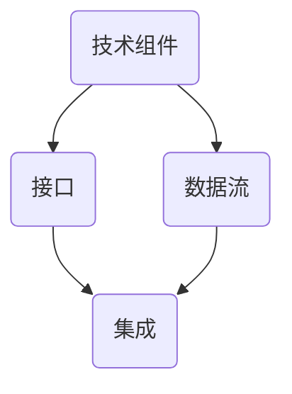

                 


## 文章标题：技术重组：在变革中优化技术结构

### 关键词：
- 技术重组
- 技术结构优化
- 技术变革
- 核心算法原理
- 应用案例
- 最佳实践

### 摘要：
本文旨在探讨技术重组的概念、原理及其在变革中的应用。通过定义技术重组的基础理论，分析相关技术，结合实际案例，本文将详细阐述如何优化技术结构以应对快速变化的IT环境。文章还将提供技术重组的最佳实践和未来趋势，帮助读者在技术变革中抓住机遇。

## 引言

### 1.1 技术重组的背景和重要性
技术重组是指在快速变化的IT环境中，通过重新组织和优化技术组件，提高系统性能、降低维护成本、提升用户体验的一种方法。随着数字化转型的推进，企业的IT基础设施和技术架构面临着前所未有的挑战和机遇。技术重组的重要性在于它能够帮助企业实现技术现代化，提高竞争力，满足市场需求。

### 1.2 技术重组的目标和挑战
技术重组的目标包括提高系统的灵活性、可扩展性和可维护性。然而，实现这些目标面临着众多挑战，如技术债务、遗留系统、团队协作等。本文将逐步分析这些挑战，并提供解决方案。

### 1.3 本书的目标和结构
本书旨在提供一份全面的技术重组指南，包括理论基础、应用案例和最佳实践。结构上，文章分为七个章节：引言、基础理论、相关技术、案例分析、最佳实践、未来趋势和工具资源。通过这些章节，读者将系统地了解技术重组的概念和实践。

## 技术重组基础理论

### 2.1 技术重组的定义与分类
技术重组可以定义为对现有技术组件的重新配置、优化和整合。根据重组的目的和方式，技术重组可以分为以下几类：

1. **技术分解与重构**：将复杂系统分解为更小、更易于管理的组件，并进行重构。
2. **技术集成与融合**：将不同技术组件整合为一个统一的系统，提高整体性能。
3. **技术创新与孵化**：引入新技术，推动现有系统的创新和发展。

### 2.2 技术重组的原则和框架
技术重组应遵循以下原则：

1. **最小化改动**：在重组过程中，尽量减少对现有系统的改动，以降低风险。
2. **渐进式改进**：通过逐步优化组件，实现系统的整体改进。
3. **可回滚性**：在重组过程中，应确保能够回滚到之前的状态，以应对可能出现的问题。

技术重组的框架包括以下几个步骤：

1. **需求分析**：明确重组的目标和需求。
2. **技术评估**：评估现有技术的优缺点，确定重组方案。
3. **实施计划**：制定详细的实施计划，包括时间表、资源分配等。
4. **执行与监控**：按照计划实施重组，并进行监控和调整。

### 2.3 技术重组的方法论
技术重组的方法论包括以下关键步骤：

1. **技术调研**：了解当前技术的最新动态和发展趋势。
2. **需求建模**：建立系统的需求模型，明确重组的目标和约束条件。
3. **方案设计**：设计重组方案，包括技术选型、架构设计等。
4. **实现与测试**：按照方案实现重组，并进行严格的测试。
5. **部署与运维**：将重组后的系统部署到生产环境，并进行运维。

### 2.4 技术重组的核心概念和联系
技术重组涉及多个核心概念，包括技术组件、接口、数据流等。以下是一个简单的Mermaid流程图，展示了这些概念之间的联系：



## 技术重组相关技术

### 3.1 技术重组的常用技术

#### 3.1.1 技术分解与重构

**技术分解与重构**是将复杂系统分解为更小、更易于管理的组件，并重新构建其结构和功能。以下是技术分解与重构的核心步骤：

1. **需求分析**：明确系统的功能和性能需求。
2. **组件识别**：识别系统中的关键组件。
3. **接口设计**：设计组件之间的接口，确保组件间的独立性。
4. **代码重构**：对组件进行重构，提高其可读性和可维护性。

**伪代码示例**：

```python
def decompose_and_reconstruct(system):
    components = identify_components(system)
    interfaces = design_interfaces(components)
    for component in components:
        code_reconstruction(component)
    return integrate_components(components, interfaces)
```

#### 3.1.2 技术集成与融合

**技术集成与融合**是将多个技术组件整合为一个统一的系统，以提高整体性能。以下是技术集成与融合的核心步骤：

1. **需求分析**：明确系统的功能和性能需求。
2. **组件选择**：选择合适的技术组件。
3. **接口设计**：设计组件之间的接口，确保组件间的兼容性。
4. **集成测试**：对集成后的系统进行测试，确保其稳定性。

**伪代码示例**：

```python
def integrate_and_fuse(components):
    interfaces = design_interfaces(components)
    integrated_system = integrate_components(components, interfaces)
    test_integrated_system(integrated_system)
    return integrated_system
```

#### 3.1.3 技术创新与孵化

**技术创新与孵化**是引入新技术，推动现有系统的创新和发展。以下是技术创新与孵化的一般流程：

1. **技术调研**：了解当前技术的最新动态和发展趋势。
2. **需求分析**：明确系统的功能和性能需求。
3. **技术评估**：评估新技术对系统的潜在影响。
4. **原型设计**：设计新技术在系统中的应用原型。
5. **实施与测试**：按照原型设计实施新技术，并进行测试。
6. **优化与推广**：根据测试结果优化新技术，并推广到生产环境。

**伪代码示例**：

```python
def innovate_and孵卵(technology, system):
    research_technology(technology)
    analyze_requirements(technology, system)
    evaluate_impact(technology, system)
    design Prototype(technology, system)
    implement_and_test(technology, system)
    optimize_and推广(technology, system)
    return system
```

### 3.2 技术重组的核心算法原理

技术重组涉及多个核心算法原理，包括数据流分析、组件依赖分析、优化算法等。以下是一个简单的数据流分析算法的伪代码示例：

```python
def data_flow_analysis(system):
    components = identify_components(system)
    data_flows = {}
    for component in components:
        data_flows[component] = find_data_flows(component)
    return data_flows
```

在这个算法中，`identify_components`函数用于识别系统中的所有组件，`find_data_flows`函数用于确定组件之间的数据流。

### 技术重组应用案例分析

#### 4.1 案例一：企业级技术重组

**案例背景**：
某大型企业因业务扩展和技术升级，其原有IT系统变得复杂且难以维护。为了提高系统的灵活性、可扩展性和可维护性，企业决定进行技术重组。

**技术重组策略**：
1. **需求分析**：明确新系统的功能和性能需求。
2. **技术评估**：评估现有技术的优缺点，选择合适的技术组件。
3. **架构设计**：设计新的系统架构，包括技术分解与重构、技术集成与融合等。
4. **实施计划**：制定详细的实施计划，确保项目顺利进行。

**实施过程与效果**：
在实施过程中，企业采取了以下措施：
1. **分阶段实施**：将项目分为多个阶段，逐步完成。
2. **风险评估**：对项目进行风险评估，制定应对策略。
3. **团队协作**：加强团队协作，确保项目按时完成。

经过技术重组，企业的IT系统变得更加灵活、可扩展和可维护，满足了业务扩展的需求。

#### 4.2 案例二：行业技术重组实践

**案例背景**：
某行业企业面临着激烈的竞争和技术变革，为了提升竞争力，企业决定进行技术重组。

**技术重组关键点**：
1. **技术创新与孵化**：引入新技术，推动现有系统的创新和发展。
2. **数据治理**：优化数据流，提高数据质量和管理效率。
3. **系统集成**：将多个技术组件整合为一个统一的系统，提高整体性能。

**案例总结与启示**：
通过技术重组，企业成功提升了竞争力，实现了业务的快速发展。案例表明，技术重组在应对技术变革和提升企业竞争力方面具有重要意义。

### 技术重组最佳实践

#### 5.1 技术重组项目规划

**项目规划步骤**：
1. **需求分析**：明确重组的目标和需求。
2. **技术评估**：评估现有技术的优缺点，选择合适的技术组件。
3. **架构设计**：设计新的系统架构，包括技术分解与重构、技术集成与融合等。
4. **资源分配**：确定项目所需的人力、物力和财力资源。
5. **时间表**：制定详细的项目时间表，确保项目按时完成。
6. **风险评估**：对项目进行风险评估，制定应对策略。

**风险评估与应对策略**：
1. **技术风险**：评估新技术引入可能带来的风险，如兼容性问题、性能下降等。
2. **人员风险**：评估团队成员的能力和协作情况，确保团队高效运作。
3. **时间风险**：制定合理的时间表，确保项目按时完成。

#### 5.2 技术重组团队构建

**团队角色与职责**：
1. **项目经理**：负责项目整体管理和协调。
2. **技术专家**：负责技术评估和架构设计。
3. **开发人员**：负责具体的技术实现和测试。
4. **测试人员**：负责测试和验收。
5. **运维人员**：负责系统的部署和运维。

**团队协作与沟通**：
1. **定期会议**：定期召开团队会议，讨论项目进展和问题。
2. **信息共享**：建立信息共享平台，确保团队成员能够及时获取项目信息。
3. **任务分工**：明确团队成员的任务和职责，确保项目高效运作。

#### 5.3 技术重组实施与监控

**实施步骤与流程**：
1. **需求分析**：明确重组的目标和需求。
2. **技术评估**：评估现有技术的优缺点，选择合适的技术组件。
3. **架构设计**：设计新的系统架构，包括技术分解与重构、技术集成与融合等。
4. **开发与测试**：按照架构设计实现系统，并进行严格的测试。
5. **部署与运维**：将重组后的系统部署到生产环境，并进行运维。

**监控指标与反馈机制**：
1. **性能指标**：监控系统的性能指标，如响应时间、吞吐量等。
2. **稳定性指标**：监控系统的稳定性，如错误率、故障率等。
3. **用户反馈**：收集用户反馈，了解系统的使用情况和用户满意度。
4. **反馈机制**：建立反馈机制，及时处理和解决系统问题和用户反馈。

### 技术重组的未来趋势

#### 6.1 技术变革对技术重组的影响

随着技术的不断进步，如云计算、大数据、人工智能等，技术重组将面临新的挑战和机遇。技术变革将推动技术重组向更高效、更智能的方向发展。

#### 6.2 技术重组的潜在发展方向

1. **自动化与智能化**：引入自动化和智能化技术，提高技术重组的效率和效果。
2. **生态整合**：推动技术生态的整合，实现不同技术组件的无缝集成。
3. **可持续性**：关注技术重组的可持续性，降低对环境的影响。

#### 6.3 技术重组对企业的长期影响

技术重组将有助于企业实现技术现代化，提高竞争力，满足市场需求。长期来看，技术重组将为企业创造持续的价值。

### 技术重组工具与资源

#### 7.1 常用技术重组工具

**开源工具推荐**：
- Git：版本控制工具
- Docker：容器化工具
- Kubernetes：容器编排工具

**商业工具介绍**：
- Jenkins：持续集成工具
- JIRA：项目管理工具

#### 7.2 技术资源获取渠道

**技术社区与论坛**：
- Stack Overflow：编程问题与解决方案
- GitHub：开源代码和项目

**学术期刊与报告**：
- IEEE Xplore：计算机科学与工程期刊
- ACM Digital Library：计算机科学学术资源

## 附录

### 附录 A 技术重组相关资源列表

- 技术重组指南：全面介绍技术重组的理论和实践。
- 技术重组案例分析：分享实际案例，提供实用的技术重组策略。
- 技术重组工具集：介绍常用的技术重组工具和资源。

### 附录 B 技术重组案例研究详细资料

- 案例一：企业级技术重组
  - 背景资料
  - 技术重组策略
  - 实施过程
  - 效果评估

- 案例二：行业技术重组实践
  - 背景资料
  - 技术重组关键点
  - 实施过程
  - 案例总结

---

作者：AI天才研究院/AI Genius Institute & 禅与计算机程序设计艺术 /Zen And The Art of Computer Programming

