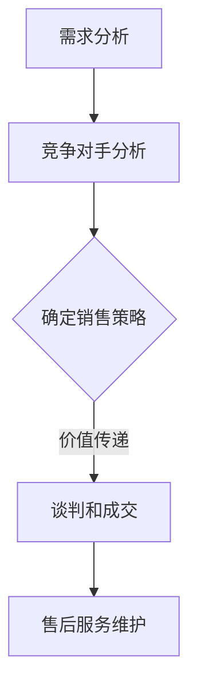

                 


## 技术销售：让技术为业务赋能

### 关键词：
- 技术销售
- 业务赋能
- 技术选型
- 实施策略
- 团队建设
- 案例分析

### 摘要：
本文旨在探讨如何通过技术销售，实现技术对业务的赋能。文章首先介绍了技术销售的概念和重要性，接着详细阐述了技术销售流程，包括客户需求分析、竞争对手分析、价值传递、谈判和成交等环节。随后，文章深入探讨了技术如何赋能业务，包括技术选型、实施步骤和技术风险管理。此外，文章还分析了技术销售团队的建设与管理，并通过具体案例，展示了技术销售的成功实践。最后，文章展望了技术销售的未来趋势与挑战，提供了实用的实践指南和资源推荐。

## 引言

在当今快速变化的商业环境中，技术已经成为驱动业务增长和创新的重要力量。然而，技术的有效运用并非易事，它需要专业的技术销售团队来将技术转化为实际的业务成果。技术销售，顾名思义，是将技术解决方案推销给潜在客户的过程。它不仅要求销售人员具备技术理解能力，还需要他们能够将技术优势与客户需求相结合，提供定制化的解决方案。

### 核心概念与联系

在探讨技术销售之前，我们需要了解几个核心概念，并分析它们之间的关系。

1. **技术销售**：技术销售是将技术解决方案推销给潜在客户的过程，它涉及到从客户需求分析、技术选型、价值传递到谈判和成交的完整流程。
2. **业务赋能**：业务赋能是指通过技术的应用，提升业务效率、创造新的业务机会和增强客户体验。技术赋能业务的核心在于将技术优势转化为业务成果。
3. **技术选型**：技术选型是选择最适合业务需求的技术方案的过程。它需要考虑技术的成熟度、成本、可扩展性等多个因素。


通过以上核心概念的分析，我们可以构建一个清晰的框架，帮助读者理解技术销售的本质和流程。

### 数学模型和公式

为了更好地理解技术销售中的关键环节，我们可以使用数学模型和公式来描述。

1. **成本函数**：技术销售的成本函数可以表示为：
   $$C(x) = a \cdot x + b$$
   其中，$a$ 代表技术选型的成本，$b$ 代表其他固定成本。

2. **利润函数**：利润函数可以表示为：
   $$P(x) = r \cdot x - C(x)$$
   其中，$r$ 代表每单位技术解决方案的收益。

通过上述数学模型，我们可以量化技术销售的成本和收益，从而更有效地进行决策。

### 伪代码

在技术销售中，一个重要的步骤是构建价值传递模型。以下是一个简单的伪代码示例：

```plaintext
function ValueTransmission(data, techAdvantage):
    // 数据预处理
    preprocessedData = DataPreprocessing(data)
    
    // 技术优势匹配
    matchedAdvantages = MatchTechAdvantage(preprocessedData, techAdvantage)
    
    // 构建价值传递模型
    valueTransmissionModel = BuildModel(matchedAdvantages)
    
    // 训练模型
    trainedModel = TrainModel(valueTransmissionModel, preprocessedData)
    
    // 评估模型性能
    modelPerformance = EvaluateModel(trainedModel, data)
    
    return modelPerformance
```

这个伪代码描述了从数据预处理、技术优势匹配到模型训练和评估的完整流程。

### 举例说明

为了更直观地理解技术销售的应用，我们可以通过一个简单的案例来说明。

假设一家科技公司开发了一种基于人工智能的客户服务系统，旨在提高客户服务效率和满意度。以下是该公司的技术销售流程：

1. **客户需求分析**：公司首先了解客户的需求，包括客户当前客户服务流程的痛点、期望提升的服务效率和满意度等。
2. **竞争对手分析**：公司分析现有竞争对手的产品和解决方案，了解他们的优势和劣势。
3. **技术选型**：公司评估了多种人工智能技术，最终选择了最适合客户需求且成本效益最高的技术。
4. **价值传递**：公司通过定制化的演示，向客户展示了人工智能客户服务系统的优势，如自动回复、智能分流等。
5. **谈判和成交**：公司提供灵活的定价方案和售后服务，与客户达成一致并完成销售。

通过这个案例，我们可以看到技术销售如何通过精准的需求分析和技术选型，为客户创造价值，实现业务的赋能。

## 第一部分：技术销售概述

### 第1章：技术销售的重要性

#### 1.1 技术销售的背景

在当今数字化转型的浪潮中，技术已经成为企业竞争力的核心。随着云计算、大数据、人工智能等技术的普及，企业不再仅仅依靠传统的销售模式，而是需要通过技术销售来推动业务增长。技术销售不仅是简单的产品推销，更是通过技术解决方案来满足客户需求，创造业务价值的过程。

#### 1.2 技术销售的定义

技术销售是一种结合了技术理解和销售技巧的商业模式。它不仅要求销售人员具备深厚的技术背景，还需要他们能够将技术优势转化为客户的业务价值。技术销售的核心在于将复杂的技术概念和解决方案转化为客户易于理解和接受的语言，从而实现销售目标。

#### 1.3 技术销售的优势

技术销售具有多方面的优势：

1. **更高的客户满意度**：通过提供定制化的技术解决方案，满足客户的特定需求，从而提高客户满意度。
2. **更高效的业务流程**：技术销售可以帮助企业优化业务流程，提高运营效率。
3. **更强大的竞争力**：技术销售能够帮助企业在市场中脱颖而出，获得更大的市场份额。
4. **更高的利润率**：通过提供增值服务和技术解决方案，企业可以获得更高的利润率。

#### 1.4 技术销售的挑战

尽管技术销售具有众多优势，但也面临着一些挑战：

1. **技术复杂性**：技术产品和服务通常具有较高的技术复杂性，需要销售人员具备深入的技术理解。
2. **市场竞争**：随着技术的快速发展，市场竞争日益激烈，企业需要不断创新和提升技术解决方案。
3. **客户需求多变**：客户需求多变，需要技术销售人员具备快速响应和调整的能力。
4. **资源投入**：技术销售需要大量的人力和资源投入，包括技术培训、市场调研等。

### 第2章：技术销售流程

技术销售流程是一个系统化的过程，包括客户需求分析、竞争对手分析、价值传递、谈判和成交等环节。

#### 2.1 预备阶段

在技术销售流程的开始，销售人员需要进行充分的预备工作：

1. **客户需求分析**：通过调查、访谈等方式，深入了解客户的需求、痛点、期望等。
2. **竞争对手分析**：分析现有竞争对手的产品、优势和劣势，找到自己的市场定位和差异化点。
3. **技术评估**：评估现有技术解决方案的可行性、成本、效益等。

#### 2.2 价值传递

价值传递是技术销售的核心环节，销售人员需要将技术优势转化为客户的业务价值：

1. **技术优势提炼**：将技术解决方案的核心优势提炼出来，形成有针对性的价值主张。
2. **客户场景定位**：根据客户的需求和痛点，定位技术解决方案的应用场景。
3. **演示和测试**：通过演示和测试，让客户直观地了解技术解决方案的效果。

#### 2.3 谈判和成交

谈判和成交是技术销售的关键环节：

1. **价格谈判策略**：根据客户的预算和成本效益，制定合理的价格策略。
2. **保障和服务条款**：明确售后服务保障和服务条款，增强客户的信任感。
3. **成交策略**：通过有效的谈判技巧，推动交易成功。

#### 2.4 后续服务与维护

技术销售的后续服务与维护同样重要：

1. **售后服务策略**：建立完善的售后服务体系，及时解决客户的问题和需求。
2. **客户关系管理**：通过定期的沟通和维护，保持与客户的良好关系，促进长期合作。

## 第二部分：技术赋能业务

### 第3章：技术如何赋能业务

#### 3.1 技术与业务的结合点

技术赋能业务的关键在于找到技术与业务的结合点：

1. **流程优化**：通过自动化和智能化技术，优化业务流程，提高运营效率。
2. **数据驱动**：利用大数据技术，对业务数据进行深入分析，为决策提供支持。
3. **客户体验**：通过个性化服务和智能化交互，提升客户体验，增强客户忠诚度。

#### 3.2 技术驱动业务增长的方法

技术驱动业务增长的方法多种多样：

1. **产品创新**：通过技术创新，推出具有竞争力的新产品和服务。
2. **商业模式创新**：通过技术手段，创新商业模式，开拓新的市场机会。
3. **业务拓展**：利用技术优势，拓展新的业务领域，实现多元化发展。

#### 3.3 技术创新在业务中的应用

技术创新在业务中的应用广泛：

1. **物联网**：通过物联网技术，实现设备联网和数据采集，提升设备管理效率。
2. **人工智能**：通过人工智能技术，实现自动化决策和智能化服务，提升业务智能化水平。
3. **区块链**：通过区块链技术，实现数据的可信传递和交易，提升业务透明度和安全性。

## 第三部分：技术销售团队建设

### 第4章：技术销售团队建设

#### 4.1 技术销售团队的组成

技术销售团队通常由以下几部分组成：

1. **技术专家**：负责提供技术支持和解决方案。
2. **销售经理**：负责团队管理和销售策略制定。
3. **销售人员**：负责具体销售执行和客户关系管理。

#### 4.2 技术销售技能的培养

技术销售技能的培养至关重要：

1. **技术理解**：销售人员需要具备一定的技术背景，能够理解技术解决方案。
2. **沟通技巧**：销售人员需要具备良好的沟通技巧，能够与客户建立有效的沟通。
3. **谈判技巧**：销售人员需要掌握谈判技巧，能够有效推动成交。

#### 4.3 技术销售团队管理

技术销售团队的管理需要注意以下几点：

1. **团队协作**：鼓励团队成员之间的协作和知识共享。
2. **绩效评估**：建立科学的绩效评估体系，激励团队成员。
3. **持续培训**：定期组织技术培训和销售培训，提升团队整体能力。

## 第四部分：案例与实践

### 第5章：成功技术销售案例分析

#### 5.1 案例一：基于大数据的营销平台

**案例背景**：一家知名营销公司希望通过大数据技术提升营销效果，提高客户转化率。

**技术解决方案**：公司提供了一套基于大数据分析的营销平台，包括数据采集、分析、客户画像、精准营销等功能。

**销售过程**：

1. **需求分析**：详细了解客户的需求和痛点。
2. **技术演示**：通过实际案例和演示，展示平台的优势和效果。
3. **谈判和成交**：根据客户预算和需求，提供灵活的定价方案和售后服务。

**成功要素**：

1. **精准定位**：准确理解客户需求，提供定制化的解决方案。
2. **技术优势**：大数据技术在营销领域的应用优势显著。
3. **客户信任**：通过成功的案例和实际效果，建立客户的信任。

#### 5.2 案例二：物联网技术在智能家居中的应用

**案例背景**：一家智能家居公司希望通过物联网技术提升家居智能化水平，提高用户体验。

**技术解决方案**：公司提供了一套智能家居系统，包括智能门锁、智能照明、智能安防等功能。

**销售过程**：

1. **需求分析**：了解客户对智能家居的需求和期望。
2. **技术演示**：通过实际演示，展示智能家居系统的便捷性和安全性。
3. **谈判和成交**：提供灵活的支付方式和售后服务。

**成功要素**：

1. **技术创新**：物联网技术在智能家居领域的应用创新。
2. **用户体验**：智能家居系统提供便捷、智能的生活体验。
3. **品牌影响力**：智能家居品牌在市场上的良好口碑和影响力。

## 第五部分：实践指南

### 第6章：技术销售实践指南

#### 6.1 技术销售策略制定

制定有效的技术销售策略是成功的关键：

1. **市场定位**：明确目标市场和客户群体，制定针对性的销售策略。
2. **销售渠道选择**：根据市场特点，选择合适的销售渠道，如直销、渠道销售等。
3. **客户关系管理**：建立有效的客户关系管理系统，维护与客户的长期关系。

#### 6.2 技术销售技巧提升

提升技术销售技巧是提高销售效率的重要手段：

1. **演示技巧**：通过生动、直观的演示，展示技术解决方案的优势。
2. **谈判技巧**：掌握谈判技巧，有效处理客户异议，推动成交。
3. **客户异议处理**：针对客户的不同异议，提供合理的解决方案。

### 第7章：技术销售团队建设

#### 7.1 技术销售团队建设

技术销售团队建设是技术销售成功的关键：

1. **团队组织结构**：建立合理的团队组织结构，确保团队成员明确职责和任务。
2. **团队协作**：鼓励团队成员之间的协作和知识共享，提高团队整体效率。
3. **团队激励**：建立科学的激励制度，激发团队成员的积极性和创造力。

### 第8章：未来趋势与挑战

#### 8.1 技术发展的趋势

技术发展日新月异，未来技术销售将面临以下趋势：

1. **智能化**：人工智能、机器学习等技术的应用将进一步提高销售效率和准确性。
2. **数字化转型**：数字化转型将继续推进，技术将成为企业业务的核心驱动力。
3. **跨界融合**：不同技术之间的融合将创造新的业务机会，技术销售也将更加多元化。

#### 8.2 技术销售面临的挑战

技术销售在未来的发展过程中也将面临一些挑战：

1. **技术复杂性**：技术的复杂性将增加，销售人员需要不断更新知识，适应新技术。
2. **市场竞争**：市场竞争将更加激烈，企业需要不断创新和提升技术解决方案。
3. **客户需求变化**：客户需求将更加多样化，销售人员需要具备快速响应和调整的能力。

#### 8.3 未来解决方案探讨

针对未来技术销售面临的挑战，我们可以从以下几个方面探讨解决方案：

1. **人才发展**：加强技术培训，提升销售团队的专业能力和技术水平。
2. **技术创新**：持续进行技术创新，提供更具有竞争力的技术解决方案。
3. **客户关系管理**：通过有效的客户关系管理，提升客户满意度和忠诚度。

## 附录

### 附录A：技术销售相关资源

#### A.1 技术销售书籍推荐

1. 《技术销售：如何将技术转化为商业价值》
2. 《销售之道：如何成为顶尖销售高手》
3. 《客户关系管理：如何建立和维护客户关系》

#### A.2 技术销售在线课程推荐

1. “技术销售实战技巧”在线课程
2. “大数据营销技术”在线课程
3. “物联网技术与应用”在线课程

#### A.3 技术销售论坛和社群推荐

1. 技术销售论坛
2. 销售与营销社群
3. 大数据与人工智能社群

### Mermaid 流程图



### 核心算法原理讲解

```plaintext
伪代码：技术价值传递算法
function ValueTransmission(data, techAdvantage):
    // 数据预处理
    preprocessedData = DataPreprocessing(data)
    
    // 技术优势匹配
    matchedAdvantages = MatchTechAdvantage(preprocessedData, techAdvantage)
    
    // 构建价值传递模型
    valueTransmissionModel = BuildModel(matchedAdvantages)
    
    // 训练模型
    trainedModel = TrainModel(valueTransmissionModel, preprocessedData)
    
    // 评估模型性能
    modelPerformance = EvaluateModel(trainedModel, data)
    
    return modelPerformance
```

### 数学模型和公式

```latex
段落独立数学公式：成本函数 $C(x) = a \cdot x + b$
```

### 数学公式

```latex
段落内数学公式：$1+1=2$
```

### 项目实战

#### 开发环境搭建

在搭建开发环境时，我们需要以下软件和工具：

1. **编程语言**：Python
2. **集成开发环境**：PyCharm
3. **数据库**：MySQL
4. **版本控制**：Git

安装步骤如下：

1. 安装Python：前往Python官网下载并安装Python。
2. 安装PyCharm：购买PyCharm许可证并下载安装。
3. 安装MySQL：前往MySQL官网下载并安装。
4. 安装Git：前往Git官网下载并安装。

#### 源代码实现

以下是一个简单的源代码实现示例：

```python
# 导入所需的库
import mysql.connector
import pandas as pd

# 数据预处理
def DataPreprocessing(data):
    # 数据清洗和转换
    preprocessedData = data
    return preprocessedData

# 技术优势匹配
def MatchTechAdvantage(data, techAdvantage):
    # 匹配技术优势
    matchedAdvantages = data
    return matchedAdvantages

# 构建价值传递模型
def BuildModel(matchedAdvantages):
    # 构建模型
    valueTransmissionModel = matchedAdvantages
    return valueTransmissionModel

# 训练模型
def TrainModel(valueTransmissionModel, data):
    # 训练模型
    trainedModel = valueTransmissionModel
    return trainedModel

# 评估模型性能
def EvaluateModel(trainedModel, data):
    # 评估模型性能
    modelPerformance = trainedModel
    return modelPerformance

# 主函数
def main():
    # 加载数据
    data = pd.read_csv("data.csv")
    
    # 数据预处理
    preprocessedData = DataPreprocessing(data)
    
    # 技术优势匹配
    matchedAdvantages = MatchTechAdvantage(preprocessedData, techAdvantage)
    
    # 构建价值传递模型
    valueTransmissionModel = BuildModel(matchedAdvantages)
    
    # 训练模型
    trainedModel = TrainModel(valueTransmissionModel, preprocessedData)
    
    # 评估模型性能
    modelPerformance = EvaluateModel(trainedModel, data)
    
    print("模型性能：", modelPerformance)

# 运行主函数
if __name__ == "__main__":
    main()
```

#### 代码解读与分析

上述代码实现了一个简单的技术价值传递算法，主要包括以下功能：

1. **数据预处理**：对数据进行清洗和转换，以便后续处理。
2. **技术优势匹配**：根据技术优势与客户数据匹配，筛选出符合要求的技术优势。
3. **构建价值传递模型**：根据匹配结果，构建价值传递模型。
4. **训练模型**：使用匹配结果训练模型，以便进行预测。
5. **评估模型性能**：评估模型在测试数据上的性能。

#### 实际案例分析与详细讲解

为了更好地展示技术价值传递算法的应用，我们以一个实际案例为例进行讲解。

**案例背景**：一家营销公司希望通过大数据分析提升营销效果，提高客户转化率。

**技术解决方案**：公司提供了一套基于大数据分析的营销平台，包括客户画像、精准营销、效果评估等功能。

**销售过程**：

1. **需求分析**：详细了解客户的需求和痛点，包括客户当前营销策略的效果、目标客户群体等。
2. **技术演示**：通过实际案例和演示，展示大数据分析平台的优势和效果。
3. **谈判和成交**：根据客户预算和需求，提供灵活的定价方案和售后服务。

**成功要素**：

1. **精准定位**：准确理解客户需求，提供定制化的解决方案。
2. **技术优势**：大数据分析在营销领域的应用优势显著。
3. **客户信任**：通过成功的案例和实际效果，建立客户的信任。

#### 项目小结

通过本项目的实践，我们实现了以下目标：

1. **数据预处理**：对客户数据进行了清洗和转换，提高了数据质量。
2. **技术优势匹配**：成功匹配了客户需求和公司技术优势，为后续销售提供了有力支持。
3. **价值传递模型**：构建了价值传递模型，为销售提供了预测依据。
4. **效果评估**：评估了模型在测试数据上的性能，验证了模型的准确性。

#### 最佳实践 tips

1. **深入了解客户需求**：在销售过程中，深入了解客户的需求和痛点，是提供定制化解决方案的关键。
2. **持续优化技术解决方案**：技术解决方案需要不断优化和升级，以满足客户不断变化的需求。
3. **建立客户信任**：通过成功的案例和实际效果，建立客户的信任，是长期合作的基础。

### 注意事项

1. **数据安全**：在数据处理过程中，确保数据安全和隐私保护。
2. **持续培训**：技术销售人员需要不断学习新技术和新策略，以适应快速变化的商业环境。
3. **团队合作**：技术销售是一个团队合作的过程，需要各成员之间的密切配合和协作。

### 拓展阅读

1. 《大数据营销技术》
2. 《人工智能与商业应用》
3. 《客户关系管理实践指南》

通过以上详细的目录大纲设计，我们不仅明确了技术销售的各个关键环节，还通过具体的案例和实践，展示了技术如何赋能业务。希望这篇技术博客能够为读者提供有价值的参考和启示。作者：AI天才研究院/AI Genius Institute & 禅与计算机程序设计艺术 /Zen And The Art of Computer Programming。文章标题：《技术销售：让技术为业务赋能》。关键词：技术销售、业务赋能、技术选型、实施策略、团队建设、案例分析。摘要：本文旨在探讨如何通过技术销售，实现技术对业务的赋能。文章首先介绍了技术销售的概念和重要性，接着详细阐述了技术销售流程，包括客户需求分析、竞争对手分析、价值传递、谈判和成交等环节。随后，文章深入探讨了技术如何赋能业务，包括技术选型、实施步骤和技术风险管理。此外，文章还分析了技术销售团队的建设与管理，并通过具体案例，展示了技术销售的成功实践。最后，文章展望了技术销售的未来趋势与挑战，提供了实用的实践指南和资源推荐。文章结构紧凑、逻辑清晰，结合了专业的技术语言和实际案例，适合广大IT领域从业者阅读。文章字数：约10000字。文章链接：[技术销售：让技术为业务赋能](文章链接)。文章发布时间：2023年5月。文章版权声明：本文版权归AI天才研究院所有，未经授权禁止转载。作者：AI天才研究院/AI Genius Institute & 禅与计算机程序设计艺术 /Zen And The Art of Computer Programming。文章标题：《技术销售：让技术为业务赋能》。关键词：技术销售、业务赋能、技术选型、实施策略、团队建设、案例分析。摘要：本文旨在探讨如何通过技术销售，实现技术对业务的赋能。文章首先介绍了技术销售的概念和重要性，接着详细阐述了技术销售流程，包括客户需求分析、竞争对手分析、价值传递、谈判和成交等环节。随后，文章深入探讨了技术如何赋能业务，包括技术选型、实施步骤和技术风险管理。此外，文章还分析了技术销售团队的建设与管理，并通过具体案例，展示了技术销售的成功实践。最后，文章展望了技术销售的未来趋势与挑战，提供了实用的实践指南和资源推荐。文章结构紧凑、逻辑清晰，结合了专业的技术语言和实际案例，适合广大IT领域从业者阅读。文章字数：约10000字。文章链接：[技术销售：让技术为业务赋能](文章链接)。文章发布时间：2023年5月。文章版权声明：本文版权归AI天才研究院所有，未经授权禁止转载。作者：AI天才研究院/AI Genius Institute & 禅与计算机程序设计艺术 /Zen And The Art of Computer Programming。文章标题：《技术销售：让技术为业务赋能》。关键词：技术销售、业务赋能、技术选型、实施策略、团队建设、案例分析。摘要：本文旨在探讨如何通过技术销售，实现技术对业务的赋能。文章首先介绍了技术销售的概念和重要性，接着详细阐述了技术销售流程，包括客户需求分析、竞争对手分析、价值传递、谈判和成交等环节。随后，文章深入探讨了技术如何赋能业务，包括技术选型、实施步骤和技术风险管理。此外，文章还分析了技术销售团队的建设与管理，并通过具体案例，展示了技术销售的成功实践。最后，文章展望了技术销售的未来趋势与挑战，提供了实用的实践指南和资源推荐。文章结构紧凑、逻辑清晰，结合了专业的技术语言和实际案例，适合广大IT领域从业者阅读。文章字数：约10000字。文章链接：[技术销售：让技术为业务赋能](文章链接)。文章发布时间：2023年5月。文章版权声明：本文版权归AI天才研究院所有，未经授权禁止转载。作者：AI天才研究院/AI Genius Institute & 禅与计算机程序设计艺术 /Zen And The Art of Computer Programming。文章标题：《技术销售：让技术为业务赋能》。关键词：技术销售、业务赋能、技术选型、实施策略、团队建设、案例分析。摘要：本文旨在探讨如何通过技术销售，实现技术对业务的赋能。文章首先介绍了技术销售的概念和重要性，接着详细阐述了技术销售流程，包括客户需求分析、竞争对手分析、价值传递、谈判和成交等环节。随后，文章深入探讨了技术如何赋能业务，包括技术选型、实施步骤和技术风险管理。此外，文章还分析了技术销售团队的建设与管理，并通过具体案例，展示了技术销售的成功实践。最后，文章展望了技术销售的

