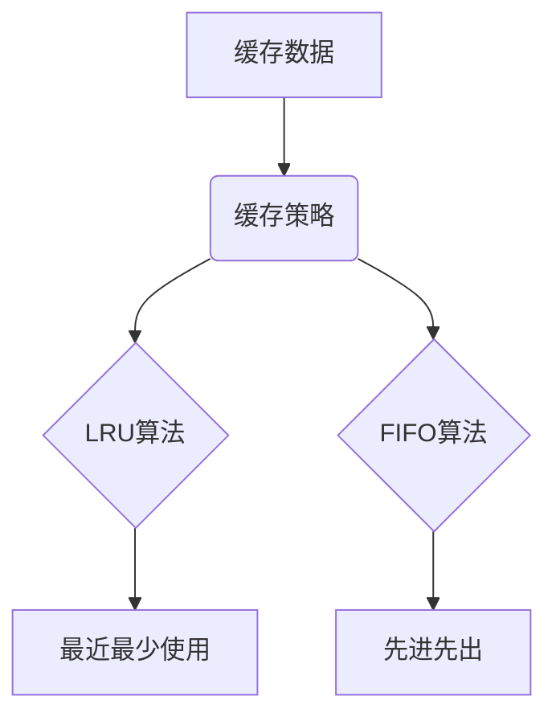

                 

### 文章标题

# 技术面试官的进阶之路

### 关键词

- 技术面试
- 面试官技能提升
- 面试流程管理
- 评估与反馈
- 案例分析
- 自我提升

### 摘要

本文旨在探讨技术面试官如何通过系统的方法和持续的学习，进阶成为卓越的面试官。文章将从基础技能提升、技术面试准备、面试过程管理、评估与反馈、案例分析到自我提升等多个维度，全面解析技术面试官所需的知识和技能。通过实际案例分析和最佳实践分享，帮助读者理解技术面试官的角色定位，提升面试质量和效率，最终实现个人职业成长。

---

## 第一部分：基础技能提升

### 1.1 技术面试官的角色定位

在技术面试过程中，面试官的角色至关重要。他们不仅是应聘者的评估者，更是企业文化和技术需求的传递者。因此，技术面试官的角色定位应当明确，其核心能力包括：

- **沟通能力**：有效沟通是面试官必备的能力。这包括清晰表达问题、准确理解应聘者的回答，以及适当的非语言沟通，如眼神交流、肢体语言等。
- **问题设计能力**：面试官需要设计出既能考察应聘者技能，又能够启发思维的问题。这要求面试官具备扎实的技术背景和良好的问题抽象能力。
- **评估能力**：面试官需要具备评估应聘者能力的技术标准，能够从应聘者的回答中准确判断其技术水平、学习能力、团队合作能力等。
- **时间管理能力**：在面试过程中，面试官需要合理分配时间，确保每个应聘者都有充足的时间展示自己，同时也不能拖延整个面试的进度。

### 1.2 沟通技巧

沟通技巧在面试过程中至关重要。以下是一些提高沟通技巧的建议：

- **积极倾听**：倾听是沟通的基础。面试官应当全神贯注地听应聘者回答问题，并通过适当的反馈来确认自己的理解。
- **明确表达**：面试官在提问时应当尽量使用简单明了的语言，避免使用专业术语或复杂的句子结构，以便应聘者能够准确理解问题。
- **非语言沟通**：适当的非语言沟通，如点头、微笑、眼神接触等，可以增强沟通的效果。同时，注意自己的肢体语言，避免出现负面信号。

### 1.3 问题设计与评估方法

设计好的面试问题对于评估应聘者的技能至关重要。以下是几种常见的问题类型和评估方法：

- **编程题**：这类题目主要考察应聘者的编程能力和算法思维。常见的编程题包括排序算法、搜索算法等。评估方法是通过代码质量、逻辑清晰度和解决问题的能力来判断。
- **开放式问题**：这类问题鼓励应聘者表达自己的观点和经验。评估方法主要是通过应聘者的回答深度和广度来评估其专业知识和思维深度。
- **封闭式问题**：这类问题通常有明确的答案，如“你熟悉哪种编程语言？”评估方法是通过应聘者的回答准确性和相关性来判断。
- **情境题**：这类问题模拟实际工作场景，考察应聘者在特定情境下的决策能力和解决问题的能力。评估方法是通过应聘者的回答是否合理、是否具备实际应用能力来判断。

### 1.4 面试前的准备工作

面试前的准备工作是确保面试顺利进行的重要环节。以下是一些准备工作：

- **面试者资料准备**：提前了解应聘者的背景资料，包括教育经历、工作经历、项目经验等，以便在面试中更好地进行提问和评估。
- **面试题库准备**：根据面试要求，准备一份题库，包括编程题、开放式问题和情境题等，以便在面试时灵活选用。
- **面试场地布置**：确保面试场地环境舒适，设备齐全，如网络稳定、音响清晰等。
- **面试流程模拟**：通过模拟面试，熟悉整个面试流程，包括面试问题、时间分配、面试官之间的沟通等，以便在实际面试中更加流畅。

## 第二部分：技术面试准备

### 2.1 常见面试题型解析

技术面试中，常见的面试题型包括编程题、数据结构与算法题、系统设计题等。以下是这些题型的解析：

#### 编程题

编程题主要考察应聘者的编程能力和算法思维。常见的编程题包括：

- **排序算法**：如快速排序、归并排序、堆排序等。
- **搜索算法**：如二分查找、深度优先搜索、广度优先搜索等。
- **字符串处理**：如最长公共前缀、最长子串等。

解析：

排序算法的解析主要涉及时间复杂度和空间复杂度分析，以及算法的实现细节。

```python
# 快速排序算法的伪代码
QuickSort(array)
    if length(array) <= 1
        return array
    pivot = choosePivot(array)
    left = []
    right = []
    for i from 0 to length(array) - 1
        if array[i] < pivot
            left.append(array[i])
        else
            right.append(array[i])
    return QuickSort(left) + [pivot] + QuickSort(right)
```

#### 数据结构与算法题

数据结构与算法题主要考察应聘者对数据结构的理解和使用能力。常见的数据结构与算法题包括：

- **链表**：如反转链表、合并链表等。
- **栈与队列**：如模拟栈的链表实现、用队列实现栈等。
- **树与图**：如二叉树的遍历、图的深度优先搜索等。

解析：

链表题的解析主要涉及链表的基本操作，如添加、删除、查找等。

```python
# 反转链表的伪代码
ReverseLinkedList(head)
    if head is None or head.next is None
        return head
    prev = None
    current = head
    while current is not None
        next_node = current.next
        current.next = prev
        prev = current
        current = next_node
    return prev
```

#### 系统设计题

系统设计题主要考察应聘者对系统架构、性能优化、安全性等方面的理解和设计能力。常见的系统设计题包括：

- **缓存系统**：如LRU缓存、FIFO缓存等。
- **消息队列**：如Kafka、RabbitMQ等的使用场景和设计细节。
- **分布式系统**：如分布式存储、分布式计算等的设计原则和优化方法。

解析：

缓存系统设计的解析主要涉及缓存策略、缓存淘汰算法等。



### 2.2 技术热点与趋势

随着技术的不断进步，面试官需要关注最新的技术热点和趋势，以便在面试中考察应聘者对这些新技术的掌握情况。以下是一些近年来的技术热点和趋势：

- **云计算**：如AWS、Azure、Google Cloud等云服务平台。
- **人工智能**：如机器学习、深度学习、自然语言处理等。
- **区块链**：如比特币、以太坊等区块链技术。
- **物联网**：如智能家居、智能城市等物联网应用。
- **前端技术**：如React、Vue、Angular等前端框架。

### 2.3 面试策略与心态

在面试过程中，面试官和应聘者都需要采取合适的策略和心态。以下是一些面试策略和心态的建议：

- **面试策略**：
  - **充分准备**：提前了解应聘者的背景资料，准备合适的问题。
  - **灵活应变**：根据应聘者的回答灵活调整问题，避免陷入固定套路。
  - **关注细节**：注意观察应聘者的行为和态度，评估其综合素质。

- **心态调整**：
  - **保持冷静**：遇到复杂问题或应聘者回答不好时，保持冷静，给予应聘者足够的思考时间。
  - **积极乐观**：以积极乐观的态度面对面试，传递正能量。
  - **自信从容**：自信是面试成功的关键，通过良好的准备和积极的心态，展现自己的专业素养。

### 2.4 面试准备实战

面试前的准备工作是确保面试顺利进行的重要步骤。以下是一些面试准备实战的步骤：

- **面试前复习**：回顾自己的技术知识，特别是与面试相关的知识点。
- **模拟面试**：与同事或其他面试官进行模拟面试，熟悉面试流程和应对策略。
- **问题整理**：根据应聘者的背景，整理出一套适合的问题清单，包括编程题、开放式问题和情境题等。
- **技术资料准备**：准备一些常见的技术资料，如文档、代码示例等，以备面试时参考。
- **面试场地确认**：确认面试场地，确保设备齐全，网络稳定。

## 第三部分：面试过程管理

### 3.1 面试流程管理

面试流程的管理对于确保面试的顺利进行至关重要。以下是一些面试流程管理的建议：

- **面试安排与协调**：提前与应聘者确认面试时间、地点，确保面试流程的顺利进行。在面试前，与团队成员协调，确保面试官能够按时到场。
- **面试节奏控制**：在面试过程中，控制好面试节奏，确保每个环节的时间分配合理。对于较复杂的面试问题，可以给予应聘者足够的思考时间。
- **面试问题顺序**：合理规划面试问题的顺序，一般建议先从简单问题开始，逐步过渡到复杂问题，以便应聘者逐步适应面试环境。

### 3.2 面试提问技巧

面试官的提问技巧对于面试的质量有着重要影响。以下是一些面试提问技巧：

- **开放式问题**：开放式问题鼓励应聘者表达自己的观点和经验，有助于深入了解应聘者的思维方式和解决问题的能力。
- **封闭式问题**：封闭式问题通常有明确的答案，如“你熟悉哪种编程语言？”这种问题可以快速获取应聘者的基本信息。
- **情境题**：情境题模拟实际工作场景，考察应聘者在特定情境下的决策能力和解决问题的能力。

### 3.3 面试中的观察与分析

在面试过程中，面试官不仅需要关注应聘者的回答，还需要观察其行为和态度。以下是一些观察与分析的建议：

- **非语言线索**：通过观察应聘者的非语言行为，如眼神、表情、肢体语言等，可以获取更多的信息。
- **思维模式分析**：通过应聘者的回答，分析其思维模式，如是否逻辑清晰、是否具备系统思考能力等。
- **心理状态评估**：观察应聘者的心理状态，如是否紧张、是否自信等，有助于了解其面试表现的真实水平。

### 3.4 面试时间管理

面试时间管理是面试官的重要任务之一。以下是一些面试时间管理的建议：

- **时间分配**：根据面试的环节和问题类型，合理分配时间，确保每个环节都有足够的时间。
- **控制节奏**：在面试过程中，注意控制节奏，避免因为某个问题而耽误整个面试的时间。
- **备用时间**：预留一些备用时间，以应对突发情况，如应聘者回答问题需要更多时间等。

## 第四部分：评估与反馈

### 4.1 评估标准与方法

评估是面试过程中的关键环节，以下是一些评估标准和方法：

- **技能评估**：根据应聘者的回答和实际表现，评估其技术能力和编程水平。
- **知识评估**：通过应聘者的回答，评估其对相关知识的掌握程度。
- **思维评估**：通过应聘者的回答和问题解决能力，评估其逻辑思维和创新能力。
- **团队合作评估**：观察应聘者在面试过程中的表现，评估其团队合作能力和沟通能力。

### 4.2 评估结果的呈现

评估结果的呈现是面试官与团队沟通的重要部分。以下是一些评估结果呈现的建议：

- **评估报告**：撰写详细的评估报告，包括应聘者的优点、不足和改进建议。
- **评分系统**：使用评分系统，如5分制或10分制，对每个评估维度进行量化评分。
- **面对面反馈**：在面试结束后，与团队成员面对面反馈评估结果，确保信息的准确性和一致性。

### 4.3 反馈技巧

有效的反馈对于应聘者的成长至关重要。以下是一些反馈技巧：

- **具体明确**：在反馈时，要具体明确地指出应聘者的优点和不足，避免模糊不清的描述。
- **积极正面**：在指出不足时，要保持积极正面的态度，鼓励应聘者改进。
- **具体建议**：提供具体的改进建议，帮助应聘者明确下一步的努力方向。
- **建立信任**：通过积极的反馈，建立与应聘者的信任关系，增强其自信心。

### 4.4 反馈实战

在实际反馈过程中，以下是一些反馈实战的建议：

- **面试结束后立即反馈**：在面试结束后，立即与应聘者进行反馈，避免延误。
- **选择合适的场合**：选择一个私密且安静的环境，确保反馈的私密性和有效性。
- **注意语气温和**：在反馈时，要保持语气温和，避免过于严厉或指责性的语气。
- **鼓励双向沟通**：鼓励应聘者提问或发表意见，确保反馈的双向沟通。

## 第五部分：案例分析

### 5.1 成功面试案例分析

成功的面试案例通常具备以下特点：

- **充分的准备**：面试官在面试前进行了充分的准备，包括了解应聘者的背景、准备合适的问题等。
- **有效的沟通**：面试官在面试过程中与应聘者进行了有效沟通，确保双方的理解一致。
- **合理的评估**：面试官根据应聘者的回答和表现，进行了全面而准确的评估。
- **及时的反馈**：在面试结束后，面试官及时向应聘者提供了反馈，帮助其了解自己的优势和不足。

### 5.2 失败面试案例分析

失败的面试案例通常存在以下问题：

- **准备不足**：面试官在面试前准备不足，导致问题设计不合理，评估标准不明确。
- **沟通不畅**：面试官在面试过程中沟通不畅，导致应聘者无法准确理解问题，也无法展示自己的能力。
- **评估不准确**：面试官在评估应聘者时，未能准确判断其技能水平和综合素质。
- **反馈不及时**：面试官在面试结束后未能及时提供反馈，导致应聘者无法了解自己的优势和不足。

### 5.3 案例分析与启示

通过对成功和失败的面试案例进行分析，我们可以得出以下启示：

- **充分的准备是成功的关键**：无论是面试官还是应聘者，充分的准备都是成功的关键。面试官需要提前了解应聘者的背景，准备合适的问题；应聘者需要提前复习相关知识点，准备面试。
- **有效的沟通是面试的核心**：面试官在面试过程中需要与应聘者进行有效沟通，确保双方的理解一致，同时也需要通过非语言沟通传递积极的信号。
- **合理的评估是面试的保障**：面试官需要根据应聘者的回答和表现，进行全面而准确的评估，确保评估结果的公正性和准确性。
- **及时的反馈是成长的关键**：面试结束后，面试官需要及时向应聘者提供反馈，帮助其了解自己的优势和不足，同时也为面试官的自身成长提供反馈。

## 第六部分：进阶之路

### 6.1 自我提升策略

作为技术面试官，自我提升是持续成长的重要途径。以下是一些自我提升策略：

- **持续学习**：技术领域不断变化，面试官需要持续学习，了解最新的技术热点和趋势。
- **实践提升**：通过实际操作和项目经验，提升自己的技术水平和面试官能力。
- **经验分享**：与其他面试官交流经验，分享面试技巧和心得，不断提升自己的专业素养。
- **反馈与改进**：接受团队成员和应聘者的反馈，不断改进自己的面试方法和评估标准。

### 6.2 面试官社群建设

面试官社群是共享知识和经验的重要平台。以下是一些面试官社群建设的建议：

- **建立目标**：明确社群的目标，如技术交流、面试技巧分享等。
- **组织活动**：定期组织线上或线下活动，如面试技巧分享会、技术研讨会等。
- **建立规则**：制定社群的规则，确保活动的有序进行。
- **鼓励参与**：鼓励面试官积极参与社群活动，分享自己的经验和心得。

### 6.3 持续学习与成长

作为技术面试官，持续学习和成长是职业发展的关键。以下是一些持续学习与成长的建议：

- **阅读**：阅读技术书籍、论文和博客，了解最新的技术动态和理论。
- **实践**：通过实际操作和项目经验，提升自己的技术水平和面试官能力。
- **培训**：参加专业培训课程，学习新的面试技巧和方法。
- **反思**：定期反思自己的面试过程和评估结果，找出不足之处，持续改进。

## 结束语

技术面试官的角色至关重要，他们不仅是应聘者的评估者，更是企业技术文化的重要传递者。通过本文的探讨，我们了解了技术面试官所需的基础技能、面试准备、面试过程管理、评估与反馈以及自我提升策略。希望本文能为技术面试官的进阶之路提供一些有价值的参考和启示。

---

### 作者信息

作者：AI天才研究院/AI Genius Institute & 禅与计算机程序设计艺术 /Zen And The Art of Computer Programming

AI天才研究院致力于推动人工智能领域的技术创新和应用发展，研究人工智能的基础理论和前沿技术，培养人工智能领域的高层次人才。同时，我们也注重计算机科学的教育和传承，通过禅与计算机程序设计艺术的研究，探索计算机科学的哲学内涵和艺术性，推动计算机科学的创新与发展。我们致力于为读者提供高质量、有深度、有思考的技术文章和研究成果，以推动人工智能和计算机科学领域的进步。

