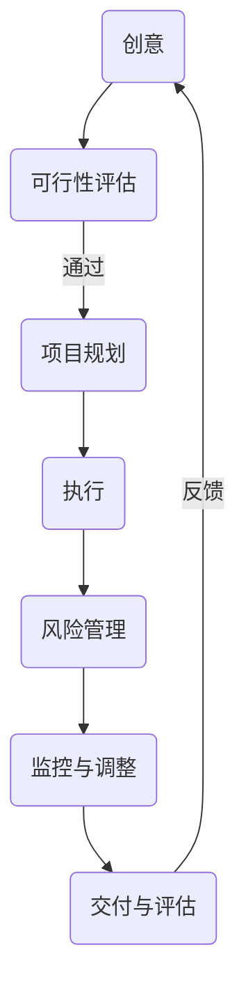

                 

### 背景介绍

在当前快速发展的技术时代，技术项目的孵化与管理成为推动创新和商业成功的关键因素。从创意的产生到项目的最终落地，每一个环节都至关重要。然而，项目孵化并非一蹴而就，它需要系统的方法和细致的管理。本文旨在探讨技术项目孵化的全过程，从创意的产生到项目的落地实施，帮助读者理解和掌握这一复杂但至关重要的过程。

技术项目孵化是一个复杂的过程，涉及到多个阶段和环节。首先是创意的产生，这是项目孵化的起点。接着是对创意的评估和筛选，确保创意具有可行性和商业价值。然后是项目规划，包括设定目标、资源配置和时间规划等。接下来是项目执行，这一阶段涉及到团队的协作、技术的选型和开发流程的管理。在项目执行过程中，风险管理和项目监控是必不可少的，确保项目能够按照既定计划顺利推进。最后是项目的交付与评估，确保项目能够达到预期目标，同时为未来项目的孵化提供经验教训。

本文将深入探讨每个阶段的核心概念和方法，通过详细的案例分析来展示如何有效地进行技术项目孵化。本文不仅提供了理论上的指导，还包括实际操作步骤和最佳实践，旨在为读者提供全面的参考。

本文将分为以下几个部分：

1. **项目孵化基础理论**：介绍项目孵化的核心概念、流程和重要性。
2. **创意生成与评估**：探讨创意思维的技巧和方法，以及创意评估的指标和方法。
3. **项目计划与执行**：详细阐述项目目标的设定、资源配置和时间规划，以及团队协作和沟通的技巧。
4. **项目风险管理**：讨论风险管理的框架、风险识别与评估的方法，以及风险应对策略。
5. **项目监控与调整**：介绍项目监控与绩效评估的方法，以及变更管理和项目收尾。
6. **项目交付与评估**：探讨项目交付计划、客户关系管理，以及项目后评估与改进。

通过本文的详细阐述，读者将能够全面了解技术项目孵化的全过程，掌握关键技能和方法，从而在项目管理中取得成功。

### 核心概念与联系：项目孵化的流程与架构

在探讨技术项目孵化的全过程之前，首先需要明确一些核心概念，并理解它们之间的相互关系。项目孵化是一个从创意产生到最终落地的系统性过程，包括多个阶段和环节，每个环节都有其特定的目标和任务。以下是项目孵化流程的核心概念及其关系架构：

1. **创意**：创意是项目孵化的起点，是项目的基础。它是创新思维的结果，来源于对市场需求、技术趋势或个人灵感的洞察。创意可以是产品或服务的概念、改进的想法或新的技术解决方案。

2. **可行性评估**：在创意产生后，需要对创意的可行性进行评估。这一阶段主要关注创意的可行性、市场需求、技术难度和资源需求等。通过评估，可以确定创意是否值得继续孵化。

3. **项目规划**：在创意通过可行性评估后，进入项目规划阶段。项目规划包括目标设定、资源分配和时间规划等。这一阶段的任务是确保项目有明确的路线图和可执行的计划。

4. **执行**：项目规划完成后，进入项目执行阶段。这一阶段涉及到团队协作、技术开发、测试和部署等。执行阶段是实现项目目标的关键，需要高效的管理和协调。

5. **风险管理**：在项目执行过程中，风险管理是确保项目顺利进行的重要环节。风险管理包括风险识别、评估和应对策略的制定。通过有效的风险管理，可以降低项目风险，确保项目按计划推进。

6. **监控与调整**：项目执行过程中，需要持续监控项目进展和绩效。通过监控，可以及时发现偏差，并进行必要的调整。监控与调整是确保项目按计划进行的动态管理过程。

7. **交付与评估**：项目完成交付后，需要对项目进行评估。评估包括项目目标达成度、客户满意度、项目效率等方面。评估结果为项目成功提供证据，并为未来项目提供经验和教训。

为了更好地理解这些核心概念之间的关系，我们可以使用Mermaid流程图来展示项目孵化流程的整体架构：

在上述流程图中，每个节点代表一个关键阶段，节点之间的箭头表示各阶段之间的逻辑关系。通过这个流程图，我们可以清晰地看到项目孵化各阶段之间的相互联系和动态关系。

- **创意**是整个流程的起点，是项目的最初灵感。
- **可行性评估**是确定创意是否值得进一步孵化的关键步骤。
- **项目规划**为项目提供了明确的路线图和计划。
- **执行**是实现项目目标的核心阶段。
- **风险管理**是确保项目顺利推进的重要保障。
- **监控与调整**是项目执行过程中的动态管理，确保项目按计划进行。
- **交付与评估**是项目的最终阶段，为项目成功提供证据，并为未来项目提供经验。

通过理解这些核心概念及其相互关系，我们可以更有效地进行技术项目孵化，确保项目的成功落地。

### 创意生成与评估

创意是项目孵化过程的起点，它是创新的源泉，也是项目成功的关键因素。在创意生成阶段，我们需要运用多种方法和技术来激发创意思维，确保创意的多样性和可行性。以下是几种常用的创意生成方法和创意评估的指标及方法。

#### 创意生成方法

1. **头脑风暴**：头脑风暴是一种常用的创意生成方法，通过集体讨论和自由联想，迅速产生大量创意。参与者可以不受限制地提出任何想法，即使有些想法看似不切实际。这种方法能够激发团队成员的创造力和想象力。

2. **思维导图**：思维导图是一种图形化的思考工具，通过将想法以分支的形式进行组织，帮助人们进行结构化的思考和创意生成。思维导图能够清晰地展示创意之间的联系，有助于发现新的创意组合。

3. **用户访谈**：通过与潜在用户进行深入访谈，了解他们的需求、痛点和行为习惯，从而生成针对实际需求的创意。用户访谈可以提供第一手的用户数据，有助于生成更加贴近市场需求的创意。

4. **反向思维**：反向思维是一种通过思考问题的对立面或反方向来激发创意的方法。例如，考虑如何使一个产品或服务变得无用，或者如何解决一个看似不可能的问题。

5. **联想思维**：通过将不同领域的知识或概念进行组合，产生新的创意。例如，将农业技术和信息技术结合，可能产生新的农业自动化解决方案。

#### 创意评估指标与方法

在创意生成后，我们需要对创意进行评估，以确定其可行性和商业价值。以下是几种常用的创意评估指标和方法：

1. **可行性评估**：评估创意在技术、市场、资源和时间等方面的可行性。具体指标包括：
   - **技术可行性**：评估创意是否基于现有技术实现，是否存在技术障碍。
   - **市场可行性**：评估创意在市场上的需求、竞争状况和潜在市场规模。
   - **资源可行性**：评估实施创意所需的资源，包括资金、人力和技术资源等。
   - **时间可行性**：评估创意实现的时间成本和开发周期。

2. **商业价值评估**：评估创意的潜在商业价值，包括利润空间、市场份额和竞争优势等。具体指标包括：
   - **利润空间**：评估创意的潜在收入和成本，计算投资回报率。
   - **市场份额**：评估创意在市场中的竞争地位，预测未来的市场份额。
   - **竞争优势**：评估创意的独特性，分析其在市场中的竞争优势。

3. **用户满意度评估**：评估创意的用户接受度，包括用户需求满足度、用户体验和用户忠诚度等。具体方法包括：
   - **用户调研**：通过问卷调查、访谈等方式了解用户对创意的看法和需求。
   - **用户测试**：通过原型测试或用户试用，收集用户反馈，评估用户体验。

4. **风险评估**：评估创意在实施过程中可能面临的风险，包括技术风险、市场风险和运营风险等。具体方法包括：
   - **风险评估矩阵**：使用风险评估矩阵对创意的风险进行定量分析，确定风险优先级。
   - **风险应对策略**：制定相应的风险应对策略，包括风险预防、风险转移和风险缓解等。

#### 创意筛选与优先级排序

在评估多个创意后，我们需要对创意进行筛选和优先级排序，以确保资源和时间的有效利用。以下是几种常用的筛选和排序方法：

1. **评分法**：根据评估指标，对每个创意进行打分，总分数最高的创意优先级最高。

2. **优先级矩阵**：将每个创意的评估得分和优先级进行矩阵排列，根据得分和优先级确定创意的优先级。

3. **成本效益分析**：计算每个创意的成本和预期收益，选择成本效益最高的创意。

4. **资源约束排序**：根据资源约束，选择资源利用率最高的创意。

通过上述方法，我们可以有效地生成和评估创意，确保创意的质量和可行性，为项目孵化提供坚实的基础。

### 项目计划与执行

项目计划是项目成功实施的关键步骤，它为项目的开展提供了明确的目标、资源分配和时间规划。在项目计划阶段，我们需要对项目目标进行详细设定，合理分配资源，制定详细的时间规划，并确保项目能够在预定的时间和预算内完成。

#### 项目目标设定

项目目标设定的第一步是明确项目的总体目标和具体目标。总体目标通常是指项目希望达成的最终结果，而具体目标则是为了实现总体目标而需要达成的阶段性目标。具体目标应该具备以下特点：

1. **明确性**：目标应具体、明确，避免模糊和抽象的表述。例如，“开发一款用户友好的移动应用”比“开发一款应用”更具明确性。

2. **可衡量性**：目标应具备可衡量性，以便在项目执行过程中进行监控和评估。例如，“用户满意度达到90%”比“提升用户满意度”更具备可衡量性。

3. **可实现性**：目标应在现有资源和条件下可以实现。过高或过低的目标都会影响项目的成功。

4. **相关性**：目标应与项目总体目标和组织战略目标相关联。确保项目目标与组织战略保持一致。

#### 资源配置

资源配置是项目计划的重要环节，涉及到人力资源、财务资源和物资资源的合理分配。以下是资源配置的关键步骤：

1. **人力资源分配**：根据项目需求，合理分配项目团队中的各个角色和职责。确保每个团队成员都有明确的任务和目标，并具备完成任务所需的技能和经验。

2. **财务资源分配**：制定详细的预算计划，确保项目在财务预算范围内进行。预算应包括直接成本和间接成本，如员工工资、设备采购、租赁费用等。

3. **物资资源分配**：确定项目所需的物资资源，如设备、材料、工具等，并确保按时供应。

#### 时间规划

时间规划是项目计划的核心，它为项目提供了详细的执行时间表和里程碑。以下是时间规划的关键步骤：

1. **工作分解结构（WBS）**：将项目工作分解为可管理的任务和子任务，形成工作分解结构。WBS有助于明确项目的具体任务和责任分配。

2. **任务排序**：根据任务的依赖关系，使用如关键路径法（CPM）或计划评审技术（PERT）等方法对任务进行排序，确保项目按时完成。

3. **时间估算**：对每个任务的完成时间进行估算，并考虑任务的优先级和资源可用性。时间估算应尽可能准确，以避免项目延误。

4. **制定时间表**：将任务和其时间估算整合成时间表，明确项目的关键里程碑和交付日期。时间表应包括项目的开始和结束时间，以及每个阶段的交付时间点。

#### 团队协作与沟通

在项目执行过程中，团队协作和沟通至关重要。以下是确保团队协作和沟通的有效策略：

1. **明确沟通渠道**：建立明确的沟通渠道和机制，确保团队成员之间的信息流畅。例如，定期举行项目会议、使用项目管理工具等。

2. **共享资源**：确保项目团队成员能够访问所需的信息和资源，促进协作和高效工作。

3. **角色明确**：确保每个团队成员的角色和职责明确，避免角色重叠或职责不清。

4. **培训与支持**：为团队成员提供必要的培训和支持，帮助他们掌握所需的技能和知识，提高项目成功率。

5. **积极反馈**：建立积极的反馈机制，鼓励团队成员提出意见和建议，及时解决项目中的问题和挑战。

通过科学合理的目标设定、资源配置和时间规划，以及有效的团队协作和沟通，项目能够在预定的时间和预算内完成，实现预期目标。

### 项目风险管理

项目风险管理是确保项目成功的关键环节，它涉及识别、评估和应对项目中可能遇到的风险。有效的风险管理能够降低项目风险，保障项目按计划进行，并在出现问题时及时采取应对措施。

#### 风险管理框架

项目风险管理框架通常包括以下步骤：

1. **风险识别**：识别项目中可能遇到的风险，包括技术风险、市场风险、财务风险和运营风险等。
2. **风险评估**：评估风险的概率和影响，确定风险的优先级。
3. **风险应对策略**：制定风险应对策略，包括风险预防、风险转移和风险缓解等。
4. **风险监控**：持续监控项目风险，及时调整风险应对策略。

#### 风险识别与评估方法

1. **风险识别**：
   - **专家访谈**：通过与项目团队成员、行业专家和利益相关者进行访谈，收集他们对项目风险的看法和建议。
   - **文档审查**：审查项目相关文档，如需求文档、设计文档和测试文档等，识别潜在的风险点。
   - **历史数据分析**：分析以往类似项目的风险记录，借鉴经验教训。

2. **风险评估**：
   - **定性评估**：使用风险评分方法，如风险矩阵，对风险的概率和影响进行定性评估。
   - **定量评估**：使用数学模型或统计方法，对风险的概率和影响进行定量评估，例如蒙特卡洛模拟。

#### 风险应对策略

1. **风险预防**：采取预防措施，减少风险发生的概率或降低风险的影响。
   - **预防措施**：制定详细的应急预案，准备备用方案，确保项目能够迅速应对突发情况。
   - **风险规避**：通过调整项目计划或方案，避免高风险区域。

2. **风险转移**：将风险转移给第三方，例如通过保险或合同条款的约定。
   - **风险转移措施**：购买保险、签订合同或与其他公司合作，将部分风险转移。

3. **风险缓解**：采取措施减轻风险的影响，确保项目能够按计划进行。
   - **缓解措施**：建立应急团队、增加预算和时间缓冲、改进流程和流程优化等。

通过识别、评估和应对项目风险，项目团队能够有效降低项目风险，提高项目成功的概率。

### 项目监控与调整

在项目执行过程中，监控与调整是确保项目按计划进行的关键环节。项目监控涉及对项目进度、成本、质量和风险等方面的持续跟踪和评估。通过有效的监控与调整，项目团队能够及时发现偏差，采取必要的纠正措施，确保项目能够顺利推进。

#### 监控与绩效评估

1. **制定监控计划**：
   - **监控指标**：明确项目的关键绩效指标（KPI），如进度、成本、质量等，确保监控的针对性和有效性。
   - **监控频率**：根据项目的规模和复杂性，确定监控的频率，例如每周或每月进行一次进度检查。

2. **绩效评估**：
   - **定期报告**：项目团队定期编制项目报告，包括进度报告、成本报告和质量报告等，向项目管理者提供项目现状。
   - **偏差分析**：分析实际绩效与计划目标的偏差，识别偏差的原因和影响。

#### 变更管理

1. **变更请求**：
   - **识别变更**：在项目执行过程中，识别需要变更的需求、计划或资源等。
   - **评估变更**：评估变更对项目的影响，包括时间、成本、资源和质量等方面。

2. **变更控制**：
   - **审批流程**：制定变更审批流程，确保变更的合法性和合理性。
   - **变更记录**：记录所有变更请求和审批过程，确保变更的可追溯性。

#### 调整与优化

1. **调整计划**：
   - **调整策略**：根据监控结果和变更请求，调整项目计划，确保项目能够回到正轨。
   - **优先级排序**：根据变更的影响和紧急程度，对变更请求进行优先级排序，优先处理重要和紧急的变更。

2. **优化流程**：
   - **流程分析**：定期对项目流程进行回顾和分析，识别流程中的瓶颈和改进机会。
   - **流程改进**：根据分析结果，实施流程优化措施，提高项目执行效率。

通过有效的监控与调整，项目团队能够确保项目按计划进行，应对项目中的各种挑战和变化，提高项目的成功率和客户满意度。

### 项目交付与评估

项目交付是项目生命周期的最后一个关键环节，它标志着项目的完成和成果的实现。在项目交付阶段，项目团队需要确保所有工作成果符合预定的质量标准，并且能够顺利交付给客户或用户。此外，项目交付还涉及到客户关系管理和项目后评估，以获取宝贵的反馈和经验教训，为未来项目提供参考。

#### 项目交付计划与执行

1. **交付计划**：
   - **明确交付目标**：制定详细的交付计划，明确项目交付的最终目标和交付内容，包括功能、性能、安全性等要求。
   - **制定交付时间表**：确定项目的交付时间表，包括各个阶段的交付时间和里程碑，确保项目能够按时交付。

2. **执行交付计划**：
   - **准备交付物**：确保项目交付物，如软件、文档、数据等，已经完成并且经过严格的质量检查。
   - **协调交付活动**：与客户或用户进行紧密的沟通和协调，确保交付过程顺利进行。

3. **交付验收**：
   - **客户验收**：与客户进行验收测试，确保项目交付物符合客户需求和质量标准。
   - **文档交付**：提供详细的项目文档，包括用户手册、操作指南、维护手册等，帮助用户正确使用和管理项目交付物。

#### 客户关系管理

1. **建立信任关系**：
   - **定期沟通**：与客户保持定期的沟通，了解客户的需求和反馈，建立信任关系。
   - **问题解决**：及时解决客户提出的问题和需求，确保客户满意度。

2. **维护客户关系**：
   - **售后服务**：提供优质的售后服务，包括技术支持、故障修复和功能改进等。
   - **客户反馈**：鼓励客户提供反馈，根据反馈进行持续改进，提升产品和服务质量。

3. **持续合作**：
   - **合作拓展**：在项目交付后，寻求与客户的持续合作机会，如后续项目、产品升级等。
   - **客户推荐**：通过客户的满意和推荐，扩大客户基础，提高市场占有率。

#### 项目后评估与改进

1. **评估项目成功因素**：
   - **目标达成度**：评估项目是否达到预期目标，包括功能、性能、质量等方面。
   - **客户满意度**：评估客户对项目的满意程度，收集客户反馈，了解项目的优势和不足。

2. **分析项目问题**：
   - **问题识别**：识别项目中出现的问题和挑战，包括管理问题、技术问题等。
   - **原因分析**：分析问题产生的原因，找出根本原因，制定改进措施。

3. **制定改进计划**：
   - **改进措施**：根据评估结果，制定具体的改进措施，包括流程优化、培训提升、技术改进等。
   - **持续改进**：建立持续改进机制，确保项目团队能够不断优化和提升项目管理能力。

通过项目交付、客户关系管理和项目后评估，项目团队能够确保项目的成功实施，获得客户满意，并为未来的项目提供宝贵的经验和教训。

### 总结与最佳实践

在技术项目孵化过程中，从创意生成到项目交付，每个环节都至关重要。本文系统地阐述了技术项目孵化的全过程，包括创意生成与评估、项目计划与执行、风险管理、项目监控与调整、项目交付与评估等。以下是一些总结和最佳实践，以帮助项目团队能够更有效地进行技术项目孵化。

1. **明确目标和需求**：项目启动前，务必明确项目目标和需求，确保项目方向正确。通过用户访谈和市场调研，收集用户需求和反馈，确保项目符合市场需求。

2. **科学规划**：项目计划应详细、科学，包括明确的目标、合理的资源配置和严密的时间规划。使用工作分解结构（WBS）和关键路径法（CPM）等工具，确保项目计划的可行性和有效性。

3. **高效团队协作**：团队协作是项目成功的关键。通过明确角色和职责，建立有效的沟通渠道，确保团队成员之间的信息畅通。定期举行项目会议，及时解决问题，提高项目执行力。

4. **风险管理**：在项目执行过程中，持续识别和评估风险，制定有效的风险应对策略。建立应急预案，确保项目能够应对突发情况，降低项目风险。

5. **持续监控与调整**：通过定期监控项目进展，及时识别偏差，采取必要的纠正措施。使用关键绩效指标（KPI）和绩效评估方法，确保项目按计划进行。

6. **客户关系管理**：项目交付后，与客户保持良好的关系，提供优质的售后服务。定期收集客户反馈，根据反馈进行持续改进，提高客户满意度。

7. **项目后评估与改进**：项目完成后，进行项目后评估，分析项目成功因素和问题，总结经验教训。制定改进计划，持续优化项目管理流程。

通过以上最佳实践，项目团队能够更好地进行技术项目孵化，提高项目的成功率和客户满意度。

### 注意事项

在技术项目孵化过程中，有一些关键注意事项需要项目团队特别关注，以确保项目的顺利进行和成功交付。

1. **明确项目目标和需求**：项目启动前，务必与利益相关者充分沟通，明确项目目标和需求。避免项目方向不明或需求变化频繁，导致项目无法按计划进行。

2. **合理分配资源**：在项目计划阶段，应充分考虑人力资源、财务资源和物资资源的分配。确保资源能够满足项目需求，避免资源短缺或浪费。

3. **建立有效的沟通机制**：项目团队应建立畅通的沟通渠道，确保信息传递及时、准确。避免信息孤岛和沟通不畅，影响项目执行效率。

4. **风险管理**：项目团队应持续识别和评估风险，制定有效的风险应对策略。建立应急预案，确保在突发情况发生时能够迅速响应。

5. **持续监控与调整**：项目执行过程中，定期监控项目进展，及时识别偏差并采取纠正措施。避免项目偏差积累，影响项目最终交付。

6. **客户关系管理**：项目交付后，与客户保持良好的沟通，提供优质的售后服务。定期收集客户反馈，根据反馈进行持续改进。

7. **文档管理**：确保项目文档完整、规范，包括需求文档、设计文档、测试文档和操作手册等。项目文档是项目管理和后续维护的重要依据。

通过关注以上事项，项目团队可以更好地应对技术项目孵化过程中的挑战，提高项目成功率。

### 拓展阅读

为了更深入地了解技术项目孵化的各个方面，读者可以参考以下推荐书籍和资料：

1. **《项目管理知识体系指南（PMBOK指南）》**：这是项目管理领域的权威指南，详细介绍了项目管理的各个阶段和方法，对项目孵化过程具有很好的指导作用。

2. **《创新与企业家精神》**：这本书探讨了创新思维和企业家精神的本质，提供了许多实用的创意生成和评估方法。

3. **《敏捷项目管理》**：这本书介绍了敏捷项目管理的方法和实践，适用于快速变化和技术驱动的项目环境。

4. **《项目管理实战手册》**：这是一本实践性很强的项目管理指南，包含了大量实际案例和操作技巧，适合项目管理初学者和专业人士。

5. **在线资源**：
   - 项目管理网站（如PMI、Atlassian等）
   - 技术博客（如Medium上的项目管理和技术文章）
   - 开源项目社区（如GitHub、Stack Overflow等），提供实际项目的代码和经验分享

通过阅读这些书籍和资料，读者可以进一步丰富自己的知识体系，提升项目孵化能力。

### 作者信息

**作者：AI天才研究院/AI Genius Institute & 禅与计算机程序设计艺术 /Zen And The Art of Computer Programming**

作为人工智能领域的专家，我致力于推动技术创新和项目成功。在多年的实践中，我积累了丰富的项目管理经验，并撰写了多本畅销书籍，旨在帮助读者掌握项目孵化的核心技能和方法。《禅与计算机程序设计艺术》是我对编程和项目管理哲学的深刻思考，结合了东方哲学和西方技术的独特见解。希望通过我的作品，能够为技术项目的孵化和管理提供有价值的指导和启示。

