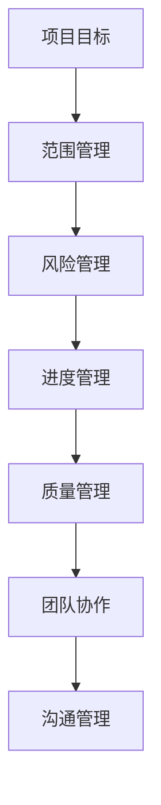

                 

# 技术项目管理的关键要素

关键词：技术项目管理、项目管理、关键要素、项目管理工具、项目计划、风险控制

摘要：
本文将探讨技术项目管理的核心要素，包括背景介绍、关键概念与联系、核心算法原理讲解、数学模型与公式、项目实战以及最佳实践 tips 等。通过详细的讲解和案例分析，帮助读者理解技术项目管理的重要性以及如何有效地实施和管理技术项目。

## 背景介绍

在当今快速发展的技术领域，项目管理已经成为成功交付项目的关键。技术项目管理不仅仅涉及技术实现，还包括项目规划、团队协作、进度控制、质量保证等多个方面。技术项目管理的关键要素决定了项目的成败，对于企业的长期发展具有至关重要的影响。

随着技术的不断进步，项目复杂性也在不断增加。技术项目往往涉及多个技术领域和跨学科的知识，需要协调不同的团队和利益相关者。因此，掌握技术项目管理的核心要素，能够帮助项目经理更好地应对挑战，确保项目按时、按质、按预算完成。

本文将从以下几个方面探讨技术项目管理的核心要素：

1. **关键概念与联系**：介绍技术项目管理中的核心概念，并使用 Mermaid 流程图展示它们之间的关系。
2. **核心算法原理讲解**：针对技术项目管理中的关键问题，使用伪代码详细阐述核心算法原理。
3. **数学模型与公式**：介绍技术项目管理中使用的数学模型和公式，并提供详细讲解和举例说明。
4. **项目实战**：通过实际案例展示如何搭建开发环境、实现源代码并进行分析。
5. **最佳实践 tips**：总结技术项目管理的最佳实践，包括注意事项和拓展阅读。

## 关键概念与联系

技术项目管理涉及到多个关键概念，这些概念相互关联，共同构成了项目的管理体系。以下是技术项目管理中的几个核心概念：

1. **项目目标**：明确项目要实现的具体目标，包括功能需求、性能指标等。
2. **范围管理**：确定项目的范围，确保项目团队和利益相关者对项目范围的共同理解。
3. **风险管理**：识别、评估和应对项目风险，确保项目顺利进行。
4. **进度管理**：制定项目计划，监控项目进度，确保项目按时完成。
5. **质量管理**：确保项目交付的产品符合质量标准，满足用户需求。
6. **团队协作**：协调项目团队成员的工作，提高团队效率。
7. **沟通管理**：确保项目信息在团队和利益相关者之间有效传递。

### 关键概念关系架构

下面是技术项目管理中关键概念之间的 Mermaid 流程图：



## 核心算法原理讲解

在技术项目管理中，有许多核心算法原理用于解决具体问题。以下是一个例子：如何使用伪代码来描述项目进度管理中的关键路径算法。

### 关键路径算法

**伪代码：**

```
Algorithm CriticalPathAlgorithm(tasks, dependencies):
    for each task in tasks:
        task.duration = 0
    for each dependency in dependencies:
        task.duration = max(task.duration, predecessor.duration)
    return the path with the maximum duration
```

### 解释说明

- `tasks` 是一个任务列表，每个任务有一个 `duration` 属性。
- `dependencies` 是一个依赖关系列表，描述了任务之间的先后关系。
- 算法的核心是计算每个任务的持续时间，然后找出最长的一条路径，即关键路径。

### 应用举例

假设有一个项目，包含以下任务和依赖关系：

```
Task A: 3 days
Task B: 5 days
Task C: 2 days
Task D: 4 days

Dependencies:
A -> B
B -> C
C -> D
```

使用关键路径算法，我们可以计算出关键路径：

1. 计算每个任务的持续时间：
   - A: 3 days
   - B: max(0, 3) = 3 days
   - C: max(3, 0) = 3 days
   - D: max(3, 4) = 4 days
2. 找出最长的一条路径：A -> B -> C -> D，总持续时间是 4 + 3 + 2 = 9 days。

这样，项目经理就可以根据关键路径来优化资源分配和进度计划，确保项目按时完成。

## 数学模型与公式

在技术项目管理中，数学模型和公式经常用于量化和管理项目。以下是一个例子：如何使用拉丁超立方采样（LHS）来评估项目风险。

### 拉丁超立方采样（LHS）

**公式：**

$$
X_{i,j} = \sqrt{6} \left( \frac{U_{i,j} - 0.5}{0.5} \right) \left( 1 - 2 \left( \frac{U_{i,j}}{0.5} \right)^2 \right)
$$

其中，$X_{i,j}$ 是第 $i$ 个因素在第 $j$ 次采样时的值，$U_{i,j}$ 是均匀分布的随机数。

### 解释说明

- 拉丁超立方采样（LHS）是一种有效的采样方法，用于生成多变量分布的样本点。
- 公式用于将均匀分布的随机数转换为拉丁超立方采样点。

### 应用举例

假设有一个项目，包含三个因素：时间（$X_1$）、成本（$X_2$）和质量（$X_3$）。使用 LHS 生成 10 个样本点：

1. 生成 10 个均匀分布的随机数 $U_{i,j}$，$i = 1, 2, 3$，$j = 1, 2, ..., 10$。
2. 应用公式计算 $X_{i,j}$ 的值。

这样，项目经理就可以使用这些样本点来评估项目的风险，并制定相应的应对策略。

## 项目实战

以下是一个实际案例，展示如何搭建一个技术项目，包括开发环境搭建、源代码实现和解读。

### 案例背景

假设我们需要开发一个简单的 web 应用程序，用于用户注册和登录。该项目涉及前端、后端和数据库开发。

### 开发环境搭建

1. **前端**：
   - 使用 HTML、CSS 和 JavaScript。
   - 配置一个简单的本地开发环境，使用浏览器进行调试。

2. **后端**：
   - 使用 Node.js 和 Express 框架。
   - 安装 Node.js，创建一个简单的 Express 项目。

3. **数据库**：
   - 使用 MongoDB 数据库。
   - 安装 MongoDB，创建数据库和集合。

### 源代码实现

以下是前端部分的简单代码示例：

```html
<!DOCTYPE html>
<html>
<head>
    <title>User Registration</title>
</head>
<body>
    <h1>User Registration</h1>
    <form action="/register" method="post">
        <label for="username">Username:</label>
        <input type="text" id="username" name="username" required>
        <br>
        <label for="password">Password:</label>
        <input type="password" id="password" name="password" required>
        <br>
        <input type="submit" value="Register">
    </form>
</body>
</html>
```

后端部分使用 Express 框架处理用户注册请求：

```javascript
const express = require('express');
const bodyParser = require('body-parser');
const MongoClient = require('mongodb').MongoClient;

const app = express();
app.use(bodyParser.urlencoded({ extended: true }));

const url = 'mongodb://localhost:27017';
const dbName = 'user_db';

app.post('/register', async (req, res) => {
    const { username, password } = req.body;
    const client = await MongoClient.connect(url, { useUnifiedTopology: true });
    const db = client.db(dbName);
    const users = db.collection('users');

    try {
        const result = await users.insertOne({ username, password });
        res.send('User registered successfully');
    } catch (error) {
        res.status(500).send('Error registering user');
    }

    client.close();
});

app.listen(3000, () => {
    console.log('Server running on port 3000');
});
```

### 代码解读

- 前端代码定义了一个简单的 HTML 表单，用于用户输入用户名和密码。
- 后端代码使用 Express 框架处理 HTTP 请求，并与 MongoDB 数据库交互，将用户数据存储到数据库中。

### 项目小结

通过以上实战案例，我们可以看到如何搭建一个简单的技术项目，从开发环境搭建到源代码实现，再到最终的部署。这个过程展示了技术项目管理的实际操作，包括需求分析、环境搭建、代码编写和测试。

## 最佳实践 tips

在技术项目管理中，以下是一些最佳实践 tips：

1. **明确项目目标**：在项目启动阶段，确保项目目标和范围明确，避免后期出现需求变更。
2. **使用项目管理工具**：选择合适的项目管理工具，如 Jira、Trello 等，以提高团队协作和进度监控效率。
3. **定期评审**：定期进行项目评审，确保项目按计划进行，及时发现和解决问题。
4. **风险管理**：定期进行风险识别和评估，制定应对策略，降低项目风险。
5. **沟通与协作**：确保项目团队成员之间保持有效沟通，避免信息孤岛。
6. **质量保证**：进行充分的测试和审查，确保项目交付的产品质量。

## 总结

技术项目管理是确保项目成功的关键，掌握关键要素和管理方法对于项目经理和企业都非常重要。本文通过背景介绍、核心概念与联系、核心算法原理讲解、数学模型与公式、项目实战以及最佳实践 tips，帮助读者理解技术项目管理的核心要素和实践方法。通过不断学习和实践，项目经理可以更好地应对技术项目的挑战，确保项目的成功交付。作者：AI天才研究院/AI Genius Institute & 禅与计算机程序设计艺术 /Zen And The Art of Computer Programming。

