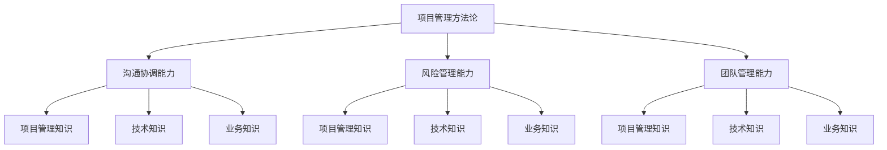
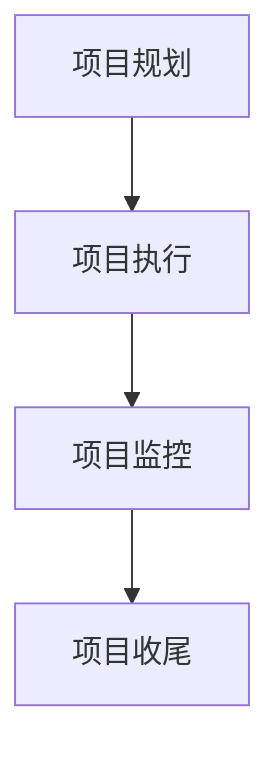
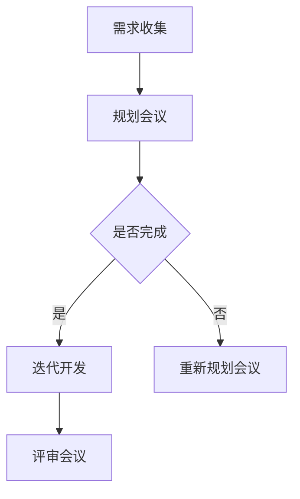
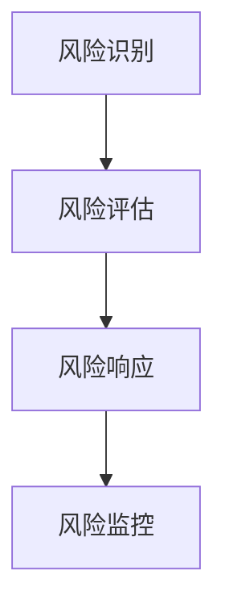
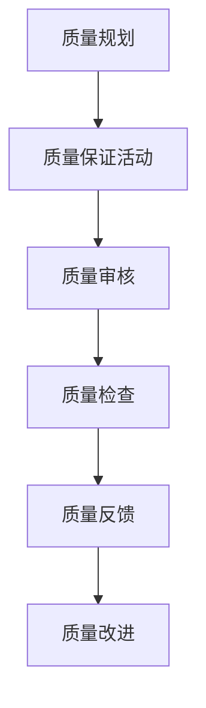
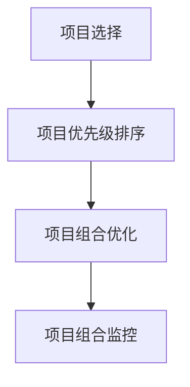

                 

### 文章标题

《技术项目管理的核心技能》

> 关键词：技术项目管理，敏捷管理，风险管理，质量保证，项目组合管理，实战案例

> 摘要：本文将深入探讨技术项目管理的核心技能，包括项目管理方法与工具、敏捷项目管理、风险管理、质量保证与质量控制、项目组合管理等方面的内容。通过详细的案例分析，读者将能够掌握这些核心技能，并在实际项目中运用，从而提高项目管理的效果和效率。

### 第一部分：核心概念与联系

### 第1章：技术项目管理的核心技能

#### 1.1 技术项目管理的基本概念

技术项目管理是指运用项目管理的理论、方法和工具，对技术开发项目进行规划、组织、协调和控制，以确保项目在预定的时间、成本和质量要求内顺利完成的过程。技术项目管理涵盖了项目管理的各个方面，包括范围管理、时间管理、成本管理、质量管理、沟通管理、风险管理等。

#### 1.2 技术项目管理与业务目标的关系

技术项目管理与业务目标之间存在着密切的关系。技术项目管理的目标是为了实现业务目标，而业务目标则是技术项目管理的出发点和归宿。技术项目管理需要紧密围绕业务目标展开，确保项目能够满足业务需求，并产生预期的业务价值。

#### 1.3 技术项目管理中的关键角色与职责

技术项目管理中涉及到的关键角色包括项目经理、开发团队、产品经理、质量保证团队等。项目经理负责项目的整体管理和协调，开发团队负责具体的技术实现，产品经理负责产品规划和需求管理，质量保证团队负责项目质量控制和测试。

#### 1.4 技术项目管理中的核心技能和知识领域

技术项目管理中的核心技能包括项目管理方法论、沟通协调能力、风险管理能力、团队管理能力等。知识领域包括项目管理知识、技术知识、业务知识等。这些技能和知识是技术项目管理人员必须掌握的，以便能够有效地进行项目管理和决策。

##### 1.4.1 梅尔迪流程图：技术项目管理的核心架构



### 第二部分：核心算法原理讲解

### 第2章：项目管理方法与工具

#### 2.1 传统项目管理方法

传统项目管理方法主要基于瀑布模型，强调阶段性工作和文档化。其核心流程包括项目规划、项目执行、项目监控和项目收尾。传统项目管理方法的优点是结构清晰，流程规范，但缺点是灵活性较差，难以适应快速变化的需求。

##### 2.1.1 梅尔迪流程图：传统项目管理流程



#### 2.2 敏捷项目管理

敏捷项目管理是一种以人为核心，以迭代、增量为特征的项目管理方法。敏捷项目管理的核心理念是快速响应变化，持续交付高质量的产品。敏捷项目管理的核心流程包括需求收集、规划会议、迭代开发、评审会议等。

##### 2.2.1 伪代码：敏捷项目管理的核心算法

```python
# 敏捷项目管理核心算法

def agile_management():
    # 需求收集
    requirements = collect_requirements()
    # 规划会议
    plan = planning_meeting(requirements)
    # 迭代开发
    for iteration in range(1, num_iterations+1):
        develop_iteration(iteration, plan)
    # 评审会议
    review_meeting()
```

##### 2.2.2 梅尔迪流程图：敏捷项目管理流程



#### 2.3 风险管理

风险管理是技术项目管理中至关重要的一环。风险管理的核心流程包括风险识别、风险评估、风险响应和风险监控。

##### 2.3.1 伪代码：风险识别与评估算法

```python
# 风险识别与评估算法

def risk_management():
    # 风险识别
    risks = identify_risks()
    # 风险评估
    for risk in risks:
        assess_risk(risk)
    # 风险响应
    respond_risks(risks)
    # 风险监控
    monitor_risks(risks)
```

##### 2.3.2 梅尔迪流程图：风险管理流程



#### 2.4 质量保证与质量控制

质量保证与质量控制是确保项目交付质量的重要手段。质量保证的核心流程包括质量规划、质量保证活动和质量审核。质量控制的核心流程包括质量检查、质量反馈和质量改进。

##### 2.4.1 伪代码：质量保证与质量控制算法

```python
# 质量保证与质量控制算法

def quality_management():
    # 质量规划
    quality_plan = quality_planning()
    # 质量保证活动
    quality_assurance(quality_plan)
    # 质量审核
    quality_audit(quality_plan)
    # 质量检查
    quality_check()
    # 质量反馈
    quality_feedback()
    # 质量改进
    quality_improvement()
```

##### 2.4.2 梅尔迪流程图：质量保证与质量控制流程



#### 2.5 项目组合管理

项目组合管理是一种以全局视角对项目进行管理的策略。项目组合管理的核心流程包括项目选择、项目优先级排序、项目组合优化和项目组合监控。

##### 2.5.1 伪代码：项目组合优化算法

```python
# 项目组合优化算法

def project_portfolio_management():
    # 项目选择
    projects = select_projects()
    # 项目优先级排序
    prioritize_projects(projects)
    # 项目组合优化
    optimize_portfolio(projects)
    # 项目组合监控
    monitor_portfolio(projects)
```

##### 2.5.2 梅尔迪流程图：项目组合管理流程



### 第三部分：项目实战

### 第3章：敏捷项目管理实战

#### 3.1 项目启动与规划

项目启动与规划是敏捷项目管理的重要阶段。在这个阶段，需要明确项目目标、范围、资源需求和时间计划。

##### 3.1.1 实战案例：项目启动与规划

在一个软件开发项目中，项目启动与规划的过程如下：

1. 项目团队开会讨论项目目标、需求和资源。
2. 编写项目章程，明确项目目标和范围。
3. 制定项目计划，包括时间、资源和里程碑。
4. 进行项目风险评估，识别潜在风险并制定应对策略。

##### 3.1.2 源代码实现与解读

```python
# 项目启动与规划源代码实现

def project_start_and_plan():
    # 项目团队开会讨论
    discuss_project_goals_and_requirements()
    # 编写项目章程
    project_chapter = create_project_chapter()
    # 制定项目计划
    project_plan = create_project_plan()
    # 项目风险评估
    risk_analysis(project_plan)
    # 风险应对策略
    risk_respond(project_plan)
```

#### 3.2 迭代开发与交付

迭代开发与交付是敏捷项目管理的核心阶段。在这个阶段，项目团队按照预定的迭代周期进行开发，并在每个迭代结束时进行交付。

##### 3.2.1 实战案例：迭代开发与交付

在一个软件开发项目中，迭代开发与交付的过程如下：

1. 进行需求分析，确定本次迭代的需求。
2. 进行迭代规划，确定本次迭代的工作内容。
3. 进行开发，完成本次迭代的需求。
4. 进行测试，确保本次迭代的需求符合质量要求。
5. 进行交付，将本次迭代的工作成果交付给客户。

##### 3.2.2 源代码实现与解读

```python
# 迭代开发与交付源代码实现

def iteration_development_and_delivery():
    # 需求分析
    requirements_analysis()
    # 迭代规划
    iteration_plan = create_iteration_plan()
    # 开发
    development(iteration_plan)
    # 测试
    testing(iteration_plan)
    # 交付
    delivery(iteration_plan)
```

#### 3.3 项目回顾与总结

项目回顾与总结是敏捷项目管理的最后阶段。在这个阶段，项目团队对项目过程进行回顾和总结，以便吸取经验教训，提高项目管理水平。

##### 3.3.1 实战案例：项目回顾与总结

在一个软件开发项目中，项目回顾与总结的过程如下：

1. 进行项目回顾会议，讨论项目过程中的优点和不足。
2. 编写项目总结报告，记录项目过程中的关键事件和经验教训。
3. 分析项目数据，评估项目质量和效率。
4. 制定改进计划，为下一项目做好准备。

##### 3.3.2 源代码实现与解读

```python
# 项目回顾与总结源代码实现

def project_review_and_summary():
    # 项目回顾会议
    review_meeting()
    # 项目总结报告
    summary_report = create_summary_report()
    # 项目数据分析
    data_analysis(summary_report)
    # 改进计划
    improvement_plan = create_improvement_plan()
```

### 第4章：风险管理实战

#### 4.1 风险识别与评估

风险识别与评估是风险管理的重要环节。在这个环节中，需要识别项目中的潜在风险，并对风险进行评估。

##### 4.1.1 实战案例：风险识别与评估

在一个软件开发项目中，风险识别与评估的过程如下：

1. 通过头脑风暴、专家访谈、文档审查等方法识别潜在风险。
2. 对识别出的风险进行定性评估，确定风险的概率和影响。
3. 对高风险进行定量评估，计算风险值。

##### 4.1.2 源代码实现与解读

```python
# 风险识别与评估源代码实现

def risk_identification_and_evaluation():
    # 风险识别
    risks = identify_risks()
    # 定性评估
    qualitative_evaluation(risks)
    # 定量评估
    quantitative_evaluation(risks)
```

#### 4.2 风险响应与监控

风险响应与监控是风险管理的关键环节。在这个环节中，需要制定风险响应计划，并对风险进行持续监控。

##### 4.2.1 实战案例：风险响应与监控

在一个软件开发项目中，风险响应与监控的过程如下：

1. 根据风险评估结果，制定风险应对措施。
2. 对高风险进行监控，确保应对措施得到有效执行。
3. 对低风险进行监控，确保风险在可控范围内。

##### 4.2.2 源代码实现与解读

```python
# 风险响应与监控源代码实现

def risk_response_and_monitor():
    # 风险响应计划
    response_plan = create_response_plan()
    # 高风险监控
    high_risk_monitor(response_plan)
    # 低风险监控
    low_risk_monitor(response_plan)
```

### 第5章：质量保证与质量控制实战

#### 5.1 质量管理规划

质量管理规划是质量保证与质量控制的重要环节。在这个环节中，需要制定质量管理计划，明确质量目标和标准。

##### 5.1.1 实战案例：质量保证规划

在一个软件开发项目中，质量管理规划的过程如下：

1. 确定项目质量目标，如可靠性、安全性、性能等。
2. 制定质量标准，如代码规范、测试标准等。
3. 规划质量保证活动，如代码审查、测试、评审等。

##### 5.1.2 源代码实现与解读

```python
# 质量管理规划源代码实现

def quality_management_plan():
    # 确定质量目标
    quality_goals = define_quality_goals()
    # 制定质量标准
    quality_standards = define_quality_standards()
    # 规划质量保证活动
    quality_activities = plan_quality_activities()
```

#### 5.2 质量控制与改进

质量控制与改进是确保项目质量的关键环节。在这个环节中，需要对项目进行质量检查、质量反馈和质量改进。

##### 5.2.1 实战案例：质量控制与改进

在一个软件开发项目中，质量控制与改进的过程如下：

1. 进行代码审查，检查代码质量。
2. 进行单元测试、集成测试等，确保软件功能正确。
3. 收集质量反馈，分析质量问题的根本原因。
4. 制定改进计划，对质量问题和缺陷进行改进。

##### 5.2.2 源代码实现与解读

```python
# 质量控制与改进源代码实现

def quality_control_and_improvement():
    # 代码审查
    code_review()
    # 测试
    testing()
    # 质量反馈
    quality_feedback()
    # 改进计划
    improvement_plan = create_improvement_plan()
```

### 第6章：项目组合管理实战

#### 6.1 项目组合优化

项目组合优化是项目组合管理的重要环节。在这个环节中，需要根据项目优先级和资源分配原则，对项目进行优化。

##### 6.1.1 实战案例：项目组合优化

在一个企业中，项目组合优化的过程如下：

1. 确定项目优先级，根据业务需求和资源情况，对项目进行排序。
2. 根据项目优先级和资源分配原则，对项目进行优化，确保资源得到充分利用。
3. 制定项目组合优化报告，为项目决策提供依据。

##### 6.1.2 源代码实现与解读

```python
# 项目组合优化源代码实现

def project_portfolio_optimization():
    # 确定项目优先级
    project_priorities = define_project_priorities()
    # 项目优化
    optimize_projects(project_priorities)
    # 项目组合优化报告
    portfolio_report = create_portfolio_report()
```

#### 6.2 项目组合监控与调整

项目组合监控与调整是项目组合管理的重要环节。在这个环节中，需要根据项目进展情况和资源变化，对项目组合进行监控和调整。

##### 6.2.1 实战案例：项目组合监控与调整

在一个企业中，项目组合监控与调整的过程如下：

1. 定期收集项目进展数据，分析项目组合的整体绩效。
2. 根据项目进展情况和资源变化，对项目组合进行监控。
3. 根据监控结果，对项目组合进行调整，确保项目组合的优化。

##### 6.2.2 源代码实现与解读

```python
# 项目组合监控与调整源代码实现

def project_portfolio_monitor_and_adjust():
    # 项目进展数据收集
    project_data = collect_project_data()
    # 项目组合监控
    monitor_portfolio(project_data)
    # 项目组合调整
    adjust_portfolio(project_data)
```

### 第7章：技术项目管理案例分析

#### 7.1 案例分析背景

案例分析背景部分将介绍一个实际技术项目管理案例的背景信息，包括项目目标、项目范围、项目团队、项目周期等。

##### 7.1.1 案例背景介绍

某大型企业计划开发一套企业资源规划（ERP）系统，以提高企业的管理效率和业务流程的自动化水平。项目目标是在12个月内完成系统的设计、开发和部署，确保系统能够满足企业的业务需求，并具有较高的性能和稳定性。项目团队由项目经理、开发团队、产品经理和质量保证团队组成，项目周期为12个月。

#### 7.2 案例实施过程

案例实施过程部分将详细描述项目从启动到收尾的各个阶段，包括项目规划、项目执行、项目监控和项目收尾等。

##### 7.2.1 案例实施步骤

1. 项目启动会议：项目团队召开启动会议，明确项目目标、范围和里程碑。
2. 项目规划：制定详细的项目计划，包括时间、成本、资源分配等。
3. 项目执行：按照项目计划进行系统设计和开发，定期进行迭代交付。
4. 项目监控：对项目进度、成本、质量进行持续监控，确保项目按计划进行。
5. 项目评审会议：在项目里程碑完成后，召开评审会议，评估项目成果，提出改进建议。
6. 项目收尾：完成系统部署，进行最终验收，编写项目总结报告。

##### 7.2.2 案例源代码实现与解读

```python
# 案例实施过程源代码实现

def case_implementation():
    # 项目启动会议
    start_project_meeting()
    # 项目规划
    project_plan = create_project_plan()
    # 项目执行
    execute_project(project_plan)
    # 项目监控
    monitor_project(project_plan)
    # 项目评审会议
    review_project_meeting()
    # 项目收尾
    finish_project()
```

#### 7.3 案例总结与反思

案例总结与反思部分将总结项目实施过程中的经验教训，提出改进建议，为后续项目提供参考。

##### 7.3.1 案例经验总结

1. 项目启动阶段要明确项目目标和范围，制定详细的项目计划。
2. 项目执行阶段要确保项目进度、成本、质量按计划进行，定期进行项目监控和评审。
3. 项目团队要密切合作，确保项目团队成员之间的沟通畅通。
4. 风险管理要贯穿整个项目周期，及时发现和应对潜在风险。
5. 项目总结阶段要全面总结项目实施过程中的经验教训，为后续项目提供参考。

##### 7.3.2 案例反思与建议

1. 加强项目团队建设，提高团队协作效率。
2. 优化项目管理流程，提高项目管理效率。
3. 加强项目风险管理，降低项目风险。
4. 提高项目质量，确保项目交付符合预期。
5. 定期进行项目回顾和总结，持续改进项目管理水平。

### 总结

技术项目管理是确保技术开发项目顺利完成的重要手段。本文详细介绍了技术项目管理的核心技能，包括项目管理方法与工具、敏捷项目管理、风险管理、质量保证与质量控制、项目组合管理等方面的内容。通过实际的案例分析，读者能够深入了解这些核心技能的应用，并在实际项目中运用，从而提高项目管理的效率和效果。

### 作者信息

作者：AI天才研究院/AI Genius Institute & 禅与计算机程序设计艺术 /Zen And The Art of Computer Programming

### 最佳实践 tips

1. 在项目管理中，要注重项目团队的建设，提高团队协作效率。
2. 定期进行项目回顾和总结，持续改进项目管理水平。
3. 加强项目风险管理，降低项目风险。
4. 确保项目交付符合质量要求，提高客户满意度。
5. 结合项目特点和需求，选择合适的项目管理方法和工具。

### 小结

技术项目管理是确保技术开发项目顺利完成的重要手段。通过本文的介绍，读者应该能够掌握技术项目管理的核心技能，并在实际项目中运用，从而提高项目管理的效果和效率。希望本文对您在技术项目管理领域的学习和实践有所帮助。如果您有任何疑问或建议，欢迎在评论区留言讨论。谢谢！

### 注意事项

1. 在项目管理中，要注重项目目标和范围的明确，避免项目范围蔓延。
2. 在项目执行过程中，要确保项目进度、成本、质量按计划进行，及时调整项目计划。
3. 风险管理要贯穿整个项目周期，及时发现和应对潜在风险。
4. 项目团队要密切合作，确保项目团队成员之间的沟通畅通。
5. 质量保证与质量控制是确保项目交付质量的关键，要严格遵循质量标准和流程。

### 拓展阅读

1. 《敏捷项目管理实践指南》
2. 《项目管理知识体系指南》
3. 《风险管理：原则与实务》
4. 《项目组合管理：理论与实践》
5. 《项目管理中的团队建设与沟通技巧》

### 结语

技术项目管理是确保技术开发项目顺利完成的重要手段。本文通过详细介绍技术项目管理的核心技能，包括项目管理方法与工具、敏捷项目管理、风险管理、质量保证与质量控制、项目组合管理等方面的内容，旨在帮助读者掌握这些核心技能，并在实际项目中运用，从而提高项目管理的效果和效率。希望本文对您在技术项目管理领域的学习和实践有所帮助。在技术项目管理的过程中，不断总结经验教训，持续改进项目管理水平，是成功的关键。祝您在技术项目管理领域取得优异的成绩！作者：AI天才研究院/AI Genius Institute & 禅与计算机程序设计艺术 /Zen And The Art of Computer Programming。再次感谢您的阅读和支持！


