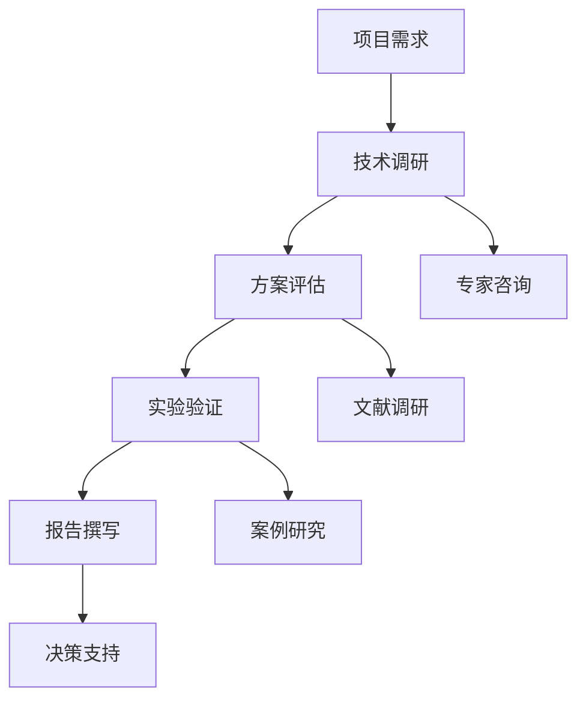

                 

# 技术预研：为未来项目铺平道路

## 关键词
技术预研、未来项目、需求分析、前沿技术、可行性分析、项目管理、工具与平台、实验设计、报告撰写、案例分析。

## 摘要
本文旨在探讨技术预研在为未来项目铺平道路中的重要性。我们将从技术预研的概述、未来项目需求分析、技术趋势与前沿技术探索、技术可行性分析、技术预研案例研究、技术预研项目管理、技术预研工具与平台、技术预研实验设计、技术预研报告撰写以及技术预研案例分析等方面，详细阐述技术预研的流程和实践方法，为开发者提供全面的指导。

## 目录

1. **技术预研概述**
   1.1 技术预研的定义与重要性
   1.2 技术预研的分类与方法
   1.3 技术预研的流程与步骤

2. **未来项目需求分析**
   2.1 项目需求的挖掘与梳理
   2.2 需求分析的方法与技术
   2.3 需求分析与项目目标的关联

3. **技术趋势与前沿技术探索**
   3.1 当前技术趋势分析
   3.2 前沿技术的选择与评估
   3.3 技术储备与前瞻性研究

4. **技术可行性分析**
   4.1 技术风险评估
   4.2 成本效益分析
   4.3 技术实现的可行性研究

5. **技术预研案例研究**
   5.1 技术预研的实际案例分享
   5.2 案例中的成功经验与教训
   5.3 案例对未来的启示

6. **技术预研实践**

   6.1 技术预研项目管理
   6.2 技术预研工具与平台
   6.3 技术预研实验设计
   6.4 技术预研报告撰写
   6.5 技术预研案例分析

## 1. 技术预研概述

### 1.1 技术预研的定义与重要性

技术预研是指在项目启动之前，对项目所需的技术进行全面的调研、分析和评估的过程。它是项目成功的关键环节，旨在确保项目在技术上的可行性和创新性，为项目的顺利推进提供坚实的基础。

技术预研的重要性体现在以下几个方面：

- **降低风险**：通过提前对技术进行调研和评估，可以识别和解决潜在的技术问题，降低项目实施过程中出现意外的风险。

- **提高效率**：技术预研可以帮助团队提前了解所需的技术栈和工具，提前进行相关技能培训，从而提高项目开发的效率。

- **确保创新**：技术预研鼓励团队探索和尝试新的技术，推动项目的创新性，提高项目在市场上的竞争力。

- **指导决策**：技术预研的结果可以为项目决策提供有力的支持，帮助项目团队在技术选择、资源分配等方面做出明智的决策。

### 1.2 技术预研的分类与方法

技术预研可以根据不同的需求和技术特点，分为以下几类：

- **需求型技术预研**：这类预研主要针对项目需求中的技术难点和挑战，通过技术调研和评估，找到合适的解决方案。

- **创新型技术预研**：这类预研主要关注前沿技术的应用和创新，旨在探索新的技术方向和解决方案。

- **改进型技术预研**：这类预研主要针对现有技术的改进和优化，通过技术调研和评估，找到更高效、更可靠的技术方案。

技术预研的方法包括：

- **文献调研**：通过查阅相关文献和资料，了解当前技术的现状和发展趋势。

- **专家咨询**：邀请行业专家和技术顾问，对技术方案进行评估和指导。

- **实验验证**：通过实验和测试，验证技术方案的可行性和效果。

- **案例研究**：分析成功案例和失败案例，从中总结经验教训。

### 1.3 技术预研的流程与步骤

技术预研的流程通常包括以下几个步骤：

- **需求分析**：明确项目的技术需求，确定技术预研的目标和范围。

- **技术调研**：对目标技术进行深入的调研和分析，了解其原理、应用场景和发展趋势。

- **方案评估**：根据技术调研的结果，评估不同技术方案的优缺点，选择最佳方案。

- **实验验证**：通过实验和测试，验证技术方案的可行性和效果。

- **报告撰写**：将技术预研的过程和结果进行总结，形成技术预研报告。

- **决策支持**：将技术预研的结果提交给项目团队，为项目决策提供支持。

### 1.4 技术预研的核心概念与联系

在技术预研中，几个核心概念需要明确，它们之间的关系可以用以下Mermaid流程图表示：



### 1.5 伪代码示例

以下是一个关于技术预研流程的伪代码示例：

```
function 技术预研流程() {
    开始时间 = 获取当前时间()
    项目需求 = 获取项目需求()
    技术调研 = 进行技术调研()
    方案评估 = 评估技术方案()
    实验验证 = 进行实验验证()
    报告撰写 = 撰写技术预研报告()
    决策支持 = 提供决策支持()
    结束时间 = 获取当前时间()
    预研耗时 = 计算预研耗时()
    输出技术预研结果()
}
```

### 1.6 数学模型和公式

在技术预研中，常常需要使用数学模型和公式来分析和评估技术方案。以下是一些常用的数学模型和公式：

$$
成本效益比 = \frac{项目效益}{项目成本}
$$

$$
风险评估 = 风险概率 \times 风险影响
$$

$$
技术成熟度 = \frac{技术水平}{技术需求}
$$

### 1.7 实战案例

以下是一个技术预研的实战案例：

**项目背景**：某公司计划开发一款智能客服系统，以提升客户服务体验。

**技术需求**：需要一款能够自然语言处理、语义理解、多渠道通信的智能客服系统。

**技术调研**：通过对市场上现有的智能客服系统进行调研，发现主要的技术方案包括基于规则的方法、机器学习方法和深度学习方法。

**方案评估**：评估了三种方案的优缺点，发现深度学习方法在处理复杂问题和多语言支持方面具有优势，因此选择深度学习方法作为技术方案。

**实验验证**：搭建实验环境，使用大量数据进行训练和测试，验证深度学习模型的性能。

**报告撰写**：撰写了技术预研报告，详细介绍了技术调研、方案评估、实验验证的结果。

**决策支持**：基于技术预研的结果，项目团队决定采用深度学习方法开发智能客服系统。

**项目小结**：通过技术预研，项目团队明确了技术方向，减少了项目风险，提高了项目效率。

## 2. 未来项目需求分析

### 2.1 项目需求的挖掘与梳理

未来项目的需求分析是技术预研的关键环节，其核心在于准确挖掘和梳理项目需求。以下是具体步骤：

- **需求收集**：通过用户访谈、问卷调查、用户反馈等方式，收集项目的潜在需求。

- **需求分类**：将收集到的需求进行分类，如功能需求、性能需求、安全需求等。

- **需求优先级排序**：根据项目的目标和资源限制，对需求进行优先级排序，明确哪些是必须实现的，哪些是可以延迟或放弃的。

- **需求确认**：与相关利益相关者（如项目经理、产品经理、用户等）进行沟通，确认需求的准确性和可行性。

### 2.2 需求分析的方法与技术

需求分析的方法和技术多种多样，以下是几种常用的方法：

- **用户故事**：用户故事是一种描述用户需求的方法，它强调用户的实际使用场景和需求。

- **用例图**：用例图是一种图形化的需求分析工具，用于描述系统与外部用户之间的交互关系。

- **功能需求规格说明书**：功能需求规格说明书是一种详细描述系统功能需求的文档。

- **场景分析**：场景分析通过描述用户在不同场景下的操作和行为，来深入了解用户需求。

### 2.3 需求分析与项目目标的关联

需求分析与项目目标的关联是确保项目顺利进行的重要步骤。以下是具体步骤：

- **明确项目目标**：明确项目的目标和预期成果，如产品的功能、性能、用户体验等。

- **需求与目标匹配**：分析需求是否符合项目目标，是否有助于实现项目目标。

- **调整需求**：如果某些需求与项目目标不匹配，需要对需求进行调整，以确保需求与目标的一致性。

- **制定需求管理计划**：根据项目目标和需求，制定详细的需求管理计划，包括需求的优先级、变更控制等。

### 2.4 需求分析的实践案例

以下是一个需求分析的实践案例：

**项目背景**：某电商平台计划推出一款智能购物助手，以提高用户购物体验。

**需求收集**：通过用户访谈和问卷调查，收集了用户在购物过程中遇到的问题和期望。

**需求分类**：将需求分为功能需求（如商品推荐、购物车管理、订单查询等）和非功能需求（如用户体验、响应速度、安全性等）。

**需求优先级排序**：根据用户反馈和市场调研数据，确定了功能需求的优先级，如商品推荐、购物车管理和订单查询是必须实现的。

**需求确认**：与产品经理和用户进行多次沟通，确认了需求的准确性和可行性。

**需求与目标匹配**：确保所有需求都与项目目标一致，如提高用户购物体验、增加用户粘性等。

**调整需求**：根据项目资源和时间限制，对某些非关键性需求进行调整，确保项目目标能够实现。

**需求管理计划**：制定了详细的需求管理计划，包括需求的优先级、变更控制流程等。

通过以上步骤，项目团队确保了需求分析与项目目标的关联，为项目的顺利进行奠定了基础。

## 3. 技术趋势与前沿技术探索

### 3.1 当前技术趋势分析

在信息技术高速发展的今天，技术趋势不断涌现，对各个行业产生了深远的影响。以下是对当前几个主要技术趋势的分析：

- **人工智能（AI）**：人工智能技术正在迅速发展，从传统的规则驱动系统转向数据驱动系统，深度学习、自然语言处理、计算机视觉等技术在各个领域得到了广泛应用。

- **区块链**：区块链技术以其去中心化、不可篡改的特性，在金融、供应链管理、数字身份认证等领域得到了关注和采用。

- **物联网（IoT）**：物联网技术的普及，使得万物互联成为可能，智能家居、智能城市、工业4.0等概念逐步实现。

- **云计算**：云计算技术提供了灵活、高效、可扩展的计算资源，为企业降低成本、提高效率提供了可能。

- **边缘计算**：边缘计算将数据处理和分析推向网络边缘，减少了延迟，提高了系统的响应速度。

- **5G通信**：5G通信技术的高速率、低延迟特性，将推动智能终端、智能汽车、虚拟现实等应用的发展。

### 3.2 前沿技术的选择与评估

在选择前沿技术时，需要综合考虑技术成熟度、市场需求、团队能力等多方面因素。以下是一种常见的评估方法：

- **技术成熟度评估**：采用技术成熟度模型（如技术成熟度指标，Technology Readiness Level, TRL）对技术进行评估。

- **市场需求分析**：通过市场调研、用户反馈等途径，分析市场需求和技术之间的匹配度。

- **团队能力评估**：评估团队在相关技术领域的经验和技能，确保团队具备实施技术的能力。

- **成本效益分析**：对技术的成本和潜在效益进行评估，确保技术选择的经济合理性。

### 3.3 技术储备与前瞻性研究

技术储备和前瞻性研究是确保项目在技术上的领先性和创新性的关键。以下是一些建议：

- **持续关注技术动态**：通过技术社区、学术期刊、行业报告等渠道，持续关注最新的技术动态。

- **技术预研项目**：设立专项技术预研项目，对前沿技术进行深入研究和实验验证。

- **人才培养与引进**：通过内部培训、外部引进等方式，提升团队在关键技术领域的专业能力。

- **合作与交流**：与高校、研究机构、行业领先企业等建立合作关系，进行技术交流和合作研究。

### 3.4 前沿技术的实际应用案例

以下是一些前沿技术的实际应用案例：

- **人工智能在医疗领域的应用**：利用人工智能进行疾病诊断、药物研发等，如谷歌的DeepMind在眼科疾病诊断上的成功案例。

- **区块链在供应链管理中的应用**：利用区块链技术的透明性和不可篡改性，实现供应链的可追溯性和效率提升，如沃尔玛与IBM合作的食品供应链管理项目。

- **物联网在智能家居中的应用**：通过物联网技术实现家居设备的互联互通，提升居住舒适度和安全性，如亚马逊的Alexa智能助手。

- **云计算在金融服务中的应用**：通过云计算技术实现金融服务的快速部署和弹性扩展，如谷歌云在金融科技领域的应用。

通过以上案例，可以看到前沿技术在实际应用中带来的巨大变革和潜力。

### 3.5 前沿技术的未来发展趋势

随着科技的不断进步，前沿技术将继续向更高效、更智能、更普及的方向发展。以下是一些未来发展趋势：

- **人工智能的普及与深化**：人工智能将在更多领域得到应用，如智能制造、智能交通、智能城市等。

- **区块链的生态系统构建**：区块链技术将与其他技术（如人工智能、物联网等）融合，形成更加完善的生态系统。

- **物联网的规模化应用**：物联网设备数量将持续增长，应用领域将扩展到更多行业，如智能农业、智慧医疗等。

- **云计算的智能化与个性化**：云计算服务将更加智能化，能够根据用户需求提供个性化的服务。

- **5G与边缘计算的融合**：5G与边缘计算的融合将推动实时数据处理和分析的发展，为更多实时应用提供支持。

### 3.6 总结

技术趋势与前沿技术的探索是技术预研的重要组成部分，它为未来项目提供了技术方向和决策依据。通过持续关注技术动态、进行技术储备和前瞻性研究，项目团队可以确保在技术上的领先性和创新性，为项目的成功奠定基础。

## 4. 技术可行性分析

### 4.1 技术风险评估

技术风险评估是技术可行性分析的重要环节，旨在评估项目在技术实现过程中可能面临的风险。以下是一种常见的技术风险评估方法：

- **风险识别**：通过文献调研、专家访谈、历史数据等途径，识别项目可能面临的技术风险。

- **风险分析**：对识别出的风险进行详细分析，包括风险的概率、影响程度、风险因素等。

- **风险分类**：根据风险的性质和影响程度，将风险分类，如技术实现风险、资源风险、市场风险等。

- **风险优先级排序**：根据风险的概率和影响程度，对风险进行优先级排序，明确需要优先关注和解决的风险。

### 4.2 成本效益分析

成本效益分析是评估技术方案经济合理性的重要手段。以下是一种常见的成本效益分析方法：

- **成本估算**：对技术方案的实施成本进行详细估算，包括人力成本、设备成本、维护成本等。

- **效益估算**：对技术方案带来的预期效益进行估算，包括经济效益、社会效益、环境效益等。

- **成本效益比计算**：通过计算成本效益比（Cost-Benefit Ratio, CBR），评估技术方案的经济合理性。成本效益比的计算公式为：

  $$
  CBR = \frac{总效益}{总成本}
  $$

  成本效益比越高，说明技术方案的经济效益越好。

### 4.3 技术实现的可行性研究

技术实现的可行性研究是确保技术方案在实际操作中可行的重要步骤。以下是一种常见的技术可行性研究方法：

- **技术调研**：对目标技术进行深入的调研和分析，了解其原理、应用场景、技术成熟度等。

- **技术评估**：评估技术方案的技术可行性，包括技术实现的难度、所需资源、技术风险等。

- **实验验证**：通过实验和测试，验证技术方案的可行性。实验验证可以包括实验室测试、模拟测试、实际应用测试等。

- **风险评估**：对技术实现的可行性进行风险评估，识别可能的技术风险，并提出相应的应对措施。

- **方案优化**：根据实验验证和风险评估的结果，对技术方案进行优化，以提高其可行性。

### 4.4 实际案例：技术可行性分析在智能交通系统中的应用

以下是一个智能交通系统的实际案例，展示了技术可行性分析的过程：

**项目背景**：某城市计划建设智能交通系统，以提高交通管理效率和减少拥堵。

**技术调研**：通过文献调研和专家访谈，了解智能交通系统的相关技术，如传感器技术、数据分析、人工智能等。

**技术评估**：评估智能交通系统在技术实现方面的可行性，包括传感器部署、数据采集和处理、交通流量预测等。

**实验验证**：在实验室环境中搭建仿真模型，模拟智能交通系统的运行，验证技术方案的可行性。

**风险评估**：识别项目在技术实现过程中可能面临的风险，如传感器失效、数据处理延迟等，并提出相应的应对措施。

**方案优化**：根据实验验证和风险评估的结果，对智能交通系统方案进行优化，如改进传感器部署策略、提高数据处理速度等。

通过以上步骤，项目团队确保了智能交通系统的技术可行性，为项目的顺利推进提供了保障。

### 4.5 技术可行性分析总结

技术可行性分析是确保项目在技术上的可行性和经济合理性的关键步骤。通过全面的风险评估、成本效益分析和实验验证，项目团队可以准确评估技术方案的可行性，为项目的决策提供科学依据。技术可行性分析的成功实施，将为项目的成功奠定坚实基础。

## 5. 技术预研案例研究

### 5.1 技术预研的实际案例分享

技术预研的实际案例研究是理解技术预研全过程的重要途径。以下是一个成功的技术预研案例分享：

**项目背景**：某金融科技公司计划开发一款基于区块链技术的智能合约平台，以提高金融交易的透明度和效率。

**需求分析**：通过与客户和行业专家的深入沟通，明确了平台需要支持多种金融交易合约、具有高安全性和高可扩展性。

**技术调研**：对区块链技术进行了全面调研，分析了不同区块链平台（如以太坊、Hyperledger Fabric等）的优缺点。

**方案评估**：评估了多种技术方案，最终选择了以太坊作为底层平台，因为它在智能合约开发和应用生态方面具有优势。

**实验验证**：搭建了实验环境，通过编写和测试智能合约，验证了平台在处理复杂金融交易合约方面的性能和安全性。

**报告撰写**：撰写了详细的技术预研报告，总结了技术调研、方案评估和实验验证的结果，为项目团队提供了明确的决策依据。

**决策支持**：基于技术预研的结果，项目团队决定采用以太坊平台进行智能合约平台开发，并制定了详细的开发计划。

**项目实施**：项目团队按照预定的计划，顺利完成了智能合约平台的设计、开发和部署，平台上线后得到了客户和市场的积极反馈。

**项目小结**：通过技术预研，项目团队在项目启动前解决了潜在的技术问题，减少了项目风险，提高了项目成功率。技术预研的成功经验为未来类似项目提供了宝贵的参考。

### 5.2 案例中的成功经验与教训

从上述案例中，我们可以总结出以下成功经验与教训：

**成功经验**：

1. **需求分析的重要性**：明确的需求分析是技术预研的基础，有助于确保技术方案的针对性和实用性。

2. **技术调研的深入性**：全面的技术调研是评估技术方案可行性的关键，能够为方案评估提供充分的数据支持。

3. **实验验证的必要性**：通过实验验证，可以直观地验证技术方案的可行性和性能，为项目决策提供有力依据。

4. **团队协作的紧密性**：技术预研是一个跨部门、跨职能的协同工作过程，团队协作的紧密性直接影响技术预研的效率和效果。

**教训**：

1. **风险识别和应对不足**：在技术预研过程中，对潜在风险识别和应对不足，可能导致项目在实施过程中遇到意外问题。

2. **技术方案评估不充分**：技术方案评估不充分，可能导致技术选择不当，影响项目的整体进度和质量。

3. **实验验证不足**：实验验证不足，可能导致技术方案在实际应用中出现问题，影响项目的成功。

### 5.3 案例对未来的启示

通过技术预研案例研究，我们可以得到以下对未来的启示：

1. **加强需求分析**：在项目启动前，应进行全面的需求分析，确保技术方案的针对性和实用性。

2. **持续技术调研**：技术预研不是一次性的过程，应持续关注技术动态，不断更新和优化技术方案。

3. **强化实验验证**：通过实验验证，确保技术方案的实际可行性和性能，减少项目实施中的不确定性。

4. **提升团队协作能力**：技术预研需要跨部门、跨职能的紧密协作，应加强团队协作能力的培养。

5. **建立技术预研流程**：建立标准化的技术预研流程，确保技术预研的规范性和效率。

### 5.4 案例分析的步骤与过程

技术预研案例分析的步骤与过程通常包括以下环节：

1. **案例选择**：选择具有代表性、涉及关键技术的实际案例。

2. **需求分析**：分析案例中的项目需求，明确技术预研的目标。

3. **技术调研**：调研案例中的关键技术，了解其原理、应用场景和优缺点。

4. **方案评估**：评估不同的技术方案，选择最合适的方案。

5. **实验验证**：通过实验和测试，验证技术方案的可行性和性能。

6. **报告撰写**：撰写技术预研报告，总结案例分析的过程和结果。

7. **决策支持**：提供技术预研结果，为项目决策提供支持。

### 5.5 案例分析对实际工作的指导意义

案例分析对实际工作具有重要的指导意义：

1. **技术决策**：通过案例分析，项目团队可以更清晰地了解不同技术方案的优缺点，为技术决策提供依据。

2. **风险控制**：通过案例中的风险识别和应对，项目团队可以提前识别潜在风险，并制定相应的应对策略。

3. **经验借鉴**：通过案例分析，项目团队可以借鉴成功案例中的经验，避免重复错误，提高项目成功率。

4. **流程优化**：通过案例分析，项目团队可以发现技术预研流程中的不足，优化流程，提高预研效率。

### 5.6 案例分析的方法与工具

进行技术预研案例分析时，可以采用以下方法和工具：

1. **文献分析法**：通过查阅相关文献，了解案例背景、技术方案、实验结果等。

2. **专家访谈法**：邀请行业专家和技术顾问，对案例进行深入分析和讨论。

3. **实验模拟法**：通过搭建模拟环境，对案例中的技术方案进行实验验证。

4. **数据分析法**：对案例中的数据进行分析，提取有价值的信息和规律。

5. **流程图法**：使用流程图展示技术预研的过程和各个环节，便于理解和分析。

6. **SWOT分析法**：对案例中的技术方案进行SWOT分析（优势、劣势、机会、威胁），评估其可行性。

### 5.7 总结

技术预研案例研究是理解技术预研全过程、吸取成功经验、规避风险的重要手段。通过案例分享、成功经验与教训总结、案例分析方法和工具的应用，项目团队可以更好地进行技术预研，为项目的成功奠定坚实基础。

## 6. 技术预研实践

### 6.1 技术预研项目管理

技术预研项目管理是确保技术预研顺利进行、达成预期目标的关键环节。以下是一种常见的技术预研项目管理框架和方法：

#### 项目管理框架

1. **项目启动**：明确项目目标、范围、时间表和资源需求，组建项目团队。

2. **需求管理**：进行需求分析，确保项目需求明确、具体、可量化。

3. **风险管理**：识别项目风险，制定风险管理计划，采取相应措施。

4. **资源管理**：合理分配项目资源，确保项目按计划推进。

5. **进度管理**：监控项目进度，确保项目按时完成。

6. **质量管理**：确保项目输出符合质量要求，进行质量控制。

7. **沟通管理**：建立有效的沟通机制，确保项目团队和利益相关者的信息畅通。

#### 项目管理方法

1. **敏捷项目管理**：采用敏捷开发方法，快速响应变化，灵活调整项目计划。

2. **迭代开发**：将项目分为多个迭代，每个迭代完成后进行评估和调整。

3. **看板管理**：使用看板（Kanban）方法，可视化项目进展，优化工作流程。

4. **任务分解**：将项目任务分解为可管理的子任务，明确任务负责人和完成时间。

5. **持续集成**：采用持续集成（CI）方法，确保代码质量，提高开发效率。

### 6.2 技术预研工具与平台

技术预研过程中，选择合适的工具和平台能够提高工作效率，确保预研的顺利进行。以下是一些常用的技术预研工具与平台：

#### 常用工具

1. **版本控制工具**：如Git，用于代码管理和协作开发。

2. **文档管理工具**：如Confluence，用于编写和管理文档。

3. **需求管理工具**：如JIRA，用于需求收集、管理和跟踪。

4. **测试管理工具**：如Selenium，用于自动化测试。

5. **数据分析工具**：如Python、R，用于数据处理和分析。

#### 常见平台

1. **云计算平台**：如AWS、Azure、Google Cloud，提供丰富的云计算服务和资源。

2. **区块链平台**：如Ethereum、Hyperledger Fabric，用于开发智能合约和分布式应用。

3. **大数据平台**：如Hadoop、Spark，用于处理大规模数据。

4. **容器化平台**：如Docker、Kubernetes，用于部署和管理容器化应用。

5. **人工智能平台**：如TensorFlow、PyTorch，用于机器学习和深度学习模型开发。

#### 技术预研环境配置与优化

技术预研环境配置是确保技术预研顺利开展的基础。以下是一些配置与优化的建议：

1. **硬件资源优化**：根据预研需求，配置合适的硬件资源，如CPU、内存、存储等。

2. **网络配置**：确保网络稳定，提供足够的带宽和传输速度。

3. **软件环境安装**：安装必要的开发工具和软件，如编译器、数据库、中间件等。

4. **容器化部署**：使用容器化技术（如Docker），简化环境配置，提高环境一致性。

5. **持续集成与部署**：采用持续集成与部署（CI/CD）流程，自动化构建、测试和部署。

### 6.3 技术预研实验设计

技术预研实验设计是验证技术方案可行性和效果的重要环节。以下是一种常见的实验设计方法和流程：

#### 实验设计方法

1. **确定实验目标**：明确实验的目标和预期结果。

2. **实验方案设计**：设计实验的具体方案，包括实验环境、实验步骤、实验数据等。

3. **实验数据收集**：通过实验收集数据，确保数据的有效性和可靠性。

4. **实验结果分析**：对实验结果进行统计分析，评估技术方案的可行性和效果。

5. **实验报告撰写**：撰写详细的实验报告，总结实验过程和结果，为项目决策提供支持。

#### 实验设计流程

1. **需求分析**：明确实验需求，确定实验的目标和范围。

2. **实验方案设计**：设计实验的具体方案，包括实验环境、实验步骤、实验数据等。

3. **实验资源准备**：准备实验所需的硬件、软件和其他资源。

4. **实验实施**：按照实验方案进行实验，确保实验过程记录完整。

5. **数据收集与分析**：收集实验数据，进行统计分析，评估实验结果。

6. **实验报告撰写**：撰写实验报告，总结实验过程和结果，为项目决策提供支持。

### 6.4 技术预研报告撰写

技术预研报告是技术预研成果的总结和呈现，对项目决策具有重要影响。以下是一种常见的技术预研报告撰写方法和结构：

#### 报告撰写方法

1. **明确报告目标**：明确报告的目标和受众，确保报告内容针对性。

2. **结构化报告内容**：按照逻辑顺序组织报告内容，确保报告结构清晰。

3. **详尽的数据分析**：提供详尽的数据分析，支持报告结论。

4. **可视化报告内容**：使用图表、流程图等可视化工具，提高报告的可读性。

5. **撰写风格简洁明了**：使用简洁明了的语言，避免冗余和复杂的表述。

#### 报告撰写结构

1. **封面**：报告标题、作者、日期等基本信息。

2. **摘要**：报告的核心内容和主要结论。

3. **目录**：报告各章节标题和页码。

4. **引言**：介绍报告背景、目的和范围。

5. **需求分析**：详细描述项目需求和技术需求。

6. **技术调研**：总结技术调研结果，分析不同技术方案的优缺点。

7. **方案评估**：评估技术方案的可行性，选择最佳方案。

8. **实验验证**：描述实验设计、实验步骤、实验结果和分析。

9. **决策支持**：提供技术预研结果，为项目决策提供支持。

10. **总结与建议**：总结报告成果，提出改进建议。

11. **参考文献**：列出报告引用的文献和资料。

### 6.5 技术预研案例分析

技术预研案例分析是通过实际案例来理解和应用技术预研方法的过程。以下是一种常见的技术预研案例分析方法和步骤：

#### 案例分析方法

1. **案例选择**：选择具有代表性的实际案例，涉及关键技术和技术预研。

2. **需求分析**：分析案例中的项目需求，明确技术预研的目标。

3. **技术调研**：调研案例中的关键技术，了解其原理和应用。

4. **方案评估**：评估不同技术方案的可行性，选择最佳方案。

5. **实验验证**：设计实验验证技术方案的可行性，收集和分析数据。

6. **案例分析**：总结案例中的成功经验与教训，提取有用的知识和经验。

7. **报告撰写**：撰写详细的技术预研报告，为项目决策提供支持。

#### 案例分析步骤

1. **案例选择**：选择具有代表性的实际案例，如智能交通系统、区块链金融平台等。

2. **需求分析**：分析案例中的项目需求，明确技术预研的目标，如高效交通管理、安全金融交易等。

3. **技术调研**：调研案例中的关键技术，如传感器技术、区块链、人工智能等。

4. **方案评估**：评估不同技术方案的可行性，选择最佳方案，如基于传感器和人工智能的交通管理系统。

5. **实验验证**：设计实验验证技术方案的可行性，如模拟交通场景，测试系统性能和准确性。

6. **案例分析**：总结案例中的成功经验与教训，如技术实现的难点、解决方案的优缺点等。

7. **报告撰写**：撰写详细的技术预研报告，为项目决策提供支持。

### 6.6 技术预研实践总结

通过技术预研实践，项目团队可以确保技术方案的可行性和创新性，降低项目风险，提高项目成功率。技术预研实践包括项目管理、工具与平台选择、实验设计、报告撰写和案例分析等多个环节，每个环节都需要精心设计和实施。通过成功案例的分享和总结，项目团队可以不断完善技术预研的方法和流程，为未来项目的顺利推进提供有力支持。

## 结论

技术预研作为未来项目成功的关键环节，具有重要的战略意义。通过本文的探讨，我们系统地阐述了技术预研的定义、重要性、流程和方法。从需求分析、技术趋势与前沿技术探索、技术可行性分析到技术预研实践，每个环节都需要我们进行深入思考和细致操作。技术预研不仅帮助我们识别和规避潜在风险，提高项目成功率，还能激发创新思维，推动技术进步。

### 最佳实践 Tips

1. **需求分析要全面**：确保项目需求明确、具体、可量化，减少后续变更和风险。

2. **技术调研要深入**：了解前沿技术，评估其适用性和可行性，避免盲目跟风。

3. **实验验证要细致**：通过实际数据验证技术方案，确保其性能和稳定性。

4. **团队协作要紧密**：技术预研涉及多个部门和职能，确保信息畅通，提高效率。

5. **持续改进**：技术预研不是一次性的过程，要持续关注技术动态，优化预研方法和流程。

### 注意事项

1. **风险识别与应对**：在技术预研过程中，要充分识别和评估潜在风险，制定应对策略。

2. **资源分配**：合理分配项目资源，确保技术预研的顺利进行。

3. **时间管理**：制定详细的时间计划，确保技术预研按时完成。

4. **沟通与协作**：建立有效的沟通机制，确保项目团队和利益相关者的信息同步。

### 拓展阅读

1. **《技术预研实践指南》**：一本详细的技术预研实践手册，涵盖需求分析、技术调研、实验验证等多个方面。

2. **《人工智能：一种现代方法》**：全面介绍人工智能的基本概念、算法和应用，适合技术预研中的AI相关项目。

3. **《区块链技术指南》**：详细解读区块链技术的工作原理、应用场景和发展趋势，有助于技术预研中的区块链项目。

### 作者信息

作者：AI天才研究院/AI Genius Institute & 禅与计算机程序设计艺术 /Zen And The Art of Computer Programming

