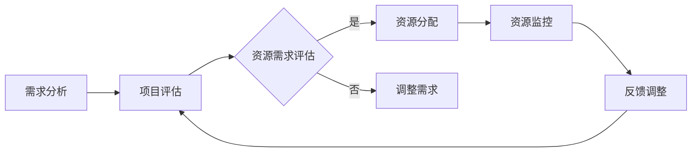
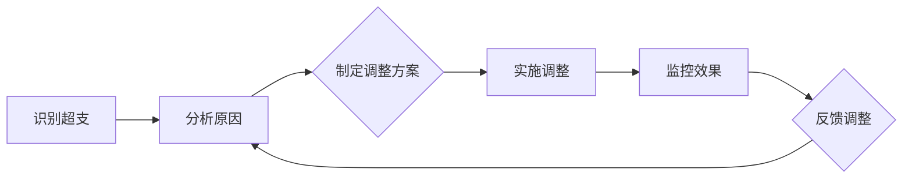
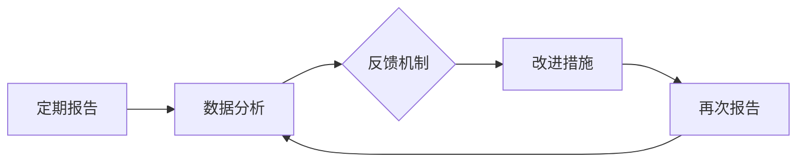

                 

### 文章标题

# 技术预算管理与资源分配

### 关键词

- 技术预算管理
- 资源分配
- 成本效益分析
- 风险管理
- 项目绩效评估
- 技术趋势

### 摘要

本文将深入探讨技术预算管理与资源分配在IT领域的重要性。首先，我们将了解技术预算管理的基本概念及其与财务规划的联系。接着，文章将详细介绍技术预算规划的步骤、制定技巧以及执行过程中的挑战。随后，文章将阐述资源分配策略、风险管理方法以及技术预算报告与绩效评估的关键环节。此外，通过实战案例和最佳实践分享，读者将更好地理解如何在实际项目中有效实施技术预算管理和资源分配。最后，文章将探讨未来技术预算管理面临的挑战以及应对策略。

----------------------------------------------------------------

### 第1章 核心概念与联系

#### 1.1 技术预算管理概述

技术预算管理是IT行业中的一项基础性工作，其核心目的是确保项目的资金投入与预期目标相匹配。技术预算管理不仅涉及对资金的使用计划，还包括对项目成本、风险以及资源利用的全面掌控。通过对技术预算的有效管理，企业能够更好地实现资源配置优化，提高项目的成功率。

**定义与范围**：
- 技术预算管理：是指对技术项目所需资金的计划、分配、监控和控制过程。它涵盖了从项目立项到项目结束的全过程。
- 资金使用计划：技术预算管理中的资金使用计划是对项目各个阶段所需资金的具体安排，包括初始投资、运营成本以及应急储备金等。

**重要性**：
技术预算管理在IT项目中的重要性体现在以下几个方面：
1. **成本控制**：通过技术预算管理，企业可以明确项目成本，避免超支，确保资金的有效利用。
2. **风险控制**：技术预算管理有助于识别和应对项目风险，确保项目能够在预算范围内完成。
3. **资源优化**：合理的技术预算管理能够优化资源配置，提高项目的效率和成功率。
4. **决策支持**：技术预算管理为项目决策提供了重要的数据支持，有助于企业做出更合理的投资决策。

#### 1.2 技术预算与财务规划的关系

技术预算管理是财务规划的重要组成部分，二者密切相关。财务规划是对企业整体财务状况的预测和管理，包括收入预测、支出预算、资本支出计划等。技术预算管理则是财务规划中具体到技术项目的预算安排。

**联系与区别**：
- **联系**：技术预算是财务规划中的一项具体预算，财务规划中的资本支出计划需要包括技术预算的内容。
- **区别**：财务规划是宏观层面的管理，涉及企业整体的财务状况，而技术预算管理是微观层面的管理，关注具体项目的资金使用。

**整合策略**：
- **协同管理**：将技术预算纳入财务规划中，通过建立统一的管理体系，实现技术预算与财务规划的有机整合。
- **定期评估**：定期对技术预算进行评估，将其与财务规划进行对比，确保技术预算的执行与财务规划的一致性。

#### 1.3 技术资源分配的基本原则

技术资源分配是技术预算管理的重要环节，其基本原则包括以下几方面：

**1. 成本效益原则**：
- 成本效益原则要求在分配资源时，必须考虑项目的整体效益，确保投入与产出之间的平衡。通过成本效益分析，可以明确哪些项目具有更高的投资回报率，从而优先分配资源。

**2. 风险优先原则**：
- 在资源分配时，需要考虑项目风险。风险优先原则要求将资源优先分配给风险较高的项目，以减少潜在的损失。同时，需要制定相应的风险管理策略，确保项目能够在风险可控的范围内进行。

**3. 效率优先原则**：
- 效率优先原则强调资源的高效利用。在分配资源时，需要考虑项目的紧急程度和关键性，确保资源能够在最需要的地方发挥最大作用。

**4. 平衡原则**：
- 平衡原则要求在资源分配时，考虑企业的整体利益，避免资源过度集中在某一部门或项目上。通过平衡资源分配，可以确保企业整体发展目标的实现。

### Mermaid流程图

以下是一个简化的技术资源分配流程图，展示了从需求分析到资源分配的过程：



### 伪代码与数学模型

以下是一个简单的成本效益分析的伪代码示例，用于计算项目的成本效益比（C/B比）：

```python
def cost_benefit_analysis(total_cost, total_benefit):
    C = total_cost
    B = total_benefit
    C_B_ratio = B / C
    return C_B_ratio

# 示例
total_cost = 10000
total_benefit = 15000
C_B_ratio = cost_benefit_analysis(total_cost, total_benefit)
print("Cost-Benefit Ratio:", C_B_ratio)
```

数学模型方面，我们可以使用以下公式来表示成本效益比：

$$ C/B = \frac{B}{C} $$

其中，C表示项目的总成本，B表示项目的总效益。

### 项目实战

#### 开发环境搭建

为了演示成本效益分析在实际项目中的应用，我们假设正在开发一个企业级管理系统。以下是搭建开发环境的具体步骤：

1. **确定开发语言**：选择Java作为主要开发语言，因为它在企业级应用中具有广泛的适用性。
2. **安装Java开发环境**：在服务器上安装Java SDK和IDE（如IntelliJ IDEA）。
3. **配置数据库**：选择MySQL作为后台数据库，并安装相关工具（如MySQL Workbench）。
4. **搭建测试环境**：在本地计算机上搭建测试环境，使用Docker容器技术简化部署和测试。

#### 源代码实现

以下是一个简单的Java类，用于实现成本效益分析的逻辑：

```java
public class CostBenefitCalculator {

    public static void main(String[] args) {
        double totalCost = 10000;
        double totalBenefit = 15000;
        double cbr = calculateCbr(totalCost, totalBenefit);
        System.out.println("Cost-Benefit Ratio: " + cbr);
    }

    public static double calculateCbr(double totalCost, double totalBenefit) {
        return totalBenefit / totalCost;
    }
}
```

#### 代码解读与分析

在上述代码中，我们定义了一个名为`CostBenefitCalculator`的Java类，包含一个`main`方法和一个`calculateCbr`方法。

- `main`方法：作为程序的入口点，初始化总成本和总效益，调用`calculateCbr`方法计算成本效益比，并打印结果。
- `calculateCbr`方法：接收总成本和总效益作为参数，返回计算得到的成本效益比。

#### 实际案例分析与详细讲解剖析

假设该项目在开发过程中遇到了一些技术挑战，如数据库性能瓶颈和前端界面优化问题。以下是针对这些问题的解决方案：

1. **数据库性能优化**：
   - 问题：MySQL数据库在高并发情况下出现性能瓶颈。
   - 解决方案：通过增加服务器资源、优化查询语句和引入缓存技术（如Redis）来提高数据库性能。

2. **前端界面优化**：
   - 问题：前端界面在数据量大时响应速度慢。
   - 解决方案：采用异步加载技术（如Ajax），优化CSS和JavaScript代码，减少页面的加载时间。

#### 项目小结

通过本案例，我们可以看到成本效益分析在项目中的应用，以及在项目开发过程中如何通过技术手段解决实际问题。有效的成本效益分析能够帮助团队在资源有限的情况下，做出更合理的决策，提高项目的成功率。

### 最佳实践 tips

1. **定期审查预算**：定期对技术预算进行审查，确保实际支出与预算相符，及时发现和解决问题。
2. **建立风险预警机制**：对项目风险进行评估，建立风险预警机制，提前制定应对策略。
3. **强化团队沟通**：在项目实施过程中，加强团队沟通，确保各成员对预算和资源分配有清晰的认识。
4. **利用工具辅助管理**：使用预算管理工具（如Concur、Microsoft Dynamics 365等），提高预算管理的效率。

### 小结

技术预算管理与资源分配在IT项目中具有重要作用。通过本文的探讨，我们了解了技术预算管理的基本概念、技术预算与财务规划的关系、技术资源分配的基本原则以及如何通过实际项目实战来应用这些原则。有效的技术预算管理和资源分配能够提高项目的成功率，为企业创造更大的价值。

### 注意事项

1. **明确项目目标**：在制定技术预算时，必须明确项目目标，确保预算与项目目标的一致性。
2. **充分考虑风险**：在资源分配过程中，要充分考虑项目风险，为可能的超支和风险预留一定的预算。
3. **优化资源配置**：通过合理的资源优化，提高项目的效率，确保资源的高效利用。

### 拓展阅读

1. 《项目管理知识体系指南（PMBOK）》
2. 《成本效益分析：战略规划与决策》（Cost-Benefit Analysis: Strategic Planning and Decision Making）
3. 《技术项目管理》（Technical Project Management）

----------------------------------------------------------------

### 第2章 技术预算规划与执行

#### 2.1 技术预算规划的步骤

技术预算规划是确保项目成功的关键环节，它涉及到对项目成本、时间、资源和风险的全面预测和计划。以下是技术预算规划的主要步骤：

**1. 需求分析**：
需求分析是技术预算规划的基础，它明确了项目的目标和需求。在这个阶段，需要与客户、业务团队和技术团队紧密合作，确保对项目需求有全面和准确的理解。

**2. 制定项目范围**：
项目范围定义了项目的边界和包含的内容。明确的项目范围有助于界定项目的规模和复杂性，为后续的成本估算提供依据。

**3. 成本估算**：
成本估算是技术预算规划的核心，它包括直接成本（如人力、硬件、软件等）和间接成本（如管理费用、风险预留等）。成本估算需要结合历史数据、市场调研和专家意见进行。

**4. 制定预算**：
在成本估算的基础上，制定技术预算。预算应包括各阶段的成本分配、应急储备金和风险管理预算。预算制定需要考虑项目的优先级、风险水平和资金的时间价值。

**5. 预算审批**：
技术预算需要经过相关利益方的审批，确保预算的合理性和可行性。审批过程中，需要评估预算的完整性和准确性，确保资金使用的合法合规。

**6. 预算跟踪**：
预算跟踪是确保预算执行过程透明和可控的重要手段。通过建立预算跟踪机制，可以及时发现和纠正偏差，确保项目在预算范围内顺利进行。

**7. 预算调整**：
在项目执行过程中，可能会出现预算偏差。预算调整是在出现偏差时，对预算进行重新规划和调整，以适应实际情况。合理的预算调整可以确保项目的顺利进行，同时避免不必要的资金浪费。

#### 2.2 制定技术预算的技巧

制定技术预算是一个复杂的过程，需要结合实际情况和专业知识。以下是制定技术预算的一些关键技巧：

**1. 充分调研**：
在制定预算之前，需要对市场、竞争对手和项目需求进行充分调研。了解行业标准和市场行情，有助于更准确地估算成本。

**2. 分阶段预算**：
将项目分为若干阶段，分别制定每个阶段的预算。分阶段预算有助于更好地控制项目成本，及时发现和解决问题。

**3. 风险预留**：
在预算中预留一定的风险资金，以应对项目实施过程中可能出现的风险和不确定性。合理的风险预留可以降低项目失败的风险。

**4. 利用历史数据**：
参考历史项目的数据，如成本、进度和风险情况，有助于制定更合理的预算。历史数据提供了宝贵的经验教训，有助于预测未来的成本和风险。

**5. 沟通与协调**：
与项目团队成员、利益相关者进行充分沟通，确保对预算的理解和认可。协调各部门的需求和资源，确保预算的可行性和合理性。

**6. 定期审查与调整**：
定期对预算进行审查和调整，确保预算的实时性和准确性。通过定期审查，可以及时发现和纠正偏差，确保项目按计划进行。

#### 2.3 技术预算执行中的挑战与应对策略

在技术预算执行过程中，可能会面临各种挑战，如成本超支、进度延误和资源不足等。以下是一些常见的挑战及应对策略：

**1. 成本超支**：
- **原因**：需求变更、资源不足、项目复杂性增加等。
- **应对策略**：加强需求管理，确保变更得到有效控制；提高资源利用率，减少浪费；增加风险预留，应对不确定因素。

**2. 进度延误**：
- **原因**：计划不周、资源分配不合理、技术难题等。
- **应对策略**：优化项目管理流程，确保计划的科学性；合理分配资源，确保关键路径的顺利进行；提前识别和解决技术难题。

**3. 资源不足**：
- **原因**：项目规模过大、资源竞争激烈、资源分配不当等。
- **应对策略**：优化资源分配策略，确保关键资源的优先供应；增加外部资源支持，如外包或临时招聘；与相关部门进行沟通，争取资源支持。

**4. 预算偏差**：
- **原因**：预算制定不合理、执行过程中管理不善等。
- **应对策略**：定期审查预算，及时发现和纠正偏差；加强预算执行过程中的监控和控制，确保预算的准确性和可行性。

#### 实战案例：大型企业IT系统的技术预算管理

**背景**：
某大型企业计划开发一套企业级IT系统，用于提高企业内部的信息化水平和管理效率。该项目涉及多个部门，包括研发、运维、财务等，预算总额为1亿元。

**预算规划**：
- 需求分析：通过多轮沟通和调研，明确了项目的功能需求和性能指标。
- 成本估算：结合历史数据和行业标准，进行了详细的成本估算，包括人力成本、硬件成本、软件成本等。
- 制定预算：在成本估算的基础上，制定了详细的技术预算，包括各阶段的成本分配、应急储备金和风险管理预算。
- 预算审批：经过多部门讨论和审批，最终确定了1亿元的预算总额。

**预算执行**：
- 预算跟踪：建立了预算跟踪机制，定期审查预算执行情况，发现了一些成本偏差。
- 预算调整：根据预算执行情况，进行了几次预算调整，确保项目在预算范围内顺利进行。

**挑战与应对**：
- **成本超支**：由于项目需求变更频繁，导致预算超支。应对策略是加强需求管理和变更控制，确保变更得到有效控制。
- **进度延误**：部分关键技术实现过程中遇到了困难，导致项目进度延误。应对策略是增加技术支持和资源投入，确保关键路径的顺利进行。

**小结**：
通过本案例，我们可以看到大型企业IT系统的技术预算管理面临的各种挑战及应对策略。有效的技术预算管理能够提高项目的成功率，为企业创造更大的价值。

#### 最佳实践 tips

1. **制定详细的预算计划**：在制定预算时，要详细列出各项成本的估算和分配，确保预算的准确性和可行性。
2. **建立预算跟踪机制**：定期审查预算执行情况，及时发现和纠正偏差，确保项目在预算范围内顺利进行。
3. **加强需求管理**：确保需求明确、可控，避免需求变更带来的预算超支和进度延误。
4. **预留风险资金**：在预算中预留一定的风险资金，以应对项目实施过程中可能出现的风险和不确定性。

### 小结

技术预算规划与执行是项目成功的关键环节。通过本文的探讨，我们了解了技术预算规划的步骤、制定技术预算的技巧以及技术预算执行中可能面临的挑战及应对策略。有效的技术预算管理能够提高项目的成功率，为企业创造更大的价值。

### 注意事项

1. **明确项目目标**：在制定技术预算时，必须明确项目目标，确保预算与项目目标的一致性。
2. **充分考虑风险**：在资源分配过程中，要充分考虑项目风险，为可能的超支和风险预留一定的预算。
3. **优化资源配置**：通过合理的资源优化，提高项目的效率，确保资源的高效利用。

### 拓展阅读

1. 《项目管理知识体系指南（PMBOK）》
2. 《成本效益分析：战略规划与决策》（Cost-Benefit Analysis: Strategic Planning and Decision Making）
3. 《技术项目管理》（Technical Project Management）

----------------------------------------------------------------

### 第3章 资源分配策略与方法

#### 3.1 资源分配的常用方法

资源分配是技术预算管理中的关键环节，其目标是在有限的资源条件下，实现项目的最优进度和成本效益。以下是几种常用的资源分配方法：

**1. 优先级分配法**

优先级分配法是一种基于项目优先级进行资源分配的方法。首先，根据项目的紧急程度、重要性以及风险等因素，将项目排序。然后，将资源优先分配给优先级较高的项目。这种方法适用于项目管理较为简单且项目数量较少的情况。

**2. 成本效益分析法**

成本效益分析法是基于项目的成本和效益进行资源分配的方法。通过计算每个项目的成本效益比（C/B比），将资源优先分配给效益更高的项目。这种方法适用于项目数量较多且每个项目都有明确的成本和效益指标的情况。

**3. 动态规划法**

动态规划法是一种基于项目进展情况进行资源分配的方法。通过将项目分为多个阶段，在每个阶段根据实际情况调整资源分配。这种方法适用于项目复杂度高且需求不断变化的情况。

**4. 模拟优化法**

模拟优化法是一种基于模拟模型进行资源分配的方法。通过建立项目的模拟模型，模拟不同资源分配方案下的项目进展和成本效益，选择最优的分配方案。这种方法适用于项目规模较大且资源有限的情况。

#### 3.2 成本效益分析在资源分配中的应用

成本效益分析是资源分配的重要工具，它通过评估项目的成本和效益，帮助决策者选择最优的资源配置方案。以下是如何在资源分配中应用成本效益分析的步骤：

**1. 明确项目目标**

首先，明确项目的目标，包括项目的功能需求、性能指标和效益预期。这有助于确定项目的优先级和成本效益分析的基准。

**2. 成本估算**

对每个项目进行成本估算，包括直接成本（如人力、硬件、软件等）和间接成本（如管理费用、风险预留等）。确保成本估算的准确性，以便后续的成本效益分析。

**3. 效益估算**

对每个项目进行效益估算，包括直接效益（如销售收入、成本节省等）和间接效益（如品牌价值、市场份额等）。效益的估算应尽量量化，以便进行准确的成本效益比较。

**4. 计算成本效益比**

计算每个项目的成本效益比（C/B比），即项目的效益除以成本。成本效益比越高，项目的价值越大。

**5. 资源分配决策**

根据成本效益比，对项目进行排序，将资源优先分配给成本效益比较高的项目。对于成本效益比相近的项目，可以根据项目的优先级、风险等因素进行选择。

**6. 持续评估与调整**

在项目实施过程中，持续对成本和效益进行评估，及时发现和纠正偏差。根据实际情况，调整资源分配方案，确保项目的顺利推进。

#### 3.3 技术资源分配的优先级设定

技术资源分配的优先级设定是确保项目顺利进行的关键。以下是一些常用的优先级设定方法：

**1. 项目优先级法**

项目优先级法是根据项目的紧急程度、重要性以及风险等因素，设定项目的优先级。通常，紧急且重要的项目会被优先分配资源。

**2. 成本效益优先级法**

成本效益优先级法是根据项目的成本效益比，设定项目的优先级。成本效益比较高的项目会被优先分配资源。

**3. 风险优先级法**

风险优先级法是根据项目的风险程度，设定项目的优先级。风险较高的项目会被优先分配资源，以便及时控制和减少风险。

**4. 群体投票法**

群体投票法是组织相关利益方，对项目进行投票，根据投票结果设定项目的优先级。这种方法适用于多部门协作的项目。

#### 实战案例：资源优化分配在软件开发项目中的应用

**背景**：
某软件开发公司正在同时进行三个项目：A项目是一个企业级管理系统，B项目是一个移动应用，C项目是一个大数据分析平台。公司资源有限，需要优化资源分配以最大化项目效益。

**需求分析**：
- A项目：功能复杂，预期效益高，但开发周期较长。
- B项目：市场需求旺盛，预期效益较高，但开发周期较短。
- C项目：技术难度大，预期效益不确定，但具有长远意义。

**资源分配方案**：

**方案一：优先级法**
- A项目：优先级最高，分配最多的资源。
- B项目：次优先级，分配中等资源。
- C项目：优先级最低，分配最少资源。

**方案二：成本效益分析法**
- A项目：成本效益比最高，分配最多资源。
- B项目：成本效益比次高，分配中等资源。
- C项目：成本效益比较低，但具有长远意义，分配最少资源。

**方案三：动态规划法**
- 阶段一：优先分配给A项目，确保关键功能实现。
- 阶段二：根据A项目的进展情况，调整资源分配，确保B项目按时上线。
- 阶段三：资源重点转向C项目，确保项目长期效益。

**方案四：模拟优化法**
- 通过建立模拟模型，模拟不同资源分配方案下的项目进展和效益。
- 选择最优的资源分配方案，确保项目在预算范围内顺利完成。

**挑战与应对**：
- **挑战**：项目之间存在资源竞争，需要平衡短期效益和长期发展。
- **应对**：通过定期评估和调整资源分配方案，确保项目按计划推进。

**小结**：
通过本案例，我们可以看到资源优化分配在不同项目中的应用，以及如何在不同策略之间进行选择和调整。有效的资源分配策略能够提高项目的成功率，为企业创造更大的价值。

### 最佳实践 tips

1. **定期评估与调整**：定期对资源分配进行评估和调整，确保资源的高效利用。
2. **合理分配风险资源**：为高风险项目预留更多的资源，以应对不确定因素。
3. **跨部门协同**：加强跨部门协作，确保资源分配的合理性和协调性。
4. **利用数据分析**：利用数据分析工具，对资源分配的效果进行定量评估。

### 小结

资源分配策略与方法在技术预算管理中具有重要地位。通过本文的探讨，我们了解了常用的资源分配方法、成本效益分析在资源分配中的应用以及技术资源分配的优先级设定。有效的资源分配策略能够提高项目的成功率，为企业创造更大的价值。

### 注意事项

1. **明确项目目标**：在资源分配过程中，要明确项目目标，确保资源分配与项目目标的一致性。
2. **充分考虑风险**：在资源分配过程中，要充分考虑项目风险，为可能的超支和风险预留一定的资源。
3. **优化资源配置**：通过合理的资源优化，提高项目的效率，确保资源的高效利用。

### 拓展阅读

1. 《项目管理知识体系指南（PMBOK）》
2. 《资源优化与分配》（Resource Optimization and Allocation）
3. 《项目管理中的成本效益分析》（Cost-Benefit Analysis in Project Management）

----------------------------------------------------------------

### 第4章 技术预算管理与风险管理

#### 4.1 技术预算管理的风险管理

技术预算管理中的风险管理是指对项目实施过程中可能出现的各种风险进行识别、评估和控制，以确保项目能够在预算范围内顺利实施。以下是技术预算管理中风险管理的主要步骤：

**1. 风险识别**

风险识别是风险管理的第一步，旨在发现项目实施过程中可能面临的风险。这可以通过以下方法实现：

- **专家评审**：邀请相关领域的专家对项目进行评审，识别潜在风险。
- **历史数据分析**：参考类似项目的风险记录，识别可能存在的风险。
- **问卷调查**：通过问卷调查的方式，收集团队成员对项目风险的看法和建议。

**2. 风险评估**

风险评估是对识别出的风险进行评估，确定其发生的可能性及其对项目的影响程度。以下是一些常用的风险评估方法：

- **风险矩阵**：通过风险矩阵，将风险的发生可能性与影响程度进行量化，确定风险等级。
- **蒙特卡罗模拟**：利用蒙特卡罗模拟方法，对风险事件的发生概率和影响程度进行模拟分析。

**3. 风险控制**

风险控制是指对评估出的风险制定相应的控制措施，以减少风险对项目的影响。以下是一些常见的风险控制措施：

- **风险规避**：通过调整项目计划，避免风险事件的发生。
- **风险转移**：通过购买保险或合同条款，将风险转移给第三方。
- **风险减轻**：通过技术手段和管理措施，降低风险事件的发生概率或影响程度。

**4. 风险监控**

风险监控是对项目实施过程中的风险进行持续跟踪和监控，以确保风险控制措施的有效性。以下是一些常用的风险监控方法：

- **定期评估**：定期对风险进行评估，发现新的风险并调整风险控制措施。
- **风险管理报告**：定期发布风险管理报告，向项目团队和利益相关者通报风险状况。

#### 4.2 技术项目风险评估

技术项目风险评估是技术预算管理的重要组成部分，它通过对项目风险进行全面分析，帮助决策者制定合理的风险应对策略。以下是技术项目风险评估的主要步骤：

**1. 确定评估目标**

在开始风险评估之前，需要明确评估的目标，包括评估的范围、内容和方法。这有助于确保评估工作的针对性和有效性。

**2. 收集数据**

收集与项目相关的数据，包括项目背景、技术需求、资源情况、市场状况等。这些数据是进行风险评估的基础。

**3. 识别风险**

根据收集到的数据，识别项目实施过程中可能面临的风险。可以通过专家评审、历史数据分析、问卷调查等方法进行风险识别。

**4. 评估风险**

对识别出的风险进行评估，确定其发生的可能性及其对项目的影响程度。可以使用风险矩阵、蒙特卡罗模拟等方法进行风险评估。

**5. 制定风险应对策略**

根据风险评估结果，制定相应的风险应对策略。风险应对策略包括风险规避、风险转移、风险减轻等。

**6. 实施风险控制**

在项目实施过程中，根据风险应对策略，实施相应的风险控制措施，确保风险在可控范围内。

**7. 监控与调整**

在项目实施过程中，持续监控风险状况，根据实际情况调整风险控制措施，确保项目按计划进行。

#### 4.3 预算超支与控制策略

预算超支是技术项目实施过程中常见的问题，它可能导致项目延误、质量下降或资金浪费。以下是一些常见的预算超支原因及控制策略：

**1. 成本估算不准确**

原因：需求变更、市场波动、技术复杂性等。
控制策略：加强需求管理和成本估算，提高成本估算的准确性。

**2. 项目管理不善**

原因：计划不周、沟通不畅、资源管理不当等。
控制策略：优化项目管理流程，提高项目管理效率。

**3. 技术难题**

原因：技术实现困难、技术更新换代等。
控制策略：提前识别技术难题，制定相应的解决方案，确保技术实现的可行性。

**4. 风险管理不当**

原因：风险评估不准确、风险控制措施不到位等。
控制策略：加强风险管理，确保风险在可控范围内。

以下是一个简化的预算超支控制流程图，展示了从识别超支到调整预算的过程：



#### 项目实战

**案例背景**：
某IT公司在开发一款新的企业级ERP系统，项目预算为5000万元。在项目实施过程中，出现了预算超支的问题。

**预算超支原因分析**：
- **需求变更**：在项目实施过程中，客户需求频繁变更，导致部分功能模块重复开发。
- **技术复杂性**：部分技术实现难度大，导致开发周期延长。
- **项目管理不善**：项目计划不周，沟通不畅，导致资源浪费。

**控制策略与实施**：

**1. 需求变更控制**：
- **措施**：建立需求变更审批流程，确保变更得到有效控制。
- **效果**：需求变更次数减少，项目进度得到恢复。

**2. 技术难题解决**：
- **措施**：组织技术团队进行技术攻关，引入外部技术支持。
- **效果**：技术难题得到解决，项目进度加快。

**3. 项目管理优化**：
- **措施**：优化项目管理流程，加强团队沟通和协作。
- **效果**：项目管理效率提高，资源浪费减少。

**总结**：
通过有效的控制措施，项目最终在预算范围内顺利完成。预算超支问题的解决，为公司的项目管理积累了宝贵的经验。

#### 小结

技术预算管理与风险管理在IT项目中具有重要作用。通过本文的探讨，我们了解了技术预算管理中的风险管理步骤、技术项目风险评估的方法以及预算超支的控制策略。有效的风险管理能够提高项目的成功率，确保项目在预算范围内顺利实施。

### 注意事项

1. **明确项目目标**：在制定预算和风险管理计划时，必须明确项目目标，确保预算和风险管理的方向与目标一致。
2. **加强需求管理**：需求变更可能导致预算超支，因此需要加强需求管理，确保项目需求稳定。
3. **优化项目管理**：提高项目管理效率，减少资源浪费，确保项目按计划进行。

### 拓展阅读

1. 《项目管理知识体系指南（PMBOK）》
2. 《风险管理：在IT项目中的应用》（Risk Management: Applications in IT Projects）
3. 《预算管理与控制》（Budget Management and Control）

----------------------------------------------------------------

### 第5章 技术预算报告与绩效评估

#### 5.1 技术预算报告的编制

技术预算报告是对项目预算执行情况的全面记录和总结，它包括预算编制、执行、调整及最终结果等内容。编制技术预算报告的目的是为项目决策提供数据支持和依据，确保项目在预算范围内顺利完成。

**1. 报告内容**

技术预算报告通常包括以下内容：

- **项目概述**：介绍项目的背景、目标、范围和进度。
- **预算编制**：详细列出项目各个阶段的预算分配，包括人力、硬件、软件等。
- **预算执行**：记录实际发生的成本，与预算进行比较，分析差异原因。
- **预算调整**：记录预算调整的原因和调整后的预算情况。
- **绩效评估**：对项目绩效进行评估，包括项目进度、成本、质量等方面的评估结果。
- **风险分析**：对项目实施过程中遇到的风险进行分析，评估风险的影响及应对措施。

**2. 编制流程**

技术预算报告的编制流程如下：

- **初步编制**：根据项目计划和预算编制情况，初步编制预算报告。
- **数据收集**：收集项目执行过程中的各项数据，包括成本、进度、质量等。
- **分析对比**：对收集到的数据进行整理和分析，与预算进行对比，找出差异和原因。
- **编制报告**：根据分析结果，编写详细的技术预算报告，包括差异分析、调整建议等。
- **审核与批准**：提交报告给相关部门和领导审核，根据反馈进行修改和完善，最终批准发布。

#### 5.2 技术预算执行情况的绩效评估

技术预算执行情况的绩效评估是衡量项目成功与否的重要指标。以下是如何对技术预算执行情况进行绩效评估：

**1. 评估指标**

技术预算执行情况的绩效评估通常包括以下指标：

- **成本绩效**：比较实际发生的成本与预算成本，计算成本偏差率。
- **进度绩效**：比较实际进度与计划进度，计算进度偏差率。
- **质量绩效**：评估项目交付物的质量，包括功能完整性、性能指标等。

**2. 评估方法**

技术预算执行情况的绩效评估方法包括：

- **成本绩效指数（CPI）**：CPI = 预算成本/实际成本，CPI > 1 表示成本节约，CPI < 1 表示成本超支。
- **进度绩效指数（SPI）**：SPI = 计划成本/实际成本，SPI > 1 表示进度提前，SPI < 1 表示进度延误。
- **质量评估报告**：对项目交付物进行质量评估，包括用户满意度、故障率等。

**3. 评估流程**

技术预算执行情况的绩效评估流程如下：

- **数据收集**：收集项目执行过程中的各项数据，包括成本、进度、质量等。
- **数据处理**：对收集到的数据进行整理和分析，计算各项评估指标。
- **评估报告**：编写绩效评估报告，详细记录评估结果和原因分析。
- **反馈与改进**：根据评估报告，找出存在的问题和不足，提出改进措施。

#### 5.3 基于预算的报告与反馈循环

基于预算的报告与反馈循环是确保项目在预算范围内顺利进行的重要机制。以下是如何构建基于预算的报告与反馈循环：

**1. 定期报告**

定期报告是确保项目进度和预算执行情况透明的重要手段。通常，项目团队会定期（如每周、每月）向项目管理者或利益相关者提交预算执行报告，包括成本、进度、质量等方面的数据。

**2. 反馈机制**

在报告提交后，项目管理者或利益相关者会对报告进行分析，提出反馈意见。这些反馈意见包括对预算执行情况的评估、存在的问题、改进建议等。

**3. 改进措施**

根据反馈意见，项目团队需要制定相应的改进措施，确保项目在预算范围内顺利进行。改进措施可能包括调整预算、优化资源分配、加强风险管理等。

**4. 反馈循环**

改进措施实施后，项目团队需要再次进行报告和反馈，确保问题得到有效解决。这种基于预算的报告与反馈循环有助于及时发现和解决问题，确保项目按计划推进。

以下是一个简化的基于预算的报告与反馈循环流程图：



#### 项目实战

**案例背景**：
某IT公司在开发一款大型电商平台，项目预算为1亿元。在项目实施过程中，项目团队定期编制技术预算报告，对预算执行情况进行监控和评估。

**预算报告编制**：
- **月度报告**：项目团队每月编制一次技术预算报告，包括成本、进度、质量等方面的数据。
- **数据收集**：收集项目执行过程中的各项数据，如人力成本、硬件采购、软件使用等。
- **数据分析**：对收集到的数据进行分析，计算成本绩效指数（CPI）和进度绩效指数（SPI）。
- **报告编制**：根据分析结果，编写详细的月度预算报告，提交给项目管理者。

**绩效评估与反馈**：
- **绩效评估**：项目管理者对月度预算报告进行分析，评估项目执行情况，发现一些成本超支和进度延误的问题。
- **反馈机制**：项目管理者向项目团队反馈存在的问题，并提出改进建议。
- **改进措施**：项目团队根据反馈，制定改进措施，如调整预算、优化资源分配、加强风险管理等。

**反馈循环**：
- **再次报告**：项目团队在实施改进措施后，再次编制月度预算报告，提交给项目管理者。
- **持续反馈**：项目管理者对改进后的项目执行情况进行持续监控和评估，确保问题得到有效解决。

**总结**：
通过基于预算的报告与反馈循环，项目团队及时发现和解决了预算超支和进度延误等问题，确保项目在预算范围内顺利实施。

### 最佳实践 tips

1. **定期报告**：确保定期编制技术预算报告，提高项目执行过程的透明度。
2. **数据收集与分析**：加强对项目数据的收集和分析，提高绩效评估的准确性。
3. **及时反馈与改进**：及时反馈和改进预算执行过程中出现的问题，确保项目按计划进行。

### 小结

技术预算报告与绩效评估在项目管理和预算控制中具有重要作用。通过本文的探讨，我们了解了技术预算报告的编制流程、技术预算执行情况的绩效评估方法以及基于预算的报告与反馈循环。有效的技术预算报告与绩效评估能够提高项目的成功率，确保项目在预算范围内顺利完成。

### 注意事项

1. **明确评估指标**：在绩效评估过程中，要明确各项评估指标，确保评估的准确性和全面性。
2. **加强数据收集**：确保收集到全面、准确的数据，提高绩效评估的可靠性。
3. **持续反馈与改进**：项目团队需要持续关注项目执行情况，及时反馈和改进，确保项目按计划推进。

### 拓展阅读

1. 《项目管理知识体系指南（PMBOK）》
2. 《绩效管理：战略与实施》（Performance Management: Strategy and Implementation）
3. 《技术预算报告编写指南》（Technical Budget Report Writing Guide）

----------------------------------------------------------------

### 第6章 实战案例与最佳实践

#### 6.1 案例一：技术预算管理在大型项目中的应用

**案例背景**：
某大型互联网公司计划开发一款社交平台，项目预算为2亿美元。该项目涉及众多技术领域，包括前端开发、后端服务、数据存储和网络安全等。

**技术预算管理**：
1. **需求分析**：项目团队进行了详细的需求分析，明确了社交平台的核心功能和性能要求。
2. **资源规划**：根据需求分析结果，项目团队制定了详细的资源规划，包括人力、硬件和软件资源。
3. **预算编制**：项目团队编制了详细的预算计划，包括每个阶段的成本分配和应急储备金。

**预算执行与监控**：
1. **月度报告**：项目团队每月编制一次技术预算报告，包括成本、进度和质量等方面的数据。
2. **绩效评估**：项目管理者对月度预算报告进行分析，评估项目执行情况，包括成本绩效指数（CPI）和进度绩效指数（SPI）。
3. **风险控制**：项目团队定期评估项目风险，制定相应的风险应对措施。

**效果与启示**：
通过有效的技术预算管理，项目团队成功控制了成本和进度，确保项目在预算范围内顺利完成。该案例表明，技术预算管理在大型项目中至关重要，有助于提高项目的成功率。

#### 6.2 案例二：资源优化分配的实践

**案例背景**：
某中小型软件公司正在同时进行多个项目，包括企业资源规划（ERP）系统、客户关系管理（CRM）系统和移动应用开发。公司资源有限，需要优化资源分配。

**资源优化分配**：
1. **优先级设定**：根据项目的紧急程度、重要性和风险，设定项目的优先级。
2. **成本效益分析**：对每个项目进行成本效益分析，选择成本效益比最高的项目优先分配资源。
3. **动态调整**：根据项目进展情况和资源需求，动态调整资源分配，确保关键项目得到足够的资源。

**效果与启示**：
通过优化资源分配，公司成功提高了项目的成功率，确保了关键项目的顺利推进。该案例表明，合理的资源优化分配能够提高资源利用效率，提高项目整体绩效。

#### 6.3 最佳实践分享

**1. 明确项目目标**：在制定技术预算和资源分配计划时，必须明确项目目标，确保预算和资源分配与项目目标的一致性。

**2. 预留风险资金**：在预算中预留一定的风险资金，以应对项目实施过程中可能出现的风险和不确定性。

**3. 加强需求管理**：加强需求管理，确保需求明确、稳定，避免频繁的需求变更导致成本超支和进度延误。

**4. 沟通与协作**：加强项目团队与利益相关者之间的沟通与协作，确保对预算和资源分配的理解和认可。

**5. 利用数据分析**：利用数据分析工具，对预算执行情况和资源利用情况进行实时监控和评估，及时发现问题并进行调整。

**6. 持续改进**：项目完成后，对技术预算管理和资源分配的实践进行总结和反思，持续改进管理方法，提高项目成功率。

### 小结

通过上述实战案例和最佳实践分享，我们可以看到技术预算管理和资源分配在项目成功中的关键作用。有效的技术预算管理和资源优化分配能够提高项目的成功率，为企业创造更大的价值。

### 注意事项

1. **明确项目目标**：在制定预算和资源分配计划时，必须明确项目目标，确保预算和资源分配与项目目标的一致性。
2. **预留风险资金**：在预算中预留一定的风险资金，以应对项目实施过程中可能出现的风险和不确定性。
3. **加强需求管理**：加强需求管理，确保需求明确、稳定，避免频繁的需求变更导致成本超支和进度延误。
4. **沟通与协作**：加强项目团队与利益相关者之间的沟通与协作，确保对预算和资源分配的理解和认可。

### 拓展阅读

1. 《项目管理知识体系指南（PMBOK）》
2. 《技术预算管理实践》（Practices in Technical Budget Management）
3. 《资源优化与分配》（Resource Optimization and Allocation）

----------------------------------------------------------------

### 第7章 未来趋势与挑战

#### 7.1 技术预算管理的未来趋势

随着技术的不断进步和市场的快速变化，技术预算管理也面临着新的机遇和挑战。以下是技术预算管理的未来趋势：

**1. 数字化转型加速**

数字化转型是当前企业发展的主流趋势，技术预算管理也将更加依赖数字化工具和平台。例如，通过云计算、大数据和人工智能等技术，可以实现对项目成本的实时监控和优化。

**2. 数据驱动决策**

数据驱动决策是未来技术预算管理的重要方向。通过收集和分析大量的项目数据，可以更准确地预测成本、评估风险，并制定更科学的预算计划。

**3. 智能预算工具应用**

随着人工智能技术的发展，智能预算工具将得到更广泛的应用。这些工具可以通过机器学习算法，自动识别项目风险，提供预算优化的建议，提高预算管理的效率和准确性。

**4. 生态系统整合**

未来技术预算管理将更加注重与企业内外部的生态系统整合。通过建立统一的数据平台和流程，可以实现跨部门、跨项目的资源优化和协同管理。

**5. 可持续发展与绿色预算**

随着可持续发展理念的普及，绿色预算将成为技术预算管理的一个重要方向。通过优化资源配置，减少能源消耗和碳排放，实现项目的环境可持续性。

#### 7.2 技术资源分配面临的挑战

尽管技术预算管理在未来将面临许多机遇，但同时也将面临一系列挑战：

**1. 需求的不确定性**

市场需求的不确定性是技术资源分配面临的主要挑战之一。在快速变化的市场环境中，需求可能随时发生变化，导致资源分配需要频繁调整。

**2. 技术复杂性增加**

随着技术的快速发展，项目的复杂性不断增加。这要求企业在资源分配时，需要具备更高的技术视野和管理能力，以确保资源能够合理分配。

**3. 资源竞争加剧**

在激烈的市场竞争中，企业需要争夺有限的资源，如人才、技术和资金。资源竞争的加剧将使得技术资源分配更加困难。

**4. 风险管理难度加大**

技术项目的风险类型不断增加，风险管理难度也相应加大。如何有效识别、评估和控制风险，是技术资源分配面临的重大挑战。

**5. 数据隐私与安全**

随着数据隐私和安全问题的日益突出，企业在技术资源分配时，需要充分考虑数据保护的需求。这将对技术资源分配提出更高的要求。

#### 7.3 应对未来趋势的策略建议

为了应对未来技术预算管理和资源分配的挑战，企业可以采取以下策略：

**1. 提高数字化能力**

通过引入数字化工具和平台，提高技术预算管理的效率和准确性。例如，使用云计算平台进行资源调度和管理，利用大数据分析进行需求预测和风险控制。

**2. 强化数据驱动决策**

建立数据驱动的决策体系，利用数据分析和人工智能技术，提高预算管理和资源分配的准确性。例如，通过数据挖掘技术，分析历史项目数据，优化预算编制和执行。

**3. 深化生态系统整合**

加强企业内外部的生态系统整合，实现跨部门、跨项目的资源协同管理。通过建立统一的数据平台和流程，提高资源利用效率。

**4. 强化风险管理**

建立完善的风险管理体系，提高风险识别、评估和控制的水平。通过定期风险评估和风险预警机制，提前识别和应对潜在风险。

**5. 关注可持续发展**

在技术资源分配时，充分考虑项目的环境可持续性。通过优化资源配置，减少能源消耗和碳排放，实现项目的可持续发展。

### 小结

未来技术预算管理和资源分配将面临许多机遇和挑战。通过本文的探讨，我们了解了技术预算管理的未来趋势以及面临的挑战，并提出了相应的策略建议。有效的技术预算管理和资源分配策略将有助于企业应对未来市场的变化，提高项目的成功率。

### 注意事项

1. **加强数字化能力**：提高企业的数字化水平，利用新技术提高预算管理的效率和准确性。
2. **强化数据驱动决策**：建立数据驱动的决策体系，提高预算管理和资源分配的准确性。
3. **深化生态系统整合**：加强企业内外部的生态系统整合，实现跨部门、跨项目的资源协同管理。
4. **强化风险管理**：建立完善的风险管理体系，提高风险识别、评估和控制的水平。
5. **关注可持续发展**：在技术资源分配时，充分考虑项目的环境可持续性。

### 拓展阅读

1. 《数字化转型战略》（Digital Transformation Strategies）
2. 《数据驱动的企业决策》（Data-Driven Decision Making in Business）
3. 《风险管理：理论与实践》（Risk Management: Theory and Practice）

## 作者信息

作者：AI天才研究院/AI Genius Institute & 禅与计算机程序设计艺术 /Zen And The Art of Computer Programming

### 结束

本文详细探讨了技术预算管理与资源分配在IT项目中的应用。我们介绍了技术预算管理的基本概念、预算规划与执行技巧、资源分配策略、风险管理以及绩效评估。通过实战案例和最佳实践，我们展示了如何在实际项目中应用这些理论。未来，随着数字化转型的加速，技术预算管理将面临新的机遇和挑战。通过提升数字化能力、强化数据驱动决策、深化生态系统整合、强化风险管理和关注可持续发展，企业可以更好地应对未来的挑战，提高项目的成功率。希望本文能为您在技术预算管理和资源分配方面提供有益的启示。感谢阅读！

